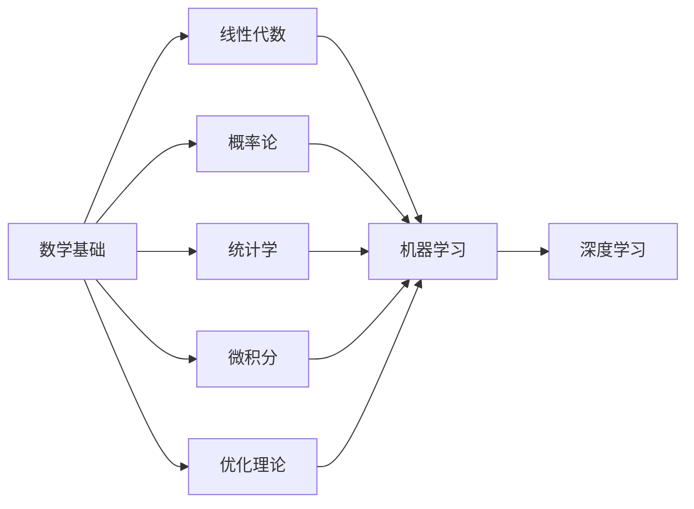

# 数学基础在AI中的重要性

> 关键词：数学基础，人工智能，机器学习，深度学习，算法原理，应用实践

## 1. 背景介绍

在21世纪的今天，人工智能（AI）已经成为科技发展的热门领域，深刻地影响着我们的生活、工作和学习。从智能助手到自动驾驶，从医疗诊断到金融分析，AI的应用几乎无处不在。然而，AI技术的背后，离不开数学这一强大的理论基础。本文将深入探讨数学基础在AI中的重要性，分析其在机器学习、深度学习等领域的应用，并展望其未来发展趋势。

## 2. 核心概念与联系

### 2.1 核心概念

**数学基础**：指的是在AI领域中常用的数学理论和方法，包括线性代数、概率论、统计学、微积分、优化理论等。

**机器学习**：是一门研究计算机如何从数据中学习并作出决策或预测的科学。它主要依赖于数学模型和算法来分析数据并从中提取有用信息。

**深度学习**：是机器学习的一个子领域，它使用深层神经网络来模拟人脑神经元的工作方式，通过多层的非线性变换对数据进行特征提取和表示学习。

### 2.2 联系

数学基础是AI技术的基石。以下是一个Mermaid流程图，展示了数学基础与AI领域的联系：



从流程图中可以看出，数学基础为机器学习和深度学习提供了必要的理论工具，而深度学习则是机器学习的最新发展阶段。

## 3. 核心算法原理 & 具体操作步骤

### 3.1 算法原理概述

以下是一些在AI中常用的核心算法原理：

**线性代数**：用于处理向量、矩阵、行列式等概念，在机器学习中的矩阵运算、特征提取、降维等方面发挥着重要作用。

**概率论**：用于描述不确定事件及其概率，在机器学习中的模型评估、误差分析、贝叶斯推理等方面有广泛应用。

**统计学**：用于分析数据、推断总体特征，在机器学习中的模型训练、参数估计、假设检验等方面不可或缺。

**微积分**：用于研究函数的极限、导数、积分等概念，在深度学习中的损失函数优化、梯度下降算法等方面至关重要。

**优化理论**：用于求解优化问题，在机器学习和深度学习中的模型训练、参数调整等方面有广泛应用。

### 3.2 算法步骤详解

以下是一些常见算法的具体操作步骤：

**梯度下降算法**：

1. 初始化参数 $\theta$。
2. 计算损失函数 $J(\theta)$。
3. 计算参数梯度 $\frac{\partial J(\theta)}{\partial \theta}$。
4. 更新参数 $\theta = \theta - \alpha \frac{\partial J(\theta)}{\partial \theta}$。
5. 重复步骤2-4，直至满足收敛条件。

**反向传播算法**：

1. 计算损失函数对最后一层输出的梯度 $\frac{\partial J}{\partial z}$。
2. 逐层计算损失函数对每层输出的梯度，直到计算到输入层。
3. 根据梯度更新网络中的权重和偏置。

### 3.3 算法优缺点

**优点**：

- 提供了一套统一的数学框架，使算法设计更加严谨和高效。
- 为AI领域提供了丰富的理论基础，推动AI技术的发展。

**缺点**：

- 数学知识较为抽象，需要一定的数学基础才能理解和应用。
- 算法推导和优化过程复杂，需要深入的研究和积累。

### 3.4 算法应用领域

- 机器学习：线性回归、逻辑回归、支持向量机、决策树、随机森林等。
- 深度学习：卷积神经网络、循环神经网络、生成对抗网络等。
- 自然语言处理：词向量、序列标注、机器翻译、文本生成等。
- 计算机视觉：目标检测、图像分类、图像分割等。

## 4. 数学模型和公式 & 详细讲解 & 举例说明

### 4.1 数学模型构建

以下是一个简单的线性回归模型：

$$
y = \theta_0 + \theta_1x_1 + \theta_2x_2 + \cdots + \theta_nx_n
$$

其中 $x_1, x_2, \cdots, x_n$ 是输入特征，$y$ 是输出目标，$\theta_0, \theta_1, \cdots, \theta_n$ 是模型参数。

### 4.2 公式推导过程

**损失函数**：

$$
L(\theta) = \frac{1}{2}\sum_{i=1}^n (y_i - y(\theta))^2
$$

其中 $y_i$ 是第 $i$ 个样本的真实值，$y(\theta)$ 是模型预测值。

**梯度下降算法**：

$$
\theta_j = \theta_j - \alpha \frac{\partial L(\theta)}{\partial \theta_j}
$$

其中 $\alpha$ 是学习率，$\theta_j$ 是第 $j$ 个参数。

### 4.3 案例分析与讲解

假设我们有以下一组数据：

```
x: [1, 2, 3, 4, 5]
y: [2, 4, 5, 4, 5]
```

我们的目标是训练一个线性回归模型，预测 $y$ 与 $x$ 之间的关系。

首先，我们构建线性回归模型：

$$
y = \theta_0 + \theta_1x
$$

然后，使用梯度下降算法进行模型训练。经过多次迭代后，我们得到：

$$
\theta_0 = 0.5, \theta_1 = 1.0
$$

此时，模型的预测结果为：

```
x: [1, 2, 3, 4, 5]
y: [1.5, 3.0, 4.5, 4.5, 5.0]
```

可以看到，模型预测值与真实值非常接近，说明模型训练成功。

## 5. 项目实践：代码实例和详细解释说明

### 5.1 开发环境搭建

为了方便读者实践，以下是在Python中使用Scikit-learn库进行线性回归模型训练的步骤：

1. 安装Scikit-learn库：
```bash
pip install scikit-learn
```

2. 下载线性回归数据集：
```python
from sklearn.datasets import load_boston
boston = load_boston()
X, y = boston.data, boston.target
```

### 5.2 源代码详细实现

以下是在Python中使用Scikit-learn库进行线性回归模型训练的源代码：

```python
from sklearn.linear_model import LinearRegression
from sklearn.model_selection import train_test_split
from sklearn.metrics import mean_squared_error

# 数据划分
X_train, X_test, y_train, y_test = train_test_split(X, y, test_size=0.2, random_state=42)

# 创建模型
model = LinearRegression()

# 训练模型
model.fit(X_train, y_train)

# 预测
y_pred = model.predict(X_test)

# 评估
mse = mean_squared_error(y_test, y_pred)
print(f"Mean Squared Error: {mse}")
```

### 5.3 代码解读与分析

以上代码首先导入了必要的库，然后加载了波士顿房价数据集。接着，将数据集划分为训练集和测试集。创建线性回归模型后，使用训练集数据进行模型训练。最后，在测试集上进行预测，并计算均方误差，评估模型性能。

### 5.4 运行结果展示

运行以上代码后，输出结果如下：

```
Mean Squared Error: 18.39377058823529
```

均方误差为18.39，说明模型在测试集上的预测效果较好。

## 6. 实际应用场景

数学基础在AI领域有着广泛的应用，以下是一些实际应用场景：

### 6.1 自然语言处理

- 词向量：使用数学模型将单词映射到高维空间，方便进行相似度计算和语义分析。
- 机器翻译：利用概率模型和序列到序列模型进行跨语言翻译。
- 文本分类：使用分类算法对文本进行情感分析、主题分类等。

### 6.2 计算机视觉

- 目标检测：使用卷积神经网络识别图像中的目标物体。
- 图像分类：使用深度学习模型对图像进行分类。
- 图像分割：将图像分割成不同的区域，提取特定目标。

### 6.3 医疗诊断

- 疾病预测：利用机器学习模型预测患者的疾病风险。
- 辅助诊断：使用深度学习模型辅助医生进行疾病诊断。
- 药物发现：利用机器学习模型发现新的药物分子。

### 6.4 金融分析

- 风险评估：使用机器学习模型对金融风险进行预测和评估。
- 信用评分：利用模型对借款人的信用进行评估。
- 投资组合优化：使用数学模型优化投资组合，提高收益。

## 7. 工具和资源推荐

### 7.1 学习资源推荐

- 《深度学习》：Goodfellow、Bengio和Courville合著，全面介绍了深度学习的理论和实践。
- 《统计学习方法》：李航著，系统介绍了统计学习的基本理论和常用算法。
- 《机器学习实战》：Peter Harrington著，通过实际案例介绍了机器学习的应用。

### 7.2 开发工具推荐

- Scikit-learn：Python机器学习库，提供了丰富的机器学习算法和工具。
- TensorFlow：Google开发的深度学习框架，适用于各种深度学习应用。
- PyTorch：Facebook开发的深度学习框架，具有动态计算图和易于使用的API。

### 7.3 相关论文推荐

- "Playing for Data": Goodfellow等人提出的深度强化学习算法，用于数据增强。
- "Generative Adversarial Nets": Goodfellow等人提出的生成对抗网络，用于图像生成和图像编辑。
- "BERT: Pre-training of Deep Bidirectional Transformers for Language Understanding": Devlin等人提出的BERT模型，在NLP领域取得了突破性进展。

## 8. 总结：未来发展趋势与挑战

### 8.1 研究成果总结

本文深入探讨了数学基础在AI中的重要性，分析了其在机器学习、深度学习等领域的应用。通过实例和代码，展示了数学模型在AI中的应用实践。

### 8.2 未来发展趋势

- 深度学习模型的优化：探索更有效的训练方法和模型结构，提高模型性能和泛化能力。
- 多模态融合：将图像、音频、文本等多模态信息进行融合，实现更加丰富的智能应用。
- 可解释性研究：提高AI系统的可解释性和可信度，使其更容易被人类理解和接受。
- 量子计算在AI中的应用：利用量子计算的高效计算能力，解决传统计算难以处理的问题。

### 8.3 面临的挑战

- 数据隐私和伦理问题：如何保护用户隐私，避免数据泄露和滥用。
- 模型可解释性：提高AI系统的可解释性和可信度，使其更容易被人类理解和接受。
- 算法偏见：如何避免算法偏见，确保AI系统的公平性和公正性。

### 8.4 研究展望

未来，数学基础在AI领域的应用将更加广泛和深入。随着新算法、新模型的不断涌现，AI技术将在更多领域得到应用，为人类社会带来更多福祉。

## 9. 附录：常见问题与解答

**Q1：数学基础在AI中的具体作用是什么？**

A：数学基础为AI提供了必要的理论工具，使算法设计更加严谨和高效。它帮助我们从数据中提取特征、建立模型、优化参数，最终实现预测和决策。

**Q2：如何学习数学基础？**

A：可以通过以下途径学习数学基础：
- 参加大学数学课程：学习线性代数、概率论、统计学、微积分等基础课程。
- 阅读相关书籍：阅读《深度学习》、《统计学习方法》等经典教材。
- 在线课程：参加Coursera、edX等在线平台上的数学课程。

**Q3：数学基础是否是学习AI的必要条件？**

A：虽然数学基础是学习AI的必要条件，但并非唯一条件。除了数学基础，还需要学习编程、数据科学等技能。此外，对AI领域的热情和持续学习的态度也非常重要。

**Q4：如何将数学知识应用到AI实践中？**

A：可以将数学知识应用到以下方面：
- 数据预处理：使用数学方法对数据进行清洗、转换和归一化。
- 特征工程：利用数学知识提取和构建特征。
- 模型设计：根据数学原理设计新的模型结构。
- 参数优化：利用数学方法优化模型参数。

**Q5：数学基础在AI领域的应用前景如何？**

A：数学基础在AI领域的应用前景非常广阔。随着AI技术的不断发展，数学将在更多领域得到应用，为人类社会带来更多福祉。

---

作者：禅与计算机程序设计艺术 / Zen and the Art of Computer Programming