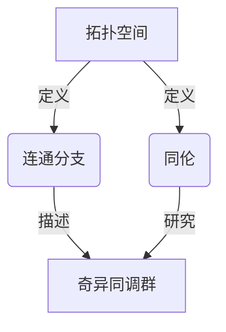
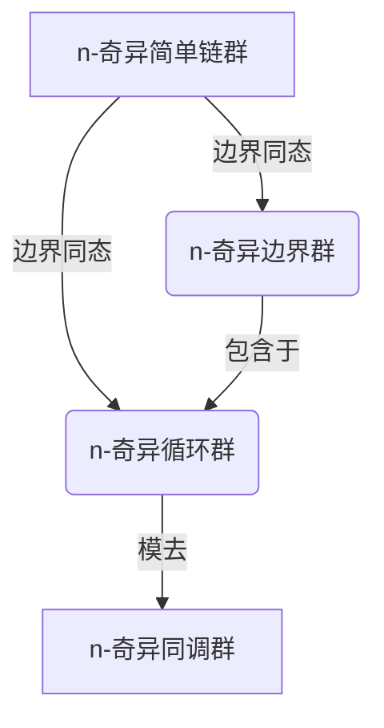

# 流形拓扑学理论与概念的实质：奇异同调群

## 1. 背景介绍

### 1.1 问题的由来

在数学和物理学领域中,拓扑学一直扮演着重要的角色。它为我们提供了一种研究空间几何结构的方式,并且在许多领域都有广泛的应用,如数据分析、计算机图形学、理论物理学等。然而,传统的拓扑学理论在处理一些复杂的几何对象时存在局限性,这就催生了流形拓扑学的兴起。

流形拓扑学是拓扑学的一个分支,它研究流形(Manifold)上的拓扑不变量。流形是一种在局部上类似于欧几里得空间的拓扑空间,可以想象成一个光滑的高维曲面。在流形上,我们可以定义诸如同调群(Homology Group)、奇异同调群(Singular Homology Group)等拓扑不变量,用于描述流形的拓扑性质。

### 1.2 研究现状

奇异同调群是流形拓扑学中最基本和最重要的概念之一。它是一种描述流形拓扑结构的代数不变量,可以用来区分不同的流形,并且在许多数学和物理学领域都有重要应用。

目前,奇异同调群理论已经得到了广泛的研究和发展。数学家们已经建立了完整的理论体系,并且发展出了许多计算奇异同调群的有效算法。同时,奇异同调群也被应用于许多实际问题中,如数据分析、计算机图形学、量子场论等。

### 1.3 研究意义

深入理解奇异同调群的理论和概念,对于我们更好地把握流形的拓扑结构至关重要。奇异同调群不仅是一种强大的数学工具,也是我们认识和描述复杂几何对象的重要手段。

此外,奇异同调群理论在许多应用领域都扮演着关键角色。例如,在数据分析中,我们可以利用奇异同调群来研究数据的拓扑结构;在计算机图形学中,奇异同调群可以用于表示和操作复杂的三维模型;在量子场论中,奇异同调群提供了一种描述量子场的数学框架。

因此,全面掌握奇异同调群的理论与概念,对于推动相关领域的发展具有重要意义。

### 1.4 本文结构

本文将全面深入地探讨奇异同调群的理论和概念。我们将从基本定义出发,逐步介绍奇异同调群的构造方法、性质和计算算法。同时,我们也将讨论奇异同调群在各个应用领域中的作用和应用实例。

文章的主要结构如下:

1. 背景介绍
2. 核心概念与联系
3. 核心算法原理与具体操作步骤
4. 数学模型和公式详细讲解与举例说明
5. 项目实践:代码实例和详细解释说明
6. 实际应用场景
7. 工具和资源推荐
8. 总结:未来发展趋势与挑战
9. 附录:常见问题与解答

## 2. 核心概念与联系

在深入探讨奇异同调群的理论之前,我们需要先了解一些基本的拓扑学概念,如拓扑空间、连通分支、同伦等。这些概念为我们理解奇异同调群奠定了基础。

拓扑空间是拓扑学的研究对象,它是一个抽象的集合,其中定义了开集的概念。连通分支描述了拓扑空间中的连通性质,而同伦则研究不同拓扑空间之间的等价关系。

奇异同调群正是建立在这些基本概念之上的一种代数不变量。它能够刻画拓扑空间的连通性质和高维洞穴结构,从而帮助我们更好地理解和区分不同的拓扑空间。

此外,奇异同调群还与其他一些重要的拓扑不变量密切相关,如de Rham上同调群、K理论等。通过研究这些不变量之间的联系,我们可以获得更深刻的拓扑学理解。

## 3. 核心算法原理与具体操作步骤

### 3.1 算法原理概述

奇异同调群的构造过程可以概括为以下几个主要步骤:

1. 定义n-奇异简单链群(Singular Simplicial Chain Group)
2. 构造边界同态(Boundary Homomorphism)
3. 计算n-奇异循环群(Singular Cycle Group)
4. 计算n-奇异边界群(Singular Boundary Group)
5. 定义n-奇异同调群为循环群模去边界群

这个过程看似复杂,但实际上反映了一种将拓扑空间的几何信息转化为代数不变量的思想。我们首先定义了描述拓扑空间的代数结构(简单链群),然后通过边界同态来捕获空间的连通性质,最终得到了能够刻画空间拓扑结构的同调群。

### 3.2 算法步骤详解

接下来,我们将详细介绍构造奇异同调群的每一个步骤。

#### 步骤1: 定义n-奇异简单链群

给定一个拓扑空间X,我们首先需要定义n-奇异简单链群$C_n(X)$。这是一个由所有n维奇异简单链(Singular Simplices)生成的自由abel群。

形式上,我们有:

$$C_n(X) = \bigoplus_{\sigma: \Delta^n \rightarrow X} \mathbb{Z}\sigma$$

其中,$\Delta^n$表示n维单位简单形,而$\sigma$是从$\Delta^n$到X的奇异映射。$\mathbb{Z}\sigma$表示由映射$\sigma$生成的无穷循环群,而$\bigoplus$表示这些群的直和。

通过这种构造,我们将X中的几何信息编码到了一个代数结构C_n(X)中。

#### 步骤2: 构造边界同态

接下来,我们需要定义边界同态$\partial_n: C_n(X) \rightarrow C_{n-1}(X)$,它将n维链映射到(n-1)维链的组合。

对于任意n维奇异单形$\sigma: \Delta^n \rightarrow X$,我们有:

$$\partial_n(\sigma) = \sum_{i=0}^n (-1)^i \sigma|_{[v_0,...,\hat{v_i},...,v_n]}$$

其中,$\sigma|_{[v_0,...,\hat{v_i},...,v_n]}$表示将$\sigma$限制在去掉第i个顶点的(n-1)维面上。

这个公式反映了将高维对象的边界表示为低维对象的思想,是构造同调群的关键步骤。

#### 步骤3: 计算n-奇异循环群

n-奇异循环群$Z_n(X)$是由所有在$\partial_n$下的循环元(边界为0的链)生成的子群:

$$Z_n(X) = \{c \in C_n(X) | \partial_n(c) = 0\}$$

循环元对应着在X中没有边界的n维"洞穴"结构,是我们最终要刻画的拓扑不变量。

#### 步骤4: 计算n-奇异边界群

n-奇异边界群$B_n(X)$是由所有在$\partial_{n+1}$下的边界元(来自(n+1)维链的边界)生成的子群:

$$B_n(X) = \{\partial_{n+1}(c) | c \in C_{n+1}(X)\}$$

边界元对应着在X中有边界的n维"洞穴"结构,我们需要将它们剔除以获得真正的拓扑不变量。

#### 步骤5: 定义n-奇异同调群

最后,我们定义n-奇异同调群$H_n(X)$为循环群模去边界群:

$$H_n(X) = Z_n(X) / B_n(X)$$

直观上,这个商群中的元素对应着没有边界且不能被任何(n+1)维链的边界所bound的n维"洞穴"结构。这些结构正是我们所要刻画的拓扑不变量。

通过以上步骤,我们成功将拓扑空间X的几何信息编码到了一个代数不变量$H_n(X)$中。这种代数化的过程使得我们能够利用群论的工具来研究和操作拓扑不变量。

### 3.3 算法优缺点

奇异同调群作为描述拓扑空间的代数不变量,具有以下优点:

1. 普适性强:可以应用于任意拓扑空间,而不受维度或光滑性的限制。
2. 计算方便:存在有效的算法来计算奇异同调群,如基于矩阵规约的算法。
3. 代数性质好:同调群满足一些良好的代数性质,如功能子代数等。
4. 与其他不变量联系密切:奇异同调群与其他重要的拓扑不变量(如de Rham同调群)存在着自然的等价关系。

但是,奇异同调群也存在一些缺点和局限性:

1. 计算复杂度高:对于高维流形或复杂拓扑空间,计算奇异同调群的复杂度会快速增长。
2. 不直观:同调群是一种抽象的代数不变量,不太直观,需要一定的数学功底来理解。
3. 信息有限:同调群只能刻画空间的连通性质和洞穴结构,而无法完全描述空间的几何形状。
4. 存在病态情况:在一些特殊情况下(如不可缩空间),同调群可能失去区分能力。

因此,在实际应用中,我们通常需要结合其他的拓扑不变量和几何信息来全面描述和分析拓扑空间。

### 3.4 算法应用领域

奇异同调群作为一种基本的拓扑不变量,在许多数学和科学领域都有广泛的应用。

1. **数据分析**:在数据分析中,我们可以将高维数据集视为一个拓扑空间,利用同调群来研究其拓扑结构,发现数据中的簇、环路和孔洞等重要特征。这种拓扑数据分析(Topological Data Analysis, TDA)方法已经被成功应用于多个领域,如生物信息学、计算机视觉等。

2. **计算机图形学**:在三维建模和可视化中,同调群可以用于表示和操作复杂的三维模型。例如,我们可以利用同调群来简化网格、检测和修复模型中的洞穴、进行拓扑等价变形等。

3. **理论物理学**:在量子场论、弦理论和其他一些前沿物理理论中,同调群提供了一种描述量子场和基本粒子的数学框架。例如,在扭量理论(Twistor Theory)中,同调群被用于研究基本粒子的拓扑性质。

4. **代数拓扑学**:同调群是代数拓扑学的核心概念之一。代数拓扑学将拓扑学和代数相结合,为我们研究复杂拓扑空间提供了强有力的工具。

5. **其他应用**:同调群还在机器人路径规划、计算机网络、分子生物学等领域有着广泛的应用。

总的来说,奇异同调群作为一种基本的拓扑不变量,为我们研究和理解复杂的几何结构提供了有力的数学工具。它的应用前景十分广阔,必将在未来的科学发展中扮演越来越重要的角色。

## 4. 数学模型和公式详细讲解与举例说明

在上一节中,我们介绍了构造奇异同调群的核心算法步骤。现在,让我们进一步深入探讨其中涉及的数学模型和公式。

### 4.1 数学模型构建

奇异同调群的构造过程实际上反映了一种将几何信息代数化的数学模型。我们将一个拓扑空间X转化为一系列代数结构(链群、循环群、