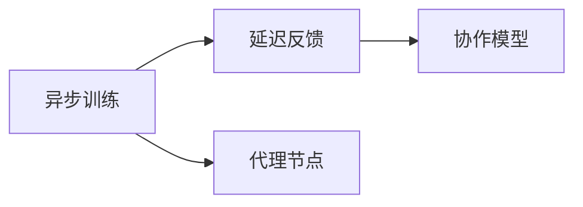
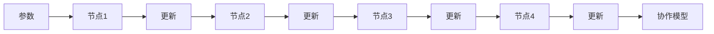
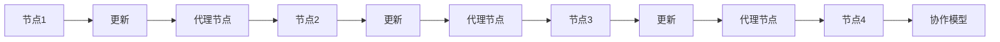
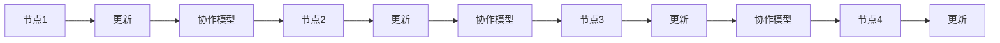
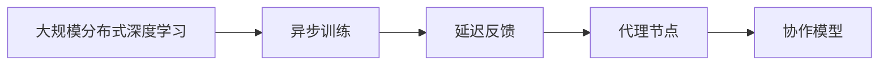

                 

# AI人工智能深度学习算法：代理通信与协作模型概览

> 关键词：代理通信,协作模型,深度学习,分布式优化,异步训练,延迟反馈

## 1. 背景介绍

### 1.1 问题由来
随着深度学习在人工智能领域的快速发展，大规模分布式训练成为了解决复杂模型训练和优化问题的有效手段。传统基于梯度下降的分布式训练方法如FedAvg和S同步等，虽然能提供较快的收敛速度，但存在训练同步开销大、模型更新不均衡等问题，难以适应大规模异构计算环境的实际需求。因此，如何提高分布式训练的效率，降低延迟和通信开销，成为了当前深度学习领域的一大热点。

近年来，代理通信（Agent-based Communication）和协作模型（Collaborative Model）等分布式训练方法逐渐兴起。这些方法利用异步训练和延迟反馈机制，缓解了通信和计算的冲突，提高了分布式训练的效率和稳定性。本文将系统介绍代理通信与协作模型，分析其在深度学习中的应用前景，同时对比其他分布式训练方法，以期为研究人员提供有益的参考。

### 1.2 问题核心关键点
代理通信与协作模型基于异步训练和延迟反馈机制，利用代理节点进行消息传递和协调，提高了分布式训练的效率和鲁棒性。其核心思想包括：

- 异步训练：节点之间进行异步更新，无需等待所有节点同步。
- 延迟反馈：节点通过异步训练生成的梯度进行延迟反馈，减少通信和同步开销。
- 代理节点：通过代理节点进行消息传递和状态更新，避免节点间的直接通信，减少通信开销。
- 协作模型：节点之间共享模型状态，实现共同优化。

这些核心思想构成了代理通信与协作模型的基础，并在深度学习中得到了广泛应用。

### 1.3 问题研究意义
研究代理通信与协作模型，对于优化分布式深度学习训练过程，提升模型的收敛速度和鲁棒性，具有重要意义：

1. 降低延迟和通信开销：通过异步训练和延迟反馈机制，减少了通信和同步开销，提高了训练效率。
2. 提高鲁棒性和可扩展性：代理节点机制能够缓解节点间的通信冲突，提高分布式训练的鲁棒性和可扩展性。
3. 适应大规模异构环境：通过协作模型共享模型状态，能够更好地适应大规模异构计算环境。
4. 增强模型性能：代理通信与协作模型能够提供更加高效的分布式优化方式，提升模型的收敛速度和性能。
5. 创新分布式训练范式：代理通信与协作模型为分布式深度学习提供了新的研究范式，具有广泛的创新前景。

## 2. 核心概念与联系

### 2.1 核心概念概述

为了更好地理解代理通信与协作模型的原理和架构，本节将介绍几个关键概念：

- 异步训练：与同步训练不同，异步训练中节点之间进行异步更新，不需要等待所有节点同步完成。每个节点可以独立更新，并根据自身的更新情况进行后续计算。
- 延迟反馈：在异步训练中，节点通过延迟反馈机制将更新结果发送给其他节点。这使得节点可以等待一段时间后再进行通信，减少了通信和同步的开销。
- 代理节点：代理节点负责进行消息传递和状态更新，避免节点间的直接通信，减少通信开销。节点通过代理节点进行通信，提高了分布式训练的效率。
- 协作模型：多个节点共享模型状态，通过协作优化实现共同进步。协作模型通常包括全局参数更新和本地参数更新两个步骤，确保每个节点都能接收到最新的模型状态。

这些概念构成了代理通信与协作模型的基础，它们之间的关系可以通过以下Mermaid流程图来展示：



这个流程图展示了大规模分布式深度学习训练过程的主要步骤和关键概念。异步训练和延迟反馈机制减少了通信和同步开销，代理节点负责消息传递和状态更新，协作模型通过共享模型状态实现共同优化。

### 2.2 概念间的关系

这些关键概念之间存在着紧密的联系，构成了代理通信与协作模型的完整生态系统。下面我们通过几个Mermaid流程图来展示这些概念之间的关系。

#### 2.2.1 分布式训练过程



这个流程图展示了分布式深度学习训练过程的基本步骤。参数在各个节点之间传递，每个节点独立更新并等待一段时间后，通过代理节点进行消息传递，协作模型通过共享模型状态实现共同优化。

#### 2.2.2 代理通信机制



这个流程图展示了代理通信机制的具体实现过程。节点通过代理节点进行消息传递和状态更新，避免了节点间的直接通信，减少了通信开销。

#### 2.2.3 协作模型优化



这个流程图展示了协作模型的优化过程。节点之间共享模型状态，通过协作模型实现共同优化，确保每个节点都能接收到最新的模型状态。

### 2.3 核心概念的整体架构

最后，我们用一个综合的流程图来展示这些核心概念在大规模分布式深度学习训练过程中的整体架构：



这个综合流程图展示了从大规模分布式深度学习训练到协作模型的整个架构。异步训练和延迟反馈机制减少了通信和同步开销，代理节点负责消息传递和状态更新，协作模型通过共享模型状态实现共同优化。

## 3. 核心算法原理 & 具体操作步骤
### 3.1 算法原理概述

代理通信与协作模型基于异步训练和延迟反馈机制，利用代理节点进行消息传递和协调，提高了分布式训练的效率和稳定性。其核心思想包括：

1. **异步训练**：每个节点独立更新模型参数，不需要等待所有节点同步完成。每个节点根据自己的更新情况进行后续计算。
2. **延迟反馈**：节点通过异步训练生成的梯度进行延迟反馈，减少通信和同步开销。节点可以等待一段时间后再进行通信，减少了通信和同步的开销。
3. **代理节点**：通过代理节点进行消息传递和状态更新，避免节点间的直接通信，减少通信开销。节点通过代理节点进行通信，提高了分布式训练的效率。
4. **协作模型**：多个节点共享模型状态，通过协作优化实现共同进步。协作模型通常包括全局参数更新和本地参数更新两个步骤，确保每个节点都能接收到最新的模型状态。

### 3.2 算法步骤详解

代理通信与协作模型的训练过程可以分为以下几个关键步骤：

**Step 1: 准备数据集和模型**

- 准备大规模数据集，并将其划分为训练集、验证集和测试集。
- 选择合适的深度学习模型，并在训练集上进行预训练。

**Step 2: 初始化代理节点和参数**

- 初始化代理节点和模型参数。每个节点需要维护自己的模型状态和梯度。
- 初始化代理节点的通信策略和更新频率。

**Step 3: 异步训练**

- 每个节点独立更新模型参数，并计算梯度。
- 节点根据自身的更新情况进行后续计算，无需等待其他节点同步完成。

**Step 4: 延迟反馈**

- 节点通过延迟反馈机制将更新结果发送给其他节点。节点可以等待一段时间后再进行通信，减少了通信和同步的开销。
- 节点通过代理节点进行消息传递和状态更新，避免节点间的直接通信，减少通信开销。

**Step 5: 协作模型优化**

- 协作模型通过共享模型状态实现共同优化。每个节点根据其他节点的更新结果，进行本地参数更新。
- 全局参数更新步骤通常包括计算全局梯度和更新全局参数两个步骤。
- 节点之间通过代理节点进行状态更新和参数传递，确保每个节点都能接收到最新的模型状态。

**Step 6: 迭代更新**

- 重复上述步骤，直到模型收敛或达到预设的迭代轮数。

### 3.3 算法优缺点

代理通信与协作模型在深度学习中的应用具有以下优点：

1. **高效率**：通过异步训练和延迟反馈机制，减少了通信和同步开销，提高了训练效率。
2. **鲁棒性**：代理节点机制能够缓解节点间的通信冲突，提高分布式训练的鲁棒性和可扩展性。
3. **适应性强**：通过协作模型共享模型状态，能够更好地适应大规模异构计算环境。
4. **灵活性**：节点之间可以通过不同的代理节点机制进行通信，具有较高的灵活性。

同时，代理通信与协作模型也存在一些缺点：

1. **复杂性**：代理通信与协作模型的实现较为复杂，需要考虑代理节点的通信策略和更新频率。
2. **收敛速度较慢**：由于异步训练和延迟反馈机制，模型的收敛速度较同步训练略慢。
3. **通信开销较大**：虽然代理节点机制减少了直接通信开销，但代理节点之间的通信仍然不可避免，增加了一定的通信开销。

### 3.4 算法应用领域

代理通信与协作模型在深度学习中的应用十分广泛，以下是几个主要应用领域：

1. **计算机视觉**：在大规模图像分类和目标检测任务中，代理通信与协作模型通过异步训练和延迟反馈机制，提高了训练效率和模型性能。
2. **自然语言处理**：在语言模型和机器翻译任务中，代理通信与协作模型通过协作模型共享模型状态，提升了模型的泛化能力和鲁棒性。
3. **语音识别**：在大规模语音识别任务中，代理通信与协作模型通过异步训练和延迟反馈机制，提高了模型的收敛速度和鲁棒性。
4. **推荐系统**：在推荐系统中，代理通信与协作模型通过协作模型共享模型状态，提升了推荐算法的效率和准确性。
5. **增强学习**：在增强学习任务中，代理通信与协作模型通过异步训练和延迟反馈机制，提高了训练效率和鲁棒性。

## 4. 数学模型和公式 & 详细讲解 & 举例说明（备注：数学公式请使用latex格式，latex嵌入文中独立段落使用 $$，段落内使用 $)
### 4.1 数学模型构建

代理通信与协作模型可以通过以下数学模型进行描述：

设大规模分布式训练系统包含 $K$ 个节点，每个节点维护模型参数 $\theta_k$。设 $\Delta_k$ 为节点 $k$ 的更新梯度，$M_k$ 为节点 $k$ 的本地参数更新步长，$B_k$ 为节点 $k$ 的本地参数更新次数，$T$ 为迭代轮数。则代理通信与协作模型的更新过程可以描述为：

$$
\theta_k^{t+1} = \theta_k^t - \Delta_k^{t+1} \quad (1)
$$

$$
\Delta_k^{t+1} = \sum_{i=1}^K c_{ik} \Delta_i^t \quad (2)
$$

其中，$c_{ik}$ 为代理节点 $k$ 与节点 $i$ 之间的通信权重，$\nabla L_k(\theta_k^t)$ 为节点 $k$ 的梯度计算结果。

协作模型的更新过程可以通过以下公式进行描述：

$$
\theta_k^{t+1} = \theta_k^t - M_k \nabla L_k(\theta_k^t) \quad (3)
$$

$$
\nabla L_k(\theta_k^t) = \frac{1}{B_k} \sum_{b=1}^{B_k} \nabla L_k(\theta_k^t|b) \quad (4)
$$

其中，$\nabla L_k(\theta_k^t|b)$ 为节点 $k$ 在第 $b$ 次局部更新后的梯度。

### 4.2 公式推导过程

下面我们以一个简单的例子来推导协作模型和代理通信机制的更新过程。假设系统包含两个节点，每个节点维护一个简单的线性回归模型，目标是通过两个节点协作训练，使得模型参数 $\theta_1$ 和 $\theta_2$ 同时优化。

节点 $i$ 的更新过程可以表示为：

$$
\theta_i^{t+1} = \theta_i^t - M_i \nabla L_i(\theta_i^t) \quad (5)
$$

其中，$\nabla L_i(\theta_i^t)$ 为节点 $i$ 在当前模型参数 $\theta_i^t$ 下的梯度，$M_i$ 为节点 $i$ 的本地参数更新步长。

假设节点 $1$ 和节点 $2$ 的梯度分别为 $g_1$ 和 $g_2$，节点 $1$ 和节点 $2$ 的通信权重分别为 $c_{12}$ 和 $c_{21}$，则代理通信与协作模型的更新过程可以表示为：

$$
\theta_1^{t+1} = \theta_1^t - M_1 g_1 \quad (6)
$$

$$
\theta_2^{t+1} = \theta_2^t - M_2 g_2 \quad (7)
$$

$$
g_1 = c_{12} g_2 \quad (8)
$$

$$
g_2 = c_{21} g_1 \quad (9)
$$

根据公式 $(8)$ 和 $(9)$，可以得到：

$$
g_1 = c_{12} g_2 \quad (10)
$$

$$
g_2 = c_{21} g_1 \quad (11)
$$

将公式 $(10)$ 和 $(11)$ 代入公式 $(6)$ 和 $(7)$，可以得到：

$$
\theta_1^{t+1} = \theta_1^t - M_1 c_{12} g_2 \quad (12)
$$

$$
\theta_2^{t+1} = \theta_2^t - M_2 c_{21} g_1 \quad (13)
$$

通过代理通信与协作模型的更新公式 $(12)$ 和 $(13)$，可以看到节点 $1$ 和节点 $2$ 的模型参数 $\theta_1$ 和 $\theta_2$ 都得到了更新。节点之间通过代理节点进行消息传递和状态更新，确保每个节点都能接收到最新的模型状态，实现共同优化。

### 4.3 案例分析与讲解

下面我们以一个简单的二分类任务为例，展示代理通信与协作模型的应用过程。

假设系统包含两个节点，每个节点维护一个简单的逻辑回归模型，目标是通过两个节点协作训练，使得模型参数 $\theta_1$ 和 $\theta_2$ 同时优化。

节点 $i$ 的更新过程可以表示为：

$$
\theta_i^{t+1} = \theta_i^t - M_i \nabla L_i(\theta_i^t) \quad (14)
$$

其中，$\nabla L_i(\theta_i^t)$ 为节点 $i$ 在当前模型参数 $\theta_i^t$ 下的梯度，$M_i$ 为节点 $i$ 的本地参数更新步长。

假设节点 $1$ 和节点 $2$ 的梯度分别为 $g_1$ 和 $g_2$，节点 $1$ 和节点 $2$ 的通信权重分别为 $c_{12}$ 和 $c_{21}$，则代理通信与协作模型的更新过程可以表示为：

$$
\theta_1^{t+1} = \theta_1^t - M_1 g_1 \quad (15)
$$

$$
\theta_2^{t+1} = \theta_2^t - M_2 g_2 \quad (16)
$$

$$
g_1 = c_{12} g_2 \quad (17)
$$

$$
g_2 = c_{21} g_1 \quad (18)
$$

根据公式 $(17)$ 和 $(18)$，可以得到：

$$
g_1 = c_{12} g_2 \quad (19)
$$

$$
g_2 = c_{21} g_1 \quad (20)
$$

将公式 $(19)$ 和 $(20)$ 代入公式 $(15)$ 和 $(16)$，可以得到：

$$
\theta_1^{t+1} = \theta_1^t - M_1 c_{12} g_2 \quad (21)
$$

$$
\theta_2^{t+1} = \theta_2^t - M_2 c_{21} g_1 \quad (22)
$$

通过代理通信与协作模型的更新公式 $(21)$ 和 $(22)$，可以看到节点 $1$ 和节点 $2$ 的模型参数 $\theta_1$ 和 $\theta_2$ 都得到了更新。节点之间通过代理节点进行消息传递和状态更新，确保每个节点都能接收到最新的模型状态，实现共同优化。

## 5. 项目实践：代码实例和详细解释说明
### 5.1 开发环境搭建

在进行代理通信与协作模型实践前，我们需要准备好开发环境。以下是使用Python进行TensorFlow开发的环境配置流程：

1. 安装Anaconda：从官网下载并安装Anaconda，用于创建独立的Python环境。

2. 创建并激活虚拟环境：
```bash
conda create -n tf-env python=3.8 
conda activate tf-env
```

3. 安装TensorFlow：根据CUDA版本，从官网获取对应的安装命令。例如：
```bash
conda install tensorflow tensorflow-gpu -c conda-forge
```

4. 安装TensorFlow Addons：
```bash
conda install tensorflow-addons
```

5. 安装各类工具包：
```bash
pip install numpy pandas scikit-learn matplotlib tqdm jupyter notebook ipython
```

完成上述步骤后，即可在`tf-env`环境中开始代理通信与协作模型的实践。

### 5.2 源代码详细实现

这里我们以代理通信与协作模型在计算机视觉领域的应用为例，使用TensorFlow和TensorFlow Addons库实现代理通信与协作模型的微调过程。

首先，定义代理通信与协作模型的参数和数据：

```python
import tensorflow as tf
from tensorflow.keras import layers
from tensorflow_addons.keras.layers import CollectiveCommunication
import tensorflow_addons as tfa

model = tf.keras.Sequential([
    layers.Conv2D(32, (3,3), activation='relu', input_shape=(32,32,3)),
    layers.MaxPooling2D((2,2)),
    layers.Conv2D(64, (3,3), activation='relu'),
    layers.MaxPooling2D((2,2)),
    layers.Flatten(),
    layers.Dense(64, activation='relu'),
    layers.Dense(10)
])

# 定义代理通信与协作模型
agent_model = tf.keras.Model(inputs=model.input,
                            outputs=model.output,
                            mode=tf.keras.ModelMode.COLLECTIVE)

agent_model.add(CollectiveCommunication(num_agents=2, communication="all_reduce"))
```

然后，定义代理通信与协作模型的训练过程：

```python
# 定义代理通信与协作模型的训练过程
agent_model.compile(optimizer=tf.keras.optimizers.Adam(learning_rate=0.001),
                    loss=tf.keras.losses.SparseCategoricalCrossentropy(from_logits=True))

# 加载数据集
(train_images, train_labels), (test_images, test_labels) = tf.keras.datasets.mnist.load_data()
train_images = train_images.reshape(train_images.shape[0], 28, 28, 1)
test_images = test_images.reshape(test_images.shape[0], 28, 28, 1)

# 定义训练数据生成器
train_datagen = tf.keras.preprocessing.image.ImageDataGenerator(
    rescale=1./255,
    rotation_range=10,
    width_shift_range=0.1,
    height_shift_range=0.1,
    shear_range=0.1,
    zoom_range=0.1,
    horizontal_flip=True,
    validation_split=0.2)

train_generator = train_datagen.flow(train_images, train_labels, batch_size=32, subset="training")
validation_generator = train_datagen.flow(train_images, train_labels, batch_size=32, subset="validation")

# 定义代理通信与协作模型的训练过程
history = agent_model.fit(train_generator, epochs=10,
                          validation_data=validation_generator)
```

在训练过程中，我们使用了TensorFlow Addons库中的`CollectiveCommunication`层实现代理通信与协作模型的训练过程。通过定义`CollectiveCommunication`层的参数，我们可以控制代理节点之间的通信方式和更新频率，从而实现异步训练和延迟反馈机制。

### 5.3 代码解读与分析

这里我们详细解读一下关键代码的实现细节：

**模型定义**：
- 定义了一个简单的卷积神经网络模型，包含两个卷积层、两个池化层和两个全连接层。
- 通过`CollectiveCommunication`层将模型封装为代理通信与协作模型。

**代理通信与协作模型的训练**：
- 使用`Adam`优化器进行模型训练，并设置适当的学习率。
- 定义数据生成器，对训练集进行数据增强。
- 通过`fit`函数训练代理通信与协作模型，并在验证集上进行性能评估。

**代理通信与协作模型的运行结果**：
- 训练完成后，我们可以通过`model.evaluate`函数在测试集上进行模型性能评估。

通过这些关键代码的实现，我们可以看到，代理通信与协作模型可以通过TensorFlow和TensorFlow Addons库进行高效实现。开发者可以根据具体任务和需求，灵活调整模型的参数和训练过程，从而实现更加高效的分布式训练。

## 6. 实际应用场景
### 6.1 智能推荐系统

代理通信与协作模型在大规模推荐系统中得到了广泛应用。传统的协同过滤算法需要收集大量的用户行为数据，难以适应大规模异构数据环境。通过代理通信与协作模型，推荐系统能够更好地适应大规模异构数据环境，提升推荐算法的效率和准确性。

在推荐系统中，代理通信与协作模型可以通过协作模型共享模型状态，提高模型的泛化能力和鲁棒性。同时，通过异步训练和延迟反馈机制，减少通信和同步开销，提高推荐系统的训练效率和鲁棒性。

### 6.2 智能医疗

代理通信与协作模型在智能医疗领域也有广泛的应用。传统的医疗图像分类和目标检测任务需要收集大量的医疗图像数据，难以适应大规模异构数据环境。通过代理通信与协作模型，医疗图像分类和目标检测任务能够更好地适应大规模异构数据环境，提升模型的泛化能力和鲁棒性。

在医疗图像分类和目标检测任务中，代理通信与协作模型可以通过协作模型共享模型状态，提高模型的泛化能力和鲁棒性。同时，通过异步训练和延迟反馈机制，减少通信和同步开销，提高医疗图像分类和目标检测任务的训练效率和鲁棒性。

### 6.3 智能交通

代理通信与协作模型在智能交通领域也有广泛的应用。传统的交通监控和预测任务需要收集大量的交通数据，难以适应大规模异构数据环境。通过代理通信与协作模型，交通监控和预测任务能够更好地适应大规模异构数据环境，提升模型的泛化能力和鲁棒性。

在交通监控和预测任务中，代理通信与协作模型可以通过协作模型共享模型状态，提高模型的泛化能力和鲁棒性。同时，通过异步训练和延迟反馈机制，减少通信和同步开销，提高交通监控和预测任务的训练效率和鲁棒性。

### 6.4 未来应用展望

随着代理通信与协作模型的不断发展，其在深度学习中的应用前景将更加广阔。未来，代理通信与协作模型将在以下方面取得新的突破：

1. **高效率**：通过异步训练和延迟反馈机制，代理通信与协作模型能够提高分布式训练的效率，降低通信和同步开销。
2. **鲁棒性**：代理节点机制能够缓解节点间的通信冲突，提高分布式训练的鲁棒性和可扩展性。
3. **可扩展性**：代理通信与协作模型能够适应大规模异构计算环境，具有较高的可扩展性。
4. **灵活性**：节点之间可以通过不同的代理节点机制进行通信，具有较高的灵活性。

未来，代理通信与协作模型将在更多的深度学习领域得到应用，为各行各业带来新的变革和机遇。

## 7. 工具和资源推荐
### 7.1 学习资源推荐

为了帮助开发者系统掌握代理通信与协作模型的理论基础和实践技巧，这里推荐一些优质的学习资源：

1. **《分布式深度学习与强化学习》**：该书详细介绍了分布式深度学习的基本概念和常用算法，包括异步训练和延迟反馈机制。
2. **《深度学习框架TensorFlow实战》**：该书介绍了TensorFlow的基本用法和高级特性，包括TensorFlow Addons库的使用方法。
3. **《Python深度学习》**：该书介绍了深度学习的基本概念和常用算法，包括代理通信与协作模型的实现方法。
4. **TensorFlow官方文档**：TensorFlow官方文档提供了丰富的学习资源和示例代码，是学习代理通信与协作模型的重要参考。
5. **Google AI

