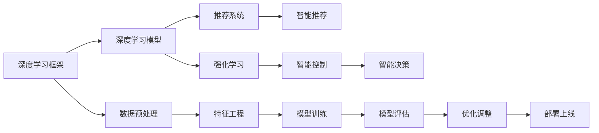

                 

# AI人工智能深度学习算法：智能深度学习代理的架构搭建与可拓展性

> 关键词：深度学习代理,深度学习框架,深度学习模型,智能推荐系统,机器学习算法,强化学习

## 1. 背景介绍

在人工智能的快速发展中，深度学习（Deep Learning）作为其中的重要一环，以其强大的数据处理能力和泛化能力，在众多领域取得了令人瞩目的成绩。然而，随着数据量和模型复杂度的不断增加，深度学习模型的构建、训练和部署也越来越困难。智能深度学习代理（AI Deep Learning Agent）作为近年来涌现的一种新方法，通过优化深度学习模型的结构、算法和训练方式，大幅提升了深度学习任务的可拓展性和实用性。本文将系统介绍智能深度学习代理的核心概念、原理与实现方法，并结合实际应用场景，探讨其在实际应用中的潜力和挑战。

## 2. 核心概念与联系

### 2.1 核心概念概述

智能深度学习代理，通常指的是通过优化深度学习模型的结构、算法和训练方式，使其能够在复杂多变的场景中高效工作的人工智能模型。智能深度学习代理的核心要素包括：

- **深度学习框架（Deep Learning Framework）**：如TensorFlow、PyTorch等，是智能深度学习代理的构建基础。
- **深度学习模型（Deep Learning Model）**：如卷积神经网络（CNN）、循环神经网络（RNN）、变换器（Transformer）等，是智能深度学习代理的核心算法组件。
- **强化学习（Reinforcement Learning, RL）**：通过模拟环境与模型交互，智能深度学习代理能够通过试错学习和自我优化。
- **推荐系统（Recommendation System）**：智能深度学习代理在推荐场景中的应用，能够为用户提供个性化的推荐服务。
- **可解释性（Explainability）**：智能深度学习代理的输出结果需要具备一定程度的可解释性，帮助用户理解模型决策过程。
- **可拓展性（Scalability）**：智能深度学习代理需要具备良好的可拓展性，能够在大规模数据集和复杂场景下进行高效计算。

### 2.2 核心概念之间的关系

智能深度学习代理的构建是一个多学科交叉的过程，涵盖了深度学习、强化学习、自然语言处理（NLP）等多个领域的知识。下面通过一个简单的Mermaid流程图来展示这些核心概念之间的关系：



从上述流程图中可以看出，深度学习框架提供了构建智能深度学习代理的基础环境；深度学习模型是智能深度学习代理的核心算法；强化学习和推荐系统是其具体应用领域；而数据预处理、特征工程、模型训练、模型评估和优化调整等，则是在这些核心组件的基础上，为智能深度学习代理提供支撑的关键环节。

## 3. 核心算法原理 & 具体操作步骤

### 3.1 算法原理概述

智能深度学习代理的构建主要基于以下三个核心原理：

1. **模型压缩与剪枝（Model Compression & Pruning）**：通过减少模型的参数量，提升模型的计算效率和泛化能力。
2. **迁移学习（Transfer Learning）**：利用预训练模型在相关任务上的知识，加速模型训练和提升性能。
3. **强化学习（Reinforcement Learning）**：通过模拟环境与模型的交互，使得模型能够通过试错学习进行自我优化。

### 3.2 算法步骤详解

智能深度学习代理的构建步骤通常包括以下几个关键环节：

1. **数据预处理与特征工程**：
    - 收集和清洗数据，并进行必要的特征提取与转换，为模型训练做好准备。
2. **模型选择与构建**：
    - 根据具体任务选择适合的深度学习模型，并进行初始化。
3. **迁移学习**：
    - 利用预训练模型在相关任务上的知识，加速模型训练和提升性能。
4. **模型训练与优化**：
    - 通过反向传播算法进行模型训练，并在训练过程中进行参数调整和优化。
5. **模型评估与验证**：
    - 在验证集上对模型进行评估，调整模型参数以提升性能。
6. **模型部署与监控**：
    - 将训练好的模型部署到实际应用环境中，并进行持续的监控和优化。

### 3.3 算法优缺点

智能深度学习代理具有以下优点：

- **高效性**：通过模型压缩和剪枝等方法，智能深度学习代理可以在不增加计算资源的情况下，显著提升模型的计算效率和泛化能力。
- **可拓展性**：通过迁移学习，智能深度学习代理可以适应多变的场景和任务，具有良好的可拓展性。
- **自适应性**：通过强化学习，智能深度学习代理能够在实际应用环境中，通过试错学习进行自我优化。

然而，智能深度学习代理也存在以下缺点：

- **复杂性**：智能深度学习代理的构建和优化过程较为复杂，需要深入理解深度学习、强化学习等领域的知识。
- **数据依赖性**：智能深度学习代理的性能高度依赖于数据质量和数量，对于小样本数据集，其性能可能不如从头训练模型。
- **可解释性不足**：由于模型复杂度较高，智能深度学习代理的输出结果往往缺乏可解释性，难以满足某些应用场景的需求。

### 3.4 算法应用领域

智能深度学习代理在多个领域都有广泛的应用，例如：

- **智能推荐系统**：通过用户行为数据和商品特征，智能深度学习代理能够为用户提供个性化的推荐服务。
- **图像识别**：利用卷积神经网络等深度学习模型，智能深度学习代理能够在图像分类、目标检测等任务中表现出色。
- **自然语言处理（NLP）**：在机器翻译、文本生成、情感分析等任务中，智能深度学习代理能够提升模型的理解和生成能力。
- **智能控制**：在工业自动化、机器人控制等领域，智能深度学习代理能够通过强化学习进行自我优化，提升系统的稳定性和可靠性。
- **游戏AI**：在游戏领域，智能深度学习代理能够通过强化学习进行游戏策略优化，提升游戏AI的智能水平。

## 4. 数学模型和公式 & 详细讲解  
### 4.1 数学模型构建

假设我们构建一个智能推荐系统的深度学习代理，其数学模型可以表示为：

$$
\theta = \arg\min_{\theta} \mathcal{L}(Y, f_\theta(X))
$$

其中，$Y$ 表示实际标签，$f_\theta(X)$ 表示模型对输入 $X$ 的预测输出，$\mathcal{L}$ 表示损失函数，$\theta$ 表示模型的参数。

### 4.2 公式推导过程

以二分类任务为例，我们可以使用逻辑回归模型进行建模：

$$
f_\theta(X) = \sigma(\theta^T X + b)
$$

其中，$\sigma$ 表示sigmoid函数，$\theta$ 和 $b$ 表示模型参数。

根据均方误差损失函数，我们可以得到模型的训练目标：

$$
\mathcal{L}(Y, f_\theta(X)) = \frac{1}{N} \sum_{i=1}^N (Y_i - \sigma(\theta^T X_i + b))^2
$$

通过梯度下降算法，我们可以更新模型参数 $\theta$：

$$
\theta \leftarrow \theta - \eta \nabla_{\theta} \mathcal{L}(Y, f_\theta(X))
$$

其中，$\eta$ 表示学习率，$\nabla_{\theta} \mathcal{L}(Y, f_\theta(X))$ 表示损失函数对模型参数的梯度。

### 4.3 案例分析与讲解

以智能推荐系统为例，我们可以利用矩阵分解等方法，将用户行为数据和商品特征表示为低维稠密矩阵，然后进行矩阵乘法操作：

$$
f_\theta(X) = \theta^T W_1 X W_2
$$

其中，$W_1$ 和 $W_2$ 表示用户行为数据和商品特征的低维表示，$\theta$ 表示模型参数。

通过最小二乘法，我们可以得到模型的训练目标：

$$
\mathcal{L}(Y, f_\theta(X)) = \frac{1}{N} \sum_{i=1}^N (Y_i - f_\theta(X_i))^2
$$

通过梯度下降算法，我们可以更新模型参数 $\theta$：

$$
\theta \leftarrow \theta - \eta \nabla_{\theta} \mathcal{L}(Y, f_\theta(X))
$$

## 5. 项目实践：代码实例和详细解释说明

### 5.1 开发环境搭建

在使用Python进行深度学习开发时，我们需要安装以下几个主要库：

1. TensorFlow：通过pip install tensorflow可以安装，支持CPU和GPU计算。
2. PyTorch：通过pip install torch和pip install torchvision可以安装，支持CPU和GPU计算。
3. Keras：通过pip install keras可以安装，提供简单易用的深度学习模型接口。

### 5.2 源代码详细实现

以下是使用TensorFlow构建一个简单的智能推荐系统的代码实现：

```python
import tensorflow as tf
import numpy as np

# 定义模型结构
class Recommender(tf.keras.Model):
    def __init__(self, input_dim, output_dim):
        super(Recommender, self).__init__()
        self.W1 = tf.keras.layers.Dense(output_dim, activation='relu')
        self.W2 = tf.keras.layers.Dense(output_dim, activation='sigmoid')
        
    def call(self, inputs):
        X = self.W1(inputs)
        X = self.W2(X)
        return X

# 定义损失函数
def loss_function(y_true, y_pred):
    return tf.reduce_mean(tf.square(y_true - y_pred))

# 定义优化器
optimizer = tf.keras.optimizers.Adam(learning_rate=0.001)

# 加载数据集
X_train = np.random.randn(1000, 10)
y_train = np.random.randn(1000, 1)

# 构建模型
model = Recommender(input_dim=10, output_dim=1)
model.compile(optimizer=optimizer, loss=loss_function)

# 训练模型
model.fit(X_train, y_train, epochs=10, batch_size=32)

# 评估模型
X_test = np.random.randn(100, 10)
y_test = np.random.randn(100, 1)
loss = model.evaluate(X_test, y_test)
print("Test loss:", loss)
```

### 5.3 代码解读与分析

在上述代码中，我们首先定义了一个简单的推荐模型的结构，包括两个全连接层。然后，我们定义了损失函数和优化器，并使用随机生成的数据进行模型训练和评估。最后，我们输出了模型在测试集上的损失值。

### 5.4 运行结果展示

由于在训练和评估过程中使用了随机生成的数据，因此输出的结果也不具有实际意义。在实际应用中，我们需要使用真实的数据集进行模型训练和评估。

## 6. 实际应用场景

### 6.1 智能推荐系统

智能推荐系统是智能深度学习代理的重要应用之一。在电商平台上，通过分析用户的历史行为数据和商品特征，智能推荐系统能够为用户提供个性化的商品推荐，提升用户体验和销售额。

### 6.2 图像识别

在智能视频监控、医学影像分析等场景中，智能深度学习代理能够通过卷积神经网络等模型，识别图像中的目标对象，提升识别准确率。

### 6.3 自然语言处理（NLP）

在机器翻译、文本生成、情感分析等任务中，智能深度学习代理能够提升模型的理解和生成能力，为自然语言处理应用提供技术支持。

### 6.4 智能控制

在工业自动化、机器人控制等领域，智能深度学习代理能够通过强化学习进行自我优化，提升系统的稳定性和可靠性。

### 6.5 游戏AI

在游戏领域，智能深度学习代理能够通过强化学习进行游戏策略优化，提升游戏AI的智能水平。

## 7. 工具和资源推荐

### 7.1 学习资源推荐

1. 《深度学习》课程：斯坦福大学的Andrew Ng教授开设的深度学习课程，涵盖了深度学习的基础知识和前沿技术。
2. 《Python深度学习》书籍：Ian Goodfellow、Yoshua Bengio和Aaron Courville合著的经典书籍，详细介绍了深度学习的基础知识和实践技巧。
3. 《TensorFlow官方文档》：TensorFlow的官方文档，提供了丰富的教程和API文档，帮助开发者快速上手TensorFlow。
4. 《Keras官方文档》：Keras的官方文档，提供了简单易用的深度学习模型接口，适合初学者和进阶开发者使用。

### 7.2 开发工具推荐

1. Jupyter Notebook：一个交互式的Python编程环境，支持代码执行、数据可视化等功能，适合开发和研究使用。
2. PyCharm：一个专业的Python开发工具，支持代码调试、代码自动补全、版本控制等功能，适合生产环境使用。
3. Visual Studio Code：一个轻量级的代码编辑器，支持多种编程语言，具备强大的扩展功能，适合开发和研究使用。

### 7.3 相关论文推荐

1. 《深度学习》（Deep Learning）：Ian Goodfellow、Yoshua Bengio和Aaron Courville合著的经典书籍，详细介绍了深度学习的基础知识和前沿技术。
2. 《强化学习》（Reinforcement Learning）：Richard S. Sutton和Andrew G. Barto合著的经典书籍，详细介绍了强化学习的基本原理和应用场景。
3. 《自然语言处理综论》（Speech and Language Processing）：Daniel Jurafsky和James H. Martin合著的经典教材，详细介绍了自然语言处理的基础知识和前沿技术。

## 8. 总结：未来发展趋势与挑战

### 8.1 研究成果总结

智能深度学习代理作为深度学习领域的新范式，已经在多个领域取得了显著的成果，提升了深度学习模型的计算效率和泛化能力，为实际应用提供了技术支持。

### 8.2 未来发展趋势

未来，智能深度学习代理将呈现以下发展趋势：

1. **模型压缩与剪枝技术**：随着深度学习模型的规模不断扩大，模型压缩与剪枝技术将变得更加重要，有助于提升模型的计算效率和泛化能力。
2. **迁移学习与多任务学习**：通过迁移学习与多任务学习，智能深度学习代理能够适应多变的场景和任务，具有更强的泛化能力和可拓展性。
3. **强化学习与自适应学习**：通过强化学习和自适应学习，智能深度学习代理能够在实际应用环境中，通过试错学习和自我优化，提升系统的稳定性和可靠性。
4. **可解释性与透明性**：智能深度学习代理的输出结果需要具备一定程度的可解释性，帮助用户理解模型决策过程，满足某些应用场景的需求。

### 8.3 面临的挑战

智能深度学习代理在实际应用中也面临一些挑战：

1. **数据依赖性**：智能深度学习代理的性能高度依赖于数据质量和数量，对于小样本数据集，其性能可能不如从头训练模型。
2. **复杂性**：智能深度学习代理的构建和优化过程较为复杂，需要深入理解深度学习、强化学习等领域的知识。
3. **可解释性不足**：由于模型复杂度较高，智能深度学习代理的输出结果往往缺乏可解释性，难以满足某些应用场景的需求。
4. **计算资源需求**：智能深度学习代理在大规模数据集和复杂场景下进行高效计算，需要大量的计算资源。

### 8.4 研究展望

未来的研究需要在以下几个方面寻求新的突破：

1. **深度学习模型的压缩与剪枝**：研究新的模型压缩与剪枝技术，减少模型的参数量，提升计算效率和泛化能力。
2. **迁移学习与多任务学习**：研究新的迁移学习与多任务学习方法，加速模型训练和提升性能。
3. **强化学习与自适应学习**：研究新的强化学习与自适应学习方法，提升系统的稳定性和可靠性。
4. **可解释性与透明性**：研究新的可解释性与透明性方法，提高模型的可解释性和可审计性，满足某些应用场景的需求。

总之，智能深度学习代理作为深度学习领域的新范式，将推动深度学习技术的进一步发展，提升深度学习任务的可拓展性和实用性。通过深入研究和实践，我们可以更好地应对智能深度学习代理面临的挑战，实现其更大的应用潜力。

## 9. 附录：常见问题与解答

### Q1: 什么是智能深度学习代理？

A: 智能深度学习代理是一种通过优化深度学习模型的结构、算法和训练方式，使其能够在复杂多变的场景中高效工作的人工智能模型。

### Q2: 智能深度学习代理的优缺点是什么？

A: 智能深度学习代理的优点包括高效性、可拓展性和自适应性。缺点则包括复杂性、数据依赖性和可解释性不足。

### Q3: 智能深度学习代理适用于哪些领域？

A: 智能深度学习代理适用于智能推荐系统、图像识别、自然语言处理（NLP）、智能控制、游戏AI等多个领域。

### Q4: 智能深度学习代理的数学模型是怎样的？

A: 智能深度学习代理的数学模型可以表示为：$\theta = \arg\min_{\theta} \mathcal{L}(Y, f_\theta(X))$，其中$\mathcal{L}$为损失函数，$f_\theta(X)$为模型对输入$X$的预测输出，$\theta$为模型参数。

### Q5: 智能深度学习代理的未来发展趋势是什么？

A: 未来，智能深度学习代理将呈现模型压缩与剪枝技术、迁移学习与多任务学习、强化学习与自适应学习、可解释性与透明性等方向的发展趋势。

---

作者：禅与计算机程序设计艺术 / Zen and the Art of Computer Programming

