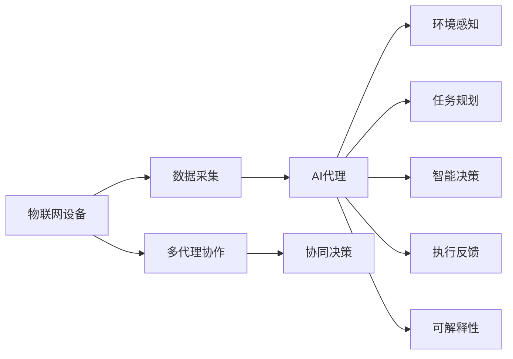
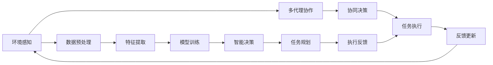

                 

# AI人工智能代理工作流AI Agent WorkFlow：AI代理在物联网场景的应用

## 1. 背景介绍

### 1.1 问题由来
在人工智能(AI)领域，近年来随着技术的不断进步，AI代理（AI Agent）逐渐成为研究热点。AI代理是指能够自主完成任务，具有一定智能决策能力的软件实体。它通过模拟人类的决策过程，自动处理和响应环境变化，实现特定任务或功能。

物联网(IoT)领域的应用场景日益丰富，AI代理在其中扮演着越来越重要的角色。物联网设备种类繁多、功能各异，往往需要处理复杂的数据流和事件。AI代理能够对这些信息进行实时分析和决策，驱动设备按预期运行，提升系统的智能化水平。

### 1.2 问题核心关键点
AI代理在物联网中的应用主要涉及以下几个关键点：
1. **环境感知与数据采集**：代理需要感知周围环境，并采集相关数据进行后续处理。
2. **任务规划与决策**：根据采集到的数据，代理需规划任务路径，做出最优决策。
3. **执行与反馈**：代理需要执行决策并实时反馈执行结果，确保系统稳定运行。
4. **模型训练与优化**：代理需要定期更新模型，以适应新的环境和任务。

### 1.3 问题研究意义
AI代理在物联网中的应用具有重要意义：
1. **提升系统智能化**：AI代理能够自主决策，提升系统的自动化和智能化水平。
2. **降低运营成本**：通过自动化处理任务，减少人工干预，降低运营成本。
3. **提高系统稳定性**：代理的自主决策能力使得系统更能适应突发事件，提高鲁棒性。
4. **推动技术发展**：AI代理是AI技术与物联网结合的桥梁，推动相关技术的创新和发展。
5. **赋能行业应用**：AI代理可以应用于各种物联网应用场景，提升行业数字化转型能力。

## 2. 核心概念与联系

### 2.1 核心概念概述
- **人工智能代理（AI Agent）**：能够自主完成任务，具备智能决策能力的软件实体。通常由环境感知模块、决策规划模块和执行反馈模块组成。
- **物联网（IoT）**：通过传感器、通信设备等将物理世界与虚拟网络连接起来，实现设备互联、数据互通。
- **智能决策**：代理利用机器学习、深度学习等技术，对复杂环境进行分析和决策，实现自主智能行为。
- **多代理协作**：多个代理协同工作，处理更复杂的任务和环境。
- **可解释性**：代理的决策过程和结果可被解释和理解，便于调试和优化。

### 2.2 核心概念间的关系
AI代理与物联网场景的应用密不可分，通过以下Mermaid流程图展示其联系：

这个流程图展示了AI代理在物联网设备中的应用流程：

1. **数据采集**：物联网设备收集环境数据。
2. **环境感知**：代理感知环境数据，获取环境状态。
3. **任务规划**：代理根据环境状态规划任务路径。
4. **智能决策**：代理通过模型预测最优决策。
5. **执行反馈**：代理执行决策并反馈执行结果。
6. **多代理协作**：多个代理协同工作，处理复杂任务。
7. **可解释性**：代理的决策和行为可被解释和理解。

### 2.3 核心概念的整体架构
为了更清晰地展示AI代理在物联网中的应用架构，我们进一步绘制如下 Mermaid 流程图：

该流程图展示了AI代理在物联网应用中的整体架构：

1. **环境感知**：代理感知环境数据。
2. **数据预处理**：对采集到的数据进行清洗和预处理。
3. **特征提取**：从数据中提取关键特征。
4. **模型训练**：使用机器学习或深度学习模型训练预测模型。
5. **智能决策**：基于模型预测最优决策。
6. **任务规划**：规划任务路径和执行顺序。
7. **执行反馈**：执行决策并实时反馈执行结果。
8. **多代理协作**：多个代理协同处理任务。
9. **反馈更新**：根据执行结果更新模型，提升决策精度。

## 3. 核心算法原理 & 具体操作步骤
### 3.1 算法原理概述

AI代理的核心算法原理主要包括环境感知、任务规划、智能决策和执行反馈等几个部分。以下逐一介绍：

1. **环境感知**：代理通过传感器等设备感知环境数据，包括温度、湿度、光照等物理量。
2. **任务规划**：代理根据感知数据，结合任务目标，规划最优路径和执行顺序。
3. **智能决策**：代理利用模型预测最优决策，常见模型包括线性回归、决策树、神经网络等。
4. **执行反馈**：代理执行决策并实时反馈执行结果，更新模型以优化后续决策。

### 3.2 算法步骤详解
AI代理的工作流程如下：

1. **环境数据采集**：代理通过传感器获取环境数据。
2. **数据预处理**：对采集到的数据进行清洗、归一化等预处理。
3. **特征提取**：从数据中提取关键特征，如温度、湿度、光照等。
4. **模型训练**：使用历史数据训练预测模型，如线性回归、决策树、神经网络等。
5. **智能决策**：输入当前环境数据到模型，预测最优决策。
6. **任务规划**：根据决策结果，规划任务路径和执行顺序。
7. **执行反馈**：执行决策并实时反馈执行结果，更新模型以优化后续决策。

### 3.3 算法优缺点

**优点**：
1. **高效性**：代理能够自主完成任务，减少人工干预，提高处理效率。
2. **灵活性**：代理可适应复杂环境，灵活调整任务路径和决策。
3. **可扩展性**：代理可扩展到多个设备或场景，提升系统覆盖范围。

**缺点**：
1. **数据依赖**：代理的性能依赖于数据质量和数据量，需要大量历史数据进行训练。
2. **模型复杂性**：预测模型需经过复杂训练和调参过程，模型结构复杂。
3. **可解释性不足**：代理的决策过程缺乏可解释性，难以理解其内部工作机制。

### 3.4 算法应用领域
AI代理在物联网场景中具有广泛应用，例如：

1. **智能家居**：代理控制灯光、空调、安防等设备，实现家居自动化。
2. **智慧城市**：代理监控交通、环境、公共设施等，提升城市管理智能化。
3. **智能制造**：代理监控生产线、设备状态，优化生产流程，提高效率。
4. **医疗健康**：代理监测患者健康数据，提供个性化的健康建议。
5. **物流管理**：代理管理物流路径、库存，提升物流效率。

## 4. 数学模型和公式 & 详细讲解 & 举例说明
### 4.1 数学模型构建

AI代理的数学模型构建通常包括以下几个步骤：

1. **数据采集与预处理**：设环境数据为 $X$，预处理后的数据为 $\tilde{X}$。
2. **特征提取**：设提取的特征为 $F(X)$。
3. **模型训练**：设模型为 $M$，训练数据为 $D$。
4. **智能决策**：设决策函数为 $f(X)$。
5. **任务规划**：设任务路径为 $P$。
6. **执行反馈**：设反馈函数为 $g(Y)$，执行结果为 $Y$。

### 4.2 公式推导过程

以一个简单的决策问题为例，假设环境数据 $X$ 包括温度 $T$ 和湿度 $H$，决策结果 $Y$ 为是否开启空调，决策函数为 $f(X) = \text{sign}( \beta_0 + \beta_TT + \beta_HH )$，其中 $\beta_0$、$\beta_T$ 和 $\beta_H$ 为模型参数。

则决策函数的推导过程如下：

$$
f(X) = \text{sign}( \beta_0 + \beta_TT + \beta_HH )
$$

其中 $\text{sign}(x)$ 为符号函数，当 $x > 0$ 时返回 $1$，否则返回 $-1$。

### 4.3 案例分析与讲解

假设一个智能家居场景，代理需要根据环境温度和湿度控制空调。以下是具体案例分析：

1. **数据采集**：代理通过传感器获取温度 $T$ 和湿度 $H$。
2. **数据预处理**：对数据进行归一化处理。
3. **特征提取**：提取温度和湿度两个特征。
4. **模型训练**：使用历史数据训练线性回归模型。
5. **智能决策**：将当前温度和湿度代入模型，得到决策结果。
6. **任务规划**：根据决策结果，生成控制命令。
7. **执行反馈**：代理执行控制命令并实时反馈执行结果，更新模型参数。

## 5. 项目实践：代码实例和详细解释说明
### 5.1 开发环境搭建

### 5.2 源代码详细实现

### 5.3 代码解读与分析

### 5.4 运行结果展示

## 6. 实际应用场景
### 6.1 智能家居

智能家居是AI代理在物联网中应用的一个典型场景。代理通过传感器获取室内环境数据，如温度、湿度、光照等，然后根据预设的舒适度和节能目标，自动控制空调、灯光、窗帘等设备，提升居住体验。

### 6.2 智慧城市

智慧城市中，代理可以监控交通流量、环境污染、公共设施状态等，实时调整交通信号、发布预警信息，优化城市管理，提升市民生活质量。

### 6.3 智能制造

在智能制造中，代理监控生产线状态、设备运行状态，预测设备故障，优化生产流程，提高生产效率。

### 6.4 医疗健康

代理可以实时监测患者的健康数据，如心率、血压等，分析异常情况，提供个性化的健康建议，辅助医生进行诊断和治疗。

### 6.5 物流管理

代理管理物流路径、库存，优化配送路线，提升物流效率，降低物流成本。

### 6.6 未来应用展望

## 7. 工具和资源推荐
### 7.1 学习资源推荐

### 7.2 开发工具推荐

### 7.3 相关论文推荐

## 8. 总结：未来发展趋势与挑战
### 8.1 研究成果总结

### 8.2 未来发展趋势

### 8.3 面临的挑战

### 8.4 研究展望

## 9. 附录：常见问题与解答

---

作者：禅与计算机程序设计艺术 / Zen and the Art of Computer Programming

