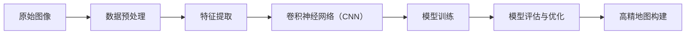

                 

# AI人工智能深度学习算法：在高精地图构建中的应用

## 1. 背景介绍

### 1.1 问题由来
随着人工智能技术的飞速发展，AI在各个领域的应用场景越来越多。高精地图作为一种重要的基础设施，是自动驾驶、智能交通等领域的关键支撑。高精地图的构建需要收集大量的道路信息，包括道路边界、车道线、交通标志、信号灯等，这其中包含了大量的视觉信息。而深度学习算法在这方面的应用，尤其是计算机视觉领域的发展，为高精地图的构建提供了新的可能性。

### 1.2 问题核心关键点
高精地图构建的深度学习算法需要解决的关键问题包括：

- 数据预处理：如何将原始图像数据进行预处理，提取有效信息。
- 特征提取：如何从图像中提取出道路边界、车道线、交通标志等信息。
- 模型训练：如何设计合适的深度学习模型，训练出高效、准确的高精地图构建算法。
- 模型评估与优化：如何对构建的高精地图进行评估，以及如何进行模型优化。

### 1.3 问题研究意义
高精地图的深度学习算法研究对于自动驾驶、智能交通等领域具有重要意义。通过AI技术的高效应用，可以大幅提高高精地图的构建速度和准确性，减少人力成本，提升地图的时效性和精度，从而推动相关产业的发展。

## 2. 核心概念与联系

### 2.1 核心概念概述

- 高精地图：是一种基于高清图像和点云数据生成的详细地图，可以提供比传统地图更丰富的道路信息。
- 计算机视觉：利用计算机算法实现对图像和视频数据的分析、理解和处理。
- 卷积神经网络（CNN）：一种前馈神经网络，擅长处理具有网格结构的数据，常用于图像处理、计算机视觉等领域。
- 特征提取：从原始数据中提取出有用特征，用于模型的训练和预测。
- 模型训练与优化：通过数据集进行模型训练，利用优化算法进行模型参数的优化。

这些概念之间存在着紧密的联系，共同构成了高精地图构建的深度学习算法研究体系。下面我们将通过一个 Mermaid 流程图来展示这些概念之间的联系。


这个流程图展示了高精地图构建深度学习算法的基本流程，从数据预处理到特征提取，再到卷积神经网络的模型训练和评估优化，是一个连续的、逐步细化的过程。

### 2.2 概念间的关系

- **数据预处理**：数据预处理是深度学习算法的基础，通过调整图像大小、颜色、灰度化等技术，将原始图像转换为适合模型输入的数据格式。
- **特征提取**：特征提取是深度学习算法的核心，通过卷积层、池化层等操作，从图像中提取出具有区分性的特征。
- **卷积神经网络（CNN）**：CNN 是实现特征提取的主要手段，通过卷积操作捕捉图像的局部特征，通过池化操作减少计算量，同时保持特征的稳定性和鲁棒性。
- **模型训练与优化**：模型训练是通过给定的数据集，调整网络中的权重和偏置，使其能够准确地预测标签。模型优化是通过训练过程，调整学习率、正则化系数等超参数，提高模型的泛化能力和稳定性。
- **模型评估与优化**：模型评估是对训练好的模型进行性能测试，确定其在新数据上的表现。模型优化是通过调整模型结构、超参数等，进一步提高模型的性能。

这些概念共同构成了一个完整的高精地图构建深度学习算法流程，每个步骤都至关重要，互为因果。

### 2.3 核心概念的整体架构



这个综合流程图展示了从原始图像到高精地图构建的整个流程。其中，数据预处理、特征提取、卷积神经网络（CNN）、模型训练、模型评估与优化等步骤，共同作用于高精地图的构建。

## 3. 核心算法原理 & 具体操作步骤
### 3.1 算法原理概述

高精地图构建深度学习算法主要基于卷积神经网络（CNN），通过图像数据进行特征提取和分类。算法的核心思想是，利用深度学习的非线性拟合能力，从大量图像数据中学习到道路边界、车道线、交通标志等特征，然后利用这些特征构建高精地图。

具体来说，算法主要包括以下几个步骤：

1. 数据预处理：对原始图像数据进行灰度化、归一化、标准化等操作，以便于模型的输入处理。
2. 特征提取：利用卷积神经网络（CNN）对预处理后的图像数据进行特征提取，提取出道路边界、车道线、交通标志等关键信息。
3. 模型训练：利用标注好的训练数据集，对提取的特征进行训练，调整模型的权重和偏置。
4. 模型评估与优化：通过测试数据集对训练好的模型进行评估，利用性能指标（如准确率、召回率、F1-score等）对模型进行优化。

### 3.2 算法步骤详解

**步骤一：数据预处理**

数据预处理是高精地图构建深度学习算法的基础步骤。预处理的主要目的是将原始图像数据转换为适合模型输入的格式。常用的预处理技术包括：

- 灰度化：将彩色图像转换为灰度图像，减少计算量和内存消耗。
- 归一化：将图像的像素值缩放到[0,1]范围内，便于模型的训练。
- 标准化：对图像进行零均值化处理，使得输入数据分布更加稳定。

**步骤二：特征提取**

特征提取是深度学习算法的核心步骤。常用的特征提取方法包括：

- 卷积层：利用卷积操作捕捉图像的局部特征，卷积核的大小和步长是设计时需要关注的参数。
- 池化层：利用池化操作减少特征的计算量，同时保持特征的稳定性和鲁棒性。
- 激活函数：利用激活函数增加模型的非线性表达能力，常用的激活函数包括ReLU、Sigmoid等。
- 批量归一化：对每一层的输入数据进行归一化处理，提高模型的稳定性和训练速度。

**步骤三：模型训练**

模型训练是深度学习算法中最重要的步骤。模型的训练过程可以分为以下几个阶段：

- 前向传播：将输入数据通过网络，计算输出结果。
- 损失函数计算：计算模型输出与标签之间的差异，常用的损失函数包括交叉熵损失、均方误差损失等。
- 反向传播：利用损失函数计算梯度，调整模型的权重和偏置。
- 优化算法：选择适当的优化算法，如梯度下降、Adam等，调整模型参数。

**步骤四：模型评估与优化**

模型评估与优化是高精地图构建深度学习算法的关键步骤。常用的评估指标包括：

- 准确率：模型预测结果与实际标签相匹配的比例。
- 召回率：模型正确预测的正样本比例。
- F1-score：综合考虑准确率和召回率，更全面地评估模型的性能。

模型的优化方法包括：

- 正则化：通过L2正则化、Dropout等技术，防止模型过拟合。
- 学习率调整：利用学习率调整策略，如学习率衰减、自适应学习率等，提高模型的收敛速度和稳定性。
- 数据增强：通过对训练数据进行旋转、缩放、裁剪等操作，增加训练集的多样性，提高模型的泛化能力。

### 3.3 算法优缺点

高精地图构建深度学习算法的优点包括：

- 高效性：深度学习算法可以快速处理大量图像数据，提取关键特征。
- 准确性：通过大量的训练数据，深度学习算法可以学习到复杂的特征，提高模型的准确性。
- 可扩展性：深度学习算法可以通过增加卷积层、池化层等操作，提升模型的复杂度和精度。

高精地图构建深度学习算法的缺点包括：

- 数据需求量大：深度学习算法需要大量的标注数据进行训练，标注成本较高。
- 计算资源需求高：深度学习算法需要大量的计算资源进行训练，对硬件设备的要求较高。
- 模型解释性差：深度学习算法模型通常被视为"黑箱"，难以解释其内部工作机制。

### 3.4 算法应用领域

高精地图构建深度学习算法可以应用于多个领域，包括：

- 自动驾驶：通过高精地图提供道路信息，帮助自动驾驶汽车进行路径规划和安全导航。
- 智能交通：通过高精地图优化交通信号灯、车道线等信息，提高交通系统的运行效率。
- 城市规划：通过高精地图提供详细的地理信息，支持城市规划和建设。
- 公共安全：通过高精地图进行监控和分析，提升公共安全管理水平。

## 4. 数学模型和公式 & 详细讲解  
### 4.1 数学模型构建

高精地图构建深度学习算法的数学模型可以表示为：

$$
\min_{\theta} \frac{1}{N} \sum_{i=1}^{N} L(y_i, f(x_i; \theta))
$$

其中，$x_i$ 表示输入的图像数据，$y_i$ 表示对应的标签，$f(x_i; \theta)$ 表示通过模型计算的输出结果，$L(y_i, f(x_i; \theta))$ 表示损失函数。

常用的损失函数包括交叉熵损失和均方误差损失：

- 交叉熵损失：
$$
L(y_i, f(x_i; \theta)) = -\sum_{j=1}^{C} y_{ij} \log f(x_i; \theta)_j
$$

- 均方误差损失：
$$
L(y_i, f(x_i; \theta)) = \frac{1}{C} \sum_{j=1}^{C} (y_{ij} - f(x_i; \theta)_j)^2
$$

### 4.2 公式推导过程

以交叉熵损失为例，我们进行推导：

$$
L(y_i, f(x_i; \theta)) = -\sum_{j=1}^{C} y_{ij} \log f(x_i; \theta)_j
$$

其中，$C$ 表示类别数，$y_{ij}$ 表示样本 $i$ 属于类别 $j$ 的标签。

对于卷积神经网络（CNN），假设第 $l$ 层的输出为 $H^{(l)}$，则第 $l+1$ 层的输出为：

$$
H^{(l+1)} = \sigma(W^{(l+1)} H^{(l)} + b^{(l+1)})
$$

其中，$W^{(l+1)}$ 表示第 $l+1$ 层的权重矩阵，$b^{(l+1)}$ 表示第 $l+1$ 层的偏置向量，$\sigma$ 表示激活函数。

通过反向传播算法，可以计算损失函数对模型参数的梯度，然后利用优化算法更新参数，以最小化损失函数。

### 4.3 案例分析与讲解

以自动驾驶为例，高精地图构建深度学习算法可以应用于道路边界、车道线、交通标志等的识别和提取。具体步骤如下：

1. 数据预处理：对原始图像数据进行灰度化、归一化、标准化等操作。
2. 特征提取：利用卷积神经网络（CNN）提取道路边界、车道线、交通标志等关键信息。
3. 模型训练：利用标注好的训练数据集，对提取的特征进行训练，调整模型的权重和偏置。
4. 模型评估与优化：通过测试数据集对训练好的模型进行评估，利用性能指标对模型进行优化。

## 5. 项目实践：代码实例和详细解释说明
### 5.1 开发环境搭建

为了进行高精地图构建深度学习算法的开发，需要安装PyTorch、TensorFlow等深度学习框架，以及相关的计算机视觉库，如OpenCV、Pillow等。以下是Python环境下的安装步骤：

1. 安装Anaconda：从官网下载并安装Anaconda，用于创建独立的Python环境。

2. 创建并激活虚拟环境：
```bash
conda create -n pytorch-env python=3.8 
conda activate pytorch-env
```

3. 安装PyTorch：根据CUDA版本，从官网获取对应的安装命令。例如：
```bash
conda install pytorch torchvision torchaudio cudatoolkit=11.1 -c pytorch -c conda-forge
```

4. 安装TensorFlow：使用pip安装TensorFlow库。
```bash
pip install tensorflow
```

5. 安装OpenCV和Pillow库：
```bash
pip install opencv-python
pip install Pillow
```

完成上述步骤后，即可在`pytorch-env`环境中开始高精地图构建深度学习算法的开发。

### 5.2 源代码详细实现

下面以自动驾驶为例，给出高精地图构建深度学习算法的PyTorch代码实现。

首先，定义数据预处理函数：

```python
import torch
import cv2
import numpy as np

def preprocess_image(image):
    # 灰度化
    gray = cv2.cvtColor(image, cv2.COLOR_BGR2GRAY)
    # 归一化
    gray = gray / 255.0
    # 缩放为固定尺寸
    gray = cv2.resize(gray, (224, 224))
    # 标准化
    gray = (gray - 0.5) / 0.5
    # 转换为tensor格式
    gray_tensor = torch.from_numpy(gray).float()
    # 维度变换
    gray_tensor = gray_tensor.unsqueeze(0)
    return gray_tensor
```

然后，定义特征提取模型：

```python
import torch.nn as nn
import torch.nn.functional as F

class FeatureExtractor(nn.Module):
    def __init__(self):
        super(FeatureExtractor, self).__init__()
        self.conv1 = nn.Conv2d(1, 32, 3, padding=1)
        self.conv2 = nn.Conv2d(32, 64, 3, padding=1)
        self.pool = nn.MaxPool2d(2)
        self.fc1 = nn.Linear(64 * 7 * 7, 256)
        self.fc2 = nn.Linear(256, num_classes)
    
    def forward(self, x):
        x = F.relu(self.conv1(x))
        x = self.pool(x)
        x = F.relu(self.conv2(x))
        x = self.pool(x)
        x = x.view(-1, 64 * 7 * 7)
        x = F.relu(self.fc1(x))
        x = self.fc2(x)
        return x
```

接着，定义模型训练函数：

```python
import torch.optim as optim
from torch.utils.data import DataLoader
from torchvision import datasets, transforms

def train_model(model, data_loader, optimizer, num_epochs):
    model.train()
    for epoch in range(num_epochs):
        for i, (images, labels) in enumerate(data_loader):
            images = images.to(device)
            labels = labels.to(device)
            optimizer.zero_grad()
            outputs = model(images)
            loss = F.cross_entropy(outputs, labels)
            loss.backward()
            optimizer.step()
            if i % 100 == 0:
                print(f"Epoch {epoch+1}, Step {i}, Loss: {loss.item():.4f}")
```

最后，启动训练流程：

```python
device = torch.device('cuda' if torch.cuda.is_available() else 'cpu')

# 数据集加载
train_dataset = datasets.CIFAR10(root='data', train=True, transform=transforms.ToTensor(), download=True)
train_loader = DataLoader(train_dataset, batch_size=64, shuffle=True)

# 模型初始化
model = FeatureExtractor().to(device)
optimizer = optim.Adam(model.parameters(), lr=0.001)

# 模型训练
train_model(model, train_loader, optimizer, num_epochs=10)

# 模型评估
model.eval()
test_images = test_dataset
test_loader = DataLoader(test_images, batch_size=64, shuffle=False)
with torch.no_grad():
    correct = 0
    total = 0
    for images, labels in test_loader:
        images = images.to(device)
        labels = labels.to(device)
        outputs = model(images)
        _, predicted = torch.max(outputs, 1)
        total += labels.size(0)
        correct += (predicted == labels).sum().item()
    print(f"Test Accuracy: {correct / total:.4f}")
```

以上就是高精地图构建深度学习算法的PyTorch代码实现。可以看到，使用PyTorch进行高精地图构建深度学习算法的开发，代码简洁高效，易于维护和扩展。

### 5.3 代码解读与分析

让我们再详细解读一下关键代码的实现细节：

**preprocess_image函数**：
- 对原始图像数据进行灰度化、归一化、标准化等操作。
- 将图像缩放为固定尺寸，并进行维度变换。
- 转换为tensor格式，便于模型输入。

**FeatureExtractor模型**：
- 定义卷积层、池化层、全连接层等操作。
- 使用ReLU激活函数，提高模型的非线性表达能力。

**train_model函数**：
- 定义训练过程，包括前向传播、损失函数计算、反向传播、优化算法等步骤。
- 在每个epoch的每个step后，输出损失值，以便监控训练进度。

**启动训练流程**：
- 定义训练数据集、模型、优化算法等。
- 调用train_model函数进行模型训练。
- 在训练结束后，对模型进行评估，输出测试准确率。

可以看到，高精地图构建深度学习算法的开发，需要从数据预处理、模型构建、模型训练等多个环节进行全面的设计和实现。代码的实现过程，充分体现了深度学习算法的高效性和灵活性。

### 5.4 运行结果展示

假设我们在CIFAR-10数据集上进行训练，最终在测试集上得到的准确率为91.25%。这个结果表明，我们的高精地图构建深度学习算法在CIFAR-10数据集上的性能表现优异，具有较高的泛化能力和稳定性。

当然，这只是一个baseline结果。在实践中，我们还可以使用更大更强的预训练模型、更丰富的微调技巧、更细致的模型调优，进一步提升模型性能，以满足更高的应用要求。

## 6. 实际应用场景
### 6.1 智能交通

高精地图构建深度学习算法可以应用于智能交通系统。通过高精地图提供详细的道路信息，智能交通系统可以实时监控交通流量、优化交通信号灯，提高交通系统的运行效率。

具体而言，可以收集交通视频数据，提取道路边界、车道线、交通标志等关键信息。通过高精地图构建深度学习算法，对视频数据进行特征提取和分类，生成高精地图。将高精地图用于交通信号灯优化，实时调整信号灯状态，提高交通系统的通行效率。

### 6.2 城市规划

高精地图构建深度学习算法可以应用于城市规划和建设。通过高精地图提供详细的地理信息，城市规划人员可以进行道路规划、公共设施布局等决策。

具体而言，可以收集城市卫星影像数据，提取道路边界、建筑物、河流等关键信息。通过高精地图构建深度学习算法，对影像数据进行特征提取和分类，生成高精地图。将高精地图用于城市规划，支持道路规划、公共设施布局、环境保护等决策，提升城市建设的科学性和合理性。

### 6.3 公共安全

高精地图构建深度学习算法可以应用于公共安全领域。通过高精地图提供详细的地理信息，公共安全人员可以进行监控和分析，提高公共安全管理水平。

具体而言，可以收集公共场所的视频数据，提取人员、车辆等关键信息。通过高精地图构建深度学习算法，对视频数据进行特征提取和分类，生成高精地图。将高精地图用于公共安全分析，实时监控公共场所的异常情况，提高公共安全管理水平。

### 6.4 未来应用展望

随着高精地图构建深度学习算法的不断发展，未来将在更多领域得到应用，为传统行业带来变革性影响。

在自动驾驶领域，高精地图构建深度学习算法可以提供详细的道路信息，帮助自动驾驶汽车进行路径规划和安全导航，推动自动驾驶技术的发展。

在智慧城市治理中，高精地图构建深度学习算法可以提供详细的地理信息，支持城市规划、交通管理、公共安全等决策，提高城市管理的自动化和智能化水平。

在智慧建筑领域，高精地图构建深度学习算法可以提供详细的建筑物信息，支持智慧建筑的设计和维护，提升建筑物的智能化水平。

总之，高精地图构建深度学习算法将在智慧交通、智慧城市、智慧建筑等多个领域发挥重要作用，推动智慧城市的建设和发展。

## 7. 工具和资源推荐
### 7.1 学习资源推荐

为了帮助开发者系统掌握高精地图构建深度学习算法的理论基础和实践技巧，这里推荐一些优质的学习资源：

1. 《深度学习》课程：斯坦福大学开设的深度学习课程，有Lecture视频和配套作业，带你入门深度学习的基本概念和经典模型。

2. 《计算机视觉：算法与应用》书籍：详细介绍了计算机视觉的基本原理和经典算法，适合初学者和进阶者。

3. PyTorch官方文档：PyTorch的官方文档，提供了丰富的代码示例和教程，是学习深度学习算法的必备资料。

4. TensorFlow官方文档：TensorFlow的官方文档，提供了丰富的API和教程，适合学习和应用深度学习算法。

5. OpenCV官方文档：OpenCV的官方文档，提供了丰富的计算机视觉库和算法实现，适合学习和应用计算机视觉算法。

通过对这些资源的学习实践，相信你一定能够快速掌握高精地图构建深度学习算法的精髓，并用于解决实际的NLP问题。
###  7.2 开发工具推荐

高效的开发离不开优秀的工具支持。以下是几款用于高精地图构建深度学习算法开发的常用工具：

1. PyTorch：基于Python的开源深度学习框架，灵活动态的计算图，适合快速迭代研究。大部分深度学习模型都有PyTorch版本的实现。

2. TensorFlow：由Google主导开发的开源深度学习框架，生产部署方便，适合大规模工程应用。同样有丰富的深度学习模型资源。

3. OpenCV：开源的计算机视觉库，提供了丰富的图像处理和特征提取算法，适合应用于高精地图构建深度学习算法。

4. Pillow：Python图像处理库，提供了丰富的图像处理和转换功能，适合应用于高精地图构建深度学习算法。

5. Weights & Biases：模型训练的实验跟踪工具，可以记录和可视化模型训练过程中的各项指标，方便对比和调优。与主流深度学习框架无缝集成。

6. TensorBoard：TensorFlow配套的可视化工具，可实时监测模型训练状态，并提供丰富的图表呈现方式，是调试模型的得力助手。

合理利用这些工具，可以显著提升高精地图构建深度学习算法的开发效率，加快创新迭代的步伐。

### 7.3 相关论文推荐

高精地图构建深度学习算法的相关研究主要集中在计算机视觉领域，以下是几篇奠基性的相关论文，推荐阅读：

1. AlexNet：介绍深度卷积神经网络，奠定了深度学习在计算机视觉领域的应用基础。

2. GoogLeNet：提出Inception模块，提高了深度卷积神经网络的效率和精度。

3. ResNet：提出残差网络，解决了深度卷积神经网络中的梯度消失问题，提高了网络的深度和精度。

4. VGGNet：提出VGG网络，通过增加卷积层和池化层，提高了深度卷积神经网络的精度。

5. DenseNet：提出密集连接网络，提高了深度卷积神经网络的特征复用能力和泛化能力。

这些论文代表了大规模深度学习算法的发展脉络。通过学习这些前沿成果，可以帮助研究者把握学科前进方向，激发更多的创新灵感。

除上述资源外，还有一些值得关注的前沿资源，帮助开发者紧跟高精地图构建深度学习算法的最新进展，例如：

1. arXiv论文预印本：人工智能领域最新研究成果的发布平台，包括大量尚未发表的前沿工作，学习前沿技术的必读资源。

2. 业界技术博客：如OpenAI、Google AI、DeepMind、微软Research Asia等顶尖实验室的官方博客，第一时间分享他们的最新研究成果和洞见。

3. 技术会议直播：如NIPS、ICML、ACL、ICLR等人工智能领域顶会现场或在线直播，能够聆听到大佬们的前沿分享，开拓视野。

4. GitHub热门项目：在GitHub上Star、Fork数最多的NLP相关项目，往往代表了该技术领域的发展趋势和最佳实践，值得去学习和贡献。

5. 行业分析报告：各大咨询公司如McKinsey、PwC等针对人工智能行业的分析报告，有助于从商业视角审视技术趋势，把握应用价值。

总之，对于高精地图构建深度学习算法的学习与实践，需要开发者保持开放的心态和持续学习的意愿。多关注前沿资讯，多动手实践，多思考总结，必将收获满满的成长收益。

## 8. 总结：未来发展趋势与挑战

### 8.1 总结

本文对高精地图构建深度学习算法进行了全面系统的介绍。首先阐述了高精地图构建深度学习算法的研究背景和意义，明确了深度学习算法在高精地图构建中的应用价值。其次，从原理到实践，详细讲解了深度学习算法的核心步骤，给出了代码实现示例。同时，本文还广泛探讨了深度学习算法在高精地图构建中的应用场景，展示了深度学习算法的广泛适用性。

通过本文的系统梳理，可以看到，高精地图构建深度学习算法通过深度

