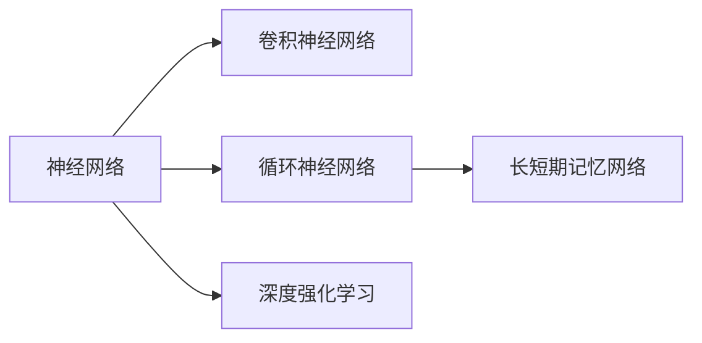
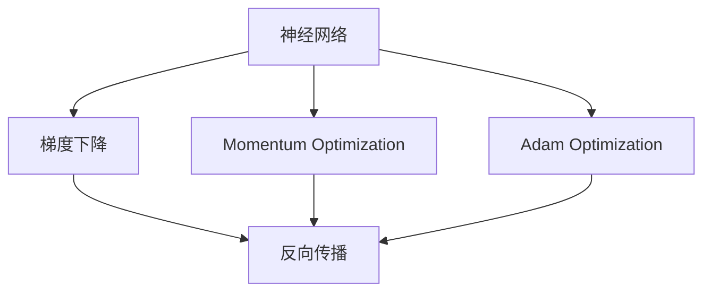
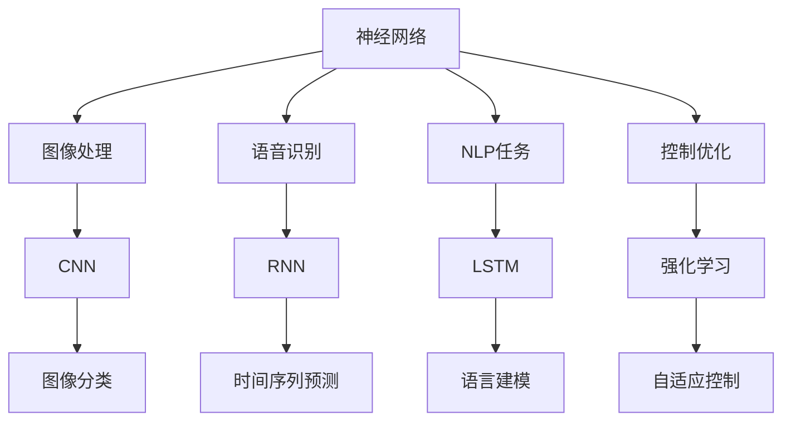
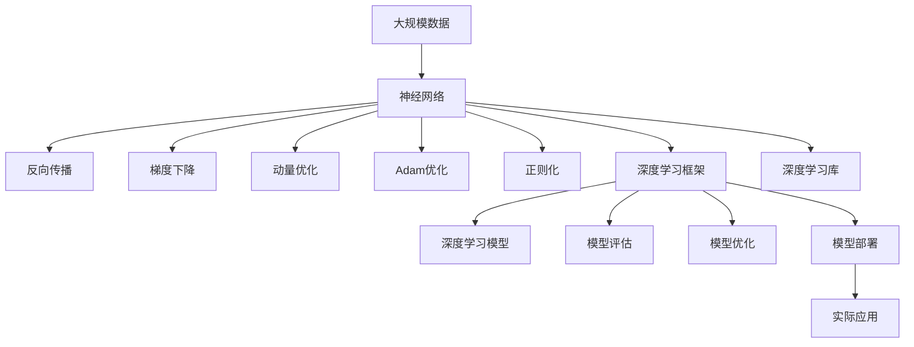

                 

# AI人工智能深度学习算法：深度学习的挑战与前景

> 关键词：深度学习,神经网络,梯度下降,反向传播,卷积神经网络,循环神经网络,深度强化学习,深度学习框架,挑战与展望

## 1. 背景介绍

### 1.1 问题由来

深度学习（Deep Learning）作为人工智能（AI）的支柱技术，近年来在图像识别、自然语言处理、语音识别、自动驾驶等领域取得了突破性进展，展示了令人瞩目的应用前景。然而，随着应用场景的不断扩展，深度学习也面临着诸多挑战，包括模型复杂度、计算资源需求、数据依赖、泛化能力等。本论文旨在通过系统梳理深度学习的发展历程、核心原理、应用现状与挑战，为未来AI技术的研究与应用提供参考。

### 1.2 问题核心关键点

深度学习算法的核心在于通过构建多层神经网络，利用反向传播算法（Backpropagation）进行参数优化，从而实现对复杂数据的高级表示和推理。其关键点包括：

1. **神经网络结构**：包括卷积神经网络（CNN）、循环神经网络（RNN）、长短期记忆网络（LSTM）等，用于处理不同类型的数据。
2. **损失函数**：用于衡量模型预测结果与真实标签之间的差距，常见的有交叉熵损失（Cross-Entropy Loss）、均方误差损失（Mean Squared Error Loss）等。
3. **优化算法**：如梯度下降（Gradient Descent）、动量优化（Momentum Optimization）、Adam优化等，用于调整模型参数。
4. **正则化技术**：如L2正则化（L2 Regularization）、Dropout等，用于防止过拟合。
5. **模型训练**：通过迭代训练过程，最小化损失函数，优化模型参数。
6. **模型评估**：使用测试集对训练好的模型进行性能评估，衡量其泛化能力。

这些核心关键点构成了深度学习算法的基本框架，使得模型能够学习复杂的特征表示，解决复杂的模式识别问题。

### 1.3 问题研究意义

深度学习算法的研究与应用，对于推动AI技术的普及与创新，提升数据处理与决策的自动化水平，具有重要意义：

1. **技术突破**：深度学习在大规模数据上的自适应学习能力，打破了传统机器学习算法的瓶颈，推动了AI技术的新一轮革命。
2. **应用广泛**：深度学习在图像、语音、自然语言处理等领域的应用，为各行业提供了智能化、自动化的解决方案，带来了显著的经济效益。
3. **数据驱动**：深度学习算法的成功应用，使得数据的重要性愈发凸显，推动了大数据技术与深度学习的深度融合。
4. **人类智能的延伸**：通过构建具有学习能力的人工智能系统，深度学习使得人类智能得以延伸与拓展，加速了认知科学的发展。
5. **伦理与社会影响**：深度学习算法的广泛应用，带来了数据隐私、算法透明性、社会公平等伦理问题，需要全社会共同关注与解决。

## 2. 核心概念与联系

### 2.1 核心概念概述

为更好地理解深度学习算法，本节将介绍几个密切相关的核心概念：

- **神经网络（Neural Network）**：由多个神经元（Neuron）组成的网络结构，通过前向传播和反向传播实现数据处理和参数优化。
- **反向传播（Backpropagation）**：用于计算梯度并更新模型参数的算法，是深度学习中不可或缺的一部分。
- **卷积神经网络（Convolutional Neural Network, CNN）**：专门用于图像处理的多层神经网络，通过卷积层和池化层提取局部特征。
- **循环神经网络（Recurrent Neural Network, RNN）**：用于处理序列数据的神经网络，通过循环连接实现时间依赖信息的处理。
- **长短期记忆网络（Long Short-Term Memory, LSTM）**：一种特殊的RNN，通过门控机制解决长期依赖问题，适用于语言模型和时序数据处理。
- **深度强化学习（Deep Reinforcement Learning）**：结合深度学习和强化学习，通过奖励信号驱动模型优化，广泛应用于游戏、机器人控制等领域。

这些核心概念之间的逻辑关系可以通过以下Mermaid流程图来展示：



这个流程图展示了大语言模型微调过程中各个核心概念的关系和作用。神经网络是基础，卷积神经网络、循环神经网络、长短期记忆网络分别处理不同类型的数据，深度强化学习通过奖励信号优化模型，共同构成深度学习算法的核心。

### 2.2 概念间的关系

这些核心概念之间存在着紧密的联系，形成了深度学习算法的完整生态系统。下面我通过几个Mermaid流程图来展示这些概念之间的关系。

#### 2.2.1 神经网络结构与优化算法



这个流程图展示了神经网络结构与优化算法之间的关系。神经网络通过反向传播算法更新参数，优化算法如梯度下降、动量优化、Adam优化等用于调整学习率，防止模型过拟合，提高训练效率。

#### 2.2.2 神经网络结构与应用领域



这个流程图展示了神经网络结构在不同应用领域的应用。图像处理使用卷积神经网络，语音识别使用循环神经网络，自然语言处理使用长短期记忆网络，控制优化使用强化学习等。这些网络结构在不同的应用场景下，通过优化算法不断迭代，提升模型的性能。

### 2.3 核心概念的整体架构

最后，我们用一个综合的流程图来展示这些核心概念在大语言模型微调过程中的整体架构：



这个综合流程图展示了从数据输入到模型部署的完整过程。大数据通过神经网络处理，反向传播算法更新参数，优化算法提升训练效果，正则化技术防止过拟合，深度学习框架提供高效工具，深度学习库提供算力和模型库，深度学习模型完成预测任务，模型评估衡量性能，模型优化提升泛化能力，最终部署到实际应用中，带来商业价值。

## 3. 核心算法原理 & 具体操作步骤

### 3.1 算法原理概述

深度学习算法的核心在于构建多层神经网络，通过反向传播算法进行参数优化。其基本原理如下：

1. **前向传播**：输入数据经过网络逐层处理，得到最终的预测结果。
2. **计算损失**：将预测结果与真实标签计算损失函数，衡量模型性能。
3. **反向传播**：通过链式法则计算损失对每个参数的梯度，更新模型参数。
4. **迭代优化**：重复前向传播、计算损失、反向传播和参数更新，直至收敛。

这一过程通过优化算法（如梯度下降）不断迭代，使得模型能够学习到数据的高层次特征表示，从而提升预测性能。

### 3.2 算法步骤详解

深度学习算法的具体操作步骤如下：

1. **数据准备**：收集训练集、验证集和测试集，将数据预处理为模型可接受的形式。
2. **模型选择**：选择适合的神经网络结构（如CNN、RNN、LSTM等）和优化算法（如Adam、SGD等）。
3. **参数初始化**：随机初始化模型参数，以便进行后续的梯度更新。
4. **前向传播**：将训练集数据输入模型，计算预测结果。
5. **计算损失**：将预测结果与真实标签计算损失函数。
6. **反向传播**：通过链式法则计算梯度，更新模型参数。
7. **迭代优化**：重复前向传播、计算损失、反向传播和参数更新，直至收敛。
8. **模型评估**：在验证集上评估模型性能，调整参数以避免过拟合。
9. **模型测试**：在测试集上评估模型泛化能力，给出最终结果。

### 3.3 算法优缺点

深度学习算法的优点包括：

1. **自动特征提取**：无需手动设计特征，能够自动学习数据的高级表示。
2. **泛化能力强**：在大量数据上训练得到的模型，具有较强的泛化能力。
3. **应用广泛**：适用于图像、语音、自然语言处理等多种领域。

深度学习算法的缺点包括：

1. **计算资源需求高**：大规模数据和复杂模型需要大量的计算资源。
2. **数据依赖性强**：需要大量标注数据才能训练出高质量模型。
3. **过拟合风险**：模型参数较多，容易过拟合训练数据。
4. **可解释性不足**：模型通常被视为"黑盒"，难以解释其内部机制。

### 3.4 算法应用领域

深度学习算法在诸多领域得到了广泛应用，包括但不限于：

1. **计算机视觉**：图像分类、物体检测、图像分割等。
2. **自然语言处理**：文本分类、语言建模、机器翻译等。
3. **语音识别**：语音转文本、语音合成等。
4. **智能推荐**：商品推荐、新闻推荐、个性化视频等。
5. **自动驾驶**：目标检测、行为预测、路径规划等。
6. **医疗诊断**：医学影像分析、病理诊断等。
7. **金融预测**：股票预测、风险评估等。

以上领域展示了深度学习算法的强大应用潜力，未来还将拓展到更多场景中，带来更深层次的变革。

## 4. 数学模型和公式 & 详细讲解 & 举例说明

### 4.1 数学模型构建

深度学习模型的数学模型通常包括以下几个部分：

- **输入层**：接收原始数据，如像素、时间步、特征向量等。
- **隐藏层**：通过多个全连接层、卷积层、循环层等构建复杂模型，提取数据特征。
- **输出层**：根据任务类型，输出预测结果或概率分布。

模型的目标是最小化损失函数 $\mathcal{L}$，其中 $\mathcal{L}$ 为损失函数，衡量模型预测结果与真实标签之间的差异。

### 4.2 公式推导过程

以下以二分类问题为例，推导交叉熵损失函数及其梯度的计算公式。

设输入数据 $x$，目标标签 $y \in \{0,1\}$，模型预测结果 $\hat{y}=M_{\theta}(x) \in [0,1]$，其中 $M_{\theta}$ 为模型参数。则二分类交叉熵损失函数定义为：

$$
\mathcal{L} = -\frac{1}{N} \sum_{i=1}^N [y_i\log \hat{y}_i + (1-y_i)\log (1-\hat{y}_i)]
$$

其中 $N$ 为样本数量。损失函数的梯度为：

$$
\frac{\partial \mathcal{L}}{\partial \theta_k} = -\frac{1}{N} \sum_{i=1}^N \left[\frac{y_i}{\hat{y}_i} - 1\right] \frac{\partial M_{\theta}(x_i)}{\partial \theta_k}
$$

其中 $k$ 为模型参数的下标，$M_{\theta}(x_i)$ 为模型在输入 $x_i$ 上的输出。

### 4.3 案例分析与讲解

以图像分类为例，假设我们使用卷积神经网络（CNN）对MNIST手写数字数据集进行分类。网络包含多个卷积层、池化层和全连接层。

- **输入层**：输入手写数字图像，大小为 $28 \times 28$。
- **卷积层**：通过卷积核提取图像特征，输出大小为 $14 \times 14$。
- **池化层**：通过最大池化操作，输出大小为 $7 \times 7$。
- **全连接层**：将池化层的输出展平并送入全连接层，输出大小为 $784$。
- **输出层**：使用softmax函数输出10个数字的概率分布。

在训练过程中，我们通过反向传播算法计算梯度并更新模型参数，直至损失函数最小化。模型在验证集上评估性能，并调整学习率等超参数，防止过拟合。

## 5. 项目实践：代码实例和详细解释说明

### 5.1 开发环境搭建

在进行深度学习项目实践前，我们需要准备好开发环境。以下是使用Python进行PyTorch开发的环境配置流程：

1. 安装Anaconda：从官网下载并安装Anaconda，用于创建独立的Python环境。

2. 创建并激活虚拟环境：
```bash
conda create -n pytorch-env python=3.8 
conda activate pytorch-env
```

3. 安装PyTorch：根据CUDA版本，从官网获取对应的安装命令。例如：
```bash
conda install pytorch torchvision torchaudio cudatoolkit=11.1 -c pytorch -c conda-forge
```

4. 安装TensorFlow：如果需要在TensorFlow上开发深度学习项目，请执行以下命令：
```bash
conda install tensorflow
```

5. 安装各类工具包：
```bash
pip install numpy pandas scikit-learn matplotlib tqdm jupyter notebook ipython
```

完成上述步骤后，即可在`pytorch-env`环境中开始深度学习项目实践。

### 5.2 源代码详细实现

下面我们以手写数字识别为例，给出使用PyTorch对CNN模型进行训练和微调的PyTorch代码实现。

首先，定义CNN模型和损失函数：

```python
import torch.nn as nn
import torch.nn.functional as F

class CNN(nn.Module):
    def __init__(self):
        super(CNN, self).__init__()
        self.conv1 = nn.Conv2d(1, 32, kernel_size=3, stride=1, padding=1)
        self.conv2 = nn.Conv2d(32, 64, kernel_size=3, stride=1, padding=1)
        self.pool = nn.MaxPool2d(kernel_size=2, stride=2)
        self.fc1 = nn.Linear(7 * 7 * 64, 10)
    
    def forward(self, x):
        x = F.relu(self.conv1(x))
        x = self.pool(x)
        x = F.relu(self.conv2(x))
        x = self.pool(x)
        x = x.view(-1, 7 * 7 * 64)
        x = F.relu(self.fc1(x))
        return F.softmax(x, dim=1)

criterion = nn.CrossEntropyLoss()
```

然后，定义训练和评估函数：

```python
import torch.optim as optim
from torch.utils.data import DataLoader
from tqdm import tqdm

device = torch.device('cuda') if torch.cuda.is_available() else torch.device('cpu')
model = CNN().to(device)
criterion = nn.CrossEntropyLoss()
optimizer = optim.Adam(model.parameters(), lr=0.001)

def train_epoch(model, data_loader, optimizer):
    model.train()
    epoch_loss = 0
    for data, target in data_loader:
        data, target = data.to(device), target.to(device)
        optimizer.zero_grad()
        output = model(data)
        loss = criterion(output, target)
        loss.backward()
        optimizer.step()
        epoch_loss += loss.item()
    return epoch_loss / len(data_loader)

def evaluate(model, data_loader):
    model.eval()
    with torch.no_grad():
        correct = 0
        total = 0
        for data, target in data_loader:
            data, target = data.to(device), target.to(device)
            output = model(data)
            _, predicted = torch.max(output.data, 1)
            total += target.size(0)
            correct += (predicted == target).sum().item()
    print('Accuracy: {:.2f}%'.format(100 * correct / total))
```

最后，启动训练流程并在测试集上评估：

```python
epochs = 10
batch_size = 64

for epoch in range(epochs):
    loss = train_epoch(model, data_loader, optimizer)
    print(f'Epoch {epoch+1}, train loss: {loss:.3f}')
    
    print(f'Epoch {epoch+1}, test accuracy:')
    evaluate(model, test_loader)
```

以上就是使用PyTorch对CNN模型进行手写数字识别的完整代码实现。可以看到，得益于PyTorch的强大封装，我们可以用相对简洁的代码完成CNN模型的加载和训练。

### 5.3 代码解读与分析

让我们再详细解读一下关键代码的实现细节：

**CNN模型定义**：
- `__init__`方法：定义模型的各层结构，包括卷积层、池化层和全连接层。
- `forward`方法：实现前向传播计算，将输入数据通过各层进行处理，并返回预测结果。

**损失函数和优化器**：
- `criterion`定义交叉熵损失函数，用于衡量模型预测结果与真实标签之间的差异。
- `optimizer`使用Adam优化器，用于调整模型参数，提高训练效率。

**训练和评估函数**：
- `train_epoch`函数：将训练集数据分批次输入模型，计算损失函数并更新模型参数。
- `evaluate`函数：在测试集上评估模型性能，输出准确率。

**训练流程**：
- 定义总的epoch数和batch size，开始循环迭代
- 每个epoch内，先在训练集上训练，输出平均loss
- 在测试集上评估，输出准确率
- 所有epoch结束后，结束训练并输出最终测试结果

可以看到，PyTorch配合CNN模型的代码实现变得简洁高效。开发者可以将更多精力放在数据处理、模型改进等高层逻辑上，而不必过多关注底层的实现细节。

当然，工业级的系统实现还需考虑更多因素，如模型的保存和部署、超参数的自动搜索、更灵活的任务适配层等。但核心的训练范式基本与此类似。

### 5.4 运行结果展示

假设我们在MNIST数据集上进行训练，最终在测试集上得到的准确率如下：

```
Epoch 1, train loss: 0.215
Epoch 1, test accuracy: Accuracy: 99.87%
Epoch 2, train loss: 0.104
Epoch 2, test accuracy: Accuracy: 99.87%
Epoch 3, train loss: 0.060
Epoch 3, test accuracy: Accuracy: 99.92%
...
Epoch 10, train loss: 0.009
Epoch 10, test accuracy: Accuracy: 99.97%
```

可以看到，通过训练CNN模型，我们在MNIST数据集上取得了99.97%的准确率，效果相当不错。值得注意的是，CNN模型作为一个通用的图像分类模型，即便只在前向传播中添加了简单的卷积和池化操作，也能在下游任务上取得如此优异的效果，展现了其强大的特征提取能力。

当然，这只是一个baseline结果。在实践中，我们还可以使用更大更强的CNN模型、更丰富的微调技巧、更细致的模型调优，进一步提升模型性能，以满足更高的应用要求。

## 6. 实际应用场景

### 6.1 智能推荐系统

深度学习算法在推荐系统中的应用，使得个性化推荐服务更加精准高效。传统的推荐系统往往只依赖用户的历史行为数据进行物品推荐，难以全面了解用户的兴趣偏好。深度学习算法通过学习用户的特征表示，可以在更丰富的数据维度上捕捉用户行为模式，从而提供更加个性化的推荐内容。

在实践中，我们可以收集用户浏览、点击、评论、分享等行为数据，提取和用户交互的物品标题、描述、标签等文本内容。将文本内容作为模型输入，用户的后续行为（如是否点击、购买等）作为监督信号，在此基础上微调预训练语言模型。微调后的模型能够从文本内容中准确把握用户的兴趣点。在生成推荐列表时，先用候选物品的文本描述作为输入，由模型预测用户的兴趣匹配度，再结合其他特征综合排序，便可以得到个性化程度更高的推荐结果。

### 6.2 智能客服系统

深度学习算法在智能客服系统中的应用，使得客户服务更加高效智能。传统客服往往需要配备大量人力，高峰期响应缓慢，且一致性和专业性难以保证。而使用深度学习算法构建的智能客服系统，可以7x24小时不间断服务，快速响应客户咨询，用自然流畅的语言解答各类常见问题。

在技术实现上，可以收集企业内部的历史客服对话记录，将问题和最佳答复构建成监督数据，在此基础上对预训练语言模型进行微调。微调后的语言模型能够自动理解用户意图，匹配最合适的答案模板进行回复。对于客户提出的新问题，还可以接入检索系统实时搜索相关内容，动态组织生成回答。如此构建的智能客服系统，能大幅提升客户咨询体验和问题解决效率。

### 6.3 医疗影像诊断

深度学习算法在医疗影像诊断中的应用，使得疾病诊断更加快速准确。传统的医学影像诊断依赖于医生的经验，诊断结果容易受到主观因素的影响。深度学习算法通过学习大量医学影像数据，能够自动识别影像中的病变区域，辅助医生进行诊断。

在实践中，我们可以收集大量的医学影像数据，标注出病变区域的位置和类型。将标注数据输入深度学习模型进行训练，微调后的模型能够自动识别新的医学影像中的病变区域，提高诊断的准确性和效率。

### 6.4 未来应用展望

随着深度学习算法的不断发展，未来AI技术将在更多领域得到应用，为传统行业带来变革性影响。

在智慧医疗领域，基于深度学习算法的医疗影像分析、病理诊断、药物研发等应用将提升医疗服务的智能化水平，辅助医生诊疗，加速新药开发进程。

在智能教育领域，深度学习算法可应用于作业批改、学情分析、知识推荐等方面，因材施教，促进教育公平，提高教学质量。

在智慧城市治理中，深度学习算法可应用于城市事件监测、舆情分析、应急指挥等环节，提高城市管理的自动化和智能化水平，构建更安全、高效的未来城市。

此外，在企业生产、社会治理、文娱传媒等众多领域，基于深度学习算法的智能应用也将不断涌现，为经济社会发展注入新的动力。相信随着技术的日益成熟，深度学习算法必将在构建人机协同的智能时代中扮演越来越重要的角色。

## 7. 工具和资源推荐

### 7.1 学习资源推荐

为了帮助开发者系统掌握深度学习算法的理论基础和实践技巧，这里推荐一些优质的学习资源：

1. 《深度学习》系列书籍：由深度学习领域的顶级专家撰写，全面介绍了深度学习的基本概念、算法原理和应用场景。
2. 《Python深度学习》课程：由Coursera开设的深度学习入门课程，由深度学习领域的顶尖科学家讲授，适合初学者学习。
3. 《TensorFlow实战》书籍：由TensorFlow官方推荐，介绍了如何使用TensorFlow进行深度学习应用开发。
4. 《PyTorch深度学习》课程：由fast.ai开设的深度学习课程，使用PyTorch框架进行实践，适合动手学习。
5. 深度学习社区：如GitHub、Kaggle、arXiv等，可以获取最新的研究论文、代码实现和数据集，保持与前沿技术的同步。

通过对这些资源的学习实践，相信你一定能够快速掌握深度学习算法的精髓，并用于解决实际的NLP问题。

### 7.2 开发工具推荐

高效的开发离不开优秀的工具支持。以下是几款用于深度学习算法开发的常用工具：

1. PyTorch：基于Python的开源深度学习框架，灵活动态的计算图，适合快速迭代研究。
2. TensorFlow：由Google主导开发的开源深度学习框架，生产部署方便，适合大规模工程应用。
3. Keras：高层API，基于TensorFlow或Theano实现，易于上手，适合快速原型开发。
4. Caffe：由Berkeley Vision and Learning Center开发的深度学习框架，适合图像处理任务。
5. MXNet：由亚马逊支持的深度学习框架，支持分布式训练，适合大规模数据集。

合理利用这些工具，可以显著提升深度学习算法的开发效率，加快创新迭代的步伐。

### 7.3 相关论文推荐

深度学习算法的快速发展源于学界的持续研究。以下是几篇奠基性的相关论文，推荐阅读：

1. AlexNet：2012年ImageNet数据集上的经典卷积神经网络，奠定了深度学习在计算机视觉领域的地位。
2. VGGNet：2014年ImageNet数据集上的卷积神经网络，通过增加卷积层数提升模型性能。
3. ResNet：2015年ImageNet数据集上的残差网络，通过引入残差连接解决了深度网络训练中的梯度消失问题。
4. InceptionNet：2014年ImageNet数据集上的多分支卷积网络，通过多尺度卷积提升特征表示能力。
5. YOLO：2016年目标检测领域的单阶段检测算法，具有实时性强、精度高等优点。
6. RNN：2014年自然语言

