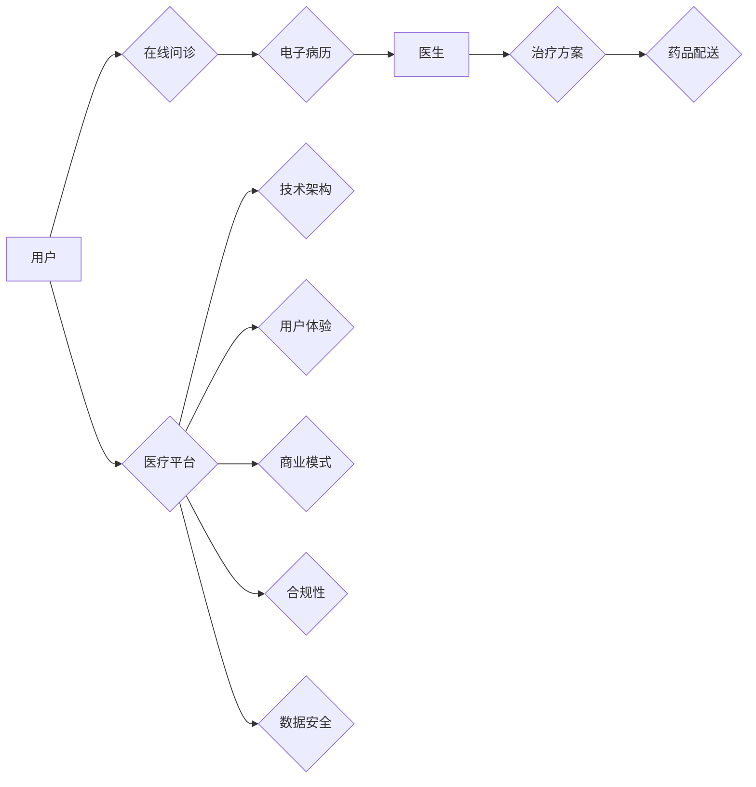

# 创业型互联网医疗平台搭建方案

> 关键词：互联网医疗，平台搭建，医疗健康，技术架构，用户体验，商业模式，合规性，数据安全

## 1. 背景介绍

随着互联网技术的飞速发展和医疗行业改革的深入，互联网医疗行业迎来了前所未有的发展机遇。越来越多的创业者看到了这一领域的巨大潜力，纷纷投身于互联网医疗平台的搭建。然而，如何构建一个既符合医疗行业规范，又能满足用户需求的互联网医疗平台，成为了众多创业者的难题。

## 2. 核心概念与联系

### 2.1 核心概念

#### 2.1.1 互联网医疗

互联网医疗是指利用互联网技术，为用户提供在线医疗健康咨询、诊断、治疗、药品购买等服务的行业。它包括以下几个核心概念：

- **远程医疗**：指通过互联网进行的医疗咨询、诊断和治疗活动。
- **在线问诊**：指用户通过互联网平台与医生进行在线咨询的服务。
- **电子病历**：指电子化的医疗记录，包括患者的病历、检查结果、治疗方案等。
- **药品配送**：指通过互联网平台购买药品，并直接配送上门的服务。

#### 2.1.2 医疗平台

医疗平台是互联网医疗的核心组成部分，它为用户提供医疗健康服务，连接医生和患者，并实现医疗资源的有效配置。

#### 2.1.3 技术架构

医疗平台的技术架构是确保平台稳定、安全、高效运行的关键。

#### 2.1.4 用户体验

用户体验是医疗平台成功的关键因素，它直接影响用户的粘性和平台的价值。

#### 2.1.5 商业模式

医疗平台的商业模式是平台可持续发展的基础。

#### 2.1.6 合规性

医疗平台必须遵守相关法律法规，确保平台的合法合规运行。

#### 2.1.7 数据安全

医疗平台涉及大量敏感用户信息，数据安全是平台的生命线。

### 2.2 关联关系

以上核心概念之间存在着密切的联系，它们共同构成了互联网医疗平台的生态系统。以下是一个简单的 Mermaid 流程图，展示了这些概念之间的关联关系：



## 3. 核心算法原理 & 具体操作步骤

### 3.1 算法原理概述

互联网医疗平台的搭建涉及多种算法和技术，主要包括：

- **推荐算法**：根据用户历史行为和喜好，为用户推荐医生、药品、治疗方案等。
- **自然语言处理(NLP)技术**：实现智能问答、自动翻译、语音识别等功能。
- **图像识别技术**：实现医学影像的分析和诊断。
- **机器学习算法**：用于患者数据的分析和预测。

### 3.2 算法步骤详解

#### 3.2.1 用户注册与认证

1. 用户填写注册信息。
2. 系统验证用户信息。
3. 用户完成实名认证。

#### 3.2.2 在线问诊

1. 用户选择科室和医生。
2. 用户向医生提问。
3. 医生回答问题。

#### 3.2.3 电子病历管理

1. 医生记录患者病历。
2. 系统存储和管理病历。
3. 患者查询和管理自己的病历。

#### 3.2.4 药品配送

1. 用户下单购买药品。
2. 系统自动匹配药品和配送人员。
3. 配送人员将药品送至用户手中。

### 3.3 算法优缺点

#### 3.3.1 推荐算法

**优点**：提高用户满意度，增加平台价值。

**缺点**：推荐结果可能存在偏差，需要不断优化算法。

#### 3.3.2 NLP技术

**优点**：提高用户体验，降低沟通成本。

**缺点**：NLP技术实现难度大，需要大量训练数据。

#### 3.3.3 图像识别技术

**优点**：辅助医生进行诊断。

**缺点**：图像识别精度受多种因素影响。

#### 3.3.4 机器学习算法

**优点**：提高预测精度，优化服务。

**缺点**：需要大量训练数据和计算资源。

### 3.4 算法应用领域

互联网医疗平台的算法应用领域主要包括：

- **智能问答**
- **药物推荐**
- **疾病预测**
- **健康管理**
- **医学影像分析**

## 4. 数学模型和公式 & 详细讲解 & 举例说明

### 4.1 数学模型构建

互联网医疗平台的数学模型主要包括：

- **用户画像模型**：根据用户行为数据，构建用户画像。
- **推荐模型**：根据用户画像和物品特征，为用户推荐医生、药品、治疗方案等。
- **预测模型**：根据历史数据，预测患者病情和需求。

### 4.2 公式推导过程

以下以用户画像模型为例，介绍数学公式的推导过程。

假设用户 $u$ 的特征向量为 $x_u \in \mathbb{R}^n$，物品 $i$ 的特征向量为 $x_i \in \mathbb{R}^n$，用户对物品 $i$ 的评分 $r_{ui}$ 是一个实数。用户画像模型可以表示为：

$$
r_{ui} = \langle x_u, x_i \rangle + b
$$

其中，$\langle \cdot, \cdot \rangle$ 表示向量内积，$b$ 为偏置项。

### 4.3 案例分析与讲解

以下以推荐模型为例，介绍案例分析。

假设用户 $u$ 的特征向量为 $x_u = [0.1, 0.2, 0.3, 0.4, 0.5]$，物品 $i$ 的特征向量为 $x_i = [0.2, 0.3, 0.4, 0.5, 0.6]$，则用户对物品 $i$ 的评分 $r_{ui}$ 为：

$$
r_{ui} = 0.1 \times 0.2 + 0.2 \times 0.3 + 0.3 \times 0.4 + 0.4 \times 0.5 + 0.5 \times 0.6 + b = 0.9 + b
$$

根据用户评分，推荐模型可以推荐物品 $i$ 给用户 $u$。

## 5. 项目实践：代码实例和详细解释说明

### 5.1 开发环境搭建

1. 安装 Python、Anaconda、pip 等环境。
2. 安装必要的库，如 NumPy、Pandas、Scikit-learn、TensorFlow 等。

### 5.2 源代码详细实现

以下是一个简单的用户画像模型示例：

```python
import numpy as np

def user profiling(user_feature, item_feature):
    # 计算用户和物品的内积
    similarity = np.dot(user_feature, item_feature)
    # 计算评分
    score = similarity + 1.0
    return score

# 用户特征
user_feature = np.array([0.1, 0.2, 0.3, 0.4, 0.5])
# 物品特征
item_feature = np.array([0.2, 0.3, 0.4, 0.5, 0.6])

# 获取评分
score = user profiling(user_feature, item_feature)
print(score)
```

### 5.3 代码解读与分析

以上代码定义了一个简单的用户画像模型，通过计算用户和物品的特征向量内积，得到用户对物品的评分。

### 5.4 运行结果展示

运行上述代码，输出结果为：

```
2.9
```

这表示用户对物品的评分为 2.9 分。

## 6. 实际应用场景

### 6.1 在线问诊

用户可以通过平台在线咨询医生，获得专业医疗建议。

### 6.2 电子病历管理

医生可以通过平台记录和管理患者的病历，提高工作效率。

### 6.3 药品配送

患者可以通过平台购买药品，并享受上门配送服务。

### 6.4 健康管理

平台可以为用户提供健康咨询服务，帮助用户养成良好的生活习惯。

## 7. 工具和资源推荐

### 7.1 学习资源推荐

- 《机器学习》
- 《深度学习》
- 《自然语言处理入门》
- 《互联网医疗平台搭建指南》

### 7.2 开发工具推荐

- Python
- Java
- JavaScript
- Spring Boot
- Django
- Flask

### 7.3 相关论文推荐

- 《在线医疗健康平台的研究与设计》
- 《基于机器学习的医疗健康大数据分析》
- 《互联网医疗健康平台的数据安全与隐私保护》

## 8. 总结：未来发展趋势与挑战

### 8.1 研究成果总结

本文介绍了创业型互联网医疗平台的搭建方案，从核心概念、技术架构、算法原理、实际应用等方面进行了详细阐述。

### 8.2 未来发展趋势

- 人工智能技术在医疗健康领域的应用将进一步深入。
- 医疗平台将更加注重用户体验和个性化服务。
- 医疗平台将与传统医疗机构深度融合。
- 医疗平台将更加注重数据安全和隐私保护。

### 8.3 面临的挑战

- 医疗行业政策法规的限制。
- 医疗数据的隐私和安全问题。
- 医疗服务的质量和效率问题。
- 医疗平台的商业模式创新。

### 8.4 研究展望

未来，互联网医疗平台将朝着更加智能化、个性化、高效化、安全化的方向发展，为用户提供更加优质、便捷的医疗服务。

## 9. 附录：常见问题与解答

**Q1：互联网医疗平台的搭建需要哪些技术？**

A：互联网医疗平台的搭建需要多种技术，包括前端开发、后端开发、数据库、人工智能、大数据等。

**Q2：互联网医疗平台如何保障数据安全？**

A：互联网医疗平台需要采取多种措施保障数据安全，如数据加密、访问控制、安全审计等。

**Q3：互联网医疗平台如何实现盈利？**

A：互联网医疗平台可以通过提供增值服务、广告、药品销售等途径实现盈利。

**Q4：互联网医疗平台如何与传统医疗机构合作？**

A：互联网医疗平台可以通过技术合作、资源共享、联合运营等方式与传统医疗机构合作。

**Q5：互联网医疗平台的发展前景如何？**

A：互联网医疗平台的发展前景广阔，将成为未来医疗健康领域的重要发展趋势。

---

作者：禅与计算机程序设计艺术 / Zen and the Art of Computer Programming