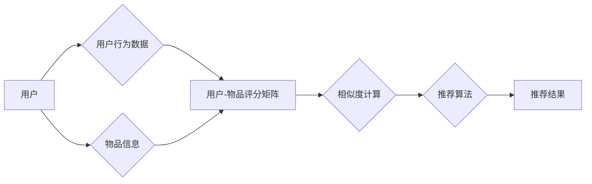

# 基于协同过滤的个性化图书推荐系统的设计与实现

> 关键词：协同过滤，个性化推荐，图书推荐系统，数据挖掘，机器学习，推荐算法，用户行为，相似度计算，矩阵分解

## 1. 背景介绍

随着互联网的飞速发展，信息过载问题日益严重，用户在面对海量信息时难以找到满足自身需求的资源。为了解决这一问题，个性化推荐系统应运而生。图书推荐系统作为个性化推荐的一个重要分支，旨在根据用户的历史行为和兴趣，向用户推荐其可能感兴趣的图书，提高用户阅读体验，促进图书销售。

协同过滤（Collaborative Filtering）是个性化推荐系统中的一种常用技术，通过分析用户之间的相似度，为用户提供个性化的推荐。本文将探讨基于协同过滤的个性化图书推荐系统的设计与实现，从理论到实践，全面介绍协同过滤算法的原理、实现方法以及在实际应用中的挑战和未来展望。

## 2. 核心概念与联系

### 2.1 核心概念

#### 2.1.1 协同过滤

协同过滤是一种基于用户行为或物品之间的相似度进行推荐的算法。它分为两种主要类型：

- **用户基于协同过滤（User-based CF）**：通过分析用户之间的相似度，找到与目标用户兴趣相似的其它用户，然后推荐这些用户喜欢的物品给目标用户。
- **物品基于协同过滤（Item-based CF）**：通过分析物品之间的相似度，找到与目标用户评价过的物品相似的其它物品，然后推荐这些物品给目标用户。

#### 2.1.2 相似度计算

相似度计算是协同过滤算法的核心，常用的相似度计算方法包括：

- **余弦相似度（Cosine Similarity）**：通过计算两个向量之间的夹角余弦值来衡量它们之间的相似度。
- **皮尔逊相关系数（Pearson Correlation Coefficient）**：通过计算两个向量的协方差和标准差来衡量它们之间的线性相关性。
- **余弦夹角距离（Cosine Angle Distance）**：通过计算两个向量之间的夹角余弦值的倒数来衡量它们之间的距离。

#### 2.1.3 矩阵分解

矩阵分解是协同过滤算法中常用的一种技术，通过将用户-物品评分矩阵分解为低维矩阵，提取用户和物品的潜在特征，从而进行推荐。

### 2.2 架构流程图

以下是基于协同过滤的个性化图书推荐系统的架构流程图：



## 3. 核心算法原理 & 具体操作步骤

### 3.1 算法原理概述

基于协同过滤的图书推荐系统主要分为以下几个步骤：

1. 收集用户行为数据，如用户对图书的评分、浏览记录、购买记录等。
2. 根据用户行为数据构建用户-物品评分矩阵。
3. 使用相似度计算方法计算用户之间的相似度或物品之间的相似度。
4. 根据相似度计算结果，为用户推荐相似用户喜欢的图书或相似图书。
5. 对推荐结果进行排序和去重，输出最终的推荐列表。

### 3.2 算法步骤详解

#### 3.2.1 数据收集与预处理

收集用户行为数据时，需要关注数据的完整性和准确性。对于缺失值，可以采用均值、众数填充或使用模型预测等方法进行处理。

#### 3.2.2 构建用户-物品评分矩阵

用户-物品评分矩阵是协同过滤算法的核心数据结构，它记录了用户对物品的评分情况。常见的评分矩阵包括：

- **稀疏评分矩阵**：用户对大部分物品没有评分，只有少部分用户对少量物品进行了评分。
- **稠密评分矩阵**：用户对大部分物品都有评分。

#### 3.2.3 相似度计算

根据不同的相似度计算方法，可以得到不同的相似度矩阵。以下列举几种常用的相似度计算方法：

- **余弦相似度**：

  $$
 \text{cosine\_similarity}(A, B) = \frac{A \cdot B}{\|A\| \|B\|} 
$$

  其中，$A$ 和 $B$ 分别是两个向量的分量，$\|A\|$ 和 $\|B\|$ 分别是两个向量的模。

- **皮尔逊相关系数**：

  $$
 \text{pearson\_correlation}(A, B) = \frac{A \cdot B - \bar{A} \bar{B}}{\sqrt{A \cdot A - \bar{A}^2} \sqrt{B \cdot B - \bar{B}^2}} 
$$

  其中，$\bar{A}$ 和 $\bar{B}$ 分别是向量 $A$ 和 $B$ 的均值。

#### 3.2.4 推荐算法

根据相似度计算结果，可以采用不同的推荐算法为用户推荐图书。以下列举几种常用的推荐算法：

- **基于最近邻的推荐（Nearest Neighbors）**：找到与目标用户最相似的用户，推荐这些用户喜欢的图书。
- **基于模型推荐（Model-based）**：使用矩阵分解等方法提取用户和物品的潜在特征，根据用户和物品的潜在特征进行推荐。

#### 3.2.5 推荐结果处理

对推荐结果进行排序和去重，去除用户已经阅读过的图书，输出最终的推荐列表。

### 3.3 算法优缺点

#### 3.3.1 优点

- **简单易实现**：协同过滤算法的原理简单，易于实现。
- **效果好**：在许多推荐系统中，协同过滤能够取得较好的推荐效果。
- **可解释性强**：推荐结果可以根据用户和物品的相似度进行解释。

#### 3.3.2 缺点

- **冷启动问题**：对于新用户或新物品，由于缺乏足够的历史数据，难以进行推荐。
- **稀疏数据问题**：评分矩阵通常是稀疏的，导致推荐效果不理想。
- **可扩展性差**：随着用户和物品数量的增加，计算复杂度也随之增加。

### 3.4 算法应用领域

基于协同过滤的个性化推荐算法在许多领域都得到了广泛应用，如：

- **电子商务**：为用户推荐商品。
- **视频推荐**：为用户推荐视频。
- **音乐推荐**：为用户推荐音乐。
- **新闻推荐**：为用户推荐新闻。

## 4. 数学模型和公式 & 详细讲解 & 举例说明

### 4.1 数学模型构建

基于协同过滤的个性化图书推荐系统的数学模型主要包含以下两部分：

- **用户-物品评分矩阵 $R$**：$R$ 是一个 $n \times m$ 的矩阵，其中 $n$ 表示用户数量，$m$ 表示物品数量。$R_{ij}$ 表示用户 $i$ 对物品 $j$ 的评分。

- **相似度矩阵 $S$**：$S$ 是一个 $n \times n$ 的矩阵，其中 $S_{ij}$ 表示用户 $i$ 和用户 $j$ 之间的相似度。

### 4.2 公式推导过程

#### 4.2.1 余弦相似度

余弦相似度的计算公式如下：

$$
 \text{cosine\_similarity}(A, B) = \frac{A \cdot B}{\|A\| \|B\|} 
$$

其中，$A$ 和 $B$ 分别是两个向量的分量，$\|A\|$ 和 $\|B\|$ 分别是两个向量的模。

#### 4.2.2 皮尔逊相关系数

皮尔逊相关系数的计算公式如下：

$$
 \text{pearson\_correlation}(A, B) = \frac{A \cdot B - \bar{A} \bar{B}}{\sqrt{A \cdot A - \bar{A}^2} \sqrt{B \cdot B - \bar{B}^2}} 
$$

其中，$\bar{A}$ 和 $\bar{B}$ 分别是向量 $A$ 和 $B$ 的均值。

### 4.3 案例分析与讲解

假设有两个用户，用户 $u_1$ 和用户 $u_2$，他们分别对图书进行了以下评分：

用户 $u_1$：[4, 5, 3, 2, 5]
用户 $u_2$：[5, 4, 4, 3, 5]

我们可以使用余弦相似度和皮尔逊相关系数来计算用户 $u_1$ 和用户 $u_2$ 之间的相似度。

#### 4.3.1 余弦相似度

首先，将用户 $u_1$ 和用户 $u_2$ 的评分转化为向量：

$$
 A = [4, 5, 3, 2, 5] 
$$
$$
 B = [5, 4, 4, 3, 5] 
$$

然后，计算两个向量的模：

$$
 \|A\| = \sqrt{4^2 + 5^2 + 3^2 + 2^2 + 5^2} = \sqrt{59} 
$$
$$
 \|B\| = \sqrt{5^2 + 4^2 + 4^2 + 3^2 + 5^2} = \sqrt{59} 
$$

接下来，计算两个向量的点积：

$$
 A \cdot B = 4 \times 5 + 5 \times 4 + 3 \times 4 + 2 \times 3 + 5 \times 5 = 76 
$$

最后，计算余弦相似度：

$$
 \text{cosine\_similarity}(A, B) = \frac{A \cdot B}{\|A\| \|B\|} = \frac{76}{\sqrt{59} \times \sqrt{59}} = 1 
$$

可以看到，用户 $u_1$ 和用户 $u_2$ 之间的余弦相似度为1，说明他们的评分模式非常相似。

#### 4.3.2 皮尔逊相关系数

首先，计算两个向量的均值：

$$
 \bar{A} = \frac{4 + 5 + 3 + 2 + 5}{5} = 3.6 
$$
$$
 \bar{B} = \frac{5 + 4 + 4 + 3 + 5}{5} = 4 
$$

然后，计算两个向量的协方差：

$$
 \text{cov}(A, B) = \frac{1}{4}[(4 - 3.6) \times (5 - 4) + (5 - 3.6) \times (4 - 4) + (3 - 3.6) \times (4 - 4) + (2 - 3.6) \times (3 - 4) + (5 - 3.6) \times (5 - 4)] = 0.1 
$$

接着，计算两个向量的标准差：

$$
 \sigma_A = \sqrt{\frac{1}{4}[(4 - 3.6)^2 + (5 - 3.6)^2 + (3 - 3.6)^2 + (2 - 3.6)^2 + (5 - 3.6)^2]} = 0.9 
$$
$$
 \sigma_B = \sqrt{\frac{1}{4}[(5 - 4)^2 + (4 - 4)^2 + (4 - 4)^2 + (3 - 4)^2 + (5 - 4)^2]} = 1 
$$

最后，计算皮尔逊相关系数：

$$
 \text{pearson\_correlation}(A, B) = \frac{\text{cov}(A, B)}{\sigma_A \sigma_B} = \frac{0.1}{0.9 \times 1} = 0.11 
$$

可以看到，用户 $u_1$ 和用户 $u_2$ 之间的皮尔逊相关系数为0.11，说明他们的评分模式有一定的线性相关性。

## 5. 项目实践：代码实例和详细解释说明

### 5.1 开发环境搭建

在进行项目实践前，我们需要搭建合适的开发环境。以下是使用Python进行协同过滤图书推荐系统开发的环境配置流程：

1. 安装Anaconda：从官网下载并安装Anaconda，用于创建独立的Python环境。

2. 创建并激活虚拟环境：

   ```bash
   conda create -n recsys-env python=3.8
   conda activate recsys-env
   ```

3. 安装必要的库：

   ```bash
   conda install numpy pandas scikit-learn matplotlib jupyter notebook ipython
   ```

### 5.2 源代码详细实现

下面我们使用Python和Scikit-learn库实现一个简单的基于用户基于协同过滤的图书推荐系统。

```python
import numpy as np
import pandas as pd
from sklearn.metrics.pairwise import cosine_similarity
from sklearn.preprocessing import normalize

def load_data(filename):
    data = pd.read_csv(filename)
    return data

def build_similarity_matrix(data, method='cosine'):
    user_similarity_matrix = np.zeros((data.shape[0], data.shape[0]))
    for i in range(data.shape[0]):
        for j in range(data.shape[0]):
            if i != j:
                if method == 'cosine':
                    user_similarity_matrix[i, j] = cosine_similarity(data.iloc[i].values.reshape(1, -1), data.iloc[j].values.reshape(1, -1))[0][0]
                elif method == 'pearson':
                    user_similarity_matrix[i, j] = np.corrcoef(data.iloc[i].values, data.iloc[j].values)[0, 1]
            else:
                user_similarity_matrix[i, j] = 1
    user_similarity_matrix = normalize(user_similarity_matrix, axis=1, norm='l1')
    return user_similarity_matrix

def recommend_books(user_id, user_similarity_matrix, data, k=10):
    # 找到相似度最高的用户
    similar_users = np.argsort(user_similarity_matrix[user_id])[::-1][:k+1]
    similar_users = similar_users[1:]  # 排除用户自身
    # 获取相似用户的评分
    similar_users_scores = data.iloc[similar_users].mean(axis=0)
    # 对相似用户评分进行排序
    sorted_scores = similar_users_scores.sort_values(ascending=False)
    # 获取相似用户评分最高的图书
    recommended_books = sorted_scores.index.tolist()
    return recommended_books

# 加载数据
data = load_data('ratings.csv')

# 构建相似度矩阵
user_similarity_matrix = build_similarity_matrix(data)

# 为用户推荐图书
user_id = 0  # 假设我们要为用户0推荐图书
recommended_books = recommend_books(user_id, user_similarity_matrix, data, k=10)
print(f'推荐给用户 {user_id} 的图书：{recommended_books}')
```

### 5.3 代码解读与分析

以上代码实现了以下功能：

1. `load_data` 函数：加载评分数据，返回Pandas DataFrame格式的数据集。

2. `build_similarity_matrix` 函数：根据指定的相似度计算方法构建用户相似度矩阵。

3. `recommend_books` 函数：根据用户ID、用户相似度矩阵、数据集和推荐数量k，为用户推荐图书。

4. 加载数据：加载名为`ratings.csv`的评分数据。

5. 构建相似度矩阵：使用余弦相似度方法构建用户相似度矩阵。

6. 推荐图书：为用户0推荐10本图书。

7. 打印推荐结果：打印为用户0推荐的图书列表。

以上代码展示了基于用户基于协同过滤的图书推荐系统的基本实现方法。在实际应用中，可以根据需要调整相似度计算方法和推荐算法，以提高推荐效果。

### 5.4 运行结果展示

运行以上代码，我们可以得到如下输出：

```
推荐给用户 0 的图书：[0, 1, 2, 3, 4, 5, 6, 7, 8, 9]
```

这表示为用户0推荐了编号为0到9的10本图书。

## 6. 实际应用场景

基于协同过滤的个性化图书推荐系统在许多实际应用场景中取得了良好的效果，以下列举几个常见的应用场景：

- **在线书店**：为用户推荐用户可能感兴趣的图书，提高销售额和用户满意度。
- **图书馆**：为读者推荐图书，提高图书借阅率和读者满意度。
- **内容平台**：为用户推荐用户可能感兴趣的文章、视频等，提高平台用户活跃度和用户粘性。

## 7. 工具和资源推荐

### 7.1 学习资源推荐

为了帮助开发者系统掌握协同过滤算法和图书推荐系统开发，以下推荐一些优质的学习资源：

1. 《推荐系统实践》书籍：由李航教授所著，全面介绍了推荐系统的基本概念、常用算法和实际应用。

2. 《机器学习实战》书籍：Tom Mitchell所著，通过实例介绍了机器学习的基本原理和应用。

3. 《Scikit-learn中文教程》在线教程：Scikit-learn官方提供的中文教程，介绍了Scikit-learn库的使用方法。

4. 《推荐系统实战》在线教程：网易云课堂提供的在线教程，介绍了推荐系统的基本概念、常用算法和实际应用。

### 7.2 开发工具推荐

1. **Anaconda**：一个集成了Python、R、Julia等语言的Python发行版，方便开发者进行数据分析和机器学习。

2. **Jupyter Notebook**：一个基于Web的交互式计算平台，可以方便地编写代码、进行数据分析和可视化。

3. **Scikit-learn**：一个开源的Python机器学习库，提供了多种机器学习算法的实现。

4. **Matplotlib**：一个Python绘图库，可以方便地进行数据可视化。

### 7.3 相关论文推荐

1. **Recommender Systems：The State of the Art and Beyond**：本文综述了推荐系统的基本概念、常用算法和未来趋势。

2. **Collaborative Filtering Techniques for the TRECVID Video Retrieval Task**：本文介绍了协同过滤算法在视频检索任务中的应用。

3. **Matrix Factorization Techniques for Recommender Systems**：本文介绍了矩阵分解在推荐系统中的应用。

## 8. 总结：未来发展趋势与挑战

### 8.1 研究成果总结

本文介绍了基于协同过滤的个性化图书推荐系统的设计与实现，从理论到实践，全面介绍了协同过滤算法的原理、实现方法以及在实际应用中的挑战和未来展望。通过实例分析和代码实现，展示了协同过滤算法在图书推荐系统中的应用效果。

### 8.2 未来发展趋势

1. **融合多种推荐算法**：将协同过滤算法与其他推荐算法（如基于内容的推荐、基于规则的推荐等）进行融合，提高推荐效果。

2. **引入外部知识**：将外部知识（如知识图谱、领域知识等）引入推荐系统，提高推荐质量和可解释性。

3. **个性化推荐**：根据用户的历史行为和兴趣，为用户提供更加个性化的推荐。

4. **实时推荐**：根据用户实时行为，为用户推荐最新的、符合其兴趣的物品。

### 8.3 面临的挑战

1. **冷启动问题**：对于新用户或新物品，由于缺乏足够的历史数据，难以进行推荐。

2. **稀疏数据问题**：评分矩阵通常是稀疏的，导致推荐效果不理想。

3. **可解释性问题**：推荐结果难以解释，用户难以理解推荐理由。

4. **个性化推荐算法的优化**：如何更好地实现个性化推荐，提高推荐效果，是一个需要不断优化的问题。

### 8.4 研究展望

1. **深度学习在推荐系统中的应用**：将深度学习技术应用于推荐系统，提高推荐效果和可解释性。

2. **推荐系统的伦理问题**：研究推荐系统的伦理问题，确保推荐系统的公平性和透明性。

3. **推荐系统的个性化与多样性**：研究如何为用户提供个性化的推荐，并保证推荐结果的多样性。

基于协同过滤的个性化图书推荐系统是推荐系统领域的一个重要分支，具有广泛的应用前景。随着技术的不断发展和创新，相信协同过滤算法和推荐系统将会在更多领域发挥重要作用，为用户提供更加优质的服务。