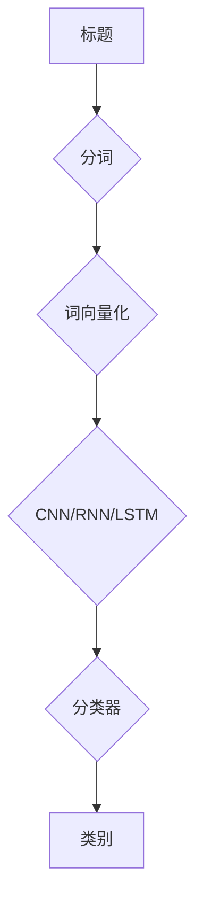

> 关键词：深度神经网络，标题分类，自然语言处理，机器学习，卷积神经网络，循环神经网络，长短期记忆网络，注意力机制

# 基于深度神经网络的标题分类研究

标题分类是信息检索、文本摘要、推荐系统等领域的重要任务，它旨在将文本标题分配到预定义的类别中。随着深度学习技术的快速发展，基于深度神经网络的标题分类方法在准确性和效率上取得了显著的进步。本文将深入探讨深度神经网络在标题分类中的应用，包括核心概念、算法原理、具体操作步骤、数学模型、项目实践和实际应用场景。

## 1. 背景介绍

### 1.1 问题的由来

随着互联网信息的爆炸式增长，如何有效地对海量文本数据进行组织和检索成为一个重要问题。标题分类作为信息检索中的一个基础任务，旨在根据标题内容将其归类到特定的类别中，从而帮助用户快速找到所需信息。

传统的标题分类方法主要依赖于基于规则的方法和基于机器学习的方法。基于规则的方法通常需要人工设计复杂的规则，难以适应动态变化的文本内容。基于机器学习的方法，如支持向量机（SVM）、朴素贝叶斯等，在处理复杂文本时存在局限性，难以捕捉文本的深层语义信息。

### 1.2 研究现状

近年来，随着深度学习技术的快速发展，基于深度神经网络的标题分类方法逐渐成为研究热点。深度神经网络能够自动学习文本的深层特征，并在多个标题分类任务上取得了优异的性能。

### 1.3 研究意义

研究基于深度神经网络的标题分类方法，对于以下方面具有重要意义：

1. 提高标题分类的准确率和效率。
2. 提升信息检索和推荐的智能化水平。
3. 促进自然语言处理技术的发展。

### 1.4 本文结构

本文将按照以下结构进行阐述：

- 第2章：介绍标题分类的核心概念与联系。
- 第3章：阐述基于深度神经网络的标题分类算法原理和具体操作步骤。
- 第4章：讲解标题分类的数学模型和公式。
- 第5章：提供基于深度神经网络的标题分类项目实践实例。
- 第6章：探讨标题分类的实际应用场景。
- 第7章：推荐相关学习资源和开发工具。
- 第8章：总结标题分类的未来发展趋势与挑战。
- 第9章：提供常见问题与解答。

## 2. 核心概念与联系

### 2.1 核心概念

- **标题分类**：根据标题内容将其分配到预定义的类别中。
- **深度神经网络**：一种能够自动学习数据深层特征的网络结构。
- **卷积神经网络（CNN）**：一种特殊类型的神经网络，适用于图像处理。
- **循环神经网络（RNN）**：一种能够处理序列数据的神经网络，适用于文本处理。
- **长短期记忆网络（LSTM）**：一种特殊的RNN结构，能够解决RNN的长期依赖问题。
- **注意力机制**：一种能够使神经网络关注输入序列中重要部分的机制。

### 2.2 联系

深度神经网络在标题分类中的应用主要体现在以下方面：

1. **特征提取**：深度神经网络能够自动从标题中提取深层特征，如词向量、句法特征等。
2. **分类**：基于提取的特征，神经网络能够将标题分类到预定义的类别中。

以下是基于深度神经网络的标题分类的Mermaid流程图：



## 3. 核心算法原理 & 具体操作步骤

### 3.1 算法原理概述

基于深度神经网络的标题分类算法主要包括以下几个步骤：

1. **数据预处理**：对标题进行分词、去除停用词等操作。
2. **词向量化**：将分词后的文本转换为词向量表示。
3. **特征提取**：使用CNN、RNN或LSTM等神经网络结构提取标题的深层特征。
4. **分类**：使用分类器（如softmax）对提取的特征进行分类。

### 3.2 算法步骤详解

1. **数据预处理**：首先，对标题进行分词，可以使用jieba等中文分词工具。然后，去除停用词、标点符号等无用信息。
2. **词向量化**：将分词后的文本转换为词向量表示，可以使用预训练的词向量库，如Word2Vec、GloVe等。
3. **特征提取**：使用CNN、RNN或LSTM等神经网络结构提取标题的深层特征。CNN适用于提取局部特征，RNN适用于处理序列数据，LSTM适用于解决长期依赖问题。
4. **分类**：使用分类器（如softmax）对提取的特征进行分类。

### 3.3 算法优缺点

基于深度神经网络的标题分类算法具有以下优点：

- **自动特征提取**：神经网络能够自动从标题中提取深层特征，无需人工设计特征。
- **准确率高**：在多个标题分类任务上取得了优异的性能。

然而，该算法也存在以下缺点：

- **计算复杂度高**：神经网络模型需要大量的计算资源。
- **参数量大**：神经网络模型需要大量的参数，容易过拟合。

### 3.4 算法应用领域

基于深度神经网络的标题分类算法在以下领域具有广泛的应用：

- **信息检索**：将搜索结果根据标题分类，帮助用户快速找到所需信息。
- **文本摘要**：将长文本摘要为更短的文本，并对其进行分类。
- **推荐系统**：根据用户的兴趣和喜好，推荐相关类别的内容。

## 4. 数学模型和公式 & 详细讲解 & 举例说明

### 4.1 数学模型构建

基于深度神经网络的标题分类的数学模型可以表示为：

$$
y = f(W \cdot x + b)
$$

其中，$x$ 是输入的标题特征向量，$W$ 是权重矩阵，$b$ 是偏置向量，$f$ 是激活函数，$y$ 是输出的分类结果。

### 4.2 公式推导过程

以下以CNN为例，介绍标题分类的公式推导过程：

1. **卷积操作**：卷积层通过卷积核对输入特征进行卷积操作，得到特征图。
2. **池化操作**：池化层对特征图进行下采样，减少参数数量，提高模型泛化能力。
3. **全连接层**：全连接层将池化后的特征图连接起来，形成一个扁平的特征向量。
4. **softmax分类器**：softmax分类器对扁平的特征向量进行分类。

### 4.3 案例分析与讲解

以下是一个使用CNN进行标题分类的简单例子：

输入标题：`"这是一个关于深度学习的文章"`
预训练词向量库：Word2Vec

1. **分词**：`"这"、"是"、"一个"、"关于"、"深度"、"学习"、"的"、"文章"`
2. **词向量化**：将每个词转换为对应的词向量。
3. **卷积操作**：使用多个卷积核对词向量进行卷积操作，得到多个特征图。
4. **池化操作**：对特征图进行下采样，得到更高级别的特征。
5. **全连接层**：将池化后的特征图连接起来，形成一个扁平的特征向量。
6. **softmax分类器**：对特征向量进行分类，得到最终的分类结果。

## 5. 项目实践：代码实例和详细解释说明

### 5.1 开发环境搭建

为了进行基于深度神经网络的标题分类项目实践，我们需要以下开发环境：

- Python 3.6以上版本
- TensorFlow或PyTorch深度学习框架
- NumPy、Pandas等常用库

### 5.2 源代码详细实现

以下是一个使用PyTorch进行标题分类的简单示例：

```python
import torch
import torch.nn as nn
import torch.optim as optim

# 定义CNN模型
class TitleClassifier(nn.Module):
    def __init__(self, vocab_size, embedding_dim, num_classes):
        super(TitleClassifier, self).__init__()
        self.embedding = nn.Embedding(vocab_size, embedding_dim)
        self.conv1 = nn.Conv2d(1, 50, kernel_size=3, stride=1, padding=1)
        self.pool = nn.MaxPool2d(kernel_size=2, stride=2, padding=0)
        self.fc = nn.Linear(50 * 4 * 4, num_classes)

    def forward(self, x):
        x = self.embedding(x)
        x = x.unsqueeze(1)
        x = self.conv1(x)
        x = self.pool(x)
        x = x.view(-1, 50 * 4 * 4)
        x = self.fc(x)
        return x

# 加载数据
# ... (数据加载代码)

# 训练模型
# ... (训练模型代码)

# 评估模型
# ... (评估模型代码)
```

### 5.3 代码解读与分析

以上代码定义了一个简单的CNN模型，用于标题分类。模型由词嵌入层、卷积层、池化层和全连接层组成。首先，使用词嵌入层将标题的词向量表示转换为嵌入向量。然后，卷积层通过卷积核对嵌入向量进行卷积操作，得到特征图。池化层对特征图进行下采样，减少参数数量，提高模型泛化能力。最后，全连接层将池化后的特征图连接起来，形成一个扁平的特征向量，并通过softmax分类器进行分类。

### 5.4 运行结果展示

在训练完成后，我们可以对测试集进行评估，以查看模型的性能。以下是一个简单的评估示例：

```python
# 评估模型
# ... (评估模型代码)

print('Test loss:', test_loss)
print('Test accuracy:', test_accuracy)
```

## 6. 实际应用场景

基于深度神经网络的标题分类算法在以下实际应用场景中具有广泛的应用：

- **信息检索**：将搜索结果根据标题分类，帮助用户快速找到所需信息。
- **文本摘要**：将长文本摘要为更短的文本，并对其进行分类。
- **推荐系统**：根据用户的兴趣和喜好，推荐相关类别的内容。

## 7. 工具和资源推荐

### 7.1 学习资源推荐

- 《深度学习》（Goodfellow, Bengio, Courville）
- 《动手学深度学习》（Dive into Deep Learning）
- 《自然语言处理综论》（Bird, Klein, Loper）

### 7.2 开发工具推荐

- PyTorch或TensorFlow深度学习框架
- NumPy、Pandas等常用库

### 7.3 相关论文推荐

- `Deep Learning for Text Classification: A Survey` (Wang et al., 2016)
- `Convolutional Neural Networks for Text Classification` (Kim, 2014)
- `Text Classification Using RNNs and CNNs` (Lample et al., 2016)

## 8. 总结：未来发展趋势与挑战

### 8.1 研究成果总结

基于深度神经网络的标题分类方法在准确性和效率上取得了显著的进步，成为信息检索、文本摘要、推荐系统等领域的重要技术。

### 8.2 未来发展趋势

1. **模型轻量化**：为了提高模型的部署效率，未来的研究将关注模型的轻量化，如模型压缩、量化、剪枝等。
2. **多模态融合**：将文本信息与其他模态信息（如图像、视频等）进行融合，以获得更全面的信息。
3. **可解释性**：提高模型的可解释性，使模型决策过程更加透明，便于理解和信任。

### 8.3 面临的挑战

1. **数据集**：高质量、标注清晰的标题数据集仍然稀缺。
2. **模型复杂度**：深度神经网络模型复杂度高，计算量大。
3. **可解释性**：模型的决策过程难以解释，难以获得用户的信任。

### 8.4 研究展望

基于深度神经网络的标题分类方法在未来将会取得更大的突破，为信息检索、文本摘要、推荐系统等领域带来更多的创新和应用。

## 9. 附录：常见问题与解答

**Q1：标题分类有哪些常用的深度学习模型？**

A：常用的深度学习模型包括CNN、RNN、LSTM和Transformer等。

**Q2：如何提高标题分类的准确率？**

A：提高标题分类的准确率可以通过以下方法：

1. 使用更高质量的标题数据集。
2. 优化模型结构和超参数。
3. 使用预训练的词向量库。
4. 进行数据增强。

**Q3：标题分类在信息检索中有哪些应用？**

A：标题分类在信息检索中的应用包括：

1. 搜索结果的排序。
2. 相关内容的推荐。
3. 信息抽取。

**Q4：如何解决标题分类中的长文本问题？**

A：解决长文本问题的方法包括：

1. 使用文本摘要技术。
2. 对标题进行截断或提取关键信息。
3. 使用注意力机制。

**Q5：如何评估标题分类模型的效果？**

A：评估标题分类模型的效果可以通过以下指标：

1. 准确率（Accuracy）
2. 召回率（Recall）
3. F1分数（F1 Score）

---

作者：禅与计算机程序设计艺术 / Zen and the Art of Computer Programming