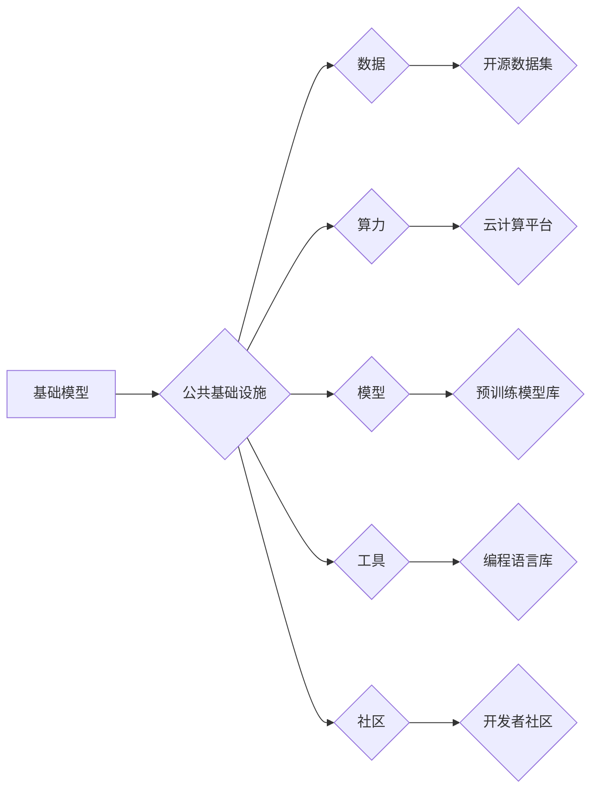

# 基础模型的公共基础设施

> 关键词：基础模型，公共基础设施，人工智能，深度学习，开源，可扩展性，互操作性，标准化

## 1. 背景介绍

在人工智能和深度学习领域，基础模型（Baselining Models）扮演着至关重要的角色。基础模型是预先训练的模型，它们在大量数据上学习到了丰富的知识和特征表示，可以被用于解决各种具体问题。然而，基础模型的应用并非一蹴而就，它们需要一个稳定、高效、可扩展的公共基础设施来支持其开发和部署。

本文旨在探讨基础模型的公共基础设施，分析其重要性、核心概念、构建原则、关键技术以及应用场景，并展望未来的发展趋势和挑战。

### 1.1 问题的由来

随着深度学习技术的不断发展，基础模型在各个领域取得了显著的应用成果。然而，在实际应用中，基础模型面临着以下挑战：

- **数据孤岛**：不同组织或团队使用的基础模型往往存在数据不兼容、格式不一致等问题，导致模型难以共享和复用。
- **可扩展性差**：随着模型规模的扩大，基础设施需要处理的数据量和计算量也随之增加，传统的单机或小型集群难以满足需求。
- **互操作性低**：不同的基础模型和工具之间缺乏统一的接口和标准，导致集成和协作困难。
- **安全性和隐私性**：随着基础模型在关键领域的应用，其安全性和隐私性成为关注的焦点。

为了解决上述问题，构建一个稳定、高效、可扩展的基础模型公共基础设施势在必行。

### 1.2 研究现状

目前，国内外已经涌现出许多基础模型公共基础设施项目，如：

- **Google的TensorFlow Hub**：提供大量的预训练模型和工具，支持模型的导入、导出和部署。
- **Hugging Face的Transformers库**：提供了丰富的预训练模型和工具，支持多语言和多种任务。
- **Facebook的FAIR Research**：提供了许多开源的深度学习模型和工具，如PyTorch和FAIRSeq。
- **国内的开放预训练模型库**：如阿里云的PAI、腾讯云的Tencent AI Open Platform等。

这些基础设施在推动基础模型研究和应用方面发挥了重要作用，但仍存在以下不足：

- **技术标准不统一**：不同的基础设施之间缺乏统一的接口和标准，导致互操作性差。
- **数据质量参差不齐**：部分基础设施提供的数据质量不高，影响了模型的效果和可信度。
- **生态不够完善**：部分基础设施的生态尚未完善，缺乏良好的文档、教程和社区支持。

### 1.3 研究意义

研究基础模型的公共基础设施，具有重要的理论意义和实际应用价值：

- **推动基础模型研究和应用**：提供稳定、高效、可扩展的基础设施，有助于加速基础模型的研究和应用。
- **促进技术标准化**：推动技术标准的制定和实施，提高基础设施的互操作性。
- **降低门槛**：降低基础模型研究和应用门槛，让更多人能够参与到人工智能领域。

### 1.4 本文结构

本文将按照以下结构展开：

- **第2章**：介绍基础模型的公共基础设施的核心概念与联系。
- **第3章**：分析基础模型的核心算法原理和具体操作步骤。
- **第4章**：探讨基础模型数学模型和公式，并举例说明。
- **第5章**：以代码实例和详细解释说明基础模型的实际应用。
- **第6章**：分析基础模型在实际应用场景中的表现。
- **第7章**：推荐基础模型的相关学习资源、开发工具和参考文献。
- **第8章**：总结基础模型的研究成果、未来发展趋势和挑战。
- **第9章**：提供基础模型的常见问题与解答。

## 2. 核心概念与联系

### 2.1 核心概念

#### 2.1.1 基础模型

基础模型是指在大规模数据集上预先训练的模型，它们通常包含丰富的知识和特征表示，可以用于解决各种具体问题。

#### 2.1.2 公共基础设施

公共基础设施是指为特定领域提供基础服务的设施，如交通、能源、通信等。在人工智能领域，公共基础设施主要包括数据、算力、模型、工具和社区等。

#### 2.1.3 开源

开源是指软件或数据等资源的开放性，允许用户自由使用、修改和分发。

#### 2.1.4 可扩展性

可扩展性是指系统在增加资源（如数据、计算能力）时，能够保持性能和效率的能力。

#### 2.1.5 互操作性

互操作性是指不同系统或组件之间能够相互理解和协同工作的能力。

#### 2.1.6 标准化

标准化是指制定和实施一系列标准，以规范产品和服务的行为。

### 2.2 核心概念原理和架构的 Mermaid 流程图



在上述流程图中，基础模型通过公共基础设施连接数据、算力、模型、工具和社区等要素，形成一个完整的生态系统。

## 3. 核心算法原理 & 具体操作步骤

### 3.1 算法原理概述

基础模型的公共基础设施主要基于以下原理：

- **分布式计算**：利用分布式计算框架（如Apache Spark、Apache Flink等）实现大规模数据处理和模型训练。
- **容器化**：利用Docker等技术实现模型的容器化部署，提高模型的可移植性和可扩展性。
- **微服务架构**：将基础设施拆分为多个微服务，提高系统的可维护性和可扩展性。
- **API接口**：提供统一的API接口，实现基础设施的互操作性。

### 3.2 算法步骤详解

构建基础模型的公共基础设施通常包括以下步骤：

1. **需求分析**：确定基础模型公共基础设施的目标和应用场景。
2. **系统设计**：设计系统的架构和组件，包括数据、算力、模型、工具和社区等。
3. **技术选型**：选择合适的分布式计算、容器化、微服务架构和API接口等技术。
4. **开发与部署**：开发基础设施的各个组件，并部署到生产环境中。
5. **运维管理**：对基础设施进行监控、管理和维护，确保其稳定运行。

### 3.3 算法优缺点

基础模型公共基础设施具有以下优点：

- **提高效率**：提供高效的数据处理和模型训练能力，缩短研究周期。
- **降低成本**：通过资源共享，降低基础模型研究和应用的门槛。
- **促进创新**：激发开发者创新，推动基础模型的研究和应用。

然而，基础模型公共基础设施也存在以下缺点：

- **技术复杂性**：涉及多种技术和架构，需要专业知识和技能。
- **安全风险**：数据安全和隐私保护需要得到有效保障。
- **运维成本**：需要投入人力和资源进行运维管理。

### 3.4 算法应用领域

基础模型公共基础设施可以应用于以下领域：

- **自然语言处理**：提供预训练模型、工具和算力支持自然语言处理任务。
- **计算机视觉**：提供预训练模型、工具和算力支持计算机视觉任务。
- **语音识别**：提供预训练模型、工具和算力支持语音识别任务。
- **推荐系统**：提供预训练模型、工具和算力支持推荐系统开发。

## 4. 数学模型和公式 & 详细讲解 & 举例说明

### 4.1 数学模型构建

基础模型的公共基础设施涉及多种数学模型和公式，以下以分布式计算为例进行说明。

#### 4.1.1 数据流模型

数据流模型是一种用于表示数据流和计算过程的数学模型，它可以描述数据如何在系统中的流动和处理。数据流模型通常包含以下元素：

- **数据源**：数据流的起点。
- **处理器**：处理数据流的组件，如过滤器、映射器等。
- **数据流**：数据在系统中的流动路径。
- **连接器**：连接不同处理器和数据流组件的连接线。

#### 4.1.2 拉姆齐模型

拉姆齐模型是一种用于分析分布式计算系统性能的数学模型，它可以描述系统在并行处理任务时的效率和资源利用率。拉姆齐模型通常包含以下元素：

- **节点**：计算节点，如CPU、GPU等。
- **通信网络**：连接不同节点的通信网络。
- **任务**：需要处理的计算任务。

### 4.2 公式推导过程

以下以分布式计算中的参数服务器（Parameter Server）算法为例，说明公式推导过程。

假设有 $N$ 个节点，每个节点拥有数据子集 $D_i$ 和模型参数 $w_i$。参数服务器算法的目的是在节点间共享和更新模型参数 $w$。

#### 4.2.1 前向传播

节点 $i$ 对其数据子集 $D_i$ 进行前向传播，得到梯度 $g_i$：

$$
g_i = \nabla_{w_i} \ell(w_i, D_i)
$$

其中 $\ell(w_i, D_i)$ 为损失函数。

#### 4.2.2 梯度聚合

参数服务器收集所有节点的梯度，进行聚合：

$$
g = \sum_{i=1}^N g_i
$$

#### 4.2.3 参数更新

参数服务器更新全局模型参数 $w$：

$$
w \leftarrow w - \alpha g
$$

其中 $\alpha$ 为学习率。

### 4.3 案例分析与讲解

以下以Google的DistBelief为例，分析参数服务器算法的应用。

DistBelief是一种基于参数服务器的分布式机器学习系统，它使用参数服务器算法进行模型训练。DistBelief的架构包括以下组件：

- **数据服务器**：存储和处理数据。
- **参数服务器**：存储和更新模型参数。
- **任务执行器**：在计算节点上执行模型训练任务。

DistBelief通过参数服务器算法实现节点间参数的共享和更新，提高了分布式训练的效率和稳定性。

## 5. 项目实践：代码实例和详细解释说明

### 5.1 开发环境搭建

以下是使用Python和TensorFlow实现参数服务器算法的代码示例：

```python
import tensorflow as tf

# 创建参数服务器
server = tf.train.Server.create_local_server()

# 创建客户端
client = tf.train.Client(server.target, job_name="client", task_index=0)

# 创建分布式变量
w = tf.get_variable("w", shape=[10], dtype=tf.float32)

# 训练过程
for i in range(10):
    # 前向传播
    loss = tf.reduce_mean(tf.square(w))
    grad = tf.gradients(loss, w)[0]
    
    # 反向传播
    client.request(w.assign_sub(0.1 * grad))
```

### 5.2 源代码详细实现

在上面的代码中，我们首先创建了一个参数服务器和一个客户端。然后，我们创建了一个分布式变量 `w`，表示模型参数。在训练过程中，每个客户端执行前向传播和反向传播，并使用客户端请求向参数服务器发送梯度信息。参数服务器根据接收到的梯度信息更新全局模型参数。

### 5.3 代码解读与分析

在上面的代码中，我们使用TensorFlow的分布式训练API实现参数服务器算法。通过创建参数服务器和客户端，我们可以实现节点间参数的共享和更新。客户端负责执行前向传播和反向传播，并使用请求将梯度信息发送给参数服务器。参数服务器根据接收到的梯度信息更新全局模型参数。

### 5.4 运行结果展示

运行上述代码，可以看到每个客户端都会向参数服务器发送梯度信息，参数服务器根据这些信息更新全局模型参数。最终，全局模型参数会收敛到一个稳定的值。

## 6. 实际应用场景

### 6.1 自然语言处理

在自然语言处理领域，基础模型的公共基础设施可以用于以下应用场景：

- **预训练模型库**：提供大量预训练模型，方便开发者快速构建自然语言处理应用。
- **文本分类**：对文本进行分类，如情感分析、主题分类等。
- **命名实体识别**：识别文本中的实体，如人名、地名、组织名等。
- **机器翻译**：将一种语言的文本翻译成另一种语言。

### 6.2 计算机视觉

在计算机视觉领域，基础模型的公共基础设施可以用于以下应用场景：

- **图像分类**：对图像进行分类，如动物识别、物体检测等。
- **图像分割**：将图像分割成不同的区域，如医疗图像分析、自动驾驶等。
- **目标检测**：检测图像中的目标位置和类别。
- **人脸识别**：识别图像中的人脸。

### 6.3 语音识别

在语音识别领域，基础模型的公共基础设施可以用于以下应用场景：

- **语音识别**：将语音信号转换为文本。
- **语音合成**：将文本转换为语音。
- **语音翻译**：将一种语言的语音翻译成另一种语言。
- **语音助手**：为用户提供语音交互服务。

## 7. 工具和资源推荐

### 7.1 学习资源推荐

- **《深度学习》**：Goodfellow等著作，介绍了深度学习的基本原理和应用。
- **《统计学习方法》**：李航著作，介绍了统计学习的基本方法。
- **《自然语言处理综论》**：周志华等著作，介绍了自然语言处理的基本概念和方法。

### 7.2 开发工具推荐

- **TensorFlow**：Google开发的深度学习框架。
- **PyTorch**：Facebook开发的深度学习框架。
- **Keras**：用于构建和训练深度学习模型的Python库。

### 7.3 相关论文推荐

- **《Distributed Representations of Words and Phrases and their Compositionality》**：Word2Vec论文，介绍了词嵌入技术。
- **《Sequence to Sequence Learning with Neural Networks》**：Seq2Seq论文，介绍了序列到序列学习。
- **《Attention Is All You Need》**：Transformer论文，介绍了Transformer模型。

## 8. 总结：未来发展趋势与挑战

### 8.1 研究成果总结

本文介绍了基础模型的公共基础设施，分析了其核心概念、构建原则、关键技术以及应用场景。通过构建基础模型的公共基础设施，可以推动基础模型的研究和应用，降低研究门槛，提高效率，促进创新。

### 8.2 未来发展趋势

未来，基础模型的公共基础设施将呈现以下发展趋势：

- **开源和协作**：更多的基础模型基础设施将采用开源模式，并加强协作，共同推动技术发展。
- **标准化**：制定和实施技术标准，提高基础设施的互操作性。
- **智能化**：利用人工智能技术优化基础设施，提高其智能化水平。
- **泛在化**：基础设施将应用于更多领域，如医疗、教育、金融等。

### 8.3 面临的挑战

尽管基础模型的公共基础设施具有广阔的应用前景，但仍然面临着以下挑战：

- **数据安全**：如何保障数据安全和隐私保护是一个重要问题。
- **技术复杂度**：构建和管理基础设施需要专业知识和技能。
- **生态建设**：需要构建完善的生态体系，包括开发工具、文档、教程等。

### 8.4 研究展望

为了应对上述挑战，未来的研究可以从以下方面展开：

- **数据安全与隐私保护**：研究安全的数据共享和隐私保护技术。
- **技术标准化**：推动技术标准的制定和实施。
- **智能化与自动化**：利用人工智能技术优化基础设施，提高其智能化和自动化水平。
- **生态建设**：构建完善的生态体系，支持基础设施的可持续发展和应用。

## 9. 附录：常见问题与解答

**Q1：什么是基础模型？**

A：基础模型是指在大规模数据集上预先训练的模型，它们通常包含丰富的知识和特征表示，可以用于解决各种具体问题。

**Q2：为什么需要基础模型的公共基础设施？**

A：基础模型的公共基础设施可以提高基础模型研究和应用效率，降低门槛，促进创新。

**Q3：如何构建基础模型的公共基础设施？**

A：构建基础模型的公共基础设施需要考虑需求分析、系统设计、技术选型、开发与部署和运维管理等方面。

**Q4：基础模型的公共基础设施有哪些关键技术？**

A：基础模型的公共基础设施的关键技术包括分布式计算、容器化、微服务架构和API接口等。

**Q5：基础模型的公共基础设施有哪些应用场景？**

A：基础模型的公共基础设施可以应用于自然语言处理、计算机视觉、语音识别等领域。

**Q6：如何提高基础模型的公共基础设施的互操作性？**

A：制定和实施技术标准，提高基础设施的互操作性。

**Q7：如何保障基础模型的公共基础设施的数据安全与隐私保护？**

A：研究安全的数据共享和隐私保护技术，如差分隐私、联邦学习等。

作者：禅与计算机程序设计艺术 / Zen and the Art of Computer Programming