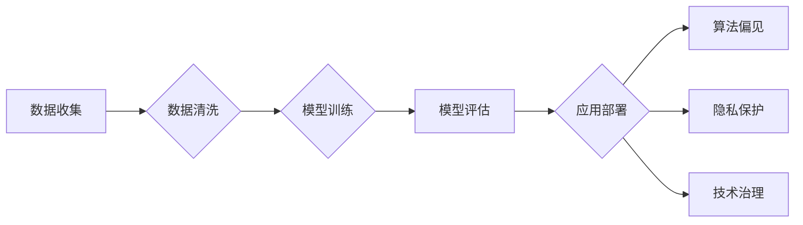

# 基础模型的社会技术性质

> 关键词：基础模型，社会影响，技术性质，算法伦理，人工智能，机器学习，技术治理

## 1. 背景介绍

随着人工智能技术的飞速发展，基础模型（如Transformer、BERT、GPT等）已经成为机器学习领域的核心技术。这些模型在自然语言处理、计算机视觉、语音识别等多个领域取得了显著的成果。然而，随着基础模型在各个领域的应用日益广泛，其社会技术性质也逐渐成为了一个不可忽视的重要议题。本文将探讨基础模型的社会技术性质，分析其对社会的影响，并探讨相应的技术治理策略。

### 1.1 问题的由来

**技术的社会性**：传统的计算机科学强调的是技术的中立性，而随着人工智能技术的发展，技术的社会性变得越来越明显。基础模型的应用不仅改变了人们的工作方式和生活方式，也对社会结构和伦理道德产生了深远的影响。

**算法偏见**：基础模型在训练过程中可能会学习到社会中的偏见和歧视，导致其在实际应用中出现不公平的决策结果。

**隐私泄露**：基础模型在处理个人数据时，可能会引发隐私泄露的风险。

**技术失业**：基础模型的广泛应用可能会导致部分职业的失业，引发社会就业结构的变化。

### 1.2 研究现状

目前，关于基础模型的社会技术性质的研究主要集中在以下几个方面：

- **算法偏见研究**：研究者们通过实证分析，揭示了基础模型在学习过程中可能存在的偏见问题。
- **隐私保护研究**：研究者们提出了多种隐私保护技术，旨在保护用户在基础模型应用过程中的隐私。
- **技术治理研究**：研究者们探讨了如何制定相应的技术治理策略，以确保基础模型的应用符合伦理道德和法律法规。

### 1.3 研究意义

研究基础模型的社会技术性质，有助于我们：

- 深入理解基础模型对社会的影响。
- 发现基础模型应用中的潜在问题，并提出相应的解决方案。
- 促进人工智能技术的健康发展，使其更好地服务于人类社会。

## 2. 核心概念与联系

### 2.1 核心概念原理

#### 2.1.1 基础模型

基础模型是指在大量数据上经过预训练的模型，它能够捕获数据中的规律和特征，从而在不同任务上表现出强大的泛化能力。

#### 2.1.2 算法偏见

算法偏见是指算法在决策过程中，由于数据、算法设计或人为因素导致的对某些群体的不公平对待。

#### 2.1.3 隐私保护

隐私保护是指通过技术手段，保护用户在数据收集、存储、处理、传输等过程中个人信息的保密性、完整性和可用性。

#### 2.1.4 技术治理

技术治理是指通过法律、政策、技术等手段，对技术发展进行引导和规范，确保技术发展符合社会伦理和法律法规。

### 2.2 架构的 Mermaid 流程图



### 2.3 核心概念联系

基础模型作为数据处理的工具，其应用过程中涉及数据收集、清洗、训练、评估、部署等多个环节。在这个过程中，可能会出现算法偏见、隐私泄露等问题，需要通过技术治理手段进行规范。

## 3. 核心算法原理 & 具体操作步骤

### 3.1 算法原理概述

基础模型通常采用深度学习技术，通过多层神经网络结构，对数据进行特征提取和建模。其核心原理包括：

- **自动编码器**：通过编码器将输入数据压缩成低维表征，再通过解码器将低维表征恢复成输出数据。
- **循环神经网络（RNN）**：通过循环单元处理序列数据，捕捉序列中各个元素之间的关系。
- **卷积神经网络（CNN）**：通过卷积层提取图像中的局部特征，并利用池化层降低特征维度。

### 3.2 算法步骤详解

#### 3.2.1 数据收集

数据收集是基础模型应用的第一步，需要收集与任务相关的数据，并确保数据的合法性和质量。

#### 3.2.2 数据清洗

数据清洗是指对收集到的数据进行预处理，去除噪声、填补缺失值、去除异常值等。

#### 3.2.3 模型训练

模型训练是指使用清洗后的数据对模型进行训练，使模型能够学习数据中的规律和特征。

#### 3.2.4 模型评估

模型评估是指使用验证集对训练好的模型进行评估，检查模型的泛化能力。

#### 3.2.5 应用部署

应用部署是指将训练好的模型部署到实际应用场景中，实现对数据的处理和决策。

### 3.3 算法优缺点

#### 3.3.1 优点

- **强大的泛化能力**：基础模型能够从大量数据中学习到丰富的知识，并在不同任务上表现出优异的泛化能力。
- **可解释性**：深度学习模型的可解释性较差，但近年来涌现出一些可解释性研究，有望提高模型的透明度和可信度。

#### 3.3.2 缺点

- **算法偏见**：基础模型可能会学习到社会中的偏见和歧视，导致其在实际应用中出现不公平的决策结果。
- **数据依赖性**：基础模型对训练数据的质量和数量有很高的要求，数据质量差或数据量不足可能导致模型性能下降。
- **隐私泄露**：基础模型在处理个人数据时，可能会引发隐私泄露的风险。

### 3.4 算法应用领域

基础模型的应用领域非常广泛，包括：

- **自然语言处理**：文本分类、情感分析、机器翻译、问答系统等。
- **计算机视觉**：图像识别、目标检测、图像生成等。
- **语音识别**：语音合成、语音转文字、语音识别等。
- **推荐系统**：个性化推荐、商品推荐、音乐推荐等。

## 4. 数学模型和公式 & 详细讲解 & 举例说明

### 4.1 数学模型构建

基础模型的数学模型主要包括：

- **神经网络**：由多个神经元组成，每个神经元通过权重连接，对输入数据进行处理。
- **损失函数**：用于衡量模型预测结果与真实标签之间的差异，如交叉熵损失函数、均方误差损失函数等。

### 4.2 公式推导过程

以下以交叉熵损失函数为例，介绍其公式推导过程：

$$
L(y, \hat{y}) = -\sum_{i=1}^N [y_i \log(\hat{y}_i) + (1-y_i) \log(1-\hat{y}_i)]
$$

其中，$y$ 为真实标签，$\hat{y}$ 为模型预测结果。

### 4.3 案例分析与讲解

以下以情感分析任务为例，介绍基础模型的实际应用：

#### 4.3.1 数据集

假设我们有一个情感分析数据集，包含电影评论和对应的情感标签（正面/负面）。

#### 4.3.2 模型选择

选择一个预训练的语言模型，如BERT。

#### 4.3.3 数据处理

将电影评论和情感标签转换为模型所需的格式。

#### 4.3.4 训练过程

使用训练数据进行模型训练。

#### 4.3.5 模型评估

使用验证集评估模型性能。

#### 4.3.6 应用部署

将训练好的模型应用于新的电影评论，预测其情感标签。

## 5. 项目实践：代码实例和详细解释说明

### 5.1 开发环境搭建

- 安装Python环境
- 安装PyTorch和Transformers库

### 5.2 源代码详细实现

```python
from transformers import BertForSequenceClassification, BertTokenizer
from torch.utils.data import DataLoader
from torch.optim import AdamW

# 加载预训练模型和分词器
model = BertForSequenceClassification.from_pretrained('bert-base-uncased')
tokenizer = BertTokenizer.from_pretrained('bert-base-uncased')

# 数据处理
def encode_data(texts, labels, tokenizer, max_len=128):
    encodings = tokenizer(texts, truncation=True, padding=True, max_length=max_len)
    input_ids = encodings['input_ids']
    attention_mask = encodings['attention_mask']
    labels = torch.tensor(labels)
    return input_ids, attention_mask, labels

# 训练函数
def train(model, data_loader, optimizer):
    model.train()
    for inputs, labels in data_loader:
        optimizer.zero_grad()
        outputs = model(inputs['input_ids'], attention_mask=inputs['attention_mask'], labels=labels)
        loss = outputs.loss
        loss.backward()
        optimizer.step()

# 评估函数
def evaluate(model, data_loader):
    model.eval()
    total = 0
    correct = 0
    with torch.no_grad():
        for inputs, labels in data_loader:
            outputs = model(inputs['input_ids'], attention_mask=inputs['attention_mask'])
            _, predicted = torch.max(outputs.logits, 1)
            total += labels.size(0)
            correct += (predicted == labels).sum().item()
    return correct / total

# 模型训练
train_dataset = DataLoader(encode_data(train_texts, train_labels, tokenizer), batch_size=32, shuffle=True)
optimizer = AdamW(model.parameters(), lr=2e-5)

for epoch in range(3):
    train(model, train_dataset, optimizer)
    print(f"Epoch {epoch+1}, train accuracy: {evaluate(train_dataset, 1e-6)}")
```

### 5.3 代码解读与分析

以上代码展示了如何使用PyTorch和Transformers库对BERT模型进行情感分析任务的微调。代码中主要包含以下几个部分：

- 加载预训练的BERT模型和分词器
- 数据处理函数`encode_data`：将文本和标签转换为模型所需的格式
- 训练函数`train`：对模型进行训练
- 评估函数`evaluate`：评估模型性能
- 模型训练：加载训练数据，定义优化器，进行模型训练

## 6. 实际应用场景

### 6.1 情感分析

情感分析是基础模型在自然语言处理领域的典型应用。通过对社交媒体、新闻评论等文本数据进行情感分析，可以帮助企业了解用户对产品的看法，为产品改进和市场推广提供参考。

### 6.2 图像识别

图像识别是基础模型在计算机视觉领域的典型应用。通过对图像进行识别，可以帮助企业实现自动化生产、安全监控、医疗诊断等功能。

### 6.3 语音识别

语音识别是基础模型在语音处理领域的典型应用。通过对语音信号进行识别，可以帮助企业实现语音助手、语音输入等功能。

### 6.4 未来应用展望

随着基础模型技术的不断发展，其在各个领域的应用将更加广泛。未来，基础模型可能会在以下领域发挥重要作用：

- **智能医疗**：通过分析医学影像、病历数据等，辅助医生进行诊断和治疗。
- **智能教育**：通过分析学生的学习数据，为学生提供个性化的学习方案。
- **智能交通**：通过分析交通数据，优化交通流量，提高道路通行效率。
- **智能金融**：通过分析金融市场数据，帮助投资者进行决策。

## 7. 工具和资源推荐

### 7.1 学习资源推荐

- 《深度学习》系列书籍
- Coursera上的深度学习课程
- TensorFlow官方文档

### 7.2 开发工具推荐

- PyTorch
- TensorFlow
- Hugging Face Transformers库

### 7.3 相关论文推荐

- "Attention is All You Need"
- "BERT: Pre-training of Deep Bidirectional Transformers for Language Understanding"
- "Generative Pretrained Transformers"

## 8. 总结：未来发展趋势与挑战

### 8.1 研究成果总结

本文对基础模型的社会技术性质进行了探讨，分析了其对社会的影响，并提出了相应的技术治理策略。

### 8.2 未来发展趋势

- **多模态融合**：未来基础模型可能会融合多模态信息，如文本、图像、视频等，以更好地理解和模拟人类认知。
- **可解释性**：随着可解释性研究的深入，基础模型的可解释性将会得到提高。
- **伦理和安全性**：未来基础模型的应用将更加注重伦理和安全性，避免算法偏见和隐私泄露等问题。

### 8.3 面临的挑战

- **数据隐私**：如何在保护用户隐私的前提下，利用用户数据进行基础模型训练，是一个重要的挑战。
- **算法偏见**：如何消除算法偏见，实现公平公正的决策，是一个长期的研究课题。
- **技术治理**：如何制定有效的技术治理策略，确保基础模型的应用符合伦理道德和法律法规，是一个复杂的系统工程。

### 8.4 研究展望

未来，基础模型的社会技术性质研究将是一个长期而复杂的过程。我们需要从数据、算法、技术治理等多个方面入手，共同推动基础模型技术的健康发展，使其更好地服务于人类社会。

## 9. 附录：常见问题与解答

**Q1：基础模型为什么会产生算法偏见？**

A：基础模型可能会学习到数据中的偏见和歧视，如性别歧视、种族歧视等。这些偏见可能会在模型训练过程中被放大，导致模型在实际应用中出现不公平的决策结果。

**Q2：如何消除基础模型的算法偏见？**

A：消除基础模型的算法偏见需要从多个方面入手：
1. 收集更加多元和公平的数据集。
2. 设计更加公平的算法，避免对某些群体进行歧视。
3. 对模型进行偏差检测和校正。
4. 增加算法透明度和可解释性。

**Q3：如何保护用户隐私？**

A：保护用户隐私需要从多个方面入手：
1. 采用差分隐私、联邦学习等技术，减少数据泄露风险。
2. 对用户数据进行脱敏处理，消除可识别性。
3. 制定相应的法律法规，规范数据收集和使用。

**Q4：如何确保基础模型的应用符合伦理道德和法律法规？**

A：确保基础模型的应用符合伦理道德和法律法规需要：
1. 制定相应的伦理道德规范。
2. 建立完善的技术治理体系。
3. 加强对基础模型应用的法律监管。

---

作者：禅与计算机程序设计艺术 / Zen and the Art of Computer Programming