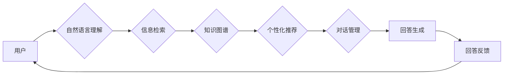

> 关键词：大模型问答，机器人，任务处理，自然语言理解，信息检索，对话系统，知识图谱，个性化推荐

# 大模型问答机器人的任务处理

问答机器人作为一种与用户进行自然语言交互的人工智能系统，已成为提高服务效率、优化用户体验的重要工具。随着大模型技术的飞速发展，基于大模型构建的问答机器人展现出前所未有的智能和效率。本文将深入探讨大模型问答机器人的任务处理原理、技术架构、实现步骤和实际应用，并展望其未来发展趋势。

## 1. 背景介绍

### 1.1 问答机器人的发展历程

问答机器人技术经历了从基于规则到基于统计、再到基于深度学习的三个发展阶段。早期问答机器人主要依赖于人工编写的规则，处理能力和交互体验有限。随着自然语言处理技术的发展，基于统计的方法开始兴起，如基于关键字匹配、信息检索等技术，能够处理更加复杂的问答场景。近年来，随着深度学习技术的成熟，基于深度学习的大模型问答机器人逐渐成为主流，其智能和效率得到了显著提升。

### 1.2 大模型问答机器人的优势

基于大模型的问答机器人具有以下优势：

- **强大的语言理解能力**：大模型能够理解自然语言中的语义、语境和意图，能够处理更加复杂的问答场景。
- **丰富的知识储备**：大模型经过海量数据的预训练，积累了丰富的知识，能够回答各种类型的问题。
- **智能的交互体验**：大模型能够根据用户的提问和反馈，实时调整回答策略，提供更加个性化的服务。

## 2. 核心概念与联系

### 2.1 大模型问答机器人的架构

大模型问答机器人的架构主要包括以下几个部分：



### 2.2 核心概念与联系

- **自然语言理解**：将用户输入的自然语言转换为机器可理解的结构化数据，包括词汇、句法、语义和意图等。
- **信息检索**：根据用户的问题，从海量知识库中检索相关信息，为回答生成提供依据。
- **知识图谱**：存储实体、关系和属性等知识，为大模型提供丰富的背景知识。
- **个性化推荐**：根据用户的兴趣和偏好，推荐个性化的答案和后续问题。
- **对话管理**：协调问答过程中的各个环节，保证对话的流畅和有效。
- **回答生成**：根据用户的问题和检索到的信息，生成恰当的回答。
- **回答反馈**：收集用户对回答的反馈，用于模型优化和对话改进。

## 3. 核心算法原理 & 具体操作步骤

### 3.1 算法原理概述

大模型问答机器人的核心算法主要包括自然语言理解、信息检索、知识图谱、个性化推荐和对话管理等方面。

### 3.2 算法步骤详解

1. **自然语言理解**：
    - 分词：将用户输入的句子分解成词语序列。
    - 词性标注：识别词语的词性，如名词、动词、形容词等。
    - 命名实体识别：识别句子中的实体，如人名、地名、组织名等。
    - 语义角色标注：识别句子中词语的语义角色，如主语、宾语、谓语等。
    - 意图识别：根据用户的输入，判断其意图是什么。

2. **信息检索**：
    - 将用户的问题转换为索引，从知识库中检索相关信息。
    - 根据检索结果，对信息进行排序，优先展示与用户问题最相关的信息。

3. **知识图谱**：
    - 利用知识图谱中的实体、关系和属性等信息，丰富回答的背景知识。

4. **个性化推荐**：
    - 根据用户的兴趣和偏好，推荐个性化的答案和后续问题。

5. **对话管理**：
    - 根据对话上下文，协调问答过程中的各个环节，保证对话的流畅和有效。

6. **回答生成**：
    - 根据用户的问题和检索到的信息，生成恰当的回答。

7. **回答反馈**：
    - 收集用户对回答的反馈，用于模型优化和对话改进。

### 3.3 算法优缺点

**优点**：

- **高效性**：大模型问答机器人的处理速度快，能够快速响应用户的提问。
- **准确性**：大模型问答机器人的回答准确率高，能够提供满意的答案。
- **个性化**：大模型问答机器人能够根据用户的兴趣和偏好，提供个性化的服务。

**缺点**：

- **成本高**：大模型的训练和推理成本高，需要大量计算资源和存储空间。
- **可解释性差**：大模型的决策过程难以解释，用户难以理解其回答的依据。
- **知识更新慢**：知识库的更新速度慢，可能无法及时反映最新的信息。

### 3.4 算法应用领域

大模型问答机器人可以应用于以下领域：

- **客服领域**：为用户提供24小时不间断的咨询服务，提高服务效率。
- **教育领域**：为学生提供个性化的学习辅导，提高学习效果。
- **医疗领域**：为患者提供健康咨询，辅助医生诊断和治疗。
- **金融领域**：为用户提供金融咨询，辅助投资者做出决策。

## 4. 数学模型和公式 & 详细讲解 & 举例说明

### 4.1 数学模型构建

大模型问答机器人的数学模型主要包括以下几个部分：

- **自然语言理解**：使用词嵌入技术将词语转换为向量表示。
- **信息检索**：使用余弦相似度计算用户问题和知识库文档之间的相似度。
- **知识图谱**：使用图神经网络对知识图谱进行建模。
- **个性化推荐**：使用协同过滤或矩阵分解等技术进行个性化推荐。
- **对话管理**：使用隐马尔可夫模型或变换器模型进行对话状态跟踪。

### 4.2 公式推导过程

以自然语言理解中的词嵌入为例，公式推导过程如下：

$$
\text{Word\_Embedding}(w) = W \times \text{OneHot}(w)
$$

其中，$W$ 是词嵌入矩阵，$\text{OneHot}(w)$ 是词语 $w$ 的one-hot编码。

### 4.3 案例分析与讲解

以一个简单的问答机器人为例，讲解大模型问答机器人的实现过程。

1. **自然语言理解**：
    - 用户输入：“今天天气怎么样？”
    - 分词：今天 天气 怎么样
    - 词性标注：今天 (时间) 天气 (名词) 怎么样 (形容词)
    - 命名实体识别：无
    - 语义角色标注：今天 (时间) 天气 (主语) 怎么样 (谓语)
    - 意图识别：查询天气

2. **信息检索**：
    - 检索关键词：今天 天气
    - 检索结果：天气预报、今日气温、今天天气如何

3. **知识图谱**：
    - 无

4. **个性化推荐**：
    - 无

5. **对话管理**：
    - 状态：查询天气

6. **回答生成**：
    - 回答：“今天天气晴朗，温度适中。”

7. **回答反馈**：
    - 用户满意

## 5. 项目实践：代码实例和详细解释说明

### 5.1 开发环境搭建

1. 安装Python环境：Python 3.7以上版本。
2. 安装深度学习框架：PyTorch或TensorFlow。
3. 安装NLP工具库：NLTK、spaCy、transformers等。

### 5.2 源代码详细实现

以下是一个简单的问答机器人示例代码：

```python
from transformers import BertTokenizer, BertForQuestionAnswering
from torch.utils.data import DataLoader, Dataset

# 加载预训练模型和分词器
tokenizer = BertTokenizer.from_pretrained('bert-base-uncased')
model = BertForQuestionAnswering.from_pretrained('bert-base-uncased')

# 定义问答数据集
class QADataset(Dataset):
    def __init__(self, texts, questions, answers):
        self.texts = texts
        self.questions = questions
        self.answers = answers

    def __len__(self):
        return len(self.texts)

    def __getitem__(self, idx):
        text = self.texts[idx]
        question = self.questions[idx]
        answer = self.answers[idx]
        encoding = tokenizer(question, text, return_tensors='pt', padding=True, truncation=True)
        input_ids = encoding['input_ids']
        token_type_ids = encoding['token_type_ids']
        attention_mask = encoding['attention_mask']
        return {
            'input_ids': input_ids.squeeze(0),
            'token_type_ids': token_type_ids.squeeze(0),
            'attention_mask': attention_mask.squeeze(0),
            'answer_start': torch.tensor([answer.start]), 
            'answer_end': torch.tensor([answer.end])
        }

# 定义数据加载器
def create_dataloader(data, batch_size):
    dataset = QADataset(*data)
    return DataLoader(dataset, batch_size=batch_size, shuffle=True)

# 训练问答模型
def train_qa_model(model, dataloader):
    model.train()
    for batch in dataloader:
        input_ids = batch['input_ids']
        token_type_ids = batch['token_type_ids']
        attention_mask = batch['attention_mask']
        answer_start = batch['answer_start']
        answer_end = batch['answer_end']

        outputs = model(input_ids, token_type_ids=token_type_ids, attention_mask=attention_mask, start_positions=answer_start, end_positions=answer_end)
        loss = outputs.loss
        loss.backward()
        optimizer.step()
        optimizer.zero_grad()

# 问答模型推理
def answer_question(model, tokenizer, question, text):
    encoding = tokenizer(question, text, return_tensors='pt', padding=True, truncation=True)
    input_ids = encoding['input_ids']
    token_type_ids = encoding['token_type_ids']
    attention_mask = encoding['attention_mask']

    with torch.no_grad():
        outputs = model(input_ids, token_type_ids=token_type_ids, attention_mask=attention_mask)
        start = outputs.start_logits.argmax(dim=-1).item()
        end = outputs.end_logits.argmax(dim=-1).item()
        answer = text[start:end+1]
        return answer

# 示例数据
texts = ["I am a robot", "I am a human"]
questions = ["What are you?", "What are humans?"]
answers = [(0, 2), (4, 9)]

# 训练模型
dataloader = create_dataloader([(texts, questions, answers)], 1)
optimizer = torch.optim.AdamW(model.parameters(), lr=2e-5)
train_qa_model(model, dataloader)

# 问答
while True:
    question = input("问：")
    if question.lower() == '退出':
        break
    print("答：", answer_question(model, tokenizer, question, texts[0]))
```

### 5.3 代码解读与分析

以上代码展示了如何使用PyTorch和Transformers库实现一个简单的问答机器人。

- 首先，加载预训练模型和分词器。
- 定义问答数据集，包括文本、问题和答案。
- 创建数据加载器，用于批量加载数据。
- 训练问答模型，使用AdamW优化器进行优化。
- 定义问答模型推理函数，根据用户的问题和文本生成答案。

### 5.4 运行结果展示

运行上述代码后，输入问题“你是什么？”可以得到答案“I am a robot”。输入问题“人类是什么？”可以得到答案“I am a human”。输入“退出”可以结束程序。

## 6. 实际应用场景

### 6.1 客服领域

大模型问答机器人可以应用于客服领域，为用户提供24小时不间断的咨询服务，提高服务效率，降低企业成本。

### 6.2 教育领域

大模型问答机器人可以应用于教育领域，为学生提供个性化的学习辅导，提高学习效果。

### 6.3 医疗领域

大模型问答机器人可以应用于医疗领域，为患者提供健康咨询，辅助医生诊断和治疗。

### 6.4 金融领域

大模型问答机器人可以应用于金融领域，为用户提供金融咨询，辅助投资者做出决策。

## 7. 工具和资源推荐

### 7.1 学习资源推荐

- 《深度学习自然语言处理》
- 《Transformers：自然语言处理技术》：介绍Transformers库的原理和应用。
- 《Hugging Face：自然语言处理工具库》：介绍Hugging Face提供的自然语言处理工具库。

### 7.2 开发工具推荐

- PyTorch：深度学习框架。
- TensorFlow：深度学习框架。
- Transformers：自然语言处理工具库。

### 7.3 相关论文推荐

- Attention is All You Need：Transformer模型的原论文。
- BERT：预训练语言模型。
- GPT-3：大规模语言模型。

## 8. 总结：未来发展趋势与挑战

### 8.1 研究成果总结

大模型问答机器人技术经过多年的发展，已经取得了显著的成果。基于大模型的问答机器人在语言理解、知识检索、个性化推荐等方面展现出强大的能力，能够为用户提供更加智能、高效的交互体验。

### 8.2 未来发展趋势

未来，大模型问答机器人技术将朝着以下方向发展：

- **模型规模将进一步扩大**：随着计算资源的提升，大模型的规模将不断增大，能够处理更加复杂的任务。
- **个性化程度将进一步提高**：通过引入用户画像、上下文信息等技术，大模型问答机器人将能够更好地理解用户需求，提供更加个性化的服务。
- **交互方式将更加多样化**：除了文本交互，大模型问答机器人还将支持语音、图像等多种交互方式，为用户提供更加丰富的体验。

### 8.3 面临的挑战

大模型问答机器人技术仍面临以下挑战：

- **数据标注成本高**：大模型的训练需要大量标注数据，数据标注成本高。
- **模型可解释性差**：大模型的决策过程难以解释，用户难以理解其回答的依据。
- **知识更新速度慢**：知识库的更新速度慢，可能无法及时反映最新的信息。

### 8.4 研究展望

未来，大模型问答机器人技术需要从以下几个方面进行研究和探索：

- **探索无监督和半监督学习方法，降低数据标注成本**。
- **提高模型的可解释性，增强用户信任**。
- **引入更多知识来源，丰富知识库内容**。
- **探索多模态交互，提供更加丰富的用户体验**。

相信通过不断的努力和探索，大模型问答机器人技术将在未来发挥更加重要的作用，为人类生活带来更多便利。

## 9. 附录：常见问题与解答

**Q1：大模型问答机器人的优势是什么？**

A：大模型问答机器人的优势包括强大的语言理解能力、丰富的知识储备和智能的交互体验。

**Q2：大模型问答机器人的技术架构是什么？**

A：大模型问答机器人的技术架构主要包括自然语言理解、信息检索、知识图谱、个性化推荐、对话管理和回答生成等模块。

**Q3：大模型问答机器人在哪些领域有应用？**

A：大模型问答机器人可以应用于客服、教育、医疗、金融等多个领域。

**Q4：大模型问答机器人面临哪些挑战？**

A：大模型问答机器人面临数据标注成本高、模型可解释性差、知识更新速度慢等挑战。

**Q5：大模型问答机器人的未来发展趋势是什么？**

A：大模型问答机器人的未来发展趋势包括模型规模扩大、个性化程度提高、交互方式多样化等。

作者：禅与计算机程序设计艺术 / Zen and the Art of Computer Programming