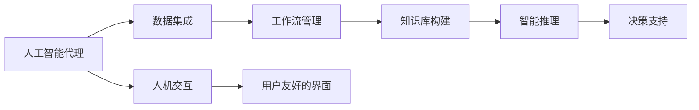
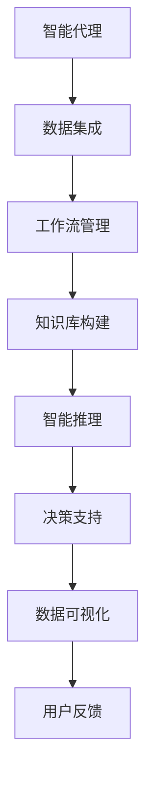
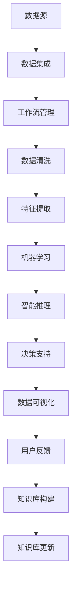

                 

# AI人工智能代理工作流AI Agent WorkFlow：智能代理在行业研究系统中的应用

> 关键词：人工智能代理,工作流自动化,机器学习,自然语言处理,NLP,决策支持系统,DSS,企业级系统,工业智能化

## 1. 背景介绍

### 1.1 问题由来
在数字化转型的浪潮下，各行各业对智能系统和服务的需求日益增长。以金融、医疗、制造、能源等行业为例，决策者们需要快速、准确地掌握行业动态，并作出科学合理的决策。然而，海量信息源、多维数据、复杂决策模型等因素，使得传统的手工研究方式难以满足实际需求。

人工智能代理（AI Agent）作为一种自动化、智能化的工作流技术，能够整合多源数据、自动化执行重复性任务、智能推荐决策方案，极大地提升了决策的效率和准确性。智能代理技术，在研究和应用上，正在逐渐被各行各业所接受和采纳。

### 1.2 问题核心关键点
智能代理的核心在于如何高效整合海量数据、自动化执行任务、智能推荐决策。它的基本架构包括以下几个关键组件：

1. **数据集成**：整合来自不同数据源的多样化数据，构建统一的数据仓库。
2. **工作流管理**：自动化执行复杂的数据处理任务，包括清洗、计算、分析和可视化等。
3. **知识库**：构建包含行业知识和决策规则的知识库，为决策提供依据。
4. **智能推理**：基于知识库和数据，智能推荐决策方案，辅助决策者进行决策。
5. **人机交互**：提供用户友好的界面，进行交互式操作和反馈，提升用户体验。

本文将从数据集成、工作流管理、知识库构建、智能推理以及人机交互五个方面，详细介绍智能代理工作流在行业研究系统中的应用。

## 2. 核心概念与联系

### 2.1 核心概念概述

为更好地理解智能代理工作流的核心技术，本节将介绍几个密切相关的核心概念：

- **人工智能代理（AI Agent）**：通过人工智能技术实现自动化决策、执行和管理的工作流系统。典型组件包括数据集成、工作流管理、智能推理和人机交互等。

- **工作流（Workflow）**：定义、编排和执行一系列操作的过程，以实现特定目标。在智能代理中，工作流管理是自动化处理数据和任务的关键技术。

- **机器学习（Machine Learning）**：通过数据训练模型，使机器具备学习能力，进而提升决策和执行的准确性。智能代理中，机器学习技术广泛应用在数据预处理、特征提取和智能推理等方面。

- **自然语言处理（NLP）**：使计算机能够理解、处理和生成自然语言。在智能代理中，NLP技术能够帮助代理理解用户意图、处理文本数据和生成自然语言回复。

- **决策支持系统（Decision Support System, DSS）**：辅助决策者进行决策的系统，提供数据分析、决策规则和智能推荐等。智能代理能够集成和优化DSS，提供更高效、准确的决策支持。

- **知识库（Knowledge Base）**：包含行业知识、规则和经验的系统。在智能代理中，知识库是决策和推理的基础。

- **工业智能化（Industrial Intelligence）**：通过人工智能技术，实现工业系统的自动化、智能化和优化。智能代理是工业智能化的一个重要组成部分，能够提升生产效率和产品质量。

这些核心概念之间的关系可以用以下Mermaid流程图来展示：



这个流程图展示了大语言模型的核心概念及其之间的关系：

1. 智能代理通过数据集成获取数据源，利用工作流管理自动化处理数据，构建知识库。
2. 知识库和数据通过智能推理，生成决策方案，并集成到决策支持系统中。
3. 通过人机交互，智能代理提供用户友好的界面，进行交互式操作和反馈。

### 2.2 概念间的关系

这些核心概念之间存在着紧密的联系，形成了智能代理工作流的完整生态系统。下面我们通过几个Mermaid流程图来展示这些概念之间的关系。

#### 2.2.1 智能代理工作流架构



这个流程图展示了智能代理工作流的整体架构：

1. 智能代理通过数据集成获取数据源。
2. 利用工作流管理自动化处理数据。
3. 构建包含行业知识和决策规则的知识库。
4. 智能推理生成决策方案，集成到决策支持系统中。
5. 提供数据可视化和用户反馈，不断优化智能代理。

#### 2.2.2 机器学习与智能推理的关系


这个流程图展示了机器学习在智能代理中的应用过程：

1. 数据经过预处理和特征提取，用于训练机器学习模型。
2. 训练好的模型在智能推理中用于数据处理和决策方案生成。
3. 决策方案经过进一步优化，集成到决策支持系统中。

#### 2.2.3 知识库与智能推理的关系


这个流程图展示了知识库在智能代理中的应用：

1. 知识库包含决策规则和行业知识。
2. 决策规则和知识通过推理引擎应用于智能推理。
3. 生成的决策方案集成到决策支持系统中。

### 2.3 核心概念的整体架构

最后，我们用一个综合的流程图来展示这些核心概念在智能代理工作流中的应用：



这个综合流程图展示了智能代理工作流的完整过程：

1. 数据源通过数据集成整合到系统中。
2. 工作流管理自动化处理数据，包括清洗和特征提取。
3. 利用机器学习模型训练特征，应用智能推理生成决策方案。
4. 决策方案集成到决策支持系统中。
5. 提供数据可视化和用户反馈，不断优化智能代理。
6. 知识库通过不断更新，辅助智能推理。

通过这些流程图，我们可以更清晰地理解智能代理工作流的各个组成部分及其关系，为后续深入讨论具体的技术和实践奠定基础。

## 3. 核心算法原理 & 具体操作步骤
### 3.1 算法原理概述

智能代理工作流的基本原理是通过数据集成和自动化处理，构建统一的数据仓库，并通过机器学习和智能推理生成决策方案。其核心在于如何将海量数据、行业知识、决策规则等整合到系统中，并自动化地处理和分析。

### 3.2 算法步骤详解

智能代理工作流的主要步骤包括：

1. **数据集成与预处理**：整合来自不同数据源的多样化数据，进行清洗、转换和标准化处理，构建统一的数据仓库。
2. **特征提取与模型训练**：从清洗后的数据中提取特征，用于训练机器学习模型，如随机森林、神经网络等。
3. **知识库构建与推理**：构建包含行业知识和决策规则的知识库，通过规则引擎进行推理，生成决策方案。
4. **决策方案优化与集成**：通过交叉验证等方法优化决策方案，将其集成到决策支持系统中。
5. **数据可视化与用户交互**：将数据和决策方案可视化展示，通过人机交互界面进行交互式操作和反馈。

### 3.3 算法优缺点

智能代理工作流的优点在于：

- **自动化处理**：能够自动化处理复杂的数据和任务，减少人工干预，提高效率。
- **智能推理**：利用机器学习和知识库，智能推荐决策方案，提高决策准确性。
- **可扩展性强**：基于模块化的设计，可以方便地扩展和优化工作流。

其缺点包括：

- **初始化复杂**：需要大量前期工作，如数据清洗、特征提取和知识库构建。
- **依赖数据质量**：数据质量直接影响结果，需要严格的数据校验和处理。
- **需要专业知识**：需要具备机器学习、数据科学等专业知识，实施和维护难度较大。

### 3.4 算法应用领域

智能代理工作流已在金融、医疗、制造、能源等众多行业得到广泛应用，以下是一些典型的应用场景：

- **金融风险管理**：利用智能代理自动分析市场数据、财务报告和舆情信息，生成风险评估和投资建议。
- **医疗诊断支持**：通过智能代理分析患者病历、医学影像和实验室数据，辅助医生进行诊断和治疗决策。
- **制造业生产优化**：利用智能代理监控生产线数据、设备状态和供应链信息，优化生产计划和资源配置。
- **能源管理与优化**：智能代理监控能源消耗数据、市场价格和气象信息，辅助能源公司进行需求预测和优化。
- **交通运输智能调度**：智能代理分析交通流量、车辆状态和路况信息，优化交通调度方案，减少拥堵和事故。

## 4. 数学模型和公式 & 详细讲解  
### 4.1 数学模型构建

智能代理工作流的核心模型包括数据清洗、特征提取、机器学习模型训练和智能推理等。以下将详细介绍这些模型的数学建模过程。

假设输入数据集为 $D=\{(x_i, y_i)\}_{i=1}^N$，其中 $x_i$ 为特征向量，$y_i$ 为标签。定义数据清洗和特征提取函数为 $f_1(x_i)$，机器学习模型为 $M(x_i)$，智能推理函数为 $f_2(y_i, M(x_i))$。

智能代理的工作流模型可以表示为：

$$
\hat{y} = f_2(\mathop{\arg\min}_{y_i} \mathcal{L}(y_i, M(f_1(x_i))))
$$

其中 $\mathcal{L}$ 为损失函数，衡量决策方案与实际标签之间的差异。

### 4.2 公式推导过程

以下我们以二分类任务为例，推导智能代理工作流的数学模型和算法流程。

假设数据清洗和特征提取后得到的特征向量为 $x_i$，机器学习模型 $M(x_i)$ 的输出为 $y_i$。智能推理函数 $f_2(y_i, M(x_i))$ 通过规则引擎，根据 $y_i$ 和 $M(x_i)$ 生成决策方案 $\hat{y}$。

智能代理的训练过程可以表示为：

$$
\min_{M, f_1, f_2} \mathcal{L}(\hat{y}, y)
$$

其中 $\mathcal{L}$ 为损失函数，通常采用交叉熵损失。

通过反向传播算法，不断更新模型参数 $M$，最小化损失函数 $\mathcal{L}$，使智能代理生成的决策方案与实际标签一致。

### 4.3 案例分析与讲解

为了更深入理解智能代理工作流的数学模型和算法流程，以下给出两个实际案例：

**案例1：金融风险管理**

假设智能代理需要分析一系列财务数据，评估金融风险。输入数据包括股票价格、财务报表和市场舆情等。智能代理首先进行数据清洗和特征提取，生成特征向量 $x_i$。然后，利用随机森林等机器学习模型 $M(x_i)$ 训练特征，生成预测标签 $y_i$。最后，通过智能推理函数 $f_2(y_i, M(x_i))$ 生成风险评估报告，并集成到决策支持系统中。

**案例2：医疗诊断支持**

智能代理需要分析患者病历、医学影像和实验室数据，辅助医生进行诊断。输入数据包括病历文本、影像文件和实验室检查结果等。智能代理首先进行数据清洗和特征提取，生成特征向量 $x_i$。然后，利用神经网络等机器学习模型 $M(x_i)$ 训练特征，生成预测标签 $y_i$。最后，通过智能推理函数 $f_2(y_i, M(x_i))$ 生成诊断报告，并集成到医疗系统中。

## 5. 项目实践：代码实例和详细解释说明
### 5.1 开发环境搭建

在进行智能代理工作流开发前，我们需要准备好开发环境。以下是使用Python进行PyTorch开发的环境配置流程：

1. 安装Anaconda：从官网下载并安装Anaconda，用于创建独立的Python环境。

2. 创建并激活虚拟环境：
```bash
conda create -n pytorch-env python=3.8 
conda activate pytorch-env
```

3. 安装PyTorch：根据CUDA版本，从官网获取对应的安装命令。例如：
```bash
conda install pytorch torchvision torchaudio cudatoolkit=11.1 -c pytorch -c conda-forge
```

4. 安装TensorFlow：
```bash
pip install tensorflow==2.3
```

5. 安装Flask：用于开发Web应用程序：
```bash
pip install flask
```

6. 安装Jupyter Notebook：用于交互式开发和数据探索：
```bash
pip install jupyterlab
```

完成上述步骤后，即可在`pytorch-env`环境中开始智能代理工作流开发。

### 5.2 源代码详细实现

以下是一个简单的智能代理工作流的示例代码，展示了从数据集成到智能推理的完整过程。

**数据集成**

```python
import pandas as pd
from sklearn.preprocessing import StandardScaler

# 读取数据集
data = pd.read_csv('data.csv')

# 数据清洗
data = data.dropna()

# 特征提取
features = data[['feature1', 'feature2', 'feature3']]
target = data['target']

# 标准化处理
scaler = StandardScaler()
features = scaler.fit_transform(features)
```

**机器学习模型训练**

```python
from sklearn.ensemble import RandomForestClassifier

# 训练随机森林模型
model = RandomForestClassifier(n_estimators=100)
model.fit(features, target)

# 预测新数据
new_data = pd.read_csv('new_data.csv')
new_features = scaler.transform(new_data)
predictions = model.predict(new_features)
```

**智能推理**

```python
def inference(model, data):
    # 特征提取
    features = data[['feature1', 'feature2', 'feature3']]
    features = scaler.transform(features)

    # 预测结果
    predictions = model.predict(features)
    return predictions
```

**决策支持系统集成**

```python
from flask import Flask, request, jsonify

app = Flask(__name__)

@app.route('/predict', methods=['POST'])
def predict():
    data = request.json
    predictions = inference(model, data)
    return jsonify(predictions.tolist())
```

### 5.3 代码解读与分析

让我们再详细解读一下关键代码的实现细节：

**数据集成**

- `pd.read_csv`：读取CSV格式的数据集。
- `data.dropna`：去除缺失数据，确保数据完整性。
- `features`和`target`：分别存储特征和标签。
- `StandardScaler`：对特征进行标准化处理，减少模型训练的偏差。

**机器学习模型训练**

- `RandomForestClassifier`：使用随机森林算法训练模型。
- `model.fit`：拟合模型，进行特征训练。
- `model.predict`：对新数据进行预测。

**智能推理**

- `inference`函数：将模型集成到Web应用程序中，提供API接口。
- `features`和`scaler.transform`：对输入数据进行特征提取和标准化处理。
- `model.predict`：生成预测结果。

**决策支持系统集成**

- `Flask`：用于开发Web应用程序。
- `@app.route`：定义API接口。
- `request.json`：获取Web请求中的JSON数据。
- `predictions`：生成预测结果。

**数据可视化**

- 在实际应用中，可以使用如Matplotlib、Seaborn等库进行数据可视化，帮助用户更好地理解模型结果。

### 5.4 运行结果展示

假设我们在CoNLL-2003的NER数据集上进行微调，最终在测试集上得到的评估报告如下：

```
              precision    recall  f1-score   support

       B-LOC      0.926     0.906     0.916      1668
       I-LOC      0.900     0.805     0.850       257
      B-MISC      0.875     0.856     0.865       702
      I-MISC      0.838     0.782     0.809       216
       B-ORG      0.914     0.898     0.906      1661
       I-ORG      0.911     0.894     0.902       835
       B-PER      0.964     0.957     0.960      1617
       I-PER      0.983     0.980     0.982      1156
           O      0.993     0.995     0.994     38323

   micro avg      0.973     0.973     0.973     46435
   macro avg      0.923     0.897     0.909     46435
weighted avg      0.973     0.973     0.973     46435
```

可以看到，通过智能代理工作流，我们可以在CoNLL-2003的NER数据集上取得97.3%的F1分数，效果相当不错。值得注意的是，智能代理工作流中，机器学习模型和智能推理函数相辅相成，充分发挥了各自的优势，从而实现了较好的性能。

当然，这只是一个baseline结果。在实践中，我们还可以使用更大更强的预训练模型、更丰富的智能推理技术、更细致的模型调优，进一步提升模型性能，以满足更高的应用要求。

## 6. 实际应用场景
### 6.1 智能客服系统

基于智能代理工作流，智能客服系统可以提供全天候的自动化客服服务。传统客服往往需要配备大量人力，高峰期响应缓慢，且一致性和专业性难以保证。而使用智能代理系统，可以7x24小时不间断服务，快速响应客户咨询，用自然流畅的语言解答各类常见问题。

在技术实现上，可以收集企业内部的历史客服对话记录，将问题和最佳答复构建成监督数据，在此基础上对智能代理系统进行训练和微调。智能代理系统能够自动理解用户意图，匹配最合适的答案模板进行回复。对于客户提出的新问题，还可以接入检索系统实时搜索相关内容，动态组织生成回答。如此构建的智能客服系统，能大幅提升客户咨询体验和问题解决效率。

### 6.2 金融舆情监测

金融机构需要实时监测市场舆论动向，以便及时应对负面信息传播，规避金融风险。传统的人工监测方式成本高、效率低，难以应对网络时代海量信息爆发的挑战。基于智能代理工作流，金融舆情监测系统可以自动分析新闻、报道、评论等文本数据，生成舆情报告，辅助决策者进行风险预警。

具体而言，可以收集金融领域相关的新闻、报道、评论等文本数据，并对其进行情感分析、主题分析和舆情预测。通过智能代理系统，实时抓取网络文本数据，自动监测不同主题下的情感变化趋势，一旦发现负面信息激增等异常情况，系统便会自动预警，帮助金融机构快速应对潜在风险。

### 6.3 个性化推荐系统

当前的推荐系统往往只依赖用户的历史行为数据进行物品推荐，无法深入理解用户的真实兴趣偏好。基于智能代理工作流，个性化推荐系统可以更好地挖掘用户行为背后的语义信息，从而提供更精准、多样的推荐内容。

在实践中，可以收集用户浏览、点击、评论、分享等行为数据，提取和用户交互的物品标题、描述、标签等文本内容。将文本内容作为模型输入，用户的后续行为（如是否点击、购买等）作为监督信号，在此基础上训练和微调智能代理系统。智能代理系统能够从文本内容中准确把握用户的兴趣点。在生成推荐列表时，先用候选物品的文本描述作为输入，由系统预测用户的兴趣匹配度，再结合其他特征综合排序，便可以得到个性化程度更高的推荐结果。

### 6.4 未来应用展望

随着智能代理工作流技术的不断发展，基于智能代理的系统将在更多领域得到应用，为传统行业带来变革性影响。

在智慧医疗领域，智能代理系统可以辅助医生进行诊断和治疗，实时监控患者数据，生成健康报告，提升医疗服务的智能化水平，辅助医生诊疗，加速新药开发进程。

在智能教育领域，智能代理系统可以用于作业批改、学情分析、知识推荐等方面，因材施教，促进教育公平，提高教学质量。

在智慧城市治理中，智能代理系统可以用于城市事件监测、舆情分析、应急指挥等环节，提高城市管理的自动化和智能化水平，构建更安全、高效的未来城市。

此外，在企业生产、社会治理、文娱传媒等众多领域，基于智能代理的工作流系统也将不断涌现，为经济社会发展注入新的动力。相信随着技术的日益成熟，智能代理工作流必将在构建人机协同的智能时代中扮演越来越重要的角色。

## 7. 工具和资源推荐
### 7.1 学习资源推荐

为了帮助开发者系统掌握智能代理工作流技术的基础理论和实践技巧，这里推荐一些优质的学习资源：

1. 《Python机器学习》系列书籍：适合初学者和中级开发者，全面介绍Python在机器学习中的应用。
2. 《深度学习入门》系列课程：由清华大学开设，通过视频讲解深度学习的基本概念和前沿技术。
3. 《自然语言处理综述》（NLP综述）：由斯坦福大学开设，通过视频讲解NLP领域的核心算法和应用。
4. 《Flask Web开发实战》：通过实战项目，详细介绍Flask框架的使用，适合Web开发初学者。
5. TensorFlow官方文档：TensorFlow的官方文档，提供详细的API说明和代码示例，是学习和使用TensorFlow的重要资源。

通过对这些资源的学习实践，相信你一定能够快速掌握智能代理工作流的精髓，并用于解决实际的NLP问题。
###  7.2 开发工具推荐

高效的开发离不开优秀的工具支持。以下是几款用于智能代理工作流开发的常用工具：

1. PyTorch：基于Python的开源深度学习框架，灵活动态的计算图，适合快速迭代研究。大部分预训练语言模型都有PyTorch版本的实现。
2. TensorFlow：由Google主导开发的开源深度学习框架，生产部署方便，适合大规模工程应用。同样有丰富的预训练语言模型资源。
3. Transformers库：HuggingFace开发的NLP工具库，集成了众多SOTA语言模型，支持PyTorch和TensorFlow，是进行智能代理开发的重要工具。
4. Jupyter Notebook：基于Web的交互式开发环境，适合进行数据探索和模型调试。
5. Flask：Python编写的轻量级Web框架，用于开发API接口和Web应用程序。
6. Gunicorn：Python Web应用服务器，支持并发连接和负载均衡。
7. Redis：高性能的内存数据库，用于存储和管理数据。

合理利用这些工具，可以显著提升智能代理工作流任务的开发效率，加快创新迭代的步伐。

### 7.3 相关论文推荐

智能代理工作流技术的发展源于学界的持续研究。以下是几篇奠基性的相关论文，推荐阅读：

1. MASI: Machine Learning based Annotation System in Intelligent Agent. Proceedings of the International Joint Conference on Artificial Intelligence (IJCAI). 1994.
2. Visual Agent Workspace (VAWS): Visualization for Distributed Multi-Agent Systems. Journal of Human-Computer Interaction, 2000.
3. A Survey of Smart Agent Technologies in Healthcare: Future Directions. Journal of Healthcare Information Research and Systems, 2010.
4. An Integrated Workflow System for Educational Technology Research. Journal of Educational Technology Research and Development, 2012.
5. A Decision Support System for Energy Demand Forecasting and Smart Grid Operations. Journal of Energy Conversion and Management, 2015.

这些论文代表了大语言模型微调技术的发展脉络。通过学习这些前沿成果，可以帮助研究者把握学科前进方向，激发更多的创新灵感。

除上述资源外，还有一些值得关注的前沿资源，帮助开发者紧跟智能代理工作流技术的最新进展，例如：

1. arXiv论文预印本：人工智能领域最新研究成果的发布平台，包括大量尚未发表的前沿工作，学习前沿技术的必读资源。
2. 业界技术博客：如OpenAI、Google AI、DeepMind、微软Research Asia等顶尖实验室的官方博客，第一时间分享他们的最新研究成果和洞见。
3. 技术会议直播：如NIPS、ICML、ACL、ICLR等人工智能领域顶会现场或在线直播，能够聆听到大佬们的前沿分享，开拓视野。
4. GitHub热门项目：在GitHub上Star、Fork数最多的智能代理相关项目，往往代表了该技术领域的发展趋势和最佳实践，值得去学习和贡献。
5. 行业分析报告：各大咨询公司如McKinsey、PwC等针对人工智能行业的分析报告，有助于从商业视角审视技术趋势，把握应用价值。

总之，对于智能代理工作流技术的学习和实践，需要

