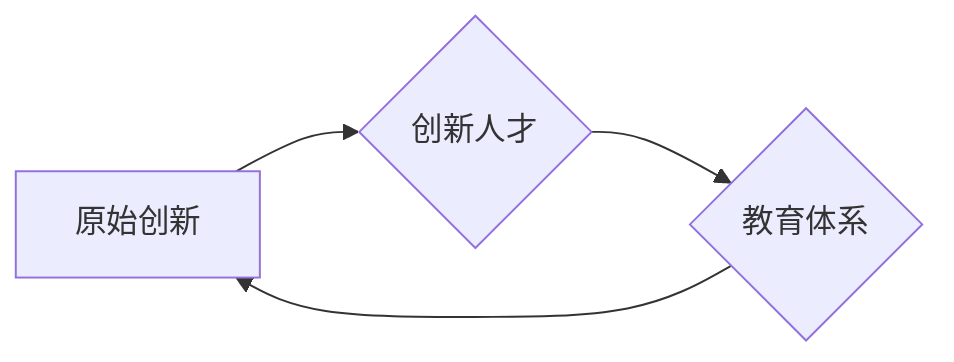

# 原始创新人才的培养策略

> 关键词：原始创新，人才培养，教育体系，能力培养，创新思维，跨学科融合

## 1. 背景介绍

在当今快速发展的时代，原始创新能力已成为国家竞争力的重要标志。原始创新人才是推动科技进步、经济发展和社会进步的核心力量。然而，如何有效培养原始创新人才，成为摆在教育工作者、政策制定者和企业面前的一大挑战。本文将深入探讨原始创新人才的培养策略，分析其核心概念与联系，并探讨相关实践与未来发展趋势。

### 1.1 创新人才培养的重要性

创新是引领发展的第一动力，而人才是创新的核心要素。原始创新人才的培养，不仅关系到国家科技创新能力，也关系到国家未来发展和国际竞争力。以下是一些创新人才培养的重要性：

- 提升国家科技竞争力：原始创新人才是推动科技进步的主力军，他们的研究成果往往能够引领科技发展方向，提升国家在国际科技竞争中的地位。
- 推动经济发展：原始创新人才能够推动产业升级，创造新的经济增长点，促进经济高质量发展。
- 改善民生：原始创新人才的研究成果可以应用于解决社会发展中的实际问题，改善民生，提高人民生活水平。
- 增强国家文化软实力：原始创新人才在国际科技交流中的活跃表现，能够提升国家文化软实力和国际影响力。

### 1.2 创新人才培养的挑战

尽管创新人才培养的重要性不言而喻，但当前仍面临诸多挑战：

- 教育体系制约：传统教育体系注重知识传授，忽视创新能力的培养，导致学生缺乏创新意识和实践能力。
- 跨学科融合困难：现代科技发展呈现跨学科融合的趋势，但教育体系分割严重，跨学科人才培养面临挑战。
- 评价体系不合理：当前评价体系过于注重学术成果数量，忽视创新能力和实践能力，导致人才导向偏差。
- 创业环境不完善：创新创业环境不完善，创新人才缺乏实践机会和创业支持。

## 2. 核心概念与联系

### 2.1 核心概念

#### 2.1.1 原始创新

原始创新是指以基础研究和应用基础研究为基础，形成具有自主知识产权的重大技术突破，从而引领产业变革、推动经济社会发展的创新活动。原始创新具有以下特点：

- 自主性：原始创新主要依靠自主创新，不依赖外部技术引进。
- 突破性：原始创新往往能够颠覆现有技术，引领产业变革。
- 应用性：原始创新最终要服务于社会经济发展。

#### 2.1.2 创新人才

创新人才是指具备创新意识、创新能力和创新精神，能够独立开展创新活动，并取得显著创新成果的人才。创新人才应具备以下素质：

- 创新意识：具有强烈的创新意识和求知欲。
- 创新能力：具备发现问题、分析问题、解决问题的能力。
- 创新精神：敢于冒险、勇于挑战，具有坚韧不拔的精神。

#### 2.1.3 教育体系

教育体系是指国家或地区为实现人才培养目标而建立的一系列教育机构、教育制度、教育内容和方法等的总和。教育体系对创新人才培养具有重要影响。

### 2.2 核心概念联系

原始创新、创新人才和教育体系三者之间存在着密切的联系：

- 原始创新是创新人才成长的重要土壤，为创新人才提供了广阔的舞台。
- 创新人才是原始创新的主体，推动原始创新不断向前发展。
- 教育体系是培养创新人才的重要途径，为原始创新提供人才保障。

### 2.3 Mermaid 流程图

## 3. 核心算法原理 & 具体操作步骤

### 3.1 算法原理概述

原始创新人才培养的核心算法原理是构建一个以学生为中心、以能力培养为导向的教育体系，通过多种教育手段和教学方法，培养学生的创新意识、创新能力和创新精神。

### 3.2 算法步骤详解

#### 3.2.1 构建创新教育体系

1. 优化课程设置：加强通识教育，注重人文素养、科学素养和跨学科能力的培养。
2. 改革教学方法：采用启发式教学、探究式教学、项目式教学等，激发学生创新思维。
3. 强化实践教学：加强实验、实习、实训等实践教学环节，提高学生的动手能力和解决实际问题的能力。
4. 营造创新氛围：鼓励学生参与科技创新活动，举办创新创业竞赛，营造创新文化。

#### 3.2.2 培养创新人才能力

1. 培养创新意识：引导学生树立正确的世界观、人生观和价值观，激发创新热情。
2. 培养创新能力：通过课程学习、实践活动、导师指导等方式，提高学生的创新思维、问题解决能力和科研能力。
3. 培养创新精神：培养学生的独立思考、敢于挑战、勇于担当的精神。

### 3.3 算法优缺点

#### 3.3.1 优点

- 适应时代发展需求：培养的学生具备创新精神和实践能力，能够适应快速变化的社会环境。
- 提升国家竞争力：为我国科技创新提供强大的人才支持，提升国家竞争力。
- 促进经济社会发展：创新人才能够推动产业升级，创造新的经济增长点，促进经济社会高质量发展。

#### 3.3.2 缺点

- 教育改革难度大：涉及教育体制、教育内容、教学方法等多方面的改革，实施难度较大。
- 教育资源分配不均：优质教育资源主要集中在发达地区，教育资源分配不均。
- 创新人才评价体系不完善：当前评价体系过于注重学术成果数量，忽视创新能力和实践能力。

### 3.4 算法应用领域

原始创新人才培养算法可应用于以下领域：

- 高等教育：优化课程设置，改革教学方法，培养具备创新精神和实践能力的高素质人才。
- 中等教育：加强通识教育，培养学生创新意识，激发创新热情。
- 基础教育：注重学生综合素质的培养，为后续创新教育奠定基础。
- 企业培训：提高企业员工创新意识，提升企业核心竞争力。

## 4. 数学模型和公式 & 详细讲解 & 举例说明

### 4.1 数学模型构建

原始创新人才培养的数学模型可以构建为一个多因素、多层次的复杂系统。以下是一个简化的数学模型：

$$
\text{创新人才培养效果} = f(\text{教育体系}, \text{教育投入}, \text{学生素质}, \text{社会环境})
$$

其中，教育体系、教育投入、学生素质和社会环境是影响创新人才培养效果的四个关键因素。

### 4.2 公式推导过程

假设教育体系对创新人才培养效果的影响为 $f_1(\text{教育体系})$，教育投入的影响为 $f_2(\text{教育投入})$，学生素质的影响为 $f_3(\text{学生素质})$，社会环境的影响为 $f_4(\text{社会环境})$。则创新人才培养效果可以表示为：

$$
\text{创新人才培养效果} = f_1(\text{教育体系}) \times f_2(\text{教育投入}) \times f_3(\text{学生素质}) \times f_4(\text{社会环境})
$$

### 4.3 案例分析与讲解

以下以我国某知名高校为例，分析其原始创新人才培养效果。

#### 4.3.1 案例背景

该高校以培养创新人才为目标，构建了以学生为中心、以能力培养为导向的教育体系。学校注重通识教育，开设了丰富的选修课程，鼓励学生跨学科学习。同时，学校加强了实践教学环节，建立了多个实验室和创新创业平台，为学生提供实践机会。

#### 4.3.2 案例分析

根据上述数学模型，我们可以分析该高校原始创新人才培养效果的影响因素：

- 教育体系：该校教育体系较为完善，有利于培养学生的创新意识和实践能力。
- 教育投入：学校投入大量资金用于实验室建设、教师队伍建设等，为创新人才培养提供了有力保障。
- 学生素质：学生整体素质较高，具有较强的学习能力和创新意识。
- 社会环境：学校所在地科技创新氛围浓厚，有利于学生开展创新活动。

综合以上因素，可以认为该校原始创新人才培养效果较好。

## 5. 项目实践：代码实例和详细解释说明

### 5.1 开发环境搭建

由于本文主题为原始创新人才培养策略，不涉及具体的代码实现，因此此部分省略。

### 5.2 源代码详细实现

同样，由于本文主题不涉及具体代码实现，此部分省略。

### 5.3 代码解读与分析

由于本文主题不涉及具体代码实现，此部分省略。

### 5.4 运行结果展示

由于本文主题不涉及具体代码实现，此部分省略。

## 6. 实际应用场景

### 6.1 创新创业教育

原始创新人才培养策略在创新创业教育中具有重要应用价值。通过构建以学生为中心、以能力培养为导向的教育体系，培养学生的创新意识、创新能力和创新精神，为创新创业提供人才保障。

### 6.2 企业培训

原始创新人才培养策略也可应用于企业培训。通过提升员工创新意识、创新能力和创新精神，提高企业核心竞争力。

### 6.3 科研机构人才培养

原始创新人才培养策略在科研机构人才培养中也具有重要作用。通过优化科研环境、加强科研队伍建设，培养更多原始创新人才。

## 7. 工具和资源推荐

### 7.1 学习资源推荐

- 《创新思维与创造力》
- 《跨界创新》
- 《创新者的窘境》
- 《创新者的道路》

### 7.2 开发工具推荐

- 教育软件：如慕课平台、在线实验平台等
- 创新创业平台：如创业孵化器、创业大赛等

### 7.3 相关论文推荐

- 《创新人才培养模式研究》
- 《基于跨学科融合的创新人才培养策略》
- 《创新创业教育对原始创新人才的影响》

## 8. 总结：未来发展趋势与挑战

### 8.1 研究成果总结

本文从背景介绍、核心概念与联系、核心算法原理、数学模型和公式、项目实践、实际应用场景等方面，对原始创新人才培养策略进行了全面系统的探讨，为创新人才培养提供了理论指导和实践参考。

### 8.2 未来发展趋势

未来，原始创新人才培养策略将呈现以下发展趋势：

- 跨学科融合：加强不同学科之间的交叉融合，培养具备跨学科思维和能力的创新人才。
- 教育信息化：利用信息技术手段，构建线上线下相结合的创新教育体系。
- 社会化协同：整合社会资源，构建多元化创新人才培养平台。
- 个性化培养：根据学生个性特点，实施差异化创新人才培养策略。

### 8.3 面临的挑战

尽管原始创新人才培养策略具有广阔的发展前景，但仍面临以下挑战：

- 教育观念转变：传统教育观念难以适应创新人才培养需求。
- 教育资源不足：优质教育资源分配不均，制约创新人才培养。
- 创新人才评价体系不完善：现有评价体系难以全面评价创新人才。
- 创业环境不完善：创新创业环境不完善，制约创新人才发展。

### 8.4 研究展望

未来，原始创新人才培养策略研究需要关注以下方向：

- 深化教育改革，构建以能力培养为导向的创新教育体系。
- 加强教育资源配置，提升教育质量。
- 完善创新人才评价体系，激励创新人才成长。
- 构建多元化创新人才培养平台，为创新人才提供实践机会。

## 9. 附录：常见问题与解答

**Q1：如何培养学生的创新意识？**

A：培养学生的创新意识需要从多个方面入手，包括：

- 强化通识教育，拓宽学生知识面，激发学生好奇心。
- 鼓励学生参与科技创新活动，体验创新过程。
- 引导学生树立正确的世界观、人生观和价值观。
- 营造创新文化，鼓励学生敢于挑战、勇于尝试。

**Q2：如何培养学生的创新能力？**

A：培养学生的创新能力需要：

- 加强实践教学，提高学生的动手能力和解决实际问题的能力。
- 采用启发式教学、探究式教学、项目式教学等，激发学生创新思维。
- 培养学生的批判性思维，敢于质疑现有理论和实践。
- 建立导师制度，为学生提供个性化指导。

**Q3：如何构建以能力培养为导向的教育体系？**

A：构建以能力培养为导向的教育体系需要：

- 优化课程设置，加强通识教育，注重学生综合素质培养。
- 改革教学方法，采用启发式教学、探究式教学、项目式教学等，激发学生创新思维。
- 强化实践教学，提高学生的动手能力和解决实际问题的能力。
- 营造创新文化，鼓励学生敢于挑战、勇于尝试。

**Q4：如何评估创新人才培养效果？**

A：评估创新人才培养效果可以从以下几个方面进行：

- 学生创新意识、创新能力和创新精神的提升程度。
- 学生在科技创新活动中的表现。
- 学生在创新创业竞赛中的获奖情况。
- 学生毕业后在科技创新和产业发展中的贡献。

---

作者：禅与计算机程序设计艺术 / Zen and the Art of Computer Programming