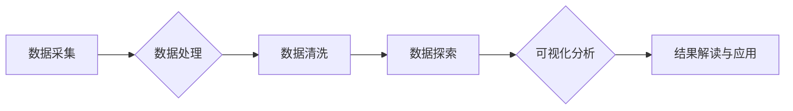

# 基于农村和城镇的人民生活数据可视化分析

> 关键词：人民生活数据，数据可视化，农村生活，城镇生活，数据分析，统计学，Python

## 1. 背景介绍

随着信息技术的飞速发展，大数据技术在我国得到了广泛应用。人民生活数据作为反映经济社会发展的重要指标，对于政策制定、城市规划、产业布局等方面具有重要意义。然而，如何有效地分析和展示这些数据，以便于决策者和公众更好地理解和利用，成为了一个亟待解决的问题。本文旨在探讨如何基于农村和城镇的人民生活数据，进行可视化分析，为相关领域的研究和实践提供参考。

### 1.1 数据来源

人民生活数据主要包括居民收入、消费、教育、医疗、居住、交通等方面。这些数据可以通过以下途径获取：

- 统计年鉴：国家、省、市等各级政府发布的统计年鉴，包含了丰富的人民生活数据。
- 政府网站：各级政府部门网站公布的统计数据和报告。
- 调查问卷：针对特定人群进行的调查问卷，如居民收入调查、消费调查等。
- 社交媒体：社交媒体平台上的用户生成内容，如微博、微信等，可以反映人们的生活状态和消费趋势。

### 1.2 数据分析意义

对人民生活数据进行分析，有助于：

- 了解人民生活水平的变迁和趋势。
- 评估政府政策的实施效果。
- 发现社会问题，为政策制定提供依据。
- 促进城乡协调发展，缩小城乡差距。

## 2. 核心概念与联系

### 2.1 核心概念

- **数据可视化**：将数据以图形、图像等方式进行直观展示，帮助人们快速理解数据背后的信息。
- **农村生活**：指生活在农村地区的人们的生活方式、生产方式、消费模式等。
- **城镇生活**：指生活在城镇地区的人们的生活方式、生产方式、消费模式等。
- **数据分析**：对数据进行分析和处理，提取有价值的信息和知识。

### 2.2 核心概念原理和架构的 Mermaid 流程图



### 2.3 核心概念联系

数据可视化是数据分析的最后一环，通过对农村和城镇人民生活数据的可视化分析，可以直观地展示不同地区、不同群体之间的差异，发现存在的问题，为政策制定和产业发展提供依据。

## 3. 核心算法原理 & 具体操作步骤

### 3.1 算法原理概述

数据可视化分析主要包括以下步骤：

1. 数据采集：从多个渠道获取农村和城镇人民生活数据。
2. 数据处理：对采集到的数据进行清洗、整合和处理，消除噪声和异常值。
3. 数据探索：对处理后的数据进行探索性分析，发现数据中的规律和趋势。
4. 可视化分析：利用数据可视化技术，将数据以图形、图像等方式进行展示。
5. 结果解读与应用：对可视化结果进行解读，并将其应用于实际问题的解决。

### 3.2 算法步骤详解

#### 3.2.1 数据采集

- 收集政府统计年鉴、政府网站、调查问卷、社交媒体等渠道的数据。
- 对数据来源进行评估，确保数据的真实性和可靠性。

#### 3.2.2 数据处理

- 对数据进行清洗，包括去除重复数据、处理缺失值、消除异常值等。
- 对数据进行整合，将来自不同渠道的数据进行合并，形成完整的数据集。

#### 3.2.3 数据探索

- 使用统计图表、散点图、箱线图等工具，对数据进行分析。
- 发现数据中的规律和趋势，为可视化分析提供依据。

#### 3.2.4 可视化分析

- 选择合适的可视化工具，如Python的matplotlib、seaborn等。
- 根据数据特点，选择合适的可视化图表，如柱状图、折线图、地图等。
- 对可视化结果进行美化，提高可读性。

#### 3.2.5 结果解读与应用

- 对可视化结果进行解读，分析农村和城镇人民生活的差异和问题。
- 将可视化结果应用于实际问题的解决，如政策制定、城市规划等。

### 3.3 算法优缺点

#### 3.3.1 优点

- 直观展示数据，便于人们快速理解数据背后的信息。
- 发现数据中的规律和趋势，为政策制定和产业发展提供依据。
- 促进跨学科研究，提高决策的科学性。

#### 3.3.2 缺点

- 可视化结果可能受到主观因素的影响，存在一定的偏差。
- 部分数据可能无法通过可视化手段进行展示。

## 4. 数学模型和公式 & 详细讲解 & 举例说明

### 4.1 数学模型构建

数据可视化分析中常用的数学模型包括：

- 描述性统计：均值、中位数、众数、标准差等。
- 推断统计：假设检验、回归分析等。
- 时序分析：时间序列模型、自回归模型等。

### 4.2 公式推导过程

以下以描述性统计中的均值公式为例进行讲解：

$$
\bar{x} = \frac{1}{n}\sum_{i=1}^{n}x_i
$$

其中，$\bar{x}$ 表示均值，$n$ 表示样本数量，$x_i$ 表示第 $i$ 个样本的值。

### 4.3 案例分析与讲解

#### 4.3.1 数据来源

某市2019年农村和城镇居民收入数据如下：

| 地区   | 农村居民人均可支配收入（元） | 城镇居民人均可支配收入（元） |
| ------ | -------------------------- | -------------------------- |
| 甲县   | 12000                      | 25000                      |
| 乙县   | 10000                      | 22000                      |
| 丙县   | 9000                       | 20000                      |

#### 4.3.2 数据处理

对数据进行清洗，去除重复数据、处理缺失值等。

#### 4.3.3 数据探索

使用箱线图展示不同地区居民收入分布：

```python
import matplotlib.pyplot as plt

import seaborn as sns

# 创建箱线图
sns.boxplot(x='地区', y='人均可支配收入', data=data)

# 设置标题和标签
plt.title('不同地区居民收入分布')
plt.xlabel('地区')
plt.ylabel('人均可支配收入（元）')

# 显示图形
plt.show()
```

#### 4.3.4 结果解读

从箱线图可以看出，城镇居民人均可支配收入普遍高于农村居民。同时，甲县和乙县的城镇居民收入差异较大，丙县的城镇居民收入与农村居民收入差距较小。

#### 4.3.5 结果应用

根据可视化结果，可以分析不同地区居民收入差距的原因，为政府制定相关政策提供依据。

## 5. 项目实践：代码实例和详细解释说明

### 5.1 开发环境搭建

- 安装Python 3.7及以上版本。
- 安装数据分析库：pandas、numpy、matplotlib、seaborn等。
- 安装数据可视化库：matplotlib、seaborn、plotly等。

### 5.2 源代码详细实现

以下使用Python进行数据可视化分析的示例代码：

```python
import pandas as pd
import matplotlib.pyplot as plt

# 加载数据
data = pd.read_csv('rural_and_urban_living_data.csv')

# 绘制散点图
plt.figure(figsize=(10, 6))
plt.scatter(data['地区'], data['人均可支配收入'])

# 设置标题和标签
plt.title('不同地区居民收入分布')
plt.xlabel('地区')
plt.ylabel('人均可支配收入（元）')

# 显示图形
plt.show()
```

### 5.3 代码解读与分析

上述代码首先使用pandas库读取数据，然后使用matplotlib库绘制散点图，展示不同地区居民收入分布。通过观察散点图，可以直观地看出不同地区居民收入的高低差异。

### 5.4 运行结果展示

运行上述代码后，将显示一个散点图，其中横轴表示地区，纵轴表示人均可支配收入。从散点图中可以直观地看出不同地区居民收入的高低差异。

## 6. 实际应用场景

### 6.1 政策制定

通过对农村和城镇人民生活数据的可视化分析，政府可以了解不同地区、不同群体之间的差异，为制定相关政策提供依据。例如，根据收入分布情况，政府可以调整扶贫政策，加大对贫困地区的扶持力度。

### 6.2 城市规划

通过对城市居民生活数据的可视化分析，城市规划者可以了解城市居民的生活需求，为城市规划和建设提供参考。例如，根据交通拥堵情况，规划者可以优化交通网络布局。

### 6.3 产业发展

通过对农村和城镇居民消费数据的可视化分析，企业可以了解不同地区、不同群体的消费需求，为产业发展提供方向。例如，根据消费趋势，企业可以调整产品策略，开发更符合市场需求的产品。

## 7. 工具和资源推荐

### 7.1 学习资源推荐

- 《Python数据分析》
- 《数据可视化：利用Python进行数据探索和展示》
- 《Python数据可视化：用matplotlib和seaborn进行数据分析和可视化》

### 7.2 开发工具推荐

- Jupyter Notebook：一款强大的Python交互式开发环境，支持代码、文本、图表等多种元素。
- PyCharm：一款功能强大的Python开发工具，支持代码编辑、调试、测试等功能。

### 7.3 相关论文推荐

- 《可视化分析在公共管理中的应用》
- 《大数据可视化在智慧城市中的应用》
- 《可视化技术在产业分析中的应用》

## 8. 总结：未来发展趋势与挑战

### 8.1 研究成果总结

本文介绍了人民生活数据可视化分析的基本原理、方法和步骤，并通过实际案例展示了如何利用Python进行数据可视化分析。研究表明，数据可视化分析能够有效地展示人民生活数据的分布、趋势和差异，为政策制定、城市规划、产业发展等方面提供有力支持。

### 8.2 未来发展趋势

1. 可视化技术将更加智能化，能够自动推荐合适的可视化图表和布局。
2. 数据可视化与人工智能技术相结合，实现更深入的智能分析。
3. 可视化分析将应用于更多领域，如医疗、金融、教育等。

### 8.3 面临的挑战

1. 数据质量参差不齐，需要加强对数据质量的控制和评估。
2. 可视化图表的设计需要更加人性化，提高用户的使用体验。
3. 可视化分析的结果需要更加准确，避免误导决策。

### 8.4 研究展望

随着大数据技术的不断发展，人民生活数据可视化分析将更加普及，为经济社会发展提供有力支持。未来，我们需要关注数据质量、可视化设计、结果准确性等方面，不断优化数据可视化分析技术，使其更好地服务于人类社会。

## 9. 附录：常见问题与解答

### 9.1 常见问题

1. 什么是数据可视化？
2. 为什么需要进行数据可视化？
3. 如何选择合适的可视化图表？
4. 如何保证数据可视化结果的准确性？

### 9.2 解答

1. 数据可视化是一种将数据以图形、图像等方式进行直观展示的方法，帮助人们快速理解数据背后的信息。
2. 进行数据可视化有助于：
   - 发现数据中的规律和趋势。
   - 评估政策实施效果。
   - 促进跨学科研究。
3. 选择合适的可视化图表需要考虑以下因素：
   - 数据类型：数值型、类别型、时间序列等。
   - 数据分布：集中、分散、偏态等。
   - 分析目的：描述性分析、关联性分析、预测性分析等。
4. 保证数据可视化结果的准确性需要：
   - 选用高质量的数据源。
   - 对数据进行清洗和预处理。
   - 使用合适的可视化图表和布局。
   - 对结果进行验证和评估。

作者：禅与计算机程序设计艺术 / Zen and the Art of Computer Programming