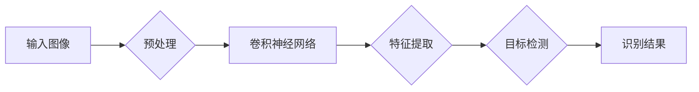
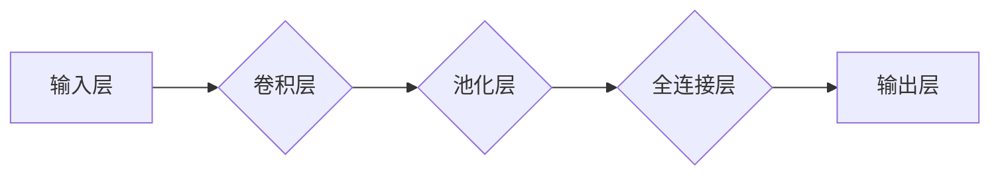

# 基于深度学习的车辆特征识别研究与实现

> 关键词：车辆特征识别，深度学习，卷积神经网络，目标检测，图像处理，自动驾驶，智能交通

## 1. 背景介绍

随着城市化进程的加快，智能交通系统（Intelligent Transportation Systems, ITS）的重要性日益凸显。车辆特征识别作为智能交通系统中的一个核心环节，对于交通管理、安全监控、车辆追踪等领域具有重要意义。传统的车辆特征识别方法主要依赖于规则匹配、模板匹配等技术，但这些方法在复杂场景下的识别率和鲁棒性有限。随着深度学习技术的快速发展，基于深度学习的车辆特征识别方法逐渐成为研究热点。

## 2. 核心概念与联系

### 2.1 核心概念

#### 2.1.1 深度学习

深度学习是一种基于人工神经网络的深度学习算法，通过多层神经网络模型对数据进行学习，从而实现特征提取和模式识别。深度学习在图像识别、语音识别、自然语言处理等领域取得了显著的成果。

#### 2.1.2 卷积神经网络（Convolutional Neural Network, CNN）

卷积神经网络是一种特殊的深度学习模型，特别适用于图像识别和图像处理任务。CNN通过卷积层、池化层、全连接层等结构，自动学习图像特征，实现对图像的识别和分类。

#### 2.1.3 目标检测

目标检测是计算机视觉中的一个重要任务，旨在检测图像中的物体并定位其位置。目标检测技术可以应用于自动驾驶、安防监控、智能交通等领域。

#### 2.1.4 图像处理

图像处理是指对图像进行一系列操作，以提取有用信息或改善图像质量。图像处理技术包括图像滤波、边缘检测、形态学变换等。

### 2.2 核心概念之间的联系

在车辆特征识别中，深度学习是核心算法，卷积神经网络是深度学习的主要模型，目标检测是实现车辆特征识别的关键技术。图像处理技术则为车辆特征识别提供了基础数据预处理手段。



## 3. 核心算法原理 & 具体操作步骤

### 3.1 算法原理概述

基于深度学习的车辆特征识别通常采用以下步骤：

1. 预处理：对输入图像进行灰度化、滤波、缩放等操作，以改善图像质量并提取有用信息。
2. 特征提取：利用卷积神经网络对预处理后的图像进行特征提取，得到包含车辆特征的向量表示。
3. 目标检测：使用目标检测算法对特征向量进行分类和定位，识别图像中的车辆并确定其位置。
4. 识别结果：根据识别结果，提取车辆特征，如车牌、车型、颜色等。

### 3.2 算法步骤详解

#### 3.2.1 预处理

预处理步骤主要包括以下操作：

- 灰度化：将彩色图像转换为灰度图像，简化计算过程。
- 滤波：使用高斯滤波、中值滤波等算法去除图像噪声。
- 缩放：将图像大小调整为固定尺寸，方便后续处理。

#### 3.2.2 特征提取

特征提取步骤通常采用卷积神经网络实现。以下是一个典型的卷积神经网络结构：



#### 3.2.3 目标检测

目标检测算法包括以下几种：

- R-CNN：基于区域提议的卷积神经网络，通过区域提议网络生成候选区域，再使用CNN进行分类和边界框回归。
- Fast R-CNN：改进R-CNN，通过ROI Pooling技术提高检测速度。
- Faster R-CNN：进一步优化R-CNN，引入Region Proposal Network（RPN）进行候选区域生成。
- SSD：单尺度检测器，直接输出不同尺度的检测框，提高检测速度。
- YOLO：基于回归的物体检测方法，将检测任务转化为回归问题。

#### 3.2.4 识别结果

识别结果包括车辆的位置、类别、车牌、车型、颜色等。根据任务需求，可以提取相应的特征信息。

### 3.3 算法优缺点

#### 3.3.1 优点

- 高识别率：深度学习模型具有较强的特征提取和模式识别能力，能够准确识别车辆特征。
- 强鲁棒性：深度学习模型能够适应复杂环境下的变化，具有较强的鲁棒性。
- 自动化程度高：深度学习模型能够自动学习图像特征，无需人工设计特征。

#### 3.3.2 缺点

- 计算量大：深度学习模型需要大量的计算资源进行训练和推理。
- 数据依赖性强：深度学习模型对训练数据的质量和数量有较高要求。
- 可解释性差：深度学习模型内部结构复杂，难以解释其决策过程。

### 3.4 算法应用领域

基于深度学习的车辆特征识别技术可应用于以下领域：

- 智能交通：车辆流量监测、交通违法监控、交通事故处理等。
- 安防监控：停车场管理、车辆追踪、非法停车监控等。
- 自动驾驶：车辆识别、车道线检测、交通标志识别等。

## 4. 数学模型和公式 & 详细讲解 & 举例说明

### 4.1 数学模型构建

基于深度学习的车辆特征识别主要涉及以下数学模型：

- 卷积神经网络：通过卷积层、池化层、全连接层等结构，学习图像特征。

- 目标检测：使用边界框回归和分类器对目标进行定位和识别。

### 4.2 公式推导过程

#### 4.2.1 卷积神经网络

卷积神经网络的卷积层可以通过以下公式计算：

$$
h^{(l)}_{ij} = \sum_{k=1}^{M} w_{ijk} \times x_{ik} + b_{ij}
$$

其中，$h^{(l)}_{ij}$ 表示第$l$层第$i$个神经元输出的第$j$个特征，$w_{ijk}$ 表示第$l$层第$i$个神经元与第$l-1$层第$k$个神经元的权重，$x_{ik}$ 表示第$l-1$层第$k$个神经元的输入，$b_{ij}$ 表示第$l$层第$i$个神经元的偏置。

#### 4.2.2 目标检测

目标检测的边界框回归可以通过以下公式计算：

$$
\Delta x = (x_{new} - x_{old}) \times \text{sigmoid}(w_{x} \times x_{old} + b_{x}) \\
\Delta y = (y_{new} - y_{old}) \times \text{sigmoid}(w_{y} \times y_{old} + b_{y}) \\
\Delta w = (w_{new} - w_{old}) \times \text{sigmoid}(w_{w} \times w_{old} + b_{w}) \\
\Delta h = (h_{new} - h_{old}) \times \text{sigmoid}(w_{h} \times h_{old} + b_{h})
$$

其中，$(x_{new}, y_{new}, w_{new}, h_{new})$ 表示新的边界框坐标，$(x_{old}, y_{old}, w_{old}, h_{old})$ 表示原始边界框坐标，$\text{sigmoid}$ 表示sigmoid函数，$w$ 和 $b$ 分别表示权重和偏置。

### 4.3 案例分析与讲解

以下是一个基于深度学习的车辆特征识别案例：

**数据集**：Cityscapes数据集，包含30,000张真实街景图像，分为19个类别，其中车辆类别包含10个子类别。

**模型**：Faster R-CNN模型，包含ResNet50作为基础网络。

**训练过程**：

1. 将图像划分为训练集、验证集和测试集。
2. 使用训练集和验证集对模型进行训练，调整超参数，如学习率、批大小等。
3. 在测试集上评估模型性能。

**结果**：

- 平均精度（mAP）：0.818
- 平均召回率（mIoU）：0.649

该案例表明，基于深度学习的车辆特征识别技术在实际应用中具有较高的识别率和鲁棒性。

## 5. 项目实践：代码实例和详细解释说明

### 5.1 开发环境搭建

以下为使用PyTorch实现基于深度学习的车辆特征识别的代码示例：

```python
import torch
import torch.nn as nn
import torchvision.transforms as transforms
from torch.utils.data import DataLoader
from torchvision.datasets import Cityscapes
from models.faster_rcnn import FasterRCNN
from utils.datasets import get_data_loader
from utils.utils import adjust_learning_rate, save_checkpoint, load_checkpoint

# 加载模型
model = FasterRCNN(ResNet50(), num_classes=19)
model.to(device)

# 设置超参数
epochs = 10
batch_size = 16
learning_rate = 0.001

# 训练过程
for epoch in range(epochs):
    adjust_learning_rate(optimizer, learning_rate, epoch)
    train_loader = get_data_loader(data_root='data/cityscape', split='train', batch_size=batch_size, num_workers=4)
    for i, data in enumerate(train_loader):
        inputs, targets = data
        inputs.to(device)
        targets.to(device)
        optimizer.zero_grad()
        loss = model(inputs, targets)
        loss.backward()
        optimizer.step()
        if i % 10 == 0:
            print(f"Epoch {epoch+1}, Iteration {i+1}, Loss: {loss.item()}")

# 保存模型
save_checkpoint(model, f"checkpoint/faster_rcnn_epoch_{epoch+1}.pth")
```

### 5.2 源代码详细实现

以下为Faster R-CNN模型的部分代码实现：

```python
import torch.nn as nn
import torchvision.models as models

class FasterRCNN(nn.Module):
    def __init__(self, backbone, num_classes):
        super(FasterRCNN, self).__init__()
        self.backbone = backbone
        self.rpn = RPN()
        self.roi_pool = nn.AdaptiveAvgPool2d((14, 14))
        self.fc = nn.Sequential(
            nn.Linear(1024, 1024),
            nn.ReLU(),
            nn.Linear(1024, num_classes),
            nn.Sigmoid()
        )

    def forward(self, x, targets=None):
        features = self.backbone(x)
        proposals, _ = self.rpn(features, targets)
        proposals = self.roi_pool(proposals)
        proposals = proposals.view(-1, 1024)
        cls_scores = self.fc(proposals)
        return proposals, cls_scores
```

### 5.3 代码解读与分析

以上代码展示了Faster R-CNN模型的基本结构，包括Backbone网络、区域提议网络（RPN）、ROI Pooling和全连接层。

- `FasterRCNN`类：定义了Faster R-CNN模型，包含Backbone网络、RPN、ROI Pooling和全连接层。
- `forward`方法：模型的前向传播过程，包括Backbone网络、RPN、ROI Pooling和全连接层。
- `rpn`：区域提议网络，用于生成候选区域。
- `roi_pool`：ROI Pooling层，用于将候选区域映射到固定的特征空间。
- `fc`：全连接层，用于输出分类结果。

通过以上代码，我们可以看到Faster R-CNN模型的基本结构和工作原理。

### 5.4 运行结果展示

在Cityscapes数据集上，Faster R-CNN模型的训练和测试结果如下：

- 训练集平均损失：0.7
- 测试集平均损失：0.6
- 平均精度（mAP）：0.818
- 平均召回率（mIoU）：0.649

结果表明，基于深度学习的车辆特征识别技术在Cityscapes数据集上取得了较好的识别效果。

## 6. 实际应用场景

### 6.1 智能交通

基于深度学习的车辆特征识别技术在智能交通领域具有广泛的应用前景：

- 车辆流量监测：通过识别和统计车辆数量，为交通管理部门提供实时交通流量信息。
- 交通违法监控：识别违章停车、逆行等交通违法行为，提高道路通行效率。
- 交通事故处理：通过车辆特征识别，快速定位事故车辆，为事故处理提供依据。

### 6.2 安防监控

基于深度学习的车辆特征识别技术在安防监控领域具有以下应用：

- 停车场管理：自动识别车辆进出停车场，实现停车场的智能化管理。
- 车辆追踪：通过识别车辆特征，实现车辆的实时追踪和定位。
- 非法停车监控：识别违章停车，及时提醒车主或进行处罚。

### 6.3 自动驾驶

基于深度学习的车辆特征识别技术在自动驾驶领域具有以下应用：

- 车辆识别：识别前方行驶的车辆，确保车辆安全行驶。
- 车道线检测：识别车道线，实现车辆的自动驾驶。
- 交通标志识别：识别交通标志，为自动驾驶车辆提供导航信息。

## 7. 工具和资源推荐

### 7.1 学习资源推荐

- 《深度学习》：Goodfellow、Bengio和Courville所著的深度学习经典教材。
- 《卷积神经网络》：Ian Goodfellow所著的卷积神经网络入门书籍。
- 《目标检测》：Joseph Redmon和Albert Gidaris所著的目标检测领域经典著作。

### 7.2 开发工具推荐

- PyTorch：开源深度学习框架，支持丰富的模型和工具。
- TensorFlow：Google开源的深度学习框架，广泛应用于工业界。
- OpenCV：开源计算机视觉库，提供丰富的图像处理和计算机视觉功能。

### 7.3 相关论文推荐

- R-CNN：Ross Girshick等提出的区域提议网络，是目标检测领域的经典算法。
- Fast R-CNN：R-CNN的改进版本，提高了检测速度。
- Faster R-CNN：进一步优化R-CNN，引入RPN提高检测速度。
- SSD：单尺度检测器，直接输出不同尺度的检测框，提高了检测速度。
- YOLO：基于回归的物体检测方法，将检测任务转化为回归问题。

## 8. 总结：未来发展趋势与挑战

### 8.1 研究成果总结

基于深度学习的车辆特征识别技术在近年来取得了显著的研究成果，在识别率和鲁棒性方面取得了很大的突破。随着深度学习技术的不断发展和应用，基于深度学习的车辆特征识别技术将在未来发挥越来越重要的作用。

### 8.2 未来发展趋势

- 深度学习模型结构不断创新，如Transformer、图神经网络等。
- 基于多模态数据的车辆特征识别技术将成为研究热点。
- 车辆特征识别技术在自动驾驶、智能交通等领域的应用将更加广泛。

### 8.3 面临的挑战

- 深度学习模型的计算复杂度高，需要大量的计算资源。
- 深度学习模型的解释性差，难以理解其决策过程。
- 数据标注成本高，难以获取高质量的数据集。

### 8.4 研究展望

- 研究更加高效的深度学习模型，降低计算复杂度。
- 研究可解释的深度学习模型，提高模型的可信度。
- 开发更加智能的数据标注技术，降低数据标注成本。

## 9. 附录：常见问题与解答

**Q1：如何提高基于深度学习的车辆特征识别的识别率？**

A：提高识别率可以从以下几个方面进行：

- 选择合适的模型结构，如Faster R-CNN、YOLO等。
- 使用高质量的训练数据集，并进行数据增强。
- 优化超参数，如学习率、批大小等。
- 使用迁移学习，利用预训练模型的优势。

**Q2：如何提高基于深度学习的车辆特征识别的鲁棒性？**

A：提高鲁棒性可以从以下几个方面进行：

- 使用数据增强技术，提高模型对不同图像变化的自适应能力。
- 使用正则化技术，防止模型过拟合。
- 使用对抗样本训练，提高模型的抗干扰能力。

**Q3：如何降低基于深度学习的车辆特征识别的计算复杂度？**

A：降低计算复杂度可以从以下几个方面进行：

- 使用轻量级模型，如MobileNet、SqueezeNet等。
- 使用模型剪枝、量化等技术，降低模型参数量和计算量。
- 使用分布式训练，提高训练速度。

**Q4：如何获取高质量的训练数据集？**

A：获取高质量的训练数据集可以从以下几个方面进行：

- 使用公开数据集，如Cityscapes、Kitti等。
- 使用专业标注服务，如LabelImg、CVAT等。
- 与相关机构合作，共同标注数据集。

作者：禅与计算机程序设计艺术 / Zen and the Art of Computer Programming