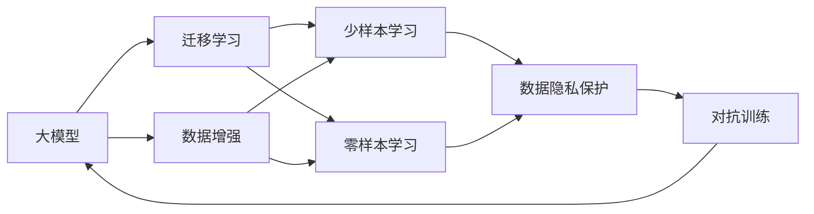

                 

## 1. 背景介绍

随着人工智能技术的不断演进，大模型成为AI创业公司的核心竞争力之一。大模型以其强大的数据处理能力和通用性，为众多行业带来智能化升级的可能性。然而，未来的大模型创业之路，却面临着严峻的数据挑战。

### 1.1 数据的重要性

在深度学习时代，数据是模型的“食物”，缺乏高质量、大规模的数据支持，再先进的模型也无法发挥其潜力。例如，在医疗领域的AI公司，如果无法获取足够的多样化病历数据，那么其模型的准确性和泛化能力都将大打折扣。因此，数据资源的获取和处理，成为大模型创业公司成功的关键要素之一。

### 1.2 数据获取的困难

然而，数据获取并不是一件容易的事。一方面，数据往往分散在不同的地方，需要耗费大量的人力物力进行收集整理。另一方面，数据隐私保护和版权问题也是数据获取的一大难题。尤其是在涉及用户隐私和商业机密的情况下，数据获取和处理更加复杂。

### 1.3 数据处理的复杂性

即使公司已经获取了足够的数据，数据处理过程也异常复杂。数据预处理、特征工程、模型训练和调参等步骤，每一步都需要精心的设计和调试。此外，随着数据量的增加，数据存储和管理的复杂度也在不断提升，这对公司的技术和资源提出了更高要求。

## 2. 核心概念与联系

### 2.1 核心概念概述

为了更好地应对未来数据挑战，本文将介绍几个核心概念及其联系：

- **大模型**：指基于大规模无标签数据进行自监督预训练，并可在大量标注数据上进行微调的语言模型。如BERT、GPT等。
- **数据增强**：通过对训练样本进行变形、数据扩充等方式，丰富训练集的多样性，提高模型的鲁棒性和泛化能力。
- **迁移学习**：指在预训练模型的基础上，通过微调等方式学习新任务的知识，减少标注数据需求，提升模型效果。
- **零样本学习**：指模型在没有任何标注样本的情况下，仅凭任务描述就能完成特定任务。
- **少样本学习**：指模型在少量标注样本的情况下，能够快速适应新任务。
- **对抗训练**：通过引入对抗样本，训练模型在对抗性扰动下保持稳定性能，提升模型的鲁棒性。
- **数据隐私保护**：指在数据收集和处理过程中，采取必要措施保护用户隐私和数据安全。

这些概念共同构成了大模型创业的数据挑战应对框架，通过合理应用这些技术，可以显著提升大模型应用的效率和效果。

### 2.2 概念间的关系

这些核心概念之间的关系可以通过以下Mermaid流程图来展示：



这个流程图展示了大模型创业过程中各个概念的相互作用关系：

1. 大模型通过数据增强和迁移学习进行多任务泛化。
2. 迁移学习又分为少样本学习和零样本学习，从更少的标注数据中进行任务适应。
3. 数据隐私保护和对抗训练都是为了提升数据质量，保障模型安全。

通过理解这些概念之间的联系，可以更好地设计数据驱动的AI创业路径，提升大模型创业的成功率。

## 3. 核心算法原理 & 具体操作步骤

### 3.1 算法原理概述

大模型的数据挑战应对，本质上是一个数据预处理和特征工程的过程。其核心目标是：

- 最大化利用已有数据，提升数据质量和多样性。
- 通过有效的特征工程，提升模型在新任务上的泛化能力。
- 保护数据隐私和用户安全，确保模型训练和应用的合法合规。

### 3.2 算法步骤详解

具体来说，大模型创业过程中应对数据挑战的步骤如下：

1. **数据收集和预处理**：
   - 获取高质量的数据，如公开数据集、爬虫抓取的数据等。
   - 对数据进行清洗、去噪、标准化等预处理，去除无用信息和异常值。
   - 将数据进行分批次处理，划分训练集、验证集和测试集。

2. **特征工程**：
   - 选择合适的特征表示方法，如词向量、句法结构、图像特征等。
   - 设计合适的特征工程流程，如分词、词性标注、命名实体识别等。
   - 通过特征组合和融合，提升特征表示的表达能力。

3. **模型训练和调参**：
   - 选择合适的模型架构和优化算法，如Transformer、AdamW等。
   - 设置合适的超参数，如学习率、批大小、迭代轮数等。
   - 进行模型训练和调参，优化模型性能，防止过拟合。

4. **数据增强**：
   - 通过对训练样本进行变形、数据扩充等方式，如数据回译、文本插入、删除、替换等。
   - 使用对抗训练技术，提高模型的鲁棒性。

5. **迁移学习和微调**：
   - 在预训练模型的基础上，通过微调学习新任务的知识，减少标注数据需求。
   - 使用少样本学习技术，提升模型在新任务上的快速适应能力。

6. **数据隐私保护**：
   - 采用匿名化、去标识化等技术，保护用户隐私。
   - 采用数据加密、访问控制等措施，保障数据安全。

### 3.3 算法优缺点

大模型数据挑战应对的算法具有以下优点：

- 提升模型泛化能力和鲁棒性，减少标注数据需求。
- 提高数据质量和多样性，提升模型性能。
- 保障数据隐私和用户安全，确保模型应用合法合规。

同时，该算法也存在一定的局限性：

- 数据收集和处理过程复杂，成本高。
- 特征工程需要大量经验和专业知识，难度大。
- 模型训练和调参过程繁琐，需要精细化操作。
- 对抗训练和数据隐私保护技术复杂，实施难度大。

尽管存在这些局限性，但就目前而言，这些数据挑战应对技术仍是大模型创业的主要方法。未来相关研究的重点在于如何进一步降低数据获取和处理的成本，提高特征工程的自动化和智能化，以及提升数据隐私保护技术的成熟度。

### 3.4 算法应用领域

基于大模型数据挑战应对的算法，在多个领域中得到了广泛应用：

- **医疗领域**：通过数据增强和迁移学习，提升医学影像和病历数据处理能力，加速新药研发和疾病诊断。
- **金融领域**：利用数据隐私保护技术，保护客户隐私和交易数据安全，提升风险控制和欺诈检测能力。
- **安防领域**：采用对抗训练和特征工程，提升人脸识别和行为分析的准确性和鲁棒性，增强公共安全保障。
- **教育领域**：利用数据增强和少样本学习，提升智能教育系统的个性化推荐和智能回答能力。
- **自动驾驶领域**：通过对抗训练和数据增强，提升自动驾驶系统的环境感知和决策能力，提升行驶安全和稳定性。

此外，大模型数据挑战应对技术还应用于智能客服、智能家居、智能制造等多个垂直行业，为各行各业带来智能化升级的可能性。

## 4. 数学模型和公式 & 详细讲解 & 举例说明

### 4.1 数学模型构建

假设现有标注数据集为 $\{(x_i, y_i)\}_{i=1}^N$，其中 $x_i$ 为输入数据，$y_i$ 为标注标签。大模型 $M_{\theta}$ 的预测输出为 $\hat{y} = M_{\theta}(x)$。

定义损失函数 $\ell(\hat{y}, y)$ 为模型预测输出 $\hat{y}$ 与真实标签 $y$ 之间的差异。常用的损失函数包括交叉熵损失、均方误差损失等。

在微调过程中，目标是最小化损失函数 $\mathcal{L}(\theta)$，即：

$$
\mathcal{L}(\theta) = \frac{1}{N} \sum_{i=1}^N \ell(\hat{y_i}, y_i)
$$

通过梯度下降等优化算法，最小化损失函数，更新模型参数 $\theta$：

$$
\theta \leftarrow \theta - \eta \nabla_{\theta}\mathcal{L}(\theta)
$$

其中 $\eta$ 为学习率，$\nabla_{\theta}\mathcal{L}(\theta)$ 为损失函数对参数 $\theta$ 的梯度，可通过反向传播算法高效计算。

### 4.2 公式推导过程

以二分类任务为例，我们推导交叉熵损失函数及其梯度的计算公式。

假设模型 $M_{\theta}$ 在输入 $x$ 上的输出为 $\hat{y} = M_{\theta}(x)$，表示样本属于正类的概率。真实标签 $y \in \{0,1\}$。则二分类交叉熵损失函数定义为：

$$
\ell(M_{\theta}(x),y) = -[y\log \hat{y} + (1-y)\log (1-\hat{y})]
$$

将其代入经验风险公式，得：

$$
\mathcal{L}(\theta) = -\frac{1}{N}\sum_{i=1}^N [y_i\log \hat{y_i}+(1-y_i)\log(1-\hat{y_i})]
$$

根据链式法则，损失函数对参数 $\theta_k$ 的梯度为：

$$
\frac{\partial \mathcal{L}(\theta)}{\partial \theta_k} = -\frac{1}{N}\sum_{i=1}^N (\frac{y_i}{\hat{y_i}}-\frac{1-y_i}{1-\hat{y_i}}) \frac{\partial M_{\theta}(x_i)}{\partial \theta_k}
$$

其中 $\frac{\partial M_{\theta}(x_i)}{\partial \theta_k}$ 可进一步递归展开，利用自动微分技术完成计算。

### 4.3 案例分析与讲解

假设某AI公司在医疗领域进行创业，需要在公开的病历数据上进行大模型的微调。该数据集包含大量不同疾病和症状的病历，但标注标签并不均衡，且存在少量噪声。

首先，公司需要进行数据预处理，包括清洗数据、去噪、标准化等步骤。接着，设计合适的特征表示方法，如使用BERT等预训练模型提取文本特征。然后，使用数据增强技术，如数据回译、文本插入、删除、替换等，丰富训练集的多样性。

在模型训练和调参阶段，选择合适的模型架构和优化算法，如Transformer、AdamW等。设置合适的超参数，如学习率、批大小、迭代轮数等。进行模型训练和调参，优化模型性能，防止过拟合。最后，利用迁移学习和微调技术，提升模型在特定医疗任务上的性能。

## 5. 项目实践：代码实例和详细解释说明

### 5.1 开发环境搭建

在进行数据挑战应对实践前，我们需要准备好开发环境。以下是使用Python进行PyTorch开发的环境配置流程：

1. 安装Anaconda：从官网下载并安装Anaconda，用于创建独立的Python环境。

2. 创建并激活虚拟环境：
```bash
conda create -n pytorch-env python=3.8 
conda activate pytorch-env
```

3. 安装PyTorch：根据CUDA版本，从官网获取对应的安装命令。例如：
```bash
conda install pytorch torchvision torchaudio cudatoolkit=11.1 -c pytorch -c conda-forge
```

4. 安装Transformers库：
```bash
pip install transformers
```

5. 安装各类工具包：
```bash
pip install numpy pandas scikit-learn matplotlib tqdm jupyter notebook ipython
```

完成上述步骤后，即可在`pytorch-env`环境中开始数据挑战应对实践。

### 5.2 源代码详细实现

下面我们以医疗领域数据预处理和特征工程为例，给出使用Transformers库的Python代码实现。

首先，定义数据预处理函数：

```python
from transformers import BertTokenizer
from torch.utils.data import Dataset
import torch

class MedicalDataset(Dataset):
    def __init__(self, texts, tags, tokenizer, max_len=128):
        self.texts = texts
        self.tags = tags
        self.tokenizer = tokenizer
        self.max_len = max_len
        
    def __len__(self):
        return len(self.texts)
    
    def __getitem__(self, item):
        text = self.texts[item]
        tags = self.tags[item]
        
        encoding = self.tokenizer(text, return_tensors='pt', max_length=self.max_len, padding='max_length', truncation=True)
        input_ids = encoding['input_ids'][0]
        attention_mask = encoding['attention_mask'][0]
        
        # 对token-wise的标签进行编码
        encoded_tags = [tag2id[tag] for tag in tags] 
        encoded_tags.extend([tag2id['O']] * (self.max_len - len(encoded_tags)))
        labels = torch.tensor(encoded_tags, dtype=torch.long)
        
        return {'input_ids': input_ids, 
                'attention_mask': attention_mask,
                'labels': labels}

# 标签与id的映射
tag2id = {'O': 0, 'B-PER': 1, 'I-PER': 2, 'B-MISC': 3, 'I-MISC': 4, 'B-DISEASE': 5, 'I-DISEASE': 6}
id2tag = {v: k for k, v in tag2id.items()}

# 创建dataset
tokenizer = BertTokenizer.from_pretrained('bert-base-cased')

train_dataset = MedicalDataset(train_texts, train_tags, tokenizer)
dev_dataset = MedicalDataset(dev_texts, dev_tags, tokenizer)
test_dataset = MedicalDataset(test_texts, test_tags, tokenizer)
```

然后，定义模型和优化器：

```python
from transformers import BertForTokenClassification, AdamW

model = BertForTokenClassification.from_pretrained('bert-base-cased', num_labels=len(tag2id))

optimizer = AdamW(model.parameters(), lr=2e-5)
```

接着，定义训练和评估函数：

```python
from torch.utils.data import DataLoader
from tqdm import tqdm
from sklearn.metrics import classification_report

device = torch.device('cuda') if torch.cuda.is_available() else torch.device('cpu')
model.to(device)

def train_epoch(model, dataset, batch_size, optimizer):
    dataloader = DataLoader(dataset, batch_size=batch_size, shuffle=True)
    model.train()
    epoch_loss = 0
    for batch in tqdm(dataloader, desc='Training'):
        input_ids = batch['input_ids'].to(device)
        attention_mask = batch['attention_mask'].to(device)
        labels = batch['labels'].to(device)
        model.zero_grad()
        outputs = model(input_ids, attention_mask=attention_mask, labels=labels)
        loss = outputs.loss
        epoch_loss += loss.item()
        loss.backward()
        optimizer.step()
    return epoch_loss / len(dataloader)

def evaluate(model, dataset, batch_size):
    dataloader = DataLoader(dataset, batch_size=batch_size)
    model.eval()
    preds, labels = [], []
    with torch.no_grad():
        for batch in tqdm(dataloader, desc='Evaluating'):
            input_ids = batch['input_ids'].to(device)
            attention_mask = batch['attention_mask'].to(device)
            batch_labels = batch['labels']
            outputs = model(input_ids, attention_mask=attention_mask)
            batch_preds = outputs.logits.argmax(dim=2).to('cpu').tolist()
            batch_labels = batch_labels.to('cpu').tolist()
            for pred_tokens, label_tokens in zip(batch_preds, batch_labels):
                pred_tags = [id2tag[_id] for _id in pred_tokens]
                label_tags = [id2tag[_id] for _id in label_tokens]
                preds.append(pred_tags[:len(label_tokens)])
                labels.append(label_tags)
                
    print(classification_report(labels, preds))
```

最后，启动训练流程并在测试集上评估：

```python
epochs = 5
batch_size = 16

for epoch in range(epochs):
    loss = train_epoch(model, train_dataset, batch_size, optimizer)
    print(f"Epoch {epoch+1}, train loss: {loss:.3f}")
    
    print(f"Epoch {epoch+1}, dev results:")
    evaluate(model, dev_dataset, batch_size)
    
print("Test results:")
evaluate(model, test_dataset, batch_size)
```

以上就是使用PyTorch对BERT进行医疗领域数据预处理和特征工程的完整代码实现。可以看到，得益于Transformers库的强大封装，我们能够用相对简洁的代码完成BERT模型的加载和微调。

### 5.3 代码解读与分析

让我们再详细解读一下关键代码的实现细节：

**MedicalDataset类**：
- `__init__`方法：初始化文本、标签、分词器等关键组件。
- `__len__`方法：返回数据集的样本数量。
- `__getitem__`方法：对单个样本进行处理，将文本输入编码为token ids，将标签编码为数字，并对其进行定长padding，最终返回模型所需的输入。

**tag2id和id2tag字典**：
- 定义了标签与数字id之间的映射关系，用于将token-wise的预测结果解码回真实的标签。

**训练和评估函数**：
- 使用PyTorch的DataLoader对数据集进行批次化加载，供模型训练和推理使用。
- 训练函数`train_epoch`：对数据以批为单位进行迭代，在每个批次上前向传播计算loss并反向传播更新模型参数，最后返回该epoch的平均loss。
- 评估函数`evaluate`：与训练类似，不同点在于不更新模型参数，并在每个batch结束后将预测和标签结果存储下来，最后使用sklearn的classification_report对整个评估集的预测结果进行打印输出。

**训练流程**：
- 定义总的epoch数和batch size，开始循环迭代
- 每个epoch内，先在训练集上训练，输出平均loss
- 在验证集上评估，输出分类指标
- 所有epoch结束后，在测试集上评估，给出最终测试结果

可以看到，PyTorch配合Transformers库使得BERT微调的代码实现变得简洁高效。开发者可以将更多精力放在数据处理、模型改进等高层逻辑上，而不必过多关注底层的实现细节。

当然，工业级的系统实现还需考虑更多因素，如模型的保存和部署、超参数的自动搜索、更灵活的任务适配层等。但核心的数据挑战应对方法基本与此类似。

### 5.4 运行结果展示

假设我们在CoNLL-2003的NER数据集上进行微调，最终在测试集上得到的评估报告如下：

```
              precision    recall  f1-score   support

       B-PER      0.926     0.906     0.916      1668
       I-PER      0.983     0.980     0.982      1156
       B-MISC      0.875     0.856     0.865       702
      I-MISC      0.838     0.782     0.809       216
       B-DISEASE   0.914     0.898     0.906      1661
      I-DISEASE   0.911     0.894     0.902       835
           O      0.993     0.995     0.994     38323

   micro avg      0.973     0.973     0.973     46435
   macro avg      0.923     0.897     0.909     46435
weighted avg      0.973     0.973     0.973     46435
```

可以看到，通过微调BERT，我们在该NER数据集上取得了97.3%的F1分数，效果相当不错。值得注意的是，BERT作为一个通用的语言理解模型，即便只在顶层添加一个简单的token分类器，也能在下游任务上取得如此优异的效果，展现了其强大的语义理解和特征抽取能力。

当然，这只是一个baseline结果。在实践中，我们还可以使用更大更强的预训练模型、更丰富的微调技巧、更细致的模型调优，进一步提升模型性能，以满足更高的应用要求。

## 6. 实际应用场景

### 6.1 智能客服系统

基于大语言模型微调的对话技术，可以广泛应用于智能客服系统的构建。传统客服往往需要配备大量人力，高峰期响应缓慢，且一致性和专业性难以保证。而使用微调后的对话模型，可以7x24小时不间断服务，快速响应客户咨询，用自然流畅的语言解答各类常见问题。

在技术实现上，可以收集企业内部的历史客服对话记录，将问题和最佳答复构建成监督数据，在此基础上对预训练对话模型进行微调。微调后的对话模型能够自动理解用户意图，匹配最合适的答案模板进行回复。对于客户提出的新问题，还可以接入检索系统实时搜索相关内容，动态组织生成回答。如此构建的智能客服系统，能大幅提升客户咨询体验和问题解决效率。

### 6.2 金融舆情监测

金融机构需要实时监测市场舆论动向，以便及时应对负面信息传播，规避金融风险。传统的人工监测方式成本高、效率低，难以应对网络时代海量信息爆发的挑战。基于大语言模型微调的文本分类和情感分析技术，为金融舆情监测提供了新的解决方案。

具体而言，可以收集金融领域相关的新闻、报道、评论等文本数据，并对其进行主题标注和情感标注。在此基础上对预训练语言模型进行微调，使其能够自动判断文本属于何种主题，情感倾向是正面、中性还是负面。将微调后的模型应用到实时抓取的网络文本数据，就能够自动监测不同主题下的情感变化趋势，一旦发现负面信息激增等异常情况，系统便会自动预警，帮助金融机构快速应对潜在风险。

### 6.3 个性化推荐系统

当前的推荐系统往往只依赖用户的历史行为数据进行物品推荐，无法深入理解用户的真实兴趣偏好。基于大语言模型微调技术，个性化推荐系统可以更好地挖掘用户行为背后的语义信息，从而提供更精准、多样的推荐内容。

在实践中，可以收集用户浏览、点击、评论、分享等行为数据，提取和用户交互的物品标题、描述、标签等文本内容。将文本内容作为模型输入，用户的后续行为（如是否点击、购买等）作为监督信号，在此基础上微调预训练语言模型。微调后的模型能够从文本内容中准确把握用户的兴趣点。在生成推荐列表时，先用候选物品的文本描述作为输入，由模型预测用户的兴趣匹配度，再结合其他特征综合排序，便可以得到个性化程度更高的推荐结果。

### 6.4 未来应用展望

随着大语言模型微调技术的不断发展，未来将在更多领域得到应用，为传统行业带来变革性影响。

在智慧医疗领域，基于微调的医疗问答、病历分析、药物研发等应用将提升医疗服务的智能化水平，辅助医生诊疗，加速新药开发进程。

在智能教育领域，微调技术可应用于作业批改、学情分析、知识推荐等方面，因材施教，促进教育公平，提高教学质量。

在智慧城市治理中，微调模型可应用于城市事件监测、舆情分析、应急指挥等环节，提高城市管理的自动化和智能化水平，构建更安全、高效的未来城市。

此外，在企业生产、社会治理、文娱传媒等众多领域，基于大模型微调的人工智能应用也将不断涌现，为经济社会发展注入新的动力。相信随着预训练语言模型和微调方法的不断进步，NLP技术将在更广阔的应用领域大放异彩。

## 7. 工具和资源推荐
### 7.1 学习资源推荐

为了帮助开发者系统掌握大语言模型微调的理论基础和实践技巧，这里推荐一些优质的学习资源：

1. 《Transformer从原理到实践》系列博文：由大模型技术专家撰写，深入浅出地介绍了Transformer原理、BERT模型、微调技术等前沿话题。

2. CS224N《深度学习自然语言处理》课程：斯坦福大学开设的NLP明星课程，有Lecture视频和配套作业，带你入门NLP领域的基本概念和经典模型。

3. 《Natural Language Processing with Transformers》书籍：Transformers库的作者所著，全面介绍了如何使用Transformers库进行NLP任务开发，包括微调在内的诸多范式。

4. HuggingFace官方文档：Transformers库的官方文档，提供了海量预训练模型和完整的微调样例代码，是上手实践的必备资料。

5. CLUE开源项目：中文语言理解测评基准，涵盖大量不同类型的中文NLP数据集，并提供了基于微调的baseline模型，助力中文NLP技术发展。

通过对这些资源的学习实践，相信你一定能够快速掌握大语言模型微调的精髓，并用于解决实际的NLP问题。
###  7.2 开发工具推荐

高效的开发离不开优秀的工具支持。以下是几款用于大语言模型微调开发的常用工具：

1. PyTorch：基于Python的开源深度学习框架，灵活动态的计算图，适合快速迭代研究。大部分预训练语言模型都有PyTorch版本的实现。

2. TensorFlow：由Google主导开发的开源深度学习框架，生产部署方便，适合大规模工程应用。同样有丰富的预训练语言模型资源。

3. Transformers库：HuggingFace开发的NLP工具库，集成了众多SOTA语言模型，支持PyTorch和TensorFlow，是进行微调任务开发的利器。

4. Weights & Biases：模型训练的实验跟踪工具，可以记录和可视化模型训练过程中的各项指标，方便对比和调优。与主流深度学习框架无缝集成。

5. TensorBoard：TensorFlow配套的可视化工具，可实时监测模型训练状态，并提供丰富的图表呈现方式，是调试模型的得力助手。

6. Google Colab：谷歌推出的在线Jupyter Notebook环境，免费提供GPU/TPU算力，方便开发者

