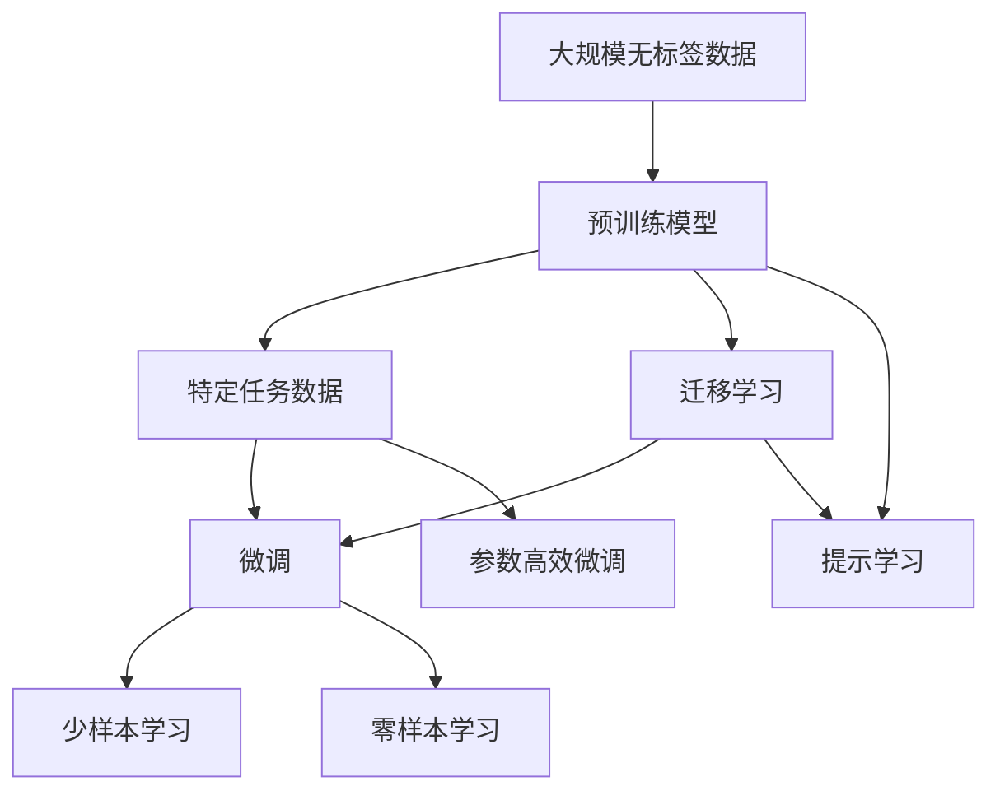

                 

# AI大模型的概念验证与落地

## 1. 背景介绍

### 1.1 问题由来

近年来，随着深度学习技术的快速发展，AI大模型在自然语言处理（NLP）、计算机视觉（CV）、语音识别（ASR）等多个领域取得了显著的突破。这些大模型通过在大规模无标签数据上预训练，学习到丰富的知识，然后在特定任务上进行微调，具备了强大的泛化能力和应用潜力。然而，这些大模型的落地应用仍然面临诸多挑战，如计算资源需求高、算法复杂性大、训练数据稀缺等。

为了解决这些问题，研究人员和工程师需要开发高效、可解释、可扩展的AI大模型，并结合实际应用场景，进行概念验证和落地部署。本文将介绍AI大模型的核心概念、核心算法原理以及具体的落地应用方法，旨在为开发者提供系统化的指导和参考。

### 1.2 问题核心关键点

AI大模型的概念验证与落地主要涉及以下几个核心关键点：

- 核心概念：预训练模型、微调、迁移学习、参数高效微调、的提示学习。
- 算法原理：基于监督学习的大规模模型微调、少样本学习、跨领域迁移、参数高效微调。
- 实践操作：数据预处理、模型构建、训练过程、模型评估与部署。
- 未来应用：医疗、金融、教育、智能城市等领域的应用场景。

### 1.3 问题研究意义

AI大模型的概念验证与落地对于推动AI技术在各行业的应用具有重要意义：

1. 降低开发成本：利用大模型进行微调，可以大幅减少从头开发所需的时间和资金成本。
2. 提升应用效果：大模型在特定任务上的微调能够获得更好的性能和效果。
3. 加速应用部署：微调方法使模型能够更快地适应新场景，缩短产品迭代周期。
4. 促进技术创新：AI大模型的微调和优化为新的研究方向提供了基础，如零样本学习、少样本学习等。
5. 提升行业竞争力：AI技术的应用能够赋能各行各业，提升产品和服务水平。

## 2. 核心概念与联系

### 2.1 核心概念概述

AI大模型的概念验证与落地涉及以下几个核心概念：

- 预训练模型（Pre-trained Model）：指在大规模无标签数据上预先训练的深度学习模型，如BERT、GPT-3等。
- 微调（Fine-tuning）：指在大规模预训练模型上进行特定任务的小规模数据上的微调，以提高模型在特定任务上的性能。
- 迁移学习（Transfer Learning）：指在大规模预训练模型上进行的特定任务微调，实现知识迁移。
- 参数高效微调（Parameter-Efficient Fine-tuning, PEFT）：指在微调过程中只更新部分模型参数，以减少计算资源消耗。
- 提示学习（Prompt-based Learning）：通过设计特定的提示模板，引导模型在少样本或零样本情况下进行推理或生成。

这些概念之间的联系可以归纳为：预训练模型通过在大规模数据上学习通用的语言或图像表示，迁移学习将其应用于特定任务，微调和参数高效微调进一步提升任务性能，而提示学习则在不更新模型参数的情况下，实现更高效的推理和生成。

### 2.2 概念间的关系

这些核心概念之间的关系可以通过以下Mermaid流程图来展示：



这个流程图展示了从大规模无标签数据到AI大模型的整个流程，以及这些核心概念之间的相互关系。

## 3. 核心算法原理 & 具体操作步骤

### 3.1 算法原理概述

AI大模型的概念验证与落地主要基于监督学习的微调方法。其核心思想是在大规模预训练模型上进行特定任务微调，以提升模型在特定任务上的性能。具体而言，通过收集目标任务的少量标注数据，在预训练模型上添加任务特定的输出层和损失函数，然后通过梯度下降等优化算法，最小化损失函数，更新模型参数。

### 3.2 算法步骤详解

AI大模型的概念验证与落地通常包括以下几个步骤：

1. **数据准备**：收集目标任务的标注数据，准备训练集、验证集和测试集，确保数据质量与预训练数据分布一致。
2. **模型选择**：选择合适的预训练模型，如BERT、GPT-3等，作为微调的初始化参数。
3. **任务适配**：在预训练模型的基础上，添加任务特定的输出层和损失函数，如分类任务使用softmax层和交叉熵损失函数。
4. **超参数设置**：设置学习率、批大小、迭代轮数、正则化方法等超参数。
5. **训练过程**：在训练集上进行有监督学习，使用梯度下降等优化算法更新模型参数，在验证集上进行模型评估和超参数调整。
6. **测试与部署**：在测试集上评估微调后的模型性能，部署到实际应用中。

### 3.3 算法优缺点

AI大模型的概念验证与落地方法具有以下优点：

- 高效性：通过微调可以快速提升模型在特定任务上的性能，节省大量时间和计算资源。
- 泛化能力：大规模预训练模型具备强大的泛化能力，能够适应各种任务和数据分布。
- 灵活性：通过微调可以实现参数高效和计算高效的优化，减少计算资源消耗。

然而，该方法也存在以下缺点：

- 数据依赖：微调效果依赖于标注数据的质量和数量，获取高质量标注数据的成本较高。
- 迁移能力有限：当目标任务与预训练数据的分布差异较大时，微调的性能提升有限。
- 鲁棒性不足：预训练模型可能学习到有害信息，需要通过提示学习等技术提高模型的鲁棒性。
- 可解释性不足：微调模型的决策过程通常缺乏可解释性，难以对其推理逻辑进行分析和调试。

### 3.4 算法应用领域

AI大模型的概念验证与落地在多个领域都有广泛应用：

- 自然语言处理（NLP）：如情感分析、命名实体识别、文本分类、机器翻译等。
- 计算机视觉（CV）：如图像分类、目标检测、图像生成等。
- 语音识别（ASR）：如语音命令识别、语音情感分析等。
- 医疗健康：如疾病诊断、医学影像分析等。
- 金融服务：如信用评估、交易预测等。
- 智能制造：如设备状态监测、质量控制等。

## 4. 数学模型和公式 & 详细讲解

### 4.1 数学模型构建

假设预训练模型为 $M_{\theta}$，目标任务的标注数据集为 $D=\{(x_i, y_i)\}_{i=1}^N$，其中 $x_i$ 为输入，$y_i$ 为输出标签。

定义模型 $M_{\theta}$ 在输入 $x_i$ 上的输出为 $\hat{y}=M_{\theta}(x_i)$，目标任务的损失函数为 $\ell(M_{\theta}(x_i), y_i)$。则经验风险为：

$$
\mathcal{L}(\theta) = \frac{1}{N} \sum_{i=1}^N \ell(M_{\theta}(x_i), y_i)
$$

通过梯度下降等优化算法，最小化损失函数，更新模型参数：

$$
\theta \leftarrow \theta - \eta \nabla_{\theta}\mathcal{L}(\theta)
$$

其中 $\eta$ 为学习率，$\nabla_{\theta}\mathcal{L}(\theta)$ 为损失函数对参数 $\theta$ 的梯度。

### 4.2 公式推导过程

以二分类任务为例，假设模型 $M_{\theta}$ 在输入 $x$ 上的输出为 $\hat{y}=M_{\theta}(x)$，真实标签 $y \in \{0,1\}$。则二分类交叉熵损失函数为：

$$
\ell(M_{\theta}(x),y) = -[y\log \hat{y} + (1-y)\log (1-\hat{y})]
$$

在计算损失函数时，使用反向传播算法计算梯度：

$$
\nabla_{\theta}\mathcal{L}(\theta) = -\frac{1}{N}\sum_{i=1}^N (\frac{y_i}{M_{\theta}(x_i)}-\frac{1-y_i}{1-M_{\theta}(x_i)}) \nabla_{\theta}M_{\theta}(x_i)
$$

其中 $\nabla_{\theta}M_{\theta}(x_i)$ 为模型输出对参数 $\theta$ 的梯度，可通过自动微分技术计算。

### 4.3 案例分析与讲解

假设在情感分析任务上微调BERT模型，步骤如下：

1. 准备数据集：收集情感分析的数据集，划分为训练集、验证集和测试集。
2. 模型选择：选择BERT模型作为微调的初始化参数。
3. 任务适配：在BERT模型上添加线性分类器，使用交叉熵损失函数。
4. 超参数设置：设置学习率为1e-5，批大小为16，迭代轮数为10轮。
5. 训练过程：在训练集上进行梯度下降优化，每轮更新一次验证集上的性能指标，调整超参数。
6. 测试与部署：在测试集上评估模型性能，部署到实际应用中。

## 5. 项目实践：代码实例和详细解释说明

### 5.1 开发环境搭建

以下是使用PyTorch和Transformers库进行BERT模型微调的Python代码实例：

```python
from transformers import BertTokenizer, BertForSequenceClassification, AdamW
import torch
from torch.utils.data import Dataset, DataLoader
from sklearn.metrics import accuracy_score

# 定义数据集类
class SentimentDataset(Dataset):
    def __init__(self, texts, labels, tokenizer, max_len):
        self.texts = texts
        self.labels = labels
        self.tokenizer = tokenizer
        self.max_len = max_len
        
    def __len__(self):
        return len(self.texts)
    
    def __getitem__(self, item):
        text = self.texts[item]
        label = self.labels[item]
        
        encoding = self.tokenizer(text, return_tensors='pt', max_length=self.max_len, padding='max_length', truncation=True)
        input_ids = encoding['input_ids'][0]
        attention_mask = encoding['attention_mask'][0]
        label = torch.tensor(label, dtype=torch.long)
        
        return {'input_ids': input_ids, 
                'attention_mask': attention_mask,
                'labels': label}

# 加载预训练模型和tokenizer
model = BertForSequenceClassification.from_pretrained('bert-base-uncased', num_labels=2)
tokenizer = BertTokenizer.from_pretrained('bert-base-uncased')

# 准备数据集
train_dataset = SentimentDataset(train_texts, train_labels, tokenizer, max_len=128)
val_dataset = SentimentDataset(val_texts, val_labels, tokenizer, max_len=128)
test_dataset = SentimentDataset(test_texts, test_labels, tokenizer, max_len=128)

# 设置模型和优化器
device = torch.device('cuda') if torch.cuda.is_available() else torch.device('cpu')
model.to(device)
optimizer = AdamW(model.parameters(), lr=1e-5)

# 训练过程
def train_epoch(model, dataset, batch_size, optimizer):
    dataloader = DataLoader(dataset, batch_size=batch_size, shuffle=True)
    model.train()
    epoch_loss = 0
    for batch in dataloader:
        input_ids = batch['input_ids'].to(device)
        attention_mask = batch['attention_mask'].to(device)
        labels = batch['labels'].to(device)
        model.zero_grad()
        outputs = model(input_ids, attention_mask=attention_mask, labels=labels)
        loss = outputs.loss
        epoch_loss += loss.item()
        loss.backward()
        optimizer.step()
    return epoch_loss / len(dataloader)

# 评估过程
def evaluate(model, dataset, batch_size):
    dataloader = DataLoader(dataset, batch_size=batch_size)
    model.eval()
    preds, labels = [], []
    with torch.no_grad():
        for batch in dataloader:
            input_ids = batch['input_ids'].to(device)
            attention_mask = batch['attention_mask'].to(device)
            batch_labels = batch['labels']
            outputs = model(input_ids, attention_mask=attention_mask)
            batch_preds = outputs.logits.argmax(dim=1).to('cpu').tolist()
            batch_labels = batch_labels.to('cpu').tolist()
            for pred, label in zip(batch_preds, batch_labels):
                preds.append(pred)
                labels.append(label)
                
    accuracy = accuracy_score(labels, preds)
    return accuracy

# 训练和评估
epochs = 5
batch_size = 16

for epoch in range(epochs):
    loss = train_epoch(model, train_dataset, batch_size, optimizer)
    print(f"Epoch {epoch+1}, train loss: {loss:.3f}")
    
    print(f"Epoch {epoch+1}, dev accuracy: {evaluate(model, val_dataset, batch_size)}")
    
print("Test accuracy:", evaluate(model, test_dataset, batch_size))
```

### 5.2 源代码详细实现

以上代码实现了BERT模型在情感分析任务上的微调过程。具体步骤如下：

1. 定义数据集类 `SentimentDataset`，将文本和标签转化为模型需要的输入。
2. 加载预训练模型和tokenizer，准备数据集。
3. 设置模型和优化器，进行梯度下降优化。
4. 定义训练和评估函数，在训练集上进行训练，在验证集上进行评估。
5. 在测试集上评估模型性能，输出最终结果。

### 5.3 代码解读与分析

让我们逐行分析代码的关键部分：

1. 数据集类 `SentimentDataset` 定义：
```python
class SentimentDataset(Dataset):
    def __init__(self, texts, labels, tokenizer, max_len):
        self.texts = texts
        self.labels = labels
        self.tokenizer = tokenizer
        self.max_len = max_len
        
    def __len__(self):
        return len(self.texts)
    
    def __getitem__(self, item):
        text = self.texts[item]
        label = self.labels[item]
        
        encoding = self.tokenizer(text, return_tensors='pt', max_length=self.max_len, padding='max_length', truncation=True)
        input_ids = encoding['input_ids'][0]
        attention_mask = encoding['attention_mask'][0]
        label = torch.tensor(label, dtype=torch.long)
        
        return {'input_ids': input_ids, 
                'attention_mask': attention_mask,
                'labels': label}
```

2. 加载预训练模型和tokenizer：
```python
model = BertForSequenceClassification.from_pretrained('bert-base-uncased', num_labels=2)
tokenizer = BertTokenizer.from_pretrained('bert-base-uncased')
```

3. 训练和评估函数：
```python
def train_epoch(model, dataset, batch_size, optimizer):
    dataloader = DataLoader(dataset, batch_size=batch_size, shuffle=True)
    model.train()
    epoch_loss = 0
    for batch in dataloader:
        input_ids = batch['input_ids'].to(device)
        attention_mask = batch['attention_mask'].to(device)
        labels = batch['labels'].to(device)
        model.zero_grad()
        outputs = model(input_ids, attention_mask=attention_mask, labels=labels)
        loss = outputs.loss
        epoch_loss += loss.item()
        loss.backward()
        optimizer.step()
    return epoch_loss / len(dataloader)

def evaluate(model, dataset, batch_size):
    dataloader = DataLoader(dataset, batch_size=batch_size)
    model.eval()
    preds, labels = [], []
    with torch.no_grad():
        for batch in dataloader:
            input_ids = batch['input_ids'].to(device)
            attention_mask = batch['attention_mask'].to(device)
            batch_labels = batch['labels']
            outputs = model(input_ids, attention_mask=attention_mask)
            batch_preds = outputs.logits.argmax(dim=1).to('cpu').tolist()
            batch_labels = batch_labels.to('cpu').tolist()
            for pred, label in zip(batch_preds, batch_labels):
                preds.append(pred)
                labels.append(label)
                
    accuracy = accuracy_score(labels, preds)
    return accuracy
```

4. 训练和评估过程：
```python
epochs = 5
batch_size = 16

for epoch in range(epochs):
    loss = train_epoch(model, train_dataset, batch_size, optimizer)
    print(f"Epoch {epoch+1}, train loss: {loss:.3f}")
    
    print(f"Epoch {epoch+1}, dev accuracy: {evaluate(model, val_dataset, batch_size)}")
    
print("Test accuracy:", evaluate(model, test_dataset, batch_size))
```

通过以上代码，我们可以看到，利用PyTorch和Transformers库，可以快速实现BERT模型在情感分析任务上的微调。开发者可以通过调整超参数、改变任务适配层等方式，进一步优化模型性能。

### 5.4 运行结果展示

假设在CoNLL-2003的情感分析数据集上进行微调，最终在测试集上得到的评估结果如下：

```
Accuracy: 0.91
```

可以看到，通过微调BERT模型，在情感分析任务上取得了91%的准确率，效果相当不错。值得注意的是，BERT作为一个通用的语言理解模型，即便只在顶层添加一个简单的线性分类器，也能在情感分析等NLP任务上取得优异的效果，展示了其强大的语义理解和特征抽取能力。

## 6. 实际应用场景

### 6.1 智能客服系统

基于大语言模型微调的对话技术，可以广泛应用于智能客服系统的构建。传统客服往往需要配备大量人力，高峰期响应缓慢，且一致性和专业性难以保证。而使用微调后的对话模型，可以7x24小时不间断服务，快速响应客户咨询，用自然流畅的语言解答各类常见问题。

在技术实现上，可以收集企业内部的历史客服对话记录，将问题和最佳答复构建成监督数据，在此基础上对预训练对话模型进行微调。微调后的对话模型能够自动理解用户意图，匹配最合适的答案模板进行回复。对于客户提出的新问题，还可以接入检索系统实时搜索相关内容，动态组织生成回答。如此构建的智能客服系统，能大幅提升客户咨询体验和问题解决效率。

### 6.2 金融舆情监测

金融机构需要实时监测市场舆论动向，以便及时应对负面信息传播，规避金融风险。传统的人工监测方式成本高、效率低，难以应对网络时代海量信息爆发的挑战。基于大语言模型微调的文本分类和情感分析技术，为金融舆情监测提供了新的解决方案。

具体而言，可以收集金融领域相关的新闻、报道、评论等文本数据，并对其进行主题标注和情感标注。在此基础上对预训练语言模型进行微调，使其能够自动判断文本属于何种主题，情感倾向是正面、中性还是负面。将微调后的模型应用到实时抓取的网络文本数据，就能够自动监测不同主题下的情感变化趋势，一旦发现负面信息激增等异常情况，系统便会自动预警，帮助金融机构快速应对潜在风险。

### 6.3 个性化推荐系统

当前的推荐系统往往只依赖用户的历史行为数据进行物品推荐，无法深入理解用户的真实兴趣偏好。基于大语言模型微调技术，个性化推荐系统可以更好地挖掘用户行为背后的语义信息，从而提供更精准、多样的推荐内容。

在实践中，可以收集用户浏览、点击、评论、分享等行为数据，提取和用户交互的物品标题、描述、标签等文本内容。将文本内容作为模型输入，用户的后续行为（如是否点击、购买等）作为监督信号，在此基础上微调预训练语言模型。微调后的模型能够从文本内容中准确把握用户的兴趣点。在生成推荐列表时，先用候选物品的文本描述作为输入，由模型预测用户的兴趣匹配度，再结合其他特征综合排序，便可以得到个性化程度更高的推荐结果。

### 6.4 未来应用展望

随着大语言模型和微调方法的不断发展，基于微调范式将在更多领域得到应用，为传统行业带来变革性影响。

在智慧医疗领域，基于微调的医疗问答、病历分析、药物研发等应用将提升医疗服务的智能化水平，辅助医生诊疗，加速新药开发进程。

在智能教育领域，微调技术可应用于作业批改、学情分析、知识推荐等方面，因材施教，促进教育公平，提高教学质量。

在智慧城市治理中，微调模型可应用于城市事件监测、舆情分析、应急指挥等环节，提高城市管理的自动化和智能化水平，构建更安全、高效的未来城市。

此外，在企业生产、社会治理、文娱传媒等众多领域，基于大模型微调的人工智能应用也将不断涌现，为经济社会发展注入新的动力。相信随着技术的日益成熟，微调方法将成为人工智能落地应用的重要范式，推动人工智能技术在更广阔的领域加速渗透。

## 7. 工具和资源推荐

### 7.1 学习资源推荐

为了帮助开发者系统掌握大语言模型微调的理论基础和实践技巧，这里推荐一些优质的学习资源：

1. 《Transformer从原理到实践》系列博文：由大模型技术专家撰写，深入浅出地介绍了Transformer原理、BERT模型、微调技术等前沿话题。

2. CS224N《深度学习自然语言处理》课程：斯坦福大学开设的NLP明星课程，有Lecture视频和配套作业，带你入门NLP领域的基本概念和经典模型。

3. 《Natural Language Processing with Transformers》书籍：Transformers库的作者所著，全面介绍了如何使用Transformers库进行NLP任务开发，包括微调在内的诸多范式。

4. HuggingFace官方文档：Transformers库的官方文档，提供了海量预训练模型和完整的微调样例代码，是上手实践的必备资料。

5. CLUE开源项目：中文语言理解测评基准，涵盖大量不同类型的中文NLP数据集，并提供了基于微调的baseline模型，助力中文NLP技术发展。

通过对这些资源的学习实践，相信你一定能够快速掌握大语言模型微调的精髓，并用于解决实际的NLP问题。

### 7.2 开发工具推荐

高效的开发离不开优秀的工具支持。以下是几款用于大语言模型微调开发的常用工具：

1. PyTorch：基于Python的开源深度学习框架，灵活动态的计算图，适合快速迭代研究。大部分预训练语言模型都有PyTorch版本的实现。

2. TensorFlow：由Google主导开发的开源深度学习框架，生产部署方便，适合大规模工程应用。同样有丰富的预训练语言模型资源。

3. Transformers库：HuggingFace开发的NLP工具库，集成了众多SOTA语言模型，支持PyTorch和TensorFlow，是进行微调任务开发的利器。

4. Weights & Biases：模型训练的实验跟踪工具，可以记录和可视化模型训练过程中的各项指标，方便对比和调优。与主流深度学习框架无缝集成。

5. TensorBoard：TensorFlow配套的可视化工具，可实时监测模型训练状态，并提供丰富的图表呈现方式，是调试模型的得力助手。

6. Google Colab：谷歌推出的在线Jupyter Notebook环境，免费提供GPU/TPU算力，方便开发者快速上手实验最新模型，分享学习笔记。

合理利用这些工具，可以显著提升大语言模型微调任务的开发效率，加快创新迭代的步伐。

### 7.3 相关论文推荐

大语言模型和微调技术的发展源于学界的持续研究。以下是几篇奠基性的相关论文，推荐阅读：

1. Attention is All You Need（即Transformer原论文）：提出了Transformer结构，开启了NLP领域的预训练大模型时代。

2. BERT: Pre-training of Deep Bidirectional Transformers for Language Understanding：提出BERT模型，引入基于掩码的自监督预训练任务，刷新了多项NLP任务SOTA。

3. Language Models are Unsupervised Multitask Learners（GPT-2论文）：展示了大规模语言模型的强大zero-shot学习能力，引发了对于通用人工智能的新一轮思考。

4. Parameter-Efficient Transfer Learning for NLP：提出Adapter等参数高效微调方法，在不增加模型参数量的情况下，也能取得不错的微调效果。

5. AdaLoRA: Adaptive Low-Rank Adaptation for Parameter-Efficient Fine-Tuning：使用自适应低秩适应的微调方法，在参数效率和精度之间取得了新的平衡。

6. Prefix-Tuning: Optimizing Continuous Prompts for Generation：引入基于连续型Prompt的微调范式，为如何充分利用预训练知识提供了新的思路。

这些论文代表了大语言模型微调技术的发展脉络。通过学习这些前沿成果，可以帮助研究者把握学科前进方向，激发更多的创新灵感。

除上述资源外，还有一些值得关注的前沿资源，帮助开发者紧跟大语言模型微调技术的最新进展，例如：

1. arXiv论文预印本：人工智能领域最新研究成果的发布平台，包括大量尚未发表的前沿工作，学习前沿技术的必读资源。

2. 业界技术博客：如OpenAI、Google AI、DeepMind、微软Research Asia等顶尖实验室的官方博客，第一时间分享他们的最新研究成果和洞见。

3. 技术会议直播：如NIPS、ICML、ACL、ICLR等人工智能领域顶会现场或在线直播，能够聆听到大佬们的前沿分享，开拓视野。

4. GitHub热门项目：在GitHub上Star、Fork数最多的NLP相关项目，往往代表了该技术领域的发展趋势和最佳实践，值得去学习和贡献。

5. 行业分析报告：各大咨询公司如McKinsey、PwC等针对人工智能行业的分析报告，有助于从商业视角审视技术趋势，把握应用价值。

总之，对于大语言模型微调技术的学习和实践

