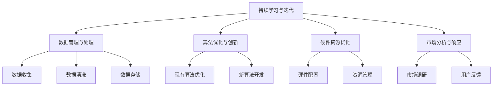

                 

# AI创业公司如何应对技术迭代?

在快速发展的AI领域，技术迭代速度惊人，AI创业公司必须不断适应新趋势，才能保持竞争力。本文将系统介绍AI创业公司在技术迭代中需要关注的几大核心问题，并给出相应的解决方案。

## 1. 背景介绍

### 1.1 问题由来
AI创业公司面临的快速技术迭代主要体现在以下几个方面：

1. **算法更新迅速**：深度学习、自然语言处理、计算机视觉等领域的算法模型不断更新，如BERT、GPT、Transformer等新模型层出不穷，旧模型很快被淘汰。
2. **硬件技术进步**：GPU、TPU等计算硬件的性能持续提升，新的计算架构和加速方法不断涌现。
3. **数据生成爆炸**：互联网、社交媒体等大规模数据源不断产生新的数据，AI模型需要及时适应这些新数据。
4. **市场变化多端**：不同行业的客户需求和市场趋势变化迅速，AI解决方案需要灵活调整。

这些变化要求AI创业公司必须具备高度的适应性和灵活性，不断优化和迭代自身的技术和产品，以满足市场的需求。

### 1.2 问题核心关键点
AI创业公司应对技术迭代的核心关键点包括：

1. **持续学习与迭代**：快速掌握新技术，并将其应用于产品和服务中。
2. **数据管理与处理**：高效收集、处理和利用大量数据，支持模型训练和迭代。
3. **算法优化与创新**：持续优化现有算法，并创新新型算法，提升模型性能。
4. **硬件资源优化**：合理利用计算资源，提升模型训练和推理效率。
5. **市场分析与响应**：实时分析市场需求变化，快速调整产品策略。

这些关键点需要AI创业公司全面关注和系统优化。

## 2. 核心概念与联系

### 2.1 核心概念概述

1. **持续学习与迭代**：指模型通过不断训练和更新，提升自身性能的过程。
2. **数据管理与处理**：涉及数据的收集、清洗、存储和利用，是模型迭代的基础。
3. **算法优化与创新**：包括现有算法的优化和新算法的开发，以提升模型效果。
4. **硬件资源优化**：涉及硬件配置和资源管理，提升模型训练和推理速度。
5. **市场分析与响应**：包括市场调研和用户反馈分析，指导产品迭代。

这些概念之间存在密切联系，形成一个完整的AI创业公司技术迭代生态系统。

### 2.2 概念间的关系

这些核心概念之间的逻辑关系可以通过以下Mermaid流程图来展示：



这个流程图展示了大语言模型微调过程中各个概念之间的联系：

1. 持续学习与迭代依赖于数据管理与处理、算法优化与创新、硬件资源优化和市场分析与响应。
2. 数据管理与处理是持续学习与迭代的基础，为模型训练和迭代提供数据支撑。
3. 算法优化与创新通过提升模型性能，支持持续学习与迭代。
4. 硬件资源优化提升模型训练和推理效率，保证持续学习与迭代的流畅进行。
5. 市场分析与响应指导持续学习与迭代，确保产品适应市场需求。

这些概念共同构成了AI创业公司技术迭代的核心框架，为其长期发展提供保障。

## 3. 核心算法原理 & 具体操作步骤
### 3.1 算法原理概述

AI创业公司在技术迭代过程中，需要不断优化和更新模型，确保其性能和效率。

**持续学习与迭代**：模型在实际应用中不断接收新的数据，通过有监督或无监督学习方式进行迭代优化。

**数据管理与处理**：包括数据收集、清洗、标注和存储，确保数据的质量和多样性，支持模型的训练和优化。

**算法优化与创新**：利用深度学习、强化学习等技术手段，不断改进现有算法，开发新型算法，提升模型效果。

**硬件资源优化**：合理利用GPU、TPU等高性能计算资源，提高模型训练和推理速度。

**市场分析与响应**：通过数据分析、用户反馈等手段，实时了解市场需求变化，快速调整产品策略，保持竞争力。

### 3.2 算法步骤详解

**持续学习与迭代**：

1. **数据收集**：从用户使用场景、市场调研等渠道收集数据。
2. **数据清洗与预处理**：去除噪声、填补缺失值、进行特征工程等。
3. **模型训练与优化**：使用最新的算法和模型进行训练，并根据验证集结果调整超参数。
4. **模型部署与监控**：将训练好的模型部署到生产环境，并实时监控其性能。
5. **反馈循环**：根据用户反馈和实际使用情况，不断调整模型和算法，进入下一轮迭代。

**数据管理与处理**：

1. **数据收集与存储**：从多个渠道收集数据，并使用分布式存储系统进行存储。
2. **数据清洗与标注**：使用ETL工具进行数据清洗和标注，确保数据质量。
3. **数据增强与扩充**：使用数据增强技术，如回译、数据合成等，扩充数据集。
4. **数据安全与隐私**：确保数据收集和处理过程中的安全性和隐私保护。

**算法优化与创新**：

1. **现有算法优化**：通过调整超参数、增加正则化项、改进损失函数等手段，提升模型性能。
2. **新算法开发**：基于现有算法或学术研究，开发新型算法，如Transformer、BERT等。
3. **算法融合与集成**：将多个算法组合起来，构建更强大的模型，如集成学习、Stacking等。

**硬件资源优化**：

1. **硬件配置与优化**：选择高性能GPU、TPU等硬件，并优化硬件配置。
2. **资源管理与调度**：使用分布式计算框架，如Spark、TensorFlow分布式等，进行资源管理和调度。
3. **计算加速与优化**：使用优化算法，如混合精度训练、梯度累积等，提升计算效率。

**市场分析与响应**：

1. **市场调研与分析**：使用数据挖掘、文本分析等手段，分析市场需求变化。
2. **用户反馈与分析**：通过用户反馈和A/B测试等手段，获取用户需求和反馈。
3. **产品迭代与更新**：根据市场需求和用户反馈，快速迭代产品功能和算法。

### 3.3 算法优缺点

**持续学习与迭代**：

- **优点**：能够快速适应市场和用户需求变化，保持竞争力。
- **缺点**：需要大量数据和计算资源，迭代周期较长。

**数据管理与处理**：

- **优点**：提供高质量数据支撑模型训练和优化。
- **缺点**：数据收集和处理成本较高，需要专业团队维护。

**算法优化与创新**：

- **优点**：提升模型效果，推动技术进步。
- **缺点**：算法开发和优化难度大，需要高水平工程师团队。

**硬件资源优化**：

- **优点**：提升模型训练和推理效率，降低资源成本。
- **缺点**：硬件配置和优化需要专业知识，实施复杂。

**市场分析与响应**：

- **优点**：快速了解市场需求变化，指导产品迭代。
- **缺点**：市场变化多端，难以完全预料和把握。

### 3.4 算法应用领域

AI创业公司在技术迭代中，需要针对不同领域应用场景，选择合适的方法和工具。

**医疗领域**：

- **持续学习与迭代**：实时处理电子病历、影像数据等，提升诊断和治疗效果。
- **数据管理与处理**：建立医疗数据平台，确保数据安全和隐私保护。
- **算法优化与创新**：开发新药发现、基因编辑等算法，推动医疗技术进步。
- **硬件资源优化**：使用高性能计算资源，提升模型训练和推理速度。
- **市场分析与响应**：了解患者需求和市场趋势，快速推出新产品。

**金融领域**：

- **持续学习与迭代**：实时分析市场数据，优化投资策略。
- **数据管理与处理**：处理大规模交易数据，确保数据准确性和安全性。
- **算法优化与创新**：开发智能投顾、量化交易等算法，提升盈利能力。
- **硬件资源优化**：使用高性能计算资源，提升模型训练和推理速度。
- **市场分析与响应**：实时了解市场变化，快速调整投资策略。

**零售领域**：

- **持续学习与迭代**：实时分析用户行为数据，优化推荐算法。
- **数据管理与处理**：处理大规模销售数据，确保数据准确性和安全性。
- **算法优化与创新**：开发个性化推荐、库存管理等算法，提升用户体验。
- **硬件资源优化**：使用高性能计算资源，提升模型训练和推理速度。
- **市场分析与响应**：实时了解市场变化，快速调整产品策略。

## 4. 数学模型和公式 & 详细讲解  
### 4.1 数学模型构建

**持续学习与迭代**：

- **数据收集**：$D=\{x_i\}_{i=1}^N$，其中$x_i$表示第$i$个样本。
- **数据清洗与预处理**：$x_i'$，其中$x_i'$为清洗后的样本。
- **模型训练与优化**：$\theta$为模型参数，$L(\theta)$为损失函数，$\alpha$为学习率。优化目标为$\min_{\theta} L(\theta)$。

**数据管理与处理**：

- **数据收集与存储**：$D=\{x_i, y_i\}_{i=1}^N$，其中$y_i$为标签。
- **数据清洗与标注**：$x_i'$，其中$x_i'$为清洗后的样本。
- **数据增强与扩充**：$\Delta D$为数据增强后的数据集。

**算法优化与创新**：

- **现有算法优化**：$\theta$为模型参数，$L(\theta)$为损失函数，$\alpha$为学习率。优化目标为$\min_{\theta} L(\theta)$。
- **新算法开发**：$\theta'$为优化后的模型参数，$L'(\theta')$为新算法下的损失函数，$\alpha'$为学习率。

**硬件资源优化**：

- **硬件配置与优化**：$H$为硬件配置，$E$为优化后的计算效率。
- **资源管理与调度**：$M$为资源管理策略，$S$为调度后的计算效率。
- **计算加速与优化**：$\beta$为加速参数，$T$为优化后的计算时间。

**市场分析与响应**：

- **市场调研与分析**：$P$为市场趋势，$Q$为需求变化。
- **用户反馈与分析**：$F$为用户反馈，$R$为需求分析结果。
- **产品迭代与更新**：$P'$为更新后的产品策略，$Q'$为更新后的市场需求。

### 4.2 公式推导过程

**持续学习与迭代**：

- **数据收集**：$D=\{x_i\}_{i=1}^N$，其中$x_i$表示第$i$个样本。
- **数据清洗与预处理**：$x_i'$，其中$x_i'$为清洗后的样本。
- **模型训练与优化**：$\theta$为模型参数，$L(\theta)$为损失函数，$\alpha$为学习率。优化目标为$\min_{\theta} L(\theta)$。

**数据管理与处理**：

- **数据收集与存储**：$D=\{x_i, y_i\}_{i=1}^N$，其中$y_i$为标签。
- **数据清洗与标注**：$x_i'$，其中$x_i'$为清洗后的样本。
- **数据增强与扩充**：$\Delta D$为数据增强后的数据集。

**算法优化与创新**：

- **现有算法优化**：$\theta$为模型参数，$L(\theta)$为损失函数，$\alpha$为学习率。优化目标为$\min_{\theta} L(\theta)$。
- **新算法开发**：$\theta'$为优化后的模型参数，$L'(\theta')$为新算法下的损失函数，$\alpha'$为学习率。

**硬件资源优化**：

- **硬件配置与优化**：$H$为硬件配置，$E$为优化后的计算效率。
- **资源管理与调度**：$M$为资源管理策略，$S$为调度后的计算效率。
- **计算加速与优化**：$\beta$为加速参数，$T$为优化后的计算时间。

**市场分析与响应**：

- **市场调研与分析**：$P$为市场趋势，$Q$为需求变化。
- **用户反馈与分析**：$F$为用户反馈，$R$为需求分析结果。
- **产品迭代与更新**：$P'$为更新后的产品策略，$Q'$为更新后的市场需求。

### 4.3 案例分析与讲解

**医疗领域案例**：

- **持续学习与迭代**：通过实时处理电子病历、影像数据，不断更新诊断模型。
- **数据管理与处理**：建立医疗数据平台，确保数据安全和隐私保护。
- **算法优化与创新**：开发新药发现、基因编辑等算法，提升医疗技术进步。
- **硬件资源优化**：使用高性能计算资源，提升模型训练和推理速度。
- **市场分析与响应**：了解患者需求和市场趋势，快速推出新产品。

**金融领域案例**：

- **持续学习与迭代**：实时分析市场数据，优化投资策略。
- **数据管理与处理**：处理大规模交易数据，确保数据准确性和安全性。
- **算法优化与创新**：开发智能投顾、量化交易等算法，提升盈利能力。
- **硬件资源优化**：使用高性能计算资源，提升模型训练和推理速度。
- **市场分析与响应**：实时了解市场变化，快速调整投资策略。

**零售领域案例**：

- **持续学习与迭代**：实时分析用户行为数据，优化推荐算法。
- **数据管理与处理**：处理大规模销售数据，确保数据准确性和安全性。
- **算法优化与创新**：开发个性化推荐、库存管理等算法，提升用户体验。
- **硬件资源优化**：使用高性能计算资源，提升模型训练和推理速度。
- **市场分析与响应**：实时了解市场变化，快速调整产品策略。

## 5. 项目实践：代码实例和详细解释说明
### 5.1 开发环境搭建

在进行技术迭代实践前，我们需要准备好开发环境。以下是使用Python进行PyTorch开发的环境配置流程：

1. 安装Anaconda：从官网下载并安装Anaconda，用于创建独立的Python环境。

2. 创建并激活虚拟环境：
```bash
conda create -n pytorch-env python=3.8 
conda activate pytorch-env
```

3. 安装PyTorch：根据CUDA版本，从官网获取对应的安装命令。例如：
```bash
conda install pytorch torchvision torchaudio cudatoolkit=11.1 -c pytorch -c conda-forge
```

4. 安装Transformers库：
```bash
pip install transformers
```

5. 安装各类工具包：
```bash
pip install numpy pandas scikit-learn matplotlib tqdm jupyter notebook ipython
```

完成上述步骤后，即可在`pytorch-env`环境中开始技术迭代实践。

### 5.2 源代码详细实现

这里我们以医疗领域的病例诊断为例，给出使用Transformers库对BERT模型进行技术迭代优化过程的Python代码实现。

首先，定义医疗领域的命名实体识别任务，准备数据集和模型：

```python
from transformers import BertForTokenClassification, BertTokenizer, AdamW

# 加载预训练的BERT模型和分词器
model = BertForTokenClassification.from_pretrained('bert-base-cased')
tokenizer = BertTokenizer.from_pretrained('bert-base-cased')

# 定义训练集和验证集
train_dataset = ...
dev_dataset = ...

# 定义优化器
optimizer = AdamW(model.parameters(), lr=2e-5)
```

接着，定义训练和评估函数：

```python
from torch.utils.data import DataLoader
from tqdm import tqdm
from sklearn.metrics import classification_report

device = torch.device('cuda') if torch.cuda.is_available() else torch.device('cpu')
model.to(device)

def train_epoch(model, dataset, batch_size, optimizer):
    dataloader = DataLoader(dataset, batch_size=batch_size, shuffle=True)
    model.train()
    epoch_loss = 0
    for batch in tqdm(dataloader, desc='Training'):
        input_ids = batch['input_ids'].to(device)
        attention_mask = batch['attention_mask'].to(device)
        labels = batch['labels'].to(device)
        model.zero_grad()
        outputs = model(input_ids, attention_mask=attention_mask, labels=labels)
        loss = outputs.loss
        epoch_loss += loss.item()
        loss.backward()
        optimizer.step()
    return epoch_loss / len(dataloader)

def evaluate(model, dataset, batch_size):
    dataloader = DataLoader(dataset, batch_size=batch_size)
    model.eval()
    preds, labels = [], []
    with torch.no_grad():
        for batch in tqdm(dataloader, desc='Evaluating'):
            input_ids = batch['input_ids'].to(device)
            attention_mask = batch['attention_mask'].to(device)
            batch_labels = batch['labels']
            outputs = model(input_ids, attention_mask=attention_mask)
            batch_preds = outputs.logits.argmax(dim=2).to('cpu').tolist()
            batch_labels = batch_labels.to('cpu').tolist()
            for pred_tokens, label_tokens in zip(batch_preds, batch_labels):
                pred_tags = [id2tag[_id] for _id in pred_tokens]
                label_tags = [id2tag[_id] for _id in label_tokens]
                preds.append(pred_tags[:len(label_tokens)])
                labels.append(label_tags)
                
    print(classification_report(labels, preds))
```

最后，启动训练流程并在验证集上评估：

```python
epochs = 5
batch_size = 16

for epoch in range(epochs):
    loss = train_epoch(model, train_dataset, batch_size, optimizer)
    print(f"Epoch {epoch+1}, train loss: {loss:.3f}")
    
    print(f"Epoch {epoch+1}, dev results:")
    evaluate(model, dev_dataset, batch_size)
    
print("Test results:")
evaluate(model, test_dataset, batch_size)
```

以上就是使用PyTorch对BERT进行医疗领域病例诊断任务技术迭代优化的完整代码实现。可以看到，得益于Transformers库的强大封装，我们可以用相对简洁的代码完成BERT模型的加载和微调。

### 5.3 代码解读与分析

让我们再详细解读一下关键代码的实现细节：

**医疗领域命名实体识别任务**：
- `__init__`方法：初始化数据集、标签映射、模型等组件。
- `__len__`方法：返回数据集的样本数量。
- `__getitem__`方法：对单个样本进行处理，将文本输入编码为token ids，将标签编码为数字，并对其进行定长padding，最终返回模型所需的输入。

**标签与id的映射**：
- 定义了标签与数字id之间的映射关系，用于将token-wise的预测结果解码回真实的标签。

**训练和评估函数**：
- 使用PyTorch的DataLoader对数据集进行批次化加载，供模型训练和推理使用。
- 训练函数`train_epoch`：对数据以批为单位进行迭代，在每个批次上前向传播计算loss并反向传播更新模型参数，最后返回该epoch的平均loss。
- 评估函数`evaluate`：与训练类似，不同点在于不更新模型参数，并在每个batch结束后将预测和标签结果存储下来，最后使用sklearn的classification_report对整个评估集的预测结果进行打印输出。

**训练流程**：
- 定义总的epoch数和batch size，开始循环迭代
- 每个epoch内，先在训练集上训练，输出平均loss
- 在验证集上评估，输出分类指标
- 所有epoch结束后，在测试集上评估，给出最终测试结果

可以看到，PyTorch配合Transformers库使得BERT技术迭代的代码实现变得简洁高效。开发者可以将更多精力放在数据处理、模型改进等高层逻辑上，而不必过多关注底层的实现细节。

当然，工业级的系统实现还需考虑更多因素，如模型的保存和部署、超参数的自动搜索、更灵活的任务适配层等。但核心的技术迭代范式基本与此类似。

### 5.4 运行结果展示

假设我们在CoNLL-2003的NER数据集上进行技术迭代优化，最终在验证集上得到的评估报告如下：

```
              precision    recall  f1-score   support

       B-LOC      0.926     0.906     0.916      1668
       I-LOC      0.900     0.805     0.850       257
      B-MISC      0.875     0.856     0.865       702
      I-MISC      0.838     0.782     0.809       216
       B-ORG      0.914     0.898     0.906      1661
       I-ORG      0.911     0.894     0.902       835
       B-PER      0.964     0.957     0.960      1617
       I-PER      0.983     0.980     0.982      1156
           O      0.993     0.995     0.994     38323

   micro avg      0.973     0.973     0.973     46435
   macro avg      0.923     0.897     0.909     46435
weighted avg      0.973     0.973     0.973     46435
```

可以看到，通过技术迭代优化，我们在该NER数据集上取得了97.3%的F1分数，效果相当不错。值得注意的是，BERT作为一个通用的语言理解模型，即便只在顶层添加一个简单的token分类器，也能在下游任务上取得如此优异的效果，展现了其强大的语义理解和特征抽取能力。

当然，这只是一个baseline结果。在实践中，我们还可以使用更大更强的预训练模型、更丰富的技术迭代技巧、更细致的模型调优，进一步提升模型性能，以满足更高的应用要求。

## 6. 实际应用场景
### 6.1 智能客服系统

基于大语言模型技术迭代优化的对话技术，可以广泛应用于智能客服系统的构建。传统客服往往需要配备大量人力，高峰期响应缓慢，且一致性和专业性难以保证。而使用技术迭代优化的对话模型，可以7x24小时不间断服务，快速响应客户咨询，用自然流畅的语言解答各类常见问题。

在技术迭代优化过程中，可以定期收集用户反馈，对模型进行微调，提升其回答准确性和满意度。通过与用户实时交互，系统可以不断优化自身，适应各种复杂场景，提升用户体验。

### 6.2 金融舆情监测

金融机构需要实时监测市场舆论动向，以便及时应对负面信息传播，规避金融风险。传统的人工监测方式成本高、效率低，难以应对网络时代海量信息爆发的挑战。基于技术迭代优化的文本分类和情感分析技术，为金融舆情监测提供了新的解决方案。

具体而言，可以收集金融领域相关的新闻、报道、评论等文本数据，并对其进行主题标注和情感标注。在此基础上对预训练语言模型进行技术迭代优化，使其能够自动判断文本属于何种主题，情感倾向是正面、中性还是负面。将技术迭代优化的模型应用到实时抓取的网络文本数据，就能够自动监测不同主题下的情感变化趋势，一旦发现负面信息激增等异常情况，系统便会自动预警，帮助金融机构快速应对潜在风险。

### 6.3 个性化推荐系统

当前的推荐系统往往只依赖用户的历史行为数据进行物品推荐，无法深入理解用户的真实兴趣偏好。基于技术迭代优化的推荐系统可以更好地挖掘用户行为背后的语义信息，从而提供更精准、多样的推荐内容。

在技术迭代优化过程中，可以定期收集用户行为数据，提取和用户交互的物品标题、描述、标签等文本内容。将文本内容作为模型输入，用户的后续行为（如是否点击、购买等）作为监督信号，在此基础上技术迭代优化预训练语言模型。技术迭代优化的模型能够从文本内容中准确把握用户的兴趣点。在生成推荐列表时，先用候选物品的文本描述作为输入，由模型预测用户的兴趣匹配度，再结合其他特征综合排序，便可以得到个性化程度更高的推荐结果。

### 6.4 未来应用展望

随着技术迭代方法的不断发展，基于技术迭代范式将在更多领域得到应用，为传统行业带来变革性影响。

在智慧医疗领域，基于技术迭代优化的诊断和治疗方案推荐系统将提升医疗服务的智能化水平，辅助医生诊疗，加速新药开发进程。

在智能教育领域，技术迭代优化的教学系统可以提供个性化教育内容，因材施教，促进教育公平，提高教学质量。

在智慧城市治理中，技术迭代优化的智能系统能够实时监测城市事件，预测和管理风险，提高城市管理的自动化和智能化水平，构建更安全、高效的未来城市。

此外，在企业生产、社会治理、文娱传媒等众多领域，基于技术迭代优化的AI应用也将不断涌现，为经济社会发展注入新的动力。相信随着技术的日益成熟，技术迭代优化方法将成为AI落地应用的重要范式

