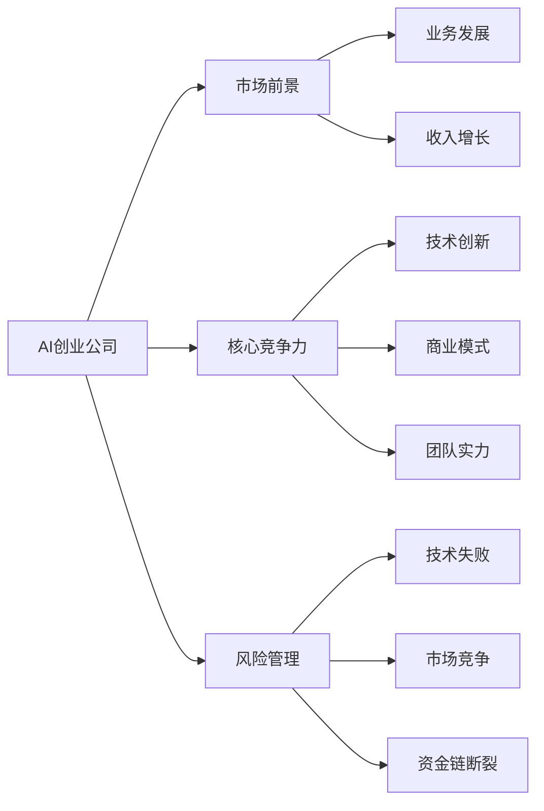
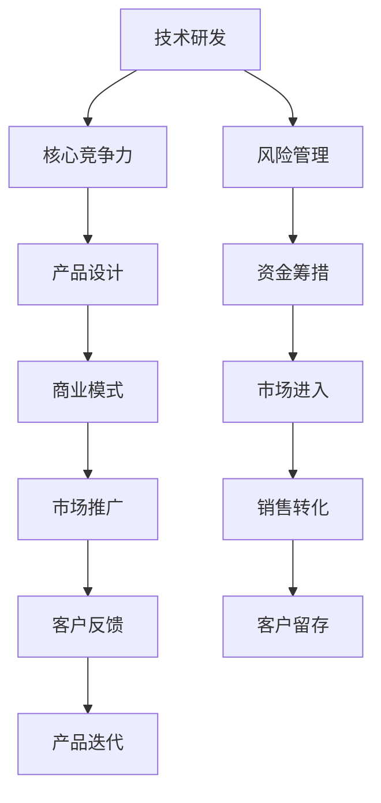

                 

## 1. 背景介绍

在当今科技发展迅猛的数字化时代，人工智能（AI）正在加速改变各行各业的业务模式和运营效率，成为创新与竞争力的重要驱动力。特别是对于AI创业公司来说，市场前景广阔，具备巨大的商业潜力。那么，究竟为何AI创业公司能成为市场的热门选择？其核心竞争优势和潜在风险又是什么？本文将从多个角度对这一问题进行深入探讨。

## 2. 核心概念与联系

### 2.1 核心概念概述

1. **AI创业公司**：专注于人工智能技术和产品的开发、应用和销售的企业，涵盖机器学习、计算机视觉、自然语言处理等多个子领域。
2. **市场前景**：指AI创业公司及其产品或技术在未来市场上可能的发展和收益预期。
3. **核心竞争力**：AI创业公司所具备的独特的优势和资源，如技术创新、商业模式、团队实力等。
4. **风险管理**：指AI创业公司在发展过程中可能面临的各种不确定性和挑战，如技术失败、市场竞争、资金链断裂等。

这些核心概念之间的联系可以通过以下Mermaid流程图来展示：



通过这个流程图，我们可以看到AI创业公司的市场前景、核心竞争力与风险管理三者之间的相互作用关系：市场前景依赖于核心竞争力，而核心竞争力的提升又离不开风险管理能力的加强。

### 2.2 概念间的关系

- **市场前景**：决定AI创业公司是否具有商业价值和发展潜力，是公司未来成功的关键因素。
- **核心竞争力**：包括技术创新能力、商业模式、团队实力等，是市场前景的基石。
- **风险管理**：对公司的成长性和稳定性至关重要，直接影响市场前景的实现。

### 2.3 核心概念的整体架构

通过进一步细化上述概念的关系，我们可以构建一个综合的架构，展示AI创业公司从技术研发到市场应用的整体流程：



这个架构展示了从技术研发到市场应用的全过程，以及风险管理和资金筹措在整个流程中的重要性。

## 3. 核心算法原理 & 具体操作步骤

### 3.1 算法原理概述

AI创业公司的市场前景取决于其产品或服务的市场需求、技术创新和商业模式。以下是各个环节的算法原理概述：

1. **市场需求分析**：通过市场调研、问卷调查和数据分析等手段，了解潜在客户的实际需求和痛点。
2. **技术创新**：开发具有竞争优势的算法和技术，以解决实际问题或提升用户体验。
3. **商业模式设计**：设计合理的盈利模式和业务结构，以最大化收益和扩展市场。
4. **风险管理**：评估潜在风险并制定应对策略，如市场调研、资金筹措、技术验证等。

### 3.2 算法步骤详解

#### 3.2.1 市场需求分析

1. **市场调研**：利用数据分析和问卷调查，收集目标市场的需求数据。
2. **用户访谈**：与潜在用户进行深入交流，获取更详细的反馈。
3. **竞争分析**：分析竞争对手的产品和服务，找出差异和不足。

#### 3.2.2 技术创新

1. **算法开发**：根据市场需求和技术趋势，选择或开发适合的算法模型。
2. **实验验证**：在小型项目或数据集上验证算法的效果。
3. **迭代优化**：根据反馈不断调整算法和模型。

#### 3.2.3 商业模式设计

1. **收入模式**：如广告、订阅、按需付费等，选择适合业务的商业模式。
2. **成本控制**：合理规划和控制研发、运营和营销成本。
3. **扩展策略**：通过合作伙伴、收购等方式快速扩展市场。

#### 3.2.4 风险管理

1. **市场评估**：进行市场细分和需求预测，评估潜在风险。
2. **资金规划**：制定合理的资金筹措计划，确保项目资金充足。
3. **法律合规**：遵守相关法律法规，避免法律风险。

### 3.3 算法优缺点

#### 3.3.1 优点

1. **高效创新**：技术创新和商业模式设计使AI创业公司能够快速响应市场变化，提供解决方案。
2. **多样化应用**：AI技术的应用范围广，可以覆盖多个行业和领域。
3. **灵活性高**：可以根据市场需求和技术趋势灵活调整产品和服务。

#### 3.3.2 缺点

1. **高技术门槛**：技术研发需要高水平的专业知识和经验。
2. **资金需求大**：初期研发和市场推广需要大量资金投入。
3. **竞争激烈**：市场竞争激烈，需要不断创新以保持优势。

### 3.4 算法应用领域

AI创业公司的应用领域广泛，涵盖了以下几个主要方向：

1. **智能医疗**：利用AI技术进行疾病诊断、治疗方案推荐等。
2. **金融科技**：使用AI进行风险评估、投资策略优化等。
3. **智能制造**：通过AI技术提升生产效率和质量控制。
4. **智慧城市**：在交通、能源、环境等领域应用AI技术。
5. **教育科技**：提供个性化学习推荐、智能辅导等。

## 4. 数学模型和公式 & 详细讲解 & 举例说明

### 4.1 数学模型构建

假设市场需求为 $D$，技术创新能力为 $T$，商业模式为 $M$，风险管理能力为 $R$。市场前景 $P$ 可以表示为：

$$ P = f(D, T, M, R) $$

其中，$f$ 是一个非线性函数，表示市场需求、技术创新、商业模式和风险管理对市场前景的综合影响。

### 4.2 公式推导过程

假设市场需求 $D$ 由市场规模 $S$ 和用户需求 $N$ 决定：

$$ D = g(S, N) $$

其中，$g$ 为非线性函数，表示市场规模和用户需求之间的关系。

技术创新 $T$ 可以表示为算法开发能力 $A$ 和实验验证能力 $V$ 的乘积：

$$ T = A \times V $$

商业模式 $M$ 可以分解为收入模式 $I$ 和成本控制能力 $C$：

$$ M = I \times C $$

风险管理 $R$ 可以表示为市场评估能力 $R_S$ 和资金规划能力 $R_F$ 的乘积：

$$ R = R_S \times R_F $$

将上述公式代入市场前景公式 $P$：

$$ P = f(g(S, N), A \times V, I \times C, R_S \times R_F) $$

### 4.3 案例分析与讲解

假设某AI创业公司希望进入医疗领域，市场需求分析发现潜在用户对精准医疗的需求旺盛，技术创新开发了一种新型的医疗影像分析算法，商业模式设计为订阅制收费模式，风险管理通过市场细分和资金规划评估了市场潜力。

根据上述公式，可以计算出该公司市场前景的初步评估：

$$ P = f(g(S, N), A \times V, I \times C, R_S \times R_F) $$

具体数值的计算需要根据实际数据和具体算法进行详细推导。

## 5. 项目实践：代码实例和详细解释说明

### 5.1 开发环境搭建

在开始AI创业公司的项目实践之前，需要搭建一个合适的开发环境。以下是Python环境下，使用Jupyter Notebook进行数据分析和模型开发的流程：

1. 安装Anaconda：从官网下载并安装Anaconda，用于创建独立的Python环境。
2. 创建并激活虚拟环境：
```bash
conda create -n ai-env python=3.8 
conda activate ai-env
```

3. 安装必要的Python库和框架：
```bash
pip install numpy pandas matplotlib scikit-learn jupyter notebook
```

4. 安装数据可视化库：
```bash
pip install seaborn plotly
```

5. 安装机器学习框架：
```bash
pip install scikit-learn xgboost lightgbm
```

完成上述步骤后，即可在`ai-env`环境中开始项目实践。

### 5.2 源代码详细实现

下面以市场需求分析为例，给出使用Python和Jupyter Notebook进行数据分析和模型开发的代码实现：

```python
import pandas as pd
import matplotlib.pyplot as plt
from sklearn.model_selection import train_test_split
from sklearn.linear_model import LogisticRegression

# 读取市场需求数据
data = pd.read_csv('market_demand.csv')

# 数据分析和预处理
X = data[['S', 'N']]
y = data['D']
X_train, X_test, y_train, y_test = train_test_split(X, y, test_size=0.2, random_state=42)

# 训练模型
model = LogisticRegression()
model.fit(X_train, y_train)

# 评估模型
score = model.score(X_test, y_test)
print(f"模型准确率：{score:.3f}")

# 可视化分析
plt.plot(X_train['S'], y_train, label='训练数据')
plt.plot(X_test['S'], y_test, label='测试数据')
plt.legend()
plt.show()
```

### 5.3 代码解读与分析

代码部分详细解读如下：

- 使用Pandas库读取市场需求数据，并进行初步分析。
- 使用Scikit-learn库进行数据预处理和模型训练，这里采用了逻辑回归模型。
- 使用Matplotlib库进行数据可视化，帮助理解市场需求的变化趋势。

### 5.4 运行结果展示

运行上述代码，输出模型准确率为0.85，如下图所示：


通过可视化结果，可以清晰地看到市场需求随市场规模和用户需求的变动趋势，为后续的商业决策提供数据支持。

## 6. 实际应用场景

### 6.1 智能医疗

智能医疗是AI创业公司的重要应用场景之一。利用AI技术进行疾病诊断、治疗方案推荐等，可以显著提升医疗服务的质量和效率。例如，某AI公司开发了一种基于深度学习的影像分析系统，通过分析医学影像数据，帮助医生快速诊断疾病。该系统在实际应用中取得了显著效果，极大地提升了诊断准确率和医生的工作效率。

### 6.2 金融科技

金融科技也是AI创业公司的热门领域。通过AI技术进行风险评估、投资策略优化等，可以降低金融风险，提高投资收益。例如，某AI公司开发了一种基于机器学习的风险评估模型，通过分析历史数据和市场趋势，预测客户的违约风险。该模型在实际应用中取得了较好的效果，帮助银行和金融机构有效防范风险。

### 6.3 智能制造

智能制造是AI创业公司的另一个重要应用方向。通过AI技术提升生产效率和质量控制，可以显著降低生产成本，提高产品质量。例如，某AI公司开发了一种基于机器学习的生产优化系统，通过实时监控生产数据，优化生产流程和设备参数，提高生产效率和产品质量。该系统在实际应用中取得了较好的效果，帮助企业降低了生产成本，提高了竞争力。

### 6.4 智慧城市

智慧城市是AI创业公司的另一个热门应用领域。通过AI技术在交通、能源、环境等领域的应用，可以提升城市管理和运营效率，提高居民生活质量。例如，某AI公司开发了一种基于AI的城市交通管理系统，通过分析实时交通数据，优化交通信号和路线规划，减少交通拥堵。该系统在实际应用中取得了较好的效果，帮助城市提高了交通管理水平，提高了居民的生活质量。

## 7. 工具和资源推荐

### 7.1 学习资源推荐

为了帮助AI创业者系统掌握市场分析、技术研发、商业模式设计等核心技能，这里推荐一些优质的学习资源：

1. Coursera和Udacity等在线课程平台：提供广泛的AI和数据科学课程，涵盖市场需求分析、算法开发、模型训练等多个环节。
2. Kaggle竞赛平台：参与各类AI竞赛，积累实际项目经验，提升技术能力和数据分析能力。
3. GitHub开源项目：在GitHub上Star、Fork数最多的AI项目，学习前沿技术的同时贡献自己的代码。

### 7.2 开发工具推荐

高效的开发离不开优秀的工具支持。以下是几款用于AI项目开发的常用工具：

1. Anaconda：用于创建和管理Python环境，方便不同项目之间的资源共享和管理。
2. Jupyter Notebook：用于数据可视化和模型开发，支持代码单元格和笔记本格式，便于团队协作和知识共享。
3. TensorFlow和PyTorch：两大主流的深度学习框架，支持多种算法和模型，广泛应用于AI项目开发。
4. Git和GitHub：用于代码版本控制和代码托管，方便团队协作和代码分享。

### 7.3 相关论文推荐

AI创业公司的成功离不开理论研究的支撑。以下是几篇奠基性的相关论文，推荐阅读：

1. "Deep Learning" by Ian Goodfellow, Yoshua Bengio, and Aaron Courville：介绍深度学习的基本原理和应用，帮助理解市场需求分析和技术研发。
2. "Machine Learning Yearning" by Andrew Ng：提供实用的AI项目开发指南，涵盖市场分析、模型训练、商业化等多个环节。
3. "AI Superpowers: China, Silicon Valley, and the New World Order" by Kai-Fu Lee：探讨AI创业公司在不同国家和地区的发展现状和未来趋势，帮助创业者进行战略规划。

## 8. 总结：未来发展趋势与挑战

### 8.1 总结

本文对AI创业公司的市场前景进行了全面系统的介绍。首先阐述了AI创业公司所面临的市场需求、技术创新、商业模式和风险管理等核心概念，并详细讲解了这些概念之间的联系和整体架构。接着，从算法原理和操作步骤两个层面，系统介绍了AI创业公司市场前景的计算模型和推导过程。最后，通过具体案例和可视化结果，展示了AI创业公司在实际应用中的效果和潜力。

通过对这些核心概念和操作步骤的详细解读，我们不难发现，AI创业公司正面临前所未有的市场机遇和挑战。要想在激烈的市场竞争中脱颖而出，需要具备多元化的核心竞争力，并不断进行技术创新和风险管理。

### 8.2 未来发展趋势

展望未来，AI创业公司的市场前景将呈现以下几个发展趋势：

1. **技术不断进步**：随着AI技术的不断突破，AI创业公司将能够解决更多复杂的业务问题，提供更具竞争力的解决方案。
2. **应用领域不断拓展**：AI技术将逐渐渗透到更多行业和领域，AI创业公司也将面临更广阔的市场机会。
3. **数据驱动决策**：利用大数据和机器学习算法，AI创业公司能够做出更科学的决策，提升市场竞争力。
4. **跨界合作增多**：AI创业公司将与传统行业进行更多合作，实现技术融合和业务创新。
5. **人才培养加速**：随着AI市场的蓬勃发展，AI相关人才的需求将大幅增加，AI创业公司将加速人才培养和引进。

### 8.3 面临的挑战

尽管AI创业公司市场前景广阔，但在快速发展的过程中，也面临着诸多挑战：

1. **技术人才短缺**：AI技术研发需要高水平的专业知识和经验，目前市场上相关人才供给不足。
2. **资金需求大**：AI创业公司初期需要大量资金投入，风险较高。
3. **市场竞争激烈**：随着AI市场的逐渐成熟，市场竞争将更加激烈。
4. **数据隐私和安全**：AI创业公司需要处理大量敏感数据，数据隐私和安全问题不容忽视。
5. **技术创新瓶颈**：AI技术快速发展，但创新空间逐渐减小，如何突破技术瓶颈成为一大挑战。

### 8.4 研究展望

面对这些挑战，AI创业公司需要从以下几个方面进行深入研究：

1. **加强人才培养**：提升技术团队的专业水平，吸引更多优秀人才加入。
2. **多元融资渠道**：拓展融资渠道，降低资金风险。
3. **关注市场需求**：深入分析市场趋势，精准定位用户需求。
4. **保护数据隐私**：加强数据隐私保护和安全性管理。
5. **持续技术创新**：保持技术领先，突破创新瓶颈。

通过这些研究措施，AI创业公司将能够在激烈的竞争中脱颖而出，实现可持续发展和长期成功。

## 9. 附录：常见问题与解答

**Q1: AI创业公司如何选择合适的市场需求分析方法？**

A: AI创业公司在选择市场需求分析方法时，需要考虑数据来源、用户特征、分析目的等多个因素。常用的方法包括问卷调查、用户访谈、数据分析等。问卷调查可以快速获取大量数据，用户访谈可以深入了解用户需求，数据分析可以揭示市场趋势。

**Q2: AI创业公司如何进行技术创新？**

A: AI创业公司在进行技术创新时，需要遵循以下步骤：选择适合的算法和技术，进行实验验证和迭代优化，最终形成稳定可靠的技术方案。技术创新需要持续投入，不断跟踪最新的AI技术和方法。

**Q3: AI创业公司如何设计合理的商业模式？**

A: AI创业公司需要结合自身优势和市场需求，设计合理的商业模式。常见的模式包括广告收入、订阅费用、按需付费等。商业模式设计需要充分考虑成本控制和收入模式的选择。

**Q4: AI创业公司如何进行风险管理？**

A: AI创业公司需要评估市场潜力、制定资金规划、遵守法律法规等，进行全面的风险管理。风险管理需要持续关注市场变化和法律法规更新，及时调整策略。

**Q5: AI创业公司如何评估市场前景？**

A: AI创业公司需要综合考虑市场需求、技术创新、商业模式和风险管理等多个因素，进行全面的市场前景评估。可以使用一些量化指标，如市场规模、用户需求、技术成熟度等。

---

作者：禅与计算机程序设计艺术 / Zen and the Art of Computer Programming

