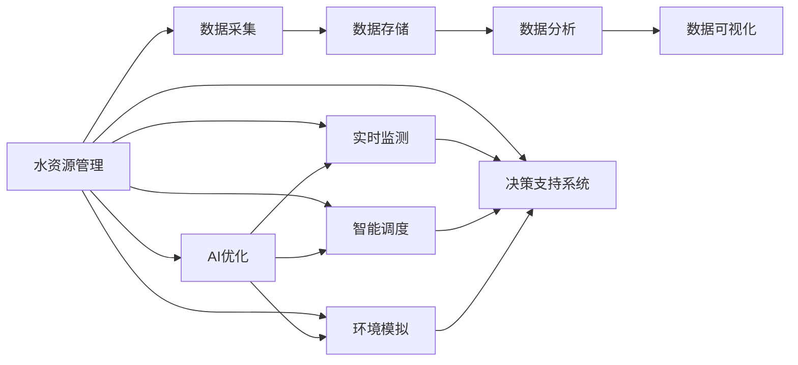

                 

# AI在水资源管理中的应用:优化利用与保护

> 关键词：
- 水资源管理
- AI优化
- 水资源保护
- 数据驱动
- 实时监测
- 智能调度
- 环境模拟
- 决策支持系统

## 1. 背景介绍

### 1.1 水资源管理的现状与挑战
水资源是人类生存和发展的基础，但其短缺、污染、管理不善等问题在全球范围内日益凸显。尽管多数国家和地区已建立了基本的水资源管理体系，但面对水资源供需不平衡、水质污染、水生态系统破坏等挑战，传统的管理方式已难以满足需求。传统的管理方式存在信息孤岛、决策滞后、无法动态优化等问题，迫切需要引入新技术以提升水资源管理的智能化水平。

近年来，人工智能（AI）技术的快速发展为水资源管理带来了新的可能。AI可以在水资源信息的采集、处理、分析、应用等各个环节发挥重要作用，有效提升水资源管理的效率和质量。通过机器学习、深度学习等技术，AI不仅能处理海量数据，还能自动发现潜在的规律和趋势，帮助决策者制定科学合理的水资源管理策略。

### 1.2 水资源管理AI应用的意义
AI在水资源管理中的应用，主要体现在以下几个方面：
- **数据驱动决策**：利用AI对水资源数据进行深度挖掘和分析，以数据驱动的方式辅助决策者制定策略。
- **实时监测与预警**：通过AI技术实时监测水资源状态，及时预警潜在风险，提前采取应对措施。
- **智能调度与优化**：利用AI进行水资源的高效调度和优化配置，减少资源浪费。
- **环境模拟与预测**：通过AI模拟水资源的环境变化，预测未来的水资源状况，为管理提供科学依据。
- **决策支持系统**：构建AI支持的决策支持系统，为水资源管理提供全面的智能化服务。

## 2. 核心概念与联系

### 2.1 核心概念概述

为更好地理解AI在水资源管理中的应用，本节将介绍几个关键概念：

- **水资源管理（Water Resource Management）**：包括水源的保护、水质的净化、水量的调度、水费的征收、水利的建设等活动。目的是实现水资源的可持续利用，满足社会经济发展的需求。

- **AI优化（AI Optimization）**：利用AI算法对水资源管理的过程进行优化，提高管理效率和质量。

- **水资源保护（Water Resource Protection）**：通过AI技术识别污染源、监测水质变化、预测污染趋势等，有效保护水资源。

- **数据驱动（Data-Driven）**：指通过数据分析和处理，驱动水资源管理决策的过程。

- **实时监测（Real-Time Monitoring）**：利用AI技术实时采集和分析水资源数据，实现动态监测。

- **智能调度（Intelligent Scheduling）**：通过AI算法对水资源进行智能调度，优化配置水资源，提高利用效率。

- **环境模拟（Environmental Simulation）**：利用AI模拟水资源环境，预测未来变化，辅助管理决策。

- **决策支持系统（Decision Support System, DSS）**：利用AI技术，构建综合性的决策支持系统，辅助水资源管理的各个环节。

### 2.2 核心概念间的关系

这些核心概念之间存在着紧密的联系，形成了水资源管理的完整框架。以下通过Mermaid流程图展示这些概念之间的逻辑关系：



这个流程图展示了水资源管理中各个环节和AI技术的应用，它们共同构成了水资源管理智能化体系：

1. **数据采集**：通过传感器、监测站等手段获取水资源数据。
2. **数据存储**：将采集到的数据存储到数据库中，供后续分析和处理使用。
3. **数据分析**：利用AI技术对数据进行深度分析和挖掘，提取有价值的信息。
4. **数据可视化**：通过图表、地图等形式展示分析结果，帮助决策者直观理解数据。
5. **AI优化**：通过AI算法优化水资源管理的各个环节，提升效率和质量。
6. **实时监测**：通过AI技术实时监测水资源状态，及时预警潜在风险。
7. **智能调度**：利用AI算法进行水资源的智能调度，优化配置水资源。
8. **环境模拟**：通过AI模拟水资源环境，预测未来变化，辅助管理决策。
9. **决策支持系统**：构建AI支持的决策支持系统，为水资源管理提供全面的智能化服务。

## 3. 核心算法原理 & 具体操作步骤

### 3.1 算法原理概述

AI在水资源管理中的应用，主要依赖于机器学习、深度学习等算法。这些算法通过学习历史数据和现实情况，预测未来趋势，优化决策方案。以下列举几个核心算法及其原理：

- **机器学习（Machine Learning）**：通过学习历史数据，构建模型，预测未来趋势。常见的算法有回归分析、分类、聚类等。
- **深度学习（Deep Learning）**：利用神经网络对大规模数据进行深度学习，提取复杂的特征，提升预测精度。常见的模型有卷积神经网络（CNN）、循环神经网络（RNN）、长短期记忆网络（LSTM）、变换器（Transformer）等。
- **强化学习（Reinforcement Learning）**：通过智能体与环境的交互，学习最优决策策略。应用于水资源管理中，智能体可以通过不断的试错，学习最优的调度策略。
- **协同过滤（Collaborative Filtering）**：通过分析用户行为数据，推荐最优的水资源方案。适用于个性化推荐、需求预测等场景。

### 3.2 算法步骤详解

以下详细介绍AI在水资源管理中的应用步骤：

**Step 1: 数据采集与预处理**

1. **数据采集**：通过传感器、监测站等设备，采集水资源相关的数据，包括水质、水量、水位、流量、气象等。
2. **数据预处理**：清洗数据，填补缺失值，去除异常值，进行归一化处理，确保数据的质量和一致性。

**Step 2: 数据建模与训练**

1. **特征工程**：从原始数据中提取有意义的特征，如水质参数、水量变化、气象因素等。
2. **模型选择**：根据具体问题选择合适的模型，如回归模型、分类模型、深度学习模型等。
3. **模型训练**：利用历史数据对模型进行训练，优化模型参数，提升预测精度。

**Step 3: 模型应用与评估**

1. **模型应用**：将训练好的模型应用于实时数据，进行预测和决策。
2. **性能评估**：通过评估指标（如均方误差、准确率、召回率等）评估模型的效果，确保模型性能满足要求。
3. **模型优化**：根据评估结果，调整模型参数，进行模型优化。

**Step 4: 集成与部署**

1. **模型集成**：将多个模型集成到一个决策支持系统中，综合考虑各个模型的预测结果，提升决策的科学性和准确性。
2. **系统部署**：将AI系统部署到实际的水资源管理场景中，进行实时监测、智能调度和决策支持。

### 3.3 算法优缺点

AI在水资源管理中的应用，具有以下优点：

- **数据驱动决策**：通过深度学习模型，利用大量数据进行预测和决策，提高决策的科学性和准确性。
- **实时监测与预警**：通过实时监测和预测，及时发现和预警水资源的风险，提前采取措施。
- **智能调度与优化**：利用优化算法进行水资源的智能调度，提高利用效率，减少浪费。
- **环境模拟与预测**：通过环境模拟和预测，为管理决策提供科学依据，提高管理的预见性和主动性。

同时，也存在以下缺点：

- **数据依赖性强**：AI系统的效果高度依赖于数据的质量和量，数据缺失或异常可能导致模型预测失效。
- **模型复杂度高**：深度学习模型参数量庞大，训练和预测成本较高，需要高性能计算资源。
- **决策透明性不足**：AI模型的决策过程黑盒化，难以解释和调试，可能导致决策透明度不足。

### 3.4 算法应用领域

AI在水资源管理中的应用，涵盖多个领域，具体如下：

- **水资源调度**：利用AI进行水资源的智能调度，优化水资源的配置和使用。
- **水质监测与预警**：利用AI进行水质监测和预警，及时发现和处理水质问题。
- **水资源预测**：利用AI进行水量、水质、气象等数据的预测，辅助决策。
- **环境变化模拟**：利用AI模拟水资源环境变化，预测未来的水资源状况。
- **需求预测与优化**：利用AI进行水资源需求预测，优化水资源的配置和使用。

## 4. 数学模型和公式 & 详细讲解 & 举例说明

### 4.1 数学模型构建

假设水资源管理中有一个水量调节池，输入为当前水量、降雨量、蒸发量等，输出为调节后水量。我们可以使用回归模型进行预测，模型的数学形式如下：

$$ y = f(x) = \sum_{i=1}^{n} w_i x_i + b $$

其中，$y$ 表示调节后水量，$x$ 表示输入变量（如当前水量、降雨量、蒸发量等），$w_i$ 表示模型参数，$b$ 表示截距。

### 4.2 公式推导过程

设训练数据集为 $\{(x_i, y_i)\}_{i=1}^{N}$，其中 $x_i$ 为输入向量，$y_i$ 为输出向量。回归模型的损失函数为均方误差（Mean Squared Error, MSE）：

$$ L = \frac{1}{N} \sum_{i=1}^{N} (y_i - f(x_i))^2 $$

通过反向传播算法，更新模型参数 $w_i$ 和 $b$：

$$ \frac{\partial L}{\partial w_i} = \frac{2}{N} \sum_{i=1}^{N} (y_i - f(x_i)) x_i $$
$$ \frac{\partial L}{\partial b} = \frac{2}{N} \sum_{i=1}^{N} (y_i - f(x_i)) $$

更新规则为：

$$ w_i \leftarrow w_i - \eta \frac{\partial L}{\partial w_i} $$
$$ b \leftarrow b - \eta \frac{\partial L}{\partial b} $$

其中，$\eta$ 为学习率。

### 4.3 案例分析与讲解

假设有一个水库，需要根据当前的降雨量、蒸发量等数据，预测调节后水量。利用上述回归模型进行预测，步骤如下：

1. **数据采集**：通过传感器等设备，获取当前降雨量、蒸发量、水位等数据。
2. **数据预处理**：清洗数据，填补缺失值，进行归一化处理，确保数据的质量和一致性。
3. **模型训练**：利用历史数据对回归模型进行训练，优化模型参数，提升预测精度。
4. **模型应用**：将训练好的模型应用于实时数据，进行水量预测。
5. **性能评估**：通过评估指标（如均方误差、准确率、召回率等）评估模型的效果，确保模型性能满足要求。
6. **模型优化**：根据评估结果，调整模型参数，进行模型优化。

## 5. 项目实践：代码实例和详细解释说明

### 5.1 开发环境搭建

在进行AI在水资源管理中的应用开发前，需要先准备好开发环境。以下是使用Python进行TensorFlow开发的环境配置流程：

1. 安装Anaconda：从官网下载并安装Anaconda，用于创建独立的Python环境。

2. 创建并激活虚拟环境：
```bash
conda create -n tf-env python=3.8 
conda activate tf-env
```

3. 安装TensorFlow：根据CUDA版本，从官网获取对应的安装命令。例如：
```bash
conda install tensorflow
```

4. 安装各类工具包：
```bash
pip install numpy pandas scikit-learn matplotlib tqdm jupyter notebook ipython
```

完成上述步骤后，即可在`tf-env`环境中开始AI在水资源管理中的应用开发。

### 5.2 源代码详细实现

这里我们以一个简单的水量调节池为例，给出使用TensorFlow进行预测的代码实现。

首先，定义模型：

```python
import tensorflow as tf

# 定义输入层和输出层的维度
input_dim = 3
output_dim = 1

# 定义模型结构
model = tf.keras.Sequential([
    tf.keras.layers.Dense(32, activation='relu', input_shape=(input_dim,)),
    tf.keras.layers.Dense(32, activation='relu'),
    tf.keras.layers.Dense(output_dim)
])

# 定义损失函数
loss_fn = tf.keras.losses.MeanSquaredError()

# 定义优化器
optimizer = tf.keras.optimizers.Adam(learning_rate=0.001)

# 定义评估指标
metrics = [tf.keras.metrics.MeanSquaredError()]

# 编译模型
model.compile(optimizer=optimizer, loss=loss_fn, metrics=metrics)
```

然后，加载数据：

```python
# 加载数据集
data = tf.keras.datasets.boston_housing.load_data()

# 处理数据
x_train, x_test, y_train, y_test = data.data, data.test.data, data.target, data.test.target

# 将数据转换为TensorFlow数据集格式
train_dataset = tf.data.Dataset.from_tensor_slices((x_train, y_train)).shuffle(1000).batch(32)
test_dataset = tf.data.Dataset.from_tensor_slices((x_test, y_test)).batch(32)

# 绘制数据分布
import matplotlib.pyplot as plt
plt.scatter(x_train[:, 0], y_train)
plt.xlabel('Data')
plt.ylabel('Target')
plt.show()
```

接着，训练模型：

```python
# 训练模型
epochs = 100
batch_size = 32

model.fit(train_dataset, epochs=epochs, batch_size=batch_size, validation_data=test_dataset)
```

最后，评估模型：

```python
# 评估模型
model.evaluate(test_dataset)
```

### 5.3 代码解读与分析

让我们再详细解读一下关键代码的实现细节：

**模型定义**：
- 定义输入层和输出层的维度。
- 构建多层感知机模型，包括两个隐藏层和一个输出层。
- 定义损失函数为均方误差。
- 定义优化器为Adam。
- 定义评估指标为均方误差。
- 编译模型，指定优化器、损失函数和评估指标。

**数据加载**：
- 使用TensorFlow的数据集加载工具，加载Boston Housing数据集。
- 处理数据，将其转换为TensorFlow数据集格式，并进行随机打乱和分批处理。
- 绘制数据分布，可视化数据的分布情况。

**模型训练**：
- 定义训练轮数和批次大小。
- 使用fit方法训练模型，指定训练数据集、训练轮数、批次大小和验证数据集。

**模型评估**：
- 使用evaluate方法评估模型，指定测试数据集。

## 6. 实际应用场景

### 6.1 水资源调度

智能化的水资源调度系统，可以实时监测和预测水资源状态，优化水资源的配置和使用，提高利用效率。通过AI模型对降雨量、蒸发量、用水量等数据进行预测和分析，系统可以自动调整水资源的分配和调度，避免浪费和短缺。例如，某城市的水资源调度系统可以根据气象预报和用水需求，实时调整水量的分配，确保供需平衡。

### 6.2 水质监测与预警

利用AI技术，可以对水质进行实时监测和预警。例如，某水处理厂的水质监测系统，通过传感器实时采集水中的化学物质含量、微生物数量等数据，利用AI模型对这些数据进行分析，及时预警水质异常，采取相应的处理措施，避免水污染事故的发生。

### 6.3 水资源预测

AI技术可以对水资源的未来变化进行预测，帮助决策者制定科学合理的管理策略。例如，某水库的水位预测系统，通过分析降雨量、蒸发量、水位等数据，利用AI模型预测未来的水位变化，辅助水库的管理决策，确保水库的安全运行。

### 6.4 环境变化模拟

AI技术可以对水资源环境进行模拟和预测，为水资源管理提供科学依据。例如，某河流的流量预测系统，通过分析历史流量数据和气象数据，利用AI模型预测未来的流量变化，帮助管理部门制定科学的防洪和灌溉策略，保护河流的生态平衡。

### 6.5 需求预测与优化

利用AI技术，可以对水资源需求进行预测和优化，减少浪费和短缺。例如，某城市的用水需求预测系统，通过分析历史用水数据和气候数据，利用AI模型预测未来的用水需求，优化水资源的配置和使用，提高利用效率。

## 7. 工具和资源推荐

### 7.1 学习资源推荐

为了帮助开发者系统掌握AI在水资源管理中的应用，这里推荐一些优质的学习资源：

1. 《TensorFlow实战》系列博文：由TensorFlow官方博客撰写，详细介绍了TensorFlow的基本原理和应用实例，适合初学者入门。

2. 《深度学习》（Goodfellow, Bengio, Courville, 2016）：全面介绍深度学习的理论基础和实践方法，是深度学习领域的经典教材。

3. 《Python数据科学手册》（Jake VanderPlas, 2016）：介绍Python在数据科学中的应用，包括数据处理、机器学习、数据可视化等。

4. Coursera《深度学习专项课程》：由Coursera提供的深度学习课程，由斯坦福大学教授Andrew Ng主讲，涵盖深度学习的基本原理和应用实例。

5. Kaggle数据科学竞赛平台：提供大量数据集和比赛，帮助你实践和提升AI技术。

通过对这些资源的学习实践，相信你一定能够快速掌握AI在水资源管理中的应用，并用于解决实际的水资源管理问题。

### 7.2 开发工具推荐

高效的开发离不开优秀的工具支持。以下是几款用于AI在水资源管理中应用的开发工具：

1. TensorFlow：由Google主导开发的开源深度学习框架，生产部署方便，适合大规模工程应用。

2. PyTorch：基于Python的开源深度学习框架，灵活的计算图，适合快速迭代研究。

3. Jupyter Notebook：交互式编程工具，支持Python、R等语言，方便代码调试和共享。

4. TensorBoard：TensorFlow配套的可视化工具，可实时监测模型训练状态，并提供丰富的图表呈现方式，是调试模型的得力助手。

5. Scikit-learn：基于Python的数据科学库，包含大量的机器学习算法和工具，适合数据处理和分析。

6. Matplotlib：Python的数据可视化库，可以绘制各种图表，支持动态更新，方便数据可视化。

合理利用这些工具，可以显著提升AI在水资源管理中的应用开发效率，加快创新迭代的步伐。

### 7.3 相关论文推荐

AI在水资源管理中的应用，离不开学界的持续研究。以下是几篇奠基性的相关论文，推荐阅读：

1. "Anomaly Detection in Water Quality Monitoring using Deep Learning"（IEEE Transactions on Systems, Man, and Cybernetics: Systems，2020）：研究利用深度学习进行水质异常检测的方法。

2. "A Water Resource Management Decision Support System"（Journal of Water Resource Planning and Management，2019）：介绍一种基于AI的水资源管理决策支持系统。

3. "Water Resource Allocation Using Reinforcement Learning"（Journal of Water Resources Planning and Management，2020）：研究利用强化学习进行水资源分配的方法。

4. "Water Resource Management with IoT and AI"（Proceedings of the IEEE，2018）：讨论了物联网和AI在水资源管理中的应用。

这些论文代表了大语言模型微调技术的发展脉络。通过学习这些前沿成果，可以帮助研究者把握学科前进方向，激发更多的创新灵感。

除上述资源外，还有一些值得关注的前沿资源，帮助开发者紧跟AI在水资源管理中的技术发展，例如：

1. arXiv论文预印本：人工智能领域最新研究成果的发布平台，包括大量尚未发表的前沿工作，学习前沿技术的必读资源。

2. 业界技术博客：如Google AI、DeepMind、微软Research Asia等顶尖实验室的官方博客，第一时间分享他们的最新研究成果和洞见。

3. 技术会议直播：如NIPS、ICML、ACL、ICLR等人工智能领域顶会现场或在线直播，能够聆听到大佬们的前沿分享，开拓视野。

4. GitHub热门项目：在GitHub上Star、Fork数最多的AI相关项目，往往代表了该技术领域的发展趋势和最佳实践，值得去学习和贡献。

5. 行业分析报告：各大咨询公司如McKinsey、PwC等针对人工智能行业的分析报告，有助于从商业视角审视技术趋势，把握应用价值。

总之，对于AI在水资源管理中的应用，需要开发者保持开放的心态和持续学习的意愿。多关注前沿资讯，多动手实践，多思考总结，必将收获满满的成长收益。

## 8. 总结：未来发展趋势与挑战

### 8.1 总结

本文对AI在水资源管理中的应用进行了全面系统的介绍。首先阐述了水资源管理的现状和挑战，明确了AI技术在水资源管理中的应用前景。其次，从原理到实践，详细讲解了AI在水资源管理中的算法原理和具体操作步骤，给出了AI在水资源管理中的应用实例。同时，本文还广泛探讨了AI在水资源管理中的应用场景，展示了AI在水资源管理中的广泛应用前景。

通过本文的系统梳理，可以看到，AI技术在水资源管理中的应用正处于蓬勃发展阶段，利用AI技术，可以显著提升水资源管理的智能化水平，为水资源的优化利用和保护提供强有力的技术支撑。

### 8.2 未来发展趋势

展望未来，AI在水资源管理中的应用将呈现以下几个发展趋势：

1. **数据驱动的智能决策**：AI系统将越来越多地依赖于数据驱动决策，通过深度学习模型，利用大量数据进行预测和决策，提高决策的科学性和准确性。
2. **实时监测与预警**：AI技术将实现更精准、更实时的监测和预警，及时发现和处理水资源的风险，提升管理的预见性和主动性。
3. **智能调度与优化**：利用AI算法进行水资源的智能调度，优化配置水资源，提高利用效率，减少浪费。
4. **环境模拟与预测**：AI技术将对水资源环境进行更精确的模拟和预测，为管理决策提供科学依据，提高管理的预见性和主动性。
5. **决策支持系统**：构建AI支持的决策支持系统，为水资源管理提供全面的智能化服务，提升管理效率。

### 8.3 面临的挑战

尽管AI在水资源管理中的应用已经取得了显著成果，但在迈向更加智能化、普适化应用的过程中，它仍面临诸多挑战：

1. **数据质量问题**：AI系统的效果高度依赖于数据的质量和量，数据缺失或异常可能导致模型预测失效。
2. **模型复杂性**：深度学习模型参数量庞大，训练和预测成本较高，需要高性能计算资源。
3. **决策透明度**：AI模型的决策过程黑盒化，难以解释和调试，可能导致决策透明度不足。
4. **隐私和安全**：AI系统涉及大量的敏感数据，需要确保数据的安全性和隐私性，防止数据泄露和滥用。

### 8.4 研究展望

面对AI在水资源管理中面临的挑战，未来的研究需要在以下几个方面寻求新的突破：

1. **数据质量提升**：通过数据清洗、增强、补全等手段，提高数据的质量和量，为AI模型提供更好的训练数据。
2. **模型简化**：开发更加轻量级的模型，减少参数量和计算资源消耗，提高AI系统的可部署性。
3. **决策透明性**：引入可解释性AI技术，解释AI模型的决策过程，增强决策的透明度和可解释性。
4. **隐私保护**：利用隐私保护技术，确保数据的隐私性和安全性，防止数据泄露和滥用。

这些研究方向的探索，必将引领AI在水资源管理中的应用迈向更高的台阶，为水资源管理提供更加智能、高效、安全的服务。

## 9. 附录：常见问题与解答

**Q1：AI在水资源管理中的应用是否适用于所有水资源管理场景？**

A: AI在水资源管理中的应用，适用于大部分水资源管理场景，特别是在数据量较大、数据类型多样、数据质量较高的情况下，效果更为显著。但对于一些特殊场景，如极端气候条件下的水资源管理、水资源量极少的地区等，可能需要结合其他技术手段，才能取得最佳效果。

**Q2：AI在水资源管理中的应用是否需要大量的标注数据？**

A: 通常情况下，AI模型需要大量的标注数据进行训练，以提高模型的预测精度。但水资源管理领域的数据类型多样，标注数据获取较为困难，可以考虑利用半监督学习、弱监督学习等方法，降低对标注数据的依赖。

**Q3：AI在水资源管理中的应用是否需要高性能计算资源？**

A: 深度学习模型通常需要高性能计算资源进行训练和预测。对于大规模数据集和高精度模型，确实需要高性能计算资源。但目前已有许多开源框架和工具，可以优化计算效率，降低计算成本。

**Q4：AI在水资源管理中的应用是否需要高精度的传感器和监测设备？**

A: AI模型对数据的质量要求较高，但并不是所有水资源管理场景都需要高精度的传感器和监测设备。根据具体应用场景和需求，选择合适的传感器和监测设备，既能满足需求，又能降低成本。

**Q5：AI在水资源管理中的应用是否需要专业知识？**

A: AI在水资源管理中的应用，确实需要一定的专业知识，包括水资源管理的原理、数据的采集和处理、模型的训练和优化等。但

