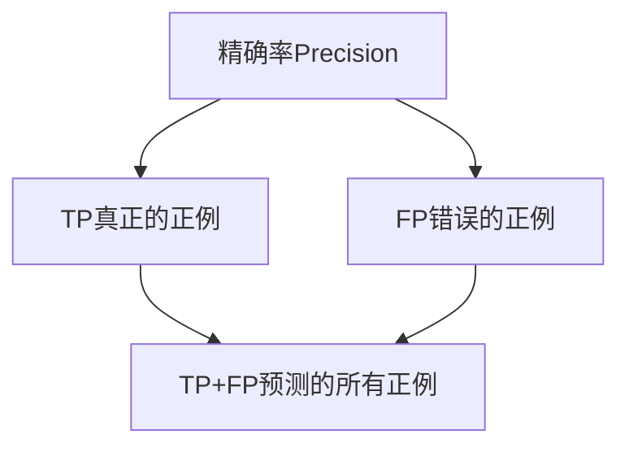

# 精确率Precision原理与代码实例讲解

## 1. 背景介绍

### 1.1 问题的由来

在机器学习和信息检索领域中,精确率(Precision)是一个非常重要的评估指标。它反映了模型预测的结果中有多少是真正的正例(True Positives)。精确率直接影响着模型的实际应用效果,因此提高精确率一直是研究人员和工程师所关注的重点问题。

精确率的概念源于信息检索理论。在传统的信息检索系统中,用户输入查询关键词,系统会返回一系列相关文档。精确率就是用来衡量这些返回文档中有多大比例是用户真正需要的。精确率的定义为:

$$Precision = \frac{真正相关的文档数量}{返回的文档总数量}$$

一个较高的精确率意味着较少的噪声文档被返回,可以为用户提供更加准确和高效的检索体验。

随着机器学习技术的发展,精确率的概念也被广泛应用于分类、检测等任务中。在这些任务中,模型需要对输入的数据样本进行预测和分类。精确率就是衡量模型预测的正例中有多少是真实的正例。

### 1.2 研究现状

提高精确率一直是机器学习领域的一个核心研究方向。研究人员提出了多种方法来优化模型,提升精确率,主要包括:

1. **特征工程**: 选择更有区分能力的特征,过滤掉无关特征,可以提高模型的精确率。
2. **算法优化**: 改进现有算法,提出新的算法框架,如支持向量机(SVM)、决策树、Boosting等,能够显著提升精确率。
3. **数据增强**: 通过数据清洗、数据扩充等方式,提高训练数据的质量和数量,从而提高模型的泛化能力和精确率。
4. **模型集成**: 将多个基础模型集成,综合不同模型的优点,形成更加强大和精确的集成模型。
5. **迁移学习**: 将在源领域学习到的知识迁移到目标领域,减少目标领域的数据需求,提高精确率。
6. **深度学习**: 利用深度神经网络自动从大量数据中学习特征表示,极大提升了精确率。

### 1.3 研究意义

提高精确率对于机器学习模型的实际应用至关重要。一个较高的精确率能够:

1. **提升用户体验**: 在信息检索、推荐系统等场景下,高精确率意味着更少噪声,用户获得的结果更加精准和满意。
2. **降低错误成本**: 在医疗诊断、金融风控等领域,错误预测可能导致严重后果。提高精确率能够最大限度减少这些高成本错误。
3. **节省计算资源**: 对于计算密集型任务,如目标检测,提高精确率可减少对下游任务的重复计算,提高效率。
4. **促进技术发展**: 精确率的提高推动着机器学习技术在更多领域的落地应用,为解决实际问题提供有力工具。

因此,研究精确率的提升方法具有重要的理论意义和实际应用价值。

### 1.4 本文结构

本文将全面介绍精确率的相关理论和实践。具体内容安排如下:

1. 阐述精确率的核心概念及其与其他评估指标的联系。
2. 详细讲解提高精确率的核心算法原理和具体操作步骤。
3. 介绍精确率相关的数学模型,并通过案例分析进行讲解。
4. 提供一个完整的项目实践,包括代码实现和运行结果分析。
5. 探讨精确率在不同领域的实际应用场景和未来展望。
6. 推荐相关的学习资源、开发工具和论文等。
7. 总结精确率提升的研究成果、发展趋势和面临的挑战。
8. 附录部分解答常见的问题和疑惑。

## 2. 核心概念与联系

精确率(Precision)是机器学习和信息检索领域中最常用的评估指标之一。它反映了模型预测的正例中有多少是真正的正例,定义如下:

$$Precision = \frac{TP}{TP + FP}$$

其中:

- TP(True Positive)表示被正确预测为正例的样本数量
- FP(False Positive)表示被错误预测为正例的样本数量

精确率的取值范围是[0, 1],值越高表示模型的预测结果越精确。

精确率通常与另一个重要指标回归(Recall)一起使用,用于综合评估模型的性能。回归反映了模型能够找到多少比例的正例,定义为:

$$Recall = \frac{TP}{TP + FN}$$

其中FN(False Negative)表示被错误预测为负例的正例样本数量。

精确率和回归之间存在一定的权衡关系,当我们提高精确率时,往往会导致回归下降,反之亦然。在实际应用中,需要根据具体场景的需求,平衡精确率和回归,以获得最优的模型性能。

此外,还有一些其他常用的评估指标,如F1分数、ROC曲线下的面积(AUC)等,它们都与精确率和回归有一定的联系。精确率是模型评估的基础,掌握精确率的提升方法,有助于提高模型在各种评估指标上的表现。

## 3. 核心算法原理 & 具体操作步骤

### 3.1 算法原理概述

提高精确率的核心思路是减少模型预测的错误正例(FP)的数量。根据不同的任务场景,可以采用多种算法和策略来实现这一目标。

一种常见的方法是通过调整模型的决策阈值(Decision Threshold)来控制精确率。许多机器学习模型(如逻辑回归、SVM等)会为每个样本输出一个分数,代表该样本属于正例的概率或置信度。我们可以设置一个阈值,只有分数超过该阈值的样本才被预测为正例,否则预测为负例。提高这个阈值可以减少FP,从而提高精确率,但同时也会导致TP减少,降低回归。

另一种方法是在训练过程中直接优化精确率相关的损失函数。传统的交叉熵损失函数对精确率的优化效果并不理想,因此研究人员提出了一些专门的损失函数,如Focal Loss、AP Loss等,这些损失函数能够更好地提高精确率。

除此之外,还可以通过数据增强、特征选择、模型集成、迁移学习等技术来间接提升精确率。这些技术有助于提高模型的泛化能力,降低过拟合风险,从而减少错误预测的发生。

### 3.2 算法步骤详解

以下是一种常见的基于决策阈值调整的提高精确率的算法步骤:

1. **训练基础模型**: 使用标准的监督学习算法(如逻辑回归、SVM等)在训练数据上训练一个基础模型。
2. **模型评估**: 在验证集或测试集上评估模型的精确率、回归等指标,记录当前的性能表现。
3. **决策阈值调整**:
   - 初始化一个阈值列表,包含多个不同的阈值,如[0.1, 0.2, 0.3, ..., 0.9]。
   - 对于每个阈值:
     - 遍历验证集/测试集中的每个样本。
     - 如果模型输出的分数大于当前阈值,则预测为正例,否则预测为负例。
     - 根据预测结果和真实标签,计算在该阈值下的精确率和回归。
4. **选择最优阈值**:
   - 从阈值列表中选择能够满足精确率要求的最大阈值,记为最优阈值。
   - 如果没有阈值能够满足精确率要求,则选择具有最高精确率的阈值作为最优阈值。
5. **模型微调(可选)**: 使用最优阈值对基础模型进行微调,获得最终的模型。

以上算法的核心思想是通过系统地搜索最优决策阈值,在精确率和回归之间寻找平衡,从而获得满足应用需求的模型。该算法的优点是简单直观,缺点是需要大量的阈值搜索计算,并且无法直接优化精确率相关的损失函数。

### 3.3 算法优缺点

上述基于决策阈值调整的算法具有以下优缺点:

**优点**:

1. **简单直观**: 算法思路清晰,易于理解和实现。
2. **可解释性强**: 决策阈值的概念容易解释,便于人工分析和调优。
3. **通用性强**: 适用于大多数生成分数的机器学习模型。

**缺点**:

1. **计算开销大**: 需要遍历大量候选阈值,计算量随阈值数量的增加而显著增加。
2. **无法直接优化目标**: 该算法无法直接针对精确率相关的损失函数进行优化。
3. **局限于单一阈值**: 对于复杂的决策边界问题,单一阈值可能无法取得最优解。

### 3.4 算法应用领域

提高精确率的算法在多个领域都有广泛的应用,包括但不限于:

1. **信息检索**: 在搜索引擎、推荐系统等场景下,提高精确率可以为用户提供更加相关的结果。
2. **计算机视觉**: 在目标检测、图像分类等视觉任务中,精确率直接影响着模型的实际应用效果。
3. **自然语言处理**: 如文本分类、情感分析、机器翻译等,提高精确率可以显著提升语言理解和生成的质量。
4. **医疗健康**: 疾病诊断、医疗影像分析等领域,提高精确率可以减少错误判断,保障患者的健康和安全。
5. **金融风控**: 如信用评分、欺诈检测等,高精确率有助于降低金融风险和经济损失。
6. **其他领域**: 如垃圾邮件过滤、入侵检测、故障诊断等,都需要高精确率的模型来提供可靠的预测结果。

总的来说,无论是在商业应用还是科研领域,提高精确率都是一个永恒的主题,对于提升人工智能系统的实用性和可靠性至关重要。

## 4. 数学模型和公式 & 详细讲解 & 举例说明

### 4.1 数学模型构建

在构建精确率相关的数学模型之前,我们首先需要定义一些基本概念和符号:

- $y_i$: 第i个样本的真实标签,取值为0(负例)或1(正例)
- $\hat{y}_i$: 第i个样本的预测标签,取值为0或1
- $s_i$: 第i个样本被预测为正例的分数或概率
- $N$: 样本总数
- $N_p$: 正例样本数量,即$\sum_i y_i$
- $N_n$: 负例样本数量,即$N - N_p$

我们将精确率(P)和回归(R)的公式表示为:

$$P = \frac{\sum_i \mathbb{I}(y_i=1 \cap \hat{y}_i=1)}{\sum_i \mathbb{I}(\hat{y}_i=1)}$$

$$R = \frac{\sum_i \mathbb{I}(y_i=1 \cap \hat{y}_i=1)}{\sum_i \mathbb{I}(y_i=1)}$$

其中$\mathbb{I}(\cdot)$是指示函数,当条件成立时取值为1,否则为0。

为了同时优化精确率和回归,我们可以构建一个加权损失函数:

$$\mathcal{L}(\theta) = -\frac{1}{N} \sum_i \Big[ (1-\alpha)y_i\log P_i + \alpha(1-y_i)\log(1-P_i) \Big]$$

其中:

- $\theta$表示模型参数
- $P_i = P(y_i=1|x_i;\theta)$是模型对第i个样本$x_i$被预测为正例的概率
- $\alpha \in [0, 1]$是一个权重系数,用于平衡精确率和回归的重要性

当$\