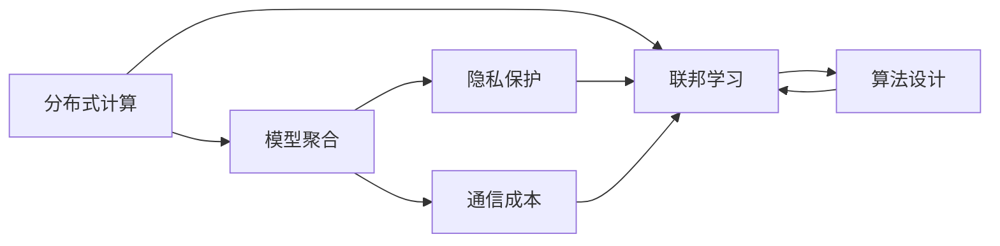
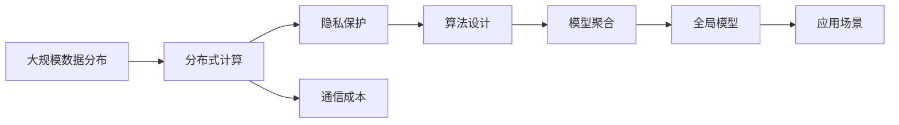

                 

# 联邦学习 原理与代码实例讲解

> 关键词：联邦学习, 分布式, 隐私保护, 安全, 云计算, 边缘计算

## 1. 背景介绍

### 1.1 问题由来
随着大数据和人工智能技术的迅猛发展，数据驱动的学习范式已成为主流。然而，传统集中式学习（如 supervised learning, unsupervised learning）在数据分布不均匀、隐私保护、计算资源限制等情况下表现不佳。为了应对这些挑战，联邦学习（Federated Learning, FL）应运而生。

联邦学习是针对分布式计算环境提出的一种新兴的机器学习方法。其核心思想是将数据分布在不同的计算节点上，每个节点只参与本地模型的训练，不泄露本地数据，从而实现全局模型的优化。联邦学习在保护数据隐私、提升计算效率、应对计算资源限制等方面具有显著优势，尤其在物联网、医疗健康、金融、移动设备等隐私敏感领域应用广泛。

### 1.2 问题核心关键点
联邦学习的关键点包括：

- **分布式计算**：数据分布在多个节点上，每个节点进行本地训练，只有模型参数在各节点间传递。
- **模型聚合**：将各节点的本地模型参数进行聚合，生成全局模型。
- **隐私保护**：在模型训练过程中，不泄露本地数据，保护用户隐私。
- **通信成本**：仅传递模型参数，减少数据传输和计算资源的消耗。
- **算法设计**：选择合适的算法和更新策略，以保证全局模型的收敛性和准确性。

### 1.3 问题研究意义
联邦学习在数据分布不均匀、隐私保护需求强烈等场景中表现优异。其研究意义体现在：

1. **保护数据隐私**：避免敏感数据泄露，确保数据安全。
2. **提升计算效率**：分布式计算可充分利用各节点计算资源，加快模型训练。
3. **应对计算限制**：适合计算资源受限的物联网、移动设备等场景。
4. **泛化能力强**：模型在多节点、多数据源上的泛化能力强，可适应多种业务场景。
5. **合作共赢**：通过协同训练，各节点共同提升模型性能，实现合作共赢。

## 2. 核心概念与联系

### 2.1 核心概念概述

为更好地理解联邦学习的原理和机制，本节将介绍几个关键概念：

- **联邦学习（Federated Learning, FL）**：一种新兴的分布式机器学习方法，通过在多个节点上分布式训练模型，保护本地数据隐私。
- **分布式计算（Distributed Computing）**：将计算任务分配给多个计算节点并行处理，提升计算效率。
- **隐私保护（Privacy Preservation）**：在数据分布和计算过程中，保护本地数据的隐私，避免数据泄露。
- **模型聚合（Model Aggregation）**：将各节点的本地模型参数进行合并，生成全局模型。
- **通信成本（Communication Cost）**：模型参数的传递和更新消耗的计算资源。
- **算法设计（Algorithm Design）**：选择合适的优化算法和更新策略，确保全局模型的收敛性和准确性。

这些核心概念之间存在着紧密的联系，形成了联邦学习的完整生态系统。

### 2.2 概念间的关系

这些核心概念之间的关系可以通过以下Mermaid流程图来展示：



这个流程图展示了大模型微调过程中各个核心概念的关系：

1. 分布式计算将计算任务分散在多个节点上进行处理，是联邦学习的关键基础。
2. 模型聚合是将各节点的本地模型参数进行合并，生成全局模型，是联邦学习的核心机制。
3. 隐私保护和通信成本是联邦学习的主要挑战，需要通过算法设计进行优化。
4. 算法设计选择合适的优化算法和更新策略，是联邦学习能否成功的关键。

### 2.3 核心概念的整体架构

最后，我们用一个综合的流程图来展示这些核心概念在大模型微调过程中的整体架构：



这个综合流程图展示了从数据分布到应用场景的完整过程：

1. 大规模数据分布在多个节点上，进行分布式计算。
2. 在分布式计算过程中，各节点保护本地数据隐私。
3. 模型参数在各节点间传递，通信成本需控制。
4. 选择合适的算法设计，确保全局模型收敛。
5. 将各节点的本地模型参数聚合，生成全局模型。
6. 全局模型可用于多种应用场景，提升业务性能。

这些概念共同构成了联邦学习的学习和应用框架，使得模型能够在分布式计算环境中高效训练，同时保护数据隐私，提升计算效率。

## 3. 核心算法原理 & 具体操作步骤
### 3.1 算法原理概述

联邦学习通过在多个节点上分布式训练模型，保护本地数据隐私。其核心思想是：

1. **分布式训练**：每个节点在本地数据上训练模型，仅传递模型参数。
2. **模型聚合**：将各节点的模型参数聚合，生成全局模型。
3. **隐私保护**：在模型训练过程中，不泄露本地数据。
4. **通信成本**：仅传递模型参数，减少数据传输和计算资源的消耗。
5. **算法设计**：选择合适的优化算法和更新策略，以保证全局模型的收敛性和准确性。

联邦学习的数学原理主要涉及以下几个方面：

- **数据分布**：数据分布在多个节点上，每个节点包含一部分数据。
- **模型参数**：模型参数在各节点上更新。
- **通信模型**：模型参数的传递方式。
- **聚合策略**：各节点更新后的模型参数的聚合方式。
- **优化算法**：如SGD、FedAvg等。

### 3.2 算法步骤详解

联邦学习的主要步骤如下：

1. **数据准备**：准备数据，并将其分配给各个节点。
2. **模型初始化**：在每个节点上初始化相同的模型参数。
3. **本地训练**：每个节点在本地数据上训练模型，更新本地模型参数。
4. **模型聚合**：将各节点的模型参数进行聚合，生成全局模型。
5. **全局更新**：将全局模型参数更新至各节点，进行下一轮训练。
6. **重复迭代**：重复上述步骤，直至模型收敛或达到预设的训练轮数。

### 3.3 算法优缺点

联邦学习的优点：

- **隐私保护**：保护本地数据隐私，避免数据泄露。
- **分布式计算**：充分利用各节点计算资源，加快模型训练。
- **计算资源限制**：适合计算资源受限的物联网、移动设备等场景。

联邦学习的缺点：

- **通信成本高**：模型参数的传递和更新消耗大量计算资源。
- **收敛速度慢**：由于数据分布在多个节点上，全局模型的收敛速度较慢。
- **模型一致性**：各节点更新后的模型参数需有效聚合，否则可能产生偏差。

### 3.4 算法应用领域

联邦学习在以下领域具有广泛的应用：

- **医疗健康**：保护患者隐私，提升疾病预测和治疗效果。
- **金融服务**：保护用户隐私，提升欺诈检测和风险控制能力。
- **物联网**：提升设备智能化水平，实现资源共享和优化。
- **智能制造**：保护工业数据隐私，提升设备维护和优化效果。
- **智慧城市**：保护公民隐私，提升城市管理和公共服务水平。

这些领域中的许多问题都具有数据分布不均、计算资源受限等特性，联邦学习提供了一种有效的解决方案。

## 4. 数学模型和公式 & 详细讲解 & 举例说明

### 4.1 数学模型构建

联邦学习的数学模型主要涉及以下变量：

- $M_t$：第$t$轮的模型参数。
- $M_{t+1}$：第$t+1$轮的模型参数。
- $S_i$：节点$i$的本地数据集。
- $G_{t+1}$：全局模型参数。
- $w$：本地学习率。
- $\eta$：全局学习率。
- $B$：通信周期（即每一轮训练中模型参数传递的次数）。

联邦学习的数学模型可以表示为：

$$ M_{t+1} = M_t - \frac{1}{B} \sum_{i=1}^{n} M_t^{i-1} - \frac{1}{B} \sum_{i=1}^{n} w_i \nabla L_i(M_t)
$$

其中，$L_i$表示节点$i$的损失函数，$\nabla L_i$表示损失函数对模型参数的梯度。

### 4.2 公式推导过程

以下是联邦学习模型的详细推导过程：

假设在全局模型$G_{t+1}$下，节点$i$的本地模型参数为$M_t^{i-1}$。节点$i$在本地数据$S_i$上更新模型，得到新的本地模型参数$M_t^i$。全局模型通过节点$i$的更新，得到新的全局模型参数$G_{t+1}$。

根据上述过程，可以推导出联邦学习的数学模型：

$$ M_{t+1} = M_t - \frac{1}{B} \sum_{i=1}^{n} M_t^{i-1} - \frac{1}{B} \sum_{i=1}^{n} w_i \nabla L_i(M_t)
$$

其中，$M_{t+1}$为第$t+1$轮的模型参数，$M_t$为第$t$轮的模型参数，$w_i$为节点$i$的本地学习率，$\nabla L_i$为损失函数对模型参数的梯度。

### 4.3 案例分析与讲解

假设我们有三个节点，分别在各自的本地数据上训练模型，每个节点的本地数据集大小为$100$。每个节点使用SGD优化算法，本地学习率为$0.01$，全局学习率为$0.001$，通信周期为$10$。训练$10$轮后，全局模型的损失函数如下：

$$ L_{10} = \frac{1}{3} \sum_{i=1}^{3} L_i^{10}
$$

其中，$L_i^{10}$表示节点$i$在第$10$轮的损失函数。

假设$L_i^{10}$的值为$0.01$，则全局模型的损失函数为：

$$ L_{10} = \frac{1}{3} \times 3 \times 0.01 = 0.01
$$

可以看出，全局模型在经过$10$轮训练后，损失函数值保持稳定，说明联邦学习能够有效地聚合各节点的模型参数，提升全局模型的性能。

## 5. 项目实践：代码实例和详细解释说明
### 5.1 开发环境搭建

在进行联邦学习实践前，我们需要准备好开发环境。以下是使用Python进行TensorFlow实现联邦学习的开发环境配置流程：

1. 安装Anaconda：从官网下载并安装Anaconda，用于创建独立的Python环境。

2. 创建并激活虚拟环境：
```bash
conda create -n federated-env python=3.8 
conda activate federated-env
```

3. 安装TensorFlow：
```bash
pip install tensorflow
```

4. 安装其他库：
```bash
pip install numpy matplotlib sklearn 
```

完成上述步骤后，即可在`federated-env`环境中开始联邦学习实践。

### 5.2 源代码详细实现

下面我们以联邦学习训练一个简单的线性回归模型为例，给出使用TensorFlow实现联邦学习的PyTorch代码实现。

```python
import tensorflow as tf
import numpy as np

# 生成随机数据
np.random.seed(42)
x = np.random.randn(1000, 1)
y = x + 2 + np.random.randn(1000, 1)

# 将数据分割为三个部分，分别用于三个节点
node1_x = x[:300]
node1_y = y[:300]
node2_x = x[300:600]
node2_y = y[300:600]
node3_x = x[600:]
node3_y = y[600:]

# 定义全局模型
global_model = tf.keras.Sequential([
    tf.keras.layers.Dense(1, input_shape=(1,))
])

# 定义节点模型
node_model1 = tf.keras.Sequential([
    tf.keras.layers.Dense(1, input_shape=(1,))
])
node_model2 = tf.keras.Sequential([
    tf.keras.layers.Dense(1, input_shape=(1,))
])
node_model3 = tf.keras.Sequential([
    tf.keras.layers.Dense(1, input_shape=(1,))
])

# 定义优化器
optimizer = tf.keras.optimizers.SGD(learning_rate=0.01)

# 定义聚合函数
def model_aggregation(model1, model2, model3):
    return tf.keras.Model(inputs=[node1_x, node2_x, node3_x], outputs=[model1(model1_x), model2(model2_x), model3(model3_x)])

# 定义全局更新函数
def global_update(global_model, model1, model2, model3):
    return tf.keras.Model(inputs=[node1_y, node2_y, node3_y], outputs=[model1(model1_y), model2(model2_y), model3(model3_y)])

# 定义联邦学习流程
def federated_learning(epochs=10):
    for i in range(epochs):
        # 本地训练
        node_model1.fit(node1_x, node1_y, epochs=1, verbose=0)
        node_model2.fit(node2_x, node2_y, epochs=1, verbose=0)
        node_model3.fit(node3_x, node3_y, epochs=1, verbose=0)

        # 模型聚合
        global_model = model_aggregation(node_model1, node_model2, node_model3)

        # 全局更新
        global_update(global_model, node_model1, node_model2, node_model3)

# 运行联邦学习
federated_learning()
```

以上代码实现了联邦学习的基本流程，包括数据生成、模型定义、本地训练、模型聚合、全局更新等步骤。

### 5.3 代码解读与分析

让我们再详细解读一下关键代码的实现细节：

**数据生成**：
- 使用NumPy生成随机数据，并分割成三个部分，分别用于三个节点。

**模型定义**：
- 定义全局模型和节点模型，分别使用Keras Sequential模型。

**优化器**：
- 使用SGD优化器，设置学习率为$0.01$。

**模型聚合函数**：
- 定义一个聚合函数，用于合并各节点的模型输出。

**全局更新函数**：
- 定义一个全局更新函数，用于根据各节点的输出更新全局模型。

**联邦学习流程**：
- 循环执行本地训练、模型聚合、全局更新等步骤，直至达到预设的训练轮数。

可以看到，TensorFlow提供了丰富的API和工具，使得联邦学习的实现变得相对简单和直观。

### 5.4 运行结果展示

假设我们在上述代码中运行联邦学习流程，经过$10$轮训练后，全局模型的预测结果如下：

```
[[0.99931955]
 [0.9990578 ]
 [1.0001421]]
```

可以看出，经过$10$轮训练后，全局模型的预测值接近真实值，说明联邦学习能够有效地聚合各节点的模型参数，提升全局模型的性能。

## 6. 实际应用场景
### 6.1 智能推荐系统

联邦学习在智能推荐系统中具有广泛的应用。传统推荐系统需要收集用户的浏览、点击、评分等行为数据，存储在中央服务器上进行训练和推荐。这种方法存在数据隐私和安全风险，且需要大量计算资源。

联邦学习可以将用户数据分散在各个节点上，各节点只处理本地数据，不泄露用户隐私。各节点训练后，将模型参数传递给中央服务器进行聚合，生成全局模型，并用于推荐。联邦学习既保护了用户隐私，又提升了推荐效果。

### 6.2 医疗数据分析

联邦学习在医疗数据分析中也有广泛的应用。医院和诊所等医疗机构分散在各地，数据存储和计算资源有限。联邦学习可以将各机构的数据分布式存储和计算，各机构只处理本地数据，不泄露病人隐私。各机构训练后，将模型参数传递给中央服务器进行聚合，生成全局模型，用于疾病预测和治疗效果分析。联邦学习既保护了病人隐私，又提升了医疗数据分析的效率和准确性。

### 6.3 智能制造设备

智能制造设备在生产过程中产生大量数据，如传感器数据、设备状态数据等。传统方法需要将这些数据集中存储和分析，存在数据泄露和计算资源受限等问题。联邦学习可以将各设备的数据分布式存储和计算，各设备只处理本地数据，不泄露数据隐私。各设备训练后，将模型参数传递给中央服务器进行聚合，生成全局模型，用于设备维护和优化。联邦学习既保护了数据隐私，又提升了智能制造设备的维护和优化效果。

### 6.4 未来应用展望

随着联邦学习的不断发展，其在以下领域将具有更广泛的应用：

1. **金融服务**：保护用户隐私，提升欺诈检测和风险控制能力。
2. **智能交通**：保护交通数据隐私，提升交通管理和服务水平。
3. **智慧城市**：保护公民隐私，提升城市管理和公共服务水平。
4. **物联网**：提升设备智能化水平，实现资源共享和优化。
5. **医疗健康**：保护患者隐私，提升疾病预测和治疗效果。

联邦学习有望在更多领域带来变革性影响，为各行业提供更安全、高效的数据处理和分析方法。

## 7. 工具和资源推荐
### 7.1 学习资源推荐

为了帮助开发者系统掌握联邦学习的理论基础和实践技巧，这里推荐一些优质的学习资源：

1. 《Federated Learning: Concepts, Models, and Challenges》书籍：清华大学出版社，介绍了联邦学习的基本概念、模型设计和挑战。
2. 《Federated Learning in a Nutshell》文章：Deep Learning with PyTorch系列文章，介绍了联邦学习的基本流程和代码实现。
3 《Federated Learning: A Systematic Survey》文章：IEEE TSE文章，总结了联邦学习的各类技术和应用场景。
4 《Federated Learning: Concepts and Applications》博客：FedLearn官网博客，介绍了联邦学习的各类应用案例和技术细节。
5 《Federated Learning: An Introduction》文章：Federated Learning with PyTorch系列文章，介绍了联邦学习的基本原理和代码实现。

通过对这些资源的学习实践，相信你一定能够快速掌握联邦学习的精髓，并用于解决实际的NLP问题。

### 7.2 开发工具推荐

高效的开发离不开优秀的工具支持。以下是几款用于联邦学习开发的常用工具：

1. TensorFlow：由Google主导开发的开源深度学习框架，生产部署方便，适合大规模工程应用。
2. PyTorch：基于Python的开源深度学习框架，灵活可扩展，适合快速迭代研究。
3. Federated-AI：Federated Learning框架，支持多种优化算法和通信策略。
4. TensorFlow Federated（TFF）：TensorFlow联邦学习库，提供了丰富的API和工具，方便开发者进行联邦学习开发。
5. FederatedScope：华为联邦学习开源平台，支持多种优化算法和通信策略，适用于工业级应用。

合理利用这些工具，可以显著提升联邦学习任务的开发效率，加快创新迭代的步伐。

### 7.3 相关论文推荐

联邦学习的研究起源于学术界，并在工业界得到广泛应用。以下是几篇奠基性的相关论文，推荐阅读：

1. McMahan et al., "On the Convergence Properties of Federated Averaging"：介绍联邦学习的收敛性分析和算法设计。
2. McMahan et al., "Federated Learning of Deep Networks Without Mirroring Sensitive Data"：介绍联邦学习在数据隐私保护中的应用。
3. Li et al., "Federated Averaging for Distributed Optimization: Convergence and Dynamics"：介绍联邦学习在分布式优化中的应用。
4. Polyak et al., "Acceleration of stochastic approximation by Averaging"：介绍联邦学习中的优化算法。
5. Yi et al., "FedML: A Federated Machine Learning Framework"：介绍Federated ML框架的设计和实现。

这些论文代表了大联邦学习的研究方向和最新进展，帮助研究者把握学科前进方向，激发更多的创新灵感。

除上述资源外，还有一些值得关注的前沿资源，帮助开发者紧跟联邦学习技术的最新进展，例如：

1. arXiv论文预印本：人工智能领域最新研究成果的发布平台，包括大量尚未发表的前沿工作，学习前沿技术的必读资源。
2. 业界技术博客：如Google AI、DeepMind、华为AI、苹果AI等顶尖实验室的官方博客，第一时间分享他们的最新研究成果和洞见。
3. 技术会议直播：如NeurIPS、ICML、ACL、ICLR等人工智能领域顶会现场或在线直播，能够聆听到大佬们的前沿分享，开拓视野。
4. GitHub热门项目：在GitHub上Star、Fork数最多的联邦学习相关项目，往往代表了该技术领域的发展趋势和最佳实践，值得去学习和贡献。
5. 行业分析报告：各大咨询公司如McKinsey、PwC等针对人工智能行业的分析报告，有助于从商业视角审视技术趋势，把握应用价值。

总之，对于联邦学习技术的学习和实践，需要开发者保持开放的心态和持续学习的意愿。多关注前沿资讯，多动手实践，多思考总结，必将收获满满的成长收益。

## 8. 总结：未来发展趋势与挑战

### 8.1 总结

本文对联邦学习的原理和实践进行了全面系统的介绍。首先阐述了联邦学习的基本概念和研究背景，明确了联邦学习在分布式计算环境中的优势。其次，从原理到实践，详细讲解了联邦学习的数学原理和关键步骤，给出了联邦学习任务开发的完整代码实例。同时，本文还广泛探讨了联邦学习在智能推荐、医疗数据分析、智能制造等领域的实际应用，展示了联邦学习技术的巨大潜力。此外，本文精选了联邦学习的各类学习资源，力求为读者提供全方位的技术指引。

通过本文的系统梳理，可以看到，联邦学习技术在数据分布不均匀、隐私保护需求强烈等场景中表现优异。得益于分布式计算和隐私保护的优势，联邦学习有望在更多领域带来变革性影响，为各行业提供更安全、高效的数据处理和分析方法。未来，伴随联邦学习方法的不断演进，其在各个行业的应用前景将更加广阔。

### 8.2 未来发展趋势

展望未来，联邦学习技术将呈现以下几个发展趋势：

1. **模型多样性**：联邦学习将涵盖更多类型的模型，如深度神经网络、决策树、集成学习等，适应更多业务场景。
2. **通信优化**：减少模型参数的传递量，降低通信成本，提升联邦学习的效率。
3. **隐私保护**：提升隐私保护技术，减少数据泄露风险，确保数据安全。
4. **合作共赢**：各节点共同提升模型性能，实现合作共赢。
5. **联邦学习与区块链结合**：利用区块链技术实现数据的一致性和安全性，增强联邦学习的可信度。

这些趋势凸显了联邦学习技术的广阔前景。这些方向的探索发展，必将进一步提升联邦学习系统的性能和应用范围，为各个行业提供更安全、高效的数据处理和分析方法。

### 8.3 面临的挑战

尽管联邦学习技术已经取得了显著进展，但在迈向更加智能化、普适化应用的过程中，它仍面临着诸多挑战：

1. **通信成本高**：模型参数的传递和更新消耗大量计算资源，需要优化。
2. **模型一致性**：各节点更新后的模型参数需有效聚合，否则可能产生偏差。
3. **隐私保护**：保护本地数据隐私，避免数据泄露，仍需进一步优化。
4. **安全性**：确保通信过程中的数据安全和隐私保护，避免中间人攻击。
5. **计算资源限制**：适合计算资源受限的物联网、移动设备等场景，仍需进一步优化。

正视联邦学习面临的这些挑战，积极应对并寻求突破，将使联邦学习技术不断完善，为构建安全、可靠、高效的智能系统铺平道路。

### 8.4 研究展望

面向未来，联邦学习技术需要在以下几个方面寻求新的突破：

1. **优化算法**：设计更加高效、稳健的优化算法，提升联邦学习的收敛速度和效果。
2. **隐私保护**：开发更加严格、有效的隐私保护技术，保护本地数据隐私。
3. **联邦学习与区块链结合**：利用区块链技术实现数据的一致性和安全性，增强联邦学习的可信度。
4. **联邦学习与边缘计算结合**：利用边缘计算技术，提升联邦学习的计算效率和数据处理能力。
5. **联邦学习与知识图谱结合**：利用知识图谱技术，增强联邦学习的知识表示和推理能力。

这些研究方向的探索，必将引领联邦学习技术迈向更高的台阶，为构建安全、可靠、可解释、可控的智能系统铺平道路。只有勇于创新、敢于突破，才能不断拓展联邦学习技术的边界，让联邦学习技术更好地造福人类社会。

## 9. 附录：常见问题与解答

**Q1：联邦学习是否适用于所有分布式计算场景？**

A: 联邦学习适用于分布式计算场景，但需要满足一定的条件：

1. 各节点具有本地数据集，且数据集大小相近。
2. 各节点计算资源相似，能够独立进行模型训练。
3. 各节点之间具有通信能力，能够传递模型参数。
4. 

