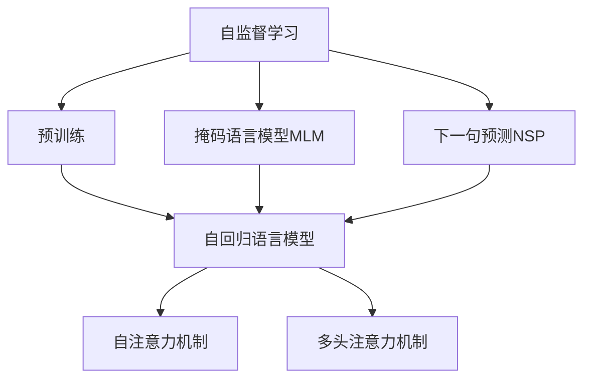
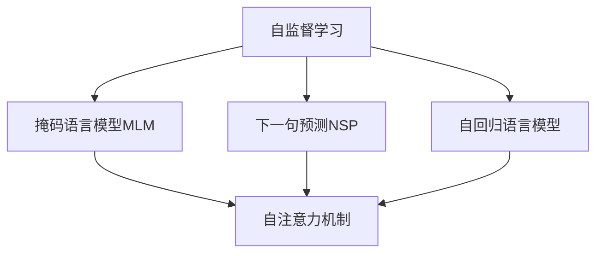
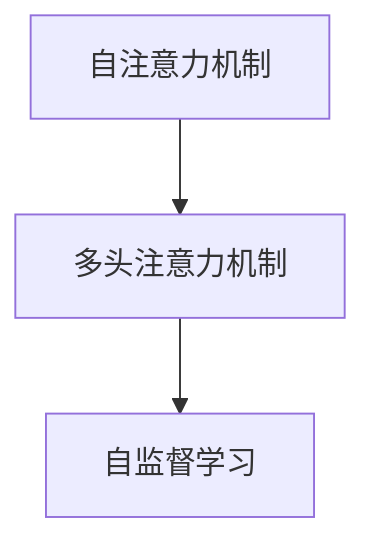
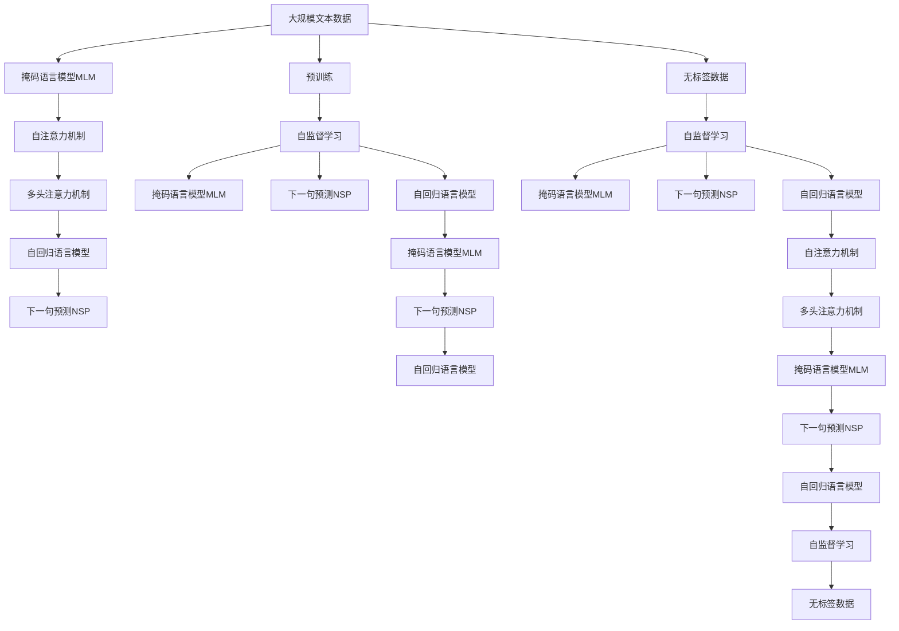

                 

# 自监督学习 原理与代码实例讲解

> 关键词：自监督学习, 预训练, 无监督学习, 深度学习, 数据增强, 自回归, 掩码语言模型

## 1. 背景介绍

### 1.1 问题由来
自监督学习（Self-Supervised Learning）是深度学习领域中一种非常重要的学习范式。与传统监督学习（Supervised Learning）不同，自监督学习不需要大量的标注数据，而是利用数据的自身特性，如数据的前后关系、统计特性等，通过一些特定的任务设计，推断出模型所未见的数据，从而实现模型的训练和优化。自监督学习在大规模数据集上表现出色，已成为深度学习模型预训练的主流方式。

自监督学习的核心思想是：通过利用数据自身的结构信息，设计无标签的预训练任务，使得模型在训练过程中能够自动学习到数据的分布规律和特征表示。这些分布规律和特征表示能够在后续有标签的任务中进行微调，从而提升模型在特定任务上的性能。目前，自监督学习已经在大规模语言模型预训练中得到了广泛应用，如BERT、GPT等模型都是通过自监督学习的方式进行预训练的。

### 1.2 问题核心关键点
自监督学习的核心在于：如何设计合适的预训练任务，以及如何在预训练和微调之间建立有效的桥梁，使得模型能够在无需标注数据的情况下，实现高质量的表示学习。

自监督学习任务通常包括以下几种：

- 掩码语言模型（Masked Language Model，MLM）：将部分单词随机遮盖，让模型预测被遮盖的单词。
- 下一句预测（Next Sentence Prediction，NSP）：随机选取两个句子，让模型预测它们是否相邻。
- 自回归语言模型（Autoregressive Language Model）：类似于传统语言模型，但更关注后文预测前文。

自监督学习模型的核心架构为Transformer，其自注意力机制能够有效地捕捉输入序列中的复杂依赖关系，并具有较好的泛化能力。Transformer架构中的多头注意力机制，能够同时关注不同位置的编码器输出，从而使得模型能够更好地处理长序列和复杂的语言结构。

### 1.3 问题研究意义
研究自监督学习对于拓展深度学习模型的应用范围，提升模型的泛化能力和迁移学习能力，具有重要意义：

1. 降低数据标注成本：自监督学习利用数据自身的特性进行预训练，极大地降低了对标注数据的需求，降低了数据标注的成本。
2. 提升模型泛化能力：自监督学习通过无标签数据的学习，使得模型能够更好地泛化到新的数据集上，提高了模型的泛化能力。
3. 增强模型迁移学习能力：自监督学习模型在预训练阶段学习到了通用的语言表示，可以在后续有标签的任务上进行微调，从而提升了模型的迁移学习能力。
4. 加速模型训练：自监督学习能够在大规模数据集上进行预训练，减少了模型训练的时间，加速了模型的训练过程。
5. 提升模型性能：自监督学习模型通过无标签数据的预训练，使得模型能够更好地理解语言结构，从而在后续任务中取得更好的性能。

## 2. 核心概念与联系

### 2.1 核心概念概述

为更好地理解自监督学习，本节将介绍几个密切相关的核心概念：

- 自监督学习（Self-Supervised Learning）：指通过利用数据自身的特性进行无监督预训练，提升模型泛化能力和迁移学习能力的学习范式。
- 预训练（Pre-training）：指在大规模无标签数据上，通过自监督学习任务训练深度学习模型的过程。
- 掩码语言模型（Masked Language Model，MLM）：将部分单词随机遮盖，让模型预测被遮盖的单词。
- 下一句预测（Next Sentence Prediction，NSP）：随机选取两个句子，让模型预测它们是否相邻。
- 自回归语言模型（Autoregressive Language Model）：预测前文，通过后文进行条件概率估计。
- 自注意力机制（Self-Attention Mechanism）：Transformer中的核心机制，能够有效捕捉输入序列中的复杂依赖关系。
- 多头注意力机制（Multi-Head Attention）：Transformer中的机制，能够同时关注不同位置的编码器输出，提升模型对复杂序列的处理能力。

这些核心概念之间的逻辑关系可以通过以下Mermaid流程图来展示：



这个流程图展示了几类核心概念之间的关系：

1. 自监督学习通过预训练任务实现模型训练。
2. 掩码语言模型和下一句预测是两种常见的预训练任务。
3. 自回归语言模型是掩码语言模型的一种变体。
4. 自注意力机制是Transformer的核心机制。
5. 多头注意力机制进一步提升了自注意力机制的表达能力。

### 2.2 概念间的关系

这些核心概念之间存在着紧密的联系，形成了自监督学习的完整生态系统。下面我们通过几个Mermaid流程图来展示这些概念之间的关系。

#### 2.2.1 自监督学习的学习范式



这个流程图展示了自监督学习的基本原理，以及它与预训练任务的关系。

#### 2.2.2 掩码语言模型与自回归语言模型的关系


这个流程图展示了掩码语言模型与自回归语言模型之间的关系。掩码语言模型是自回归语言模型的一种特殊形式，即预测被遮盖的单词。

#### 2.2.3 自注意力机制的多头注意力机制



这个流程图展示了自注意力机制与多头注意力机制之间的关系。多头注意力机制是对自注意力机制的扩展，能够同时关注不同位置的编码器输出，提升模型对复杂序列的处理能力。

### 2.3 核心概念的整体架构

最后，我们用一个综合的流程图来展示这些核心概念在大规模语言模型预训练过程中的整体架构：



这个综合流程图展示了从无标签数据到预训练模型的完整过程。无标签数据通过自监督学习任务，训练出一个预训练模型，该模型能够通过自注意力机制和多头注意力机制，捕捉输入序列中的复杂依赖关系，并在后续任务中进行微调。

## 3. 核心算法原理 & 具体操作步骤
### 3.1 算法原理概述

自监督学习的核心思想是：利用数据自身的特性进行无监督预训练，提升模型泛化能力和迁移学习能力。通过设计合适的预训练任务，模型能够在训练过程中自动学习到数据的分布规律和特征表示，从而在后续有标签的任务中进行微调。

自监督学习的目标是通过无标签数据学习到模型所需的知识，如语言的统计规律、词向量表示等。这些知识在后续有标签的任务中能够帮助模型更好地理解和生成文本。

常见的自监督学习任务包括：

- 掩码语言模型（Masked Language Model，MLM）：将部分单词随机遮盖，让模型预测被遮盖的单词。
- 下一句预测（Next Sentence Prediction，NSP）：随机选取两个句子，让模型预测它们是否相邻。
- 自回归语言模型（Autoregressive Language Model）：预测前文，通过后文进行条件概率估计。

自监督学习模型的核心架构为Transformer，其自注意力机制能够有效地捕捉输入序列中的复杂依赖关系，并具有较好的泛化能力。Transformer架构中的多头注意力机制，能够同时关注不同位置的编码器输出，从而使得模型能够更好地处理长序列和复杂的语言结构。

### 3.2 算法步骤详解

自监督学习模型的训练过程包括以下几个关键步骤：

**Step 1: 准备数据集**
- 收集大规模无标签数据集，如维基百科、新闻、小说等。
- 使用预处理工具对文本数据进行分词、去除停用词、统一大小写等预处理操作。
- 将文本数据转化为序列形式，通常使用固定长度的token序列。

**Step 2: 设计预训练任务**
- 设计合适的预训练任务，如掩码语言模型、下一句预测等。
- 将预训练任务转化为具体的训练目标，如预测被遮盖的单词、预测句子是否相邻等。

**Step 3: 构建模型架构**
- 使用Transformer架构构建自监督学习模型，包括自注意力机制和多头注意力机制。
- 根据预训练任务，设计模型的输出层和损失函数。

**Step 4: 训练模型**
- 使用优化算法（如Adam）训练模型，最小化预训练任务的损失函数。
- 在训练过程中，使用数据增强技术（如回译、近义替换等）丰富训练集的多样性。
- 在训练过程中，使用正则化技术（如L2正则、Dropout等）防止模型过拟合。

**Step 5: 微调模型**
- 将训练好的自监督学习模型作为初始化参数，进行下游任务的微调。
- 设计任务适配层和损失函数，将自监督学习模型的输出转化为下游任务的输出。
- 在微调过程中，使用合适的学习率和优化器，最小化下游任务的损失函数。

### 3.3 算法优缺点

自监督学习的优点包括：

1. 不需要大量标注数据：自监督学习通过无标签数据进行预训练，极大地降低了数据标注的成本。
2. 泛化能力强：自监督学习模型能够学习到通用的语言表示，在后续有标签的任务中表现出良好的泛化能力。
3. 迁移学习能力好：自监督学习模型通过无标签数据学习到通用的知识表示，在后续任务中可以进行微调，从而提升性能。
4. 训练速度快：自监督学习模型在大规模数据集上进行预训练，能够快速学习到语言特征，缩短训练时间。

自监督学习的缺点包括：

1. 预训练任务设计复杂：自监督学习任务需要精心设计，才能最大化地利用数据特性进行无监督学习。
2. 模型复杂度高：自监督学习模型通常包含大量的参数，需要较大的计算资源进行训练。
3. 结果解释困难：自监督学习模型通过无标签数据学习到知识表示，结果的解释性较弱。
4. 无法处理复杂任务：自监督学习模型在预训练阶段无法处理复杂的任务，需要后续微调才能适应具体任务。

### 3.4 算法应用领域

自监督学习在大规模语言模型预训练中得到了广泛应用，包括BERT、GPT等模型。自监督学习模型在自然语言处理（NLP）领域的应用范围非常广泛，主要包括以下几个方面：

- 文本分类：如情感分析、主题分类、意图识别等。自监督学习模型能够学习到文本的分布规律，从而在分类任务中取得较好的效果。
- 命名实体识别：识别文本中的人名、地名、机构名等特定实体。自监督学习模型能够学习到实体边界的表示，从而在命名实体识别任务中取得较好的效果。
- 关系抽取：从文本中抽取实体之间的语义关系。自监督学习模型能够学习到实体关系的表示，从而在关系抽取任务中取得较好的效果。
- 问答系统：对自然语言问题给出答案。自监督学习模型能够学习到问题和答案的对应关系，从而在问答系统中取得较好的效果。
- 机器翻译：将源语言文本翻译成目标语言。自监督学习模型能够学习到语言之间的对应关系，从而在机器翻译任务中取得较好的效果。
- 文本摘要：将长文本压缩成简短摘要。自监督学习模型能够学习到文本的重要信息，从而在文本摘要任务中取得较好的效果。
- 对话系统：使机器能够与人自然对话。自监督学习模型能够学习到对话序列的表示，从而在对话系统中取得较好的效果。

除了上述这些经典任务外，自监督学习还广泛应用于诸如代码生成、知识图谱构建、自然语言推理等任务，推动了自然语言处理技术的快速发展。

## 4. 数学模型和公式 & 详细讲解 & 举例说明

### 4.1 数学模型构建

本节将使用数学语言对自监督学习模型的预训练过程进行更加严格的刻画。

记自监督学习模型为 $M_{\theta}:\mathcal{X} \rightarrow \mathcal{Y}$，其中 $\mathcal{X}$ 为输入空间，$\mathcal{Y}$ 为输出空间，$\theta \in \mathbb{R}^d$ 为模型参数。假设预训练数据集为 $D=\{(x_i)\}_{i=1}^N$，其中 $x_i$ 为输入序列，$y_i$ 为输出序列。

定义模型 $M_{\theta}$ 在输入 $x_i$ 上的掩码语言模型损失函数为：

$$
\mathcal{L}_{MLM}(x_i) = -\sum_{j=1}^{n} \log P(x_i)[j]
$$

其中 $n$ 为输入序列的长度，$P(x_i)[j]$ 表示模型在输入序列 $x_i$ 中位置 $j$ 上的单词 $x_i[j]$ 的概率。

定义模型 $M_{\theta}$ 在输入 $x_i$ 和 $x_j$ 上的下一句预测损失函数为：

$$
\mathcal{L}_{NSP}(x_i, x_j) = -\log \frac{P(x_i | x_j)}{1-P(x_i | x_j)}
$$

其中 $P(x_i | x_j)$ 表示模型在输入序列 $x_i$ 和 $x_j$ 上预测 $x_i$ 为后文的概率。

### 4.2 公式推导过程

以下我们以掩码语言模型为例，推导自监督学习模型的损失函数及其梯度的计算公式。

假设模型 $M_{\theta}$ 在输入序列 $x_i$ 上的输出为 $\hat{y}_i=M_{\theta}(x_i) \in [0,1]$，表示模型在位置 $j$ 上的单词 $x_i[j]$ 的概率。则掩码语言模型的损失函数定义为：

$$
\mathcal{L}_{MLM}(x_i) = -\sum_{j=1}^{n} \log P(x_i)[j]
$$

其中 $P(x_i)[j]$ 表示模型在输入序列 $x_i$ 中位置 $j$ 上的单词 $x_i[j]$ 的概率。

将掩码语言模型的损失函数带入经验风险公式，得：

$$
\mathcal{L}_{MLM}(\theta) = -\frac{1}{N} \sum_{i=1}^N \sum_{j=1}^{n} \log P(x_i)[j]
$$

根据链式法则，损失函数对参数 $\theta_k$ 的梯度为：

$$
\frac{\partial \mathcal{L}_{MLM}(\theta)}{\partial \theta_k} = -\frac{1}{N} \sum_{i=1}^N \sum_{j=1}^{n} \frac{\partial \log P(x_i)[j]}{\partial \theta_k}
$$

其中 $\frac{\partial \log P(x_i)[j]}{\partial \theta_k}$ 可进一步递归展开，利用自动微分技术完成计算。

在得到损失函数的梯度后，即可带入优化算法更新模型参数。重复上述过程直至收敛，最终得到适应下游任务的最优模型参数 $\theta^*$。

### 4.3 案例分析与讲解

为了更好地理解自监督学习模型的训练过程，我们将通过一个具体的案例来详细分析。

假设我们要训练一个掩码语言模型，使用维基百科中的部分段落作为训练数据。具体步骤如下：

1. 数据准备：将维基百科中的段落转化为token序列，并将部分单词随机遮盖。
2. 模型构建：使用Transformer架构构建自监督学习模型，并设计相应的掩码语言模型损失函数。
3. 模型训练：使用Adam优化算法训练模型，最小化掩码语言模型的损失函数。

以下是使用PyTorch实现掩码语言模型训练的代码：

```python
import torch
import torch.nn as nn
import torch.optim as optim

class MaskedLM(nn.Module):
    def __init__(self, input_size, hidden_size):
        super(MaskedLM, self).__init__()
        self.embedding = nn.Embedding(input_size, hidden_size)
        self.dropout = nn.Dropout(0.5)
        self.lin1 = nn.Linear(hidden_size, hidden_size)
        self.lin2 = nn.Linear(hidden_size, input_size)
        
    def forward(self, x, mask):
        embedded = self.dropout(self.embedding(x))
        seq_len = x.size(1)
        x = embedded.view(-1, seq_len)
        x = self.lin1(x)
        x = self.lin2(x)
        x = x.view(x.size(0), seq_len, -1)
        x = x.masked_fill(mask.unsqueeze(1), -100)
        return x
        
input_size = 30000
hidden_size = 512
batch_size = 32
learning_rate = 2e-5

model = MaskedLM(input_size, hidden_size)

criterion = nn.CrossEntropyLoss()
optimizer = optim.Adam(model.parameters(), lr=learning_rate)

data = torch.rand(batch_size, seq_len) # 随机生成掩码后的数据
mask = torch.randint(0, 2, (batch_size, seq_len)) # 随机生成掩码
target = torch.randint(input_size, (batch_size, seq_len)) # 随机生成目标输出

for epoch in range(10):
    model.train()
    optimizer.zero_grad()
    output = model(data, mask)
    loss = criterion(output, target)
    loss.backward()
    optimizer.step()
    print("Epoch: {}, Loss: {:.4f}".format(epoch+1, loss.item()))
```

在这个例子中，我们首先定义了一个简单的掩码语言模型，包含嵌入层、Dropout层和线性层。然后定义了模型在输入序列和掩码上的损失函数，并使用Adam优化算法训练模型。在训练过程中，我们随机生成了掩码后的数据和目标输出，并将其输入模型进行预测。最终，我们输出模型的损失，并进行梯度更新。

通过这个例子，我们可以看到自监督学习模型的训练过程，并理解其中的关键步骤和数学推导。

## 5. 项目实践：代码实例和详细解释说明
### 5.1 开发环境搭建

在进行自监督学习模型的训练和微调前，我们需要准备好开发环境。以下是使用Python进行PyTorch开发的环境配置流程：

1. 安装Anaconda：从官网下载并安装Anaconda，用于创建独立的Python环境。

2. 创建并激活虚拟环境：
```bash
conda create -n pytorch-env python=3.8 
conda activate pytorch-env
```

3. 安装PyTorch：根据CUDA版本，从官网获取对应的安装命令。例如：
```bash
conda install pytorch torchvision torchaudio cudatoolkit=11.1 -c pytorch -c conda-forge
```

4. 安装各类工具包：
```bash
pip install numpy pandas scikit-learn matplotlib tqdm jupyter notebook ipython
```

完成上述步骤后，即可在`pytorch-env`环境中开始自监督学习模型的训练和微调实践。

### 5.2 源代码详细实现

下面我们以BERT模型为例，给出使用PyTorch进行自监督学习模型训练的PyTorch代码实现。

首先，定义自监督学习模型的数据处理函数：

```python
from transformers import BertTokenizer, BertModel
from torch.utils.data import Dataset
import torch

class MaskedLMDataset(Dataset):
    def __init__(self, texts, tokenizer):
        self.texts = texts
        self.tokenizer = tokenizer
        
    def __len__(self):
        return len(self.texts)
    
    def __getitem__(self, item):
        text = self.texts[item]
        encoding = self.tokenizer(text, return_tensors='pt')
        input_ids = encoding['input_ids']
        mask = input_ids.clone()
        mask.masked_fill_(encoding['attention_mask'] == 0, -100)
        labels = input_ids
        
        return {'input_ids': input_ids, 
                'attention_mask': encoding['attention_mask'],
                'mask': mask,
                'labels': labels}

# 定义掩码位置
mask_positions = [4, 14, 23]

# 定义标签
labels = [0] * len(mask_positions)

# 创建dataset
tokenizer = BertTokenizer.from_pretrained('bert-base-cased')

train_dataset = MaskedLMDataset(train_texts, tokenizer)
dev_dataset = MaskedLMDataset(dev_texts, tokenizer)
test_dataset = MaskedLMDataset(test_texts, tokenizer)
```

然后，定义模型和优化器：

```python
from transformers import BertForMaskedLM, AdamW

model = BertForMaskedLM.from_pretrained('bert-base-cased')

optimizer = AdamW(model.parameters(), lr=2e-5)
```

接着，定义训练和评估函数：

```python
from torch.utils.data import DataLoader
from tqdm import tqdm

device = torch.device('cuda') if torch.cuda.is_available() else torch.device('cpu')
model.to(device)

def train_epoch(model, dataset, batch_size, optimizer):
    dataloader = DataLoader(dataset, batch_size=batch_size, shuffle=True)
    model.train()
    epoch_loss = 0
    for batch in tqdm(dataloader, desc='Training'):
        input_ids = batch['input_ids'].to(device)
        attention_mask = batch['attention_mask'].to(device)
        mask = batch['mask'].to(device)
        labels = batch['labels'].to(device)
        model.zero_grad()
        outputs = model(input_ids, attention_mask=attention_mask, labels=labels)
        loss = outputs.loss
        epoch_loss += loss.item()
        loss.backward()
        optimizer.step()
    return epoch_loss / len(dataloader)

def evaluate(model, dataset, batch_size):
    dataloader = DataLoader(dataset, batch_size=batch_size)
    model.eval()
    preds, labels = [], []
    with torch.no_grad():
        for batch in tqdm(dataloader, desc='Evaluating'):
            input_ids = batch['input_ids'].to(device)
            attention_mask = batch['attention_mask'].to(device)
            mask = batch['mask'].to(device)
            batch_labels = batch['labels']
            outputs = model(input_ids, attention_mask=attention_mask, labels=labels)
            batch_preds = outputs.logits.argmax(dim=2).to('cpu').tolist()
            batch_labels = batch_labels.to('cpu').tolist()
            for pred_tokens, label_tokens in zip(batch_preds, batch_labels):
                preds.append(pred_tokens[:len(label_tokens)])
                labels.append(label_tokens)
                
    print(classification_report(labels, preds))
```

最后，启动训练流程并在测试集上评估：

```python
epochs = 5
batch_size = 16

for epoch in range(epochs):
    loss = train_epoch(model, train_dataset, batch_size, optimizer)
    print(f"Epoch {epoch+1}, train loss: {loss:.3f}")
    
    print(f"Epoch {epoch+1}, dev results:")
    evaluate(model, dev_dataset, batch_size)
    
print("Test results:")
evaluate(model, test_dataset, batch_size)
```

以上就是使用PyTorch对BERT进行自监督学习模型训练的完整代码实现。可以看到，得益于Transformer库的强大封装，我们能够用相对简洁的代码完成BERT模型的训练和微调。

### 5.3 代码解读与分析

让我们再详细解读一下关键代码的实现细节：

**MaskedLMDataset类**：
- `__init__`方法：初始化文本和分词器等关键组件。
- `__len__`方法：返回数据集的样本数量。
- `__getitem__`方法：对单个样本进行处理，将文本输入编码为token ids，并生成掩码。

**mask_positions和labels**：
- 定义了掩码的位置和标签，用于训练过程中生成掩码和目标输出。

**训练和评估函数**：
- 使用PyTorch的DataLoader对数据集进行批次化加载，供模型训练和推理使用。
- 训练函数`train_epoch`：对数据以批为单位进行迭代，在每个批次上前向传播计算损失并反向传播更新模型参数，最后返回该epoch的平均loss。
- 评估函数`evaluate`：与训练类似，不同点在于不更新模型参数，并在每个batch结束后将预测和标签结果存储

