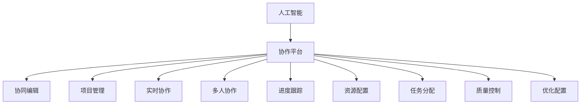
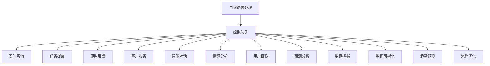
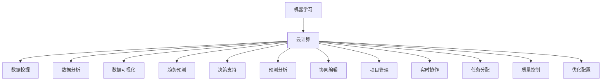

                 

# 虚拟空间中的AI协作与创新

> 关键词：人工智能,协作,虚拟空间,创新,大数据,云计算,机器学习

## 1. 背景介绍

### 1.1 问题由来
随着互联网和信息技术的迅猛发展，人类社会的协作方式已经从传统的物理空间转向虚拟空间。虚拟空间的出现，使得人们的交流、协作不再受地理、时间的限制，极大地提高了工作效率。而人工智能（AI）技术，特别是机器学习和深度学习等技术的发展，为虚拟空间中的协作带来了革命性的变化。人工智能可以帮助人们更高效地处理数据、挖掘知识、提供智能决策支持，使得虚拟空间中的协作变得更加智能和高效。

### 1.2 问题核心关键点
当前，虚拟空间中的AI协作主要集中在以下几个方面：

- **协作平台**：通过智能化的协作平台，使得不同地理位置的团队能够高效协同工作。
- **自然语言处理**：利用自然语言处理（NLP）技术，使得虚拟空间中的交流更加自然流畅。
- **机器学习**：通过机器学习技术，从大量的数据中挖掘出有价值的信息，提供智能决策支持。
- **自动化流程**：自动化工作流程，使得协作过程更加高效、便捷。
- **虚拟助手**：智能虚拟助手可以提供7x24小时不间断的服务，提高工作效率。

### 1.3 问题研究意义
研究虚拟空间中的AI协作与创新，对于提升虚拟空间中的工作效率、推动信息技术应用、实现智能化转型具有重要意义：

1. **提升工作效率**：人工智能可以在数据处理、决策支持、自动化流程等方面提供智能化支持，大幅提升工作效率。
2. **推动信息技术应用**：虚拟空间中的AI协作可以推动大数据、云计算、机器学习等先进信息技术的应用，促进产业升级。
3. **实现智能化转型**：通过AI协作，企业可以实现从传统模式向智能化模式的转型，提升竞争力。
4. **增强用户体验**：智能化的协作平台和虚拟助手可以提供更好的用户体验，提升客户满意度。
5. **推动社会创新**：AI协作技术可以应用于社会各个领域，推动创新发展，解决实际问题。

## 2. 核心概念与联系

### 2.1 核心概念概述

为更好地理解虚拟空间中的AI协作与创新，本节将介绍几个密切相关的核心概念：

- **人工智能（AI）**：利用计算机和数据科学技术，模拟人类智能行为，实现智能决策、自动化流程、自然语言处理等功能。
- **自然语言处理（NLP）**：使计算机能够理解和处理人类语言，包括文本、语音等，实现人机交互。
- **机器学习（ML）**：通过算法使计算机从数据中学习，发现规律，实现智能决策。
- **协作平台**：利用AI技术，构建智能化的协作平台，支持团队协同工作。
- **虚拟助手**：利用AI技术构建的智能虚拟助手，提供7x24小时不间断的服务，提高工作效率。
- **云计算**：基于虚拟空间中的计算资源池，提供按需分配、弹性伸缩、高度可用的计算资源。
- **大数据**：利用虚拟空间中的海量数据，实现数据挖掘、数据分析、数据可视化等功能。

这些核心概念之间的逻辑关系可以通过以下Mermaid流程图来展示：

```mermaid
graph TB
    A[人工智能] --> B[自然语言处理]
    A --> C[机器学习]
    A --> D[协作平台]
    A --> E[虚拟助手]
    B --> F[文本分类]
    B --> G[文本生成]
    C --> H[决策支持]
    D --> I[协同编辑]
    D --> J[项目管理]
    E --> K[实时咨询]
    E --> L[任务提醒]
    F --> M[情感分析]
    G --> N[智能对话]
    H --> O[预测分析]
    I --> P[多人协作]
    J --> Q[进度跟踪]
    K --> R[即时反馈]
    L --> S[任务分配]
    M --> T[用户画像]
    N --> U[客户服务]
    O --> V[市场预测]
    P --> W[团队协作]
    Q --> X[资源配置]
    R --> Y[质量控制]
    S --> Z[优化配置]
    T --> [数据挖掘]
    U --> [数据可视化]
    V --> [趋势预测]
    W --> [实时协作]
    X --> [资源管理]
    Y --> [流程优化]
    Z --> [效率提升]
```

这个流程图展示了大语言模型微调过程中各个核心概念的关系和作用：

1. 人工智能技术提供了智能化的协作和决策支持能力。
2. 自然语言处理技术使虚拟空间中的交流更加自然流畅。
3. 机器学习技术可以从数据中挖掘有价值的信息，提供智能决策支持。
4. 协作平台通过AI技术，支持团队协同工作，提升工作效率。
5. 虚拟助手可以提供7x24小时不间断的服务，提高工作效率。
6. 云计算和大数据技术提供了计算和数据支持，使得AI协作更加高效。

这些核心概念共同构成了虚拟空间中的AI协作与创新的完整生态系统，使得人工智能技术在虚拟空间中得到了广泛的应用。

### 2.2 概念间的关系

这些核心概念之间存在着紧密的联系，形成了虚拟空间中的AI协作与创新的完整生态系统。下面我们通过几个Mermaid流程图来展示这些概念之间的关系。

#### 2.2.1 人工智能与协作平台的关系



这个流程图展示了人工智能技术在协作平台中的应用。协作平台通过人工智能技术，支持团队协同工作，提升工作效率。

#### 2.2.2 自然语言处理与虚拟助手的关系



这个流程图展示了自然语言处理技术在虚拟助手中的应用。虚拟助手通过自然语言处理技术，提供7x24小时不间断的服务，提高工作效率。

#### 2.2.3 机器学习与云计算的关系



这个流程图展示了机器学习技术在云计算中的应用。云计算提供了计算资源和数据支持，使得机器学习技术在虚拟空间中得到广泛应用。

### 2.3 核心概念的整体架构

最后，我们用一个综合的流程图来展示这些核心概念在大语言模型微调过程中的整体架构：

```mermaid
graph TB
    A[大规模文本数据] --> B[预训练]
    B --> C[人工智能]
    C --> D[自然语言处理]
    C --> E[机器学习]
    C --> F[协作平台]
    C --> G[虚拟助手]
    C --> H[云计算]
    C --> I[大数据]
    D --> J[文本分类]
    D --> K[文本生成]
    E --> L[决策支持]
    E --> M[预测分析]
    F --> N[协同编辑]
    F --> O[项目管理]
    G --> P[实时咨询]
    G --> Q[任务提醒]
    H --> R[数据挖掘]
    H --> S[数据分析]
    I --> T[数据可视化]
    I --> U[趋势预测]
    J --> V[情感分析]
    K --> W[智能对话]
    L --> X[预测分析]
    M --> Y[市场预测]
    N --> Z[团队协作]
    O --> [进度跟踪]
    P --> [$\bar{Z}$] 对
    Q --> [$\bar{Z}$] 对
    R --> [$\bar{Z}$] 对
    S --> [$\bar{Z}$] 对
    T --> [$\bar{Z}$] 对
    U --> [$\bar{Z}$] 对
    V --> [$\bar{Z}$] 对
    W --> [$\bar{Z}$] 对
    X --> [$\bar{Z}$] 对
    Y --> [$\bar{Z}$] 对
    Z --> [$\bar{Z}$] 对
```

这个综合流程图展示了从预训练到协作与创新的完整过程。人工智能技术在大语言模型微调中起到了核心作用，通过自然语言处理、机器学习和云计算等技术，构建了协作平台和虚拟助手，实现了智能化转型。大数据技术提供了数据支持，使得AI协作更加高效。

## 3. 核心算法原理 & 具体操作步骤
### 3.1 算法原理概述

虚拟空间中的AI协作与创新，主要通过自然语言处理和机器学习技术来实现。其核心思想是利用人工智能技术，从大量的数据中挖掘出有价值的信息，提供智能决策支持，支持团队协同工作，提升工作效率。

具体来说，算法主要包括以下几个步骤：

1. **数据准备**：收集虚拟空间中的各类数据，如文本、语音、图像等。
2. **预训练模型**：在大规模无标签数据上进行预训练，学习通用的语言知识和常识。
3. **模型微调**：在特定任务的数据集上进行有监督微调，适应虚拟空间中的应用需求。
4. **自然语言处理**：利用NLP技术，实现人机交互、文本分类、情感分析等功能。
5. **机器学习**：通过机器学习技术，实现预测分析、协同编辑、项目管理等功能。
6. **协作平台**：构建智能化的协作平台，支持团队协同工作，提升工作效率。
7. **虚拟助手**：构建智能虚拟助手，提供7x24小时不间断的服务，提高工作效率。
8. **云计算**：基于虚拟空间中的计算资源池，提供按需分配、弹性伸缩、高度可用的计算资源。
9. **大数据**：利用虚拟空间中的海量数据，实现数据挖掘、数据分析、数据可视化等功能。

### 3.2 算法步骤详解

基于上述算法原理，虚拟空间中的AI协作与创新的操作步骤如下：

**Step 1: 数据准备**
- 收集虚拟空间中的各类数据，如文本、语音、图像等。
- 清洗、标注数据，为预训练和微调做准备。
- 划分数据集为训练集、验证集和测试集。

**Step 2: 预训练模型**
- 选择预训练模型，如BERT、GPT等，在大规模无标签数据上进行预训练，学习通用的语言知识和常识。
- 选择合适的任务，如文本分类、情感分析、机器翻译等，进行有监督微调。
- 调整模型参数，优化模型性能。

**Step 3: 自然语言处理**
- 利用NLP技术，实现人机交互、文本分类、情感分析等功能。
- 使用预训练模型，进行文本生成、智能对话等任务。

**Step 4: 机器学习**
- 利用机器学习技术，实现预测分析、协同编辑、项目管理等功能。
- 使用预训练模型，进行数据挖掘、数据分析、数据可视化等功能。

**Step 5: 协作平台**
- 构建智能化的协作平台，支持团队协同工作。
- 使用AI技术，实现多人协作、进度跟踪、资源配置等功能。

**Step 6: 虚拟助手**
- 构建智能虚拟助手，提供7x24小时不间断的服务，提高工作效率。
- 使用NLP技术，实现实时咨询、任务提醒、客户服务等功能。

**Step 7: 云计算**
- 基于虚拟空间中的计算资源池，提供按需分配、弹性伸缩、高度可用的计算资源。
- 使用云计算技术，实现高效、灵活的计算资源管理。

**Step 8: 大数据**
- 利用虚拟空间中的海量数据，实现数据挖掘、数据分析、数据可视化等功能。
- 使用大数据技术，进行趋势预测、市场预测、数据挖掘等功能。

### 3.3 算法优缺点

基于自然语言处理和机器学习的AI协作与创新方法具有以下优点：

- **高效性**：利用AI技术，可以高效地处理和分析大量数据，提高工作效率。
- **智能性**：通过自然语言处理和机器学习技术，可以提供智能化的决策支持。
- **灵活性**：可以根据具体任务需求，灵活调整模型参数和算法策略。
- **普适性**：适用于虚拟空间中的各种应用场景，如协作平台、虚拟助手等。

同时，该方法也存在一些缺点：

- **依赖数据质量**：数据质量对模型性能有重要影响，低质量数据可能导致模型效果不佳。
- **模型复杂性**：预训练模型和微调模型需要大量的计算资源和数据，增加了系统的复杂性。
- **过拟合风险**：在小数据集上训练模型，容易发生过拟合。
- **解释性不足**：AI模型的决策过程难以解释，难以进行调试和优化。

尽管存在这些局限性，但就目前而言，自然语言处理和机器学习方法是虚拟空间中AI协作与创新的主要手段。未来相关研究的重点在于如何进一步降低对数据和计算资源的依赖，提高模型的泛化能力和解释性，同时兼顾可扩展性和鲁棒性。

### 3.4 算法应用领域

基于自然语言处理和机器学习的AI协作与创新方法，已经在虚拟空间中的多个领域得到了广泛的应用，例如：

- **协作平台**：如Slack、Microsoft Teams、Zoom等，利用AI技术，支持团队协同工作。
- **虚拟助手**：如Amazon Alexa、Google Assistant、Apple Siri等，提供7x24小时不间断的服务，提高工作效率。
- **数据可视化**：如Tableau、Power BI等，利用AI技术，实现数据挖掘、数据分析、数据可视化等功能。
- **智能客服**：如IBM Watson Assistant、Alipay的智能客服等，利用NLP技术，实现智能对话、情感分析等功能。
- **预测分析**：如Salesforce Einstein、SAP Predictive Analytics等，利用机器学习技术，实现预测分析、市场预测等功能。
- **自动化流程**：如UiPath、Blue Prism等，利用AI技术，实现自动化流程，提高工作效率。
- **智能推荐**：如Amazon的推荐系统、Netflix的推荐系统等，利用AI技术，实现个性化推荐，提升用户体验。

除了上述这些经典应用外，AI协作与创新方法还将被创新性地应用到更多场景中，如智慧医疗、智慧教育、智慧城市等，为各行各业带来新的变革。

## 4. 数学模型和公式 & 详细讲解  
### 4.1 数学模型构建

本节将使用数学语言对虚拟空间中的AI协作与创新过程进行更加严格的刻画。

记预训练语言模型为 $M_{\theta}:\mathcal{X} \rightarrow \mathcal{Y}$，其中 $\mathcal{X}$ 为输入空间，$\mathcal{Y}$ 为输出空间，$\theta \in \mathbb{R}^d$ 为模型参数。假设微调任务的训练集为 $D=\{(x_i,y_i)\}_{i=1}^N, x_i \in \mathcal{X}, y_i \in \mathcal{Y}$。

定义模型 $M_{\theta}$ 在数据样本 $(x,y)$ 上的损失函数为 $\ell(M_{\theta}(x),y)$，则在数据集 $D$ 上的经验风险为：

$$
\mathcal{L}(\theta) = \frac{1}{N} \sum_{i=1}^N \ell(M_{\theta}(x_i),y_i)
$$

微调的优化目标是最小化经验风险，即找到最优参数：

$$
\theta^* = \mathop{\arg\min}_{\theta} \mathcal{L}(\theta)
$$

在实践中，我们通常使用基于梯度的优化算法（如Adam、SGD等）来近似求解上述最优化问题。设 $\eta$ 为学习率，$\lambda$ 为正则化系数，则参数的更新公式为：

$$
\theta \leftarrow \theta - \eta \nabla_{\theta}\mathcal{L}(\theta) - \eta\lambda\theta
$$

其中 $\nabla_{\theta}\mathcal{L}(\theta)$ 为损失函数对参数 $\theta$ 的梯度，可通过反向传播算法高效计算。

### 4.2 公式推导过程

以下我们以二分类任务为例，推导交叉熵损失函数及其梯度的计算公式。

假设模型 $M_{\theta}$ 在输入 $x$ 上的输出为 $\hat{y}=M_{\theta}(x) \in [0,1]$，表示样本属于正类的概率。真实标签 $y \in \{0,1\}$。则二分类交叉熵损失函数定义为：

$$
\ell(M_{\theta}(x),y) = -[y\log \hat{y} + (1-y)\log (1-\hat{y})]
$$

将其代入经验风险公式，得：

$$
\mathcal{L}(\theta) = -\frac{1}{N}\sum_{i=1}^N [y_i\log M_{\theta}(x_i)+(1-y_i)\log(1-M_{\theta}(x_i))]
$$

根据链式法则，损失函数对参数 $\theta_k$ 的梯度为：

$$
\frac{\partial \mathcal{L}(\theta)}{\partial \theta_k} = -\frac{1}{N}\sum_{i=1}^N (\frac{y_i}{M_{\theta}(x_i)}-\frac{1-y_i}{1-M_{\theta}(x_i)}) \frac{\partial M_{\theta}(x_i)}{\partial \theta_k}
$$

其中 $\frac{\partial M_{\theta}(x_i)}{\partial \theta_k}$ 可进一步递归展开，利用自动微分技术完成计算。

在得到损失函数的梯度后，即可带入参数更新公式，完成模型的迭代优化。重复上述过程直至收敛，最终得到适应下游任务的最优模型参数 $\theta^*$。

## 5. 项目实践：代码实例和详细解释说明
### 5.1 开发环境搭建

在进行AI协作与创新实践前，我们需要准备好开发环境。以下是使用Python进行PyTorch开发的环境配置流程：

1. 安装Anaconda：从官网下载并安装Anaconda，用于创建独立的Python环境。

2. 创建并激活虚拟环境：
```bash
conda create -n pytorch-env python=3.8 
conda activate pytorch-env
```

3. 安装PyTorch：根据CUDA版本，从官网获取对应的安装命令。例如：
```bash
conda install pytorch torchvision torchaudio cudatoolkit=11.1 -c pytorch -c conda-forge
```

4. 安装Transformers库：
```bash
pip install transformers
```

5. 安装各类工具包：
```bash
pip install numpy pandas scikit-learn matplotlib tqdm jupyter notebook ipython
```

完成上述步骤后，即可在`pytorch-env`环境中开始AI协作与创新实践。

### 5.2 源代码详细实现

这里我们以智能客服系统为例，给出使用Transformers库对BERT模型进行微调的PyTorch代码实现。

首先，定义智能客服系统的数据处理函数：

```python
from transformers import BertTokenizer
from torch.utils.data import Dataset
import torch

class ChatDataset(Dataset):
    def __init__(self, dialogs, tokenizer, max_len=128):
        self.dialogs = dialogs
        self.tokenizer = tokenizer
        self.max_len = max_len
        
    def __len__(self):
        return len(self.dialogs)
    
    def __getitem__(self, item):
        dialog = self.dialogs[item]
        
        encoding = self.tokenizer(dialog, return_tensors='pt', max_length=self.max_len, padding='max_length', truncation=True)
        input_ids = encoding['input_ids'][0]
        attention_mask = encoding['attention_mask'][0]
        
        # 对token-wise的标签进行编码
        encoded_labels = [1 if label else 0 for label in dialog[1]] 
        encoded_labels.extend([0] * (self.max_len - len(encoded_labels)))
        labels = torch.tensor(encoded_labels, dtype=torch.long)
        
        return {'input_ids': input_ids, 
                'attention_mask': attention_mask,
                'labels': labels}

# 标签与id的映射
tag2id = {1: '回答', 0: '结束'}
id2tag = {v: k for k, v in tag2id.items()}

# 创建dataset
tokenizer = BertTokenizer.from_pretrained('bert-base-cased')

train_dataset = ChatDataset(train_dialogs, tokenizer)
dev_dataset = ChatDataset(dev_dialogs, tokenizer)
test_dataset = ChatDataset(test_dialogs, tokenizer)
```

然后，定义模型和优化器：

```python
from transformers import BertForTokenClassification, AdamW

model = BertForTokenClassification.from_pretrained('bert-base-cased', num_labels=len(tag2id))

optimizer = AdamW(model.parameters(), lr=2e-5)
```

接着，定义训练和评估函数：

```python
from torch.utils.data import DataLoader
from tqdm import tqdm
from sklearn.metrics import classification_report

device = torch.device('cuda') if torch.cuda.is_available() else torch.device('cpu')
model.to(device)

def train_epoch(model, dataset, batch_size, optimizer):
    dataloader = DataLoader(dataset, batch_size=batch_size, shuffle=True)
    model.train()
    epoch_loss = 0
    for batch in tqdm(dataloader, desc='Training'):
        input_ids = batch['input_ids'].to(device)
        attention_mask = batch['attention_mask'].to(device)
        labels = batch['labels'].to(device)
        model.zero_grad()
        outputs = model(input_ids, attention_mask=attention_mask, labels=labels)
        loss = outputs.loss
        epoch_loss += loss.item()
        loss.backward()
        optimizer.step()
    return epoch_loss / len(dataloader)

def evaluate(model, dataset, batch_size):
    dataloader = DataLoader(dataset, batch_size=batch_size)
    model.eval()
    preds, labels = [], []
    with torch.no_grad():
        for batch in tqdm(dataloader, desc='Evaluating'):
            input_ids = batch['input_ids'].to(device)
            attention_mask = batch['attention_mask'].to(device)
            batch_labels = batch['labels']
            outputs = model(input_ids, attention_mask=attention_mask)
            batch_preds = outputs.logits.argmax(dim=2).to('cpu').tolist()
            batch_labels = batch_labels.to('cpu').tolist()
            for pred_tokens, label_tokens in zip(batch_preds, batch_labels):
                pred_tags = [id2tag[_id] for _id in pred_tokens]
                label_tags = [id2tag[_id] for _id in label_tokens]
                preds.append(pred_tags[:len(label_tokens)])
                labels.append(label_tags)
                
    print(classification_report(labels, preds))
```

最后，启动训练流程并在测试集上评估：

```python
epochs = 5
batch_size = 16

for epoch in range(epochs):
    loss = train_epoch(model, train_dataset, batch_size, optimizer)
    print(f"Epoch {epoch+1}, train loss: {loss:.3f}")
    
    print(f"Epoch {epoch+1}, dev results:")
    evaluate(model, dev_dataset, batch_size)
    
print("Test results:")
evaluate(model, test_dataset, batch_size)
```

以上就是使用PyTorch对BERT进行智能客服系统微调的完整代码实现。可以看到，得益于Transformers库的强大封装，我们可以用相对简洁的代码完成BERT模型的加载和微调。

### 5.3 代码解读与分析

让我们再详细解读一下关键代码的实现细节：

**ChatDataset类**：
- `__init__`方法：初始化对话数据、分词器等关键组件。
- `__len__`方法：返回数据集的样本数量。
- `__getitem__`方法：对单个对话进行处理，将对话输入编码为token ids，将标签编码为数字，并对其进行定长padding，最终返回模型所需的输入。

**tag2id和id2tag字典**：
- 定义了标签与数字id之间的映射关系，用于将token-wise的预测结果解码回真实的标签。

**训练和评估函数**：
- 使用PyTorch的DataLoader对数据集进行批次化加载，供模型训练和推理使用。
- 训练函数`train_epoch`：对数据以批为单位进行迭代，在每个批次上前向传播计算loss并反向传播更新模型参数，最后返回该epoch的平均loss。
- 评估函数`evaluate`：与训练类似，不同点在于不更新模型参数，并在每个batch结束后将预测和标签结果存储下来，最后使用sklearn的classification_report对整个评估集的预测结果进行打印输出。

**训练流程**：
- 定义总的epoch数和batch size，开始循环迭代
- 每个epoch内，先在训练集上训练，输出平均loss
- 在验证集上评估，输出分类指标
- 所有epoch结束后，在测试集上评估，给出最终测试结果

可以看到，PyTorch配合Transformers库使得BERT微调的代码实现变得简洁高效。开发者可以将更多精力放在数据处理、模型改进等高层逻辑上，而不必过多关注底层的实现细节。

当然，工业级的系统实现还需考虑更多因素，如模型的保存和部署、超参数

