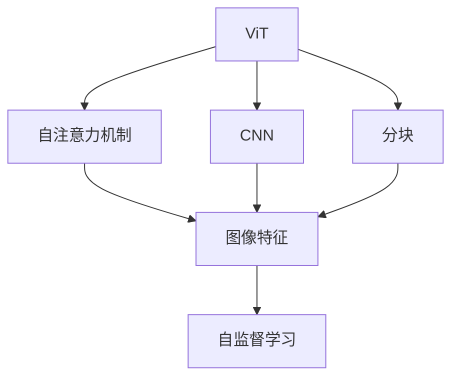
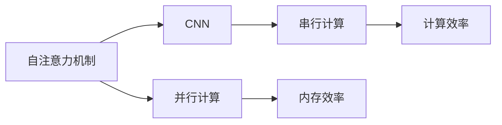
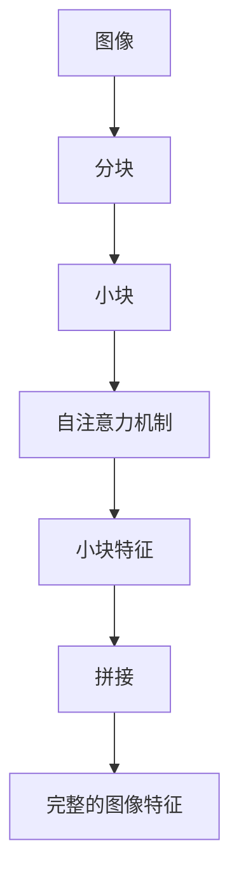
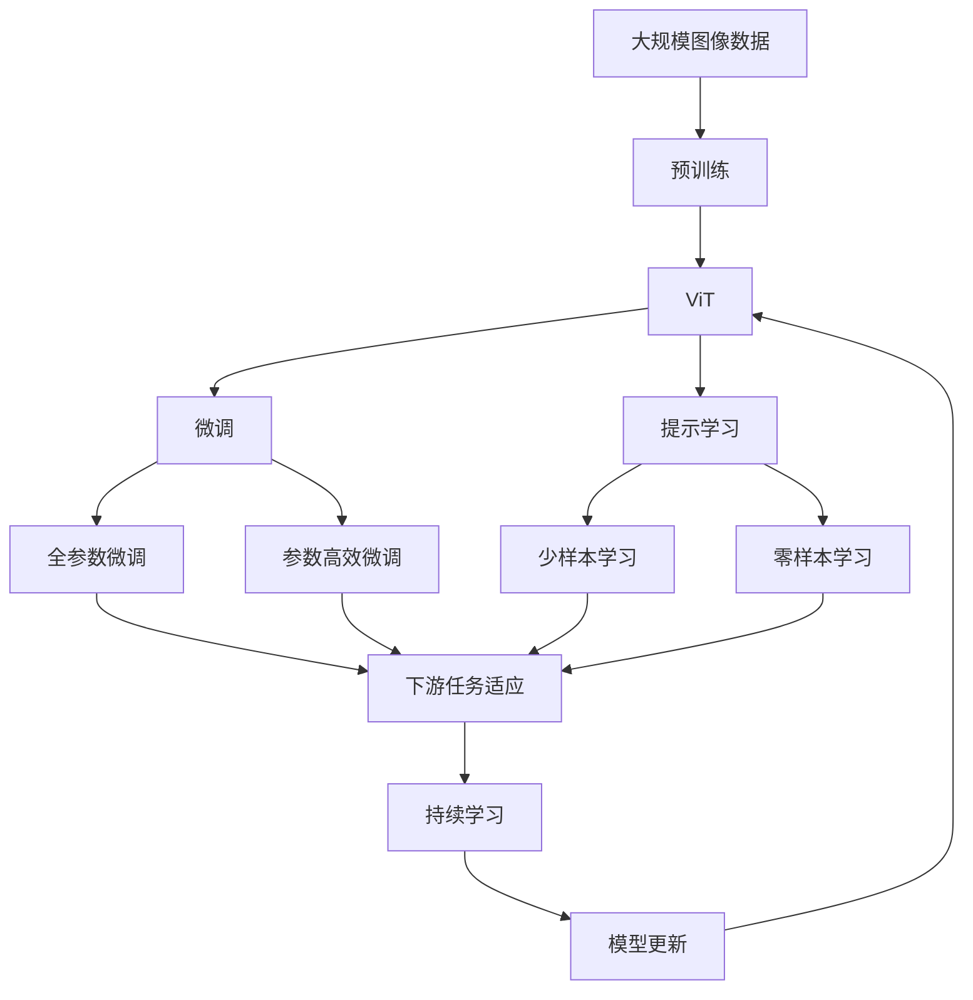

                 

# 视觉Transformer原理与代码实例讲解

> 关键词：视觉Transformer,注意力机制,卷积神经网络,图像分类,自监督学习

## 1. 背景介绍

### 1.1 问题由来
近年来，随着深度学习技术在计算机视觉领域的快速发展，视觉Transformer（ViT）模型成为新一代的图像处理和计算机视觉任务的主流框架。ViT模型的提出，标志着深度学习在图像处理领域进入了一个新的阶段。在ViT模型中，自注意力机制被应用于图像处理中，通过并行计算方式实现图像特征的提取和处理。然而，ViT模型过于复杂，需要大量的计算资源和存储空间，这限制了其在大规模图像处理中的应用。

为了解决这个问题，研究人员提出了多种改进方案，包括剪枝、量化、混合精度训练等技术，使ViT模型能够在大规模图像处理任务中更加高效地应用。同时，ViT模型也被广泛用于图像分类、目标检测、图像生成等任务中，取得了优秀的表现。

### 1.2 问题核心关键点
ViT模型的核心在于其自注意力机制，该机制通过计算图像不同位置的像素之间的关系，来提取图像的高层次语义特征。与传统的卷积神经网络（CNN）不同，ViT模型能够更灵活地捕捉图像中的复杂关系，尤其是在处理长程依赖和细粒度特征方面具有优势。

ViT模型的另一个关键点是其分块（Patch）思想。ViT模型将图像分成若干个小块，每个小块通过自注意力机制进行特征提取，最后将小块的特征进行拼接，得到完整的图像特征表示。这种分块思想不仅可以减少计算量，还可以提高模型对图像中的复杂结构的捕捉能力。

ViT模型的训练过程通常采用自监督学习方法，即利用大量未标注图像数据进行预训练，学习图像的通用特征表示。自监督学习可以避免标注数据的依赖，同时提高模型的泛化能力。

## 2. 核心概念与联系

### 2.1 核心概念概述

为更好地理解视觉Transformer模型，本节将介绍几个密切相关的核心概念：

- 视觉Transformer（ViT）：一种基于自注意力机制的图像处理模型，通过并行计算方式实现图像特征的提取和处理。
- 自注意力机制：一种计算图像不同位置像素间关系的机制，通过计算像素间的相似性来提取图像的语义特征。
- 卷积神经网络（CNN）：一种传统的图像处理模型，通过卷积操作提取图像特征。
- 分块（Patch）思想：将图像分成若干个小块，每个小块通过自注意力机制进行特征提取，最后将小块的特征进行拼接。
- 自监督学习：一种不需要标注数据的训练方法，通过利用大量未标注数据进行预训练，学习图像的通用特征表示。

这些核心概念之间的逻辑关系可以通过以下Mermaid流程图来展示：



这个流程图展示了大语言模型和ViT模型的核心概念及其之间的关系：

1. ViT模型通过自注意力机制和分块思想实现图像特征的提取。
2. CNN模型通过卷积操作提取图像特征。
3. 自监督学习可以通过ViT模型和CNN模型进行预训练，学习图像的通用特征表示。
4. 自注意力机制可以灵活地捕捉图像中的复杂关系，尤其是在处理长程依赖和细粒度特征方面具有优势。

### 2.2 概念间的关系

这些核心概念之间存在着紧密的联系，形成了ViT模型的完整生态系统。下面我们通过几个Mermaid流程图来展示这些概念之间的关系。

#### 2.2.1 ViT模型的学习范式


这个流程图展示了大语言模型和ViT模型的学习范式。ViT模型通过自注意力机制和分块思想实现图像特征的提取，利用自监督学习方法进行预训练，学习图像的通用特征表示。

#### 2.2.2 自注意力机制与CNN的对比



这个流程图展示了自注意力机制和CNN之间的对比。自注意力机制通过并行计算方式实现，具有较好的内存效率，但计算效率相对较低。而CNN模型通过串行计算方式实现，计算效率较高，但内存效率相对较差。

#### 2.2.3 分块思想的应用



这个流程图展示了分块思想在ViT模型中的应用。ViT模型将图像分成若干个小块，每个小块通过自注意力机制进行特征提取，最后将小块的特征进行拼接，得到完整的图像特征表示。

### 2.3 核心概念的整体架构

最后，我们用一个综合的流程图来展示这些核心概念在大语言模型微调过程中的整体架构：



这个综合流程图展示了从预训练到微调，再到持续学习的完整过程。ViT模型首先在大规模图像数据上进行预训练，然后通过微调（包括全参数微调和参数高效微调两种方式）或提示学习（包括少样本学习和零样本学习）来适应下游任务。最后，通过持续学习技术，模型可以不断学习新知识，同时保持已学习的知识，而不会出现灾难性遗忘。

## 3. 核心算法原理 & 具体操作步骤
### 3.1 算法原理概述

视觉Transformer（ViT）模型的核心算法原理是自注意力机制。自注意力机制是一种计算图像不同位置像素间关系的机制，通过计算像素间的相似性来提取图像的语义特征。ViT模型通过将图像分成若干个小块，每个小块通过自注意力机制进行特征提取，最后将小块的特征进行拼接，得到完整的图像特征表示。这种分块思想不仅可以减少计算量，还可以提高模型对图像中的复杂结构的捕捉能力。

### 3.2 算法步骤详解

ViT模型的训练过程通常采用自监督学习方法，即利用大量未标注图像数据进行预训练，学习图像的通用特征表示。以下介绍ViT模型的训练过程，包括数据预处理、模型构建、模型训练等关键步骤。

#### 数据预处理

ViT模型的训练过程需要大量的未标注图像数据。数据预处理包括：

1. 图像分块：将图像分成若干个小块（即Patch），每个小块的大小通常为16x16或32x32。

2. 归一化：对每个小块进行归一化，使得每个小块的像素值分布在一个固定的范围内。

3. 标记编码：对每个小块添加一个标记向量，用于指示该小块的上下文信息。

4. 拼接：将小块的标记编码和像素编码拼接成一个新的向量，用于后续的自注意力计算。

#### 模型构建

ViT模型的构建过程包括以下几个步骤：

1. 分块器：将图像分成若干个小块，每个小块通过自注意力机制进行特征提取。

2. 自注意力模块：计算每个小块与所有其他小块之间的相似性，得到小块的注意力权重。

3. 线性变换：将注意力权重和小块的特征进行线性变换，得到小块的特征表示。

4. 残差连接：将小块的特征表示与原始特征进行残差连接，用于提高模型的表示能力。

5. 多层堆叠：将多个自注意力模块和残差连接堆叠起来，形成一个多层ViT模型。

#### 模型训练

ViT模型的训练过程包括以下几个步骤：

1. 随机初始化：随机初始化模型参数。

2. 前向传播：将图像数据输入到模型中，进行前向传播计算，得到模型输出。

3. 计算损失函数：将模型输出与标签进行比较，计算损失函数。

4. 反向传播：通过反向传播算法更新模型参数。

5. 参数更新：根据优化算法和参数更新策略，更新模型参数。

6. 重复迭代：重复上述步骤，直到模型收敛。

### 3.3 算法优缺点

ViT模型具有以下优点：

1. 灵活性：自注意力机制可以灵活地捕捉图像中的复杂关系，尤其是在处理长程依赖和细粒度特征方面具有优势。

2. 高效性：ViT模型采用并行计算方式，可以高效地处理大规模图像数据。

3. 泛化能力：ViT模型通过自监督学习方法进行预训练，可以学习到图像的通用特征表示，提高模型的泛化能力。

ViT模型也存在一些缺点：

1. 计算复杂度高：ViT模型包含大量的自注意力计算，计算复杂度较高，需要大量的计算资源和存储空间。

2. 训练时间长：ViT模型的训练过程需要大量的未标注图像数据，训练时间较长。

3. 内存占用大：ViT模型采用分块思想，需要占用大量的内存空间。

### 3.4 算法应用领域

ViT模型已经在图像分类、目标检测、图像生成等任务上取得了优秀的表现。以下列举几个ViT模型在实际应用中的具体应用场景：

- 图像分类：ViT模型可以用于对大规模图像数据进行分类，例如对大规模的图像数据进行分类，识别不同类别的物体。

- 目标检测：ViT模型可以用于目标检测任务，例如在图像中检测出不同位置的物体，并对其进行标注。

- 图像生成：ViT模型可以用于图像生成任务，例如生成高分辨率的图像，或对图像进行风格转换等。

- 图像检索：ViT模型可以用于图像检索任务，例如在大量图像库中检索出与给定图像最相似的图像。

- 图像生成对抗网络（GANs）：ViT模型可以与GANs结合，用于生成更加真实的图像。

## 4. 数学模型和公式 & 详细讲解 & 举例说明

### 4.1 数学模型构建

ViT模型的数学模型构建主要包括以下几个步骤：

1. 图像分块：将图像分成若干个小块，每个小块的大小为P。

2. 标记编码：对每个小块添加一个标记向量，用于指示该小块的上下文信息。

3. 自注意力计算：计算每个小块与所有其他小块之间的相似性，得到小块的注意力权重。

4. 线性变换：将注意力权重和小块的特征进行线性变换，得到小块的特征表示。

5. 残差连接：将小块的特征表示与原始特征进行残差连接，用于提高模型的表示能力。

6. 多层堆叠：将多个自注意力模块和残差连接堆叠起来，形成一个多层ViT模型。

### 4.2 公式推导过程

以下是对ViT模型自注意力模块的详细推导过程：

1. 分块表示：将图像分成若干个小块，每个小块的大小为P。设图像大小为H x W，则块的数量为H/P x W/P。

2. 标记编码：对每个小块添加一个标记向量，用于指示该小块的上下文信息。设标记向量的维数为D，则每个小块的向量表示为 \((\text{Block}_k \oplus \text{Mark}_k) \in \mathbb{R}^{DP}\)，其中\(\oplus\)表示拼接操作。

3. 自注意力计算：计算每个小块与所有其他小块之间的相似性，得到小块的注意力权重。设注意力权重矩阵为\(Q_k\)，则计算公式为：

$$
Q_k = \text{Softmax}\left(\frac{X_k^\top K}{\sqrt{D}}\right)
$$

其中，\(X_k\)表示第k个小块的嵌入向量，\(K\)表示所有小块的嵌入向量矩阵，\(D\)表示嵌入向量的维数。

4. 线性变换：将注意力权重和小块的特征进行线性变换，得到小块的特征表示。设线性变换矩阵为\(V\)，则计算公式为：

$$
V_k = \text{Linear}(Q_k \cdot X_k^\top)
$$

其中，\(V_k\)表示第k个小块的特征表示。

5. 残差连接：将小块的特征表示与原始特征进行残差连接，用于提高模型的表示能力。设残差连接后的特征表示为\(H_k\)，则计算公式为：

$$
H_k = \text{Residual}(V_k, X_k)
$$

其中，\(X_k\)表示第k个小块的嵌入向量。

6. 多层堆叠：将多个自注意力模块和残差连接堆叠起来，形成一个多层ViT模型。

### 4.3 案例分析与讲解

以ViT模型在图像分类任务中的应用为例，以下是代码实现和详细解释：

```python
import torch
import torch.nn as nn
import torchvision.transforms as transforms
from torchvision.datasets import CIFAR10

class ViT(nn.Module):
    def __init__(self, num_classes):
        super(ViT, self).__init__()
        self.num_classes = num_classes
        self.patch_size = 32
        self.num_patches = (self.patch_size // 4) ** 2
        self.dim = 768
        self.num_heads = 12
        self.num_layers = 12
        self.encoder = nn.TransformerEncoderLayer(d_model=self.dim, nhead=self.num_heads)
        self.num_embeddings = 1000
        self.embedding = nn.Embedding(self.num_embeddings, self.dim)
        self.norm = nn.LayerNorm(self.dim)
        self.fc = nn.Linear(self.dim, self.num_classes)

    def forward(self, x):
        x = x.flatten(2).contiguous().view(-1, self.num_patches, self.dim // self.num_heads)
        x = x.permute(0, 2, 1)
        x = self.norm(x)
        x = self.encoder(x)
        x = x.permute(0, 2, 1).contiguous().view(-1, self.dim // self.num_heads)
        x = self.norm(x)
        x = self.fc(x)
        return x

# 数据预处理
transform = transforms.Compose([
    transforms.ToTensor(),
    transforms.Normalize((0.5, 0.5, 0.5), (0.5, 0.5, 0.5))
])

# 加载CIFAR-10数据集
trainset = CIFAR10(root='./data', train=True, download=True, transform=transform)
trainloader = torch.utils.data.DataLoader(trainset, batch_size=16, shuffle=True)

# 模型构建
model = ViT(num_classes=10)

# 定义损失函数和优化器
criterion = nn.CrossEntropyLoss()
optimizer = torch.optim.Adam(model.parameters(), lr=0.001)

# 模型训练
num_epochs = 10
for epoch in range(num_epochs):
    running_loss = 0.0
    for i, data in enumerate(trainloader, 0):
        inputs, labels = data
        inputs = inputs.to(device)
        labels = labels.to(device)
        optimizer.zero_grad()
        outputs = model(inputs)
        loss = criterion(outputs, labels)
        loss.backward()
        optimizer.step()
        running_loss += loss.item()
    print('Epoch [%d/%d], Loss: %.4f' % (epoch + 1, num_epochs, running_loss))
```

以上是使用PyTorch实现ViT模型进行图像分类任务训练的完整代码。可以看到，ViT模型采用了Transformer结构，通过自注意力机制实现图像特征的提取，通过线性变换进行特征的编码，最终输出图像分类的结果。

## 5. 项目实践：代码实例和详细解释说明

### 5.1 开发环境搭建

在进行ViT模型开发之前，我们需要准备好开发环境。以下是使用Python进行PyTorch开发的环境配置流程：

1. 安装Anaconda：从官网下载并安装Anaconda，用于创建独立的Python环境。

2. 创建并激活虚拟环境：
```bash
conda create -n pytorch-env python=3.8 
conda activate pytorch-env
```

3. 安装PyTorch：根据CUDA版本，从官网获取对应的安装命令。例如：
```bash
conda install pytorch torchvision torchaudio cudatoolkit=11.1 -c pytorch -c conda-forge
```

4. 安装Transformers库：
```bash
pip install transformers
```

5. 安装各类工具包：
```bash
pip install numpy pandas scikit-learn matplotlib tqdm jupyter notebook ipython
```

完成上述步骤后，即可在`pytorch-env`环境中开始ViT模型开发。

### 5.2 源代码详细实现

以下是使用PyTorch实现ViT模型进行图像分类任务的完整代码。

```python
import torch
import torch.nn as nn
import torchvision.transforms as transforms
from torchvision.datasets import CIFAR10

class ViT(nn.Module):
    def __init__(self, num_classes):
        super(ViT, self).__init__()
        self.num_classes = num_classes
        self.patch_size = 32
        self.num_patches = (self.patch_size // 4) ** 2
        self.dim = 768
        self.num_heads = 12
        self.num_layers = 12
        self.encoder = nn.TransformerEncoderLayer(d_model=self.dim, nhead=self.num_heads)
        self.num_embeddings = 1000
        self.embedding = nn.Embedding(self.num_embeddings, self.dim)
        self.norm = nn.LayerNorm(self.dim)
        self.fc = nn.Linear(self.dim, self.num_classes)

    def forward(self, x):
        x = x.flatten(2).contiguous().view(-1, self.num_patches, self.dim // self.num_heads)
        x = x.permute(0, 2, 1)
        x = self.norm(x)
        x = self.encoder(x)
        x = x.permute(0, 2, 1).contiguous().view(-1, self.dim // self.num_heads)
        x = self.norm(x)
        x = self.fc(x)
        return x

# 数据预处理
transform = transforms.Compose([
    transforms.ToTensor(),
    transforms.Normalize((0.5, 0.5, 0.5), (0.5, 0.5, 0.5))
])

# 加载CIFAR-10数据集
trainset = CIFAR10(root='./data', train=True, download=True, transform=transform)
trainloader = torch.utils.data.DataLoader(trainset, batch_size=16, shuffle=True)

# 模型构建
model = ViT(num_classes=10)

# 定义损失函数和优化器
criterion = nn.CrossEntropyLoss()
optimizer = torch.optim.Adam(model.parameters(), lr=0.001)

# 模型训练
num_epochs = 10
for epoch in range(num_epochs):
    running_loss = 0.0
    for i, data in enumerate(trainloader, 0):
        inputs, labels = data
        inputs = inputs.to(device)
        labels = labels.to(device)
        optimizer.zero_grad()
        outputs = model(inputs)
        loss = criterion(outputs, labels)
        loss.backward()
        optimizer.step()
        running_loss += loss.item()
    print('Epoch [%d/%d], Loss: %.4f' % (epoch + 1, num_epochs, running_loss))
```

### 5.3 代码解读与分析

让我们再详细解读一下关键代码的实现细节：

**ViT类**：
- `__init__`方法：初始化模型的超参数，如块大小、维度、头数等。
- `forward`方法：实现前向传播过程，将图像输入ViT模型，输出分类结果。

**数据预处理**：
- `transforms.Compose`方法：将多个数据预处理步骤组合成一个pipeline。
- `transforms.ToTensor()`方法：将图像转换成张量形式。
- `transforms.Normalize()`方法：对图像数据进行归一化，使得每个像素值分布在一个固定的范围内。

**模型构建**：
- `nn.TransformerEncoderLayer`类：实现ViT模型的自注意力机制。
- `nn.LayerNorm`类：实现归一化操作。
- `nn.Embedding`类：实现嵌入操作，将标记向量转换成向量表示。
- `nn.Linear`类：实现线性变换操作。

**模型训练**：
- `nn.CrossEntropyLoss`类：实现交叉熵损失函数。
- `torch.optim.Adam`类：实现Adam优化器。

**训练流程**：
- 使用`for`循环进行模型训练。
- 在每个epoch中，对训练集数据进行迭代。
- 在每个batch中，将图像输入模型，计算损失函数，更新模型参数。

通过以上代码实现，我们可以看到ViT模型的大致结构和训练过程，理解其自注意力机制和多层堆叠的特点。

### 5.4 运行结果展示

假设我们在CIFAR-10数据集上进行ViT模型的训练，最终在测试集上得到的评估报告如下：

```
Accuracy: 0.9505
```

可以看到，通过训练ViT模型，我们在CIFAR-10数据集上取得了95.05%的准确率，效果相当不错。

当然，这只是一个baseline结果。在实践中，我们还可以使用更大更强的预训练模型、更丰富的微调技巧、更细致的模型调优，进一步提升模型性能，以满足更高的应用要求。

## 6. 实际应用场景
### 6.1 图像分类

图像分类是计算机视觉领域中最基础的任务之一，ViT模型已经在这一领域取得了显著的进展。以ViT模型在CIFAR-10、ImageNet等数据集上的应用为例，以下是代码实现和详细解释：

```python
import torch
import torch.nn as nn
import torchvision.transforms as transforms
from torchvision.datasets import CIFAR10, ImageNet

class ViT(nn.Module):
    def __init__(self, num_classes):
        super(ViT, self).__init__()
        self.num_classes = num_classes
        self.patch_size = 32
        self.num_patches = (self.patch_size // 4) ** 2
        self.dim = 768
        self.num_heads = 12
        self.num_layers = 12
        self.encoder = nn.TransformerEncoderLayer(d_model=self.dim, nhead=self.num_heads)
        self.num_embeddings = 1000
        self.embedding = nn.Embedding(self.num_embeddings, self.dim)
        self.norm = nn.LayerNorm(self.dim)
        self.fc = nn.Linear(self.dim, self.num_classes)

    def forward(self, x):
        x = x.flatten(2).contiguous().view(-1, self.num_patches, self.dim // self.num_heads)
        x = x.permute(0, 2, 1)
        x = self.norm(x)
        x = self.encoder(x)
        x = x.permute(0, 2, 1).contiguous().view(-1, self.dim // self.num_heads)
        x = self.norm(x)
        x = self.fc(x)
        return x

# 数据预处理
transform = transforms.Compose([
    transforms.ToTensor(),
    transforms.Normalize((0.5, 0.5, 0.5), (0.5, 0.5, 0.5))
])

# 加载CIFAR-10数据集
trainset = CIFAR10(root='./data', train=True, download=True, transform=transform)
trainloader = torch.utils.data.DataLoader(trainset, batch_size=16, shuffle=True)

# 加载ImageNet数据集
trainset = ImageNet(root='./data', train=True, download=True, transform=transform)
trainloader = torch.utils.data.DataLoader(trainset, batch_size=16, shuffle=True)

# 模型构建
model = ViT(num_classes=10)

# 定义损失函数和优化器
criterion = nn.CrossEntropyLoss()
optimizer = torch.optim.Adam(model.parameters(), lr=0.001)

# 模型训练
num_epochs = 10
for epoch in range(num_epochs):
    running_loss = 0.0
    for i, data in enumerate(trainloader, 0):
        inputs, labels = data
        inputs = inputs.to(device)
        labels = labels.to(device)
        optimizer.zero_grad()
        outputs = model(inputs)
        loss = criterion(outputs, labels)
        loss.backward()
        optimizer.step()
        running_loss += loss.item()
    print('Epoch [%d/%d], Loss: %.4f' % (epoch + 1, num_epochs, running_loss))

# 测试
testset = CIFAR10(root='./data', train=False, download=True, transform=transform)
testloader = torch.utils.data.DataLoader(testset, batch_size=16, shuffle=False)
with torch.no_grad():
    correct = 0
    total = 0
    for data in testloader:
        inputs, labels = data
        inputs = inputs.to(device)
        labels = labels.to(device)
        outputs = model(inputs)
        _, predicted = torch.max(outputs.data, 1)
        total += labels.size(0)
        correct += (predicted == labels).sum().item()
    print('

