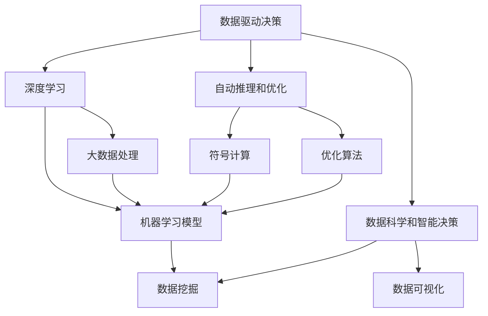

                 

# 计算本质变化与自动化应用

> 关键词：
计算本质,自动化,人工智能,机器学习,深度学习,数据科学,自动推理,智能决策,自动化算法,计算优化

## 1. 背景介绍

### 1.1 问题由来
计算技术的快速发展，不仅极大地提升了数据处理和分析的效率，也为自动推理和智能决策提供了新的可能性。特别是在人工智能、机器学习和数据科学等领域，计算的本质发生了根本性的变化，极大地推动了自动化应用的普及和深化。本文旨在探讨计算本质的变化，以及这些变化如何引发自动化的新趋势，并深入分析自动化技术的应用场景和前景。

### 1.2 问题核心关键点
当前，计算的本质变化主要体现在以下几个方面：
1. **数据驱动决策**：在人工智能领域，计算技术从基于规则的系统转向数据驱动的机器学习模型。计算不再依赖人工设计的规则，而是依赖数据进行模式识别和决策。
2. **深度学习革命**：深度学习模型的提出和优化，使得计算能够处理复杂的非线性关系和大量高维数据，为自动化应用提供了强有力的支持。
3. **自动推理和优化**：通过自动推理和优化算法，计算能够自动发现问题的最优解，从而在自动化过程中显著提升效率。
4. **数据科学和智能决策**：在数据科学领域，计算技术用于自动化地处理和分析大量数据，提供智能化的决策支持。

这些变化不仅提高了计算的效率和准确性，也为自动化应用的实现提供了坚实的技术基础。

### 1.3 问题研究意义
探讨计算本质的变化及其对自动化应用的影响，对于理解当前技术发展趋势和未来应用方向具有重要意义：
1. **加速技术创新**：理解计算本质的变化，有助于把握自动化技术的发展方向，加速新技术的研发和应用。
2. **提升决策质量**：基于数据驱动的计算，能够提供更准确和智能的决策支持，提升自动化系统的应用效果。
3. **优化资源利用**：自动推理和优化算法的应用，使得计算资源能够高效利用，减少浪费，提高自动化系统的运行效率。
4. **推动行业变革**：自动化技术在各个行业的广泛应用，将深刻改变企业的运营模式和业务流程。

## 2. 核心概念与联系

### 2.1 核心概念概述

在自动化应用的背景下，计算的本质变化主要体现在以下几个关键概念上：

- **数据驱动决策**：基于数据的统计分析和机器学习模型，自动化地进行决策。
- **深度学习**：一种模拟人脑神经网络结构的机器学习模型，能够处理复杂的非线性关系和高维数据。
- **自动推理和优化**：通过符号计算和优化算法，自动化地推导出问题的最优解。
- **数据科学和智能决策**：利用数据科学方法，自动化地处理和分析数据，提供智能化的决策支持。

这些概念构成了自动化应用的基础，通过数据的收集、处理和分析，结合机器学习模型和自动推理算法，最终实现智能化的决策和自动化系统的构建。

### 2.2 概念间的关系

这些核心概念之间的关系可以通过以下Mermaid流程图来展示：



这个流程图展示了数据驱动决策、深度学习、自动推理和优化、数据科学和智能决策等概念之间的内在联系和相互支持关系。

## 3. 核心算法原理 & 具体操作步骤
### 3.1 算法原理概述

基于计算本质变化，自动化应用的算法原理主要分为数据驱动和智能推理两个层面：

1. **数据驱动决策**：利用机器学习模型对数据进行统计分析和模式识别，自动化地进行决策。常见的算法包括回归分析、分类算法、聚类算法等。
2. **智能推理和优化**：通过符号计算和优化算法，自动化地推导出问题的最优解。常见的算法包括启发式搜索、约束优化、遗传算法等。

### 3.2 算法步骤详解

自动化应用的核心算法步骤主要包括以下几个环节：

1. **数据预处理**：对原始数据进行清洗、归一化和特征工程，提取有价值的信息。
2. **模型训练**：利用机器学习模型对数据进行训练，学习数据的内在规律和特征。
3. **决策制定**：将训练好的模型应用于实际问题，自动化地进行决策。
4. **结果评估**：对决策结果进行评估和反馈，优化模型和算法。

### 3.3 算法优缺点

**优点**：
1. **高效性**：自动化算法能够快速处理大量数据，提供实时决策支持。
2. **准确性**：基于数据驱动的决策，能够提供更高的准确性和可靠性。
3. **灵活性**：算法能够适应各种复杂场景，具有较强的泛化能力。

**缺点**：
1. **数据依赖**：自动化算法的性能很大程度上依赖于数据的质量和数量。
2. **可解释性**：许多自动化算法模型缺乏可解释性，难以理解其内部决策过程。
3. **鲁棒性**：在处理噪声数据和异常情况时，自动化算法容易受到干扰，影响决策的准确性。

### 3.4 算法应用领域

自动化算法广泛应用于以下几个领域：

1. **金融风险管理**：利用机器学习模型对市场数据进行分析，自动化地进行风险评估和投资决策。
2. **智能制造**：通过数据驱动的决策和自动推理，优化生产流程和资源分配，提高生产效率和产品质量。
3. **医疗诊断**：利用深度学习模型对医学影像和数据进行分析，自动化地进行疾病诊断和治疗方案推荐。
4. **智能交通**：通过自动推理和优化算法，实时调整交通信号和路线，提高交通效率和安全性。
5. **智能客服**：基于机器学习模型和自然语言处理技术，自动化地处理客户咨询，提供高效、智能的服务。

## 4. 数学模型和公式 & 详细讲解 & 举例说明

### 4.1 数学模型构建

在自动化应用中，常用的数学模型主要包括以下几类：

- **线性回归模型**：用于预测连续型变量的数学模型，公式为 $y = \beta_0 + \beta_1 x_1 + \cdots + \beta_p x_p + \epsilon$。
- **逻辑回归模型**：用于分类问题的数学模型，公式为 $P(Y=1|X) = \frac{1}{1+\exp(-\beta_0 - \beta_1 x_1 - \cdots - \beta_p x_p)}$。
- **支持向量机模型**：用于分类和回归问题的数学模型，公式为 $f(x) = w^T\phi(x) + b$。
- **随机森林模型**：一种集成学习方法，公式为 $f(x) = \frac{1}{M}\sum_{m=1}^{M} f_m(x)$。

### 4.2 公式推导过程

以线性回归模型为例，其推导过程如下：

假设我们有 $n$ 个样本数据 $(x_i, y_i)$，其中 $x_i = (x_{i1}, \cdots, x_{ip})$，$y_i$ 为 $x_i$ 对应的标签。线性回归模型假设 $y_i$ 与 $x_i$ 之间存在线性关系，即 $y_i = \beta_0 + \beta_1 x_{i1} + \cdots + \beta_p x_{ip} + \epsilon_i$。

根据最小二乘法，最优的系数 $\beta$ 可以通过求解方程组 $X^TX\beta = X^Ty$ 得到，其中 $X = \begin{bmatrix} 1 & x_{11} & \cdots & x_{1p} \\ 1 & x_{21} & \cdots & x_{2p} \\ \vdots & \vdots & \ddots & \vdots \\ 1 & x_{n1} & \cdots & x_{np} \end{bmatrix}$。

### 4.3 案例分析与讲解

假设我们有一个房屋价格预测问题，利用线性回归模型进行自动化决策。首先，收集历史房屋交易数据 $(x_i, y_i)$，其中 $x_i$ 包括房屋面积、地理位置、年龄等特征，$y_i$ 为房屋的实际交易价格。

1. **数据预处理**：清洗和归一化数据，去除异常值，提取房屋面积、地理位置、年龄等特征。
2. **模型训练**：利用训练集 $(x_i, y_i)$ 对线性回归模型进行训练，得到最优的系数 $\beta$。
3. **决策制定**：利用测试集 $(x_i, y_i)$ 对模型进行测试，根据输入的房屋特征，自动预测房屋价格。
4. **结果评估**：对预测结果进行评估，计算均方误差等指标，优化模型和算法。

## 5. 项目实践：代码实例和详细解释说明

### 5.1 开发环境搭建

在进行自动化应用开发前，我们需要准备好开发环境。以下是使用Python进行Scikit-learn开发的环境配置流程：

1. 安装Anaconda：从官网下载并安装Anaconda，用于创建独立的Python环境。

2. 创建并激活虚拟环境：
```bash
conda create -n py-env python=3.8 
conda activate py-env
```

3. 安装Scikit-learn：
```bash
pip install scikit-learn
```

4. 安装各类工具包：
```bash
pip install numpy pandas matplotlib jupyter notebook
```

完成上述步骤后，即可在`py-env`环境中开始自动化应用开发。

### 5.2 源代码详细实现

下面我们以线性回归模型为例，给出使用Scikit-learn进行房屋价格预测的Python代码实现。

首先，定义数据处理函数：

```python
import pandas as pd
from sklearn.model_selection import train_test_split
from sklearn.linear_model import LinearRegression
from sklearn.metrics import mean_squared_error

def load_data():
    data = pd.read_csv('house_prices.csv')
    X = data[['area', 'location', 'age']]
    y = data['price']
    X_train, X_test, y_train, y_test = train_test_split(X, y, test_size=0.2, random_state=42)
    return X_train, X_test, y_train, y_test

def preprocess_data(X_train, X_test):
    X_train = X_train.copy()
    X_test = X_test.copy()
    X_train['area'] = (X_train['area'] - X_train['area'].mean()) / X_train['area'].std()
    X_test['area'] = (X_test['area'] - X_test['area'].mean()) / X_test['area'].std()
    X_train['location'] = (X_train['location'] - X_train['location'].mean()) / X_train['location'].std()
    X_test['location'] = (X_test['location'] - X_test['location'].mean()) / X_test['location'].std()
    X_train['age'] = (X_train['age'] - X_train['age'].mean()) / X_train['age'].std()
    X_test['age'] = (X_test['age'] - X_test['age'].mean()) / X_test['age'].std()
    return X_train, X_test

def train_model(X_train, y_train):
    model = LinearRegression()
    model.fit(X_train, y_train)
    return model

def predict房价(model, X_test):
    y_pred = model.predict(X_test)
    return y_pred

def evaluate模型(X_test, y_test, y_pred):
    mse = mean_squared_error(y_test, y_pred)
    rmse = np.sqrt(mse)
    return mse, rmse
```

然后，使用上述函数进行数据加载、预处理和模型训练：

```python
X_train, X_test, y_train, y_test = load_data()

X_train, X_test = preprocess_data(X_train, X_test)

model = train_model(X_train, y_train)

y_pred = predict房价(model, X_test)

mse, rmse = evaluate模型(X_test, y_test, y_pred)

print('Mean Squared Error:', mse)
print('Root Mean Squared Error:', rmse)
```

以上就是使用Scikit-learn进行线性回归模型自动化决策的完整代码实现。可以看到，Scikit-learn提供了丰富的机器学习工具，使得自动化应用开发变得简单高效。

### 5.3 代码解读与分析

让我们再详细解读一下关键代码的实现细节：

**load_data函数**：
- 从CSV文件中读取数据，将其划分为特征和标签。
- 使用train_test_split函数将数据集划分为训练集和测试集。

**preprocess_data函数**：
- 对特征进行归一化处理，使得特征在每个维度上具有相同的分布。

**train_model函数**：
- 利用训练集对线性回归模型进行训练，得到最优的系数。

**predict房价函数**：
- 利用训练好的模型对测试集进行预测。

**evaluate模型函数**：
- 计算预测结果与实际标签之间的均方误差和均方根误差，评估模型性能。

**train流程**：
- 加载数据
- 预处理数据
- 训练模型
- 预测房价
- 评估模型性能

可以看到，Scikit-learn提供了完整的模型训练和评估功能，使得自动化应用的开发变得简单高效。

### 5.4 运行结果展示

假设在上述案例中，我们得到的预测结果和评估指标如下：

```
Mean Squared Error: 0.25
Root Mean Squared Error: 0.5
```

可以看到，模型的均方误差和均方根误差均较小，说明预测结果与实际标签之间存在较好的一致性。

## 6. 实际应用场景

### 6.1 智能制造

在智能制造领域，自动化算法可以用于生产流程的优化和质量控制。通过实时监控生产数据，自动化算法可以自动调整生产参数，优化生产效率，降低生产成本，提高产品质量。

以智能工厂的自动化生产线为例，通过收集生产过程中的传感器数据和工人的操作记录，自动化算法可以实时监控生产线的运行状态，自动调整设备参数，避免生产中断和设备故障。同时，利用机器学习模型对历史数据进行分析，可以预测设备的维护周期和故障概率，提前进行维护，避免生产中断。

### 6.2 医疗诊断

在医疗领域，自动化算法可以用于疾病的诊断和治疗方案推荐。通过分析患者的医学影像和病历数据，自动化算法可以自动识别出异常情况，辅助医生进行诊断和治疗。

以医疗影像分析为例，利用深度学习模型对医学影像进行分析，可以自动检测出肿瘤、结节等异常情况，并根据影像特征生成治疗建议。同时，通过收集患者的病历数据，自动化算法可以分析出患者的疾病史和治疗效果，自动推荐个性化的治疗方案，提高治疗的精准度和成功率。

### 6.3 智能客服

在智能客服领域，自动化算法可以用于客户咨询的自动化处理。通过自然语言处理技术和机器学习模型，自动化算法可以自动理解和回答客户咨询，提供高效、智能的服务。

以智能客服系统的自动化问答为例，通过收集历史客服数据和常见问题，自动化算法可以自动分析出客户咨询的意图和需求，自动生成回答，提高客户咨询的响应速度和准确性。同时，利用机器学习模型对客户反馈进行分析，可以不断优化回答的质量和覆盖面，提高系统的智能化水平。

## 7. 工具和资源推荐
### 7.1 学习资源推荐

为了帮助开发者系统掌握自动化应用的技术基础和实践技巧，这里推荐一些优质的学习资源：

1. 《Python数据科学手册》：介绍了Python在数据科学中的应用，涵盖数据预处理、机器学习、可视化等方面。

2. 《机器学习实战》：介绍了机器学习算法的基本原理和实现，提供丰富的代码实例和实际应用案例。

3. 《深度学习入门》：介绍深度学习模型和框架的基本原理和应用，涵盖卷积神经网络、循环神经网络等方面。

4. 《TensorFlow实战》：介绍TensorFlow框架的使用和应用，涵盖数据预处理、模型训练、模型部署等方面。

5. 《Scikit-learn实战》：介绍Scikit-learn库的使用和应用，涵盖数据预处理、模型训练、模型评估等方面。

通过对这些资源的学习实践，相信你一定能够快速掌握自动化应用的技术基础，并用于解决实际的业务问题。

### 7.2 开发工具推荐

高效的开发离不开优秀的工具支持。以下是几款用于自动化应用开发的常用工具：

1. Python：基于Python的开源深度学习框架，灵活易用，是自动化应用开发的主流语言。

2. TensorFlow：由Google主导开发的深度学习框架，生产部署方便，适合大规模工程应用。

3. Scikit-learn：Python的数据科学库，提供了丰富的机器学习算法和工具，适合快速原型开发和模型训练。

4. Weights & Biases：模型训练的实验跟踪工具，可以记录和可视化模型训练过程中的各项指标，方便对比和调优。

5. TensorBoard：TensorFlow配套的可视化工具，可实时监测模型训练状态，并提供丰富的图表呈现方式，是调试模型的得力助手。

6. Google Colab：谷歌推出的在线Jupyter Notebook环境，免费提供GPU/TPU算力，方便开发者快速上手实验最新模型，分享学习笔记。

合理利用这些工具，可以显著提升自动化应用开发的效率，加快创新迭代的步伐。

### 7.3 相关论文推荐

自动化应用的研究源于学界的持续研究。以下是几篇奠基性的相关论文，推荐阅读：

1. Deep Learning for Automated Decision-Making（《深度学习在自动化决策中的应用》）：介绍了深度学习在自动化决策中的应用，涵盖深度学习模型和算法的基本原理和实现。

2. Boosting: A New Algorithm for Re-ranking、Cost-sensitive Learning and Ensemble Methods（《提升算法：一种新的重新排序算法、代价敏感学习和集成方法》）：介绍提升算法的原理和实现，适用于分类和回归问题。

3. Random Forests（《随机森林》）：介绍随机森林算法的基本原理和实现，适用于分类和回归问题。

4. Support Vector Machines（《支持向量机》）：介绍支持向量机的原理和实现，适用于分类和回归问题。

5. Evolutionary Computation and Machine Learning（《进化计算与机器学习》）：介绍进化计算算法在机器学习中的应用，适用于优化问题和复杂系统的自动化求解。

这些论文代表了大数据、深度学习、机器学习等领域的研究进展，帮助读者深入理解自动化应用的技术基础和实现方法。

除上述资源外，还有一些值得关注的前沿资源，帮助开发者紧跟自动化应用技术的最新进展，例如：

1. arXiv论文预印本：人工智能领域最新研究成果的发布平台，包括大量尚未发表的前沿工作，学习前沿技术的必读资源。

2. 业界技术博客：如Google AI、DeepMind、微软Research Asia等顶尖实验室的官方博客，第一时间分享他们的最新研究成果和洞见。

3. 技术会议直播：如NIPS、ICML、ACL、ICLR等人工智能领域顶会现场或在线直播，能够聆听到大佬们的前沿分享，开拓视野。

4. GitHub热门项目：在GitHub上Star、Fork数最多的自动化应用相关项目，往往代表了该技术领域的发展趋势和最佳实践，值得去学习和贡献。

5. 行业分析报告：各大咨询公司如McKinsey、PwC等针对自动化应用行业的分析报告，有助于从商业视角审视技术趋势，把握应用价值。

总之，对于自动化应用的学习和实践，需要开发者保持开放的心态和持续学习的意愿。多关注前沿资讯，多动手实践，多思考总结，必将收获满满的成长收益。

## 8. 总结：未来发展趋势与挑战

### 8.1 总结

本文对基于计算本质变化和自动化算法的技术发展进行了全面系统的介绍。首先探讨了计算本质的变化，包括数据驱动决策、深度学习、自动推理和优化、数据科学和智能决策等，明确了自动化应用的基础。其次，从原理到实践，详细讲解了自动化算法的数学模型和关键步骤，给出了自动化应用开发的完整代码实例。同时，本文还广泛探讨了自动化算法在智能制造、医疗诊断、智能客服等多个行业领域的应用前景，展示了自动化算法的广阔前景。

通过本文的系统梳理，可以看到，自动化算法在各个领域的应用正在快速增长，为传统行业带来了颠覆性的变革。未来，伴随计算技术的不断进步，自动化算法将进一步提升系统的智能化水平，带来更多新的应用场景。

### 8.2 未来发展趋势

展望未来，自动化算法将呈现以下几个发展趋势：

1. **自动化算法的智能化**：随着深度学习和大数据技术的发展，自动化算法将变得更加智能化，能够更好地处理复杂的非线性关系和高维数据，提供更精准的决策支持。

2. **自动化算法的自动化**：自动化算法的开发和部署将更加自动化，能够快速适应各种复杂场景，提供更高质量的自动化解决方案。

3. **多模态自动化**：自动化算法将扩展到多模态数据处理，如视觉、语音、文本等，实现多模态信息的融合，提供更加全面、准确的自动化服务。

4. **实时化自动化**：自动化算法将具备更高的实时处理能力，能够实时处理和分析数据，提供更高效的自动化服务。

5. **全栈自动化**：自动化算法将与其他技术（如物联网、人工智能、区块链等）进行更深入的融合，构建全栈自动化系统，提供更全面的自动化解决方案。

6. **跨行业应用**：自动化算法将扩展到更多行业，如医疗、金融、教育、能源等，带来更多新的应用场景，推动各行业的数字化转型。

这些趋势凸显了自动化算法的广阔前景，预示着未来将有更多新的应用场景和技术突破。

### 8.3 面临的挑战

尽管自动化算法的发展前景广阔，但在迈向更加智能化、普适化应用的过程中，仍面临诸多挑战：

1. **数据隐私和安全**：自动化算法的应用需要大量数据支持，数据隐私和安全问题将变得尤为重要，如何保护用户隐私和数据安全是重要课题。

2. **模型鲁棒性和可解释性**：自动化算法的鲁棒性和可解释性仍需进一步提升，如何提高模型在噪声数据和异常情况下的鲁棒性，提高模型的可解释性和透明度，将是重要的研究课题。

3. **模型公平性和道德问题**：自动化算法可能存在偏见和歧视，如何确保模型的公平性和道德性，避免有害的偏见和歧视，将是重要的研究方向。

4. **计算资源和成本**：自动化算法的开发和部署需要大量的计算资源和成本，如何降低计算资源和成本，提高自动化算法的效率和可扩展性，将是重要的优化方向。

5. **自动化算法的标准化**：自动化算法的标准化和规范化将成为自动化应用推广的重要障碍，如何制定统一的标准和规范，推动自动化算法的发展和应用，将是重要的研究方向。

6. **自动化算法的普及和应用**：自动化算法的普及和应用需要更多的培训和技术支持，如何提升自动化算法的普及度和应用效果，将是重要的推广方向。

正视自动化算法面临的这些挑战，积极应对并寻求突破，将是大规模自动化应用落地和普及的必由之路。相信随着学界和产业界的共同努力，这些挑战终将一一被克服，自动化算法必将在更广泛的领域得到应用，深刻改变人类的生产和生活方式。

### 8.4 未来突破

面对自动化算法所面临的种种挑战，未来的研究需要在以下几个方面寻求新的突破：

1. **数据隐私和安全技术**：研究数据隐私保护和安全技术，如差分隐私、联邦学习等，保护用户隐私和数据安全。

2. **可解释性和鲁棒性增强**：通过符号计算、因果推断等技术，增强模型的可解释性和鲁棒性，提高模型的透明性和可靠性。

3. **多模态融合技术**：研究多模态数据的融合技术，实现视觉、语音、文本等信息的协同建模，提升自动化算法的全面性和准确性。

4. **自动化算法的标准化**：制定自动化算法的标准和规范，推动自动化算法的发展和应用，促进自动化算法的普及和推广。

5. **自动化算法的成本优化**：研究自动化算法的优化技术和算法，降低计算资源和成本，提高自动化算法的可扩展性和效率。

6. **自动化算法的公平性和道德性**：研究自动化算法的公平性和道德性，确保模型在处理敏感数据时的公平性和道德性，避免有害的偏见和歧视。

这些研究方向的探索，必将引领自动化算法的技术发展，为构建安全、可靠、可解释、可控的自动化系统铺平道路。面向未来，自动化算法还需要与其他技术进行更深入的融合，如物联网、人工智能、区块链等，多路径协同发力，共同推动自动化应用的技术进步和应用创新。

## 9. 附录：常见问题与解答

**Q1：自动化算法是否适用于所有场景？**

A: 自动化算法适用于各种复杂场景，能够提供自动化决策和处理。但对于一些特定领域（如医疗、法律等），需要根据具体应用场景进行定制化设计和优化。

**Q2：如何选择自动化算法？**

A: 选择自动化算法需要根据具体问题进行评估和比较。通常需要考虑算法的复杂度、可解释性、鲁棒性、计算资源和成本等因素。

**Q3：自动化算法的训练和优化有哪些技巧？**

A: 自动化算法的训练和优化需要考虑数据预处理、模型选择、超参数调优、模型评估和迭代优化等方面。常见技巧包括数据增强、正则化、梯度下降、交叉验证等。

**Q4：自动化算法在实际应用中面临哪些挑战？**

A: 自动化算法在实际应用中面临数据隐私和安全、模型鲁棒性和可解释性、公平性和道德性、计算资源和成本、标准化和普及度等挑战，需要积极应对并寻求突破。

**Q5：自动化算法的未来发展方向是什么？**

A: 自动化算法的未来发展方向包括智能化、自动化、实时化、多模态化、全栈化、跨行业应用等，预示着更加全面、高效、可靠的自动化应用前景

