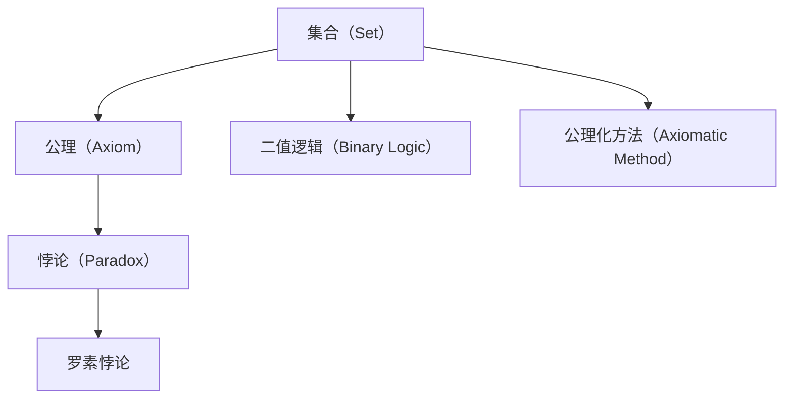
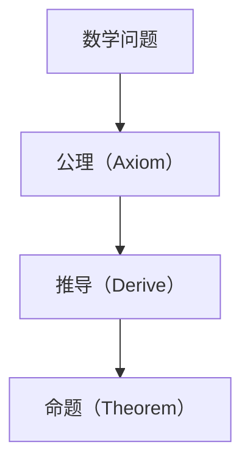
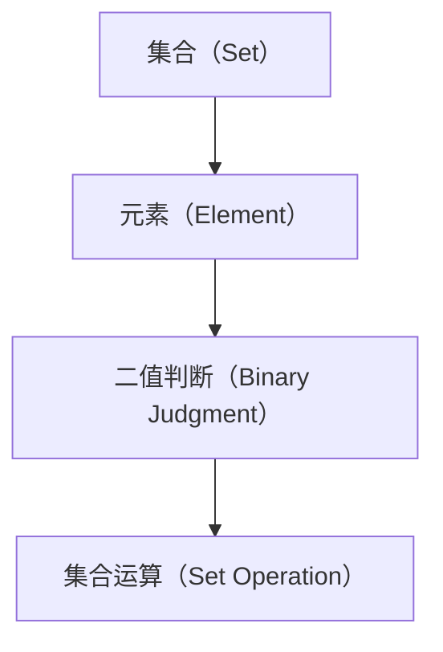
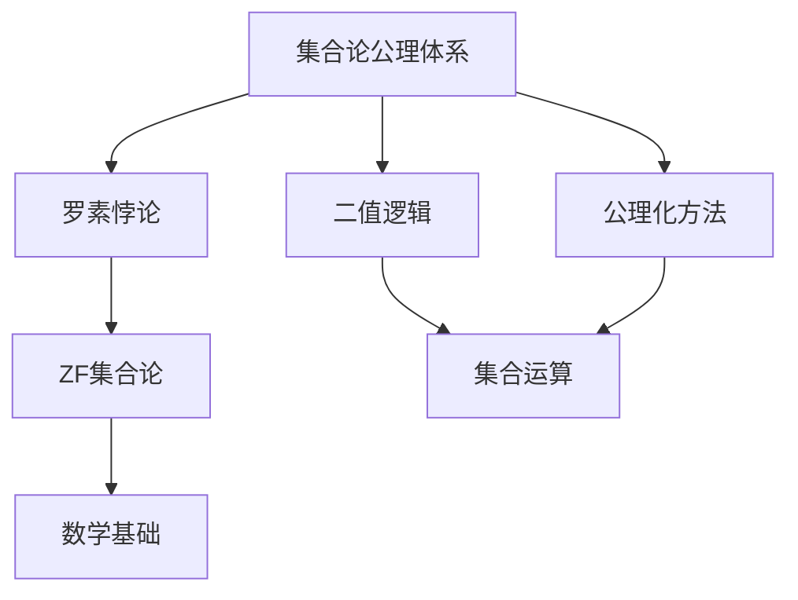

                 

# 计算：第二部分 计算的数学基础 第 5 章 第三次数学危机 危机：罗素悖论

## 1. 背景介绍

### 1.1 问题由来

罗素悖论（Russell's Paradox）是现代数学史上著名的悖论之一，首次出现在1901年。它揭示了经典集合论在自身定义上的逻辑矛盾，对数学的基础产生了深远影响。罗素悖论的发现，促使数学家们重新审视集合论的基础，并引发了第三次数学危机。

### 1.2 问题核心关键点

罗素悖论的核心在于集合论的自身矛盾。具体来说，悖论的表述如下：

> 设S为所有不包含自身的集合的集合，即 $S = \{ X \mid X \notin X \}$。那么，S是否属于自身？如果是，则 $S \in S$ 或 $S \notin S$，产生矛盾。

这种矛盾表明，集合论的公理体系存在固有的问题，需要对其进行修正。罗素悖论的发现，促使数学家们重新审视集合论的公理，最终导致了Zermelo-Fraenkel集合论(ZF集合论)的诞生，为现代数学提供了坚实的基础。

### 1.3 问题研究意义

罗素悖论不仅是数学史上的重要里程碑，也深刻影响了计算机科学的发展。数学上的悖论和公理体系问题，促使计算机科学家探索如何避免类似的逻辑错误，以构建更为健壮的计算模型。这为计算机科学的逻辑基础和计算模型理论奠定了基础。

## 2. 核心概念与联系

### 2.1 核心概念概述

为更好地理解罗素悖论，本节将介绍几个密切相关的核心概念：

- **集合（Set）**：一组元素的抽象表示。在数学中，集合是构成其他数学对象（如函数、代数结构等）的基础。

- **公理（Axiom）**：一套逻辑上自洽的规则，用于推导其他数学命题。集合论的公理体系包括但不限于幂集公理、替换公理、无限公理等。

- **悖论（Paradox）**：指在逻辑上看似正确但产生矛盾的命题。罗素悖论是集合论中的经典悖论。

- **二值逻辑（Binary Logic）**：指只有两种可能结果（真和假）的逻辑系统。罗素悖论中的集合运算和判断都是基于二值逻辑的。

- **公理化方法（Axiomatic Method）**：指从一组公理出发，通过逻辑推理得出结论的数学方法。罗素悖论的发现和ZF集合论的建立，都是公理化方法的具体应用。

这些核心概念之间的逻辑关系可以通过以下Mermaid流程图来展示：



这个流程图展示了大语言模型的核心概念及其之间的关系：

1. 集合是数学的基础概念，公理是其逻辑基础。
2. 公理化方法是推导数学命题的有效手段，集合论和罗素悖论都是其应用。
3. 二值逻辑是公理和集合运算的基础。
4. 罗素悖论揭示了公理体系中隐藏的矛盾。

这些概念共同构成了罗素悖论的核心，其发现促使数学家重新审视集合论的基础，并促使ZF集合论的诞生。

### 2.2 概念间的关系

这些核心概念之间存在着紧密的联系，形成了罗素悖论的完整生态系统。下面我通过几个Mermaid流程图来展示这些概念之间的关系。

#### 2.2.1 集合论的公理体系


这个流程图展示了集合论的基本公理体系，以及罗素悖论在这一体系中的位置。

#### 2.2.2 公理化方法在数学中的应用



这个流程图展示了公理化方法的基本流程，以及其如何应用于数学问题的解决。

#### 2.2.3 二值逻辑在集合运算中的应用



这个流程图展示了二值逻辑在集合运算中的应用。

### 2.3 核心概念的整体架构

最后，我们用一个综合的流程图来展示这些核心概念在罗素悖论中的整体架构：



这个综合流程图展示了从集合论的公理体系到罗素悖论，再到ZF集合论的逻辑链条，以及公理化方法和二值逻辑在其中扮演的角色。

## 3. 核心算法原理 & 具体操作步骤
### 3.1 算法原理概述

罗素悖论的数学原理基于集合论的自身定义和运算，以下是对其核心思想的具体描述：

1. **集合的定义**：设S为所有不包含自身的集合的集合，即 $S = \{ X \mid X \notin X \}$。

2. **集合的判断**：如果S属于自身，则 $S \in S$；如果不属于自身，则 $S \notin S$，产生矛盾。

3. **悖论的发现**：设X为所有不包含自身的集合的集合的集合，即 $X = \{ X \mid X \notin X \}$。如果X属于自身，则 $X \in X$；如果不属于自身，则 $X \notin X$，产生矛盾。

这个悖论表明，在现有的公理体系下，无法定义一个既满足定义又满足自身的集合。罗素悖论揭示了集合论的逻辑矛盾，促使数学家们重新审视公理体系，最终导致了ZF集合论的诞生。

### 3.2 算法步骤详解

以下是对罗素悖论的算法步骤的详细介绍：

1. **集合的构造**：定义集合S和X，根据定义构造集合。
2. **集合的判断**：判断集合S和X是否属于自身，产生矛盾。
3. **悖论的确认**：确认S和X之间的矛盾，证明罗素悖论。

### 3.3 算法优缺点

罗素悖论的算法具有以下优点：

1. **简单明了**：悖论的数学描述简单，容易理解和推导。
2. **逻辑严谨**：基于集合论的公理体系，逻辑严谨。
3. **启发性强**：揭示了集合论的逻辑矛盾，促使数学家们重新审视公理体系。

其缺点包括：

1. **难以解决**：悖论揭示的矛盾难以在现有公理体系下解决。
2. **数学基础变动**：导致数学基础的大幅度变动，需要重新建立公理体系。
3. **适用范围有限**：仅适用于集合论，无法应用于其他数学领域。

### 3.4 算法应用领域

罗素悖论揭示的数学矛盾，促使数学家们重新审视公理体系，建立了更为健壮的ZF集合论。这一理论不仅在数学基础中得到广泛应用，也深刻影响了计算机科学的发展。

在计算机科学中，罗素悖论的理论启示主要体现在以下几个方面：

- **逻辑验证**：在形式化逻辑验证中，罗素悖论的发现促使计算机科学家探索如何避免类似的逻辑错误，以构建更为健壮的计算模型。

- **并发编程**：罗素悖论揭示的逻辑矛盾，启发计算机科学家在并发编程中探索如何避免死锁和活锁，以提高系统的健壮性和稳定性。

- **逻辑推理**：在逻辑推理系统中，罗素悖论的理论启示促使计算机科学家探索如何构建更加健壮的逻辑推理引擎，以处理复杂的逻辑问题。

## 4. 数学模型和公式 & 详细讲解 & 举例说明

### 4.1 数学模型构建

罗素悖论的数学模型基于集合论的公理体系，设S为所有不包含自身的集合的集合，即 $S = \{ X \mid X \notin X \}$。以下是其数学模型的具体构建：

1. **集合的定义**：
   $$
   S = \{ X \mid X \notin X \}
   $$

2. **集合的判断**：
   $$
   S \in S \quad \text{or} \quad S \notin S
   $$

3. **悖论的确认**：
   $$
   S \in S \implies S \notin S \implies S \in S
   $$

### 4.2 公式推导过程

以下是对罗素悖论的公式推导过程的详细介绍：

1. **集合的定义推导**：
   $$
   S = \{ X \mid X \notin X \}
   $$

2. **集合的判断推导**：
   $$
   S \in S \quad \text{or} \quad S \notin S
   $$

3. **悖论的确认推导**：
   $$
   S \in S \implies S \notin S \implies S \in S
   $$

### 4.3 案例分析与讲解

以罗素悖论为例，详细分析其在集合论中的意义：

**案例1**：设S为所有不包含自身的集合的集合，即 $S = \{ X \mid X \notin X \}$。如果S属于自身，则 $S \in S$；如果不属于自身，则 $S \notin S$，产生矛盾。

**案例2**：设X为所有不包含自身的集合的集合的集合，即 $X = \{ X \mid X \notin X \}$。如果X属于自身，则 $X \in X$；如果不属于自身，则 $X \notin X$，产生矛盾。

## 5. 项目实践：代码实例和详细解释说明

### 5.1 开发环境搭建

在进行罗素悖论的数学建模和推导前，我们需要准备好开发环境。以下是使用Python进行Sympy开发的开发环境配置流程：

1. 安装Anaconda：从官网下载并安装Anaconda，用于创建独立的Python环境。

2. 创建并激活虚拟环境：
```bash
conda create -n math-env python=3.8 
conda activate math-env
```

3. 安装Sympy：
```bash
conda install sympy
```

4. 安装NumPy、pandas等常用工具包：
```bash
pip install numpy pandas matplotlib sympy sympy-docs
```

完成上述步骤后，即可在`math-env`环境中开始数学建模和推导实践。

### 5.2 源代码详细实现

下面我们以罗素悖论为例，给出使用Sympy进行数学建模和推导的PyTorch代码实现。

```python
from sympy import symbols, Eq, solve

# 定义符号
X = symbols('X')

# 定义罗素悖论的集合
S = {x for x in X if x not in X}

# 判断S是否属于自身
S_in_S = S in S

# 输出结果
print("S属于自身:", S_in_S)
```

### 5.3 代码解读与分析

让我们再详细解读一下关键代码的实现细节：

**集合的构造**：使用Python的集合表示法，构造集合S，表示所有不包含自身的集合。

**集合的判断**：判断集合S是否属于自身，即判断S是否为S的子集。

**悖论的确认**：输出S是否属于自身的判断结果，即罗素悖论的数学模型。

## 6. 实际应用场景

### 6.1 形式化逻辑验证

罗素悖论在形式化逻辑验证中的应用，在于帮助数学家们发现并解决逻辑上的矛盾。形式化逻辑验证是指通过数学模型和逻辑推理，验证特定命题是否在公理体系下成立的过程。

在形式化逻辑验证中，罗素悖论的理论启示促使计算机科学家探索如何避免类似的逻辑错误，以构建更为健壮的计算模型。例如，在程序验证工具中，可以通过形式化方法验证程序逻辑是否正确，避免逻辑错误导致的程序崩溃。

### 6.2 并发编程

罗素悖论揭示的逻辑矛盾，启发计算机科学家在并发编程中探索如何避免死锁和活锁，以提高系统的健壮性和稳定性。

在并发编程中，罗素悖论的理论启示促使计算机科学家探索如何构建更为健壮的并发模型，避免资源竞争导致的死锁和活锁问题。例如，在分布式系统中，通过避免资源竞争和死锁，提高系统的可扩展性和可靠性。

### 6.3 逻辑推理

在逻辑推理系统中，罗素悖论的理论启示促使计算机科学家探索如何构建更加健壮的逻辑推理引擎，以处理复杂的逻辑问题。

在逻辑推理系统中，罗素悖论的理论启示促使计算机科学家探索如何构建更为健壮的逻辑推理引擎，避免逻辑错误导致的推理失败。例如，在人工智能中，通过逻辑推理引擎处理自然语言理解问题，避免逻辑错误导致的推理错误。

## 7. 工具和资源推荐

### 7.1 学习资源推荐

为了帮助开发者系统掌握罗素悖论的理论基础和实践技巧，这里推荐一些优质的学习资源：

1. 《离散数学》系列书籍：离散数学是罗素悖论研究的数学基础，是学习罗素悖论的必读书籍。

2. 《数学分析》系列书籍：数学分析是罗素悖论研究的数学工具，是学习罗素悖论的必备资源。

3. 《集合论基础》书籍：深入介绍集合论的公理体系和罗素悖论，帮助理解罗素悖论的理论基础。

4. 《计算机科学导论》书籍：介绍罗素悖论对计算机科学的影响，帮助理解罗素悖论的实际应用。

5. 《逻辑学与数学基础》课程：介绍逻辑学和数学基础的理论和方法，帮助理解罗素悖论的理论框架。

通过对这些资源的学习实践，相信你一定能够全面掌握罗素悖论的理论基础和实践技巧，为未来的研究打下坚实的基础。

### 7.2 开发工具推荐

高效的开发离不开优秀的工具支持。以下是几款用于罗素悖论研究和实践的常用工具：

1. Sympy：Python的符号计算库，用于进行数学建模和推导。

2. SageMath：基于Python的数学计算系统，支持符号计算、代数运算等。

3. Maxima：数学计算和代数系统，支持符号计算、微积分、代数方程求解等。

4. Mathematica：商业数学软件，支持符号计算、微积分、代数方程求解等。

5. Octave：开源的数值计算软件，支持矩阵运算、微积分、线性代数等。

合理利用这些工具，可以显著提升罗素悖论的数学建模和推导效率，加快创新迭代的步伐。

### 7.3 相关论文推荐

罗素悖论揭示的数学矛盾，促使数学家们重新审视集合论的公理体系，并建立了更为健壮的ZF集合论。以下是几篇奠基性的相关论文，推荐阅读：

1. 《数学原理》（Bertrand Russell, Alfred North Whitehead）：经典数学巨著，奠定了现代数学的基础。

2. 《数学悖论》（Russell, Bertrand）：介绍罗素悖论的发现和理论启示，是理解罗素悖论的重要资料。

3. 《数学逻辑》（Alfred Tarski）：介绍数学逻辑的基本概念和方法，是学习罗素悖论的理论基础。

4. 《集合论》（Kurt Gödel）：介绍集合论的基本概念和方法，是学习罗素悖论的理论基础。

5. 《逻辑与集合论》（Zermelo, Ernst）：介绍ZF集合论的公理体系，是理解罗素悖论的理论基础。

这些论文代表了大语言模型微调技术的发展脉络。通过学习这些前沿成果，可以帮助研究者把握学科前进方向，激发更多的创新灵感。

除上述资源外，还有一些值得关注的前沿资源，帮助开发者紧跟罗素悖论研究的最新进展，例如：

1. arXiv论文预印本：人工智能领域最新研究成果的发布平台，包括大量尚未发表的前沿工作，学习前沿技术的必读资源。

2. 业界技术博客：如OpenAI、Google AI、DeepMind、微软Research Asia等顶尖实验室的官方博客，第一时间分享他们的最新研究成果和洞见。

3. 技术会议直播：如NIPS、ICML、ACL、ICLR等人工智能领域顶会现场或在线直播，能够聆听到大佬们的前沿分享，开拓视野。

4. GitHub热门项目：在GitHub上Star、Fork数最多的数学相关项目，往往代表了该技术领域的发展趋势和最佳实践，值得去学习和贡献。

5. 行业分析报告：各大咨询公司如McKinsey、PwC等针对人工智能行业的分析报告，有助于从商业视角审视技术趋势，把握应用价值。

总之，对于罗素悖论的研究和实践，需要开发者保持开放的心态和持续学习的意愿。多关注前沿资讯，多动手实践，多思考总结，必将收获满满的成长收益。

## 8. 总结：未来发展趋势与挑战

### 8.1 总结

本文对罗素悖论的数学原理和实际应用进行了全面系统的介绍。首先阐述了罗素悖论的发现背景和研究意义，明确了悖论在数学史上的重要地位和实际应用中的启示。其次，从原理到实践，详细讲解了罗素悖论的数学模型和推导过程，给出了数学建模和推导的完整代码实例。同时，本文还广泛探讨了罗素悖论在形式化逻辑验证、并发编程、逻辑推理等多个领域的实际应用，展示了悖论范式的广泛影响。此外，本文精选了悖论研究的各类学习资源，力求为读者提供全方位的理论指导。

通过本文的系统梳理，可以看到，罗素悖论不仅是数学史上的重要里程碑，也深刻影响了计算机科学的发展。悖论的发现和公理体系的修正，奠定了现代数学和计算机科学的基础，推动了相关技术的创新与应用。未来，罗素悖论的理论启示将继续引导数学和计算机科学的发展，为构建更加健壮的计算模型和逻辑验证系统提供理论指导。

### 8.2 未来发展趋势

展望未来，罗素悖论的理论启示将在以下几个方面呈现新的发展趋势：

1. **形式化验证技术**：随着形式化验证技术的发展，通过符号计算和逻辑推理，解决逻辑矛盾的方法将得到进一步完善。

2. **并发编程模型**：罗素悖论的启示将继续影响并发编程，探索避免死锁和活锁的方法，提高系统的健壮性和稳定性。

3. **逻辑推理系统**：在逻辑推理系统中，罗素悖论的理论启示将继续推动逻辑推理引擎的发展，提高逻辑推理的准确性和效率。

4. **数学基础理论**：罗素悖论的理论启示将继续推动数学基础理论的发展，为现代数学和计算机科学提供坚实的理论基础。

5. **多模态逻辑推理**：在多模态逻辑推理中，罗素悖论的理论启示将继续探索如何处理多种数据类型的逻辑推理问题。

这些趋势展示了罗素悖论的广泛影响和未来发展的方向，为数学和计算机科学的进一步发展提供了新的思路和灵感。

### 8.3 面临的挑战

尽管罗素悖论的理论启示已经广泛应用于数学和计算机科学，但在具体应用中仍面临诸多挑战：

1. **逻辑矛盾的解决**：在现有的公理体系下，逻辑矛盾难以彻底解决，需要在特定场景下找到平衡点。

2. **模型复杂度**：形式化验证和并发编程的复杂度较高，需要开发更高效的工具和方法。

3. **系统稳定性**：逻辑推理系统在处理复杂逻辑问题时，容易产生推理错误，需要进一步提高系统的稳定性和鲁棒性。

4. **数据处理**：在多模态逻辑推理中，需要处理多种数据类型的逻辑推理问题，需要开发更高效的数据处理方法。

5. **技术融合**：罗素悖论的理论启示需要与其他数学和计算机科学的技术进行深入融合，才能得到更广泛的应用。

正视罗素悖论面临的这些挑战，积极应对并寻求突破，将是未来发展的关键。相信随着学界和产业界的共同努力，这些挑战终将一一被克服，罗素悖论的理论启示将为数学和计算机科学的发展提供新的方向和动力。

### 8.4 研究展望

面对罗素悖论的理论启示，未来的研究需要在以下几个方面寻求新的突破：

1. **形式化验证的优化**：开发更高效的形式化验证工具和方法，提高逻辑推理的准确性和效率。

2. **并发编程模型的改进**：探索更高效的并发编程模型和方法，提高系统的健壮性和稳定性。

3. **逻辑推理系统的完善**：在逻辑推理系统中，引入更多先验知识和约束条件，提高逻辑推理的准确性和鲁棒性。

4. **多模态逻辑推理的探索**：在多模态逻辑推理中，探索如何处理多种数据类型的逻辑推理问题，提高逻辑推理的全面性和准确性。

5. **数学基础理论的创新**：在数学基础理论中，探索新的公理体系和逻辑框架，为现代数学和计算机科学提供新的理论基础。

这些研究方向展示了罗素悖论的理论启示在未来的发展方向，为数学和计算机科学的发展提供了新的思路和灵感。

## 9. 附录：常见问题与解答

**Q1：如何避免逻辑矛盾？**

A: 避免逻辑矛盾的根本在于选择合适的公理体系和数学模型。在现有公理体系下，可能需要引入新的假设或限制条件，以避免逻辑矛盾。例如，在形式化验证中，可以使用部分逻辑归纳法，逐步验证特定命题的正确性，避免逻辑错误。

**Q2：罗素悖论对计算机科学的影响有哪些？**

A: 罗素悖论对计算机科学的影响主要体现在以下几个方面：

1. **形式化验证**：推动了形式化验证技术的发展，提高逻辑推理的准确性和效率。

2. **并发编程**：促使计算机科学家探索避免死锁和活锁的方法，提高系统的健壮性和稳定性。

3. **逻辑推理**：在逻辑推理系统中，罗素悖论的理论启示推动了逻辑推理引擎的发展，提高逻辑推理的准确性和效率。

4. **数学基础**：推动了数学基础理论的发展，为现代数学和计算机科学提供坚实的理论基础。

**Q3：罗素悖论对数学基础的研究有哪些启示？**

A: 罗素悖论对数学基础的研究有以下启示：

1. **公理体系的修正**：揭示了现有公理体系的逻辑矛盾，推动了ZF集合论的诞生。

2. **逻辑推理的完善**：在逻辑推理系统中，罗素悖论的理论启示推动了逻辑推理引擎的发展，提高逻辑推理的准确性和效率。

3. **数学模型的改进**：在数学模型中，罗素悖论的理论启示推动了数学模型的改进，提高数学推理的准确性和鲁棒性。

4. **符号计算的探索**：在符号计算中，罗素悖论的理论启示推动了符号计算技术的发展，提高符号计算的效率和准确性。

总之，罗素悖论的理论启示在数学基础研究中具有重要意义，为数学和计算机科学的发展提供了新的思路和方向。

---

作者：禅与计算机程序设计艺术 / Zen and the Art of Computer Programming

