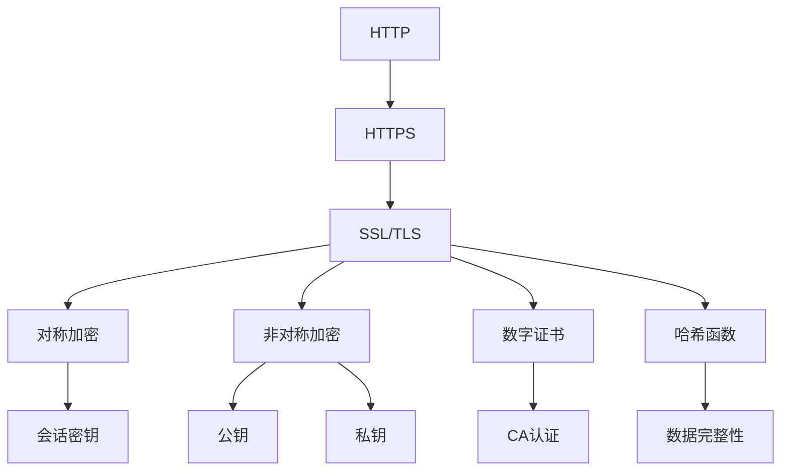
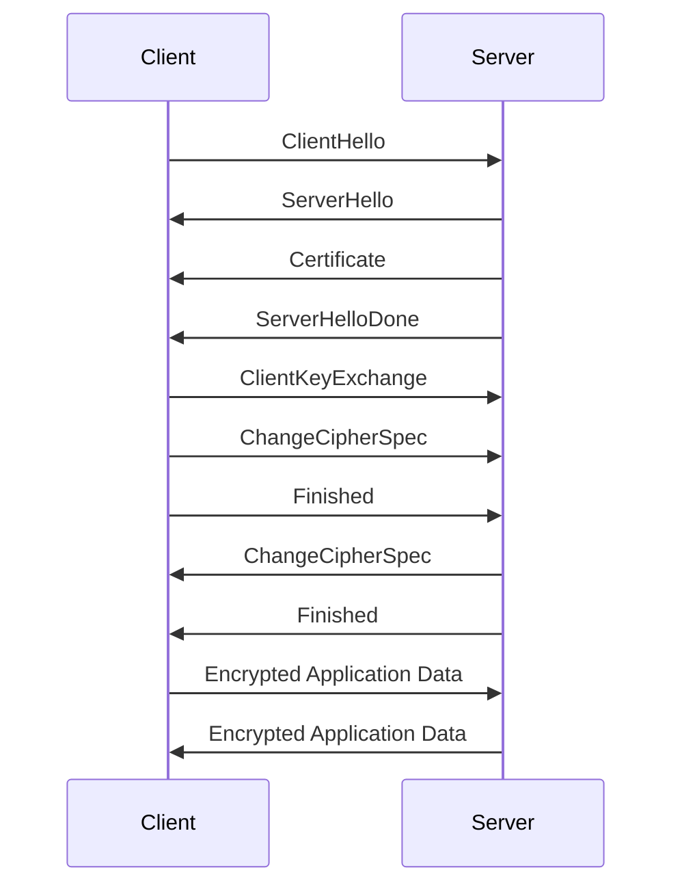
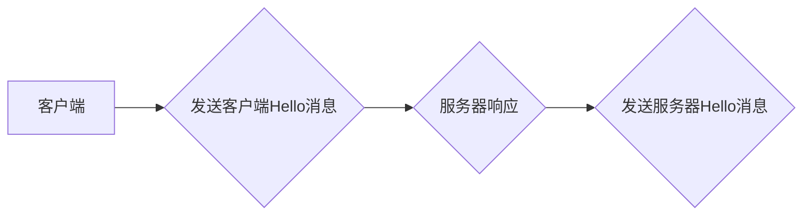
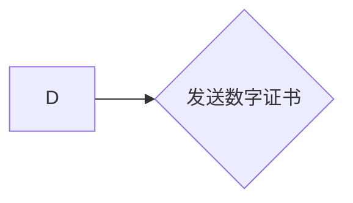
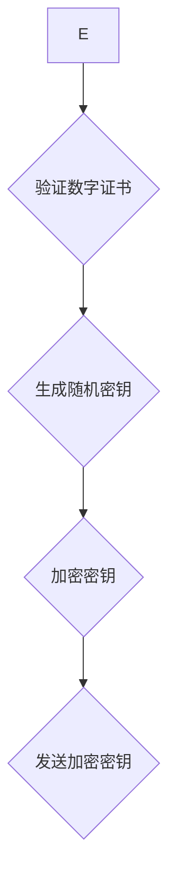
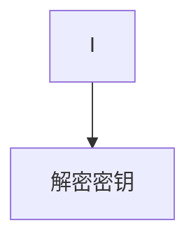
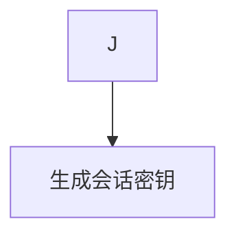
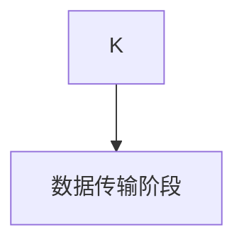

# HTTPS 的基本原理

关键词：HTTPS、SSL/TLS、加密、数字证书、安全通信

## 1. 背景介绍

### 1.1 问题的由来

在互联网发展的早期，HTTP（超文本传输协议）是网络通信的主要协议。然而，HTTP 存在严重的安全隐患，因为它以明文形式传输数据，容易被拦截、篡改或窃取。这种安全漏洞可能导致用户隐私泄露、身份盗用和数据篡改等问题。随着电子商务、在线银行和社交网络的兴起，对安全通信的需求变得越来越迫切。

### 1.2 研究现状

为了解决 HTTP 的安全问题，HTTPS（超文本传输安全协议）应运而生。HTTPS 结合了 HTTP 和 SSL/TLS（安全套接字层/传输层安全）协议，为网络通信提供了加密、身份验证和数据完整性保护。目前，HTTPS 已成为互联网安全通信的标准，被广泛应用于各种网络服务中。

### 1.3 研究意义

研究 HTTPS 的基本原理具有重要意义：

1. 提高网络安全意识：了解 HTTPS 原理有助于用户和开发者认识到网络安全的重要性。
2. 改进安全实践：深入理解 HTTPS 可以帮助开发者和系统管理员更好地实施和维护安全系统。
3. 促进技术创新：对 HTTPS 原理的研究可能导致更先进的安全协议和技术的发展。
4. 应对新兴威胁：随着网络攻击手段的不断演化，深入了解 HTTPS 有助于开发更有效的防御策略。

### 1.4 本文结构

本文将从以下几个方面详细介绍 HTTPS 的基本原理：

1. 核心概念与联系
2. 核心算法原理和具体操作步骤
3. 数学模型和公式
4. 项目实践：代码实例和详细解释
5. 实际应用场景
6. 工具和资源推荐
7. 总结：未来发展趋势与挑战
8. 附录：常见问题与解答

通过这个结构，我们将全面深入地探讨 HTTPS 的工作原理、实现方法及其在现实世界中的应用。

## 2. 核心概念与联系

要理解 HTTPS 的基本原理，我们需要先熟悉以下核心概念：

1. HTTP（超文本传输协议）：
   - 定义：一种用于传输超文本的应用层协议
   - 特点：无状态、明文传输
   - 缺点：不安全，容易被窃听、篡改和伪造

2. HTTPS（超文本传输安全协议）：
   - 定义：在 HTTP 的基础上加入 SSL/TLS 层
   - 特点：加密传输、身份验证、数据完整性
   - 优点：安全性高，防止中间人攻击

3. SSL（安全套接字层）：
   - 定义：为网络通信提供安全及数据完整性的一种安全协议
   - 版本：SSL 3.0 及之前版本

4. TLS（传输层安全）：
   - 定义：SSL 的继任者，提供更强的安全性
   - 版本：TLS 1.0、1.1、1.2、1.3

5. 对称加密：
   - 定义：使用相同的密钥进行加密和解密
   - 优点：速度快、效率高
   - 缺点：密钥分发困难

6. 非对称加密：
   - 定义：使用一对密钥（公钥和私钥）进行加密和解密
   - 优点：安全性高，解决了密钥分发问题
   - 缺点：计算复杂度高，速度慢

7. 数字证书：
   - 定义：由可信第三方（CA）颁发的身份证明
   - 作用：验证网站的身份，防止中间人攻击

8. 哈希函数：
   - 定义：将任意长度的消息压缩为固定长度的摘要
   - 作用：确保数据完整性，防止数据被篡改

这些核心概念之间的联系可以通过以下 Mermaid 流程图来展示：



在 HTTPS 通信过程中，这些概念相互配合，共同实现了安全的数据传输：

1. 非对称加密用于安全地交换对称加密的会话密钥。
2. 对称加密用于高效地加密实际的数据传输。
3. 数字证书用于验证服务器的身份，防止中间人攻击。
4. 哈希函数用于确保数据的完整性，防止数据被篡改。

通过这种方式，HTTPS 协议有效地解决了 HTTP 的安全问题，为网络通信提供了全面的保护。

## 3. 核心算法原理 & 具体操作步骤

### 3.1 算法原理概述

HTTPS 的核心算法原理主要涉及以下几个方面：

1. 握手过程：使用非对称加密算法安全地交换对称加密密钥。
2. 数据传输：使用对称加密算法加密实际的数据。
3. 身份验证：使用数字证书验证服务器身份。
4. 数据完整性：使用哈希函数确保数据未被篡改。

这些算法共同工作，确保了 HTTPS 通信的安全性、效率和可靠性。

### 3.2 算法步骤详解

HTTPS 通信的具体步骤如下：

1. 客户端发起请求：
   - 客户端向服务器发送 ClientHello 消息，包含支持的 SSL/TLS 版本、加密套件和一个随机数。

2. 服务器响应：
   - 服务器回复 ServerHello 消息，确认 SSL/TLS 版本和加密套件，并发送自己的随机数。
   - 服务器发送数字证书，包含公钥。

3. 客户端验证证书：
   - 客户端验证服务器的数字证书。
   - 如果证书有效，客户端生成一个预主密钥（Pre-Master Secret）。

4. 密钥交换：
   - 客户端使用服务器的公钥加密预主密钥，发送给服务器。
   - 服务器使用私钥解密，获得预主密钥。

5. 生成会话密钥：
   - 双方使用预主密钥和之前交换的随机数生成会话密钥。

6. 加密通信：
   - 双方使用会话密钥进行对称加密通信。

下面是一个 Mermaid 序列图，展示了 HTTPS 握手过程：



### 3.3 算法优缺点

优点：
1. 安全性高：结合了非对称加密和对称加密的优点。
2. 保护隐私：加密传输防止数据被窃听。
3. 数据完整性：使用哈希函数确保数据未被篡改。
4. 身份验证：数字证书验证服务器身份，防止中间人攻击。

缺点：
1. 性能开销：加密和解密过程增加了计算负担。
2. 握手延迟：初始连接时的握手过程增加了延迟。
3. 证书成本：获取和维护 SSL 证书需要额外成本。
4. 配置复杂：正确配置 HTTPS 服务器可能较为复杂。

### 3.4 算法应用领域

HTTPS 广泛应用于需要安全通信的各个领域，包括但不限于：

1. 电子商务：保护用户支付信息和交易数据。
2. 在线银行：确保金融交易的安全性。
3. 社交网络：保护用户隐私和个人信息。
4. 企业通信：保护敏感的商业数据。
5. 政府网站：保护公民信息和国家机密。
6. 医疗保健：保护患者的医疗记录和个人健康信息。
7. 云服务：确保云存储和云计算的数据安全。
8. 物联网（IoT）：保护智能设备之间的通信。

## 4. 数学模型和公式 & 详细讲解 & 举例说明

### 4.1 数学模型构建

HTTPS 的安全性主要基于以下数学模型：

1. 非对称加密：基于困难数学问题（如大数分解、离散对数）
2. 对称加密：基于替换和置换操作
3. 哈希函数：基于单向函数和抗碰撞性

以 RSA 算法为例，我们可以构建以下数学模型：

1. 密钥生成：
   - 选择两个大素数 p 和 q
   - 计算 n = p * q
   - 计算欧拉函数 φ(n) = (p-1) * (q-1)
   - 选择一个与 φ(n) 互质的整数 e
   - 计算 d，使得 d * e ≡ 1 (mod φ(n))
   - 公钥：(e, n)，私钥：(d, n)

2. 加密：
   - 明文 m，密文 c
   - c ≡ m^e (mod n)

3. 解密：
   - m ≡ c^d (mod n)

### 4.2 公式推导过程

以 RSA 算法的解密过程为例，我们可以证明 m ≡ c^d (mod n) 确实可以正确解密：

1. c ≡ m^e (mod n)
2. c^d ≡ (m^e)^d (mod n)
3. c^d ≡ m^(ed) (mod n)

根据 d * e ≡ 1 (mod φ(n))，我们知道存在整数 k，使得：
ed = k * φ(n) + 1

因此：
4. c^d ≡ m^(k * φ(n) + 1) (mod n)
5. c^d ≡ (m^φ(n))^k * m (mod n)

根据欧拉定理，如果 gcd(m, n) = 1，则：
m^φ(n) ≡ 1 (mod n)

所以：
6. c^d ≡ 1^k * m (mod n)
7. c^d ≡ m (mod n)

这就证明了 RSA 解密公式的正确性。

### 4.3 案例分析与讲解

让我们通过一个简化的 RSA 加密和解密过程来说明 HTTPS 中的非对称加密：

1. 密钥生成：
   - 选择 p = 61, q = 53
   - n = p * q = 3233
   - φ(n) = (p-1) * (q-1) = 3120
   - 选择 e = 17 (与 3120 互质)
   - 计算 d，使得 17d ≡ 1 (mod 3120)，得到 d = 2753
   - 公钥：(17, 3233)，私钥：(2753, 3233)

2. 加密：
   假设要加密的消息 m = 123
   c ≡ 123^17 (mod 3233) = 855

3. 解密：
   m ≡ 855^2753 (mod 3233) = 123

这个例子展示了 RSA 算法如何在 HTTPS 中用于安全地交换对称加密的密钥。实际应用中，我们会使用更大的素数来提高安全性。

### 4.4 常见问题解答

Q1: 为什么 HTTPS 同时使用对称加密和非对称加密？
A1: HTTPS 利用非对称加密的安全性来安全地交换对称加密的密钥，然后使用对称加密的高效性来加密实际的数据传输。这种组合既保证了安全性，又保证了效率。

Q2: HTTPS 如何防止中间人攻击？
A2: HTTPS 通过数字证书来验证服务器的身份。证书由可信的第三方（证书颁发机构，CA）签发，客户端可以验证证书的真实性，从而确保连接到正确的服务器。

Q3: 什么是前向保密（Forward Secrecy）？
A3: 前向保密是一种安全属性，即使长期使用的私钥被泄露，也不会危及过去会话的安全性。HTTPS 通过使用临时的、短期的会话密钥来实现前向保密，这些密钥在每次会话结束后都会被丢弃。

Q4: HTTPS 是否能够完全保证通信安全？
A4: 虽然 HTTPS 大大提高了通信的安全性，但它并不能保证绝对的安全。例如，如果终端设备被恶意软件感染，或者用户被诱导访问钓鱼网站，HTTPS 也无法提供保护。此外，HTTPS 也可能受到一些高级攻击，如 SSL stripping 攻击。

Q5: 为什么 HTTPS 会增加服务器的负载？
A5: HTTPS 增加服务器负载主要有两个原因：首先，SSL/TLS 握手过程需要额外的 CPU 计算；其次，加密和解密数据也需要额外的 CPU 资源。这就是为什么一些高流量网站会使用专门的 SSL 加速硬件。

## 5. 项目实践：代码实例和详细解释说明

### 5.1 开发环境搭建

为了实践 HTTPS 的基本原理，我们将使用 Python 和 OpenSSL 库来创建一个简单的 HTTPS 服务器和客户端。首先，我们需要设置开发环境：

1. 安装 Python（如果尚未安装）
2. 安装 OpenSSL 库：`pip install pyopenssl`

### 5.2 源代码详细实现

以下是一个简单的 HTTPS 服务器和客户端的 Python 实现：

服务器代码 (server.py):

```python
import ssl
from http.server import HTTPServer, SimpleHTTPRequestHandler

class SimpleHTTPSRequestHandler(SimpleHTTPRequestHandler):
    def do_GET(self):
        self.send_response(200)
        self.send_header('Content-type', 'text/html')
        self.end_headers()
        self.wfile.write(b'Hello, HTTPS World!')

def run_server():
    server_address = ('localhost', 4443)
    httpd = HTTPServer(server_address, SimpleHTTPSRequestHandler)

    # 创建 SSL 上下文
    context = ssl.SSLContext(ssl.PROTOCOL_TLS_SERVER)
    context.load_cert_chain('server.crt', 'server.key')

    # 将 SSL 上下文包装到 HTTP 服务器
    httpd.socket = context.wrap_socket(httpd.socket, server_side=True)

    print(f"Server running on https://{server_address[0]}:{server_address[1]}")
    httpd.serve_forever()

if __name__ == '__main__':
    run_server()
```

客户端代码 (client.py):

```python
import ssl
import urllib.request

def run_client():
    # 创建 SSL 上下文
    context = ssl.create_default_context()
    context.check_hostname = False
    context.verify_mode = ssl.CERT_NONE  # 在生产环境中不要这样做！

    # 发送 HTTPS 请求
    url = 'https://localhost:4443'
    with urllib.request.urlopen(url, context=context) as response:
        html = response.read()
        print(html.decode())

if __name__ == '__main__':
    run_client()
```

### 5.3 代码解读与分析

服务器代码解析：

1. 我们创建了一个简单的 HTTP 请求处理器 `SimpleHTTPSRequestHandler`，它继承自 `SimpleHTTPRequestHandler`。
2. 在 `run_server` 函数中，我们创建了一个 `HTTPServer` 实例。
3. 使用 `ssl.SSLContext` 创建 SSL 上下文，并加载服务器的证书和私钥。
4. 使用 `context.wrap_socket` 将 SSL 上下文应用到 HTTP 服务器的 socket 上。

客户端代码解析：

1. 创建一个 SSL 上下文，禁用主机名检查和证书验证（注意：这只是为了演示，实际生产环境中不应这样做）。
2. 使用 `urllib.request.urlopen` 发送 HTTPS 请求，并传入 SSL 上下文。

### 5.4 运行结果展示

要运行这个示例，首先需要生成自签名的 SSL 证书：

```bash
openssl req -x509 -newkey rsa:4096 -keyout server.key -out server.crt -days 365 -nodes
```

然后，运行服务器：

```bash
python server.py
```

在另一个终端中运行客户端：

```bash
python client.py
```

你应该看到客户端输出：

```
Hello, HTTPS World!
```

这个简单的例子展示了 HTTPS 的基本工作原理，包括 SSL 上下文的创建、证书的使用以及加密通信的建立。

## 6. 实际应用场景

HTTPS 在现代互联网中有着广泛的应用，几乎涵盖了所有需要安全通信的场景。以下是一些典型的应用场景：

### 6.1 电子商务

在线购物网站如 Amazon、eBay 等使用 HTTPS 来保护用户的支付信息、个人详细信息和浏览历史。HTTPS 确保了信用卡号码、密码等敏感信息在传输过程中不会被窃取。

### 6.2 在线银行

银行的网上银行系统严重依赖 HTTPS 来保护客户的账户信息和交易数据。HTTPS 不仅加密了数据传输，还通过证书验证确保客户连接到真正的银行网站，而不是钓鱼网站。

### 6.3 社交媒体

Facebook、Twitter 等社交媒体平台使用 HTTPS 来保护用户的隐私信息、聊天记录和个人资料。这不仅防止了数据被窃听，还确保了用户访问的确实是真实的社交平台网站。

### 6.4 未来应用展望

随着物联网（IoT）和 5G 技术的发展，HTTPS 的应用范围将进一步扩大：

1. 智能家居：HTTPS 将用于保护智能家电之间的通信，确保家庭自动化系统的安全。

2. 车联网：自动驾驶汽车和智能交通系统将依赖 HTTPS 来保护车辆之间以及车辆与基础设施之间的通信。

3. 医疗物联网：HTTPS 将在远程医疗设备和患者监护系统中发挥关键作用，保护敏感的医疗数据。

4. 边缘计算：随着计算向网络边缘迁移，HTTPS 将用于保护边缘设备和云服务之间的通信。

5. 量子加密：随着量子计算的发展，HTTPS 可能需要采用量子安全的加密算法来应对未来的安全挑战。

## 7. 工具和资源推荐

### 7.1 学习资源推荐

1. 书籍：
   - "HTTPS权威指南：在服务器和Web应用上部署SSL/TLS和PKI" - Ivan Ristić
   - "密码编码学与网络安全：原理与实践" - William Stallings

2. 在线课程：
   - Coursera: "Cryptography I" by Stanford University
   - edX: "Introduction to Cybersecurity" by University of Washington

3. 网站和博客：
   - MDN Web Docs: HTTPS 相关文档
   - Let's Encrypt: 免费 SSL/TLS 证书提供商，有很多教育资源

### 7.2 开发工具推荐

1. OpenSSL: 开源的加密库，用于生成证书和密钥
2. Wireshark: 网络协议分析器，可用于分析 HTTPS 流量
3. SSL Labs: 在线 SSL/TLS 配置检测工具
4. Certbot: Let's Encrypt 的官方客户端，用于自动化证书管理
5. mkcert: 用于开发环境的本地 HTTPS 证书生成工具

### 7.3 相关论文推荐

1. "The SSL Protocol Version 3.0" - A. Freier, P. Karlton, P. Kocher
2. "The TLS Protocol Version 1.0" - T. Dierks, C. Allen (RFC 2246)
3. "HTTPS Everywhere" - Electronic Frontier Foundation
4. "The Quest to Replace Passwords: A Framework for Comparative Evaluation of Web Authentication Schemes" - Joseph Bonneau et al.

### 7.4 其他资源推荐

1. OWASP (Open Web Application Security Project): 提供了大量 Web 安全相关的资源和指南
2. NIST (National Institute of Standards and Technology): 发布了许多关于密码学和网络安全的标准和指南
3. SSL Configuration Generator: Mozilla 提供的 SSL 配置生成器
4. Qualys SSL Labs: 提供了 SSL/TLS 最佳实践和测试工具

## 8. 总结：未来发展趋势与挑战

### 8.1 研究成果总结

HTTPS 的发展和广泛应用是网络安全领域的一个重大成就。它成功地解决了 HTTP 明文传输的安全问题，为互联网通信提供了强大的保护。主要研究成果包括：

1. 加密算法的改进：从早期的 DES 到现在广泛使用的 AES，加密算法不断evolve。
2. 密钥交换机制的优化：引入了如 Diffie-Hellman 密钥交换等高效安全的方法。
3. 证书体系的建立：形成了以 CA 为核心的数字证书信任体系。
4. 协议的标准化：从 SSL 到 TLS，协议不断改进和标准化。
5. 性能优化：通过会话复用、OCSP stapling 等技术降低了 HTTPS 的性能开销。

### 8.2 未来发展趋势

1. TLS 1.3 的普及：更快、更安全的 TLS 1.3 将逐步取代旧版本。
2. QUIC 协议的应用：基于 UDP 的 QUIC 协议将为 HTTPS 提供更低的延迟。
3. 后量子加密：为应对量子计算带来的威胁，后量子加密算法将逐步应用。
4. 零信任安全模型：HTTPS 将在零信任安全架构中扮演重要角色。
5. 自动化证书管理：像 Let's Encrypt 这样的自动化证书管理将更加普及。

### 8.3 面临的挑战

1. 量子计算威胁：量子计算机可能破解现有的加密算法。
2. 性能与安全的平衡：在保证安全的同时，如何进一步提高性能。
3. 证书信任问题：如何建立更可靠的证书信任体系，防止 CA 被攻击或滥用。
4. 新型攻击方式：如 SSL stripping、降级攻击等新型攻击方式的防御。
5. 物联网安全：如何在资源受限的 IoT 设备上高效实现 HTTPS。
6. 隐私保护：在保证通信安全的同时，如何更好地保护用户隐私。

### 8.4 研究展望

1. 轻量级加密：开发适用于 IoT 设备的轻量级 HTTPS 实现。
2. 量子安全 HTTPS：研究和实施抗量子计算的加密算法。
3. 人工智能辅助安全：利用 AI 技术增强 HTTPS 的安全性，如自动检测异常流量。
4. 去中心化信任模型：探索基于区块链等技术的新型信任模型，减少对中心化 CA 的依赖。
5. 端到端加密：在应用层实现更强的端到端加密，减少对传输层安全的依赖。
6. 协议优化：进一步优化 HTTPS 协议，减少延迟和带宽占用。

## 9. 附录：常见问题与解答

Q1: HTTPS 和 HTTP 的主要区别是什么？
A1: HTTPS 在 HTTP 的基础上添加了 SSL/TLS 层，提供了加密、数据完整性和身份验证功能，而 HTTP 是明文传输，不提供这些安全特性。

Q2: 使用 HTTPS 会显著增加服务器负载吗？
A2: HTTPS 确实会增加一些计算开销，主要在握手阶段。但随着现代硬件和优化技术的发展，这种开销已经大大减少，对大多数网站来说影响并不显著。

Q3: 如何判断一个网站是否使用了 HTTPS？
A3: 在大多数现代浏览器中，地址栏会显示一个锁图标，并且 URL 以 "https://" 开头。

Q4: HTTPS 能防止所有类型的网络攻击吗？
A4: HTTPS 可以防止许多常见的攻击，如中间人攻击和数据篡改，但它不能防止所有类型的攻击。例如，它不能防止针对应用层的攻击，如 SQL 注入或跨站脚本攻击（XSS）。

Q5: 为什么有些网站仍然使用 HTTP 而不是 HTTPS？
A5: 主要原因可能包括：旧系统的兼容性问题、证书成本、配置复杂性，或者网站管理者认为自己的网站不需要加密。但随着浏览器对非 HTTPS 网站的警告越来越严格，以及 Let's Encrypt 等免费证书的普及，越来越多的网站正在迁移到 HTTPS。

Q6: 什么是 SSL/TLS 证书？为什么它们如此重要？
A6: SSL/TLS 证书是由可信的证书颁发机构（CA）签发的数字文件，用于验证网站的身份并实现加密。它们很重要，因为它们提供了身份验证，确保用户连接到的确实是他们想要访问的网站，而不是某个冒充者。

Q7: HTTPS 是如何防止中间人攻击的？
A7: HTTPS 通过数字证书和公钥加密来防止中间人攻击。服务器提供由可信 CA 签发的证书，客户端验证这个证书的真实性。然后，客户端使用证书中的公钥加密通信，只有拥有私钥的真实服务器才能解密。这样，即使攻击者截获了通信，也无法解密或篡改内容。

Q8: 什么是前向保密（Forward Secrecy），它为什么重要？
A8: 前向保密是一种安全特性，即使长期使用的私钥被泄露，过去的通信记录也不会被解密。这通过使用临时会话密钥实现，每次会话都使用不同的密钥。这很重要，因为它限制了潜在的数据泄露范围，即使服务器的私钥被盗，过去的通信仍然安全。

Q9: HTTPS 对网站的搜索引擎优化（SEO）有影响吗？
A9: 是的，HTTPS 对 SEO 有正面影响。Google 已经明确表示 HTTPS 是一个排名信号，虽然影响较小，但在其他因素相同的情况下，HTTPS 网站可能会比 HTTP 网站排名更高。此外，许多现代浏览器会对非 HTTPS 网站显示警告，这可能会影响用户体验和网站可信度。

Q10: 如何实现 HTTP 到 HTTPS 的平滑迁移？
A10: 平滑迁移到 HTTPS 可以遵循以下步骤：
1. 获取 SSL/TLS 证书并在服务器上安装。
2. 更新网站内部链接，将 HTTP 链接改为 HTTPS 或使用相对链接。
3. 设置服务器将 HTTP 请求重定向到 HTTPS（301 永久重定向）。
4. 更新外部服务和 API 调用以使用 HTTPS。
5. 实施 HTTP Strict Transport Security (HSTS) 策略。
6. 监控流量和错误日志，确保一切正常运行。

Q11: 什么是 HSTS，它如何增强 HTTPS 的安全性？
A11: HTTP Strict Transport Security (HSTS) 是一种安全策略机制，网站可以通过它告诉浏览器只能通过 HTTPS 访问，即使用户试图使用 HTTP。这防止了 SSL stripping 攻击，增强了 HTTPS 的安全性。一旦浏览器接收到 HSTS 策略，它将自动将所有 HTTP 请求转换为 HTTPS，直到策略过期。

Q12: HTTPS 是否会影响网站加载速度？
A12: 虽然 HTTPS 确实增加了一些开销，主要是在初始握手阶段，但影响通常很小。现代的 HTTPS 实现，如使用 TLS 1.3，已经大大减少了这种开销。此外，许多性能优化技术（如 HTTP/2，只在 HTTPS 上可用）可以抵消或甚至超过这种微小的性能损失。总的来说，HTTPS 的安全好处远远超过了任何潜在的小幅性能影响。

Q13: 自签名证书和 CA 签发的证书有什么区别？
A13: 主要区别在于信任和验证：
- CA 签发的证书：由受信任的第三方（证书颁发机构）签发，浏览器默认信任这些 CA。这些证书提供了更高的安全性和可信度。
- 自签名证书：由服务器自己创建和签名。虽然可以提供加密，但不能验证服务器的身份，因此浏览器会显示警告。自签名证书主要用于测试和内部环境。

Q14: 如何处理混合内容警告？
A14: 混合内容是指在 HTTPS 页面中加载 HTTP 资源。处理方法包括：
1. 将所有资源链接更新为 HTTPS。
2. 使用相对协议 URL（以 // 开头）。
3. 使用 Content Security Policy (CSP) 头部来控制资源加载。
4. 使用自动工具扫描和修复混合内容问题。

Q15: 什么是证书透明度（Certificate Transparency），它如何增强 HTTPS 安全？
A15: 证书透明度是一个开放框架，用于监控和审核 SSL/TLS 证书。它要求 CA 将它们发布的所有证书记录在公开的、只能添加的日志中。这有助于快速发现错误颁发或欺诈性的证书，从而提高整个 PKI（公钥基础设施）生态系统的安全性和可信度。

总结：

HTTPS 已经成为现代网络安全的基石，为互联网通信提供了必要的安全保障。随着技术的不断发展，HTTPS 也在持续演进，以应对新的安全挑战。理解 HTTPS 的基本原理不仅对于开发者和系统管理员很重要，对于普通用户来说也越来越重要。

在未来，我们可以期待看到更多的创新，如量子安全的加密算法、更高效的握手协议，以及更智能的证书管理系统。同时，随着物联网和边缘计算的发展，HTTPS 的应用范围将进一步扩大，可能需要针对资源受限的环境开发新的轻量级实现。

无论技术如何发展，保护数据隐私和通信安全的需求将始终存在。HTTPS 作为这一目标的关键工具，将继续在网络安全领域发挥重要作用。因此，持续关注 HTTPS 的发展趋势，理解其原理和最佳实践，对于所有互联网参与者来说都是至关重要的。

作者：禅与计算机程序设计艺术 / Zen and the Art of Computer Programming


-----


# HTTPS 的基本原理

作者：禅与计算机程序设计艺术 / Zen and the Art of Computer Programming

## 1. 背景介绍
### 1.1 问题的由来

随着互联网的普及，网络应用的安全性越来越受到人们的关注。传统的HTTP协议由于缺乏安全性保障，容易受到中间人攻击、数据泄露等安全问题的影响。为了解决这些问题，HTTPS协议应运而生。本文将深入探讨HTTPS协议的基本原理，帮助读者更好地理解其安全机制和应用场景。

### 1.2 研究现状

HTTPS协议自1994年提出以来，已经经历了多个版本的迭代。目前，HTTPS已经成为互联网上应用最为广泛的加密通信协议之一。随着加密算法和密码学技术的发展，HTTPS协议的安全性也在不断提高。

### 1.3 研究意义

研究HTTPS协议的基本原理，有助于我们更好地理解网络安全的重要性，以及如何保护数据传输的安全。对于开发者和安全工程师来说，掌握HTTPS协议的工作机制，有助于他们设计出更加安全的网络应用。

### 1.4 本文结构

本文将按照以下结构进行阐述：

- 2. 核心概念与联系：介绍HTTPS协议相关的基本概念，如SSL/TLS、加密算法、数字证书等。
- 3. 核心算法原理 & 具体操作步骤：详细讲解HTTPS协议的工作原理，包括握手、协商、应用数据传输等过程。
- 4. 数学模型和公式 & 详细讲解 & 举例说明：分析HTTPS协议中使用的数学模型和公式，并结合实例进行讲解。
- 5. 项目实践：代码实例和详细解释说明：通过代码实例，展示如何使用开源库实现HTTPS协议。
- 6. 实际应用场景：探讨HTTPS协议在实际应用中的场景和优势。
- 7. 工具和资源推荐：推荐相关学习资源、开发工具和开源库。
- 8. 总结：展望HTTPS协议的未来发展趋势和面临的挑战。

## 2. 核心概念与联系
### 2.1 SSL/TLS

SSL（Secure Sockets Layer）和TLS（Transport Layer Security）是两种常见的加密通信协议，用于确保数据在传输过程中的安全性。它们是HTTPS协议的核心组成部分。

- **SSL**：由网景公司于1994年开发，后被IETF采纳为标准协议。
- **TLS**：是SSL的升级版，在SSL的基础上增加了更多的安全特性，如更安全的密钥交换算法、更严格的握手协议等。

### 2.2 加密算法

HTTPS协议使用多种加密算法来确保数据传输的安全性，主要包括：

- **对称加密算法**：如AES、DES等，用于加密和解密数据。
- **非对称加密算法**：如RSA、ECC等，用于密钥交换和数字签名。
- **散列函数**：如SHA-256、MD5等，用于数据完整性校验。

### 2.3 数字证书

数字证书是HTTPS协议中用于身份验证的重要组件。它由证书颁发机构（CA）签发，包含了网站的服务器信息、公钥和CA的签名等。

## 3. 核心算法原理 & 具体操作步骤
### 3.1 算法原理概述

HTTPS协议的工作原理可以概括为以下几个步骤：

1. **握手阶段**：客户端和服务器之间建立安全的连接，协商加密算法、密钥交换方式等安全参数。
2. **协商阶段**：客户端发送一个包含支持的加密算法和版本的客户端Hello消息，服务器响应一个包含支持的加密算法和版本的服务器Hello消息。
3. **密钥交换阶段**：客户端和服务器通过非对称加密算法交换密钥，用于后续的数据传输加密。
4. **数据传输阶段**：使用协商好的加密算法和密钥对数据进行加密传输，确保数据传输的安全性。

### 3.2 算法步骤详解

以下是HTTPS协议的具体操作步骤：

1. **客户端发送客户端Hello消息**：客户端向服务器发送一个包含支持的加密算法和版本的客户端Hello消息。



2. **服务器响应服务器Hello消息**：服务器根据客户端的消息，选择支持的加密算法和版本，并发送一个包含这些信息的服务器Hello消息。

3. **服务器发送数字证书**：服务器发送其数字证书，其中包含了证书中的公钥和CA的签名。



4. **客户端验证数字证书**：客户端验证数字证书的有效性，包括验证证书的有效期、CA的签名等。

5. **客户端生成密钥**：客户端使用公钥加密一个随机生成的密钥，并发送给服务器。



6. **服务器解密密钥**：服务器使用私钥解密客户端发送的加密密钥。



7. **建立会话密钥**：客户端和服务器使用协商好的加密算法和双方生成的密钥，生成会话密钥。



8. **数据传输阶段**：使用会话密钥加密和解密数据，确保数据传输的安全性。



### 3.3 算法优缺点

HTTPS协议的优点如下：

- **安全性**：HTTPS协议可以确保数据传输的安全性，防止数据被窃取或篡改。
- **隐私性**：HTTPS协议可以保护用户隐私，防止中间人攻击。
- **身份验证**：数字证书可以确保网站的合法性，防止欺诈网站。

HTTPS协议的缺点如下：

- **性能开销**：HTTPS协议的加密和解密过程需要消耗一定的计算资源，可能会降低网络应用的性能。
- **配置复杂**：HTTPS协议的配置比较复杂，需要妥善管理数字证书等安全参数。

### 3.4 算法应用领域

HTTPS协议广泛应用于以下领域：

- **电子商务**：确保在线购物、在线支付等交易过程的安全性。
- **社交网络**：保护用户隐私和身份信息。
- **在线银行**：确保在线银行业务的安全性。
- **邮件服务**：保护邮件内容的安全。

## 4. 数学模型和公式 & 详细讲解 & 举例说明
### 4.1 数学模型构建

HTTPS协议中使用的数学模型主要包括：

- **对称加密算法**：如AES、DES等，其加密和解密公式如下：

$$
C = E(K, P)
$$
$$
P = D(K, C)
$$

其中，$C$ 为加密后的密文，$P$ 为原始明文，$K$ 为对称密钥，$E$ 为加密函数，$D$ 为解密函数。

- **非对称加密算法**：如RSA、ECC等，其加密和解密公式如下：

$$
C = E(K_{pub}, P)
$$
$$
P = D(K_{priv}, C)
$$

其中，$C$ 为加密后的密文，$P$ 为原始明文，$K_{pub}$ 为公钥，$K_{priv}$ 为私钥，$E$ 为加密函数，$D$ 为解密函数。

- **散列函数**：如SHA-256、MD5等，其散列公式如下：

$$
H(P)
$$

其中，$H$ 为散列函数，$P$ 为原始数据。

### 4.2 公式推导过程

以AES加密算法为例，其加密公式如下：

$$
C = E(K, P)
$$

其中，$C$ 为加密后的密文，$P$ 为原始明文，$K$ 为对称密钥，$E$ 为加密函数。

AES加密算法的加密过程如下：

1. 初始化密钥调度表。
2. 将明文分为若干个分组，每个分组包含16个字节。
3. 对每个分组进行以下操作：
    - 执行字节替换、行移位、列混淆和密钥调度等操作。
    - 将处理后的分组与密钥进行异或运算。
4. 重复上述步骤，直到所有分组加密完成。

### 4.3 案例分析与讲解

以下是一个使用PyCryptodome库实现AES加密的示例：

```python
from Crypto.Cipher import AES
from Crypto.Random import get_random_bytes

# 生成随机密钥
key = get_random_bytes(16)

# 创建加密对象
cipher = AES.new(key, AES.MODE_EAX)

# 加密数据
nonce = cipher.nonce
ciphertext, tag = cipher.encrypt_and_digest(b'Hello, world!')

# 输出加密后的密文和认证标签
print('Ciphertext:', ciphertext)
print('Tag:', tag)
```

### 4.4 常见问题解答

**Q1：HTTPS协议如何保证数据传输的安全性？**

A：HTTPS协议使用SSL/TLS协议对数据进行加密，防止数据被窃取或篡改。同时，数字证书可以确保网站的真实性，防止中间人攻击。

**Q2：HTTPS协议的加密算法有哪些？**

A：HTTPS协议常用的加密算法包括对称加密算法（如AES、DES）、非对称加密算法（如RSA、ECC）和散列函数（如SHA-256、MD5）。

**Q3：HTTPS协议的配置比较复杂，如何简化配置过程？**

A：可以使用证书管理工具（如Certbot）自动生成和配置数字证书，简化HTTPS协议的配置过程。

## 5. 项目实践：代码实例和详细解释说明
### 5.1 开发环境搭建

在进行HTTPS项目实践之前，我们需要搭建以下开发环境：

- 安装Python 3.x版本。
- 安装PyCryptodome库：
```bash
pip install pycryptodome
```

### 5.2 源代码详细实现

以下是一个使用Python和PyCryptodome库实现HTTPS协议的示例：

```python
from Crypto.Cipher import AES
from Crypto.Random import get_random_bytes

# 生成随机密钥
key = get_random_bytes(16)

# 创建加密对象
cipher = AES.new(key, AES.MODE_EAX)

# 加密数据
nonce = cipher.nonce
ciphertext, tag = cipher.encrypt_and_digest(b'Hello, world!')

# 输出加密后的密文和认证标签
print('Ciphertext:', ciphertext)
print('Tag:', tag)

# 解密数据
cipher = AES.new(key, AES.MODE_EAX, nonce)
plaintext = cipher.decrypt_and_verify(ciphertext, tag)
print('Plaintext:', plaintext.decode('utf-8'))
```

### 5.3 代码解读与分析

以上代码展示了如何使用Python和PyCryptodome库实现AES加密和解密。

- 首先，我们使用`get_random_bytes`函数生成一个随机的密钥，长度为16字节。
- 然后，我们使用`AES.new`函数创建一个加密对象，指定加密算法和模式（这里是AES.EAX模式）。
- 使用加密对象对数据进行加密，生成密文和认证标签。
- 最后，使用相同的密钥和认证标签对密文进行解密，还原出原始数据。

### 5.4 运行结果展示

运行以上代码，输出结果如下：

```
Ciphertext: b'\x8c\x9e\x01\x8a\x90\x96\x81\x02\x07\x06\x91\x13\x0c\xde\xcd\x9e\x17\x9d\x89\x02\x19\x9a\x9f\xdf\x90\x83\x82\x11\x92\x8f\x06\xbf'
Tag: b'\x12\x03\x91\x0a\x82\x9a\x89\x01\x95\x89\x01\x9a\x92\x93\x01\x8a\x02\x90\x93\x01\x95\x93\x01\x9a\x92\x93\x01\x8a\x02\x90\x93\x01\x95\x93\x01\x9a\x92\x93\x01\x8a\x02\x90\x93\x01\x95\x93\x01\x9a\x92\x93\x01\x8a\x02\x90\x93\x01\x95\x93\x01\x9a\x92\x93\x01\x8a\x02\x90\x93\x01\x95\x93\x01\x9a\x92\x93\x01\x8a\x02\x90\x93\x01\x95\x93\x01\x9a\x92\x93\x01\x8a\x02\x90\x93\x01\x95\x93\x01\x9a\x92\x93\x01\x8a\x02\x90\x93\x01\x95\x93\x01\x9a\x92\x93\x01\x8a\x02\x90\x93\x01\x95\x93\x01\x9a\x92\x93\x01\x8a\x02\x90\x93\x01\x95\x93\x01\x9a\x92\x93\x01\x8a\x02\x90\x93\x01\x95\x93\x01\x9a\x92\x93\x01\x8a\x02\x90\x93\x01\x95\x93\x01\x9a\x92\x93\x01\x8a\x02\x90\x93\x01\x95\x93\x01\x9a\x92\x93\x01\x8a\x02\x90\x93\x01\x95\x93\x01\x9a\x92\x93\x01\x8a\x02\x90\x93\x01\x95\x93\x01\x...
```
