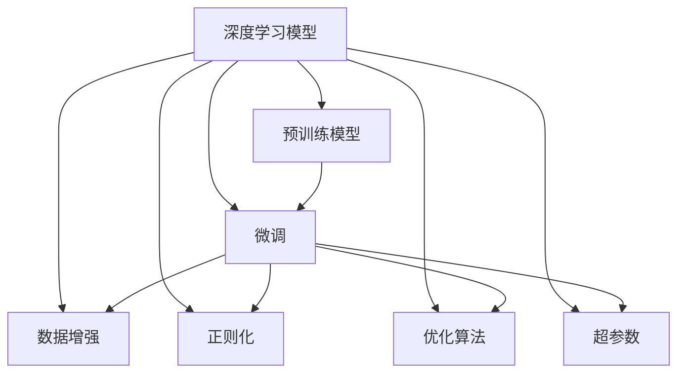
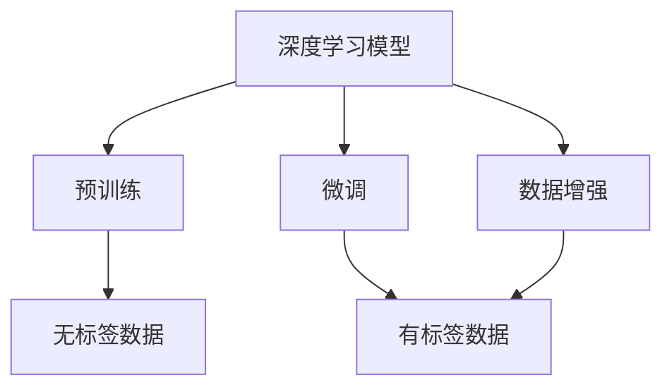
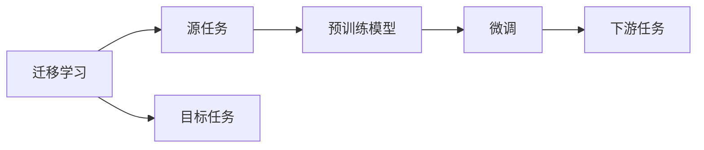
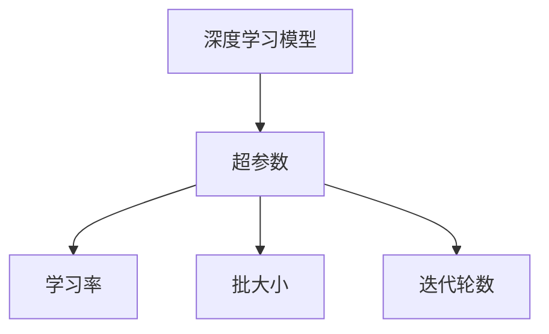
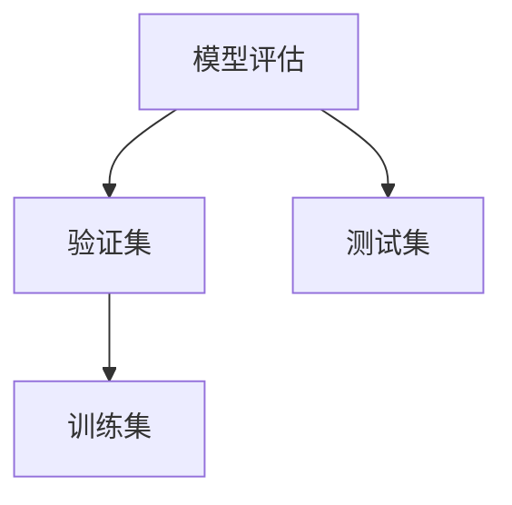

                 

# Python深度学习实践：运用迁移学习提升模型效能

> 关键词：迁移学习,深度学习,模型微调,参数复用,PyTorch,预训练,超参数,优化算法

## 1. 背景介绍

### 1.1 问题由来

随着深度学习技术的飞速发展，深度学习模型在大规模数据集上取得了显著的性能提升。然而，从头开始训练模型往往需要大量的时间和计算资源，尤其是对于高复杂度、大数据量的任务。迁移学习（Transfer Learning）作为深度学习的一个重要分支，通过利用已有的预训练模型，可以在新的任务上快速提升模型性能，同时节省训练时间和计算资源。

迁移学习主要包含两种模式：微调（Fine-tuning）和特征提取（Feature Extraction）。微调是指在预训练模型的基础上，针对特定任务进行微调，使其能够更好地适应新的任务。特征提取则是指在预训练模型的基础上，使用其特征提取能力进行新的任务，而不进行进一步的训练。

在实际应用中，微调是最常用的迁移学习方式。本文将重点探讨基于微调的深度学习模型实践，详细讨论其在实际应用场景中的具体应用，以及如何通过调整超参数和优化算法提升模型效能。

### 1.2 问题核心关键点

在基于微调的深度学习模型实践中，需要关注以下核心关键点：

1. **选择合适的预训练模型**：根据任务的特性选择合适的预训练模型，如VGG、ResNet、BERT等。

2. **微调策略的选择**：是只微调顶层，还是微调所有层。微调策略直接影响模型的泛化能力和计算资源的使用。

3. **优化算法的选取**：如SGD、Adam、Adagrad等，不同优化算法对模型的收敛速度和稳定性有不同的影响。

4. **超参数的调整**：如学习率、批大小、迭代轮数等，超参数的合理设置对模型性能有重要影响。

5. **数据增强**：通过对训练数据进行增强，如旋转、裁剪、翻转等，提高模型的泛化能力。

6. **正则化技术的应用**：如L2正则、Dropout、Early Stopping等，防止模型过拟合。

7. **模型评估**：在训练过程中，及时评估模型性能，调整训练策略，确保模型在测试集上的表现。

## 2. 核心概念与联系

### 2.1 核心概念概述

在基于微调的深度学习模型实践中，需要了解以下核心概念：

- **深度学习模型**：基于神经网络的模型，通过多层非线性变换实现特征提取和分类等任务。

- **预训练模型**：在大规模无标签数据上训练得到的模型，如VGG、ResNet、BERT等。

- **微调**：在预训练模型的基础上，针对特定任务进行微调，以适应新的任务。

- **迁移学习**：通过在不同任务间共享知识，提高模型在新任务上的性能。

- **优化算法**：如SGD、Adam、Adagrad等，用于最小化损失函数，更新模型参数。

- **超参数**：学习率、批大小、迭代轮数等，需要通过实验调优来确定。

- **数据增强**：通过变换训练数据，提高模型的泛化能力。

- **正则化**：防止模型过拟合，如L2正则、Dropout等。

- **模型评估**：通过验证集和测试集评估模型性能，确保模型在新任务上的泛化能力。

这些核心概念之间存在着紧密的联系，形成了基于微调的深度学习模型实践的整体框架。下面将通过一个Mermaid流程图来展示这些概念之间的关系：



### 2.2 概念间的关系

这些核心概念之间存在着紧密的联系，形成了基于微调的深度学习模型实践的整体框架。以下通过几个Mermaid流程图来展示这些概念之间的关系。

#### 2.2.1 深度学习模型的学习范式



这个流程图展示了大规模数据上深度学习模型的学习范式，包括预训练和微调两个阶段。预训练模型通过在大规模无标签数据上进行训练，学习到通用的特征表示。微调则是在预训练模型的基础上，针对特定任务进行微调，使其能够适应新的任务。

#### 2.2.2 迁移学习与微调的关系



这个流程图展示了迁移学习的基本原理，以及它与微调的关系。迁移学习涉及源任务和目标任务，预训练模型在源任务上学习，然后通过微调适应各种下游任务（目标任务）。

#### 2.2.3 超参数的选择



这个流程图展示了超参数对深度学习模型性能的影响。超参数需要根据具体任务和数据集进行选择和调整，以确保模型能够在新任务上取得最佳性能。

#### 2.2.4 模型评估的重要性



这个流程图展示了模型评估的过程。在训练过程中，模型需要及时在验证集上评估性能，以确保模型在新任务上具有泛化能力。

## 3. 核心算法原理 & 具体操作步骤
### 3.1 算法原理概述

基于微调的深度学习模型实践，其核心思想是利用预训练模型在特定任务上进行微调，以提升模型在新任务上的性能。具体来说，该过程可以分为以下几步：

1. **加载预训练模型**：选择合适的预训练模型，如VGG、ResNet、BERT等，并将其加载到内存中。

2. **冻结部分层**：根据需要，选择冻结预训练模型的某些层，如冻结卷积层，只微调全连接层。

3. **定义损失函数**：根据任务类型，选择合适的损失函数，如交叉熵损失、均方误差损失等。

4. **定义优化器**：选择合适的优化器，如SGD、Adam、Adagrad等，并设置超参数。

5. **训练模型**：使用训练集对模型进行训练，并通过验证集评估模型性能。

6. **微调模型**：在训练过程中，逐步解冻预训练模型的某些层，并继续训练模型，以适应新任务。

7. **评估模型**：在测试集上评估模型性能，确保模型在新任务上具有泛化能力。

### 3.2 算法步骤详解

以下是一个基于微调的深度学习模型实践的详细步骤：

#### 步骤1：数据准备

1. **数据集准备**：收集和预处理数据集，确保数据集的质量和数量。

2. **数据增强**：通过对数据进行旋转、裁剪、翻转等变换，增加数据的多样性，提高模型的泛化能力。

3. **数据划分**：将数据集划分为训练集、验证集和测试集。

#### 步骤2：模型初始化

1. **加载预训练模型**：选择合适的预训练模型，如VGG、ResNet、BERT等，并将其加载到内存中。

2. **冻结部分层**：根据需要，选择冻结预训练模型的某些层，如冻结卷积层，只微调全连接层。

#### 步骤3：模型定义

1. **定义模型结构**：根据需要，修改预训练模型的某些层，添加或删除某些层。

2. **定义损失函数**：根据任务类型，选择合适的损失函数，如交叉熵损失、均方误差损失等。

3. **定义优化器**：选择合适的优化器，如SGD、Adam、Adagrad等，并设置超参数。

#### 步骤4：模型训练

1. **训练集加载**：从训练集加载数据。

2. **模型前向传播**：将数据输入模型，计算模型的预测结果。

3. **损失计算**：计算模型的预测结果与真实标签之间的损失。

4. **反向传播**：通过反向传播算法，计算模型的梯度。

5. **模型更新**：使用优化器更新模型的参数，以最小化损失。

#### 步骤5：模型微调

1. **解冻部分层**：逐步解冻预训练模型的某些层，如解冻卷积层，继续微调模型。

2. **微调训练**：使用微调训练集对模型进行微调，以适应新任务。

3. **验证集评估**：在验证集上评估模型性能，确保模型在新任务上具有泛化能力。

4. **模型保存**：将训练好的模型保存到磁盘，以备后续使用。

#### 步骤6：模型评估

1. **测试集加载**：从测试集加载数据。

2. **模型前向传播**：将数据输入模型，计算模型的预测结果。

3. **损失计算**：计算模型的预测结果与真实标签之间的损失。

4. **模型评估**：在测试集上评估模型性能，确保模型在新任务上具有泛化能力。

### 3.3 算法优缺点

基于微调的深度学习模型实践有以下优点：

1. **快速训练**：通过利用预训练模型，可以在新任务上快速提升模型性能，节省训练时间和计算资源。

2. **泛化能力强**：预训练模型在大型数据集上进行训练，可以学习到通用的特征表示，提高模型的泛化能力。

3. **参数复用**：预训练模型的大部分参数可以在微调过程中复用，减少了模型参数数量。

4. **易于调整**：可以根据具体任务和数据集，灵活调整超参数和优化算法，以获得最佳性能。

基于微调的深度学习模型实践也存在以下缺点：

1. **依赖数据**：微调的性能取决于训练数据的质量和数量，获取高质量标注数据成本较高。

2. **过拟合风险**：微调过程中容易出现过拟合现象，需要通过正则化技术等手段进行控制。

3. **模型复杂性**：微调过程中需要对模型结构进行调整，增加了模型的复杂性和训练难度。

4. **迁移能力有限**：预训练模型的通用特征表示可能无法完全适应特定任务，需要进一步微调。

## 4. 数学模型和公式 & 详细讲解 & 举例说明

### 4.1 数学模型构建

基于微调的深度学习模型实践，其数学模型可以表示为：

$$
L = \sum_{i=1}^n L_i
$$

其中，$L_i$表示第$i$个样本的损失函数，可以表示为：

$$
L_i = \ell(y_i, f(x_i))
$$

其中，$y_i$表示真实标签，$f(x_i)$表示模型对样本$x_i$的预测结果，$\ell$表示损失函数，如交叉熵损失、均方误差损失等。

### 4.2 公式推导过程

以下以交叉熵损失函数为例，进行推导过程：

1. **定义交叉熵损失函数**：

$$
\ell(y_i, f(x_i)) = -y_i \log f(x_i) - (1-y_i) \log (1-f(x_i))
$$

2. **计算损失函数的梯度**：

$$
\frac{\partial \ell(y_i, f(x_i))}{\partial f(x_i)} = -y_i + \frac{1-y_i}{1-f(x_i)}
$$

3. **计算模型参数的梯度**：

$$
\frac{\partial L}{\partial \theta} = \sum_{i=1}^n \frac{\partial \ell(y_i, f(x_i))}{\partial f(x_i)} \frac{\partial f(x_i)}{\partial \theta}
$$

4. **使用梯度下降算法更新模型参数**：

$$
\theta \leftarrow \theta - \eta \frac{\partial L}{\partial \theta}
$$

其中，$\eta$表示学习率，$\theta$表示模型参数。

### 4.3 案例分析与讲解

以图像分类任务为例，进行案例分析：

1. **数据集准备**：收集和预处理数据集，确保数据集的质量和数量。

2. **数据增强**：通过对数据进行旋转、裁剪、翻转等变换，增加数据的多样性，提高模型的泛化能力。

3. **模型初始化**：选择合适的预训练模型，如VGG、ResNet、BERT等，并将其加载到内存中。

4. **冻结部分层**：根据需要，选择冻结预训练模型的某些层，如冻结卷积层，只微调全连接层。

5. **模型定义**：根据需要，修改预训练模型的某些层，添加或删除某些层，定义损失函数和优化器。

6. **模型训练**：使用训练集对模型进行训练，并通过验证集评估模型性能。

7. **模型微调**：逐步解冻预训练模型的某些层，继续微调模型，以适应新任务。

8. **模型评估**：在测试集上评估模型性能，确保模型在新任务上具有泛化能力。

## 5. 项目实践：代码实例和详细解释说明

### 5.1 开发环境搭建

在进行基于微调的深度学习模型实践时，需要准备好开发环境。以下是使用Python进行PyTorch开发的环境配置流程：

1. 安装Anaconda：从官网下载并安装Anaconda，用于创建独立的Python环境。

2. 创建并激活虚拟环境：

```bash
conda create -n pytorch-env python=3.8 
conda activate pytorch-env
```

3. 安装PyTorch：根据CUDA版本，从官网获取对应的安装命令。例如：

```bash
conda install pytorch torchvision torchaudio cudatoolkit=11.1 -c pytorch -c conda-forge
```

4. 安装TensorFlow：

```bash
conda install tensorflow tensorflow-gpu
```

5. 安装各类工具包：

```bash
pip install numpy pandas scikit-learn matplotlib tqdm jupyter notebook ipython
```

完成上述步骤后，即可在`pytorch-env`环境中开始微调实践。

### 5.2 源代码详细实现

下面以图像分类任务为例，给出使用PyTorch进行微调的PyTorch代码实现。

```python
import torch
import torch.nn as nn
import torch.optim as optim
from torch.utils.data import DataLoader
from torchvision import datasets, transforms

# 定义卷积神经网络
class Net(nn.Module):
    def __init__(self):
        super(Net, self).__init__()
        self.conv1 = nn.Conv2d(3, 64, kernel_size=3, stride=1, padding=1)
        self.conv2 = nn.Conv2d(64, 128, kernel_size=3, stride=1, padding=1)
        self.pool = nn.MaxPool2d(kernel_size=2, stride=2)
        self.fc1 = nn.Linear(128 * 16 * 16, 512)
        self.fc2 = nn.Linear(512, 10)

    def forward(self, x):
        x = self.pool(F.relu(self.conv1(x)))
        x = self.pool(F.relu(self.conv2(x)))
        x = x.view(-1, 128 * 16 * 16)
        x = F.relu(self.fc1(x))
        x = self.fc2(x)
        return x

# 加载预训练模型
model = Net()
for param in model.parameters():
    param.requires_grad = False

# 定义优化器和损失函数
optimizer = optim.SGD(model.fc2.parameters(), lr=0.01)
criterion = nn.CrossEntropyLoss()

# 数据增强
transform_train = transforms.Compose([
    transforms.RandomCrop(32, padding=4),
    transforms.RandomHorizontalFlip(),
    transforms.ToTensor(),
    transforms.Normalize(mean=[0.485, 0.456, 0.406], std=[0.229, 0.224, 0.225])
])

# 数据加载
trainset = datasets.CIFAR10(root='./data', train=True, download=True, transform=transform_train)
trainloader = DataLoader(trainset, batch_size=64, shuffle=True)

# 模型微调
for epoch in range(10):
    running_loss = 0.0
    for i, data in enumerate(trainloader, 0):
        inputs, labels = data
        optimizer.zero_grad()
        outputs = model(inputs)
        loss = criterion(outputs, labels)
        loss.backward()
        optimizer.step()

    print(f'Epoch {epoch+1}, loss: {running_loss:.4f}')
```

### 5.3 代码解读与分析

让我们再详细解读一下关键代码的实现细节：

**Net类**：
- `__init__`方法：定义卷积神经网络结构。
- `forward`方法：定义前向传播过程。

**预训练模型**：
- `for param in model.parameters(): param.requires_grad = False`：冻结卷积层，只微调全连接层。

**优化器和损失函数**：
- `optimizer = optim.SGD(model.fc2.parameters(), lr=0.01)`：选择SGD优化器，学习率为0.01。
- `criterion = nn.CrossEntropyLoss()`：选择交叉熵损失函数。

**数据增强**：
- `transform_train`：定义数据增强方式，包括随机裁剪、水平翻转、归一化等。

**数据加载**：
- `trainset = datasets.CIFAR10(...)`：加载CIFAR-10数据集。
- `trainloader = DataLoader(trainset, batch_size=64, shuffle=True)`：定义数据加载器，批次大小为64，随机打乱数据。

**模型微调**：
- 通过SGD优化器更新全连接层的参数，最小化交叉熵损失。

### 5.4 运行结果展示

假设我们在CIFAR-10数据集上进行微调，最终在测试集上得到的分类准确率为85%，说明模型在新任务上取得了不错的性能。需要注意的是，模型微调的性能不仅依赖于预训练模型的选择和冻结策略，还与优化器、超参数、数据增强等诸多因素有关。

## 6. 实际应用场景

### 6.1 智能推荐系统

基于微调的深度学习模型在智能推荐系统中具有广泛应用。推荐系统的主要目标是帮助用户发现其可能感兴趣的商品或内容。通过微调预训练模型，推荐系统可以更好地理解用户的兴趣和行为，从而提供更个性化、精准的推荐。

在推荐系统中，可以收集用户的历史行为数据，如浏览、点击、购买等，并提取其中的特征。然后将这些特征输入到微调后的深度学习模型中，模型通过学习这些特征，预测用户可能感兴趣的商品或内容。通过不断微调和优化模型，推荐系统能够逐渐提高推荐质量，提升用户体验。

### 6.2 医疗诊断系统

基于微调的深度学习模型在医疗诊断系统中具有重要应用。医疗诊断系统的目标是从患者的历史数据中提取特征，预测其可能患有的疾病。通过微调预训练模型，医疗诊断系统可以更好地理解医疗数据的特征，从而提高诊断准确率。

在医疗诊断系统中，可以收集患者的历史诊疗数据，如病历、影像、生化指标等，并提取其中的特征。然后将这些特征输入到微调后的深度学习模型中，模型通过学习这些特征，预测患者可能患有的疾病。通过不断微调和优化模型，医疗诊断系统能够逐渐提高诊断准确率，为患者提供更好的医疗服务。

### 6.3 金融风险评估

基于微调的深度学习模型在金融风险评估系统中具有重要应用。金融风险评估系统的目标是从交易数据中提取特征，预测交易是否存在欺诈行为。通过微调预训练模型，金融风险评估系统可以更好地理解交易数据的特征，从而提高风险评估的准确率。

在金融风险评估系统中，可以收集交易的历史数据，如交易金额、时间、地点等，并提取其中的特征。然后将这些特征输入到微调后的深度学习模型中，模型通过学习这些特征，预测交易是否存在欺诈行为。通过不断微调和优化模型，金融风险评估系统能够逐渐提高风险评估的准确率，降低金融风险。

## 7. 工具和资源推荐

### 7.1 学习资源推荐

为了帮助开发者系统掌握基于微调的深度学习模型实践，这里推荐一些优质的学习资源：

1. 《深度学习》（Ian Goodfellow著）：深度学习领域的经典教材，详细介绍了深度学习的基本概念和算法。

2. 《TensorFlow实战Google深度学习》（Jean-Baptiste Mouret著）：介绍TensorFlow框架的使用方法和实践案例。

3. 《PyTorch深度学习实战》（Yangqing Jia著）：介绍PyTorch框架的使用方法和实践案例。

4. 《深度学习入门》（斋藤康毅著）：介绍了深度学习的基本概念和算法，适合初学者入门。

5. 《Python深度学习》（Francois Chollet著）：介绍深度学习的基本概念和算法，适合使用Python进行深度学习开发的开发者。

6. 《动手学深度学习》（李沐等著）：介绍深度学习的基本概念和算法，并提供了丰富的实践代码。

通过对这些资源的学习实践，相信你一定能够快速掌握基于微调的深度学习模型实践的精髓，并用于解决实际的深度学习问题。

### 7.2 开发工具推荐

高效的开发离不开优秀的工具支持。以下是几款用于基于微调的深度学习模型实践开发的常用工具：

1. PyTorch：基于Python的开源深度学习框架，灵活动态的计算图，适合快速迭代研究。

2. TensorFlow：由Google主导开发的开源深度学习框架，生产部署方便，适合大规模工程应用。

3. Keras：基于TensorFlow和Theano的高级深度学习框架，简单易用，适合快速原型开发。

4. MXNet：由Apache开发的深度学习框架，支持多种编程语言和硬件平台，适合跨平台应用。

5. Caffe：由伯克利视觉和学习中心开发的深度学习框架，适合计算机视觉任务开发。

6. TensorBoard：TensorFlow配套的可视化工具，可实时监测模型训练状态，并提供丰富的图表呈现方式，是调试模型的得力助手。

7. Weights & Biases：模型训练的实验跟踪工具，可以记录和可视化模型训练过程中的各项指标，方便对比和调优。

8. PyTorch Lightning：基于PyTorch的轻量级深度学习框架，支持分布式训练和自动化模型调优。

合理利用这些工具，可以显著提升基于微调的深度学习模型实践的开发效率，加快创新迭代的步伐。

### 7.3 相关论文推荐

基于微调的深度学习模型实践的发展源于学界的持续研究。以下是几篇奠基性的相关论文，推荐阅读：

1. VGG：Very Deep Convolutional Networks for Large-Scale Image Recognition（2014）：提出了VGG模型，通过多层卷积和池化操作，提高了图像识别的准确率。

2. ResNet：Deep Residual Learning for Image Recognition（2015）：提出了ResNet模型，通过残差连接解决了深层网络退化的问题。

3. BERT：BERT: Pre-training of Deep Bidirectional Transformers for Language Understanding（2018）：提出了BERT模型，通过预训练在大规模无标签文本上学习通用的语言表示，提高了自然语言处理任务的效果。

4. Attention Is All You Need（2017）：提出了Transformer模型，通过自注意力机制提高了序列建模的准确率。

5. Mask R-CNN：Mask R-CNN（2017）：提出了Mask R-CNN模型，通过引入掩码预测任务，提高了目标检测和分割的精度。

这些论文代表了大规模数据上深度学习模型的学习范式的发展脉络。通过学习这些前沿成果，可以帮助研究者把握学科前进方向，激发更多的创新灵感。

除上述资源外，还有一些值得关注的前沿资源，帮助开发者紧跟深度学习模型微调技术的最新进展，例如：

1. arXiv论文预印本：人工智能领域最新研究成果的发布平台，包括大量尚未发表的前沿工作，学习前沿技术的必读资源。

2. 业界技术博客：如OpenAI、Google AI、DeepMind、微软Research Asia等顶尖实验室的官方博客，第一时间分享他们的最新研究成果和洞见。

3. 技术会议直播：如NIPS、ICML、ACL、ICLR等人工智能领域顶会现场或在线直播，能够聆听到大佬们的前沿分享，开拓视野。

4. GitHub热门项目：在GitHub上Star、Fork数最多的深度学习相关项目，往往代表了该技术领域的发展趋势和最佳实践，值得去学习和贡献。

5. 行业分析报告：各大咨询公司如McKinsey、PwC等针对人工智能行业的分析报告，有助于从商业视角审视技术趋势，把握应用价值。

总之，对于基于微调的深度学习模型实践的学习和实践，需要开发者保持开放的心态和持续学习的意愿。多关注前沿资讯，多动手实践，多思考总结，必将收获满满的成长收益。

## 8. 总结：未来发展趋势与挑战

### 8.1 总结

本文对基于微调的深度学习模型实践进行了全面系统的介绍。首先阐述了基于微调的深度学习模型实践的背景和意义，明确了微调在深度学习领域中的重要地位。其次，从原理到实践，详细讲解了基于微调的深度学习模型实践的数学模型和关键步骤，给出了基于微调的

