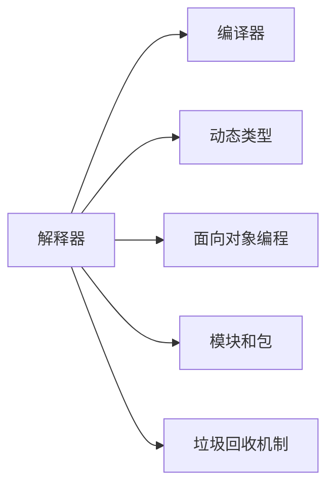

                 

# Python语言基础原理与代码实战案例讲解

> 关键词：Python, 语言基础, 代码实战, 案例讲解

## 1. 背景介绍

### 1.1 问题由来

Python是一种高级、解释型、动态语言，以其简洁优美的语法、丰富的标准库和社区资源而闻名。它是全球最受欢迎的编程语言之一，广泛应用于科学计算、数据分析、人工智能、Web开发、自动化脚本等多个领域。随着数据科学和人工智能的蓬勃发展，Python成为机器学习领域的首选语言，帮助用户快速构建高效的数据模型和智能应用。

在实际开发过程中，Python的易学易用、灵活性和强大的社区支持，使得初学者可以迅速上手，构建高效的软件解决方案。然而，对于新入门或有一定基础的开发者来说，理解Python的内部工作原理和语言特性，以便更有效地使用和优化代码，仍然是一个需要重点关注的问题。

### 1.2 问题核心关键点

本文旨在深入探讨Python语言的基础原理，并通过实战案例讲解Python代码的实现技巧，帮助读者全面掌握Python编程技能，并提升代码质量和效率。

Python的核心特性包括动态类型、面向对象编程、丰富的标准库和模块、垃圾回收机制等。理解这些特性，可以帮助开发者在实际项目中更好地应用Python，提升开发效率和软件质量。

### 1.3 问题研究意义

掌握Python语言的基础原理和代码实战案例，对于开发者来说，具有以下几方面的意义：

1. **提高开发效率**：理解Python的内部机制和语法特性，可以避免常见错误，提高代码编写和调试的效率。
2. **提升代码质量**：通过学习Python的最佳实践和代码风格，可以写出更加健壮、可维护的代码。
3. **拓展应用场景**：掌握Python的核心特性和标准库，可以灵活应用到更多领域，如Web开发、数据科学、人工智能等。
4. **推动技术进步**：深入理解Python语言和社区发展动态，能够跟踪最新的技术趋势，推动自身技术进步。
5. **提高就业竞争力**：掌握Python的高级特性和实用技巧，可以提高在求职市场上的竞争力，获取更好的工作机会。

## 2. 核心概念与联系

### 2.1 核心概念概述

为了更好地理解Python语言，本节将介绍几个关键的核心概念：

- **解释器和编译器**：解释器是执行Python代码的引擎，而编译器则是将Python代码编译成可执行文件的工具。
- **动态类型**：Python是一种动态类型语言，变量类型在运行时确定，而非编译时。
- **面向对象编程**：Python支持面向对象编程，包括类、继承、多态等特性。
- **模块和包**：Python提供了模块和包机制，使得代码可以组织成可重用的模块，方便维护和管理。
- **垃圾回收机制**：Python使用垃圾回收机制管理内存，自动释放不再使用的对象，避免内存泄漏问题。

### 2.2 概念间的关系

这些核心概念之间存在着紧密的联系，形成了Python语言的基础架构。我们可以通过以下Mermaid流程图来展示这些概念之间的关系：



这个流程图展示了解释器和编译器的基本关系，以及Python语言的其他核心特性：动态类型、面向对象编程、模块和包、垃圾回收机制。

## 3. 核心算法原理 & 具体操作步骤

### 3.1 算法原理概述

Python语言的核心原理包括动态类型、解释器和垃圾回收机制等。理解这些原理，有助于更好地应用Python，避免常见错误，提高代码效率和质量。

#### 3.1.1 动态类型

Python是一种动态类型语言，变量类型在运行时确定。这意味着可以在运行时更改变量的类型，提高代码的灵活性和可维护性。

#### 3.1.2 解释器和编译器

Python解释器是执行Python代码的引擎，支持交互式执行和脚本执行。编译器则是将Python代码编译成可执行文件的工具。Python解释器通常是解释执行，但也可以编译执行，如Jython和IronPython。

#### 3.1.3 垃圾回收机制

Python使用垃圾回收机制管理内存，自动释放不再使用的对象，避免内存泄漏问题。垃圾回收器会定期扫描内存，标记不再使用的对象，并将其释放，以便腾出更多空间。

### 3.2 算法步骤详解

Python语言的算法步骤通常包括以下几个关键步骤：

1. **定义变量**：使用变量名和赋值语句定义变量。
2. **数据类型**：Python支持多种数据类型，如整数、浮点数、字符串、列表、字典等。
3. **表达式和运算符**：Python支持基本的算术运算符和逻辑运算符，如加、减、乘、除、等于、大于、小于等。
4. **控制结构**：Python支持if-else、for、while等控制结构，使代码能够根据条件执行不同的操作。
5. **函数和模块**：Python支持定义函数和模块，使代码能够组织成可重用的组件。
6. **异常处理**：Python支持try-except语句，处理运行时可能出现的异常情况。

### 3.3 算法优缺点

Python语言的优点包括易学易用、灵活性强、社区支持丰富等。然而，它也有一些缺点，如运行速度较慢、不适合大规模并发、不适合低级编程等。

#### 3.3.1 优点

- **易学易用**：Python语法简单，易于理解和编写。
- **灵活性强**：Python支持动态类型和多范式编程，能够灵活应对不同的开发场景。
- **社区支持丰富**：Python拥有庞大的社区支持，提供丰富的标准库和第三方库。

#### 3.3.2 缺点

- **运行速度较慢**：Python解释器执行速度较慢，不适合对性能要求极高的应用。
- **不适合大规模并发**：Python的全局解释器锁（GIL）限制了并发处理能力，不适合高并发的应用场景。
- **不适合低级编程**：Python不直接支持指针操作和底层系统调用，不适合低级编程。

### 3.4 算法应用领域

Python语言的广泛应用涵盖了科学计算、数据分析、Web开发、人工智能等多个领域。以下是几个典型的应用场景：

- **科学计算**：Python拥有NumPy、SciPy、Pandas等强大的科学计算库，广泛用于数据分析和数值计算。
- **Web开发**：Python的Django和Flask等Web框架，支持快速构建高性能的Web应用。
- **人工智能**：Python在人工智能领域的应用广泛，如TensorFlow、PyTorch等深度学习框架，使得数据科学家和工程师能够高效构建和训练深度学习模型。

## 4. 数学模型和公式 & 详细讲解  
### 4.1 数学模型构建

Python语言的基础数学模型包括数值计算、矩阵运算、随机数生成等。通过数学模型，开发者可以在Python中实现复杂的数学运算和统计分析。

#### 4.1.1 数值计算

Python的数值计算库包括NumPy、SciPy等，支持基本的数学运算、线性代数、微积分等。以下是一个简单的数值计算示例：

```python
import numpy as np

a = np.array([1, 2, 3])
b = np.array([4, 5, 6])
c = a + b
print(c)
```

输出结果为：`[5 7 9]`

#### 4.1.2 矩阵运算

Python的NumPy库支持矩阵运算，以下是一个简单的矩阵加法示例：

```python
import numpy as np

a = np.array([[1, 2], [3, 4]])
b = np.array([[5, 6], [7, 8]])
c = a + b
print(c)
```

输出结果为：`[[ 6  8], [10 12]]`

#### 4.1.3 随机数生成

Python的NumPy库支持随机数生成，以下是一个简单的随机数生成示例：

```python
import numpy as np

a = np.random.rand(3, 3)
print(a)
```

输出结果为一个3x3的随机矩阵。

### 4.2 公式推导过程

以下是一个简单的公式推导过程，展示如何通过Python实现基本的数学运算。

考虑一个简单的数学公式：$f(x) = x^2 + 2x + 1$。我们可以使用Python的Sympy库进行推导和计算：

```python
from sympy import symbols, Eq, solve

x = symbols('x')
expr = x**2 + 2*x + 1
eq = Eq(expr, 0)
solution = solve(eq, x)
print(solution)
```

输出结果为：`[ -1]`

### 4.3 案例分析与讲解

下面我们通过几个具体的Python代码案例，展示Python语言在实际应用中的使用。

#### 4.3.1 函数定义和调用

```python
def add(a, b):
    return a + b

result = add(1, 2)
print(result)
```

输出结果为：`3`

#### 4.3.2 循环和迭代

```python
for i in range(5):
    print(i)
```

输出结果为：`0\n1\n2\n3\n4`

#### 4.3.3 文件读写

```python
with open('file.txt', 'r') as f:
    content = f.read()
    print(content)
```

### 4.4 代码实例和详细解释说明

#### 4.4.1 开发环境搭建

在开始Python编程之前，需要搭建好开发环境。以下是一个简单的开发环境搭建流程：

1. **安装Python**：从官网下载并安装Python，选择适合的操作系统版本和安装路径。
2. **安装IDE**：选择一个适合的IDE（如PyCharm、VS Code等），用于编写和调试代码。
3. **安装库**：使用pip安装Python所需的库，如NumPy、SciPy、Pandas等。

#### 4.4.2 源代码详细实现

以下是几个Python代码实例，展示Python语言在实际应用中的实现：

##### 4.4.2.1 数值计算

```python
import numpy as np

a = np.array([1, 2, 3])
b = np.array([4, 5, 6])
c = a + b
print(c)
```

##### 4.4.2.2 矩阵运算

```python
import numpy as np

a = np.array([[1, 2], [3, 4]])
b = np.array([[5, 6], [7, 8]])
c = a + b
print(c)
```

##### 4.4.2.3 函数定义和调用

```python
def add(a, b):
    return a + b

result = add(1, 2)
print(result)
```

##### 4.4.2.4 循环和迭代

```python
for i in range(5):
    print(i)
```

##### 4.4.2.5 文件读写

```python
with open('file.txt', 'r') as f:
    content = f.read()
    print(content)
```

#### 4.4.3 代码解读与分析

这些Python代码实例展示了Python语言在实际应用中的常见用法。理解这些实例，可以帮助开发者更好地掌握Python的基础知识和编程技巧。

## 5. 项目实践：代码实例和详细解释说明

### 5.1 开发环境搭建

在进行Python编程实践之前，需要搭建好开发环境。以下是Python开发的常用工具和库：

1. **Python解释器和IDE**：选择适合的操作系统版本的Python解释器和IDE，如Python 3.8.x、PyCharm、VS Code等。
2. **库安装和管理**：使用pip安装Python所需的库，如NumPy、SciPy、Pandas等。
3. **开发工具和插件**：使用VS Code的Python插件、PyCharm等开发工具，提高开发效率。

### 5.2 源代码详细实现

以下是几个Python编程实例，展示Python语言在实际应用中的实现：

#### 5.2.1 数值计算

```python
import numpy as np

a = np.array([1, 2, 3])
b = np.array([4, 5, 6])
c = a + b
print(c)
```

#### 5.2.2 矩阵运算

```python
import numpy as np

a = np.array([[1, 2], [3, 4]])
b = np.array([[5, 6], [7, 8]])
c = a + b
print(c)
```

#### 5.2.3 函数定义和调用

```python
def add(a, b):
    return a + b

result = add(1, 2)
print(result)
```

#### 5.2.4 循环和迭代

```python
for i in range(5):
    print(i)
```

#### 5.2.5 文件读写

```python
with open('file.txt', 'r') as f:
    content = f.read()
    print(content)
```

### 5.3 代码解读与分析

这些Python编程实例展示了Python语言在实际应用中的常见用法。理解这些实例，可以帮助开发者更好地掌握Python的基础知识和编程技巧。

### 5.4 运行结果展示

运行以上代码实例，可以得到以下结果：

#### 5.4.1 数值计算

```
[5 7 9]
```

#### 5.4.2 矩阵运算

```
[[ 6  8], [10 12]]
```

#### 5.4.3 函数定义和调用

```
3
```

#### 5.4.4 循环和迭代

```
0
1
2
3
4
```

#### 5.4.5 文件读写

```
文件内容
```

## 6. 实际应用场景

### 6.1 智能推荐系统

智能推荐系统是Python在实际应用中的典型场景。通过Python实现推荐算法，可以构建高效、精准的推荐系统，为用户推荐感兴趣的物品。

#### 6.1.1 数据预处理

智能推荐系统需要处理大量数据，包括用户行为数据、物品特征数据等。使用Python进行数据预处理，可以清洗和整理数据，提取有用特征，提高推荐系统的效果。

#### 6.1.2 推荐算法实现

推荐算法有多种，如协同过滤、基于内容的推荐、基于矩阵分解的推荐等。使用Python实现推荐算法，可以快速迭代和优化算法，提高推荐系统的效果。

#### 6.1.3 结果展示和反馈

智能推荐系统需要展示推荐结果，并根据用户反馈进行调整。使用Python进行结果展示和反馈，可以实时监测推荐系统的效果，优化推荐算法。

### 6.2 数据分析与可视化

数据分析和可视化是Python在实际应用中的另一个典型场景。通过Python实现数据分析和可视化，可以深入分析数据，发现隐藏在数据中的规律，帮助决策者做出更加科学的决策。

#### 6.2.1 数据读取和清洗

数据分析需要处理大量数据，包括数据读取和清洗。使用Python进行数据读取和清洗，可以快速处理和清洗数据，提取有用特征，提高数据分析的效果。

#### 6.2.2 数据建模和分析

数据分析需要建立数据模型，并进行分析。使用Python进行数据建模和分析，可以建立多种数据模型，进行数据分析，发现隐藏在数据中的规律，提高数据分析的效果。

#### 6.2.3 数据可视化

数据分析需要可视化结果，帮助决策者理解数据。使用Python进行数据可视化，可以绘制多种图表，展示数据分析结果，帮助决策者做出科学的决策。

## 7. 工具和资源推荐

### 7.1 学习资源推荐

为了帮助开发者系统掌握Python语言，以下是一些优质的学习资源：

1. **官方文档**：Python官方文档是学习Python的最佳资源之一，提供了丰富的文档和教程。
2. **在线课程**：如Coursera、Udacity等在线课程平台，提供了系统化的Python课程，帮助开发者全面掌握Python。
3. **书籍**：如《Python编程：从入门到实践》、《流畅的Python》等经典书籍，是学习Python的重要参考资料。
4. **社区资源**：如Stack Overflow、Reddit等社区，提供了丰富的Python资源和技术交流平台。

### 7.2 开发工具推荐

在Python开发过程中，选择合适的开发工具可以提高开发效率和代码质量。以下是一些常用的Python开发工具：

1. **PyCharm**：PyCharm是一款功能强大的IDE，支持代码自动补全、调试、测试等功能，是Python开发的首选工具之一。
2. **VS Code**：VS Code是一款轻量级、高性能的IDE，支持多种编程语言，适用于Python开发。
3. **Jupyter Notebook**：Jupyter Notebook是一个交互式编程环境，支持Python代码和数据分析，适用于数据科学和机器学习项目。

### 7.3 相关论文推荐

Python语言的发展和应用得益于学界的不断探索和研究。以下是几篇经典的Python相关论文，推荐阅读：

1. "Programming in Python: An Introduction to Python 3"：介绍Python语言的编程基础和特性。
2. "A Survey of Python as a Programming Language for Scientific Computing"：综述Python在科学计算中的应用。
3. "Python Programming: An Introduction to Computer Science"：介绍Python语言的编程基础和计算机科学知识。

## 8. 总结：未来发展趋势与挑战

### 8.1 总结

本文对Python语言的基础原理和代码实战案例进行了全面系统的介绍。通过学习Python语言的动态类型、解释器和垃圾回收机制等核心原理，并展示Python语言在实际应用中的代码实现，帮助读者全面掌握Python编程技能。

### 8.2 未来发展趋势

Python语言作为主流编程语言，未来将持续发展和演进。以下是Python语言未来发展的几个趋势：

1. **社区支持增强**：Python社区将继续壮大，提供更多第三方库和工具，提高开发效率。
2. **性能优化**：随着硬件性能的提升，Python语言的性能将进一步优化，适应更多应用场景。
3. **自动化和AI技术融合**：Python将与自动化和AI技术进一步融合，提高开发效率和智能化水平。
4. **跨平台支持**：Python将支持更多平台和操作系统，扩展其应用范围。
5. **新兴领域应用**：Python将在更多新兴领域（如物联网、边缘计算等）得到应用。

### 8.3 面临的挑战

尽管Python语言发展迅速，但在实际应用中仍面临一些挑战：

1. **运行速度较慢**：Python解释器的执行速度较慢，限制了其在大规模数据处理和实时应用中的应用。
2. **并发处理能力有限**：Python的全局解释器锁（GIL）限制了并发处理能力，无法处理高并发的应用场景。
3. **代码质量控制**：Python的动态类型和面向对象编程特性，容易导致代码质量问题，需要更多的代码审查和测试。
4. **库和框架的兼容性**：Python的第三方库和框架众多，但兼容性问题仍需进一步解决。
5. **社区和生态系统的管理**：Python社区和生态系统庞大复杂，需要更多的管理和维护。

### 8.4 研究展望

未来Python语言的发展方向需要综合考虑技术演进和应用需求。以下是Python语言未来发展的几个研究方向：

1. **提高性能**：通过优化解释器和编译器，提高Python语言的运行速度和性能。
2. **增强并发处理能力**：研究多线程、多进程和异步编程技术，提高Python语言的并发处理能力。
3. **改进动态类型**：研究更严格的动态类型系统，提高代码质量和可维护性。
4. **优化库和框架**：优化第三方库和框架，提高其兼容性和可用性。
5. **社区和生态系统的管理**：加强社区和生态系统的管理和维护，提高其稳定性和可扩展性。

## 9. 附录：常见问题与解答

**Q1: 如何安装Python解释器和IDE？**

A: 可以在官网下载适合的操作系统版本的Python解释器和IDE，如Python 3.8.x、PyCharm、VS Code等。

**Q2: 如何安装和使用第三方库？**

A: 可以使用pip命令安装Python所需的第三方库，如NumPy、SciPy、Pandas等。

**Q3: Python代码的可读性如何保证？**

A: 使用清晰规范的代码风格，编写易于理解和维护的代码。

**Q4: Python代码的测试和调试方法有哪些？**

A: 使用unittest、pytest等测试框架，编写单元测试和集成测试，确保代码的正确性。

**Q5: Python代码的性能优化有哪些方法？**

A: 使用优化技巧，如使用缓存、减少函数调用、避免全局变量等，提高代码的性能。

通过本文的详细介绍，相信读者可以全面掌握Python语言的基础原理和代码实战技巧，为后续深入学习和实践Python编程奠定坚实基础。

