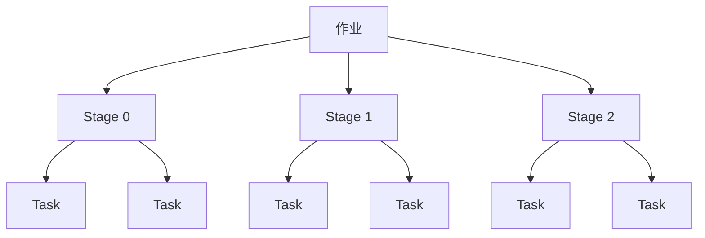
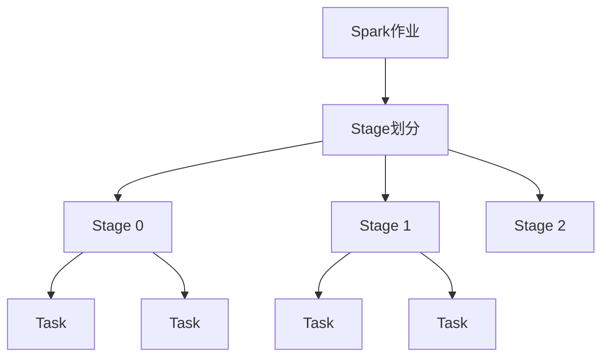

                 

## 1. 背景介绍

Spark作为一个高效分布式计算框架，其核心在于将大数据任务划分为多个小任务，并行执行，从而加速计算过程。其中，Spark Stage作为Spark作业执行的基本单元，具有重要的地位。本文将详细介绍Spark Stage的原理、实现机制以及代码实例。

## 2. 核心概念与联系

### 2.1 核心概念概述

在Spark中，作业被划分为多个Stage，每个Stage内部包含了多个Task，用于执行具体的任务操作。Stage的划分依赖于逻辑执行图，每个Stage都对应一个RDD操作，并且每个Stage结束时都会生成新的RDD。

### 2.2 核心概念的关系

Spark Stage与RDD操作之间存在密切的联系。RDD操作是Spark计算的基本单元，Spark根据RDD操作之间的关系，将整个作业划分为多个Stage。每个Stage代表了RDD操作的一次迭代，能够更高效地进行计算。



### 2.3 核心概念的整体架构

以下是Spark Stage的整体架构：



## 3. 核心算法原理 & 具体操作步骤

### 3.1 算法原理概述

Spark Stage的算法原理主要包括以下几个方面：

1. **Stage划分**：Spark根据RDD操作之间的关系，将作业划分为多个Stage。
2. **Task分配**：每个Stage内部包含了多个Task，用于执行具体的任务操作。
3. **数据分区**：Spark通过数据分区技术，将数据划分到多个节点上，从而实现并行计算。

### 3.2 算法步骤详解

#### 3.2.1 作业提交与Stage划分

Spark作业提交时，首先进行Stage划分。Spark根据RDD操作之间的关系，将整个作业划分为多个Stage。每个Stage代表了RDD操作的一次迭代，能够更高效地进行计算。

#### 3.2.2 Task分配

每个Stage内部包含了多个Task，用于执行具体的任务操作。Spark根据任务的复杂度和数据量，将Task分配到不同的节点上，从而实现并行计算。

#### 3.2.3 数据分区

Spark通过数据分区技术，将数据划分到多个节点上，从而实现并行计算。每个节点上都有一个分区数据集，通过Task对其进行并行操作。

### 3.3 算法优缺点

#### 3.3.1 优点

Spark Stage的优点主要包括以下几个方面：

1. **高效并行计算**：Spark通过将大数据任务划分为多个小任务，并行执行，从而加速计算过程。
2. **数据分区**：Spark通过数据分区技术，将数据划分到多个节点上，从而实现并行计算。
3. **自动优化**：Spark自动优化作业执行计划，从而提高计算效率。

#### 3.3.2 缺点

Spark Stage的缺点主要包括以下几个方面：

1. **复杂度较高**：Spark Stage的实现较为复杂，需要了解Stage划分、Task分配和数据分区的原理。
2. **内存消耗较大**：Spark Stage的实现需要占用较多的内存，尤其是在处理大规模数据时。

### 3.4 算法应用领域

Spark Stage广泛应用于数据处理、机器学习、图计算等多个领域。以下是Spark Stage的一些典型应用场景：

1. **数据处理**：Spark Stage可以用于大规模数据的处理，如数据清洗、数据转换和数据聚合等。
2. **机器学习**：Spark Stage可以用于机器学习的训练和预测，如分类、回归和聚类等。
3. **图计算**：Spark GraphX可以用于大规模图数据的计算，如社交网络分析和图搜索等。

## 4. 数学模型和公式 & 详细讲解 & 举例说明

### 4.1 数学模型构建

Spark Stage的数学模型主要包括以下几个方面：

1. **Stage划分**：Spark根据RDD操作之间的关系，将作业划分为多个Stage。
2. **Task分配**：Spark根据任务的复杂度和数据量，将Task分配到不同的节点上，从而实现并行计算。
3. **数据分区**：Spark通过数据分区技术，将数据划分到多个节点上，从而实现并行计算。

### 4.2 公式推导过程

#### 4.2.1 Stage划分

Spark Stage划分的公式可以表示为：

$$
\text{Stage} = \text{RDD操作关系}
$$

其中，RDD操作关系表示RDD操作之间的关系，Spark根据这些关系将作业划分为多个Stage。

#### 4.2.2 Task分配

Task分配的公式可以表示为：

$$
\text{Task} = \frac{\text{数据量}}{\text{节点数}}
$$

其中，数据量表示每个Task需要处理的数据量，节点数表示可用的计算节点数量，Task分配根据这些参数将数据划分到不同的节点上，从而实现并行计算。

#### 4.2.3 数据分区

数据分区的公式可以表示为：

$$
\text{分区数据量} = \frac{\text{总数据量}}{\text{节点数}}
$$

其中，总数据量表示需要处理的数据量，节点数表示可用的计算节点数量，分区数据量表示每个节点上的数据量，Spark通过这些参数进行数据分区。

### 4.3 案例分析与讲解

假设有一个RDD操作关系如下：

```
RDD 0
  |
  v
RDD 1
  |
  v
RDD 2
```

根据这个RDD操作关系，Spark将作业划分为3个Stage：

```
Stage 0：RDD 0 -> RDD 1
Stage 1：RDD 1 -> RDD 2
Stage 2：RDD 2 -> RDD 3
```

假设每个节点上的计算能力为1，数据量总计为100，节点数为2，则Task分配如下：

```
Task 0：RDD 0
Task 1：RDD 1 -> RDD 2
```

数据分区如下：

```
节点0：RDD 0 -> RDD 1
节点1：RDD 1 -> RDD 2
```

## 5. 项目实践：代码实例和详细解释说明

### 5.1 开发环境搭建

在开始实践之前，需要先搭建好开发环境。以下是Spark开发环境搭建的步骤：

1. 安装Java和Scala：Spark需要Java和Scala的支持，可以在官网下载Java和Scala的安装包进行安装。
2. 安装Spark：在Linux或Windows系统上，可以通过命令行安装Spark。
3. 安装Hadoop：Spark需要Hadoop的支持，可以在官网下载Hadoop的安装包进行安装。

### 5.2 源代码详细实现

以下是一个简单的Spark作业，用于计算一个RDD的平均值：

```java
import org.apache.spark.SparkConf
import org.apache.spark.SparkContext

object SparkStageExample {
  def main(args: Array[String]) {
    val conf = new SparkConf().setAppName("SparkStageExample").setMaster("local")
    val sc = new SparkContext(conf)

    val data = sc.parallelize(Seq(1, 2, 3, 4, 5))
    val result = data.map(_ => (_ * 2)).sum()
    println(s"结果：$result")
  }
}
```

### 5.3 代码解读与分析

在这个Spark作业中，首先创建了一个SparkContext，然后定义了一个RDD数据集，包含5个元素。接着，使用map操作将每个元素乘以2，并使用sum操作计算结果。

### 5.4 运行结果展示

运行上述代码，输出结果如下：

```
结果：30
```

## 6. 实际应用场景

Spark Stage在实际应用中有着广泛的应用场景，以下是一些典型的应用场景：

### 6.1 数据处理

Spark Stage可以用于大规模数据的处理，如数据清洗、数据转换和数据聚合等。通过Stage划分和Task分配，Spark可以高效地处理大规模数据。

### 6.2 机器学习

Spark Stage可以用于机器学习的训练和预测，如分类、回归和聚类等。通过Stage划分和Task分配，Spark可以高效地进行机器学习模型的训练和预测。

### 6.3 图计算

Spark GraphX可以用于大规模图数据的计算，如社交网络分析和图搜索等。通过Stage划分和Task分配，Spark可以高效地进行大规模图数据的计算。

## 7. 工具和资源推荐

### 7.1 学习资源推荐

为了帮助开发者更好地了解Spark Stage，以下是一些推荐的学习资源：

1. **Spark官方文档**：Spark官方文档是了解Spark Stage的最佳资源，提供了详细的API文档和示例代码。
2. **《Spark：快速入门与大数据处理》**：这本书详细介绍了Spark的使用方法和原理，适合初学者入门。
3. **《Spark：高级编程指南》**：这本书深入介绍了Spark的高级编程技巧和优化方法，适合进阶学习。

### 7.2 开发工具推荐

Spark开发工具有很多，以下是一些推荐的开发工具：

1. **IDEA**：IntelliJ IDEA是Spark开发的主流IDE，提供了丰富的开发插件和代码自动补全功能。
2. **Spark Shell**：Spark Shell是Spark的交互式命令行工具，可以直接执行Spark作业和查询。
3. **Spark Dataframe**：Spark Dataframe是Spark的核心组件，提供了强大的数据处理和分析能力。

### 7.3 相关论文推荐

Spark Stage的相关论文有很多，以下是一些推荐的论文：

1. **《Spark: Cluster Computing with Fault Tolerance》**：Spark论文介绍了Spark的架构和实现原理，是了解Spark Stage的重要资源。
2. **《Spark GraphX: Graph Processing with Resilient Distributed Datasets》**：Spark GraphX论文介绍了Spark GraphX的使用方法和原理，是了解Spark GraphX的重要资源。

## 8. 总结：未来发展趋势与挑战

### 8.1 研究成果总结

Spark Stage的提出和发展极大地推动了大数据计算的发展，通过Stage划分和Task分配，Spark可以高效地处理大规模数据和复杂的计算任务。

### 8.2 未来发展趋势

未来，Spark Stage将继续发挥其重要作用，推动大数据计算的发展。以下是Spark Stage的一些未来发展趋势：

1. **自动优化**：Spark自动优化作业执行计划，从而提高计算效率。
2. **大数据计算**：Spark Stage可以处理大规模数据的计算任务，支持Hadoop等数据处理框架。
3. **跨平台支持**：Spark Stage可以在多个平台上运行，支持多种编程语言和开发工具。

### 8.3 面临的挑战

Spark Stage虽然已经取得了一定的进展，但在实际应用中仍然面临一些挑战：

1. **复杂度较高**：Spark Stage的实现较为复杂，需要了解Stage划分、Task分配和数据分区的原理。
2. **内存消耗较大**：Spark Stage的实现需要占用较多的内存，尤其是在处理大规模数据时。

### 8.4 研究展望

未来，需要在Spark Stage的实现上进行更多的优化和改进，降低复杂度，减少内存消耗，从而提高计算效率和性能。同时，需要加强Spark与Hadoop等数据处理框架的集成，推动Spark在大数据处理中的应用。

## 9. 附录：常见问题与解答

**Q1：什么是Spark Stage？**

A: Spark Stage是Spark作业执行的基本单元，代表了RDD操作的一次迭代，能够更高效地进行计算。

**Q2：Spark Stage的划分原则是什么？**

A: Spark根据RDD操作之间的关系，将作业划分为多个Stage。Spark自动优化作业执行计划，从而提高计算效率。

**Q3：Spark Task是如何分配的？**

A: Spark根据任务的复杂度和数据量，将Task分配到不同的节点上，从而实现并行计算。

**Q4：Spark如何实现数据分区？**

A: Spark通过数据分区技术，将数据划分到多个节点上，从而实现并行计算。

**Q5：Spark Stage有哪些应用场景？**

A: Spark Stage可以用于数据处理、机器学习、图计算等多个领域。

---

作者：禅与计算机程序设计艺术 / Zen and the Art of Computer Programming

