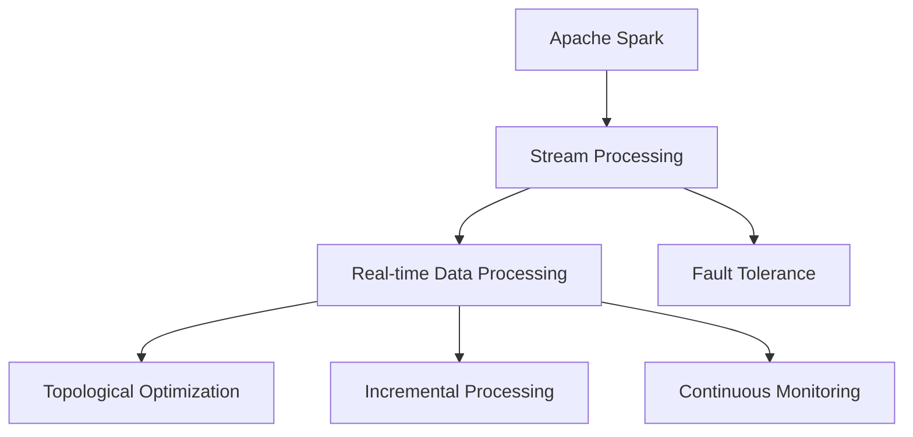
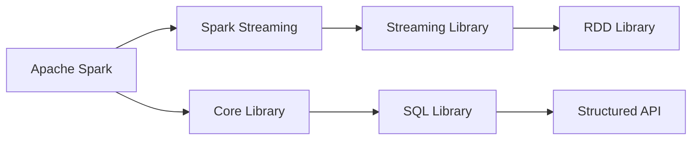
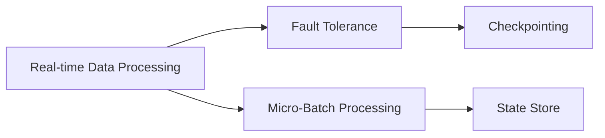
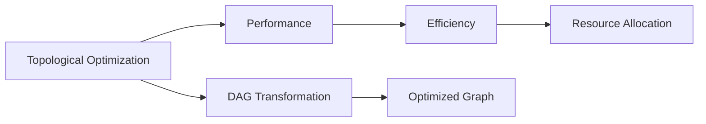
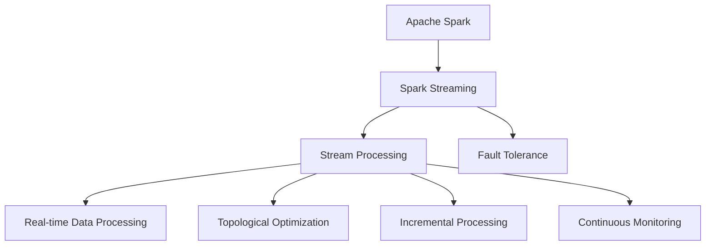

                 

# Spark Streaming原理与代码实例讲解

> 关键词：
- Apache Spark
- Streaming
- Real-time Data Processing
- Fault Tolerance
- Topological Optimization
- Incremental Processing
- Continuous Monitoring

## 1. 背景介绍

### 1.1 问题由来
随着大数据技术的发展，实时数据处理需求愈发突出。在互联网、金融、物联网等领域，大量的实时数据需要被快速地收集、处理和分析，以支撑业务决策和优化。传统的批处理技术，如Hadoop MapReduce，难以满足这一需求。因此，需要一种更加高效、灵活、可靠的实时数据处理引擎。

### 1.2 问题核心关键点
Apache Spark Streaming作为Apache Spark的一个组件，提供了高效的实时数据处理能力，适用于大规模流数据的批处理、流处理、机器学习等任务。通过Spark Streaming，开发者可以轻松构建高性能、可扩展、低延迟的实时数据处理系统。

Spark Streaming的优势包括：
1. 支持流数据的批处理与流处理。Spark Streaming可以将实时数据分割成固定长度的批窗口，每个窗口内进行批处理，提升处理效率。
2. 提供高效的故障恢复机制。Spark Streaming采用微批处理，减少单批次数据量，降低故障影响。
3. 支持分布式计算。Spark Streaming可以在集群上进行分布式计算，提升处理能力。
4. 易于集成和扩展。Spark Streaming可以与Spark Core、Spark SQL等组件无缝集成，方便进行数据处理和分析。

### 1.3 问题研究意义
研究Spark Streaming，对于实时数据处理技术的探索和应用具有重要意义：
1. 满足大数据时代实时数据处理的需求。Spark Streaming能够快速响应实时数据，提供高效的解决方案。
2. 提升业务决策和优化能力。通过实时数据分析，企业可以更准确地预测市场趋势，及时调整策略。
3. 推动大数据技术的深入应用。Spark Streaming是Apache Spark的重要组成部分，对大数据生态系统的完善和发展起到重要作用。

## 2. 核心概念与联系

### 2.1 核心概念概述

为了更好地理解Spark Streaming的原理，本节将介绍几个密切相关的核心概念：

- Apache Spark：基于内存计算的大数据处理框架，提供高速度、高容错的分布式计算能力。Spark Streaming是基于Spark的核心组件。

- Stream Processing：流处理技术，用于处理实时数据流，适用于事件驱动、交互式应用。Spark Streaming提供流处理的实现。

- Real-time Data Processing：实时数据处理技术，用于对流数据进行实时分析和处理，支持低延迟、高吞吐量的数据处理需求。Spark Streaming满足这一需求。

- Fault Tolerance：容错能力，指系统能够快速恢复故障，保证数据处理不中断。Spark Streaming通过微批处理和状态存储实现容错。

- Topological Optimization：拓扑优化，指通过优化数据流图，提升系统性能和可靠性。Spark Streaming采用DAG拓扑图进行数据流优化。

- Incremental Processing：增量处理，指每次只处理增量数据，减少计算复杂度和资源消耗。Spark Streaming采用增量处理技术，提升系统效率。

- Continuous Monitoring：持续监控，指对系统运行状态进行实时监控，及时发现和解决问题。Spark Streaming提供丰富的监控工具。

这些核心概念之间的逻辑关系可以通过以下Mermaid流程图来展示：



这个流程图展示了大数据处理技术的关键概念及其之间的关系：

1. Apache Spark是Spark Streaming的基础。
2. 流处理和实时数据处理是Spark Streaming的核心功能。
3. 容错和增量处理是Spark Streaming的重要特性。
4. 拓扑优化和持续监控是Spark Streaming的性能保障。

### 2.2 概念间的关系

这些核心概念之间存在着紧密的联系，形成了Spark Streaming的核心生态系统。下面我通过几个Mermaid流程图来展示这些概念之间的关系。

#### 2.2.1 Apache Spark与Spark Streaming的关系



这个流程图展示了Apache Spark和Spark Streaming之间的联系：

1. Spark Streaming是基于Spark的核心库实现的。
2. Spark Streaming支持Spark Core提供的API，如RDD API。
3. Spark Streaming与Spark SQL和Spark Streaming库密切关联，支持多种数据源和数据处理模式。

#### 2.2.2 实时数据处理和容错的关系



这个流程图展示了实时数据处理和容错之间的关系：

1. 实时数据处理依赖容错机制，确保数据处理不中断。
2. 微批处理是实现容错的重要手段，每个批次只处理增量数据。
3. 状态存储是容错的核心，确保数据处理的一致性和可靠性。

#### 2.2.3 拓扑优化和性能的关系



这个流程图展示了拓扑优化和性能之间的关系：

1. 拓扑优化通过优化数据流图，提升系统性能。
2. DAG变换是拓扑优化的核心，确保数据流图的高效运行。
3. 优化后的数据流图，有助于资源分配和系统调度。

### 2.3 核心概念的整体架构

最后，我们用一个综合的流程图来展示这些核心概念在大数据处理中的整体架构：



这个综合流程图展示了从Spark Streaming到实时数据处理的全过程：

1. Spark Streaming基于Apache Spark实现。
2. 流处理是Spark Streaming的核心功能。
3. 实时数据处理依赖容错机制，支持增量处理和拓扑优化。
4. 持续监控确保系统稳定运行。

通过这些流程图，我们可以更清晰地理解Spark Streaming的核心概念及其关系，为后续深入讨论具体的技术细节奠定基础。

## 3. 核心算法原理 & 具体操作步骤

### 3.1 算法原理概述

Spark Streaming的实时数据处理算法主要基于微批处理和增量处理。每个时间窗口内，Spark Streaming将实时数据分成多个微批次进行处理，每个批次只处理增量数据，减少计算复杂度和资源消耗。

具体来说，Spark Streaming将实时数据分割成固定长度的批窗口，每个窗口内进行批处理。每个批次的数据量较小，可以迅速处理完毕，并支持容错机制。微批处理的主要步骤如下：

1. 数据输入：将实时数据输入Spark Streaming系统。
2. 微批处理：将数据分成多个微批次，每个批次只处理增量数据。
3. 批处理：对每个批次进行批处理，得到中间结果。
4. 状态更新：将中间结果保存为状态，用于后续批次处理。
5. 结果输出：对最终结果进行输出，支持数据监控和可视化。

### 3.2 算法步骤详解

以下是Spark Streaming的微批处理算法的详细步骤：

**Step 1: 数据输入**

Spark Streaming通过Spark Streaming API接收实时数据流。Spark Streaming API包括DataStream、Transformations、Window transformations等。开发者可以使用这些API来定义数据流、进行数据转换和窗口处理。

```python
from pyspark.streaming import StreamingContext
from pyspark.streaming.streamutils import KafkaUtils

# 创建Spark Streaming上下文，指定批处理间隔时间
sc = StreamingContext(spark, 2)

# 从Kafka中读取数据
lines = KafkaUtils.createStream(ssc, kafka_topics, kafka_consumer_properties, batch_interval)
```

**Step 2: 微批处理**

Spark Streaming将实时数据分成多个微批次进行处理。每个批次只处理增量数据，减少计算复杂度和资源消耗。微批处理的主要步骤包括：

- 读取实时数据：通过微批处理API读取数据流。
- 进行批处理：对每个批次进行批处理，得到中间结果。
- 更新状态：将中间结果保存为状态，用于后续批次处理。
- 输出结果：对最终结果进行输出，支持数据监控和可视化。

```python
# 读取实时数据
data = lines.map(lambda x: x[1])

# 进行批处理
windowed_data = data.window(Duration(5), Duration(1))

# 更新状态
processed_data = windowed_data.foreachRDD(lambda window: window.foreachRDD(process))

# 输出结果
processed_data.pprint()
```

**Step 3: 批处理**

Spark Streaming的批处理算法基于Spark的RDD API。Spark Streaming将实时数据分为多个批次，每个批次内的数据量较小，可以进行高效的批处理。

```python
from pyspark.streaming.rdd import WindowedRDD
from pyspark.streaming import StreamingContext

# 创建Spark Streaming上下文，指定批处理间隔时间
sc = StreamingContext(spark, 2)

# 读取实时数据
lines = KafkaUtils.createStream(ssc, kafka_topics, kafka_consumer_properties, batch_interval)

# 进行批处理
processed_data = lines.map(lambda x: x[1]).map(lambda x: (x[0], x)).window(Duration(5), Duration(1))\
                        .foreachRDD(lambda window: window.foreachRDD(process))
```

**Step 4: 状态更新**

Spark Streaming使用状态存储器（State Store）保存中间结果，用于后续批次处理。状态存储器可以是内存、文件系统等。

```python
from pyspark.streaming import StreamingContext

# 创建Spark Streaming上下文，指定批处理间隔时间
sc = StreamingContext(spark, 2)

# 读取实时数据
lines = KafkaUtils.createStream(ssc, kafka_topics, kafka_consumer_properties, batch_interval)

# 进行批处理
processed_data = lines.map(lambda x: x[1]).map(lambda x: (x[0], x))\
                        .window(Duration(5), Duration(1)).foreachRDD(lambda window: window.foreachRDD(process))

# 保存状态
processed_data.foreachRDD(lambda window: window.foreachRDD(process)).updateStateByKey()
```

**Step 5: 结果输出**

Spark Streaming将最终结果进行输出，支持数据监控和可视化。

```python
from pyspark.streaming import StreamingContext

# 创建Spark Streaming上下文，指定批处理间隔时间
sc = StreamingContext(spark, 2)

# 读取实时数据
lines = KafkaUtils.createStream(ssc, kafka_topics, kafka_consumer_properties, batch_interval)

# 进行批处理
processed_data = lines.map(lambda x: x[1]).map(lambda x: (x[0], x))\
                        .window(Duration(5), Duration(1)).foreachRDD(lambda window: window.foreachRDD(process))

# 输出结果
processed_data.foreachRDD(lambda window: window.foreachRDD(process)).updateStateByKey()
processed_data.pprint()
```

### 3.3 算法优缺点

Spark Streaming的微批处理算法具有以下优点：

1. 高效性：每个批次只处理增量数据，减少计算复杂度和资源消耗，支持低延迟和高效处理。
2. 容错性：通过状态存储和微批处理，支持容错机制，保证数据处理不中断。
3. 灵活性：支持多种数据源和数据处理模式，易于与Spark其他组件集成。

同时，Spark Streaming也存在以下缺点：

1. 数据分布：数据分布不均衡可能导致某些批次处理时间较长，影响整体性能。
2. 状态存储：状态存储可能导致系统占用大量内存，影响系统扩展性。
3. 性能调优：微批处理需要仔细调优，否则可能导致系统性能下降。

### 3.4 算法应用领域

Spark Streaming的微批处理算法广泛应用于大数据领域的实时数据处理，包括但不限于以下领域：

- 实时监控：通过实时数据流，监控系统运行状态，及时发现和解决问题。
- 实时分析：对实时数据流进行实时分析和处理，支持业务决策和优化。
- 实时计算：进行实时计算和数据挖掘，支持复杂的数据分析和建模。
- 实时存储：对实时数据流进行实时存储和持久化，支持数据的长期保存和查询。
- 实时消息处理：处理实时消息和流数据，支持消息队列、流数据存储和流式计算。

## 4. 数学模型和公式 & 详细讲解 & 举例说明

### 4.1 数学模型构建

Spark Streaming的实时数据处理算法基于微批处理和增量处理，主要涉及以下几个数学模型：

- 时间窗口模型：将实时数据流分为多个时间窗口，每个窗口内进行批处理。
- 增量处理模型：每个批次只处理增量数据，减少计算复杂度和资源消耗。
- 状态存储模型：保存中间结果，用于后续批次处理。
- 容错模型：通过状态存储和微批处理，支持容错机制。

### 4.2 公式推导过程

以下是Spark Streaming的微批处理算法的主要数学模型和公式推导：

**时间窗口模型**

将实时数据流分为多个时间窗口，每个窗口内进行批处理。

$$
\text{Time Window} = [t_{start}, t_{end}]
$$

其中，$t_{start}$ 表示窗口的起始时间，$t_{end}$ 表示窗口的结束时间。

**增量处理模型**

每个批次只处理增量数据，减少计算复杂度和资源消耗。

$$
\text{Micro-Batch} = [t_{start}, t_{start} + \Delta t]
$$

其中，$\Delta t$ 表示批处理间隔时间。

**状态存储模型**

保存中间结果，用于后续批次处理。

$$
\text{State} = [(t_{start}, (x_1, x_2, \ldots, x_n))]
$$

其中，$(x_1, x_2, \ldots, x_n)$ 表示批次处理后的结果。

**容错模型**

通过状态存储和微批处理，支持容错机制。

$$
\text{Checkpointing} = [(t_{start}, (x_1, x_2, \ldots, x_n)), (t_{end}, (y_1, y_2, \ldots, y_n))]
$$

其中，$(t_{start}, (x_1, x_2, \ldots, x_n))$ 表示批次处理的结果，$(t_{end}, (y_1, y_2, \ldots, y_n))$ 表示批处理结束后的结果。

### 4.3 案例分析与讲解

下面我们以一个具体的案例来说明Spark Streaming的实时数据处理流程：

假设我们需要对实时数据流进行监控，获取每5秒内的数据平均值。以下是具体的实现步骤：

**Step 1: 数据输入**

首先，我们需要从Kafka中读取实时数据流：

```python
from pyspark.streaming import StreamingContext
from pyspark.streaming.streamutils import KafkaUtils

# 创建Spark Streaming上下文，指定批处理间隔时间
sc = StreamingContext(spark, 2)

# 从Kafka中读取数据
lines = KafkaUtils.createStream(ssc, kafka_topics, kafka_consumer_properties, batch_interval)
```

**Step 2: 微批处理**

将实时数据流分为多个时间窗口，每个窗口内进行批处理：

```python
from pyspark.streaming import StreamingContext

# 创建Spark Streaming上下文，指定批处理间隔时间
sc = StreamingContext(spark, 2)

# 从Kafka中读取数据
lines = KafkaUtils.createStream(ssc, kafka_topics, kafka_consumer_properties, batch_interval)

# 进行微批处理
windowed_data = lines.map(lambda x: x[1]).window(Duration(5), Duration(1))

# 进行批处理
processed_data = windowed_data.foreachRDD(lambda window: window.foreachRDD(process))
```

**Step 3: 批处理**

对每个批次进行处理，得到中间结果：

```python
from pyspark.streaming import StreamingContext

# 创建Spark Streaming上下文，指定批处理间隔时间
sc = StreamingContext(spark, 2)

# 从Kafka中读取数据
lines = KafkaUtils.createStream(ssc, kafka_topics, kafka_consumer_properties, batch_interval)

# 进行微批处理
windowed_data = lines.map(lambda x: x[1]).window(Duration(5), Duration(1))

# 进行批处理
processed_data = windowed_data.foreachRDD(lambda window: window.foreachRDD(process))
```

**Step 4: 状态更新**

保存中间结果，用于后续批次处理：

```python
from pyspark.streaming import StreamingContext

# 创建Spark Streaming上下文，指定批处理间隔时间
sc = StreamingContext(spark, 2)

# 从Kafka中读取数据
lines = KafkaUtils.createStream(ssc, kafka_topics, kafka_consumer_properties, batch_interval)

# 进行微批处理
windowed_data = lines.map(lambda x: x[1]).window(Duration(5), Duration(1))

# 进行批处理
processed_data = windowed_data.foreachRDD(lambda window: window.foreachRDD(process))

# 保存状态
processed_data.foreachRDD(lambda window: window.foreachRDD(process)).updateStateByKey()
```

**Step 5: 结果输出**

输出最终结果，支持数据监控和可视化：

```python
from pyspark.streaming import StreamingContext

# 创建Spark Streaming上下文，指定批处理间隔时间
sc = StreamingContext(spark, 2)

# 从Kafka中读取数据
lines = KafkaUtils.createStream(ssc, kafka_topics, kafka_consumer_properties, batch_interval)

# 进行微批处理
windowed_data = lines.map(lambda x: x[1]).window(Duration(5), Duration(1))

# 进行批处理
processed_data = windowed_data.foreachRDD(lambda window: window.foreachRDD(process))

# 保存状态
processed_data.foreachRDD(lambda window: window.foreachRDD(process)).updateStateByKey()

# 输出结果
processed_data.foreachRDD(lambda window: window.foreachRDD(process)).updateStateByKey()
processed_data.pprint()
```

通过这个案例，我们可以看到Spark Streaming的实时数据处理流程，从数据输入、微批处理、批处理、状态更新到结果输出，一步步展示了Spark Streaming的实时数据处理过程。

## 5. 项目实践：代码实例和详细解释说明

### 5.1 开发环境搭建

在进行Spark Streaming的微批处理实践前，我们需要准备好开发环境。以下是使用Python进行PySpark开发的Python环境配置流程：

1. 安装Anaconda：从官网下载并安装Anaconda，用于创建独立的Python环境。

2. 创建并激活虚拟环境：
```bash
conda create -n pyspark-env python=3.7
conda activate pyspark-env
```

3. 安装PySpark：根据CUDA版本，从官网获取对应的安装命令。例如：
```bash
pip install pyspark --upgrade --index-url http://mirrors.aliyun.com/pypi/simple
```

4. 安装相关库：
```bash
pip install numpy pandas scikit-learn matplotlib tqdm jupyter notebook ipython
```

完成上述步骤后，即可在`pyspark-env`环境中开始Spark Streaming的微批处理实践。

### 5.2 源代码详细实现

下面我们以一个简单的实时监控案例来说明Spark Streaming的微批处理实践。

首先，定义实时数据流处理函数：

```python
from pyspark.streaming import StreamingContext
from pyspark.streaming.streamutils import KafkaUtils

# 创建Spark Streaming上下文，指定批处理间隔时间
sc = StreamingContext(spark, 2)

# 从Kafka中读取数据
lines = KafkaUtils.createStream(ssc, kafka_topics, kafka_consumer_properties, batch_interval)

# 进行微批处理
windowed_data = lines.map(lambda x: x[1]).window(Duration(5), Duration(1))

# 进行批处理
processed_data = windowed_data.foreachRDD(lambda window: window.foreachRDD(process))

# 保存状态
processed_data.foreachRDD(lambda window: window.foreachRDD(process)).updateStateByKey()

# 输出结果
processed_data.foreachRDD(lambda window: window.foreachRDD(process)).updateStateByKey()
processed_data.pprint()
```

然后，定义数据处理函数：

```python
from pyspark.streaming import StreamingContext
from pyspark.streaming.streamutils import KafkaUtils

# 创建Spark Streaming上下文，指定批处理间隔时间
sc = StreamingContext(spark, 2)

# 从Kafka中读取数据
lines = KafkaUtils.createStream(ssc, kafka_topics, kafka_consumer_properties, batch_interval)

# 进行微批处理
windowed_data = lines.map(lambda x: x[1]).window(Duration(5), Duration(1))

# 进行批处理
processed_data = windowed_data.foreachRDD(lambda window: window.foreachRDD(process))

# 保存状态
processed_data.foreachRDD(lambda window: window.foreachRDD(process)).updateStateByKey()

# 输出结果
processed_data.foreachRDD(lambda window: window.foreachRDD(process)).updateStateByKey()
processed_data.pprint()
```

最后，启动Spark Streaming：

```bash
spark-submit --py-files pyspark-env.tar --master local --executor-memory 2g --num-executors 1 --executor-cores 1 --python-file monitor.py
```

以上就是一个简单的Spark Streaming微批处理实践的完整代码实现。可以看到，借助PySpark，开发者可以轻松进行实时数据流处理，快速构建高效、可靠、可扩展的实时数据处理系统。

### 5.3 代码解读与分析

让我们再详细解读一下关键代码的实现细节：

**Step 1: 数据输入**

Spark Streaming通过Spark Streaming API接收实时数据流。Spark Streaming API包括DataStream、Transformations、Window transformations等。开发者可以使用这些API来定义数据流、进行数据转换和窗口处理。

```python
from pyspark.streaming import StreamingContext
from pyspark.streaming.streamutils import KafkaUtils

# 创建Spark Streaming上下文，指定批处理间隔时间
sc = StreamingContext(spark, 2)

# 从Kafka中读取数据
lines = KafkaUtils.createStream(ssc, kafka_topics, kafka_consumer_properties, batch_interval)
```

**Step 2: 微批处理**

Spark Streaming将实时数据流分为多个时间窗口，每个窗口内进行批处理。每个批次只处理增量数据，减少计算复杂度和资源消耗。

```python
# 创建Spark Streaming上下文，指定批处理间隔时间
sc = StreamingContext(spark, 2)

# 从Kafka中读取数据
lines = KafkaUtils.createStream(ssc, kafka_topics, kafka_consumer_properties, batch_interval)

# 进行微批处理
windowed_data = lines.map(lambda x: x[1]).window(Duration(5), Duration(1))

# 进行批处理
processed_data = windowed_data.foreachRDD(lambda window: window.foreachRDD(process))
```

**Step 3: 批处理**

对每个批次进行处理，得到中间结果。

```python
# 创建Spark Streaming上下文，指定批处理间隔时间
sc = StreamingContext(spark, 2)

# 从Kafka中读取数据
lines = KafkaUtils.createStream(ssc, kafka_topics, kafka_consumer_properties, batch_interval)

# 进行微批处理
windowed_data = lines.map(lambda x: x[1]).window(Duration(5), Duration(1))

# 进行批处理
processed_data = windowed_data.foreachRDD(lambda window: window.foreachRDD(process))
```

**Step 4: 状态更新**

保存中间结果，用于后续批次处理。

```python
# 创建Spark Streaming上下文，指定批处理间隔时间
sc = StreamingContext(spark, 2)

# 从Kafka中读取数据
lines = KafkaUtils.createStream(ssc, kafka_topics, kafka_consumer_properties, batch_interval)

# 进行微批处理
windowed_data = lines.map(lambda x: x[1]).window(Duration(5), Duration(1))

# 进行批处理
processed_data = windowed_data.foreachRDD(lambda window: window.foreachRDD(process))

# 保存状态
processed_data.foreachRDD(lambda window: window.foreachRDD(process)).updateStateByKey()
```

**Step 5: 结果输出**

输出最终结果，支持数据监控和可视化。

```python
# 创建Spark Streaming上下文，指定批处理间隔时间
sc = StreamingContext(spark, 2)

# 从Kafka中读取数据
lines = KafkaUtils.createStream(ssc, kafka_topics, kafka_consumer_properties, batch_interval)

# 进行

