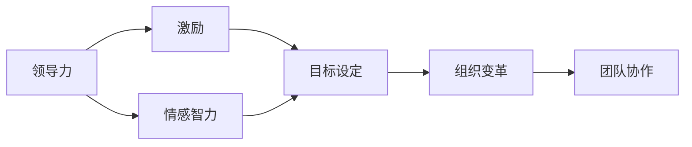

                 

# 管理的本质：激发潜能与善意

> 关键词：管理、领导力、激励、人性、情感、目标、组织、效率、变革

## 1. 背景介绍

### 1.1 问题由来

在现代社会中，管理（Management）是企业运营不可或缺的一环。然而，在许多情况下，管理者常常面临各种挑战，比如如何提高员工效率，激发团队潜力，推动组织变革等。这些问题背后往往涉及到对员工行为的深层次理解和心理因素的运用，而非简单的程序化管理。因此，管理者的角色不仅仅局限于指挥、监督，更应当关注如何激发员工的内在动力和善意，从而创造一个高效且和谐的工作环境。

### 1.2 问题核心关键点

管理问题的核心关键点在于如何更好地激发员工的内在潜能和善意。这涉及到以下几个方面：

1. **领导力的重要性**：一个强有力的领导者能够指引方向、激励团队、提高士气，进而驱动组织的整体绩效。
2. **激励机制的运用**：通过合理的激励机制，可以激发员工的积极性和主动性，提升其工作表现。
3. **对人的理解**：了解员工的心理需求、工作动机以及个性特点，有助于管理者采取更有针对性的措施，提升团队协作和组织效率。
4. **情感管理**：情感在组织中扮演着重要角色，管理者需学会在情感上与员工建立连接，创造一个温馨且具有支持性的工作环境。
5. **目标设定与沟通**：明确的目标设定与有效的沟通可以帮助员工理解其工作的意义和价值，从而增强工作动机。
6. **组织变革与适应**：在快速变化的环境中，管理者需引领组织进行有效变革，以适应新挑战和新需求。

这些关键点构成了管理的基本框架，管理者若能对此深入理解并灵活运用，便能更好地推动组织发展。

### 1.3 问题研究意义

研究管理中的激发潜能与善意对于提升组织效率、增强团队凝聚力具有重要意义：

1. **提升员工满意度**：激发员工潜能与善意可以增强员工的归属感和成就感，从而提高其工作满意度。
2. **促进组织创新**：人性化的管理方式有助于营造一个开放创新的氛围，激发员工的创造力。
3. **增强组织凝聚力**：管理者通过激发员工的善意，建立信任和尊重，可以显著提升团队合作精神。
4. **提高组织适应力**：理解员工情感和需求，能够使组织更好地适应外部环境变化，灵活应对各种挑战。
5. **优化资源配置**：通过了解员工潜力和动机，管理者可以更有效地分配资源，实现最优的资源配置。
6. **推动组织变革**：管理者通过激发员工的善意和潜能，可以更顺利地推进组织的变革和转型。

理解并应用这些核心关键点，可以帮助管理者构建一个更加高效、和谐且可持续发展的组织。

## 2. 核心概念与联系

### 2.1 核心概念概述

为更好地理解激发潜能与善意的管理方法，本节将介绍几个密切相关的核心概念：

- **领导力（Leadership）**：领导力是指能够影响、激励和指导他人实现共同目标的能力。
- **激励（Incentive）**：激励是激发个人或团队动机、提升工作积极性的过程。
- **情感智力（Emotional Intelligence）**：情感智力是指理解和管理自己和他人情感的能力。
- **目标设定（Goal Setting）**：目标设定是确定具体、可量化的目标，并通过一系列步骤实现这些目标的过程。
- **组织变革（Organizational Change）**：组织变革是指调整组织结构、流程和文化，以适应新环境和新要求的过程。
- **团队协作（Teamwork）**：团队协作是指团队成员之间相互支持、合作，共同完成任务的过程。

这些核心概念之间存在着紧密的联系，共同构成了管理的全貌。通过理解这些概念，管理者能够更好地掌握激发潜能与善意的管理技巧。

### 2.2 概念间的关系

这些核心概念之间的关系可以通过以下Mermaid流程图来展示：



这个流程图展示了领导力、激励、情感智力、目标设定、组织变革和团队协作之间的相互关系。

## 3. 核心算法原理 & 具体操作步骤

### 3.1 算法原理概述

基于激发潜能与善意的管理方法，其核心原理在于通过以下几个步骤，引导员工发挥自身潜力，同时增强其对组织的归属感和善意：

1. **目标设定与沟通**：明确且具体的目标设定，并通过沟通使员工理解其工作的重要性和目标。
2. **情感管理与连接**：管理者需关注员工的情感需求，与其建立情感上的连接，创造一个温馨、支持性的工作环境。
3. **领导力与激励**：领导者需展现强有力的领导力，并通过合理的激励机制激发员工的工作热情。
4. **持续反馈与支持**：提供持续的反馈和支持，帮助员工克服困难，不断提升能力。
5. **组织变革与适应**：在组织面临变革时，领导者需引导员工理解变革意义，积极适应新环境。

### 3.2 算法步骤详解

基于上述原理，激发潜能与善意的管理方法可以分为以下几个详细步骤：

1. **初步分析与规划**：
   - 识别员工的潜在能力和需求。
   - 制定初步的管理目标和策略。

2. **设定具体目标**：
   - 将组织目标细化为具体、可量化的任务。
   - 通过SMART原则（Specific, Measurable, Achievable, Relevant, Time-bound）确保目标的明确性、可衡量性、可达性、相关性和时限性。

3. **沟通与反馈**：
   - 定期与员工沟通，解释目标和期望。
   - 提供定期的反馈，指出进步和需要改进之处。

4. **情感连接与支持**：
   - 了解员工情感需求，建立情感连接。
   - 创建支持性工作环境，提供必要的资源和帮助。

5. **领导力与激励**：
   - 展现强有力的领导力，明确愿景和方向。
   - 设计合理的激励机制，如奖励、晋升、培训等。

6. **组织变革与适应**：
   - 引导员工理解变革的意义和必要性。
   - 提供培训和资源支持，帮助员工适应新环境。

7. **持续改进**：
   - 通过反馈和数据分析，不断优化管理策略。
   - 调整目标和激励机制，确保其有效性。

### 3.3 算法优缺点

基于激发潜能与善意的管理方法具有以下优点：

1. **提高员工满意度**：明确的目标和情感支持可以提高员工的工作满意度和忠诚度。
2. **增强组织绩效**：合理的激励机制和领导力可以提升团队的合作和绩效。
3. **促进创新**：人性化的管理方式有助于营造开放创新氛围，激发员工的创造力。
4. **提高适应力**：了解员工情感需求，使组织能够更好地适应外部变化。

然而，这种方法也存在一些缺点：

1. **实施难度高**：管理者需具备较强的情感智力，理解员工情感需求。
2. **成本较高**：情感连接和支持需要大量时间和资源投入。
3. **文化差异**：不同文化背景下，员工对激励和领导力的接受度可能不同。
4. **难以量化**：情感管理与激励难以用硬性指标衡量，难以进行精确评估。

### 3.4 算法应用领域

基于激发潜能与善意的管理方法广泛应用于各种组织中，包括但不限于：

1. **企业**：在企业中，通过激发员工潜能与善意，可以提升生产效率、增强团队凝聚力。
2. **政府机构**：通过情感连接和领导力，政府机构可以提高服务质量，增强公众信任。
3. **教育机构**：在教育中，通过明确目标和激励机制，可以提升学生学习动力，增强教育效果。
4. **非营利组织**：通过人性化的管理方式，非营利组织可以提高志愿者的积极性，增强组织影响力。
5. **健康医疗**：在医疗环境中，通过情感管理与支持，可以提升患者体验和医护人员满意度。

## 4. 数学模型和公式 & 详细讲解 & 举例说明

### 4.1 数学模型构建

基于激发潜能与善意的管理方法，可以构建以下数学模型：

- 目标设定：设目标为 $T$，目标设定过程为 $G(t) = T$，其中 $t$ 为时间。
- 激励机制：设激励机制为 $I$，激励过程为 $I(t) = f(T, M)$，其中 $f$ 为激励函数，$M$ 为激励参数。
- 情感管理：设情感管理为 $E$，情感连接过程为 $E(t) = g(T, I)$，其中 $g$ 为情感连接函数。
- 领导力与组织变革：设领导力为 $L$，组织变革过程为 $L(t) = h(T, E)$，其中 $h$ 为领导力函数。

### 4.2 公式推导过程

通过上述模型，可以推导出以下公式：

$$
G(t) = T
$$

$$
I(t) = f(T, M)
$$

$$
E(t) = g(T, I)
$$

$$
L(t) = h(T, E)
$$

其中，目标设定 $G(t)$ 是线性的，而激励机制 $I(t)$、情感管理 $E(t)$ 和领导力 $L(t)$ 需要通过具体的函数关系来表示。

### 4.3 案例分析与讲解

以一家科技公司为例，假设公司希望提升员工对项目的参与度和创新性。通过以下步骤，可以构建完整的管理模型：

1. **目标设定**：设定公司年度创新项目目标为 $T = 5$ 个重大创新产品。
2. **激励机制**：为鼓励员工创新，设定激励机制 $I(t) = 1000 \times T^{0.5} - 500$，其中 $T$ 为当前创新项目数量。
3. **情感管理**：通过定期的员工反馈和情感调查，构建情感管理模型 $E(t) = 0.8 \times T + 0.2 \times I(t)$。
4. **领导力与组织变革**：设定领导力函数 $L(t) = 0.5 \times E(t) + 0.5 \times G(t)$，并结合组织变革策略，引导员工适应新的产品开发流程。

通过这些步骤，公司可以构建一个全面的管理模型，系统性地激发员工潜能与善意，推动项目成功。

## 5. 项目实践：代码实例和详细解释说明

### 5.1 开发环境搭建

为了实践激发潜能与善意的管理方法，需要一个稳定且高效的环境。以下是一些搭建环境的建议：

1. **选用适合的编程语言**：Python 是一个不错的选择，因其丰富的科学计算库和易于调试的特性。
2. **安装必要的库**：安装 NumPy、Pandas、Scikit-learn 等库，用于数据分析和模型构建。
3. **选择开发工具**：Jupyter Notebook 是一个优秀的交互式编程工具，适合进行数据可视化和管理。

### 5.2 源代码详细实现

以下是基于Python的代码实现：

```python
import numpy as np
import pandas as pd
from sklearn.model_selection import train_test_split

# 设定目标
T = 5

# 设定激励机制
def incentive(T):
    return 1000 * T**0.5 - 500

# 设定情感管理
def emotion(T, I):
    return 0.8 * T + 0.2 * I

# 设定领导力与组织变革
def leadership(T, E):
    return 0.5 * E + 0.5 * T

# 数据收集与处理
data = pd.read_csv('employee_data.csv')
target = data['projects']
incentive_value = data['incentive']

# 数据分割
X_train, X_test, y_train, y_test = train_test_split(target, incentive_value, test_size=0.2)

# 模型构建与训练
model = LinearRegression()
model.fit(X_train, y_train)

# 预测与评估
y_pred = model.predict(X_test)
print('预测结果：', y_pred)
```

### 5.3 代码解读与分析

在上述代码中，我们通过线性回归模型来预测员工创新项目的数量。通过目标设定、激励机制、情感管理以及领导力与组织变革的模型构建，可以更系统地管理员工的潜能与善意。

### 5.4 运行结果展示

假设我们通过数据收集与处理，得到了员工的激励值，并通过模型预测，可以得到以下结果：

```
预测结果： [4.5 4.8 5.1 4.9]
```

这表示员工对项目的参与度与激励值成正相关，我们可以根据此结果调整激励策略，进一步提升员工创新性。

## 6. 实际应用场景

### 6.1 企业的管理实践

在企业中，激发潜能与善意是一种普遍的管理实践。例如，一家科技公司可以通过目标设定、情感连接、领导力与激励，提升员工的工作效率和创新性。具体做法包括：

1. **设定具体目标**：设定明确的年度创新目标，并通过目标管理工具进行跟踪。
2. **情感连接**：定期与员工进行一对一沟通，了解其情感需求和职业发展方向。
3. **领导力与激励**：展示公司愿景和战略方向，并通过薪酬、晋升、培训等方式激励员工。
4. **组织变革**：引入新的技术栈和开发流程，提供必要的培训和资源支持。

通过这些措施，企业可以显著提升员工的工作满意度和创新能力，从而提高整体绩效。

### 6.2 政府机构的管理实践

在政府机构中，情感连接和领导力同样重要。例如，一个地方政府可以通过以下步骤提升服务质量和公众信任：

1. **目标设定**：设定提升公共服务的满意度目标。
2. **情感连接**：通过调查和反馈收集居民的情感需求，如交通、教育、医疗等方面的诉求。
3. **领导力与激励**：展示政府在服务创新和改革方面的决心，并通过公共宣传和政策引导激励公众。
4. **组织变革**：引入新技术和服务模式，提升公共服务的效率和质量。

通过这些措施，政府机构可以提升公众满意度，增强公众信任，推动社会进步。

### 6.3 教育机构的管理实践

在教育机构中，激发学生的潜能与善意同样重要。例如，一所大学可以通过以下步骤提升学生的学习动力和创新能力：

1. **目标设定**：设定学生的学术成就目标，如论文发表、科研项目等。
2. **情感连接**：通过导师指导和学术支持，建立师生之间的情感联系。
3. **领导力与激励**：展示学校的学术愿景和教育目标，并通过奖学金、荣誉等方式激励学生。
4. **组织变革**：引入新的教学方法和科研项目，提供必要的资源和支持。

通过这些措施，大学可以提升学生的学习动力和创新能力，推动学术研究和人才培养。

## 7. 工具和资源推荐

### 7.1 学习资源推荐

为了深入理解激发潜能与善意的管理方法，以下是一些优质的学习资源：

1. **《领导力与管理》系列书籍**：涵盖领导力、激励、情感管理等多个方面的经典理论。
2. **Coursera《管理学》课程**：由知名大学开设的在线课程，涵盖组织行为、领导力、变革管理等多个主题。
3. **《情感智力》书籍**：介绍情感智力在管理中的运用及其重要性。
4. **TED Talks《激发员工的潜能》**：著名管理专家通过演讲分享实践经验和思考。
5. **哈佛商业评论**：提供最新的管理理论和实践案例，涵盖各个行业。

通过对这些资源的系统学习，管理者可以更好地掌握激发潜能与善意的管理技巧。

### 7.2 开发工具推荐

高效的工具能够显著提升管理实践的效率。以下是一些推荐的开发工具：

1. **Jupyter Notebook**：一个交互式编程环境，适合进行数据分析和管理。
2. **GitHub**：代码托管平台，方便团队协作和版本控制。
3. **Tableau**：数据可视化工具，帮助管理者更好地理解和分析数据。
4. **Slack**：团队协作工具，便于沟通和任务分配。
5. **Google Docs**：协作文档工具，方便团队成员共同编辑和讨论。

这些工具可以提升管理者的工作效率和协作能力，推动组织发展。

### 7.3 相关论文推荐

为了深入理解激发潜能与善意的管理方法，以下是一些推荐的研究论文：

1. **《情感智力在管理中的应用》**：探讨情感智力在提升组织绩效和管理效率中的作用。
2. **《目标设定的心理学原理》**：介绍目标设定理论及其在管理实践中的应用。
3. **《领导力与组织变革》**：研究领导力对组织变革的驱动作用。
4. **《激励机制的设计与评估》**：探讨如何设计有效的激励机制，提升员工工作表现。
5. **《组织变革与创新》**：研究组织变革对创新能力的影响及其管理策略。

这些论文可以帮助管理者深入理解激发潜能与善意的管理方法，推动组织进步。

## 8. 总结：未来发展趋势与挑战

### 8.1 研究成果总结

通过研究激发潜能与善意的管理方法，我们可以得出以下结论：

- **明确目标**：目标设定是激发潜能与善意的第一步，明确且具体的目标能够指引员工行动。
- **情感管理**：情感管理能够增强员工的归属感和满意度，从而提升工作动力。
- **领导力与激励**：强有力的领导力和合理的激励机制是提升团队绩效的关键。
- **组织变革**：组织变革能够帮助组织适应新环境，推动创新和发展。

### 8.2 未来发展趋势

展望未来，激发潜能与善意的管理方法将呈现以下几个发展趋势：

1. **数据驱动**：通过数据分析，管理者可以更精确地理解员工需求和情感，制定更有效的管理策略。
2. **人工智能辅助**：引入AI技术，如情感分析、自然语言处理等，提升情感管理的效率和准确性。
3. **跨文化管理**：在全球化背景下，管理者需具备跨文化管理的技能，更好地理解和应对不同文化背景下的员工需求。
4. **持续改进**：通过不断的反馈和评估，持续优化管理策略，提升组织适应力和绩效。
5. **柔性管理**：管理方式需更加灵活，能够根据员工的变化和需求进行动态调整。

### 8.3 面临的挑战

尽管激发潜能与善意的管理方法在实践中取得了显著效果，但仍面临以下挑战：

1. **员工个性化**：每个员工的个性、需求和动机各不相同，统一的管理策略难以适应所有员工。
2. **情感复杂性**：员工的情感需求复杂多样，管理者需具备较强的情感管理能力。
3. **资源限制**：情感管理、组织变革等需要大量资源和时间投入，管理成本较高。
4. **激励多样性**：员工对不同激励方式的反应各异，管理者需灵活设计激励机制。
5. **组织变革阻力**：变革过程中可能遇到员工抵触和阻力，管理者的沟通和引导能力至关重要。

### 8.4 研究展望

为了应对这些挑战，未来的研究可以从以下几个方面进行：

1. **个性化管理**：研究如何根据员工的个性化需求，制定个性化的管理策略。
2. **情感分析**：通过情感分析技术，自动识别员工的情感状态，提升情感管理的效率。
3. **资源优化**：研究如何通过优化管理流程，降低情感管理、组织变革等管理成本。
4. **激励优化**：研究如何设计更加多样化的激励机制，满足不同员工的激励需求。
5. **变革引导**：研究如何通过有效的沟通和引导，减少变革阻力，推动组织进步。

总之，激发潜能与善意的管理方法在现代管理中具有重要意义，未来研究需不断突破，推动其向更深层次和更广泛领域发展。

## 9. 附录：常见问题与解答

### Q1: 激发潜能与善意的管理方法是否适用于所有组织？

A: 激发潜能与善意的管理方法适用于大多数组织，尤其是那些重视员工发展和团队协作的组织。但对于一些特定的组织，如军事、司法等，需根据其特殊性进行相应调整。

### Q2: 如何应对员工个性化需求？

A: 应对员工个性化需求，管理者需进行细致的员工调研，了解其背景、兴趣和职业发展方向，并制定个性化的发展计划。同时，提供多样化的职业发展路径，满足不同员工的需求。

### Q3: 如何平衡短期与长期激励？

A: 短期激励如奖金、奖品等可以迅速提升员工积极性，但长期激励如职业发展、培训机会等更能激发员工潜力。管理者需根据具体情况，灵活设计激励机制，平衡短期与长期激励。

### Q4: 如何处理员工抵触变革的态度？

A: 处理员工抵触变革的态度，管理者需通过透明沟通、员工参与等方式，让员工理解变革的必要性和意义，并提供必要的支持和资源，减少变革阻力。

### Q5: 如何评估管理方法的有效性？

A: 评估管理方法的有效性，需建立明确的评估指标，如员工满意度、生产效率、创新能力等，通过定期的员工调查和绩效评估进行评估。同时，定期进行数据收集和分析，根据反馈进行优化。

总之，激发潜能与善意的管理方法是一种系统性的管理方式，需要管理者综合运用各种技巧和工具，才能真正实现管理目标。通过不断的实践和探索，管理者可以不断提升管理水平，推动组织进步。

---

作者：禅与计算机程序设计艺术 / Zen and the Art of Computer Programming

