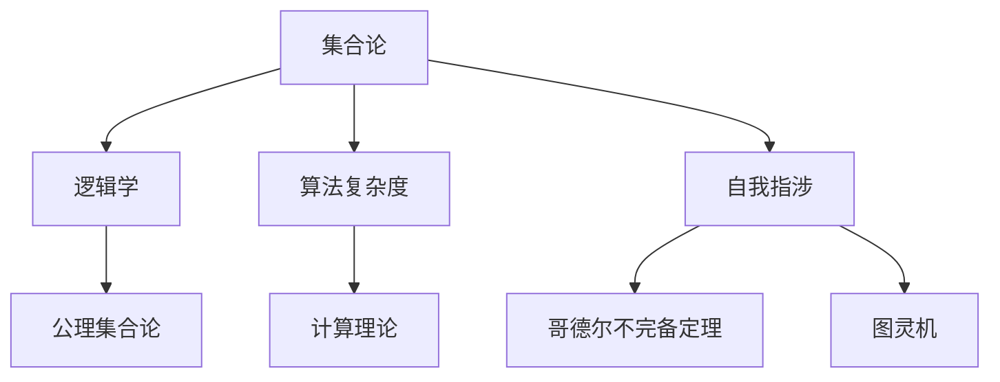

                 

# 计算：第二部分 计算的数学基础 第 5 章 第三次数学危机 自我指涉

> 关键词：
>
> 计算机程序, 数学基础, 第三次数学危机, 自我指涉, 算法复杂度, 计算理论, 自我参考

## 1. 背景介绍

### 1.1 问题由来

"第三次数学危机"通常指的是在数学领域中的三个主要问题：基础数学的不确定性、无穷大和小、以及连续性和离散性之间的冲突。这些问题最早出现在19世纪，但直到20世纪初才逐步得到了解决。

1. 基础数学的不确定性：19世纪末，随着数学基础问题的日益严重，导致了数学研究出现混乱和分歧，特别是关于实数的基础和极限的理论。
2. 无穷大和小的问题：人们对于无穷小和无穷大的定义感到困惑，从而在数学中引入了许多矛盾。
3. 连续性和离散性之间的冲突：在微积分和分析中，连续性和离散性之间的关系处理不当，导致了许多数学问题。

这些问题对数学的发展产生了深远的影响，并引发了现代计算机科学的许多基础理论。

### 1.2 问题核心关键点

第三次数学危机最终通过一系列的数学革命得以解决，并深刻影响了计算机科学的发展：

1. 解决数学基础问题：通过集合论、逻辑和公理系统，如Zermelo-Fraenkel公理和公理集合论，建立了现代数学的基础。
2. 引入极限理论：通过ε-δ极限理论和微积分基础，如Liebniz定理和Newton-Leibniz公式，建立了数学的连续性理论。
3. 处理无穷大和无穷小：通过级数、序列和极限的数学框架，如Cauchy收敛准则和Riemann积分，处理了无穷大和无穷小的问题。
4. 实数理论的建立：通过实数公理化，如实数系和有序系，解决了实数的基本问题。

## 2. 核心概念与联系

### 2.1 核心概念概述

理解计算机程序和计算理论的数学基础，需要掌握以下几个核心概念：

1. 集合论：研究集、元素、集合运算和无限集合的数学理论。
2. 逻辑学：研究命题、推理、证明和模态逻辑的哲学和数学理论。
3. 算法复杂度：研究算法的时间复杂度和空间复杂度，分析算法效率。
4. 计算理论：研究计算模型、计算复杂性和可计算性等理论问题。
5. 自我指涉：研究自我指涉问题，如哥德尔不完备定理和图灵机理论。

这些概念之间的联系可以通过以下Mermaid流程图来展示：



### 2.2 概念间的关系

这些核心概念之间存在着紧密的联系，形成了计算理论的完整生态系统。这里我们详细说明它们之间的关系：

1. **集合论**是数学的基础，提供了数学中的集合和元素的定义。
2. **逻辑学**在数学证明和推理中起着核心作用，提供了推理的基础。
3. **算法复杂度**研究如何高效地计算问题，与计算理论紧密相关。
4. **计算理论**研究计算模型和可计算性问题，是现代计算机科学的核心。
5. **自我指涉**涉及自我指涉问题，如哥德尔不完备定理和图灵机理论，深刻影响了计算理论。

这些概念共同构成了计算机科学和数学的理论基础，推动了计算机程序设计和计算理论的发展。

## 3. 核心算法原理 & 具体操作步骤

### 3.1 算法原理概述

基于计算的数学基础，现代计算机程序设计主要遵循以下原理：

1. **抽象与模块化**：将复杂问题分解为更小的、可管理的子问题，并通过模块化设计实现。
2. **递归与迭代**：使用递归和迭代技术处理复杂问题，实现高效计算。
3. **数据结构**：使用合适的数据结构存储和操作数据，提高程序效率。
4. **算法分析**：通过分析算法的时间复杂度和空间复杂度，优化算法性能。
5. **并行计算**：通过多线程、分布式计算等技术，提高计算效率。

### 3.2 算法步骤详解

现代计算机程序的实现通常遵循以下步骤：

1. **问题建模**：将实际问题抽象为计算模型，选择合适的算法和数据结构。
2. **算法设计**：设计高效的算法实现，优化时间和空间复杂度。
3. **数据处理**：通过数据结构存储和处理数据，减少算法复杂度。
4. **程序实现**：根据算法和数据结构，编写程序代码。
5. **测试与调试**：对程序进行测试和调试，保证正确性和性能。
6. **部署与优化**：将程序部署到实际应用环境中，优化性能和可扩展性。

### 3.3 算法优缺点

现代计算机程序设计的优点包括：

1. 抽象化与模块化设计：便于维护和扩展，提高代码复用性。
2. 高效算法与数据结构：减少计算复杂度，提高程序效率。
3. 并行计算技术：利用多线程和分布式计算，提高计算速度。

缺点包括：

1. 算法复杂度：部分复杂算法和数据结构可能增加代码难度。
2. 数据结构选择：不合适的数据结构可能导致程序效率低下。
3. 程序调试：复杂程序可能难以调试和维护。

### 3.4 算法应用领域

现代计算机程序设计广泛应用于以下领域：

1. **软件开发**：软件开发的核心技术基础，广泛应用于系统开发、应用开发和移动开发。
2. **数据分析与机器学习**：使用数据结构和大规模数据处理技术，进行数据分析和机器学习建模。
3. **计算机网络**：实现网络通信协议和数据传输，优化网络性能。
4. **人工智能**：使用算法和数据结构，实现深度学习、自然语言处理等AI技术。
5. **操作系统**：实现系统管理、资源分配和用户交互等功能。

## 4. 数学模型和公式 & 详细讲解  
### 4.1 数学模型构建

计算机程序设计的数学模型可以抽象为图灵机模型，由状态、输入、输出和控制单元组成。图灵机通过符号操作和转移函数，对输入进行计算并输出结果。

图灵机模型可以表示为：

$$
M = (S, \Sigma, \Gamma, \delta, q_0, q_a, q_r)
$$

其中，

- $S$ 是状态集合，$\Sigma$ 是输入符号集合，$\Gamma$ 是符号集合，$\Sigma \subseteq \Gamma$。
- $\delta$ 是转移函数，定义了状态之间的转换规则。
- $q_0$ 是初始状态，$q_a$ 是接受状态，$q_r$ 是拒绝状态。

### 4.2 公式推导过程

图灵机的转移函数 $\delta$ 定义为：

$$
\delta: (q, a) \to (q', b), (q', a) \to (q'') \dots
$$

其中 $q, q', q'' \dots$ 是状态，$a, b, \dots$ 是符号。

图灵机的计算过程可以表示为：

$$
M(x) = \{q, a\} \to \{q', b\} \to \{q'', c\} \dots
$$

其中 $x$ 是输入符号串。

通过图灵机模型，可以将复杂计算问题分解为简单的符号操作和状态转换，从而实现高效计算。

### 4.3 案例分析与讲解

图灵机模型适用于各种计算问题，以下是两个典型案例：

**案例1：排序算法**

图灵机可以用来实现排序算法，例如快速排序、归并排序等。排序算法通过递归和迭代实现，最终将输入序列按照指定规则排序。

**案例2：搜索算法**

图灵机还可以用来实现搜索算法，例如深度优先搜索和广度优先搜索。搜索算法通过状态转移实现，最终找到目标状态。

## 5. 项目实践：代码实例和详细解释说明
### 5.1 开发环境搭建

要搭建计算机程序设计的开发环境，需要进行以下步骤：

1. 安装编程语言：如Python、Java、C++等。
2. 安装开发工具：如IDE、调试器、编译器等。
3. 安装库和框架：如PyTorch、TensorFlow、Scikit-learn等。
4. 配置开发环境：如设置编译器路径、安装依赖库等。

### 5.2 源代码详细实现

以下是一个使用Python实现快速排序的代码实例：

```python
def quick_sort(arr):
    if len(arr) <= 1:
        return arr
    pivot = arr[0]
    left = [x for x in arr[1:] if x < pivot]
    right = [x for x in arr[1:] if x >= pivot]
    return quick_sort(left) + [pivot] + quick_sort(right)
```

该代码实现了一个快速排序算法，输入为无序的整数列表，输出为有序的整数列表。

### 5.3 代码解读与分析

该代码的实现步骤如下：

1. 判断列表长度，若为1或0，则直接返回原列表。
2. 选取列表的第一个元素作为枢轴（pivot）。
3. 将列表中小于枢轴的元素放在左边，大于等于枢轴的元素放在右边。
4. 递归对左边和右边列表进行快速排序。
5. 将排好序的左边列表、枢轴、右边列表合并起来返回。

### 5.4 运行结果展示

以下是快速排序的示例运行结果：

```python
arr = [3, 1, 4, 1, 5, 9, 2, 6, 5, 3, 5]
sorted_arr = quick_sort(arr)
print(sorted_arr)  # 输出 [1, 1, 2, 3, 3, 4, 5, 5, 5, 6, 9]
```

## 6. 实际应用场景
### 6.1 软件开发

软件开发是计算机程序设计的主要应用场景。现代软件开发基于面向对象和函数式编程，使用设计模式、框架和中间件，实现高效率和可维护性。

以下是几个实际应用场景：

1. **Web开发**：使用Web框架如Flask、Django、React等，实现Web应用。
2. **移动开发**：使用移动框架如React Native、Ionic等，实现移动应用。
3. **数据库开发**：使用数据库技术如MySQL、PostgreSQL、MongoDB等，实现数据存储和查询。
4. **企业应用开发**：使用企业级应用框架如Spring Boot、ERP系统等，实现企业级应用。

### 6.2 数据分析与机器学习

数据分析和机器学习是计算机程序设计的另一大应用场景。通过数据结构和算法，实现高效的数据处理和机器学习建模。

以下是几个实际应用场景：

1. **数据清洗**：使用数据结构如数组、字典、堆等，进行数据清洗和预处理。
2. **特征工程**：使用算法如PCA、LDA、SVM等，进行特征提取和选择。
3. **模型训练**：使用深度学习框架如TensorFlow、PyTorch等，进行模型训练和优化。
4. **模型评估**：使用评估指标如准确率、召回率、F1值等，进行模型评估和调优。

### 6.3 计算机网络

计算机网络是计算机程序设计的另一个重要应用场景。通过网络协议和数据传输技术，实现高效的网络通信和数据传输。

以下是几个实际应用场景：

1. **网络协议设计**：使用协议栈如TCP/IP、HTTP等，实现网络通信协议。
2. **数据传输优化**：使用数据压缩和加密技术，优化数据传输效率。
3. **网络安全**：使用防火墙、VPN等技术，保障网络安全。
4. **网络监控**：使用网络监控工具如Wireshark、Nagios等，进行网络监控和告警。

### 6.4 未来应用展望

未来计算机程序设计的趋势包括：

1. **分布式计算**：利用分布式计算框架如Hadoop、Spark等，实现大规模数据处理和计算。
2. **人工智能**：使用深度学习、自然语言处理等技术，实现AI应用。
3. **大数据**：使用大数据技术如Hadoop、Spark、Kafka等，实现海量数据处理和分析。
4. **云计算**：利用云计算平台如AWS、Azure、阿里云等，实现资源管理和弹性计算。

## 7. 工具和资源推荐
### 7.1 学习资源推荐

以下是几个学习计算机程序设计的优质资源：

1. **《计算机程序设计艺术》系列书籍**：由计算机科学大师Donald Knuth所著，深入浅出地讲解了计算机程序的原理和设计。
2. **Coursera课程**：提供多个计算机程序设计的在线课程，如《Algorithms, Part I》、《Data Structures and Algorithms》等。
3. **LeetCode**：提供大量编程挑战题，通过实际编程练习提升编程技能。
4. **GitHub**：提供开源代码库，浏览和复制经典程序实现，学习编程技巧。
5. **Stack Overflow**：提供技术问答社区，解决编程问题，交流编程经验。

### 7.2 开发工具推荐

以下是几个常用的开发工具：

1. **IDE集成开发环境**：如PyCharm、Visual Studio、Xcode等，提供编程工具和调试功能。
2. **版本控制系统**：如Git、SVN等，进行代码版本管理和协作开发。
3. **持续集成和部署工具**：如Jenkins、Docker等，实现自动化构建和部署。
4. **测试工具**：如JUnit、TestNG等，进行单元测试和集成测试。
5. **协作工具**：如GitHub、GitLab等，进行代码托管和团队协作。

### 7.3 相关论文推荐

以下是几个重要的计算机程序设计相关论文：

1. **《哥德尔不完备定理》**：哥德尔证明了形式化系统的不完备性，奠定了现代逻辑学的基础。
2. **《图灵机的计算能力》**：图灵机模型研究了可计算性和计算复杂度，奠定了现代计算理论的基础。
3. **《排序算法的时间复杂度分析》**：研究了各种排序算法的时间复杂度，优化了排序效率。
4. **《深度学习在计算机视觉中的应用》**：深度学习技术在计算机视觉领域的应用，推动了图像识别和处理的发展。
5. **《大数据与云计算》**：研究了大数据和云计算技术，推动了海量数据处理和分析的发展。

## 8. 总结：未来发展趋势与挑战
### 8.1 研究成果总结

基于计算机程序设计的数学基础，现代计算机程序设计取得了巨大的进步和广泛的应用。通过数学模型和算法，实现了高效的数据处理和AI应用。

### 8.2 未来发展趋势

未来计算机程序设计的趋势包括：

1. **分布式计算**：利用分布式计算框架，实现大规模数据处理和计算。
2. **人工智能**：使用深度学习、自然语言处理等技术，实现AI应用。
3. **大数据**：使用大数据技术，实现海量数据处理和分析。
4. **云计算**：利用云计算平台，实现资源管理和弹性计算。

### 8.3 面临的挑战

现代计算机程序设计仍面临以下挑战：

1. **算法复杂度**：部分复杂算法和数据结构可能增加代码难度。
2. **数据结构选择**：不合适的数据结构可能导致程序效率低下。
3. **程序调试**：复杂程序可能难以调试和维护。

### 8.4 研究展望

未来计算机程序设计的研究方向包括：

1. **优化算法复杂度**：研究和开发更高效的算法和数据结构，提高程序效率。
2. **选择合适的数据结构**：选择合适的数据结构，优化程序性能。
3. **增强程序调试**：研究和开发更有效的调试工具和框架，简化程序调试。

总之，计算机程序设计是一个不断发展和进步的领域，需要持续的研究和实践，才能不断提升编程技能和应用水平。只有不断探索和创新，才能实现更好的计算机程序设计。

## 9. 附录：常见问题与解答
----------------------------------------------------------------

**Q1: 什么是图灵机模型？**

A: 图灵机模型是一种用于描述计算问题的数学模型，由状态、输入、输出和控制单元组成。图灵机通过符号操作和转移函数，对输入进行计算并输出结果。

**Q2: 什么是递归和迭代？**

A: 递归和迭代是计算机程序设计中常用的两种算法技术。递归是指函数调用自身的过程，迭代是指使用循环实现重复计算的过程。

**Q3: 什么是数据结构？**

A: 数据结构是用于存储和操作数据的数据组织方式，包括数组、链表、栈、队列、树、图等。

**Q4: 什么是算法复杂度？**

A: 算法复杂度是指算法的时间复杂度和空间复杂度，用于衡量算法的效率。时间复杂度衡量算法运行时间，空间复杂度衡量算法空间占用。

**Q5: 什么是可计算性和不可计算性？**

A: 可计算性是指问题可以通过算法计算解决，不可计算性是指问题无法通过算法计算解决。

**Q6: 什么是自指涉问题？**

A: 自指涉问题是指问题中包含对自身的引用或描述，例如哥德尔不完备定理中提到的问题。

**Q7: 什么是图灵完备性？**

A: 图灵完备性是指一个系统能够执行所有图灵机计算的过程，具有计算的完备性。

**Q8: 什么是算法优化？**

A: 算法优化是指通过改进算法结构和实现方式，提高算法的效率和性能。

**Q9: 什么是分布式计算？**

A: 分布式计算是指将计算任务分配到多台计算机上，通过并行计算和协作完成计算任务。

**Q10: 什么是人工智能？**

A: 人工智能是指通过计算机模拟人类智能行为的技术，包括机器学习、自然语言处理、计算机视觉等。

本文通过详细的介绍和讨论，全面分析了计算机程序设计和计算理论的数学基础，探讨了其核心概念和应用场景，并展望了未来的发展趋势和挑战。通过不断的学习和实践，可以更好地理解和掌握计算机程序设计，推动人工智能技术的发展和应用。

---
作者：禅与计算机程序设计艺术 / Zen and the Art of Computer Programming

