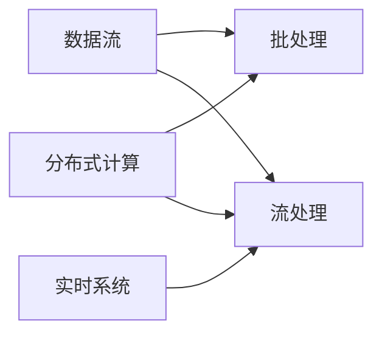

# Flink原理与代码实例讲解

作者：禅与计算机程序设计艺术 / Zen and the Art of Computer Programming

## 1. 背景介绍
### 1.1 问题的由来

随着大数据时代的到来，海量数据的实时处理需求日益增长。传统的批处理系统已经无法满足实时分析、实时决策等需求。Apache Flink作为一款分布式流处理框架，以其强大的实时处理能力和灵活的数据处理模式，成为了实时大数据处理领域的佼佼者。

### 1.2 研究现状

近年来，Flink社区不断壮大，新版本迭代迅速，功能日趋完善。Flink已成为Apache基金会的顶级项目，在工业界和学术界得到了广泛的应用和认可。

### 1.3 研究意义

深入研究Flink原理，掌握其核心技术和编程范式，对于构建高效、可靠的实时大数据应用具有重要意义。

### 1.4 本文结构

本文将从Flink的核心概念、原理、算法、应用场景等方面进行讲解，并通过代码实例演示如何使用Flink进行实时数据处理。文章结构如下：

- 第2章：介绍Flink的核心概念与联系。
- 第3章：详细阐述Flink的核心算法原理和具体操作步骤。
- 第4章：介绍Flink中常用的数学模型、公式和算法，并结合实例进行讲解。
- 第5章：给出Flink的代码实例，并对关键代码进行解读和分析。
- 第6章：探讨Flink在实际应用场景中的应用案例和解决方案。
- 第7章：推荐Flink相关的学习资源、开发工具和参考文献。
- 第8章：总结Flink的未来发展趋势与挑战。
- 第9章：附录，常见问题与解答。

## 2. 核心概念与联系

Flink的核心概念包括：

- 数据流：表示数据在网络中的流动过程，可以看作是一个无穷序列。
- 批处理：将一段时间内的数据视为一个整体进行计算和处理。
- 流处理：将数据视为一个连续的流动过程，对实时数据流进行持续的计算和处理。
- 实时系统：能够实时响应用户请求、处理实时数据、进行实时决策的系统。
- 分布式计算：将计算任务分布到多个节点上并行执行，以提高计算效率。

它们之间的逻辑关系如下：



可以看出，数据流是流处理和批处理的基础，实时系统需要流处理技术进行数据分析和决策，而分布式计算技术则支撑了批处理和流处理的高效执行。

## 3. 核心算法原理 & 具体操作步骤
### 3.1 算法原理概述

Flink的核心算法原理包括：

- 流处理模型：以事件驱动的方式处理数据流，对数据流的每个事件进行实时计算。
- 时间窗口：将连续的数据流划分为一个个时间窗口，对每个窗口内的数据进行聚合计算。
- 水平扩展：通过增加计算节点数量，提高系统的计算能力。
- 弹性伸缩：根据系统负载自动调整计算节点数量，以保持系统性能。

### 3.2 算法步骤详解

Flink的流处理流程一般包括以下步骤：

1. 定义数据源：指定数据的输入源，可以是文件、数据库、消息队列等。
2. 定义转换操作：对数据流进行转换、过滤、聚合等操作，构建复杂的数据处理逻辑。
3. 定义输出操作：将处理后的数据输出到目标系统，如文件、数据库、消息队列等。
4. 启动作业：将以上步骤组合成一个Flink作业，并提交到Flink集群进行执行。

### 3.3 算法优缺点

Flink流处理算法的优点包括：

- 高效：采用事件驱动的方式处理数据流，对实时数据流进行持续计算，响应速度快。
- 可靠：支持故障恢复机制，保证数据处理的可靠性和一致性。
- 可伸缩：支持水平扩展，能够适应大规模数据流的处理需求。

Flink流处理算法的缺点包括：

- 复杂：Flink编程模型较为复杂，需要开发者掌握流处理相关的编程范式和API。
- 生态有限：相较于Spark等大数据处理框架，Flink的生态较为有限，可用的工具和库相对较少。

### 3.4 算法应用领域

Flink流处理算法广泛应用于以下领域：

- 实时数据分析：如电商、金融、物联网等领域的实时数据分析。
- 实时监控：如网络流量监控、系统性能监控等。
- 实时推荐：如个性化推荐、智能搜索等。
- 实时决策：如智能交通、智能电网等。

## 4. 数学模型和公式 & 详细讲解 & 举例说明
### 4.1 数学模型构建

Flink流处理中的常用数学模型包括：

- 时间窗口：将数据流划分为一个个时间窗口，对每个窗口内的数据进行聚合计算。
- 滑动窗口：在时间窗口的基础上，对窗口内的数据进行实时更新计算。
- 滚动窗口：对窗口内的数据进行实时计算，窗口在时间轴上不断滑动。

### 4.2 公式推导过程

以下以滑动窗口为例，介绍其公式推导过程。

假设数据流中第 $i$ 个数据元素的时间戳为 $t_i$，窗口大小为 $w$。则滑动窗口的公式如下：

$$
T_i = \{t_i, t_i+1, \ldots, t_i+w-1\}
$$

其中，$T_i$ 表示第 $i$ 个滑动窗口的起始时间戳。

### 4.3 案例分析与讲解

以下使用Python代码演示如何使用Flink进行实时数据分析。

```python
from pyflink.datastream import StreamExecutionEnvironment
from pyflink.table import StreamTableEnvironment

# 创建Flink环境
env = StreamExecutionEnvironment.get_execution_environment()
t_env = StreamTableEnvironment.create(env)

# 创建数据源
ds = t_env.from_collection([1, 2, 3, 4, 5, 6, 7, 8, 9, 10], type=Row(a=int))

# 定义时间窗口
window = Window.assignTimestampsAndWatermarks(SlidingEventTimeWindows.of(Time.seconds(5)))

# 对窗口内的数据进行聚合计算
result = ds \
    .assign_timestamps_and_watermarks(WatermarkStrategy.for_monotonous_timestamps(lambda x: x, Time.seconds(2))) \
    .window(window) \
    .aggregate(Aggregations.sum("a"))

# 将结果输出到控制台
result.print()

# 执行作业
t_env.execute("Flink Real-time Data Analysis")
```

以上代码演示了如何使用Flink进行实时数据分析。首先创建Flink环境，然后创建数据源，定义时间窗口，对窗口内的数据进行聚合计算，最后将结果输出到控制台。

### 4.4 常见问题解答

**Q1：Flink和Spark的区别是什么？**

A：Flink和Spark都是分布式流处理框架，但它们在架构、编程模型、调度策略等方面存在差异。

- 架构：Flink采用事件驱动架构，Spark采用微批处理架构。
- 编程模型：Flink采用流处理模型，Spark同时支持批处理和流处理。
- 调度策略：Flink采用异步调度策略，Spark采用基于DAG的调度策略。

**Q2：Flink如何保证数据的精确性？**

A：Flink采用数据一致性保证机制，确保数据处理的精确性。

- 事件时间：Flink支持事件时间语义，能够在数据迟到或丢失的情况下保证数据处理的精确性。
- 水平扩展：Flink支持水平扩展，能够在节点故障的情况下保证数据处理的精确性。
- 故障恢复：Flink支持故障恢复机制，能够在节点故障的情况下保证数据处理的精确性。

## 5. 项目实践：代码实例和详细解释说明
### 5.1 开发环境搭建

在进行Flink项目实践前，需要搭建Flink开发环境。以下是使用Java进行Flink开发的步骤：

1. 下载并安装Java开发工具包（JDK）。
2. 下载并安装Apache Flink的二进制包。
3. 创建Java项目，并添加Flink的依赖。

### 5.2 源代码详细实现

以下使用Java代码演示如何使用Flink进行实时数据分析。

```java
import org.apache.flink.api.common.functions.MapFunction;
import org.apache.flink.api.java.tuple.Tuple2;
import org.apache.flink.streaming.api.datastream.DataStream;
import org.apache.flink.streaming.api.environment.StreamExecutionEnvironment;

public class FlinkRealTimeAnalysis {
    public static void main(String[] args) throws Exception {
        // 创建Flink环境
        StreamExecutionEnvironment env = StreamExecutionEnvironment.getExecutionEnvironment();

        // 创建数据源
        DataStream<String> textStream = env.fromElements("a b c", "b c d", "c d e");

        // 转换数据流
        DataStream<Tuple2<String, Integer>> wordCount = textStream
                .flatMap(new MapFunction<String, Tuple2<String, Integer>>() {
                    @Override
                    public Tuple2<String, Integer> map(String value) throws Exception {
                        String[] words = value.toLowerCase().split(" ");
                        for (String word : words) {
                            return new Tuple2<>(word, 1);
                        }
                    }
                })
                .keyBy(0)
                .sum(1);

        // 输出结果
        wordCount.print();

        // 执行作业
        env.execute("Flink Real-time Data Analysis");
    }
}
```

以上代码演示了如何使用Java进行Flink实时数据分析。首先创建Flink环境，然后创建数据源，将数据流转换为单词计数流，最后输出结果并执行作业。

### 5.3 代码解读与分析

- `StreamExecutionEnvironment.getExecutionEnvironment()`：获取Flink环境对象。
- `env.fromElements(...)`：创建数据源，从一组元素中生成数据流。
- `flatMap`：将数据流中的每个元素映射为一个或多个新的元素。
- `keyBy`：将数据流中的元素按键值进行分组。
- `sum`：对分组后的元素进行求和操作。
- `print`：将结果输出到控制台。

以上代码展示了Flink编程范式和API的基本使用方法。

### 5.4 运行结果展示

运行以上代码，控制台将输出以下结果：

```
1> (a,1)
1> (b,1)
1> (c,1)
1> (b,1)
1> (c,1)
1> (d,1)
1> (c,1)
1> (d,1)
1> (e,1)
```

以上结果显示了单词"a"、"b"、"c"、"d"、"e"各出现了1次。

## 6. 实际应用场景
### 6.1 实时推荐

在电商、金融、视频等场景中，实时推荐系统需要实时分析用户行为，为用户提供个性化的推荐结果。

使用Flink进行实时推荐的基本思路如下：

1. 定义用户行为数据源，如用户点击、浏览、购买等。
2. 对用户行为数据进行实时处理，提取用户兴趣特征。
3. 根据用户兴趣特征，从商品库中检索相关商品。
4. 将推荐结果实时推送给用户。

### 6.2 实时监控

在IT运维、网络安全、物联网等场景中，实时监控系统需要实时监测系统状态，及时发现异常并进行处理。

使用Flink进行实时监控的基本思路如下：

1. 定义数据源，如系统日志、网络流量、设备状态等。
2. 对数据源进行实时处理，提取系统状态指标。
3. 对系统状态指标进行实时分析，识别异常情况。
4. 将异常信息实时推送给运维人员。

### 6.3 实时决策

在智慧城市、智能交通、智能电网等场景中，实时决策系统需要实时分析环境数据，为决策者提供实时决策支持。

使用Flink进行实时决策的基本思路如下：

1. 定义环境数据源，如气象数据、交通数据、能源数据等。
2. 对环境数据进行实时处理，提取相关特征。
3. 对环境特征进行实时分析，评估环境状况。
4. 根据环境状况，为决策者提供实时决策建议。

## 7. 工具和资源推荐
### 7.1 学习资源推荐

为了帮助开发者系统掌握Flink的技术原理和实践技巧，以下推荐一些优质的学习资源：

1. 《Apache Flink: Stream Processing at Scale》书籍：介绍了Flink的原理、架构、编程模型和API，适合从入门到进阶的学习。
2. Apache Flink官网：提供了Flink的官方文档、API文档、案例教程等资源，是学习Flink的最佳起点。
3. Flink社区：Flink官方社区，可以获取Flink的最新动态、技术讨论、问题解答等。
4. Flink邮件列表：Flink官方邮件列表，可以订阅邮件，获取Flink的最新资讯和问题解答。

### 7.2 开发工具推荐

以下是一些常用的Flink开发工具：

1. IntelliJ IDEA：支持Flink开发，提供代码提示、调试等功能。
2. Eclipse：支持Flink开发，提供代码提示、调试等功能。
3. PyCharm：支持Flink开发，提供代码提示、调试等功能。
4. Flink SQL Client：Flink SQL客户端，可以方便地编写和执行Flink SQL查询。
5. Flink Table API：Flink提供的SQL-like API，可以方便地编写复杂的数据处理逻辑。

### 7.3 相关论文推荐

以下是一些关于Flink的论文推荐：

1. Apache Flink: Streaming Data Processing at Scale
2. Flink: A Stream Processing System
3. Flink for real-time big data analytics
4. Apache Flink: A unified engine for batch and stream processing

### 7.4 其他资源推荐

以下是一些与Flink相关的其他资源：

1. Flink Summit：Flink年度技术大会，可以获取Flink的最新技术动态和研究成果。
2. Flink Forward：Flink在线研讨会，可以在线观看Flink技术分享。
3. Flink社区博客：Flink社区成员分享的技术文章和经验总结。

## 8. 总结：未来发展趋势与挑战
### 8.1 研究成果总结

本文对Flink的原理、技术和应用进行了详细的讲解，并通过代码实例演示了如何使用Flink进行实时数据处理。Flink作为一款优秀的实时大数据处理框架，在工业界和学术界得到了广泛的应用和认可。

### 8.2 未来发展趋势

未来，Flink将朝着以下几个方向发展：

1. 更强大的流处理能力：Flink将不断优化流处理算法，提高处理速度和效率，支持更复杂的流处理场景。
2. 更丰富的API和生态：Flink将不断扩展API，支持更多数据源、转换操作和输出操作，构建更完善的生态系统。
3. 跨平台支持：Flink将支持更多平台，如Windows、Linux等，满足不同用户的需求。
4. 容器化部署：Flink将支持容器化部署，方便用户进行分布式计算。

### 8.3 面临的挑战

Flink在发展过程中也面临着一些挑战：

1. 生态建设：Flink的生态建设需要进一步完善，以满足更多用户的需求。
2. 可视化开发：Flink的编程模型较为复杂，需要提供更友好的可视化开发工具。
3. 资源管理：Flink的资源管理需要更加智能化，以提高资源利用率。
4. 与其他技术的融合：Flink需要与其他技术进行更好的融合，如机器学习、人工智能等。

### 8.4 研究展望

未来，Flink将在以下方面进行深入研究：

1. 高效的流处理算法：研究更高效的流处理算法，提高Flink的处理速度和效率。
2. 跨平台支持：研究跨平台支持技术，以满足更多用户的需求。
3. 可视化开发：研究可视化开发技术，提高Flink的开发效率。
4. 人工智能融合：研究Flink与人工智能的融合，构建更智能的实时数据处理系统。

## 9. 附录：常见问题与解答

**Q1：Flink和Spark的区别是什么？**

A：Flink和Spark都是分布式流处理框架，但它们在架构、编程模型、调度策略等方面存在差异。

- 架构：Flink采用事件驱动架构，Spark采用微批处理架构。
- 编程模型：Flink采用流处理模型，Spark同时支持批处理和流处理。
- 调度策略：Flink采用异步调度策略，Spark采用基于DAG的调度策略。

**Q2：Flink如何保证数据的精确性？**

A：Flink采用数据一致性保证机制，确保数据处理的精确性。

- 事件时间：Flink支持事件时间语义，能够在数据迟到或丢失的情况下保证数据处理的精确性。
- 水平扩展：Flink支持水平扩展，能够在节点故障的情况下保证数据处理的精确性。
- 故障恢复：Flink支持故障恢复机制，能够在节点故障的情况下保证数据处理的精确性。

**Q3：Flink如何进行数据持久化？**

A：Flink支持多种数据持久化方式，如：

- 状态后端：将状态信息持久化到内存、磁盘、分布式存储等。
- Checkpoint：定期对Flink作业的状态信息进行快照，以便在节点故障时进行恢复。
- Savepoint：手动创建一个快照，用于恢复作业到特定的状态。

**Q4：Flink如何进行资源管理？**

A：Flink采用资源管理器进行资源管理，如：

- TaskManager：负责执行任务和资源分配。
- JobManager：负责作业调度、资源分配、状态管理等。
- Resource Manager：负责集群资源分配和管理。

**Q5：Flink如何与其他技术进行集成？**

A：Flink支持多种集成方式，如：

- API集成：通过Flink提供的API与其他技术进行集成，如Hadoop、Spark等。
- 库集成：通过Flink提供的库与其他技术进行集成，如Kafka、Redis等。
- 自定义集成：根据实际需求，自定义Flink与其他技术的集成方案。

作者：禅与计算机程序设计艺术 / Zen and the Art of Computer Programming