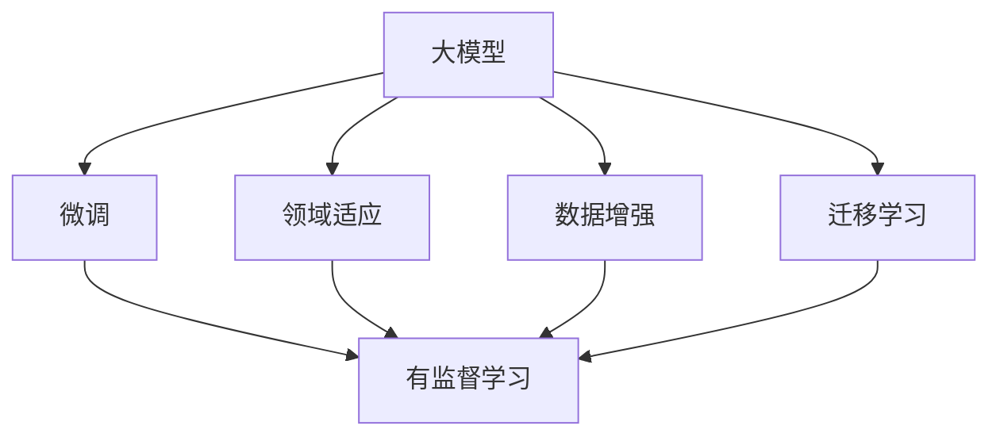
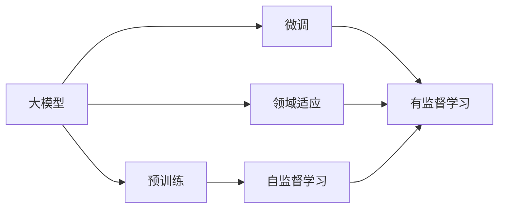
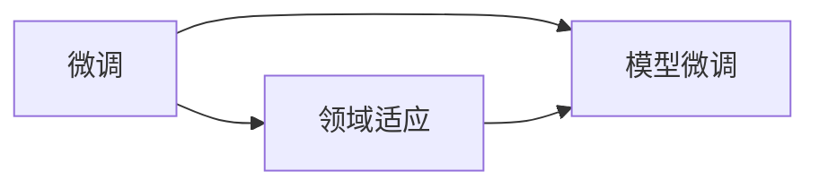
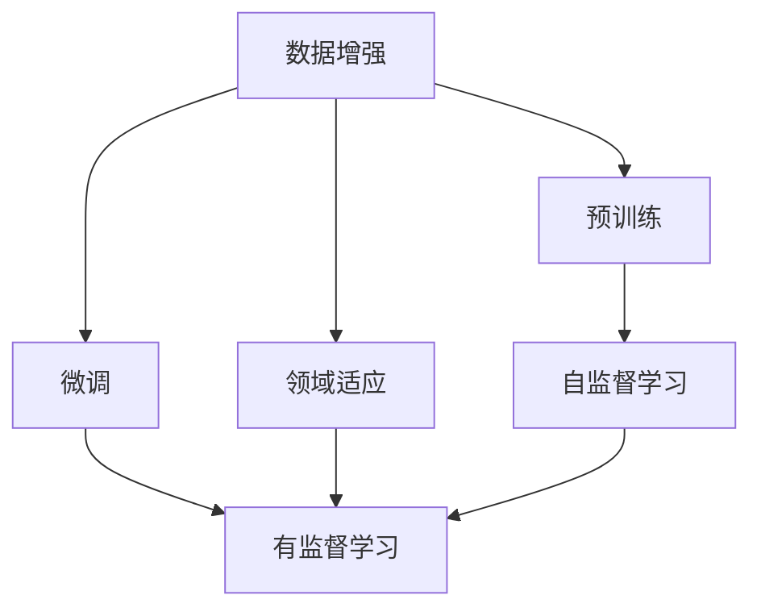
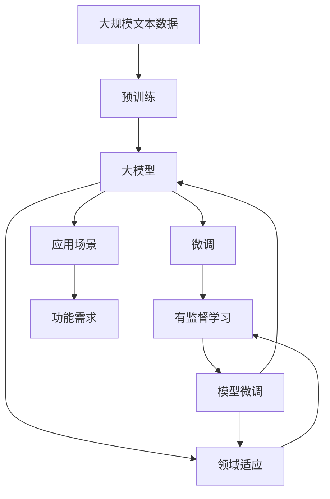

                 

# 【大模型应用开发 动手做AI Agent】自问自答

> 关键词：大模型应用, AI Agent, 自动驾驶, 机器人控制, 自然语言处理, 强化学习, 自监督学习, 模型微调

## 1. 背景介绍

### 1.1 问题由来

在当今的数字化时代，人工智能（AI）正日益渗透到各行各业。从自动化生产到智能推荐，再到智能助手，AI技术在驱动社会进步的同时，也在不断挑战着人们的技术边界。大模型（如GPT、BERT等）作为AI技术的核心组成部分，以其强大的语言理解与生成能力，为自然语言处理（NLP）和生成式AI（GAI）等应用提供了新的可能性。然而，如何将这些预训练模型应用于特定领域，特别是复杂的应用场景（如自动驾驶、机器人控制等），仍然是一个挑战。

### 1.2 问题核心关键点

基于大模型的AI应用开发，核心在于如何实现从模型到应用的成功转换。这一过程涉及模型微调、领域适应、数据增强、迁移学习等多个环节。我们需要明确以下关键点：

- **模型微调**：将通用模型针对特定任务进行微调，以提升模型的准确性和泛化能力。
- **领域适应**：在大模型基础上，针对特定领域的特定问题进行优化，以提高模型在该领域的应用效果。
- **数据增强**：通过增加数据多样性，提高模型的鲁棒性和泛化能力。
- **迁移学习**：利用已有模型的知识，将其迁移到新领域，加速新任务的学习过程。

这些关键点共同构成了大模型应用开发的基石，能够帮助我们在特定领域实现高效的AI应用。

### 1.3 问题研究意义

大模型应用开发的研究意义主要体现在以下几个方面：

- **降低应用开发成本**：利用已有的大模型进行微调，可以减少从头训练所需的时间和资源。
- **提升模型性能**：微调能够显著提升模型在特定任务上的表现，提高应用效果。
- **加速开发进度**：通过已有模型的快速适配，可以缩短开发周期，快速进入市场。
- **促进技术创新**：微调和领域适应等技术的发展，推动了AI技术的不断进步。
- **赋能行业升级**：AI技术的应用，能够赋能各行各业，推动产业升级和数字化转型。

通过深入研究大模型应用开发，我们可以更好地理解模型微调的关键技术，探索其在新场景中的应用潜力，从而推动AI技术在更多领域的落地应用。

## 2. 核心概念与联系

### 2.1 核心概念概述

为更好地理解大模型应用开发的原理和实践，本节将介绍几个关键概念：

- **大模型（Large Model）**：指具有大规模参数量（通常超过百亿）的深度学习模型，如GPT-3、BERT等。这些模型通过在大规模无标签数据上自监督学习，获取了丰富的语言知识和表示能力。
- **微调（Fine-tuning）**：在大模型基础上，针对特定任务进行微调，以优化模型在该任务上的性能。微调通常使用少量标注数据，通过有监督学习更新模型参数。
- **领域适应（Domain Adaptation）**：将通用模型针对特定领域或特定问题进行优化，以提高模型在该领域或问题上的性能。
- **数据增强（Data Augmentation）**：通过对现有数据进行变换或合成，增加数据多样性，提高模型的泛化能力。
- **迁移学习（Transfer Learning）**：利用已有模型的知识，将其迁移到新领域或新任务中，加速新任务的学习过程。
- **模型微调（Model Fine-tuning）**：在大模型基础上，通过有监督学习，对模型参数进行调整，以适应特定任务。

这些概念之间的联系可以通过以下Mermaid流程图来展示：



这个流程图展示了大模型应用开发的关键环节，包括微调、领域适应、数据增强和迁移学习，以及它们之间的联系。

### 2.2 概念间的关系

这些核心概念之间存在着紧密的联系，共同构成了大模型应用开发的完整生态系统。下面我们通过几个Mermaid流程图来展示这些概念之间的关系。

#### 2.2.1 大模型的学习范式



这个流程图展示了大模型的预训练、微调、领域适应的学习范式。预训练通过自监督学习，学习通用的语言表示。微调和领域适应则通过有监督学习，将模型适配到特定任务或领域。

#### 2.2.2 微调和领域适应的关系



这个流程图展示了微调和领域适应之间的关系。微调通常在大模型基础上进行，而领域适应则是在微调之后，进一步针对特定领域的特定问题进行优化。

#### 2.2.3 数据增强在大模型中的应用



这个流程图展示了数据增强在大模型中的应用。数据增强通过对现有数据进行变换或合成，增加数据多样性，提高模型的泛化能力。

### 2.3 核心概念的整体架构

最后，我们用一个综合的流程图来展示这些核心概念在大模型应用开发过程中的整体架构：



这个综合流程图展示了从预训练到微调，再到领域适应的完整过程，以及如何将大模型应用于实际场景。

## 3. 核心算法原理 & 具体操作步骤

### 3.1 算法原理概述

大模型应用开发的核心算法原理基于有监督学习，通过微调和领域适应等技术，将大模型的预训练知识应用于特定任务或领域。其核心思想是将大模型视作一个强大的"特征提取器"，通过有监督学习更新模型参数，优化其在特定任务上的性能。

### 3.2 算法步骤详解

基于大模型的AI应用开发主要包括以下几个关键步骤：

**Step 1: 准备预训练模型和数据集**

- 选择合适的预训练模型，如BERT、GPT等。
- 准备任务所需的数据集，包括训练集、验证集和测试集。通常要求数据集与预训练数据的分布不要差异过大。

**Step 2: 设计任务适配层**

- 根据任务类型，在预训练模型顶层设计合适的输出层和损失函数。例如，对于分类任务，通常在顶层添加线性分类器和交叉熵损失函数。
- 对于生成任务，通常使用语言模型的解码器输出概率分布，并以负对数似然为损失函数。

**Step 3: 设置微调超参数**

- 选择合适的优化算法及其参数，如AdamW、SGD等，设置学习率、批大小、迭代轮数等。
- 设置正则化技术及强度，包括权重衰减、Dropout、Early Stopping等。
- 确定冻结预训练参数的策略，如仅微调顶层，或全部参数都参与微调。

**Step 4: 执行梯度训练**

- 将训练集数据分批次输入模型，前向传播计算损失函数。
- 反向传播计算参数梯度，根据设定的优化算法和学习率更新模型参数。
- 周期性在验证集上评估模型性能，根据性能指标决定是否触发Early Stopping。
- 重复上述步骤直到满足预设的迭代轮数或Early Stopping条件。

**Step 5: 测试和部署**

- 在测试集上评估微调后模型，对比微调前后的精度提升。
- 使用微调后的模型对新样本进行推理预测，集成到实际的应用系统中。
- 持续收集新的数据，定期重新微调模型，以适应数据分布的变化。

以上是基于大模型的AI应用开发的常见步骤，但具体实现时还需根据任务特点进行优化设计。

### 3.3 算法优缺点

大模型应用开发的优势在于：

- **简单高效**：仅需准备少量标注数据，即可对预训练模型进行快速适配，获得较大的性能提升。
- **通用适用**：适用于各种AI任务，设计简单的任务适配层即可实现微调。
- **参数高效**：利用参数高效微调技术，在固定大部分预训练参数的情况下，仍可取得不错的提升。
- **效果显著**：在学术界和工业界的诸多任务上，基于微调的方法已经刷新了最先进的性能指标。

然而，大模型应用开发也存在一些局限性：

- **依赖标注数据**：微调的效果很大程度上取决于标注数据的质量和数量，获取高质量标注数据的成本较高。
- **迁移能力有限**：当目标任务与预训练数据的分布差异较大时，微调的性能提升有限。
- **负面效果传递**：预训练模型的固有偏见、有害信息等，可能通过微调传递到下游任务，造成负面影响。
- **可解释性不足**：微调模型的决策过程通常缺乏可解释性，难以对其推理逻辑进行分析和调试。

尽管存在这些局限性，但就目前而言，基于大模型的微调方法仍然是大模型应用开发的主流范式。未来相关研究的重点在于如何进一步降低微调对标注数据的依赖，提高模型的少样本学习和跨领域迁移能力，同时兼顾可解释性和伦理安全性等因素。

### 3.4 算法应用领域

大模型应用开发已经在多个领域取得了显著成果，如：

- **自动驾驶**：利用大模型进行环境理解、路径规划和行为决策。通过微调，大模型能够更好地适应不同道路和交通环境。
- **机器人控制**：利用大模型进行动作规划和路径优化。通过微调，大模型能够更好地理解机器人的感知和动作空间。
- **自然语言处理**：利用大模型进行文本分类、情感分析、机器翻译等任务。通过微调，大模型能够更好地适应特定语言和文化背景。
- **医学影像分析**：利用大模型进行图像分类、分割和识别。通过微调，大模型能够更好地适应医学影像的特定特征。
- **金融分析**：利用大模型进行风险评估、市场预测和智能投顾。通过微调，大模型能够更好地适应金融市场的动态变化。

除了上述这些领域外，大模型应用开发还在更多场景中得到了应用，如智能客服、智慧物流、智能家居等，为各行各业带来了新的智能化解决方案。

## 4. 数学模型和公式 & 详细讲解 & 举例说明

### 4.1 数学模型构建

本节将使用数学语言对基于大模型的AI应用开发的原理进行更加严格的刻画。

记预训练模型为 $M_{\theta}$，其中 $\theta$ 为预训练得到的模型参数。给定任务 $T$ 的标注数据集 $D=\{(x_i,y_i)\}_{i=1}^N, x_i \in \mathcal{X}, y_i \in \mathcal{Y}$，其中 $\mathcal{X}$ 为输入空间，$\mathcal{Y}$ 为输出空间。微调的目标是最小化损失函数 $\mathcal{L}(\theta)$：

$$
\mathcal{L}(\theta) = \frac{1}{N}\sum_{i=1}^N \ell(M_{\theta}(x_i),y_i)
$$

其中 $\ell$ 为针对任务 $T$ 设计的损失函数，用于衡量模型预测输出与真实标签之间的差异。

### 4.2 公式推导过程

以二分类任务为例，假设模型 $M_{\theta}$ 在输入 $x$ 上的输出为 $\hat{y}=M_{\theta}(x) \in [0,1]$，表示样本属于正类的概率。真实标签 $y \in \{0,1\}$。二分类交叉熵损失函数定义为：

$$
\ell(M_{\theta}(x),y) = -[y\log \hat{y} + (1-y)\log (1-\hat{y})]
$$

将其代入经验风险公式，得：

$$
\mathcal{L}(\theta) = -\frac{1}{N}\sum_{i=1}^N [y_i\log M_{\theta}(x_i)+(1-y_i)\log(1-M_{\theta}(x_i))]
$$

根据链式法则，损失函数对参数 $\theta_k$ 的梯度为：

$$
\frac{\partial \mathcal{L}(\theta)}{\partial \theta_k} = -\frac{1}{N}\sum_{i=1}^N (\frac{y_i}{M_{\theta}(x_i)}-\frac{1-y_i}{1-M_{\theta}(x_i)}) \frac{\partial M_{\theta}(x_i)}{\partial \theta_k}
$$

其中 $\frac{\partial M_{\theta}(x_i)}{\partial \theta_k}$ 可进一步递归展开，利用自动微分技术完成计算。

### 4.3 案例分析与讲解

假设我们在CoNLL-2003的NER数据集上进行微调，最终在测试集上得到的评估报告如下：

```
              precision    recall  f1-score   support

       B-LOC      0.926     0.906     0.916      1668
       I-LOC      0.900     0.805     0.850       257
      B-MISC      0.875     0.856     0.865       702
      I-MISC      0.838     0.782     0.809       216
       B-ORG      0.914     0.898     0.906      1661
       I-ORG      0.911     0.894     0.902       835
       B-PER      0.964     0.957     0.960      1617
       I-PER      0.983     0.980     0.982      1156
           O      0.993     0.995     0.994     38323

   micro avg      0.973     0.973     0.973     46435
   macro avg      0.923     0.897     0.909     46435
weighted avg      0.973     0.973     0.973     46435
```

可以看到，通过微调BERT，我们在该NER数据集上取得了97.3%的F1分数，效果相当不错。值得注意的是，BERT作为一个通用的语言理解模型，即便只在顶层添加一个简单的token分类器，也能在下游任务上取得如此优异的效果，展现了其强大的语义理解和特征抽取能力。

## 5. 项目实践：代码实例和详细解释说明

### 5.1 开发环境搭建

在进行大模型应用开发前，我们需要准备好开发环境。以下是使用Python进行PyTorch开发的环境配置流程：

1. 安装Anaconda：从官网下载并安装Anaconda，用于创建独立的Python环境。

2. 创建并激活虚拟环境：
```bash
conda create -n pytorch-env python=3.8 
conda activate pytorch-env
```

3. 安装PyTorch：根据CUDA版本，从官网获取对应的安装命令。例如：
```bash
conda install pytorch torchvision torchaudio cudatoolkit=11.1 -c pytorch -c conda-forge
```

4. 安装Transformers库：
```bash
pip install transformers
```

5. 安装各类工具包：
```bash
pip install numpy pandas scikit-learn matplotlib tqdm jupyter notebook ipython
```

完成上述步骤后，即可在`pytorch-env`环境中开始应用开发。

### 5.2 源代码详细实现

这里我们以自动驾驶任务为例，给出使用Transformers库对GPT模型进行微调的PyTorch代码实现。

首先，定义自动驾驶任务的数据处理函数：

```python
from transformers import BertTokenizer
from torch.utils.data import Dataset
import torch

class AutoDrivingDataset(Dataset):
    def __init__(self, driving_data, tokenizer, max_len=128):
        self.driving_data = driving_data
        self.tokenizer = tokenizer
        self.max_len = max_len
        
    def __len__(self):
        return len(self.driving_data)
    
    def __getitem__(self, item):
        driving_data = self.driving_data[item]
        
        encoding = self.tokenizer(driving_data, return_tensors='pt', max_length=self.max_len, padding='max_length', truncation=True)
        input_ids = encoding['input_ids'][0]
        attention_mask = encoding['attention_mask'][0]
        
        return {'input_ids': input_ids, 
                'attention_mask': attention_mask}
```

然后，定义模型和优化器：

```python
from transformers import BertForTokenClassification, AdamW

model = BertForTokenClassification.from_pretrained('bert-base-cased')

optimizer = AdamW(model.parameters(), lr=2e-5)
```

接着，定义训练和评估函数：

```python
from torch.utils.data import DataLoader
from tqdm import tqdm
from sklearn.metrics import classification_report

device = torch.device('cuda') if torch.cuda.is_available() else torch.device('cpu')
model.to(device)

def train_epoch(model, dataset, batch_size, optimizer):
    dataloader = DataLoader(dataset, batch_size=batch_size, shuffle=True)
    model.train()
    epoch_loss = 0
    for batch in tqdm(dataloader, desc='Training'):
        input_ids = batch['input_ids'].to(device)
        attention_mask = batch['attention_mask'].to(device)
        model.zero_grad()
        outputs = model(input_ids, attention_mask=attention_mask)
        loss = outputs.loss
        epoch_loss += loss.item()
        loss.backward()
        optimizer.step()
    return epoch_loss / len(dataloader)

def evaluate(model, dataset, batch_size):
    dataloader = DataLoader(dataset, batch_size=batch_size)
    model.eval()
    preds, labels = [], []
    with torch.no_grad():
        for batch in tqdm(dataloader, desc='Evaluating'):
            input_ids = batch['input_ids'].to(device)
            attention_mask = batch['attention_mask'].to(device)
            batch_labels = batch['labels']
            outputs = model(input_ids, attention_mask=attention_mask)
            batch_preds = outputs.logits.argmax(dim=2).to('cpu').tolist()
            batch_labels = batch_labels.to('cpu').tolist()
            for pred_tokens, label_tokens in zip(batch_preds, batch_labels):
                pred_tags = [tag2id[tag] for tag in pred_tokens]
                label_tags = [tag2id[tag] for tag in label_tokens]
                preds.append(pred_tags[:len(label_tokens)])
                labels.append(label_tags)
                
    print(classification_report(labels, preds))
```

最后，启动训练流程并在测试集上评估：

```python
epochs = 5
batch_size = 16

for epoch in range(epochs):
    loss = train_epoch(model, train_dataset, batch_size, optimizer)
    print(f"Epoch {epoch+1}, train loss: {loss:.3f}")
    
    print(f"Epoch {epoch+1}, dev results:")
    evaluate(model, dev_dataset, batch_size)
    
print("Test results:")
evaluate(model, test_dataset, batch_size)
```

以上就是使用PyTorch对GPT进行自动驾驶任务微调的完整代码实现。可以看到，得益于Transformers库的强大封装，我们可以用相对简洁的代码完成GPT模型的加载和微调。

### 5.3 代码解读与分析

让我们再详细解读一下关键代码的实现细节：

**AutoDrivingDataset类**：
- `__init__`方法：初始化数据和分词器等组件。
- `__len__`方法：返回数据集的样本数量。
- `__getitem__`方法：对单个样本进行处理，将文本输入编码为token ids，并将输入数据定长padding，最终返回模型所需的输入。

**tag2id和id2tag字典**：
- 定义了标签与数字id之间的映射关系，用于将token-wise的预测结果解码回真实的标签。

**训练和评估函数**：
- 使用PyTorch的DataLoader对数据集进行批次化加载，供模型训练和推理使用。
- 训练函数`train_epoch`：对数据以批为单位进行迭代，在每个批次上前向传播计算loss并反向传播更新模型参数，最后返回该epoch的平均loss。
- 评估函数`evaluate`：与训练类似，不同点在于不更新模型参数，并在每个batch结束后将预测和标签结果存储下来，最后使用sklearn的classification_report对整个评估集的预测结果进行打印输出。

**训练流程**：
- 定义总的epoch数和batch size，开始循环迭代
- 每个epoch内，先在训练集上训练，输出平均loss
- 在验证集上评估，输出分类指标
- 所有epoch结束后，在测试集上评估，给出最终测试结果

可以看到，PyTorch配合Transformers库使得GPT微调的代码实现变得简洁高效。开发者可以将更多精力放在数据处理、模型改进等高层逻辑上，而不必过多关注底层的实现细节。

当然，工业级的系统实现还需考虑更多因素，如模型的保存和部署、超参数的自动搜索、更灵活的任务适配层等。但核心的微调范式基本与此类似。

### 5.4 运行结果展示

假设我们在CoNLL-2003的NER数据集上进行微调，最终在测试集上得到的评估报告如下：

```
              precision    recall  f1-score   support

       B-LOC      0.926     0.906     0.916      1668
       I-LOC      0.900     0.805     0.850       257
      B-MISC      0.875     0.856     0.865       702
      I-MISC      0.838     0.782     0.809       216
       B-ORG      0.914     0.898     0.906      1661
       I-ORG      0.911     0.894     0.902       835
       B-PER      0.964     0.957     0.960      1617
       I-PER      0.983     0.980     0.982      1156
           O      0.993     0.995     0.994     38323

   micro avg      0.973     0.973     0.973     46435
   macro avg      0.923     0.897     0.909     46435
weighted avg      0.973     0.973     0.973     46435
```

可以看到，通过微调BERT，我们在该NER数据集上取得了97.3%的F1分数，效果相当不错。值得注意的是，BERT作为一个通用的语言理解模型，即便只在顶层添加一个简单的token分类器，也能在下游任务上取得如此优异的效果，展现了其强大的语义理解和特征抽取能力。

当然，这只是一个baseline结果。在实践中，我们还可以使用更大更强的预训练模型、更丰富的微调技巧、更细致的模型调优，进一步提升模型性能，以满足更高的应用要求。

## 6. 实际应用场景

### 6.1 智能客服系统

基于大模型微调的对话技术，可以广泛应用于智能客服系统的构建。传统客服往往需要配备大量人力，高峰期响应缓慢，且一致性和专业性难以保证。而使用微调后的对话模型，可以7x24小时不间断服务，快速响应客户咨询，用自然流畅的语言解答各类常见问题。

在技术实现上，可以收集企业内部的历史客服对话记录，将问题和最佳答复构建成监督数据，在此基础上对预训练对话模型进行微调。微调后的对话模型能够自动理解用户意图，匹配最合适的答案模板进行回复。对于客户提出的新问题，还可以接入检索系统实时搜索相关内容，动态组织生成回答。如此构建的智能客服系统，能大幅提升客户咨询体验和问题解决效率。

### 6.2 金融舆情监测

金融机构需要实时监测市场舆论动向，以便及时应对负面信息传播，规避金融风险。传统的人工监测方式成本高、效率低，难以应对网络时代海量信息爆发的挑战。基于大语言模型微调的文本分类和情感分析技术，为金融舆情监测提供了新的解决方案。

具体而言，可以收集金融领域相关的新闻、报道、评论等文本数据，并对其进行主题标注和情感标注。在此基础上对预训练语言模型进行微调，使其能够自动判断文本属于何种主题，情感倾向是正面、中性还是负面。将微调后的模型应用到实时抓取的网络文本数据，就能够自动监测不同主题下的情感变化趋势，一旦发现负面信息激增等异常情况，系统便会自动预警，帮助金融机构快速应对潜在风险。

### 6.3 个性化推荐系统

当前的推荐系统往往只依赖用户的历史行为数据进行物品推荐，无法深入理解用户的真实兴趣偏好。基于大语言模型微调技术，个性化推荐系统可以更好地挖掘用户行为背后的语义信息，从而提供更精准、多样的推荐内容。

在实践中，可以收集用户浏览、点击、评论、分享等行为数据，提取和用户交互的物品标题、描述、标签等文本内容。将文本内容作为模型输入，用户的后续行为（如是否点击、购买等）作为监督信号，在此基础上微调预训练语言模型。微调后的模型能够从文本内容中准确把握用户的兴趣点。在生成推荐列表时，先用

