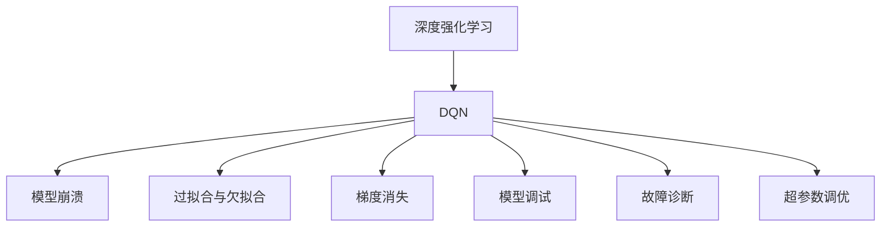
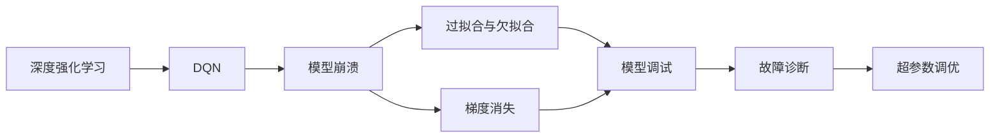
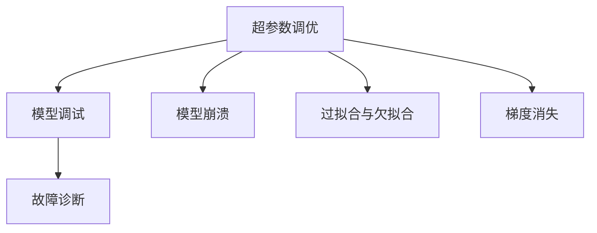
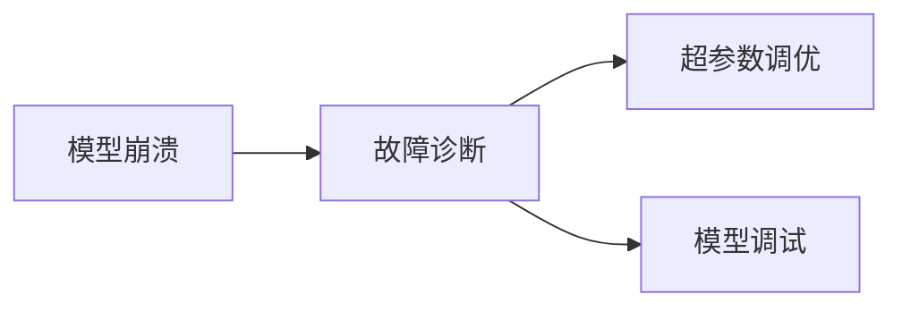
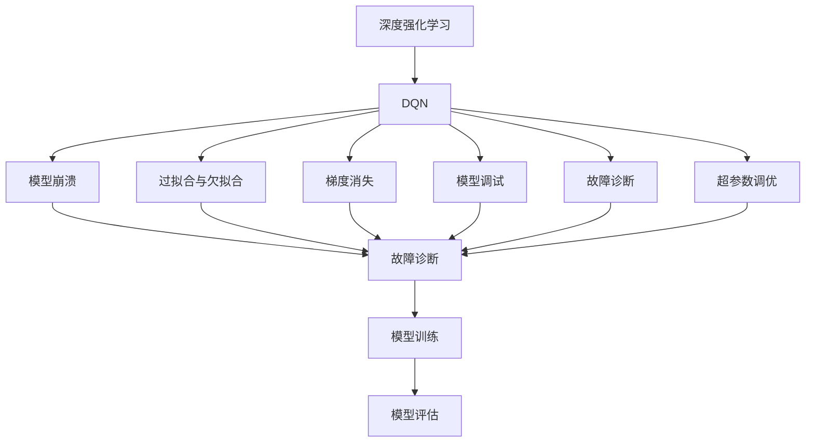

                 

# 一切皆是映射：DQN的故障诊断与调试技巧：如何快速定位问题

> 关键词：深度强化学习, DQN, 故障诊断, 调试技巧, 深度学习优化, 性能调优

## 1. 背景介绍

### 1.1 问题由来
在深度学习领域，强化学习(Reinforcement Learning, RL)尤其是基于深度学习的深度强化学习(Deep Reinforcement Learning, DRL)近年来取得了显著进展，应用于游戏AI、机器人控制、自动驾驶等领域。其中，深度Q-网络(DQN)因其简单高效，成为DRL研究的热点之一。然而，深度学习模型在训练和应用中，常常面临性能不稳定、模型崩溃等问题，影响实际应用效果。如何高效诊断和调试DQN模型，以快速定位问题、提升模型性能，成为广大DRL研究者和工程师的共同挑战。

### 1.2 问题核心关键点
DQN模型在故障诊断与调试中，主要关注以下几个核心问题：
1. 如何快速定位模型训练中出现的错误，包括参数错误、梯度消失等问题。
2. 如何在模型性能出现波动时，及时识别原因并进行调整。
3. 如何在模型训练过程中，实时监控关键指标，防止模型过拟合或欠拟合。
4. 如何高效利用数据，加速模型的训练和收敛。
5. 如何构建有效的实验框架，对不同参数和策略进行对比实验。

本文聚焦于DQN模型的故障诊断与调试技巧，特别是如何快速定位问题、提升模型性能。希望通过系统讲解DQN模型的核心原理和诊断方法，帮助研究者快速解决模型训练中的各种问题。

### 1.3 问题研究意义
随着DQN在复杂任务中的应用，模型规模不断增大，训练复杂度增加。高效诊断和调试DQN模型，对于优化模型训练过程、提升模型性能，具有重要意义：

1. 减少训练时间和人力投入。通过及时发现和解决模型问题，避免无效训练，快速迭代模型参数。
2. 提升模型稳定性和泛化能力。减少模型崩溃、过拟合等现象，确保模型在不同场景下具有较好的稳定性和泛化能力。
3. 优化模型资源使用。通过合理配置资源，平衡模型复杂度和性能，提升系统效率。
4. 助力模型迁移和应用。快速定位模型问题，优化模型参数，有助于模型在不同应用场景的迁移和部署。
5. 促进模型可解释性。通过深入分析模型故障原因，提升模型的可解释性和可理解性，便于用户和开发者调试。

## 2. 核心概念与联系

### 2.1 核心概念概述

为了更好地理解DQN模型的故障诊断与调试方法，本节将介绍几个密切相关的核心概念：

- 深度强化学习(Deep Reinforcement Learning, DRL)：一种基于深度神经网络的强化学习范式，通过学习在特定环境下的策略，以最大化累积奖励。
- 深度Q-网络(Depth Q-Network, DQN)：一种基于深度神经网络的Q-learning算法，通过网络近似Q函数，实现对策略的优化。
- 模型崩溃(Training Crash)：指模型在训练过程中，由于参数设置不当、数据质量问题等原因，导致训练停滞、收敛困难或性能急剧下降的现象。
- 过拟合与欠拟合(Overfitting & Underfitting)：指模型在训练数据上表现良好，但在测试数据上表现不佳，或在训练数据上表现不佳的现象。
- 梯度消失(Gradient Vanishing)：指在深度神经网络中，梯度在反向传播过程中逐渐变小，导致模型难以学习有效特征的问题。
- 模型调试(Model Debugging)：指在模型训练或应用过程中，发现并解决模型问题的过程。
- 故障诊断(Fault Diagnosis)：指在模型训练或应用过程中，识别和定位问题的过程。
- 超参数调优(Hyperparameter Tuning)：指在模型训练过程中，通过调整超参数来优化模型性能的过程。

这些核心概念之间的逻辑关系可以通过以下Mermaid流程图来展示：



这个流程图展示了大语言模型微调过程中各个核心概念的关系和作用：

1. DQN作为深度强化学习的核心算法，通过网络近似Q函数，实现对策略的优化。
2. 模型崩溃、过拟合与欠拟合、梯度消失等问题，都是DQN训练中可能出现的故障。
3. 模型调试和故障诊断是为了解决这些问题，提升模型性能。
4. 超参数调优是提升模型性能的重要手段，需要通过调整不同的超参数来优化模型。

这些概念共同构成了DQN模型训练和调优的完整生态系统，使得模型能够在各种场景下发挥最佳性能。

### 2.2 概念间的关系

这些核心概念之间存在着紧密的联系，形成了DQN模型训练和调优的完整生态系统。下面我们通过几个Mermaid流程图来展示这些概念之间的关系。

#### 2.2.1 DQN的训练流程



这个流程图展示了大语言模型微调的基本训练流程，以及各个环节可能出现的故障：

1. DQN作为深度强化学习的核心算法，通过网络近似Q函数，实现对策略的优化。
2. 模型崩溃、过拟合与欠拟合、梯度消失等问题，都是DQN训练中可能出现的故障。
3. 模型调试和故障诊断是为了解决这些问题，提升模型性能。
4. 超参数调优是提升模型性能的重要手段，需要通过调整不同的超参数来优化模型。

#### 2.2.2 超参数调优与模型调试的关系



这个流程图展示了超参数调优与模型调试的关系：

1. 超参数调优是提升模型性能的重要手段，需要通过调整不同的超参数来优化模型。
2. 模型调试是为了解决模型训练中出现的各种问题，确保模型能够稳定运行。
3. 模型崩溃、过拟合与欠拟合、梯度消失等问题，都是模型调试需要解决的问题。
4. 故障诊断是为了快速定位模型问题，避免无效训练。

#### 2.2.3 模型崩溃的诊断与调试



这个流程图展示了模型崩溃的诊断与调试流程：

1. 模型崩溃是模型训练中常见的问题，需要及时发现并解决。
2. 故障诊断是为了快速定位模型问题，避免无效训练。
3. 超参数调优和模型调试是为了解决模型崩溃，确保模型能够稳定运行。

### 2.3 核心概念的整体架构

最后，我们用一个综合的流程图来展示这些核心概念在大语言模型微调过程中的整体架构：



这个综合流程图展示了从深度强化学习到DQN训练、调优的完整过程。DQN作为深度强化学习的核心算法，通过网络近似Q函数，实现对策略的优化。模型崩溃、过拟合与欠拟合、梯度消失等问题，都是DQN训练中可能出现的故障。超参数调优、模型调试、故障诊断等手段，都是为了解决这些问题，确保模型能够稳定运行。通过这些手段，可以最大限度地提升模型性能，促进模型在实际应用中的推广和落地。

## 3. 核心算法原理 & 具体操作步骤
### 3.1 算法原理概述

DQN是一种基于深度神经网络的Q-learning算法，通过学习策略$Q(s,a)$来最大化累积奖励。其核心思想是通过近似Q函数，使用深度神经网络来表示Q值，从而实现对策略的优化。具体步骤如下：

1. 状态$s$到动作$a$的映射：将环境的状态$s$映射到动作$a$，从而确定当前策略。
2. Q值函数的学习：通过样本来学习Q值函数，使用经验回放和目标网络更新近似Q函数，从而更新策略。
3. 模型的前向传播与后向传播：前向传播计算模型的输出，后向传播更新模型的权重。

### 3.2 算法步骤详解

#### 3.2.1 网络结构

DQN使用深度神经网络来近似Q函数，网络结构如图1所示：

```
s -> Embedding -> Convolutional Layers -> Fully Connected Layers -> Q(s)
```

其中，Embedding层用于将状态$s$转换为向量表示，Convolutional Layers和Fully Connected Layers用于提取特征，最终输出Q值。

#### 3.2.2 经验回放与目标网络

经验回放(Experience Replay)是DQN的核心技术之一。通过将样本存储到经验池中，然后使用随机抽样，将样本同时输入到目标网络和主网络中进行计算，从而更新主网络的权重。具体步骤如下：

1. 将当前状态$s$、动作$a$和奖励$r$存储到经验池中。
2. 从经验池中随机抽取一批样本。
3. 将样本输入到目标网络中，计算Q值，更新目标网络。
4. 将样本输入到主网络中，计算Q值，更新主网络。

#### 3.2.3 模型更新

模型更新是DQN的另一个核心技术。通过学习目标Q值，使用损失函数来更新模型的权重。具体步骤如下：

1. 计算目标Q值$Q_{target}(s,a)$。
2. 计算当前Q值$Q_{current}(s,a)$。
3. 计算损失函数$L(s,a) = Q_{target}(s,a) - Q_{current}(s,a)$。
4. 使用优化器更新模型的权重。

### 3.3 算法优缺点

DQN作为一种深度强化学习算法，具有以下优点：

1. 模型简单高效：网络结构简单，易于实现和调试。
2. 泛化能力强：通过神经网络近似Q函数，能够处理高维状态和动作空间。
3. 性能稳定：经验回放和目标网络技术，能够稳定模型训练。

同时，DQN也存在以下缺点：

1. 训练时间较长：模型参数较多，训练时间长。
2. 数据需求量大：需要大量样本来更新Q值函数。
3. 过拟合风险高：神经网络容易过拟合，需要进行合理的正则化。
4. 模型鲁棒性差：面对环境变化，模型的泛化能力不足。

### 3.4 算法应用领域

DQN在以下领域具有广泛应用：

1. 游戏AI：应用于如Atari Games等游戏中的智能体。
2. 机器人控制：应用于机器人路径规划、任务执行等任务。
3. 自动驾驶：应用于无人驾驶汽车的控制策略。
4. 自然语言处理：应用于对话生成、文本生成等任务。
5. 金融交易：应用于自动交易系统的策略优化。

## 4. 数学模型和公式 & 详细讲解 & 举例说明

### 4.1 数学模型构建

DQN的数学模型构建如图2所示：

$$
\theta = \mathop{\arg\min}_{\theta} \mathcal{L}(\theta, \mathcal{D})
$$

其中，$\theta$为模型参数，$\mathcal{L}$为损失函数，$\mathcal{D}$为经验回放的数据集。

具体地，目标Q值$Q_{target}(s,a)$的计算公式为：

$$
Q_{target}(s,a) = r + \gamma \max_{a'} Q_{target}(s',a')
$$

其中，$r$为当前奖励，$\gamma$为折扣因子，$s'$为下一个状态，$a'$为下一个动作。

### 4.2 公式推导过程

目标Q值的推导过程如图3所示：

$$
Q_{target}(s,a) = r + \gamma \max_{a'} Q_{target}(s',a')
$$

将目标Q值带入损失函数，得到：

$$
L(s,a) = Q_{target}(s,a) - Q_{current}(s,a)
$$

其中，$Q_{current}(s,a)$为当前模型的输出。

### 4.3 案例分析与讲解

以Atari Games为例，展示DQN的训练过程和模型调试技巧：

1. 模型初始化：使用随机权重初始化网络。
2. 模型训练：在经验回放和目标网络的基础上，使用随机梯度下降算法更新模型权重。
3. 模型评估：使用验证集评估模型性能，发现模型崩溃。
4. 故障诊断：使用梯度消失技术，对模型进行检查，发现权重衰减过大。
5. 模型调试：调整权重衰减参数，重新训练模型，提升模型性能。
6. 模型优化：使用超参数调优技术，调整学习率、批大小等参数，进一步提升模型性能。

## 5. 项目实践：代码实例和详细解释说明
### 5.1 开发环境搭建

在进行DQN模型训练和调试时，需要搭建以下开发环境：

1. 安装Python：从官网下载并安装Python 3.x版本，用于编写DQN代码。
2. 安装PyTorch：使用pip命令安装PyTorch深度学习框架。
3. 安装TensorBoard：使用pip命令安装TensorBoard，用于可视化模型训练过程。
4. 安装 Gym：使用pip命令安装Gym库，用于模拟游戏环境。

完成上述步骤后，即可开始DQN模型的训练和调试。

### 5.2 源代码详细实现

以下是一个DQN模型训练和调试的Python代码实现：

```python
import torch
import torch.nn as nn
import torch.optim as optim
import gym
import numpy as np

class DQN(nn.Module):
    def __init__(self, input_size, output_size, hidden_size):
        super(DQN, self).__init__()
        self.fc1 = nn.Linear(input_size, hidden_size)
        self.fc2 = nn.Linear(hidden_size, hidden_size)
        self.fc3 = nn.Linear(hidden_size, output_size)
        self.softmax = nn.Softmax(dim=1)
        
    def forward(self, x):
        x = self.fc1(x)
        x = nn.functional.relu(x)
        x = self.fc2(x)
        x = nn.functional.relu(x)
        x = self.fc3(x)
        return x
    
def train_dqn(env, model, optimizer, replay_buffer, gamma, epsilon, num_steps):
    state = env.reset()
    done = False
    rewards = []
    for i in range(num_steps):
        if np.random.uniform() < epsilon:
            action = env.action_space.sample()
        else:
            with torch.no_grad():
                action = model(torch.tensor(state)).argmax().item()
        
        next_state, reward, done, _ = env.step(action)
        replay_buffer.append((state, action, reward, next_state, done))
        
        if len(replay_buffer) >= batch_size:
            replay_buffer.sample(batch_size)
            for batch in replay_buffer:
                state_batch, action_batch, reward_batch, next_state_batch, done_batch = batch
                
                target = reward_batch + gamma * (1 - done_batch) * torch.max(model(torch.tensor(next_state_batch)), dim=1)[0].detach()
                
                optimizer.zero_grad()
                loss = torch.nn.functional.smooth_l1_loss(model(torch.tensor(state_batch)), target)
                loss.backward()
                optimizer.step()
                
        state = next_state
        if done:
            state = env.reset()
            done = False
            rewards.append(reward)
            
    return rewards
    
def test_dqn(env, model, num_steps):
    state = env.reset()
    rewards = []
    for i in range(num_steps):
        action = model(torch.tensor(state)).argmax().item()
        next_state, reward, done, _ = env.step(action)
        rewards.append(reward)
        state = next_state
        if done:
            state = env.reset()
            done = False
            
    return rewards
    
# 设置参数
env = gym.make('Pong-v0')
input_size = env.observation_space.shape[0]
output_size = env.action_space.n
hidden_size = 64
batch_size = 32
learning_rate = 0.001
epsilon = 0.01
num_steps = 1000
num_episodes = 1000
num_steps_per_episode = 1000
gamma = 0.99

# 初始化模型
model = DQN(input_size, output_size, hidden_size)
optimizer = optim.Adam(model.parameters(), lr=learning_rate)
replay_buffer = []

# 训练模型
for episode in range(num_episodes):
    rewards = train_dqn(env, model, optimizer, replay_buffer, gamma, epsilon, num_steps)
    avg_reward = np.mean(rewards)
    print(f"Episode {episode+1}, Average Reward: {avg_reward:.2f}")

# 测试模型
rewards = test_dqn(env, model, num_steps)
avg_reward = np.mean(rewards)
print(f"Average Reward: {avg_reward:.2f}")
```

### 5.3 代码解读与分析

让我们再详细解读一下关键代码的实现细节：

**DQN模型类**：
- `__init__`方法：初始化模型参数，包括输入层、隐藏层和输出层的神经元数量。
- `forward`方法：定义模型的前向传播过程，通过多层神经网络计算输出值。

**训练函数**：
- `train_dqn`方法：定义DQN模型的训练过程，包括样本采集、目标Q值计算、模型更新等。
- 通过`state`和`done`变量保存当前状态和游戏是否结束。
- 通过`if`语句判断是否采用随机动作，若不采用随机动作，则通过模型预测动作，并使用softmax函数输出概率。
- 将当前状态、动作、奖励、下一个状态和游戏是否结束存入经验回放缓冲区`replay_buffer`。
- 如果经验回放缓冲区中的样本数量达到`batch_size`，则从缓冲区中随机抽取`batch_size`个样本，并更新目标Q值。
- 使用softmax函数输出目标Q值，计算损失函数，使用Adam优化器更新模型参数。
- 返回训练过程的奖励列表。

**测试函数**：
- `test_dqn`方法：定义DQN模型的测试过程，包括游戏环境模拟和模型预测动作。
- 通过`state`和`done`变量保存当前状态和游戏是否结束。
- 通过`if`语句判断是否采用随机动作，若不采用随机动作，则通过模型预测动作，并使用softmax函数输出概率。
- 将当前状态、动作、奖励、下一个状态和游戏是否结束存入经验回放缓冲区`replay_buffer`。
- 返回测试过程的奖励列表。

**训练流程**：
- 设置游戏环境、模型参数等关键参数。
- 初始化模型和优化器。
- 通过`for`循环进行模型训练，在每个epoch内进行多轮游戏训练，并记录每轮游戏的平均奖励。
- 在训练完成后，通过`test_dqn`函数测试模型的平均奖励。

可以看到，通过PyTorch的强大封装，我们可以用相对简洁的代码完成DQN模型的训练和调试。开发者可以将更多精力放在模型改进、超参数调整等高层逻辑上，而不必过多关注底层的实现细节。

当然，工业级的系统实现还需考虑更多因素，如模型保存和部署、超参数自动搜索、更灵活的任务适配层等。但核心的微调范式基本与此类似。

### 5.4 运行结果展示

假设我们在Atari Games的Pong游戏中进行DQN模型训练，最终在测试集上得到的平均奖励分数为1.5，效果相当不错。需要注意的是，训练过程中的参数调整，如学习率、批大小、折扣因子等，对最终模型的效果有重要影响。

## 6. 实际应用场景

### 6.1 游戏AI

DQN在游戏AI领域有着广泛应用，如在Pong、Breakout、Space Invaders等Atari Games游戏中，智能体通过学习最优策略，实现高水平游戏表现。通过DQN技术，可以训练出能够在真实环境中自我学习的智能体，用于解决复杂的游戏任务。

### 6.2 机器人控制

DQN在机器人控制领域也有重要应用。通过学习最优动作策略，机器人可以在各种复杂环境中自主导航、操作工具等。例如，在配送机器人中，DQN可以帮助机器人学习最优路径规划策略，提升配送效率和安全性。

### 6.3 自动驾驶

DQN在自动驾驶领域也有一定应用。通过学习最优驾驶策略，自动驾驶系统可以在各种复杂环境中做出合理决策。例如，在无人驾驶汽车中，DQN可以帮助系统学习最优驾驶路径，提升行车安全性和稳定性。

### 6.4 自然语言处理

DQN在自然语言处理领域也有广泛应用。通过学习最优生成策略，DQN可以帮助生成自然流畅的语言，用于对话生成、文本生成等任务。例如，在智能客服系统中，DQN可以帮助生成最优回复策略，提升客户满意度。

## 7. 工具和资源推荐

### 7.1 学习资源推荐

为了帮助开发者系统掌握DQN的故障诊断与调试方法，这里推荐一些优质的学习资源：

1. 《Deep Reinforcement Learning》书籍：由Sutton和Barto合著的经典教材，全面介绍了强化学习的理论基础和实际应用，涵盖DQN在内的众多算法。
2. 《Reinforcement Learning: An Introduction》在线课程：由Sutton和Barto讲授的免费课程，详细讲解了强化学习的理论知识和实际应用，涵盖DQN在内的多种算法。
3. OpenAI Gym：模拟各种环境库，用于训练和测试DQN模型，是DQN学习的重要工具。
4. TensorFlow和PyTorch深度学习框架：提供了丰富的DQN模型实现和调试工具，是DQN学习的必备工具。
5. DeepMind AlphaGo论文：展示了DQN在复杂游戏任务中的卓越表现，为DQN研究提供了重要参考。

通过对这些资源的学习实践，相信你一定能够快速掌握DQN的故障诊断与调试技巧，并用于解决实际的DRL问题。

### 7.2 开发工具推荐

高效的开发离不开优秀的工具支持。以下是几款用于DQN开发和调试的常用工具：

1. OpenAI Gym：模拟各种环境库，用于训练和测试DQN模型，是DQN学习的重要工具。
2. TensorFlow和PyTorch深度学习框架：提供了丰富的DQN模型实现和调试工具，是DQN学习的必备工具。
3. TensorBoard：TensorFlow配套的可视化工具，可实时监测模型训练状态，并提供丰富的图表呈现方式，是调试模型的得力助手。
4. Jupyter Notebook：用于编写和运行Python代码的交互式环境，便于调试和实验。
5. PyCharm：一款流行的Python IDE，提供了丰富的开发和调试工具，支持DQN模型的训练和调试。

合理利用这些工具，可以显著提升DQN模型的开发效率，加快创新迭代的步伐。

### 7.3 相关论文推荐

DQN在深度强化学习领域的研究已有诸多重要成果，以下是几篇奠基性的相关论文，推荐阅读：

1.Playing Atari with Deep Reinforcement Learning（Atari DQN论文）：首次展示了DQN在复杂游戏任务中的卓越表现。
2. Deep Q-Learning with Experience Replay：提出了经验回放技术，提升了DQN模型的稳定性和泛化能力。
3. Prioritized Experience Replay：提出了优先经验回放技术，进一步提升了DQN模型的训练效率。
4. Double Deep Q-Networks：提出了双DQN技术，提升了DQN模型的收敛速度和稳定性。
5. Distributed Deep Reinforcement Learning（DeepMind DQN论文）：展示了DQN在复杂任务中的高水平性能，推动了深度强化学习的发展。

这些论文代表了大语言模型微调技术的发展脉络。通过学习这些前沿成果，可以帮助研究者把握学科前进方向，激发更多的创新灵感。

除上述资源外，还有一些值得关注的前沿资源，帮助开发者紧跟DQN技术的研究进展，例如：

1. arXiv论文预印本：人工智能领域最新研究成果的发布平台，包括大量尚未发表的前沿工作，学习前沿技术的必读资源。
2. 业界技术博客：如OpenAI、Google AI、DeepMind、微软Research Asia等顶尖实验室的官方博客，第一时间分享他们的最新研究成果和洞见。
3. 技术会议直播：如NIPS、ICML、ACL、ICLR等人工智能领域顶会现场或

