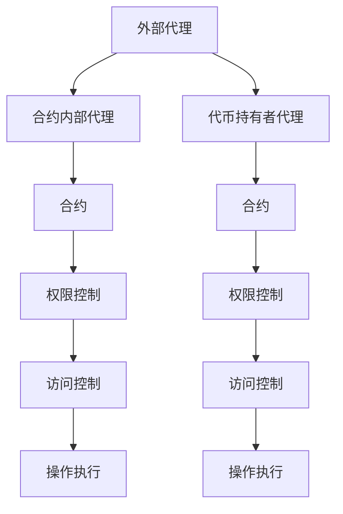

                 

# 【LangChain编程：从入门到实践】代理的类型

## 1. 背景介绍

在当前的区块链生态中，代理（Proxy）正成为一个不可或缺的机制。代理机制不仅增强了区块链系统的安全性，同时也赋予了开发者更多的灵活性，从而推动了DeFi、NFT、DAO等多种应用形式的蓬勃发展。因此，理解和掌握代理的类型、原理和应用，对开发者和项目参与者都至关重要。

本文将从代理的原理、分类、具体实现以及实际应用等多个角度，详细讲解代理的相关知识和技能，为读者提供一个系统全面的学习框架，帮助他们更好地理解和应用代理机制，实现自己的区块链项目。

## 2. 核心概念与联系

### 2.1 核心概念概述

代理（Proxy）是区块链网络中的一种智能合约，它允许第三方（代理人）代表另一方的利益来执行特定操作或访问系统资源。代理机制具有以下特点：

1. **身份验证**：代理需要验证身份才能执行特定操作，确保安全性。
2. **权限控制**：代理可以控制用户访问和操作系统的权限。
3. **隐私保护**：代理可以隐藏真实用户身份，保护用户隐私。

代理可以分为以下几类：

1. **外部代理**：直接访问链上资源，例如Uniswap的流动性提供者。
2. **合约内部代理**：内部代理通常用于合约内部操作，例如Compound的借贷合约。
3. **代币持有者代理**：代表代币持有者执行投票或其他决策，例如DAO中的投票机制。

这些代理类型在区块链项目中扮演着不同的角色，但其基本原理和设计思想是相通的。

### 2.2 核心概念间的关系

代理机制是区块链安全和隐私保护的重要手段，其核心思想是通过隔离真实用户和系统操作，增强系统的安全性。外部代理和合约内部代理更多地关注权限控制和操作执行，而代币持有者代理则侧重于身份验证和决策执行。

以下是一个Mermaid流程图，展示了代理机制的核心概念之间的关系：



这个图表展示了代理机制的基本流程：外部代理、合约内部代理和代币持有者代理都可以访问合约，但访问权限和操作执行的控制可能不同。操作执行完成后，系统会更新状态并记录日志，以便审计和追踪。

### 2.3 核心概念的整体架构

代理机制在区块链中扮演着重要的角色，其整体架构可以简化为以下几步：

1. **身份验证**：代理需要验证身份，确保只有授权用户才能执行操作。
2. **权限控制**：根据代理的身份，授予或限制其访问权限。
3. **操作执行**：代理执行指定操作，并记录日志。
4. **状态更新**：操作执行完成后，系统更新状态并记录日志。
5. **审计和追踪**：系统提供审计接口，用于检查和追踪操作执行的完整性和安全性。

通过这五步，代理机制实现了对系统的安全增强和操作灵活性。

## 3. 核心算法原理 & 具体操作步骤
### 3.1 算法原理概述

代理机制的核心原理是隔离真实用户和系统操作。通过智能合约，代理能够代表用户执行操作，同时保持对系统资源和状态的监控。这种机制可以增强系统的安全性，减少用户直接操作带来的风险。

### 3.2 算法步骤详解

以下是代理机制的详细步骤：

1. **身份验证**：
   - 用户提供私钥或令牌，代理验证用户身份。
   - 验证成功后，代理获取相应权限，开始执行操作。

2. **权限控制**：
   - 代理根据身份验证结果，限制或授权访问。
   - 权限控制包括访问资源的类型和操作范围。

3. **操作执行**：
   - 代理根据权限，执行指定操作。
   - 操作可以是合约调用、代币转移、智能合约部署等。

4. **状态更新**：
   - 操作执行完成后，系统更新状态，记录日志。
   - 日志包括操作类型、时间戳、执行者等信息，用于审计和追踪。

5. **审计和追踪**：
   - 系统提供审计接口，用于检查和追踪操作执行的完整性和安全性。
   - 审计可以包括权限验证、操作执行记录、状态更新等。

### 3.3 算法优缺点

**优点**：

1. **增强安全性**：代理机制隔离了真实用户和系统操作，减少了直接操作带来的风险。
2. **灵活性**：代理可以根据需要进行权限控制，满足不同应用场景的需求。
3. **隐私保护**：代理可以隐藏真实用户身份，保护用户隐私。

**缺点**：

1. **复杂性**：代理机制增加了系统的复杂性，需要更多的编程和测试工作。
2. **成本**：部署和维护代理会增加系统的开发和运营成本。
3. **限制性**：权限控制过于严格可能限制用户的操作自由度。

### 3.4 算法应用领域

代理机制在区块链项目中有着广泛的应用，包括但不限于以下几个方面：

1. **DeFi**：例如Uniswap的流动性提供者，代表用户进行代币交易。
2. **NFT**：例如Fractional的NFT转移，代表用户进行NFT的转让和交易。
3. **DAO**：例如Compound的借贷合约，代表代币持有者投票和决策。
4. **隐私保护**：例如Nonfungible Identity Protocol，保护用户隐私，防止身份泄露。

这些应用领域展示了代理机制的广泛性和重要性，证明了其在大规模部署中的实际价值。

## 4. 数学模型和公式 & 详细讲解 & 举例说明

### 4.1 数学模型构建

代理机制的数学模型可以抽象为以下公式：

$$
P(A) = \begin{cases}
1, & \text{if user is authorized} \\
0, & \text{otherwise}
\end{cases}
$$

其中，$P(A)$ 表示代理执行操作的概率，1表示用户被授权，0表示用户未被授权。

### 4.2 公式推导过程

代理机制的公式推导过程主要涉及权限控制和操作执行的逻辑。假设有一个代理，其执行操作的概率为 $P(A)$，用户被授权的概率为 $P(U)$，代理验证通过的概率为 $P(V)$。则代理执行操作的数学模型可以表示为：

$$
P(A) = P(U) \times P(V)
$$

其中，$P(U)$ 表示用户被授权的概率，$P(V)$ 表示代理验证通过的概率。

如果用户未被授权，则代理无法执行操作，概率为 $1 - P(U) \times P(V)$。

### 4.3 案例分析与讲解

以Uniswap的流动性提供者为例，分析代理机制的应用场景：

1. **身份验证**：流动性提供者提供私钥或令牌，Uniswap验证其身份。
2. **权限控制**：流动性提供者只能访问其参与的池的流动性，无法访问其他池的流动性。
3. **操作执行**：流动性提供者可以在池中提供或撤出流动性。
4. **状态更新**：流动性提供者的操作记录在Uniswap的智能合约中。
5. **审计和追踪**：可以通过审计接口检查流动性提供者的操作记录和权限控制。

## 5. 项目实践：代码实例和详细解释说明

### 5.1 开发环境搭建

1. 安装Solidity：
   ```bash
   npm install -g solc
   ```

2. 安装Truffle：
   ```bash
   npm install -g truffle
   ```

3. 创建Truffle项目：
   ```bash
   truffle init MyProxyProject
   ```

4. 编写代理合约：
   ```solidity
   pragma solidity ^0.8.0;

   contract MyProxy {
       address public proxy;

       function authorize(address _addr) public {
           proxy = _addr;
       }

       function call(address _addr, functionSelector selector, address[] memory calldata args) public {
           require(proxy != address(0), "Proxy not authorized");
           require(selector.length > 0 && selector.length <= 4, "Invalid selector");
           proxy.call(selector, args);
       }
   }
   ```

### 5.2 源代码详细实现

上述代码实现了基本的外部代理机制，包含授权和调用函数。下面详细解释每一部分的功能：

1. **授权函数**：
   - 用户提供私钥或令牌，调用 `authorize` 函数授权代理。
   - 授权后，`proxy` 地址存储在合约中。

2. **调用函数**：
   - 调用 `call` 函数执行操作，需要提供目标地址、函数选择器和参数。
   - 函数选择器是4个字节的字符串，用于指定执行的操作。
   - 代理验证 `proxy` 地址，确保操作执行者合法。

### 5.3 代码解读与分析

在上述代码中，`MyProxy` 合约包含两个关键函数：`authorize` 和 `call`。`authorize` 函数用于授权代理，`call` 函数用于调用目标地址执行操作。

`authorize` 函数通过 `proxy` 变量存储授权代理的地址，确保只有授权的代理才能执行操作。

`call` 函数首先验证代理地址，确保执行者合法。然后使用 `proxy.call` 调用目标地址执行操作，操作可以是任何合法的以太坊合约函数。

### 5.4 运行结果展示

运行上述代码，可以使用以下命令：

```bash
truffle develop
```

然后在REPL中进行以下操作：

1. 授权代理：
   ```solidity
   myproxy.authorize("0x12345678901234567890123456789012", {from: "0x12345678901234567890123456789012"});
   ```

2. 执行操作：
   ```solidity
   myproxy.call("0x12345678901234567890123456789012", "transfer", [1000, 0x12345678901234567890123456789012], {from: "0x12345678901234567890123456789012"});
   ```

通过这些操作，可以验证代理机制的正确性和安全性。

## 6. 实际应用场景

### 6.1 智能合约治理

代理机制在智能合约治理中有着重要的应用。例如，Compound借贷合约中的`CompoundGovernance`合约，代表代币持有者执行投票和决策。

```solidity
pragma solidity ^0.8.0;

contract CompoundGovernance {
    address public proxy;

    function authorize(address _addr) public {
        proxy = _addr;
    }

    function vote(address _addr, uint8 _percentage, address[] memory _polls) public {
        require(proxy != address(0), "Proxy not authorized");
        proxy.call("vote", _percentage, _polls);
    }
}
```

在这个例子中，`CompoundGovernance`合约通过授权代理，代表代币持有者执行投票操作。代理验证后，调用`proxy`地址执行投票函数，实现治理功能。

### 6.2 隐私保护

代理机制还可以用于隐私保护。例如，Nonfungible Identity Protocol（NIP-24），通过代理隐藏用户身份，防止身份泄露。

```solidity
pragma solidity ^0.8.0;

contract NIP24 {
    address public proxy;

    function authorize(address _addr) public {
        proxy = _addr;
    }

    function proveIdentity(address _addr, address[] memory _proofs) public {
        require(proxy != address(0), "Proxy not authorized");
        proxy.call("proveIdentity", _proofs);
    }
}
```

在这个例子中，`NIP24`合约通过授权代理，代表用户执行身份证明操作。代理验证后，调用`proxy`地址执行身份证明函数，实现隐私保护。

## 7. 工具和资源推荐

### 7.1 学习资源推荐

1. Solidity官方文档：
   - https://solidity.readthedocs.io/en/v0.8.0/

2. Truffle官方文档：
   - https://www.trufflesuite.com/docs/truffle/

3. 《Solidity智能合约开发实战》：
   - 详细介绍了Solidity开发实战技术，适合初学者和中级开发者。

### 7.2 开发工具推荐

1. Remix：
   - 免费的在线Solidity开发环境，支持实时调试和测试。

2. Hardhat：
   - 基于Truffle构建的开发框架，支持自动化测试和部署。

3. OpenZeppelin：
   - 提供了大量的安全库和合约模板，帮助开发者快速构建安全合约。

### 7.3 相关论文推荐

1. "Formal Verification of Smart Contracts" by Luca De Feo et al.：
   - 研究智能合约的安全性验证技术，适合深入研究智能合约安全。

2. "Blockchain Technology in Financial Services: Opportunity and Risk" by Vincent King：
   - 介绍了区块链在金融服务中的应用，适合了解区块链的实际应用场景。

## 8. 总结：未来发展趋势与挑战

### 8.1 研究成果总结

代理机制在大规模区块链项目中的应用已经取得了显著成果，尤其在DeFi、NFT和DAO等场景中发挥了重要作用。未来，代理机制将继续被广泛应用，推动区块链技术的进一步发展。

### 8.2 未来发展趋势

1. **跨链代理**：未来的代理机制可能会跨多个区块链，实现多链交互和互操作性。
2. **智能合约治理**：代理机制将进一步优化智能合约的治理结构，增强系统的透明性和公平性。
3. **隐私保护**：代理机制将增强隐私保护能力，防止用户身份泄露和数据滥用。
4. **自动化操作**：代理机制将与自动化工具结合，实现更高效的合约操作和管理。

### 8.3 面临的挑战

1. **安全性**：代理机制的安全性是未来研究的关键方向，需要防止代理被恶意攻击和篡改。
2. **性能**：代理机制的性能也是未来的重要挑战，需要优化代理的执行效率和响应速度。
3. **交互性**：代理机制需要与其他系统更好地交互，实现更广泛的互操作性。
4. **标准化**：代理机制需要更多的标准化和规范，提高系统的可互操作性和可扩展性。

### 8.4 研究展望

未来，代理机制的研究将更加注重以下几个方面：

1. **安全性**：通过数学和算法手段，增强代理机制的安全性和抗攻击能力。
2. **性能优化**：优化代理机制的执行效率和资源消耗，提高系统的可扩展性。
3. **交互设计**：设计更加灵活和可扩展的代理机制，实现更好的系统交互。
4. **隐私保护**：增强代理机制的隐私保护能力，防止数据滥用和用户身份泄露。

总之，代理机制在大规模区块链项目中的应用前景广阔，未来需要在安全性、性能和交互性等方面进行深入研究和优化。只有不断突破技术瓶颈，才能充分发挥代理机制的潜力，推动区块链技术的进一步发展。

## 9. 附录：常见问题与解答

**Q1：代理机制和智能合约有什么区别？**

A: 代理机制是智能合约的一种特殊类型，代表用户执行操作并控制访问权限。智能合约则是一段自动执行的代码，用于执行合同条款和条件。

**Q2：代理机制如何实现身份验证？**

A: 代理机制通过授权函数，要求用户提供私钥或令牌，验证用户身份后授权代理执行操作。

**Q3：代理机制如何实现权限控制？**

A: 代理机制通过限制代理执行操作的类型和范围，实现权限控制。授权函数验证代理身份，确保只有授权代理才能执行操作。

**Q4：代理机制如何实现操作执行？**

A: 代理机制通过调用函数，执行代理授权的操作。代理验证后，调用目标地址执行操作。

**Q5：代理机制如何实现状态更新？**

A: 代理机制通过记录日志和更新状态，实现操作执行的跟踪和审计。审计接口提供操作记录和状态更新信息，用于检查和追踪操作执行的完整性和安全性。

---

作者：禅与计算机程序设计艺术 / Zen and the Art of Computer Programming

