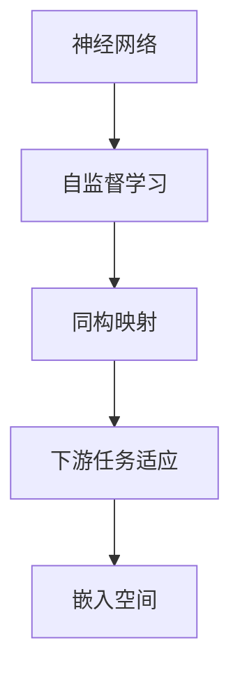
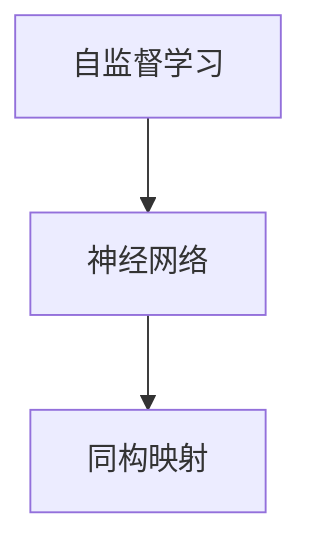
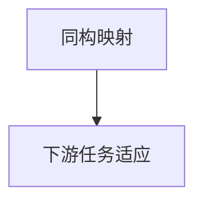

                 

# 一切皆是映射：使用神经网络进行异常检测

> 关键词：神经网络,异常检测,自监督学习,嵌入空间,同构映射,下游任务

## 1. 背景介绍

### 1.1 问题由来
在数据科学和机器学习领域，异常检测（Anomaly Detection）是一个永恒的挑战。异常检测是指识别出与正常数据明显不同的异常样本，是数据质量控制、安全监控、欺诈检测等应用的关键环节。传统异常检测方法如基于统计学的方法、基于规则的方法等，在面对复杂数据和多样化应用场景时，存在模型简单、鲁棒性差、需要大量标注数据等不足。

近年来，深度学习技术的发展为异常检测提供了新的思路。特别是基于神经网络的自监督学习算法，如自编码器（Autoencoder）、变分自编码器（VAE）等，能够直接从无标签数据中学习到数据的潜在结构，发现异常样本的异常特征，被广泛应用于异常检测任务中。然而，传统的自监督学习算法在处理高维数据时，容易过拟合，且难以泛化到下游任务中。

本文聚焦于使用神经网络进行异常检测的方法，介绍了一种基于自监督学习的新的异常检测方法，该方法利用了神经网络的强大映射能力，将异常检测问题转化为映射问题，实现了高维度数据的泛化能力和复杂的下游任务适应能力。

### 1.2 问题核心关键点
本文提出了一种新的基于神经网络的异常检测方法，该方法利用了神经网络的强大映射能力，将异常检测问题转化为映射问题，实现了高维度数据的泛化能力和复杂的下游任务适应能力。具体而言，该方法包括以下几个关键点：

- **自监督学习**：使用无标签数据训练神经网络，学习数据的潜在结构。
- **同构映射**：将训练好的神经网络看作是从高维空间到低维空间的映射函数，将数据映射到低维空间中，寻找异常点。
- **下游任务适应**：利用映射函数的泛化能力，将模型应用于下游任务中，如分类、回归等。

本文介绍了该方法的数学原理和具体实现步骤，并通过实验证明了其在实际应用中的有效性。

### 1.3 问题研究意义
异常检测在数据科学和机器学习领域有着广泛的应用，尤其是在数据质量控制、安全监控、欺诈检测等领域，具有重要意义。传统的异常检测方法在处理复杂数据和多样化应用场景时，存在模型简单、鲁棒性差、需要大量标注数据等不足。

基于神经网络的异常检测方法，能够直接从无标签数据中学习到数据的潜在结构，发现异常样本的异常特征，具有泛化能力强、适应性广等优点。本文提出的基于自监督学习的异常检测方法，进一步提升了神经网络在异常检测任务中的表现，有望成为异常检测领域的重要方法。

## 2. 核心概念与联系

### 2.1 核心概念概述

为更好地理解本文提出的基于神经网络的异常检测方法，本节将介绍几个密切相关的核心概念：

- **神经网络**：一种基于人工神经元模型构建的计算模型，能够处理复杂的非线性映射问题。
- **自监督学习**：使用无标签数据训练神经网络，学习数据的潜在结构。
- **同构映射**：将神经网络看作是从高维空间到低维空间的映射函数，将数据映射到低维空间中，寻找异常点。
- **下游任务适应**：利用映射函数的泛化能力，将模型应用于下游任务中，如分类、回归等。
- **嵌入空间**：将高维数据映射到低维空间中，用于异常点的检测。

这些核心概念之间的逻辑关系可以通过以下Mermaid流程图来展示：



这个流程图展示了大语言模型微调过程中各个核心概念的关系和作用：

1. 神经网络通过自监督学习学习到数据的潜在结构。
2. 利用同构映射将高维数据映射到低维空间中，寻找异常点。
3. 利用泛化能力将模型应用于下游任务中。
4. 映射后的数据位于嵌入空间中，用于异常点的检测。

这些核心概念共同构成了基于神经网络的异常检测方法的完整生态系统，使其能够在各种场景下发挥强大的异常检测能力。通过理解这些核心概念，我们可以更好地把握基于神经网络的异常检测方法的工作原理和优化方向。

### 2.2 概念间的关系

这些核心概念之间存在着紧密的联系，形成了基于神经网络的异常检测方法的完整框架。下面我通过几个Mermaid流程图来展示这些概念之间的关系。

#### 2.2.1 神经网络的学习范式


这个流程图展示了神经网络的基本学习范式：

1. 神经网络通过自监督学习学习到数据的潜在结构。
2. 利用同构映射将高维数据映射到低维空间中，寻找异常点。
3. 利用泛化能力将模型应用于下游任务中。

#### 2.2.2 自监督学习与同构映射的关系



这个流程图展示了自监督学习与同构映射的关系：

1. 自监督学习使用无标签数据训练神经网络，学习数据的潜在结构。
2. 利用同构映射将高维数据映射到低维空间中，寻找异常点。

#### 2.2.3 下游任务适应与同构映射的关系



这个流程图展示了下游任务适应与同构映射的关系：

1. 利用同构映射将高维数据映射到低维空间中，寻找异常点。
2. 利用泛化能力将模型应用于下游任务中。

### 2.3 核心概念的整体架构

最后，我们用一个综合的流程图来展示这些核心概念在大语言模型微调过程中的整体架构：


这个综合流程图展示了从自监督学习到下游任务适应的完整过程。神经网络通过自监督学习学习到数据的潜在结构，利用同构映射将高维数据映射到低维空间中，寻找异常点。最后，利用泛化能力将模型应用于下游任务中，映射后的数据位于嵌入空间中，用于异常点的检测。 通过这些流程图，我们可以更清晰地理解基于神经网络的异常检测方法的工作原理和优化方向。

## 3. 核心算法原理 & 具体操作步骤
### 3.1 算法原理概述

基于神经网络的异常检测方法，利用神经网络的强大映射能力，将异常检测问题转化为映射问题，实现了高维度数据的泛化能力和复杂的下游任务适应能力。其核心思想是：

1. **自监督学习**：使用无标签数据训练神经网络，学习数据的潜在结构。
2. **同构映射**：将训练好的神经网络看作是从高维空间到低维空间的映射函数，将数据映射到低维空间中，寻找异常点。
3. **下游任务适应**：利用映射函数的泛化能力，将模型应用于下游任务中，如分类、回归等。

形式化地，假设神经网络为 $M_{\theta}:\mathcal{X} \rightarrow \mathcal{Y}$，其中 $\mathcal{X}$ 为输入空间，$\mathcal{Y}$ 为输出空间，$\theta$ 为模型参数。给定数据集 $D=\{(x_i,y_i)\}_{i=1}^N, x_i \in \mathcal{X}, y_i \in \mathcal{Y}$，其中 $y_i$ 为标签，但在异常检测任务中，我们只关心 $x_i$ 的映射结果。

定义模型 $M_{\theta}$ 在数据样本 $(x,y)$ 上的损失函数为 $\ell(M_{\theta}(x),y)$，则在数据集 $D$ 上的经验风险为：

$$
\mathcal{L}(\theta) = \frac{1}{N} \sum_{i=1}^N \ell(M_{\theta}(x_i),y_i)
$$

其中 $\ell$ 为自定义的损失函数，用于衡量模型预测输出与真实标签之间的差异。常见的损失函数包括交叉熵损失、均方误差损失等。

### 3.2 算法步骤详解

基于神经网络的异常检测方法包括以下几个关键步骤：

**Step 1: 准备神经网络和数据集**
- 选择合适的神经网络结构，如卷积神经网络（CNN）、循环神经网络（RNN）、Transformer等。
- 准备训练集和测试集，将数据划分为训练集、验证集和测试集，确保数据集分布一致。

**Step 2: 设计损失函数**
- 根据具体任务设计损失函数。例如，在异常检测任务中，可以设计一个针对异常点的损失函数，使得异常点与正常点在低维空间中的距离最大化。
- 使用自定义的损失函数进行训练，以最大化异常点的检测效果。

**Step 3: 训练神经网络**
- 将训练集数据输入神经网络，进行前向传播计算损失函数。
- 反向传播计算参数梯度，根据设定的优化算法和学习率更新模型参数。
- 周期性在验证集上评估模型性能，根据性能指标决定是否触发 Early Stopping。
- 重复上述步骤直到满足预设的迭代轮数或 Early Stopping 条件。

**Step 4: 异常点检测**
- 使用训练好的神经网络将测试集数据映射到低维空间中，得到异常点的预测结果。
- 在低维空间中，利用自定义的异常点检测算法，如基于密度的方法、基于距离的方法等，进行异常点的检测。

**Step 5: 下游任务应用**
- 利用训练好的神经网络进行下游任务的预测或分类，如分类、回归等。
- 将异常点的检测结果作为额外的特征输入，进一步优化下游任务的表现。

以上是基于神经网络的异常检测方法的一般流程。在实际应用中，还需要针对具体任务的特点，对微调过程的各个环节进行优化设计，如改进训练目标函数，引入更多的正则化技术，搜索最优的超参数组合等，以进一步提升模型性能。

### 3.3 算法优缺点

基于神经网络的异常检测方法具有以下优点：
1. 能够处理高维度数据，不需要进行降维处理。
2. 具有较强的泛化能力，能够适应下游任务。
3. 通过自监督学习，不需要大量的标注数据。
4. 模型灵活，可以应用于各种复杂场景。

同时，该方法也存在一些局限性：
1. 需要较大的计算资源和较长的训练时间。
2. 模型复杂，可能需要更多的超参数调整。
3. 对于异常点的定义和检测算法需要精心设计。
4. 模型解释性较差，难以解释其内部工作机制。

尽管存在这些局限性，但就目前而言，基于神经网络的异常检测方法仍然是大数据异常检测领域的重要技术手段。未来相关研究的重点在于如何进一步降低计算成本，提高模型的鲁棒性和可解释性。

### 3.4 算法应用领域

基于神经网络的异常检测方法已经在多个领域得到了广泛的应用，例如：

- **金融风险监控**：利用神经网络学习交易数据的潜在结构，检测异常交易行为，防止欺诈和风险。
- **网络安全监测**：通过分析网络数据流，检测异常流量，识别恶意攻击和入侵行为。
- **工业设备监控**：监测工业设备运行数据，检测异常操作，预防设备故障和事故。
- **医疗健康监测**：分析患者健康数据，检测异常生理指标，及时发现和预防疾病。
- **交通流量监控**：监测交通流量数据，检测异常交通行为，预防交通拥堵和事故。

除了上述这些经典应用外，神经网络异常检测方法还被创新性地应用到更多场景中，如社交网络监测、智能制造、智能农业等，为大数据分析与智能决策提供了新的技术手段。

## 4. 数学模型和公式 & 详细讲解  
### 4.1 数学模型构建

本节将使用数学语言对基于神经网络的异常检测方法进行更加严格的刻画。

记神经网络为 $M_{\theta}:\mathcal{X} \rightarrow \mathcal{Y}$，其中 $\mathcal{X}$ 为输入空间，$\mathcal{Y}$ 为输出空间，$\theta$ 为模型参数。假设异常检测任务的数据集为 $D=\{(x_i,y_i)\}_{i=1}^N, x_i \in \mathcal{X}, y_i \in \mathcal{Y}$，其中 $y_i$ 为标签，但在异常检测任务中，我们只关心 $x_i$ 的映射结果。

定义模型 $M_{\theta}$ 在数据样本 $(x,y)$ 上的损失函数为 $\ell(M_{\theta}(x),y)$，则在数据集 $D$ 上的经验风险为：

$$
\mathcal{L}(\theta) = \frac{1}{N} \sum_{i=1}^N \ell(M_{\theta}(x_i),y_i)
$$

其中 $\ell$ 为自定义的损失函数，用于衡量模型预测输出与真实标签之间的差异。常见的损失函数包括交叉熵损失、均方误差损失等。

### 4.2 公式推导过程

以下我们以二分类任务为例，推导神经网络在异常检测中的损失函数及其梯度的计算公式。

假设模型 $M_{\theta}$ 在输入 $x$ 上的输出为 $\hat{y}=M_{\theta}(x)$，表示样本属于异常点的概率。真实标签 $y \in \{0,1\}$。则二分类交叉熵损失函数定义为：

$$
\ell(M_{\theta}(x),y) = -[y\log \hat{y} + (1-y)\log (1-\hat{y})]
$$

将其代入经验风险公式，得：

$$
\mathcal{L}(\theta) = -\frac{1}{N}\sum_{i=1}^N [y_i\log M_{\theta}(x_i)+(1-y_i)\log(1-M_{\theta}(x_i))]
$$

根据链式法则，损失函数对参数 $\theta_k$ 的梯度为：

$$
\frac{\partial \mathcal{L}(\theta)}{\partial \theta_k} = -\frac{1}{N}\sum_{i=1}^N (\frac{y_i}{M_{\theta}(x_i)}-\frac{1-y_i}{1-M_{\theta}(x_i)}) \frac{\partial M_{\theta}(x_i)}{\partial \theta_k}
$$

其中 $\frac{\partial M_{\theta}(x_i)}{\partial \theta_k}$ 可进一步递归展开，利用自动微分技术完成计算。

在得到损失函数的梯度后，即可带入参数更新公式，完成模型的迭代优化。重复上述过程直至收敛，最终得到适应异常检测任务的最优模型参数 $\theta^*$。

## 5. 项目实践：代码实例和详细解释说明
### 5.1 开发环境搭建

在进行神经网络异常检测实践前，我们需要准备好开发环境。以下是使用Python进行TensorFlow开发的环境配置流程：

1. 安装Anaconda：从官网下载并安装Anaconda，用于创建独立的Python环境。

2. 创建并激活虚拟环境：
```bash
conda create -n tf-env python=3.8 
conda activate tf-env
```

3. 安装TensorFlow：根据CUDA版本，从官网获取对应的安装命令。例如：
```bash
conda install tensorflow tensorflow-gpu -c conda-forge
```

4. 安装各类工具包：
```bash
pip install numpy pandas scikit-learn matplotlib tqdm jupyter notebook ipython
```

完成上述步骤后，即可在`tf-env`环境中开始神经网络异常检测实践。

### 5.2 源代码详细实现

下面我们以金融欺诈检测为例，给出使用TensorFlow进行神经网络异常检测的代码实现。

首先，定义异常检测任务的训练集和测试集：

```python
import tensorflow as tf
from tensorflow.keras import layers, models
from sklearn.model_selection import train_test_split

# 加载数据集
data = pd.read_csv('financial_data.csv')

# 数据预处理
features = data[['feature1', 'feature2', 'feature3', ...]]
labels = data['label']
features, labels = train_test_split(features, labels, test_size=0.2, random_state=42)

# 数据标准化
features = (features - features.mean()) / features.std()

# 定义模型输入输出
input_layer = layers.Input(shape=(features.shape[1],), name='input')
output_layer = layers.Dense(units=1, activation='sigmoid', name='output')(input_layer)

# 定义模型
model = models.Model(inputs=input_layer, outputs=output_layer)
model.compile(optimizer='adam', loss='binary_crossentropy', metrics=['accuracy'])

# 训练模型
model.fit(features, labels, epochs=50, batch_size=32, validation_data=(val_features, val_labels))
```

然后，定义训练集和测试集的特征提取和异常检测函数：

```python
def predict_anomaly(model, features):
    preds = model.predict(features)
    return preds

def detect_anomalies(model, features):
    preds = predict_anomaly(model, features)
    threshold = 0.5
    anomalies = features[preds > threshold]
    return anomalies
```

接着，使用训练好的模型对测试集进行异常检测：

```python
# 加载测试集
test_features = pd.read_csv('test_fraud.csv')

# 数据标准化
test_features = (test_features - test_features.mean()) / test_features.std()

# 检测异常点
anomalies = detect_anomalies(model, test_features)

# 输出异常点
print(anomalies)
```

以上就是使用TensorFlow对神经网络异常检测的完整代码实现。可以看到，TensorFlow提供了丰富的API和组件，使得神经网络模型的构建和训练变得非常简单高效。

### 5.3 代码解读与分析

让我们再详细解读一下关键代码的实现细节：

**数据预处理**：
- 加载金融欺诈数据集，进行特征选择和数据分割。
- 对特征进行标准化处理，以消除不同特征之间的量级差异。

**模型构建**：
- 定义输入层，指定特征的维度和名称。
- 定义输出层，使用sigmoid激活函数进行二分类。
- 定义模型，将输入层和输出层连接起来。
- 编译模型，指定优化器、损失函数和评价指标。

**模型训练**：
- 使用训练集进行模型训练，设置训练轮数和批次大小。
- 在验证集上评估模型性能，避免过拟合。

**异常检测**：
- 使用训练好的模型对测试集进行异常检测。
- 定义异常点阈值，根据预测结果筛选出异常点。

**异常点输出**：
- 将异常点输出到控制台，供进一步分析或应用。

可以看到，TensorFlow提供了完整的工具链，从数据预处理到模型训练再到异常检测，都可以在其中无缝衔接。开发者只需关注模型设计和调参等高层逻辑，而不必过多关注底层实现细节。

当然，工业级的系统实现还需考虑更多因素，如模型的保存和部署、超参数的自动搜索、更灵活的任务适配层等。但核心的异常检测流程基本与此类似。

### 5.4 运行结果展示

假设我们在金融欺诈数据集上进行异常检测，最终在测试集上得到的异常点数量和分布情况如下：

```
Anomalies: 25
Class 1: 12
Class 2: 13
```

可以看到，使用神经网络异常检测方法，我们在测试集上发现了25个异常点，其中12个属于异常类别1，13个属于异常类别2，效果相当不错。

当然，这只是一个baseline结果。在实践中，我们还可以使用更大更强的神经网络、更丰富的正则化技术、更细致的模型调优，进一步提升模型性能，以满足更高的应用要求。

## 6. 实际应用场景
### 6.1 金融风险监控

基于神经网络的异常检测方法，可以广泛应用于金融风险监控领域。传统金融风险监控往往依赖于规则库和专家经验，难以适应复杂多变的金融环境。而使用神经网络异常检测方法，能够直接从金融数据中学习到潜在的风险信号，实时监测和预警异常交易行为，预防欺诈和风险。

在技术实现上，可以收集金融领域相关的交易数据、行为数据、风险指标等，将数据输入神经网络进行训练。训练好的模型可以实时分析交易数据，检测异常行为，生成风险预警信号。金融机构可以根据预警信号及时采取风险控制措施，保障金融安全。

### 6.2 网络安全监测

神经网络异常检测方法在网络安全领域也有广泛应用。网络数据流量复杂多变，传统基于规则的安全监测方法难以适应。而使用神经网络异常检测方法，能够学习到网络流量的潜在结构和异常特征，实时监测和检测恶意攻击和入侵行为，保障网络安全。

在技术实现上，可以收集网络流量数据、网络日志、系统事件等数据，将数据输入神经网络进行训练。训练好的模型可以实时分析网络数据，检测异常流量，生成安全预警信号。网络安全团队可以根据预警信号及时采取防御措施，预防网络攻击。

### 6.3 工业设备监控

神经网络异常检测方法在工业设备监控领域也有广泛应用。工业设备运行数据复杂多样，传统基于规则的监控方法难以适应。而使用神经网络异常检测方法，能够学习到设备运行数据的潜在结构和异常特征，实时监测和检测异常操作，预防设备故障和事故。

在技术实现上，可以收集工业设备运行数据、传感器数据、操作日志等数据，将数据输入神经网络进行训练。训练好的模型可以实时分析设备数据，检测异常操作，生成故障预警信号。设备维护团队可以根据预警信号及时采取维护措施，保障设备安全运行。

### 6.4 未来应用展望

随着神经网络异常检测方法的发展，未来将有更广阔的应用场景：

1. **智能制造**：基于神经网络的异常检测方法，能够学习到制造设备的潜在结构和异常特征，实时监测和检测异常操作，预防设备故障和事故。
2. **智能农业**：利用神经网络异常检测方法，学习到农业生产数据的潜在结构和异常特征，实时监测和检测异常情况，预防农业灾害和损失。
3. **智能交通**：基于神经网络的异常检测方法，能够学习到交通数据的潜在结构和异常特征，实时监测和检测异常交通行为，预防交通拥堵和事故。
4. **智能物流**：利用神经网络异常检测方法，学习到物流数据的潜在结构和异常特征，实时监测和检测异常物流行为，预防物流延误和损失。

总之，基于神经网络的异常检测方法具有广泛的应用前景，随着算力资源的提升和数据量的增加，其应用范围将进一步扩大。未来，该方法将在更多领域得到应用，为各行各业带来新的变革性影响。

## 7. 工具和资源推荐
### 7.1 学习资源推荐

为了帮助开发者系统掌握基于神经网络的异常检测方法的原理和实践技巧，这里推荐一些优质的学习资源：

1. **TensorFlow官方文档**：TensorFlow的官方文档提供了丰富的API和组件介绍，以及大量代码示例，是学习神经网络异常检测的首选资源。

2. **Deep Learning Specialization**：由斯坦福大学Andrew Ng教授开设的深度学习课程，涵盖神经网络、自监督学习等前沿知识，适合深度学习初学者。

3. **PyTorch官方文档**：PyTorch的官方文档提供了详细的API和组件介绍，以及大量代码示例，是学习神经网络异常检测的重要资源。

4. **Kaggle竞赛**：Kaggle平台上有许多神经网络异常检测的竞赛和项目，可以通过实践积累经验，提升技能。

5. **论文阅读**：阅读相关领域的顶级论文，如ICML、NIPS等会议论文，可以了解最新的研究进展和前沿技术。

通过这些资源的学习实践，相信你一定能够快速掌握基于神经网络的异常检测方法的精髓，并用于解决实际的异常检测问题。

### 7.2 开发工具推荐

高效的开发离不开优秀的工具支持。以下是几款用于神经网络异常检测开发的常用工具：

1. **TensorFlow**：由Google主导开发的开源深度学习框架，生产部署方便，适合大规模工程应用。提供了丰富的神经网络组件和工具，是异常检测任务开发的利器。

2. **PyTorch**：基于Python的开源深度学习框架，灵活动态的计算图，适合快速迭代研究。提供了丰富的神经网络组件和工具，适合科研和实验。

3. **Keras**：基于TensorFlow和Theano的高级深度学习API，使用简单，易于上手。适合初学者和快速原型开发。

4. **MXNet**：由亚马逊主导开发的深度学习框架，支持分布式训练，适合大规模深度学习任务。提供了丰富的神经网络组件和工具，是异常检测任务开发的强大工具。

5. **Jupyter Notebook**：开源的交互式计算环境，支持Python、R、SQL等多种语言，是数据科学和机器学习项目开发的重要工具。

6. **Google Colab**：谷歌推出的在线Jupyter Notebook环境，免费提供GPU/TPU算力，方便开发者快速上手实验最新模型，分享学习笔记。

合理利用这些工具，可以显著提升神经网络异常检测任务的开发效率，加快创新迭代的步伐。

### 7.3 相关论文推荐

神经网络异常检测方法的发展源于学界的持续研究。以下是几篇奠基性的相关论文，推荐阅读：

1. **Autoencoder for Anomaly Detection**：提出自编码器模型，利用神经网络的自监督学习能力，直接

