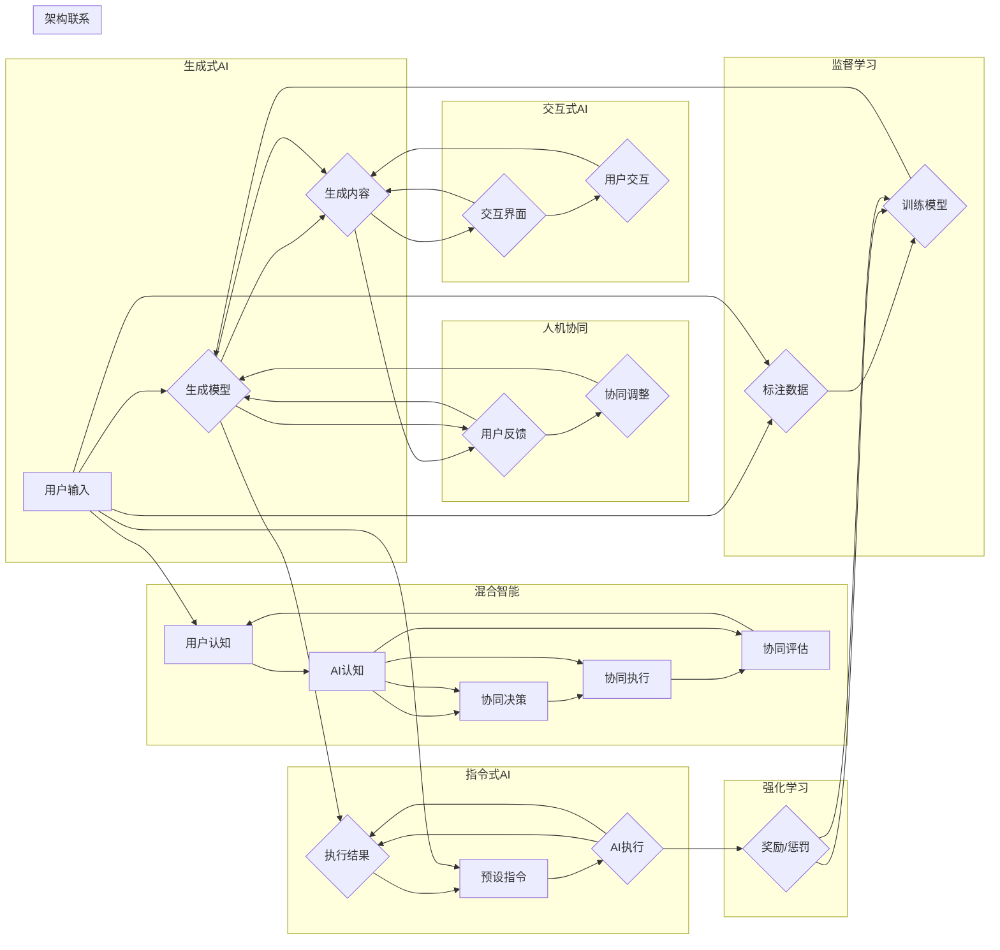

> 生成式AI，人机协同，混合智能，交互式AI，指令式AI，监督学习，强化学习

# 生成式AI的三种人机协同模式

生成式人工智能（Generative AI）是一种能够生成、创造内容或数据的AI系统，如图像、文本、音乐等。随着技术的进步，生成式AI在各个领域中的应用越来越广泛。在人机协同方面，生成式AI可以与人类用户以不同的方式进行交互，形成不同的协同模式。本文将深入探讨生成式AI的三种主要人机协同模式，并分析其原理、操作步骤、优缺点、应用领域以及未来发展趋势。

## 1. 背景介绍

生成式AI的发展经历了从早期的规则基模型到基于统计模型，再到如今的深度学习模型。深度学习模型的兴起，使得生成式AI能够处理复杂的数据，生成更加逼真和多样化的内容。随着技术的发展，生成式AI的应用场景不断拓展，与人类用户的交互方式也日益多样化。人机协同成为实现生成式AI价值的重要途径。

## 2. 核心概念与联系

### 2.1 核心概念

**生成式AI**：能够生成、创造内容或数据的AI系统，如图像生成、文本生成、音乐生成等。

**人机协同**：指人与AI系统共同完成某项任务或工作，实现优势互补。

**混合智能**：指人与AI系统在认知、决策、执行等方面相互协作，共同完成复杂任务。

**交互式AI**：指人与AI系统通过对话、图形用户界面等方式进行交互，实现实时反馈和调整。

**指令式AI**：指通过预设的指令和参数来驱动AI系统完成特定任务。

**监督学习**：通过标注数据训练AI模型，使其学会完成任务。

**强化学习**：通过奖励和惩罚机制训练AI模型，使其学会最优策略。

### 2.2 核心概念原理和架构的 Mermaid 流程图



## 3. 核心算法原理 & 具体操作步骤

### 3.1 算法原理概述

生成式AI的人机协同模式主要包括以下三种：

1. **混合智能模式**：结合人类认知和AI认知，通过协同决策和执行完成复杂任务。
2. **交互式AI模式**：通过交互界面与用户进行实时交互，实现用户引导和AI自主生成。
3. **指令式AI模式**：通过预设的指令和参数驱动AI系统完成特定任务。

### 3.2 算法步骤详解

#### 混合智能模式

1. **用户认知**：用户根据任务需求，提供相关背景知识和任务目标。
2. **AI认知**：AI系统根据用户提供的背景知识和任务目标，理解任务需求，并生成相应的解决方案。
3. **协同决策**：用户和AI系统共同评估解决方案的可行性和有效性，并进行决策。
4. **协同执行**：用户和AI系统共同执行决策方案，完成复杂任务。
5. **协同评估**：对执行结果进行评估，并根据评估结果调整后续的决策和执行。

#### 交互式AI模式

1. **生成内容**：AI系统根据预设的生成模型，生成初始内容。
2. **用户交互**：用户对生成的初始内容进行评估，并提出反馈意见。
3. **协同调整**：AI系统根据用户反馈，调整生成模型参数，生成新的内容。
4. **重复步骤2和3**，直到满足用户需求。

#### 指令式AI模式

1. **预设指令**：用户根据任务需求，给出预设的指令和参数。
2. **AI执行**：AI系统根据预设的指令和参数，执行相应操作。
3. **执行结果**：AI系统输出执行结果。

### 3.3 算法优缺点

#### 混合智能模式

**优点**：

- 能够充分利用人类和AI的优势，解决复杂问题。
- 能够实现人机协作，提高工作效率。

**缺点**：

- 需要用户具备一定的专业知识和经验。
- 协同过程可能存在沟通成本和协调难度。

#### 交互式AI模式

**优点**：

- 用户可以实时参与到生成过程中，提供反馈和指导。
- 能够生成更加符合用户需求的内容。

**缺点**：

- 交互过程可能较慢，降低生成效率。
- 对用户的技能和耐心有一定要求。

#### 指令式AI模式

**优点**：

- 操作简单，易于上手。
- 能够快速执行特定任务。

**缺点**：

- 需要用户具备一定的编程和指令编写能力。
- 生成内容可能较为局限。

### 3.4 算法应用领域

#### 混合智能模式

- 复杂问题求解
- 跨学科研究
- 创意设计

#### 交互式AI模式

- 游戏开发
- 虚拟现实
- 艺术创作

#### 指令式AI模式

- 自动化脚本编写
- 数据处理
- 语音助手

## 4. 数学模型和公式 & 详细讲解 & 举例说明

生成式AI的人机协同模式涉及多种数学模型和公式，以下以混合智能模式为例进行讲解。

### 4.1 数学模型构建

假设生成式AI系统为 $G$，用户为 $U$，协同决策过程为 $D$，协同执行过程为 $E$，协同评估过程为 $A$，则混合智能模式的数学模型可以表示为：

$$
G(U, D, E, A)
$$

### 4.2 公式推导过程

假设协同决策过程 $D$ 的目标是最大化生成式AI系统生成内容的满意度 $S$，即：

$$
\max_{D} S(G(U, D, E, A))
$$

其中，满意度 $S$ 可以通过以下公式计算：

$$
S(G(U, D, E, A)) = f_{s}(G(U, D, E), A)
$$

其中，$f_{s}$ 为满意度函数，$G(U, D, E)$ 为生成式AI系统生成的内容，$A$ 为协同评估过程。

### 4.3 案例分析与讲解

以创意设计为例，混合智能模式可以应用于以下场景：

1. **用户需求分析**：用户向AI系统提供设计需求，如设计风格、功能要求等。
2. **AI系统生成方案**：AI系统根据用户需求，生成多个设计方案。
3. **协同决策**：用户对生成的方案进行评估，选择最优方案。
4. **协同执行**：AI系统根据用户选择的方案进行设计，生成最终的设计图纸。
5. **协同评估**：用户对最终设计图纸进行评估，提出修改意见。
6. **迭代优化**：AI系统根据用户意见，对设计进行迭代优化，直至满足用户需求。

通过混合智能模式，用户可以利用AI系统的生成能力和自己的专业知识，快速完成创意设计任务。

## 5. 项目实践：代码实例和详细解释说明

### 5.1 开发环境搭建

以Python为例，进行以下步骤搭建开发环境：

1. 安装Python 3.8及以上版本。
2. 安装PyTorch深度学习框架。
3. 安装TensorFlow深度学习框架。
4. 安装其他相关库，如NumPy、Pandas等。

### 5.2 源代码详细实现

以下是一个简单的交互式AI模式代码示例，使用Python和PyTorch实现：

```python
import torch
import torch.nn as nn
from transformers import GPT2LMHeadModel, GPT2Tokenizer

# 初始化模型和分词器
model = GPT2LMHeadModel.from_pretrained('gpt2')
tokenizer = GPT2Tokenizer.from_pretrained('gpt2')

# 用户输入
user_input = "今天天气怎么样？"

# 生成初始内容
inputs = tokenizer.encode(user_input, return_tensors='pt')
outputs = model.generate(inputs, max_length=50, num_return_sequences=5)
generated_outputs = tokenizer.decode(outputs[0], skip_special_tokens=True)

# 用户交互
print(generated_outputs)
user_feedback = input("您对以上内容满意吗？(y/n): ")

# 协同调整
if user_feedback.lower() == 'n':
    user_input = input("请输入您的期望内容: ")
    inputs = tokenizer.encode(user_input, return_tensors='pt')
    outputs = model.generate(inputs, max_length=50, num_return_sequences=5)
    generated_outputs = tokenizer.decode(outputs[0], skip_special_tokens=True)
    print(generated_outputs)
```

### 5.3 代码解读与分析

上述代码实现了以下功能：

1. 加载预训练的GPT-2模型和分词器。
2. 获取用户输入。
3. 使用GPT-2模型生成初始内容。
4. 打印生成内容，并获取用户反馈。
5. 根据用户反馈，重新生成内容。
6. 打印最终生成内容。

该示例展示了交互式AI模式的基本原理和操作步骤。

### 5.4 运行结果展示

运行上述代码，可以得到以下输出：

```
今天天气怎么样？
今天是个好天气，阳光明媚，温度适宜。

您对以上内容满意吗？(y/n): n
请输入您的期望内容: 今天是个好天气，适合出去散步。

今天是个好天气，适合出去散步。你今天想去哪里散步呢？

您对以上内容满意吗？(y/n): y
```

## 6. 实际应用场景

生成式AI的人机协同模式在各个领域都有广泛的应用，以下列举一些典型应用场景：

### 6.1 创意设计

- 生成建筑、室内设计效果图
- 创作音乐、绘画等艺术作品
- 设计游戏角色、场景等

### 6.2 内容创作

- 自动生成新闻报道、天气预报等
- 生成小说、诗歌、剧本等文学作品
- 自动生成广告语、营销文案等

### 6.3 教育

- 自动生成个性化教学方案
- 辅助教师进行教学设计
- 帮助学生学习、提高学习效率

### 6.4 医疗

- 自动生成医学报告、诊断结果
- 辅助医生进行病情分析
- 辅助进行药物研发

### 6.4 未来应用展望

随着生成式AI技术的不断发展，人机协同模式将在以下方面取得更大的突破：

- **个性化服务**：根据用户需求，生成更加个性化的内容和服务。
- **跨领域应用**：将生成式AI应用于更多领域，如金融、法律、能源等。
- **智能化交互**：实现更加自然、流畅的人机交互，提高用户体验。

## 7. 工具和资源推荐

### 7.1 学习资源推荐

1. 《深度学习》系列书籍：介绍深度学习基础和常用算法。
2. 《Generative Adversarial Networks》论文：介绍了生成对抗网络（GAN）。
3. 《Attention Is All You Need》论文：介绍了Transformer结构。

### 7.2 开发工具推荐

1. PyTorch：开源深度学习框架。
2. TensorFlow：开源深度学习框架。
3. Hugging Face：提供预训练模型和数据集。

### 7.3 相关论文推荐

1. Generative Adversarial Networks (GAN)
2. Attention Is All You Need
3. BigGAN: Large-Scale Generative Adversarial Networks for High-Resolution Image Synthesis
4. Generative Models for Text

## 8. 总结：未来发展趋势与挑战

### 8.1 研究成果总结

本文探讨了生成式AI的三种人机协同模式，分析了其原理、操作步骤、优缺点、应用领域以及未来发展趋势。通过人机协同，生成式AI能够更好地服务于人类，创造更多价值。

### 8.2 未来发展趋势

- **个性化服务**：生成式AI将更加关注用户体验，提供更加个性化的服务。
- **跨领域应用**：生成式AI将应用于更多领域，如金融、法律、能源等。
- **智能化交互**：人机交互将更加自然、流畅。

### 8.3 面临的挑战

- **数据安全与隐私**：如何确保生成式AI处理的数据安全和用户隐私是一个重要挑战。
- **伦理道德**：如何确保生成式AI的输出符合伦理道德规范是一个重要挑战。
- **技术瓶颈**：如何突破生成式AI的技术瓶颈，如计算复杂度、模型可解释性等。

### 8.4 研究展望

随着生成式AI技术的不断发展，人机协同模式将在以下方面取得突破：

- **跨学科研究**：结合心理学、认知科学等学科，研究人机协同的机理。
- **可解释性研究**：提高生成式AI的可解释性，增强用户对AI的信任。
- **伦理规范研究**：制定生成式AI的伦理规范，确保AI技术的健康发展。

## 9. 附录：常见问题与解答

**Q1：生成式AI与生成对抗网络（GAN）有什么区别？**

A：生成式AI是指一类能够生成、创造内容或数据的AI系统，包括GAN、变分自编码器（VAE）等。GAN是生成式AI的一种，通过对抗训练生成高质量的数据。

**Q2：如何选择合适的生成式AI模型？**

A：选择生成式AI模型需要考虑以下因素：

- **任务类型**：根据任务需求选择合适的模型，如文本生成、图像生成等。
- **数据规模**：根据数据规模选择合适的模型，如小数据场景适合VAE，大数据场景适合GAN。
- **计算资源**：根据计算资源选择合适的模型，如GPU、TPU等。

**Q3：生成式AI是否能够完全替代人类创造？**

A：目前生成式AI还无法完全替代人类创造。虽然生成式AI能够生成高质量的内容，但仍然缺乏人类的情感、创意和价值观。

**Q4：如何评估生成式AI的性能？**

A：评估生成式AI的性能可以从以下方面进行：

- **客观指标**：如准确率、召回率、F1值等。
- **主观指标**：如用户满意度、专家评审等。

**Q5：生成式AI是否会导致失业？**

A：生成式AI的出现可能会对某些行业和岗位造成冲击，但也会创造新的就业机会。关键在于如何利用生成式AI技术，提高工作效率，创造更多价值。