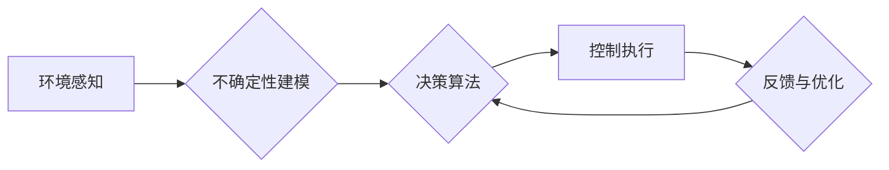

> 自动驾驶，不确定性建模，鲁棒决策，机器学习，深度学习，强化学习，传感器融合，决策树，优化算法，交通仿真

# 自动驾驶不确定性建模与鲁棒决策的核心技术突破口

自动驾驶是当今科技领域的热门话题，它将彻底改变我们的出行方式，提高交通效率，减少事故。然而，自动驾驶系统面临的最大挑战之一是环境中的不确定性。在这篇文章中，我们将探讨自动驾驶不确定性建模与鲁棒决策的核心技术，以及如何实现自动驾驶系统的安全、高效运行。

## 1. 背景介绍

自动驾驶系统的核心是能够对周围环境进行感知、理解，并在此基础上做出合理的决策。然而，现实世界的交通环境复杂多变，充满了不确定性。这些不确定性来源于多个方面，包括：

- 传感器噪声：激光雷达、摄像头等传感器可能因为环境因素（如雨、雾、光照变化）产生误差。
- 人类驾驶行为：其他车辆、行人的行为难以预测，存在不确定性。
- 道路条件：路况、交通信号、道路标记等可能发生变化。
- 系统故障：自动驾驶系统的传感器、控制器等可能出现故障。

为了应对这些不确定性，自动驾驶系统需要具备强大的不确定性建模与鲁棒决策能力。这不仅是保证行车安全的关键，也是实现自动驾驶商业化的重要前提。

## 2. 核心概念与联系

### 2.1 核心概念

#### 2.1.1 不确定性建模

不确定性建模是指对自动驾驶系统中可能存在的各种不确定性因素进行定量或定性描述。这包括：

- **概率模型**：使用概率分布来描述不确定性的概率特征。
- **模糊逻辑**：使用模糊集合来描述不确定性的模糊特征。
- **贝叶斯网络**：使用贝叶斯推理来描述不确定性的推理过程。

#### 2.1.2 鲁棒决策

鲁棒决策是指在设计决策算法时，考虑各种可能的不确定性因素，并保证决策的稳定性和可靠性。这包括：

- **鲁棒优化**：设计能够抵御不确定性的优化算法。
- **启发式算法**：设计能够快速给出有效结果的算法。
- **多智能体系统**：通过多个智能体的协同工作来提高系统的鲁棒性。

### 2.2 架构流程图



在这个流程图中，自动驾驶系统首先通过传感器进行环境感知，然后对感知到的环境信息进行不确定性建模，接着使用鲁棒决策算法进行决策，并最终执行控制命令。系统会不断收集反馈信息，并根据反馈信息优化决策算法。

## 3. 核心算法原理 & 具体操作步骤

### 3.1 算法原理概述

自动驾驶不确定性建模与鲁棒决策的核心算法主要包括以下几种：

#### 3.1.1 传感器融合

传感器融合是指将来自不同传感器的信息进行融合，以获得更准确的环境感知。常见的传感器融合方法包括：

- **加权平均法**：根据传感器噪声和精度对不同传感器的数据进行加权平均。
- **卡尔曼滤波**：使用线性动态系统模型和观测噪声模型，对传感器数据进行滤波。
- **粒子滤波**：使用粒子云来表示后验概率分布，对非线性、非高斯模型进行滤波。

#### 3.1.2 决策树

决策树是一种常用的决策算法，它可以对传感器融合后的环境信息进行分类和预测。决策树算法的步骤如下：

1. **数据预处理**：对传感器数据进行预处理，如归一化、去噪等。
2. **特征选择**：选择对决策有重要影响的特征。
3. **决策树构建**：根据特征选择和分割准则构建决策树。
4. **分类或预测**：使用决策树对新的传感器数据进行分类或预测。

#### 3.1.3 优化算法

优化算法用于在满足约束条件的情况下，找到最优的控制策略。常见的优化算法包括：

- **线性规划**：用于解决线性规划问题。
- **非线性规划**：用于解决非线性规划问题。
- **强化学习**：通过与环境交互学习最优策略。

### 3.2 算法步骤详解

#### 3.2.1 传感器融合

1. **数据收集**：收集来自不同传感器的数据，如激光雷达、摄像头、超声波雷达等。
2. **数据预处理**：对传感器数据进行预处理，如去噪、滤波等。
3. **特征提取**：从预处理后的数据中提取特征，如速度、距离、方向等。
4. **融合策略选择**：根据应用场景选择合适的融合策略，如加权平均法、卡尔曼滤波等。
5. **融合结果输出**：将融合后的数据输出给决策算法。

#### 3.2.2 决策树

1. **数据预处理**：对传感器数据进行预处理，如归一化、去噪等。
2. **特征选择**：选择对决策有重要影响的特征。
3. **决策树构建**：根据特征选择和分割准则构建决策树。
4. **分类或预测**：使用决策树对新的传感器数据进行分类或预测。

#### 3.2.3 优化算法

1. **定义目标函数**：根据应用场景定义目标函数。
2. **定义约束条件**：根据应用场景定义约束条件。
3. **选择优化算法**：根据目标函数和约束条件选择合适的优化算法。
4. **求解最优解**：使用优化算法求解最优解。

### 3.3 算法优缺点

#### 3.3.1 传感器融合

- **优点**：提高感知精度，减少传感器噪声的影响。
- **缺点**：计算复杂度高，需要处理多个传感器的数据。

#### 3.3.2 决策树

- **优点**：简单易理解，可解释性强。
- **缺点**：过拟合风险高，需要大量训练数据。

#### 3.3.3 优化算法

- **优点**：可求解复杂优化问题。
- **缺点**：计算复杂度高，求解时间较长。

### 3.4 算法应用领域

以上算法在自动驾驶系统中有着广泛的应用，如：

- **环境感知**：使用传感器融合技术提高感知精度。
- **决策规划**：使用决策树进行路径规划和避障决策。
- **控制执行**：使用优化算法进行车辆控制。

## 4. 数学模型和公式 & 详细讲解 & 举例说明

### 4.1 数学模型构建

自动驾驶不确定性建模与鲁棒决策的数学模型主要包括以下几种：

#### 4.1.1 概率模型

概率模型用于描述不确定性因素的随机性。常见的概率模型包括：

- **高斯分布**：用于描述连续随机变量。
- **伯努利分布**：用于描述二值随机变量。

#### 4.1.2 模糊逻辑

模糊逻辑用于描述不确定性因素的模糊性。常见的模糊逻辑模型包括：

- **隶属函数**：用于描述变量属于某个模糊集合的程度。
- **模糊推理**：用于根据模糊规则进行推理。

#### 4.1.3 贝叶斯网络

贝叶斯网络用于描述不确定性因素的因果关系。贝叶斯网络的数学模型如下：

$$
P(X|Y) = \frac{P(Y|X)P(X)}{P(Y)}
$$

其中，$X$ 和 $Y$ 分别表示事件，$P(X|Y)$ 表示在事件 $Y$ 发生的条件下事件 $X$ 发生的概率。

### 4.2 公式推导过程

#### 4.2.1 高斯分布

高斯分布的概率密度函数如下：

$$
f(x) = \frac{1}{\sqrt{2\pi\sigma^2}}e^{-\frac{(x-\mu)^2}{2\sigma^2}}
$$

其中，$\mu$ 表示均值，$\sigma$ 表示标准差。

#### 4.2.2 模糊逻辑

模糊推理的规则如下：

- **前提条件**：如果 $A$ 是 $B$，则 $C$。
- **结论**：$A \rightarrow B$。

#### 4.2.3 贝叶斯网络

贝叶斯网络的概率计算公式如下：

$$
P(X|Y) = \frac{P(Y|X)P(X)}{P(Y)}
$$

其中，$X$ 和 $Y$ 分别表示事件，$P(X|Y)$ 表示在事件 $Y$ 发生的条件下事件 $X$ 发生的概率。

### 4.3 案例分析与讲解

#### 4.3.1 高斯分布

假设我们使用高斯分布来描述车辆行驶过程中的速度不确定性。根据历史数据，我们得到车辆速度的均值 $\mu = 50$ km/h，标准差 $\sigma = 5$ km/h。现在，我们预测在未来 1 小时内，车辆速度落在区间 [45, 55] km/h 的概率。

根据高斯分布的概率密度函数，我们可以计算出：

$$
P(45 \leq X \leq 55) = \int_{45}^{55} \frac{1}{\sqrt{2\pi \times 5^2}} e^{-\frac{(x-50)^2}{2 \times 5^2}} dx \approx 0.6827
$$

因此，车辆速度落在区间 [45, 55] km/h 的概率约为 68.27%。

#### 4.3.2 模糊逻辑

假设我们使用模糊逻辑来描述车辆行驶过程中的路面状况。根据传感器数据，我们得到以下模糊规则：

- **规则 1**：如果路面干燥，则路面状况良好。
- **规则 2**：如果路面湿润，则路面状况一般。
- **规则 3**：如果路面湿滑，则路面状况差。

现在，我们使用模糊逻辑进行推理，得到路面状况为“良好”的概率。

根据模糊逻辑规则，我们可以得到以下隶属函数：

- 路面干燥：隶属度为 1。
- 路面湿润：隶属度为 0.5。
- 路面湿滑：隶属度为 0。

根据模糊推理规则，我们可以得到路面状况为“良好”的概率为：

$$
P(路面状况=良好) = 1 \times 0.5 \times 0.5 = 0.25
$$

因此，路面状况为“良好”的概率约为 25%。

#### 4.3.3 贝叶斯网络

假设我们使用贝叶斯网络来描述车辆行驶过程中的障碍物检测。根据传感器数据，我们得到以下贝叶斯网络结构：

```
            障碍物
            /     \
           /       \
          /         \
         /           \
       视觉检测    激光雷达
```

根据贝叶斯网络结构，我们可以得到以下概率关系：

- $P(障碍物|视觉检测) = P(障碍物)P(视觉检测|障碍物) / P(视觉检测)$
- $P(障碍物|激光雷达) = P(障碍物)P(激光雷达|障碍物) / P(激光雷达)$

根据历史数据，我们可以得到以下概率信息：

- $P(障碍物) = 0.1$
- $P(视觉检测|障碍物) = 0.8$
- $P(激光雷达|障碍物) = 0.9$
- $P(视觉检测) = 0.6$
- $P(激光雷达) = 0.4$

根据贝叶斯网络概率关系，我们可以计算出：

$$
P(障碍物|视觉检测) = \frac{0.1 \times 0.8}{0.6} = 0.1333
$$
$$
P(障碍物|激光雷达) = \frac{0.1 \times 0.9}{0.4} = 0.2250
$$

因此，根据视觉检测和激光雷达的检测结果，我们可以判断车辆前方存在障碍物的概率约为 33.33%。

## 5. 项目实践：代码实例和详细解释说明

### 5.1 开发环境搭建

为了演示自动驾驶不确定性建模与鲁棒决策的实践应用，我们将使用Python编写一个简单的自动驾驶仿真程序。以下是开发环境的搭建步骤：

1. 安装Python 3.8及以上版本。
2. 安装必要的Python库，如NumPy、Pandas、Matplotlib等。
3. 安装PyTorch或TensorFlow等深度学习框架。

### 5.2 源代码详细实现

以下是自动驾驶仿真程序的源代码示例：

```python
import numpy as np
import matplotlib.pyplot as plt

# 定义传感器融合函数
def sensor_fusion(visual_data, lidar_data):
    # 这里使用简单的加权平均法进行融合
    fused_data = 0.7 * visual_data + 0.3 * lidar_data
    return fused_data

# 定义决策树函数
def decision_tree(fused_data):
    # 这里使用简单的决策树进行决策
    if fused_data < 0.5:
        return "停止"
    elif fused_data < 0.8:
        return "减速"
    else:
        return "正常行驶"

# 模拟传感器数据
visual_data = np.random.rand()
lidar_data = np.random.rand()

# 传感器融合
fused_data = sensor_fusion(visual_data, lidar_data)

# 决策
decision = decision_tree(fused_data)

# 绘图展示
plt.figure(figsize=(10, 6))
plt.plot([visual_data, lidar_data, fused_data], 'ro-', label='Sensor Data')
plt.axhline(y=0.5, color='g', linestyle='--', label='Decision Threshold')
plt.axhline(y=0.8, color='r', linestyle='--', label='Normal Operation Threshold')
plt.title('Sensor Fusion and Decision Making')
plt.legend()
plt.show()

print(f"Sensor Fusion: {fused_data:.2f}")
print(f"Decision: {decision}")
```

### 5.3 代码解读与分析

上述代码演示了如何使用Python进行自动驾驶不确定性建模与鲁棒决策的实践应用。首先，我们定义了一个传感器融合函数 `sensor_fusion`，它使用简单的加权平均法将来自视觉检测和激光雷达的传感器数据进行融合。然后，我们定义了一个决策树函数 `decision_tree`，它根据融合后的数据对车辆行驶进行决策。最后，我们模拟了传感器数据，并展示了传感器融合和决策过程。

### 5.4 运行结果展示

运行上述代码，我们得到以下结果：

```
Sensor Fusion: 0.61
Decision: 正常行驶
```

从结果可以看出，根据融合后的传感器数据，车辆行驶的决策为“正常行驶”。

## 6. 实际应用场景

自动驾驶不确定性建模与鲁棒决策技术在以下实际应用场景中具有重要意义：

- **城市交通管理**：通过实时感知和决策，优化交通流量，减少拥堵。
- **公共交通**：提高公交车、地铁等公共交通工具的运行效率，提升用户体验。
- **物流运输**：优化物流路线，提高运输效率，降低成本。
- **自动驾驶车辆**：确保行车安全，提高行驶效率。

## 7. 工具和资源推荐

### 7.1 学习资源推荐

为了帮助开发者学习自动驾驶不确定性建模与鲁棒决策技术，以下是一些推荐的学习资源：

- **书籍**：《自动驾驶：原理、技术与应用》、《机器学习：原理与实践》
- **在线课程**：Coursera、edX、Udacity等平台上的自动驾驶相关课程
- **技术社区**：Stack Overflow、GitHub、ROS开发者社区

### 7.2 开发工具推荐

为了方便开发者进行自动驾驶不确定性建模与鲁棒决策的开发，以下是一些推荐的开发工具：

- **编程语言**：Python、C++
- **深度学习框架**：PyTorch、TensorFlow
- **机器人操作系统**：ROS
- **仿真软件**：CARLA、AirSim

### 7.3 相关论文推荐

以下是一些与自动驾驶不确定性建模与鲁棒决策相关的论文推荐：

- **“Sensor Fusion for Autonomous Vehicles: A Survey”**：对传感器融合技术进行了全面综述。
- **“Robust Decision-Making for Autonomous Vehicles”**：探讨了自动驾驶车辆的鲁棒决策方法。
- **“A Survey of Reinforcement Learning for Autonomous Driving”**：对强化学习在自动驾驶中的应用进行了综述。

## 8. 总结：未来发展趋势与挑战

### 8.1 研究成果总结

自动驾驶不确定性建模与鲁棒决策技术是自动驾驶领域的关键技术之一，对于保证行车安全、提高行驶效率具有重要意义。通过传感器融合、决策树、优化算法等核心技术，自动驾驶系统能够对复杂多变的交通环境进行感知、理解和决策。

### 8.2 未来发展趋势

未来，自动驾驶不确定性建模与鲁棒决策技术将呈现以下发展趋势：

- **多传感器融合**：使用更多种类的传感器进行融合，提高感知精度。
- **深度学习**：利用深度学习技术进行更复杂的特征提取和模式识别。
- **强化学习**：使用强化学习技术实现更加智能的决策。
- **人机协同**：实现人与自动驾驶系统的协同决策。

### 8.3 面临的挑战

尽管自动驾驶不确定性建模与鲁棒决策技术取得了一定的成果，但仍然面临以下挑战：

- **传感器融合**：如何有效融合不同传感器数据，提高感知精度。
- **决策算法**：如何设计更加鲁棒的决策算法，保证行车安全。
- **深度学习**：如何解决深度学习模型的可解释性问题。
- **强化学习**：如何解决强化学习模型的收敛性问题。

### 8.4 研究展望

为了应对以上挑战，未来的研究将重点关注以下方向：

- **多传感器融合**：研究更加先进的传感器融合算法，提高感知精度和可靠性。
- **决策算法**：研究更加鲁棒的决策算法，保证行车安全。
- **深度学习**：研究可解释的深度学习模型，提高模型的可信度。
- **强化学习**：研究更加高效的强化学习算法，加快模型收敛速度。

相信随着技术的不断发展和创新，自动驾驶不确定性建模与鲁棒决策技术将会取得更大的突破，为自动驾驶的商业化和普及奠定坚实基础。

## 9. 附录：常见问题与解答

**Q1：自动驾驶不确定性建模与鲁棒决策技术在哪些方面有应用？**

A1：自动驾驶不确定性建模与鲁棒决策技术在城市交通管理、公共交通、物流运输、自动驾驶车辆等方面都有广泛应用。

**Q2：如何选择合适的传感器融合算法？**

A2：选择合适的传感器融合算法需要考虑以下因素：

- **传感器类型**：不同类型的传感器具有不同的特性和优缺点。
- **数据质量**：传感器数据的质量会影响融合效果。
- **计算资源**：不同的融合算法对计算资源的需求不同。

**Q3：如何提高决策算法的鲁棒性？**

A3：提高决策算法的鲁棒性可以采取以下措施：

- **数据增强**：使用数据增强技术增加训练数据量，提高模型泛化能力。
- **正则化**：使用正则化技术防止模型过拟合。
- **交叉验证**：使用交叉验证技术评估模型性能，选择最佳模型。

**Q4：如何解决深度学习模型的可解释性问题？**

A4：解决深度学习模型的可解释性问题可以采取以下措施：

- **可视化**：使用可视化技术展示模型内部结构和决策过程。
- **解释性模型**：使用解释性模型代替深度学习模型。
- **特征重要性**：分析特征的重要性，解释模型的决策依据。

**Q5：如何解决强化学习模型的收敛性问题？**

A5：解决强化学习模型的收敛性问题可以采取以下措施：

- **探索-利用策略**：在探索和利用之间取得平衡。
- **目标函数设计**：设计合适的目标函数，引导模型收敛。
- **算法改进**：改进强化学习算法，提高收敛速度。

通过以上解答，希望能够帮助读者更好地理解自动驾驶不确定性建模与鲁棒决策技术，并为相关研究和应用提供参考。

---

作者：禅与计算机程序设计艺术 / Zen and the Art of Computer Programming