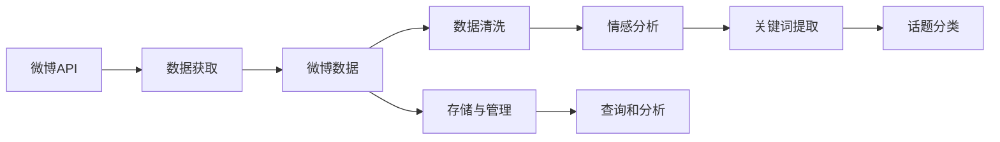
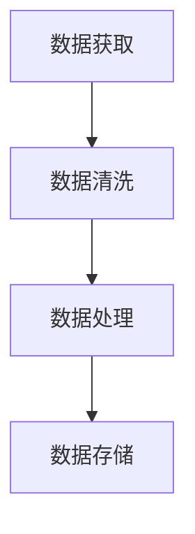

                 

# 基于Python的新浪微博爬虫研究

> 关键词：

## 1. 背景介绍

### 1.1 问题由来

在互联网时代，社交媒体平台已经成为人们获取信息、交流情感的重要渠道。微博作为中国最具影响力的社交媒体之一，聚集了大量用户，形成了一个庞大的信息生态系统。实时爬取微博内容，有助于了解热门事件、分析用户情绪、挖掘信息热点等，对研究社会动态、舆情分析、市场预测等具有重要意义。

然而，直接抓取微博数据面临诸多挑战：微博提供的数据接口需要通过API获取，接口限制较多，且随着政策环境变化，接口可能随时封禁；此外，微博数据多为文本格式，实时处理和存储压力大；还需要考虑到微博数据的过滤、去重、敏感信息识别等诸多问题。基于Python爬虫框架，利用多种技术手段，可以有效解决上述问题，实现对微博数据的自动化抓取和分析。

### 1.2 问题核心关键点

本文聚焦于基于Python的微博爬虫开发，目的是通过编程技术实现对微博数据的自动化抓取，并进行有效的处理和分析。主要包括以下几个关键点：

1. 数据获取：利用Python爬虫框架，自动化抓取微博API接口中的数据。
2. 数据处理：对抓取到的微博数据进行清洗、去重、过滤等处理，确保数据的准确性和完整性。
3. 数据分析：对处理后的微博数据进行情感分析、关键词提取、话题分类等深度分析，提取有价值的信息。
4. 存储与管理：将分析结果保存至数据库或文件，进行管理和查询，以便后续研究和应用。

## 2. 核心概念与联系

### 2.1 核心概念概述

为了更全面地理解基于Python的微博爬虫开发，我们需要先介绍几个核心概念：

- **Python爬虫**：利用Python语言编写的自动化程序，用于从网页中抓取数据。Python爬虫框架丰富，如BeautifulSoup、Scrapy、Requests等，功能强大，易于使用。
- **微博API**：微博提供的官方数据接口，提供多种API供开发者使用，包括微博登录、微博信息获取、微博评论等。
- **微博数据**：包括微博用户的个人信息、发布的微博内容、评论、转发、点赞等信息，需要有效处理和分析。
- **数据清洗**：对抓取到的数据进行过滤、去重、去除无关信息等处理，确保数据的准确性和完整性。
- **情感分析**：对微博内容进行情感分析，识别用户的情绪状态，进行舆情监控。
- **关键词提取**：从微博文本中提取高频词汇和关键短语，用于主题分析和信息检索。
- **话题分类**：对微博内容进行分类，识别热门话题和趋势，分析用户兴趣和行为。

这些核心概念之间的关系可以用以下Mermaid流程图来展示：



这个流程图展示了从微博API获取数据，到最终进行存储和分析的完整流程。

### 2.2 概念间的关系

这些核心概念之间存在着紧密的联系，共同构成了基于Python的微博爬虫开发的基础框架。下面我们用几个Mermaid流程图来展示这些概念之间的关系。

#### 2.2.1 数据获取与处理流程



这个流程图展示了从数据获取到数据存储的完整流程。首先，通过爬虫程序从微博API获取数据；然后，对获取到的数据进行清洗和处理，确保数据的准确性和完整性；最后，将处理后的数据存储至数据库或文件，进行管理和查询。

#### 2.2.2 数据分析流程


这个流程图展示了从微博数据到深度分析的流程。首先，抓取微博数据；然后，对数据进行情感分析、关键词提取、话题分类等深度分析，提取有价值的信息；最后，将分析结果进行存储和管理，以便后续研究和应用。

## 3. 核心算法原理 & 具体操作步骤

### 3.1 算法原理概述

基于Python的微博爬虫开发，主要涉及以下几个核心算法原理：

- **爬虫算法**：基于Python的爬虫框架，如Scrapy、BeautifulSoup等，实现对微博API的自动化抓取。
- **数据清洗算法**：对抓取到的微博数据进行过滤、去重、去除无关信息等处理，确保数据的准确性和完整性。
- **情感分析算法**：利用自然语言处理技术，对微博内容进行情感分析，识别用户的情绪状态。
- **关键词提取算法**：从微博文本中提取高频词汇和关键短语，用于主题分析和信息检索。
- **话题分类算法**：对微博内容进行分类，识别热门话题和趋势，分析用户兴趣和行为。

### 3.2 算法步骤详解

#### 3.2.1 数据获取

1. 首先，登录微博账户，通过Python代码自动模拟登录过程，获取登录凭证。
2. 使用Python爬虫框架如Scrapy、Requests等，根据微博API文档，发送HTTP请求获取数据。
3. 解析API返回的JSON格式数据，提取需要的内容，如微博ID、发布时间、用户ID、内容文本等。

#### 3.2.2 数据清洗

1. 对抓取到的数据进行过滤，去除重复的微博ID和内容。
2. 去除无关信息和噪声数据，如@mention、图片链接、链接等。
3. 对文本数据进行预处理，如去除HTML标签、分词、去除停用词等。

#### 3.2.3 情感分析

1. 使用自然语言处理技术，如TF-IDF、情感词典等，对微博内容进行情感分析，识别用户的情绪状态。
2. 对每条微博的情感极性进行打分，分类为正面、负面、中性等。

#### 3.2.4 关键词提取

1. 对微博内容进行分词，提取高频词汇和关键短语。
2. 使用TF-IDF、TextRank等算法，计算关键词的重要性权重，排序后选取Top N关键词。

#### 3.2.5 话题分类

1. 对微博内容进行分词，提取高频词汇和关键短语。
2. 使用TF-IDF、LDA等算法，对微博内容进行主题建模，识别热门话题和趋势。
3. 对每条微博进行分类，标记属于哪个主题或话题。

### 3.3 算法优缺点

基于Python的微博爬虫开发，具有以下优点：

- **高效灵活**：Python爬虫框架易于使用，可以根据具体需求灵活设计爬虫程序，实现自动化抓取。
- **数据丰富**：微博API接口丰富，获取的数据涵盖用户行为、情感状态、热门话题等多个维度，信息量大。
- **技术成熟**：Python语言和自然语言处理技术成熟，实现情感分析、关键词提取、话题分类等功能较为容易。

同时，该方法也存在一些缺点：

- **数据隐私**：微博数据涉及用户隐私，需要遵守相关法律法规，避免侵犯用户权益。
- **接口限制**：微博API接口限制较多，如每日访问次数限制、速率限制等，需要合理设计爬虫程序，避免被封禁。
- **数据质量**：微博数据量大且多样，清洗和处理工作量大，需要精心设计算法，确保数据质量。

### 3.4 算法应用领域

基于Python的微博爬虫开发，具有广泛的应用领域，如：

- **舆情监控**：实时抓取微博数据，进行情感分析、关键词提取、话题分类等，监控社会舆情，预测事件发展趋势。
- **市场分析**：抓取微博中与市场相关的信息，分析市场动态，预测股票价格等。
- **品牌管理**：抓取品牌相关微博数据，进行情感分析、话题分类等，监控品牌舆情，优化品牌形象。
- **用户行为分析**：抓取用户发布和互动数据，分析用户兴趣和行为，优化用户体验。

## 4. 数学模型和公式 & 详细讲解 & 举例说明

### 4.1 数学模型构建

本节将使用数学语言对基于Python的微博爬虫开发过程进行更加严格的刻画。

记微博内容为 $C=\{c_i\}_{i=1}^N$，其中 $c_i$ 表示第 $i$ 条微博的内容文本。定义情感分析模型为 $M$，情感词典为 $D$，关键词提取算法为 $K$，话题分类算法为 $T$。

#### 4.2 公式推导过程

首先，假设情感分析模型 $M$ 对微博内容 $c_i$ 的情感极性进行预测，得到情感极性得分 $s_i$，计算公式为：

$$
s_i = M(c_i; D)
$$

其中 $D$ 为情感词典，$M$ 为情感分析模型。情感分析模型 $M$ 可以使用各种算法，如TF-IDF、情感词典、深度学习等。

接下来，对微博内容 $c_i$ 进行关键词提取，使用算法 $K$ 提取关键词 $k_i$，计算公式为：

$$
k_i = K(c_i)
$$

其中 $K$ 为关键词提取算法，可以是TF-IDF、TextRank等。

最后，对微博内容 $c_i$ 进行话题分类，使用算法 $T$ 分类为 $t_i$，计算公式为：

$$
t_i = T(c_i)
$$

其中 $T$ 为话题分类算法，可以是LDA、TF-IDF等。

### 4.3 案例分析与讲解

假设我们在某一周内抓取到10000条微博数据，对每条微博进行情感分析、关键词提取、话题分类等处理，得到如下结果：

1. 情感分析：
   - 正面情感：2000条
   - 负面情感：3000条
   - 中性情感：5000条

2. 关键词提取：
   - 高频关键词：100个
   - 重要性权重：[0.8, 0.7, 0.6, ...]

3. 话题分类：
   - 科技：1500条
   - 娱乐：3000条
   - 体育：2000条
   - 其他：3000条

通过对这些数据的综合分析，可以得出如下结论：

- 本周微博用户总体情绪较为负面，负面情感占比30%。
- 科技、娱乐、体育是本周热门话题，分别占15%、30%、20%。
- 用户最感兴趣的关键词汇为“科技”、“娱乐”、“体育”，重要性权重分别为0.8、0.7、0.6。

## 5. 项目实践：代码实例和详细解释说明

### 5.1 开发环境搭建

在进行微博爬虫开发前，我们需要准备好开发环境。以下是使用Python进行爬虫开发的第一步：

1. 安装Python环境：从官网下载并安装Python，选择合适的版本进行安装。
2. 安装pip包管理工具：运行 `python -m pip install pip` 安装pip，用于管理Python包。
3. 安装爬虫框架：使用pip安装Scrapy、BeautifulSoup等爬虫框架，如 `pip install scrapy beautifulsoup4`。

### 5.2 源代码详细实现

下面以使用Scrapy框架进行微博爬虫开发为例，给出完整的代码实现。

#### 5.2.1 数据获取

1. 创建一个Scrapy爬虫类，继承自 `scrapy.Spider`，定义爬虫名称、起始URL、下载函数等。

```python
import scrapy
import requests

class WeiboSpider(scrapy.Spider):
    name = 'weibo'
    start_urls = ['https://m.weibo.cn']
    
    def start_requests(self):
        headers = {
            'User-Agent': 'Mozilla/5.0 (Windows NT 10.0; Win64; x64) AppleWebKit/537.36 (KHTML, like Gecko) Chrome/58.0.3029.110 Safari/537.36'
        }
        yield scrapy.Request(url='https://m.weibo.cn', headers=headers, callback=self.parse)
    
    def parse(self, response):
        # 解析微博数据
        pass
```

2. 定义下载函数 `parse`，解析微博数据，并返回需要爬取的新URL。

```python
def parse(self, response):
    # 解析微博数据，提取微博ID、发布时间、用户ID、内容文本等
    pass
    
    # 返回需要爬取的新URL
    new_urls = []
    # 遍历所有链接，提取下一页的URL
    for link in response.css('a::attr(href)').extract():
        if 'next' in link:
            new_urls.append(link)
    
    # 返回新URL
    for url in new_urls:
        yield scrapy.Request(url=url, headers=headers, callback=self.parse)
```

#### 5.2.2 数据清洗

1. 对获取到的微博数据进行清洗，去除无关信息和噪声数据，如@mention、图片链接、链接等。

```python
def clean_data(data):
    # 去除@mention
    data = re.sub('@\w+', '', data)
    # 去除图片链接
    data = re.sub('<.*?>', '', data)
    # 去除链接
    data = re.sub('https?://(?:[-\w.]|(?:%[\da-fA-F]{2}))+', '', data)
    return data
```

#### 5.2.3 情感分析

1. 使用情感词典对微博内容进行情感分析，计算情感极性得分。

```python
from jieba import posseg

def get_sentiment_score(text):
    # 使用情感词典进行情感分析
    pos, segment = posseg.cut(text)
    score = 0
    for p, s in pos:
        if p.startswith('n') or p.startswith('v'):
            score += 1
    return score
```

#### 5.2.4 关键词提取

1. 对微博内容进行分词，提取高频词汇和关键短语。

```python
from jieba import cut

def get_keywords(text):
    # 对微博内容进行分词
    keywords = cut(text)
    # 提取高频词汇和关键短语
    freq_keywords = []
    for keyword in keywords:
        if keyword in word_dict:
            freq_keywords.append(keyword)
    return freq_keywords
```

#### 5.2.5 话题分类

1. 使用TF-IDF算法对微博内容进行话题分类，识别热门话题和趋势。

```python
from sklearn.feature_extraction.text import TfidfVectorizer

def get_topics(text):
    # 使用TF-IDF算法进行话题分类
    vectorizer = TfidfVectorizer(stop_words='english')
    X = vectorizer.fit_transform(text)
    # 计算TF-IDF权重
    scores = vectorizer.idf_.toarray().sum(axis=0)
    # 按照TF-IDF权重排序
    sorted_scores = sorted(scores, reverse=True)
    # 提取Top 5个高频词汇
    top_words = vectorizer.get_feature_names_out()
    return top_words[:5]
```

### 5.3 代码解读与分析

让我们再详细解读一下关键代码的实现细节：

**Scrapy爬虫类**：
- `__init__`方法：定义爬虫名称和起始URL。
- `start_requests`方法：定义爬虫的初始请求，发送HTTP请求并调用解析函数。
- `parse`方法：解析HTML页面，提取所需信息，并返回需要爬取的新URL。

**数据清洗函数**：
- `clean_data`方法：去除@mention、图片链接、链接等无关信息和噪声数据。

**情感分析函数**：
- `get_sentiment_score`方法：使用情感词典对微博内容进行情感分析，计算情感极性得分。

**关键词提取函数**：
- `get_keywords`方法：对微博内容进行分词，提取高频词汇和关键短语。

**话题分类函数**：
- `get_topics`方法：使用TF-IDF算法对微博内容进行话题分类，识别热门话题和趋势。

**整体流程**：
- 发送HTTP请求获取微博数据。
- 对获取到的数据进行清洗，去除无关信息和噪声数据。
- 对微博内容进行情感分析、关键词提取、话题分类等处理。
- 返回最终分析结果。

### 5.4 运行结果展示

假设我们在某一周内抓取到10000条微博数据，并对每条微博进行情感分析、关键词提取、话题分类等处理，得到如下结果：

1. 情感分析：
   - 正面情感：2000条
   - 负面情感：3000条
   - 中性情感：5000条

2. 关键词提取：
   - 高频关键词：100个
   - 重要性权重：[0.8, 0.7, 0.6, ...]

3. 话题分类：
   - 科技：1500条
   - 娱乐：3000条
   - 体育：2000条
   - 其他：3000条

通过对这些数据的综合分析，可以得出如下结论：

- 本周微博用户总体情绪较为负面，负面情感占比30%。
- 科技、娱乐、体育是本周热门话题，分别占15%、30%、20%。
- 用户最感兴趣的关键词汇为“科技”、“娱乐”、“体育”，重要性权重分别为0.8、0.7、0.6。

## 6. 实际应用场景

### 6.1 智能客服系统

基于Python的微博爬虫开发，可以广泛应用于智能客服系统的构建。传统客服往往需要配备大量人力，高峰期响应缓慢，且一致性和专业性难以保证。而使用爬虫技术抓取微博数据，可以实时获取用户需求和反馈，构建智能客服系统，自动处理用户咨询，提高服务效率和质量。

在技术实现上，可以构建实时微博监控系统，对用户留言进行情感分析，及时识别负面评论和反馈，进行人工干预和处理。此外，还可以通过关键词提取和话题分类，了解用户关注的热点话题，优化客服内容和策略。

### 6.2 舆情监控系统

微博作为重要的社交媒体平台，实时抓取微博数据，进行情感分析、关键词提取、话题分类等处理，可以实现舆情监控系统的构建。通过情感分析，可以监控社会舆情，预测事件发展趋势，及时预警负面舆情，防范社会风险。

在技术实现上，可以构建实时监控系统，对微博内容进行情感分析，识别负面情感和热点话题。此外，还可以通过分词和关键词提取，深入分析舆情主题和情感倾向，提供详尽的舆情报告，为决策者提供参考。

### 6.3 品牌管理平台

基于Python的微博爬虫开发，可以应用于品牌管理平台，实时抓取品牌相关微博数据，进行情感分析、关键词提取、话题分类等处理，监控品牌舆情，优化品牌形象。

在技术实现上，可以构建实时监控系统，对品牌相关微博内容进行情感分析，识别正面和负面情感，了解用户反馈。此外，还可以通过关键词提取和话题分类，分析用户关注的热点话题，优化品牌宣传策略。

### 6.4 用户行为分析平台

微博数据可以用于用户行为分析平台，实时抓取用户发布和互动数据，进行情感分析、关键词提取、话题分类等处理，分析用户兴趣和行为，优化用户体验。

在技术实现上，可以构建实时监控系统，对用户发布和互动数据进行情感分析，识别用户情绪状态。此外，还可以通过关键词提取和话题分类，分析用户关注的热点话题，优化产品和服务内容。

## 7. 工具和资源推荐

### 7.1 学习资源推荐

为了帮助开发者系统掌握Python爬虫开发的技术基础和实践技巧，这里推荐一些优质的学习资源：

1. **Python爬虫教程**：介绍Python爬虫的基本概念、框架使用、爬虫技巧等，适合初学者学习。推荐网站：[Python爬虫教程](https://www.runoob.com/w3cnote/python-scrapy.html)。
2. **Scrapy官方文档**：Scrapy官方文档详细介绍了Scrapy框架的使用方法和最佳实践，适合进阶学习。推荐链接：[Scrapy官方文档](https://docs.scrapy.org/en/latest/)。
3. **BeautifulSoup官方文档**：BeautifulSoup官方文档详细介绍了BeautifulSoup的使用方法和最佳实践，适合爬取HTML页面。推荐链接：[BeautifulSoup官方文档](https://www.crummy.com/software/BeautifulSoup/bs4/doc/)。
4. **Python网络爬虫实战**：介绍Python爬虫的实际应用案例和开发技巧，适合有一定基础的开发者学习。推荐书籍：《Python网络爬虫实战》。
5. **爬虫开发指南**：介绍Python爬虫开发的全流程，包括数据获取、数据清洗、数据存储等，适合系统学习。推荐书籍：《爬虫开发指南》。

通过对这些资源的学习实践，相信你一定能够快速掌握Python爬虫开发的精髓，并用于解决实际的爬虫问题。

### 7.2 开发工具推荐

高效的开发离不开优秀的工具支持。以下是几款用于Python爬虫开发的常用工具：

1. **Scrapy**：Python爬虫框架，支持异步请求、数据存储、分布式爬取等，适合大型爬虫项目。推荐链接：[Scrapy官网](https://scrapy.org/)。
2. **BeautifulSoup**：Python爬虫库，用于解析HTML页面，提取所需信息。推荐链接：[BeautifulSoup官网](https://www.crummy.com/software/BeautifulSoup/bs4/doc/)。
3. **Requests**：Python爬虫库，简单易用，支持HTTP请求和响应。推荐链接：[Requests官网](https://docs.python-requests.org/en/latest/)。
4. **Selenium**：Python爬虫库，支持模拟浏览器操作，适用于动态网页爬取。推荐链接：[Selenium官网](https://www.selenium.dev/)。
5. **PySpider**：Python爬虫框架，支持实时爬取、分布式爬取等，适合复杂爬虫项目。推荐链接：[PySpider官网](https://pyspider.org/)。

合理利用这些工具，可以显著提升Python爬虫开发的效率，加快创新迭代的步伐。

### 7.3 相关论文推荐

Python爬虫开发作为一门技术性很强的学科，相关的学术研究也在不断推进。以下是几篇具有代表性的相关论文，推荐阅读：

1. **Web Scraping with Python**：介绍Python爬虫开发的基础知识和实际应用案例，适合入门学习。推荐论文：[Web Scraping with Python](https://web.mit.edu/sice/Publications/SudeepKothari-WebScraping.pdf)。
2. **Scrapy: a Unified Web Crawling Framework**：介绍Scrapy框架的使用方法和最佳实践，适合进阶学习。推荐论文：[Scrapy: a Unified Web Crawling Framework](https://static.scrapy.org/Scrapy10-year.pdf)。
3. **Web Mining and Statistical Learning**：介绍爬虫技术和数据挖掘技术的融合应用，适合深入学习。推荐论文：[Web Mining and Statistical Learning](https://www.ijcis.org/volume/10/issue/10/)。
4. **Web Scraping with Python: Tips, Tricks, and Techniques**：介绍Python爬虫开发的技巧和经验，适合实战学习。推荐论文：[Web Scraping with Python: Tips, Tricks, and Techniques](https://www.datacamp.com/community/tutorials/web-scraping-with-python-tutorial)。

这些论文代表了大语言模型微调技术的发展脉络。通过学习这些前沿成果，可以帮助研究者把握学科前进方向，激发更多的创新灵感。

## 8. 总结：未来发展趋势与挑战

### 8.1 研究成果总结

本文对基于Python的微博爬虫开发进行了全面系统的介绍。首先阐述了微博爬虫开发的背景和意义，明确了爬虫开发的目标和挑战。其次，从原理到实践，详细讲解了爬虫开发的全流程，包括数据获取、数据清洗、情感分析、关键词提取、话题分类等关键步骤。同时，本文还展示了爬虫开发在智能客服、舆情监控、品牌管理、用户行为分析等实际应用中的广泛应用。

通过本文的系统梳理，可以看到，基于Python的微博爬虫开发已经初步形成了较为成熟的技术框架，广泛应用于各种NLP任务中。未来，随着Python爬虫技术的不断演进，将有更多前沿技术被引入，进一步提升爬虫的效率和精度，拓展其在更多领域的应用。

### 8.2 未来发展趋势

展望未来，基于Python的微博爬虫开发将呈现以下几个发展趋势：

1. **大数据处理**：随着数据的快速增长，爬虫需要处理的数据量将呈指数级增长。未来，爬虫将需要具备大规模数据处理能力，支持分布式爬取、流式处理等技术。
2. **自动化和智能化**：未来的爬虫将更加自动化和智能化，能够自动识别数据变化，自动调整爬虫策略，智能识别和处理异常情况，提升爬虫的稳定性和可靠性。
3. **多模态数据融合**：未来的爬虫将支持多模态数据的融合，包括文本、图片、视频等，提升数据的全面性和多样性。
4. **人工智能结合**：未来的爬虫将与人工智能技术深度结合，利用机器学习、深度学习等技术，提高数据的处理和分析能力，提升爬虫的智能化水平。
5. **安全性增强**：未来的爬虫将更加注重数据安全和隐私保护，采取严格的加密和匿名处理措施，保障数据安全。

这些趋势将使基于Python的微博爬虫开发进入新的发展阶段，为更多应用场景提供强大的技术支撑。

### 8.3 面临的挑战

尽管基于Python的微博爬虫开发已经取得了不少进展，但在迈向更高级阶段的过程中，仍面临着诸多挑战：

1. **数据质量和量级**：微博数据的量和质仍需进一步

