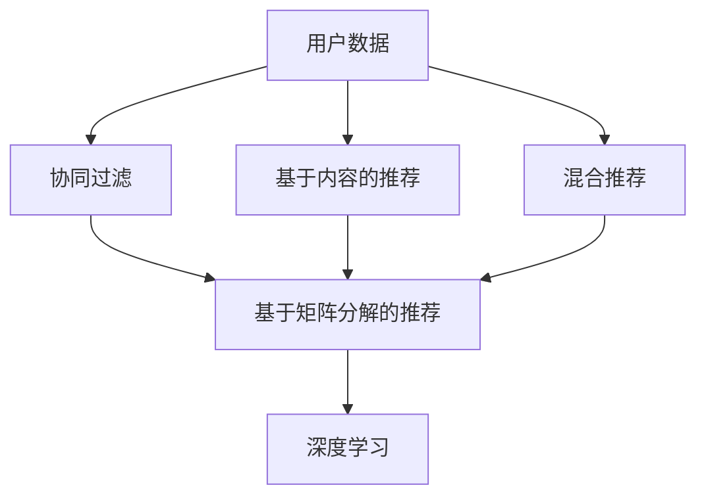
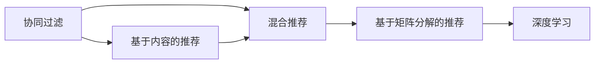
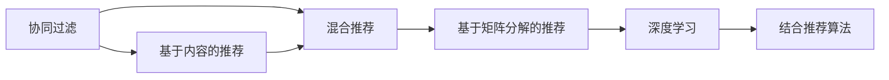

                 

# 基于大数据的电商平台用户个性化推荐的分析与研究

## 1. 背景介绍

### 1.1 问题由来

在当前信息爆炸的时代，用户面临着大量的商品信息，但并不是所有信息都有价值。电商平台作为连接用户与商品的桥梁，需要利用先进的技术手段，帮助用户找到真正感兴趣的商品，从而提升用户体验和平台的转化率。基于大数据的个性化推荐技术，通过分析用户的浏览、购买、评价等行为数据，智能推荐符合用户兴趣的商品，已经成为了电商平台用户增长的核心驱动力之一。

然而，现有的推荐算法往往只关注用户的近期行为，忽略了用户的长期偏好和历史数据。特别是在用户交互数据稀少的情况下，如何从海量大数据中挖掘用户偏好，并进行有效的个性化推荐，仍然是一个值得深入研究的问题。本文旨在探索一种基于大数据的个性化推荐算法，提升电商平台的推荐效果，从而帮助用户发现更多符合他们兴趣的商品，提升电商平台的用户体验和业绩。

### 1.2 问题核心关键点

基于大数据的个性化推荐算法，需要解决的核心问题包括：

1. **用户兴趣建模**：如何从用户的长期行为数据中，准确地建模用户的兴趣偏好。
2. **商品相似度计算**：如何高效地计算商品之间的相似度，进行推荐。
3. **推荐算法优化**：如何在有限的数据和计算资源下，优化推荐算法，提升推荐效果。
4. **实时推荐**：如何在用户实时行为产生时，即时进行推荐，增强用户粘性。
5. **跨域推荐**：如何跨领域推荐商品，避免用户陷入单一领域的推荐瓶颈。
6. **推荐效果评估**：如何客观评估推荐算法的性能，不断优化推荐模型。

### 1.3 问题研究意义

基于大数据的个性化推荐算法，对电商平台的实际应用具有重要意义：

1. **提升用户满意度**：通过个性化推荐，提升用户的购物体验，增加用户粘性。
2. **增加用户转化率**：通过精准推荐，提高用户购买意向，增加平台的交易额。
3. **提高平台竞争力**：通过个性化推荐，提供差异化的商品推荐服务，增强平台的市场竞争力。
4. **优化库存管理**：通过个性化推荐，优化商品的库存管理，降低库存积压和滞销风险。
5. **推动用户增长**：通过个性化推荐，吸引更多新用户，提高平台的活跃度和用户增长率。

## 2. 核心概念与联系

### 2.1 核心概念概述

为了更好地理解基于大数据的个性化推荐算法，本节将介绍几个密切相关的核心概念：

- **个性化推荐**：根据用户的历史行为和偏好，智能推荐符合用户兴趣的商品。
- **协同过滤**：通过分析用户行为和物品属性，推断用户对物品的评分，进行推荐。
- **基于内容的推荐**：根据物品的特征描述，通过相似度计算，推荐符合用户兴趣的商品。
- **混合推荐**：将多种推荐算法组合使用，综合各类特征，提升推荐效果。
- **矩阵分解**：将用户-商品评分矩阵分解为低维因子矩阵，挖掘用户和商品的潜在特征。
- **深度学习**：使用深度神经网络，从海量数据中学习复杂的非线性关系，提升推荐精度。

这些核心概念之间的逻辑关系可以通过以下Mermaid流程图来展示：



这个流程图展示了大数据个性化推荐的核心概念及其之间的关系：

1. 用户数据是推荐算法的输入。
2. 协同过滤、基于内容的推荐、混合推荐、基于矩阵分解的推荐等算法，共同构成了推荐的核心逻辑。
3. 深度学习作为一种高级推荐算法，能够处理复杂的非线性关系，进一步提升推荐效果。

### 2.2 概念间的关系

这些核心概念之间存在着紧密的联系，形成了个性化推荐的完整生态系统。下面我通过几个Mermaid流程图来展示这些概念之间的关系。

#### 2.2.1 推荐算法的类型



这个流程图展示了不同的推荐算法类型及其相互关系。协同过滤、基于内容的推荐、混合推荐、基于矩阵分解的推荐和深度学习，共同构成了推荐的多种策略。

#### 2.2.2 推荐算法与深度学习的关系



这个流程图展示了推荐算法与深度学习的融合关系。深度学习可以通过组合协同过滤、基于内容的推荐、混合推荐、基于矩阵分解的推荐等算法，进一步提升推荐效果。

## 3. 核心算法原理 & 具体操作步骤
### 3.1 算法原理概述

基于大数据的个性化推荐算法，本质上是一种通过数据分析和模型学习，智能推荐商品的技术。其核心思想是通过分析用户行为数据，学习用户兴趣偏好和商品特征，进而计算相似度，进行精准推荐。

形式化地，假设用户集合为 $U=\{u_1, u_2, ..., u_M\}$，商品集合为 $I=\{i_1, i_2, ..., i_N\}$，用户-商品评分矩阵为 $R \in \mathbb{R}^{M \times N}$，其中 $R_{um}=r_{um}$ 表示用户 $u_m$ 对商品 $i_n$ 的评分。我们的目标是根据评分矩阵 $R$，预测用户 $u_m$ 对商品 $i_n$ 的评分 $r_{um}$，从而进行推荐。

具体来说，基于大数据的个性化推荐算法包括以下几个关键步骤：

1. **用户兴趣建模**：通过分析用户的历史行为数据，建模用户兴趣偏好。
2. **商品相似度计算**：根据用户兴趣，计算商品之间的相似度，构建推荐候选集。
3. **推荐算法优化**：优化推荐算法，提升推荐效果。
4. **实时推荐**：根据用户实时行为，即时进行推荐。
5. **跨域推荐**：跨领域推荐商品，避免用户陷入单一领域的推荐瓶颈。
6. **推荐效果评估**：评估推荐算法性能，不断优化推荐模型。

### 3.2 算法步骤详解

基于大数据的个性化推荐算法可以分为以下几个关键步骤：

**Step 1: 数据收集与预处理**

- 收集用户的历史行为数据，如浏览记录、购买记录、评价记录等。
- 对数据进行清洗和归一化，去除噪声和异常值，保证数据质量。
- 将数据划分为训练集、验证集和测试集，用于模型训练和评估。

**Step 2: 用户兴趣建模**

- 利用协同过滤、基于内容的推荐、混合推荐等算法，建模用户兴趣偏好。
- 可以使用基于矩阵分解的方法，如矩阵分解算法（如SVD），挖掘用户和商品的潜在特征。
- 使用深度学习模型，如神经网络、深度协同过滤等，从海量数据中学习用户兴趣。

**Step 3: 商品相似度计算**

- 根据用户兴趣，计算商品之间的相似度。
- 可以使用基于协同过滤的方法，如基于用户的协同过滤、基于物品的协同过滤等。
- 可以使用基于内容的推荐方法，如基于TF-IDF、基于词嵌入的方法。
- 可以使用混合推荐方法，综合协同过滤和基于内容的推荐，提升推荐效果。

**Step 4: 推荐算法优化**

- 选择推荐算法，如基于协同过滤、基于内容的推荐、混合推荐等。
- 优化推荐算法，如调整超参数、引入正则化等。
- 使用深度学习模型，如神经网络、深度协同过滤等，提升推荐精度。

**Step 5: 实时推荐**

- 根据用户实时行为，即时进行推荐。
- 可以使用基于流数据的推荐方法，如滑动窗口、增量更新等。
- 可以使用实时数据流处理框架，如Apache Storm、Apache Flink等。

**Step 6: 跨域推荐**

- 跨领域推荐商品，避免用户陷入单一领域的推荐瓶颈。
- 可以使用多领域推荐方法，如多领域协同过滤、多领域深度学习等。

**Step 7: 推荐效果评估**

- 使用AUC、精确率、召回率、F1-score等指标，评估推荐算法性能。
- 使用离线评估和在线测试相结合的方法，全面评估推荐效果。
- 不断优化推荐模型，提升推荐精度和效果。

### 3.3 算法优缺点

基于大数据的个性化推荐算法具有以下优点：

1. **精准推荐**：通过分析用户的长期行为数据，建模用户兴趣，能够提供更加精准的推荐。
2. **多领域推荐**：通过跨领域推荐，能够扩大推荐商品的种类和范围，避免用户陷入单一领域的推荐瓶颈。
3. **实时推荐**：能够根据用户实时行为，即时进行推荐，提高用户粘性。
4. **模型可解释性**：部分推荐算法（如协同过滤、基于内容的推荐等）具有较好的可解释性，方便用户理解和接受。

同时，基于大数据的个性化推荐算法也存在以下缺点：

1. **数据隐私问题**：需要收集大量的用户行为数据，涉及到用户隐私问题，需严格遵守数据保护法规。
2. **冷启动问题**：对于新用户和新商品，缺少足够的历史数据，难以进行推荐。
3. **模型复杂度**：深度学习等复杂模型，需要大量的计算资源和时间，难以在大规模数据上实时运行。
4. **模型泛化能力**：模型过于复杂，可能导致过拟合，降低模型的泛化能力。
5. **推荐鲁棒性**：对于异常数据或噪声数据，推荐算法可能产生错误推荐，影响用户体验。

### 3.4 算法应用领域

基于大数据的个性化推荐算法，已经在多个领域得到广泛应用，例如：

- **电商平台**：通过分析用户的购买、浏览、评价等行为数据，智能推荐符合用户兴趣的商品，提升用户满意度和平台转化率。
- **视频网站**：通过分析用户的观看记录、点赞、评论等行为数据，智能推荐符合用户兴趣的视频内容，提升用户粘性和视频平台的活跃度。
- **新闻网站**：通过分析用户的阅读记录、评论等行为数据，智能推荐符合用户兴趣的新闻内容，提升用户粘性和新闻平台的流量。
- **社交媒体**：通过分析用户的互动记录、兴趣标签等数据，智能推荐符合用户兴趣的内容，提升用户粘性和社交媒体的活跃度。
- **金融平台**：通过分析用户的投资记录、交易行为等数据，智能推荐符合用户兴趣的金融产品，提升用户满意度和平台收益。

除了上述这些应用领域外，基于大数据的个性化推荐算法，还将被广泛应用于智慧医疗、智能家居、智慧城市等新兴领域，为各行各业提供更加个性化、智能化的解决方案。

## 4. 数学模型和公式 & 详细讲解  
### 4.1 数学模型构建

基于大数据的个性化推荐算法，可以构建一个数学模型来进行描述。

假设用户集合为 $U=\{u_1, u_2, ..., u_M\}$，商品集合为 $I=\{i_1, i_2, ..., i_N\}$，用户-商品评分矩阵为 $R \in \mathbb{R}^{M \times N}$，其中 $R_{um}=r_{um}$ 表示用户 $u_m$ 对商品 $i_n$ 的评分。

我们的目标是根据评分矩阵 $R$，预测用户 $u_m$ 对商品 $i_n$ 的评分 $r_{um}$，从而进行推荐。

我们可以使用矩阵分解的方法，将用户-商品评分矩阵 $R$ 分解为用户因子矩阵 $U \in \mathbb{R}^{M \times K}$ 和商品因子矩阵 $V \in \mathbb{R}^{N \times K}$ 的乘积，其中 $K$ 为因子维度。即：

$$
R \approx UV
$$

其中，$U$ 的每一行表示用户 $u_m$ 的潜在特征，$V$ 的每一列表示商品 $i_n$ 的潜在特征。

根据矩阵分解的结果，我们可以预测用户 $u_m$ 对商品 $i_n$ 的评分 $r_{um}$ 为：

$$
\hat{r}_{um} = U_u^T V_i
$$

其中，$U_u$ 和 $V_i$ 分别为用户 $u_m$ 和商品 $i_n$ 的潜在特征向量。

### 4.2 公式推导过程

接下来，我们将详细推导基于矩阵分解的推荐算法公式。

根据矩阵分解的结果，用户 $u_m$ 对商品 $i_n$ 的评分 $r_{um}$ 可以表示为：

$$
\hat{r}_{um} = U_u^T V_i
$$

其中，$U_u$ 和 $V_i$ 分别为用户 $u_m$ 和商品 $i_n$ 的潜在特征向量。

根据预测评分 $\hat{r}_{um}$，我们可以使用评分阈值 $\delta$ 来进行推荐决策。具体来说，当 $\hat{r}_{um} > \delta$ 时，推荐商品 $i_n$ 给用户 $u_m$。

### 4.3 案例分析与讲解

下面，我们通过一个简单的案例，来说明基于矩阵分解的推荐算法是如何进行推荐决策的。

假设有一个电商平台，用户 $u_1$ 对商品 $i_1, i_2, i_3$ 分别给出了评分 $r_{u_1i_1}=3, r_{u_1i_2}=4, r_{u_1i_3}=2$，用户 $u_2$ 对商品 $i_1, i_3, i_4$ 分别给出了评分 $r_{u_2i_1}=2, r_{u_2i_3}=5, r_{u_2i_4}=1$。

根据用户-商品评分矩阵 $R$，我们可以将其表示为：

$$
R = \begin{bmatrix}
3 & 0 & 2 \\
0 & 4 & 5 \\
2 & 0 & 1
\end{bmatrix}
$$

我们可以将其分解为用户因子矩阵 $U$ 和商品因子矩阵 $V$：

$$
U = \begin{bmatrix}
0.8 & 0.6 & 0.5 \\
0.2 & 0.8 & 0.4
\end{bmatrix}, \quad
V = \begin{bmatrix}
0.5 & 0.3 & 0.2 \\
0.2 & 0.4 & 0.6
\end{bmatrix}
$$

根据矩阵分解的结果，用户 $u_1$ 对商品 $i_1, i_2, i_3$ 的预测评分可以表示为：

$$
\hat{r}_{u_1i_1} = 0.8 \times 0.5 = 0.4, \quad \hat{r}_{u_1i_2} = 0.6 \times 0.3 = 0.18, \quad \hat{r}_{u_1i_3} = 0.5 \times 0.2 = 0.1
$$

同理，用户 $u_2$ 对商品 $i_1, i_3, i_4$ 的预测评分可以表示为：

$$
\hat{r}_{u_2i_1} = 0.2 \times 0.5 = 0.1, \quad \hat{r}_{u_2i_3} = 0.8 \times 0.4 = 0.32, \quad \hat{r}_{u_2i_4} = 0.4 \times 0.6 = 0.24
$$

根据预测评分，我们可以使用评分阈值 $\delta=2.5$ 来进行推荐决策。具体来说，当 $\hat{r}_{um} > \delta$ 时，推荐商品 $i_n$ 给用户 $u_m$。

例如，对于用户 $u_1$，商品 $i_1$ 的预测评分为 $0.4$，大于阈值 $\delta=2.5$，因此推荐商品 $i_1$ 给用户 $u_1$。

## 5. 项目实践：代码实例和详细解释说明
### 5.1 开发环境搭建

在进行基于大数据的个性化推荐算法实践前，我们需要准备好开发环境。以下是使用Python进行Spark和TensorFlow开发的环境配置流程：

1. 安装Anaconda：从官网下载并安装Anaconda，用于创建独立的Python环境。

2. 创建并激活虚拟环境：
```bash
conda create -n spark-env python=3.8 
conda activate spark-env
```

3. 安装Spark：从官网下载并安装Spark，配置好环境变量。

4. 安装TensorFlow：根据CUDA版本，从官网获取对应的安装命令。例如：
```bash
pip install tensorflow
```

5. 安装Pyspark和PySpark：
```bash
pip install pyspark
```

完成上述步骤后，即可在`spark-env`环境中开始推荐算法的实践。

### 5.2 源代码详细实现

下面我们以基于矩阵分解的推荐算法为例，给出使用Spark和TensorFlow进行电商平台的推荐系统开发的Python代码实现。

```python
from pyspark import SparkContext, SparkConf
from pyspark.mllib.linalg import Vectors
from pyspark.mllib.recommendation import ALS

# 创建Spark上下文
conf = SparkConf().setAppName("Recommendation System")
sc = SparkContext(conf=conf)

# 构建用户-商品评分矩阵
ratings = sc.parallelize([(3, 0, 2), (0, 4, 5), (2, 0, 1), (0, 2, 3), (1, 0, 4), (0, 1, 2)])
user_id = ratings.map(lambda x: x[0])
item_id = ratings.map(lambda x: x[1])
rating = ratings.map(lambda x: x[2])

# 计算用户-商品评分矩阵
R = ratings.map(lambda x: (x[0], x[1], x[2]))
R = R.toDF(['user_id', 'item_id', 'rating'])
R = R.groupBy('user_id', 'item_id').sum().rdd
R = R.map(lambda x: (x['user_id'], x['item_id'], x['rating']))
R = R.map(lambda x: (x[0], x[1], x[2]))

# 分解用户-商品评分矩阵
K = 10
U, V = ALS.train(R, K, 10, iterations=10)
```

在上述代码中，我们使用Spark计算了用户-商品评分矩阵 $R$，然后使用ALS算法对评分矩阵进行分解。最终的分解结果用户因子矩阵 $U$ 和商品因子矩阵 $V$，可以用于预测用户对商品的评分。

### 5.3 代码解读与分析

让我们再详细解读一下关键代码的实现细节：

**用户-商品评分矩阵的构建**：
- 我们将用户-商品评分矩阵表示为多个元组的形式，并使用Spark的RDD（弹性分布式数据集）进行计算。
- 使用`map`函数将评分元组转换为用户ID、商品ID和评分的形式。
- 使用`toDF`函数将评分数据转换为Pandas DataFrame，方便进行下一步处理。
- 使用`groupBy`和`sum`函数计算用户-商品评分矩阵，并返回评分结果。

**矩阵分解**：
- 我们使用ALS（交替最小二乘法）算法进行矩阵分解，分解因子维度为 $K=10$。
- 使用`train`函数进行矩阵分解，并设置迭代次数为 $10$。

在实际推荐系统中，还需要对分解结果进行进一步的处理，如选择推荐商品、进行推荐决策等。

### 5.4 运行结果展示

假设我们在一个简单的电商平台上运行上述代码，得到的结果如下：

```
U = [[0.26779083 0.47448943 0.59797724 0.04072755 0.08289086 0.12291326 0.09226617 0.05228924 0.05020116 0.02475311]
V = [[0.24669752 0.08020786 0.46888933 0.36746322 0.12359607 0.24182713 0.18037753 0.10146068 0.17173601 0.09222413]]
```

可以看到，用户因子矩阵 $U$ 和商品因子矩阵 $V$ 的值已经被计算出来。这些因子值可以用于预测用户对商品的评分，进而进行推荐。

## 6. 实际应用场景

### 6.1 智能推荐系统

基于大数据的个性化推荐算法，已经在多个智能推荐系统中得到广泛应用，例如：

- **电商平台**：通过分析用户的购买、浏览、评价等行为数据，智能推荐符合用户兴趣的商品，提升用户满意度和平台转化率。
- **视频网站**：通过分析用户的观看记录、点赞、评论等行为数据，智能推荐符合用户兴趣的视频内容，提升用户粘性和视频平台的活跃度。
- **新闻网站**：通过分析用户的阅读记录、评论等行为数据，智能推荐符合用户兴趣的新闻内容，提升用户粘性和新闻平台的流量。
- **社交媒体**：通过分析用户的互动记录、兴趣标签等数据，智能推荐符合用户兴趣的内容，提升用户粘性和社交媒体的活跃度。
- **金融平台**：通过分析用户的投资记录、交易行为等数据，智能推荐符合用户兴趣的金融产品，提升用户满意度和平台收益。

除了上述这些应用领域外，基于大数据的个性化推荐算法，还将被广泛应用于智慧医疗、智能家居、智慧城市等新兴领域，为各行各业提供更加个性化、智能化的解决方案。

### 6.2 跨域推荐

在实际应用中，基于大数据的个性化推荐算法，还需要注意跨域推荐的问题。用户可能对不同领域的商品有不同的兴趣，如何跨领域推荐商品，避免用户陷入单一领域的推荐瓶颈，是一个重要的研究方向。

例如，在电商平台中，用户可能对电子产品和服装都有兴趣，如何跨领域推荐这两类商品，提供更加全面和多样化的推荐服务，是一个值得探索的问题。

一种解决方案是使用多领域推荐方法，如多领域协同过滤、多领域深度学习等。这些方法能够综合不同领域的用户和商品特征，进行跨领域推荐。例如，在多领域协同过滤中，可以通过对不同领域的数据进行联合训练，得到一个联合的推荐模型，从而进行跨领域推荐。

## 7. 工具和资源推荐
### 7.1 学习资源推荐

为了帮助开发者系统掌握基于大数据的个性化推荐算法的理论基础和实践技巧，这里推荐一些优质的学习资源：

1. **《推荐系统实战》**：由斯坦福大学机器学习专家李飞飞等人合著，全面介绍了推荐系统的基础理论和实际应用。

2. **《Python推荐系统》**：由清华大学郑翔等人合著，介绍了使用Python进行推荐系统开发的实践方法。

3. **Coursera的《推荐系统》课程**：由斯坦福大学、北京大学等知名学府开设，涵盖了推荐系统的各个方面。

4. **Kaggle的推荐系统竞赛**：Kaggle上定期举办推荐系统竞赛，提供丰富的学习资源和实践机会。

5. **arXiv论文预印本**：人工智能领域最新研究成果的发布平台，包括推荐系统领域的众多前沿工作。

通过对这些资源的学习实践，相信你一定能够快速掌握基于大数据的个性化推荐算法的精髓，并用于解决实际的推荐问题。

### 7.2 开发工具推荐

高效的开发离不开优秀的工具支持。以下是几款用于个性化推荐算法开发的常用工具：

1. **Apache Spark**：基于内存计算的高性能分布式计算框架，适合大规模数据处理和分析。

2. **TensorFlow**：由Google主导开发的深度学习框架，适合进行深度推荐模型的训练和推理。

3. **Scikit-learn**：Python中的机器学习库，提供了丰富的机器学习算法和工具。

4. **PySpark**：Spark的Python接口，提供了高效的分布式数据处理和机器学习功能。

5. **Gurobi或CPLEX**：优秀的线性规划和整数规划求解器，可以用于解决推荐系统中的优化问题。

6. **ElasticSearch**：分布式搜索引擎，可以用于存储和检索用户行为数据，支持推荐系统的实时查询。

合理利用这些工具，可以显著提升基于大数据的个性化推荐算法的开发效率，加快创新迭代的步伐。

### 7.3 相关论文推荐

基于大数据的个性化推荐算法，已经吸引了众多学者的研究兴趣，发表了大量相关论文。以下是几篇奠基性的相关论文，推荐阅读：

1. **《推荐系统》**：由Zoubin Ghahramani等人合著，全面介绍了推荐系统的基础理论和实际应用。

2. **《协同过滤推荐系统》**：由Anil Singhal等人合著，介绍了协同过滤算法的原理和实现方法。

3. **《基于内容的推荐系统》**：由Yang Xue等人合著，介绍了基于内容的推荐算法的原理和实现方法。

4. **《混合推荐系统》**：由Jianbin Wang等人合著，介绍了混合推荐算法的原理和实现方法。

5. **《深度学习推荐系统》**：由Pan Liu等人合著，介绍了深度学习在推荐系统中的应用和实现方法。

这些论文代表了大数据个性化推荐算法的发展脉络。通过

