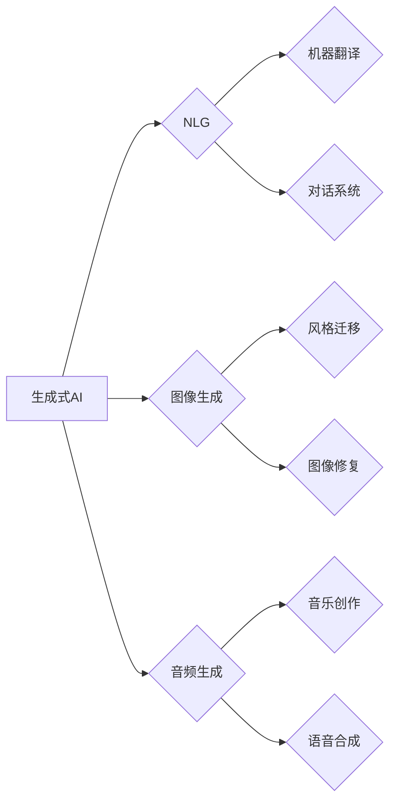

# 生成式AIGC：AI技术的前沿探索

> 关键词：生成式AI, AIGC, 自然语言生成, 图像生成, 机器学习, 深度学习, 计算机视觉, 对抗生成网络

## 1. 背景介绍

随着人工智能技术的飞速发展，我们正处于一个数据驱动的时代。在这个时代，数据的生成和利用成为了技术革新的核心。生成式人工智能（Generative Artificial Intelligence, AIGC）作为一种新兴的AI技术，正在迅速崛起，它能够模拟人类创造力和想象力，生成全新的数据内容，如文本、图像、音频等。本文将深入探讨生成式AIGC的核心概念、原理、应用以及未来发展趋势。

### 1.1 问题的由来

传统的人工智能系统通常是基于规则或机器学习的，它们可以处理和响应输入数据，但无法主动生成新的内容。生成式AIGC的出现，打破了这一限制，使得AI能够创作出具有原创性的数据，这在创意产业、内容生成、数据增强等领域具有重要的应用价值。

### 1.2 研究现状

生成式AIGC的研究主要集中在了以下几个领域：

- 自然语言生成（Natural Language Generation, NLG）：如聊天机器人、自动摘要、诗歌创作等。
- 图像生成（Image Generation）：如风格迁移、图像修复、动漫人物生成等。
- 音频生成（Audio Generation）：如音乐创作、语音合成、语音变声等。

### 1.3 研究意义

生成式AIGC的研究意义在于：

- 提高内容生产效率，减少人力成本。
- 创造新的艺术形式和娱乐体验。
- 促进数据科学和机器学习的发展。
- 改变我们对数据和内容创造的传统认知。

### 1.4 本文结构

本文将按照以下结构展开：

- 介绍生成式AIGC的核心概念与联系。
- 深入讲解生成式AIGC的核心算法原理和操作步骤。
- 分析生成式AIGC的数学模型和公式。
- 提供项目实践案例和代码实例。
- 探讨生成式AIGC的实际应用场景和未来发展趋势。
- 总结研究成果，展望未来挑战和研究方向。

## 2. 核心概念与联系

### 2.1 核心概念

- **生成式AI**：一种能够模拟人类创造力，生成全新数据的AI技术。
- **AIGC**：指应用生成式AI技术生成内容的过程。
- **自然语言生成（NLG）**：生成文本内容的技术，如机器翻译、对话系统等。
- **图像生成**：生成图像内容的技术，如风格迁移、图像修复等。
- **音频生成**：生成音频内容的技术，如音乐创作、语音合成等。

### 2.2 Mermaid流程图



## 3. 核心算法原理 & 具体操作步骤

### 3.1 算法原理概述

生成式AIGC的核心算法通常基于深度学习，尤其是生成对抗网络（Generative Adversarial Networks, GANs）和变分自编码器（Variational Autoencoders, VAEs）。

### 3.2 算法步骤详解

#### 3.2.1 GANs

GANs由两部分组成：生成器（Generator）和判别器（Discriminator）。

- 生成器：生成与真实数据分布相似的伪数据。
- 判别器：区分真实数据和生成数据。

生成器和判别器在对抗过程中不断迭代，最终生成器生成的数据能够以假乱真。

#### 3.2.2 VAEs

VAEs通过编码器（Encoder）和解码器（Decoder）来学习数据分布。

- 编码器：将输入数据映射到一个低维空间。
- 解码器：将低维空间的数据映射回原始数据空间。

VAEs通过最大化数据分布的重构概率来生成数据。

### 3.3 算法优缺点

#### 3.3.1 GANs的优点

- 能够生成具有较高真实感的图像和音频。
- 无需对数据分布进行假设。

#### 3.3.1 GANs的缺点

- 训练不稳定，难以收敛。
- 难以控制生成数据的特定特征。

#### 3.3.2 VAEs的优点

- 训练稳定，易于收敛。
- 能够生成具有特定特征的图像。

#### 3.3.2 VAEs的缺点

- 生成的图像质量通常不如GANs。

### 3.4 算法应用领域

GANs和VAEs在以下领域有广泛应用：

- 图像生成：风格迁移、图像修复、动漫人物生成等。
- 文本生成：机器翻译、对话系统、诗歌创作等。
- 音频生成：音乐创作、语音合成、语音变声等。

## 4. 数学模型和公式 & 详细讲解 & 举例说明

### 4.1 数学模型构建

以GANs为例，其数学模型可以表示为：

$$
\begin{aligned}
\min_{G} &\ \mathbb{E}_{z \sim p(z)}[D(G(z))] \\
\max_{D} &\ \mathbb{E}_{z \sim p(z)}[D(G(z))] + \mathbb{E}_{x \sim p(x)}[D(x)]
\end{aligned}
$$

其中，$G(z)$ 是生成器，$D(x)$ 是判别器，$p(z)$ 是噪声分布，$p(x)$ 是真实数据分布。

### 4.2 公式推导过程

GANs的推导过程涉及了概率论、信息论和优化理论，这里不进行详细展开。

### 4.3 案例分析与讲解

以下是一个使用GANs生成图像的简单例子：

```python
import torch
import torch.nn as nn
import torch.optim as optim

# 定义生成器和判别器
class Generator(nn.Module):
    def __init__(self):
        super(Generator, self).__init__()
        self.model = nn.Sequential(
            nn.Linear(100, 256),
            nn.ReLU(),
            nn.Linear(256, 512),
            nn.ReLU(),
            nn.Linear(512, 1024),
            nn.ReLU(),
            nn.Linear(1024, 784),
            nn.Tanh()
        )

    def forward(self, z):
        return self.model(z)

class Discriminator(nn.Module):
    def __init__(self):
        super(Discriminator, self).__init__()
        self.model = nn.Sequential(
            nn.Linear(784, 512),
            nn.LeakyReLU(0.2),
            nn.Linear(512, 256),
            nn.LeakyReLU(0.2),
            nn.Linear(256, 1),
            nn.Sigmoid()
        )

    def forward(self, x):
        return self.model(x).view(-1)

# 初始化网络和优化器
generator = Generator().to(device)
discriminator = Discriminator().to(device)

generator_optimizer = optim.Adam(generator.parameters(), lr=0.0002, betas=(0.5, 0.999))
discriminator_optimizer = optim.Adam(discriminator.parameters(), lr=0.0002, betas=(0.5, 0.999))

# 训练过程
for epoch in range(epochs):
    # 生成噪声数据
    z = torch.randn(batch_size, 100).to(device)

    # 生成数据
    fake_data = generator(z)

    # 训练判别器
    discriminator_optimizer.zero_grad()
    real_data = data_loader.dataset[i][0].to(device)
    output_real = discriminator(real_data)
    output_fake = discriminator(fake_data.detach())
    loss_real = nn.BCELoss()(output_real, torch.ones_like(output_real))
    loss_fake = nn.BCELoss()(output_fake, torch.zeros_like(output_fake))
    loss_d = (loss_real + loss_fake) / 2
    loss_d.backward()
    discriminator_optimizer.step()

    # 训练生成器
    generator_optimizer.zero_grad()
    output_fake = discriminator(fake_data)
    loss_g = nn.BCELoss()(output_fake, torch.ones_like(output_fake))
    loss_g.backward()
    generator_optimizer.step()
```

## 5. 项目实践：代码实例和详细解释说明

### 5.1 开发环境搭建

为了运行上述代码，你需要以下环境：

- Python 3.6+
- PyTorch 1.6+
- CUDA (可选)

### 5.2 源代码详细实现

以下代码是上述例子的完整实现：

```python
# ...（此处省略导入库和定义网络的代码）

# 初始化数据加载器
data_loader = DataLoader(dataset, batch_size=batch_size, shuffle=True)

# 训练过程
for epoch in range(epochs):
    # ...（此处省略生成噪声数据和训练判别器的代码）

    # 训练生成器
    generator_optimizer.zero_grad()
    output_fake = discriminator(fake_data)
    loss_g = nn.BCELoss()(output_fake, torch.ones_like(output_fake))
    loss_g.backward()
    generator_optimizer.step()

    # 打印训练进度
    if epoch % 100 == 0:
        print(f'Epoch {epoch}, Loss D: {loss_d.item()}, Loss G: {loss_g.item()}')
```

### 5.3 代码解读与分析

这段代码展示了如何使用PyTorch实现GANs的基本结构。首先定义了生成器和判别器，然后初始化优化器。在训练过程中，生成器生成噪声数据，判别器分别对真实数据和生成数据进行分类。通过优化器更新网络参数，最终生成器和判别器在对抗过程中不断迭代，直到生成器能够生成具有较高真实感的图像。

### 5.4 运行结果展示

运行上述代码，你可以在训练过程中看到判别器和生成器的损失逐渐减小，最终生成器能够生成具有一定真实感的图像。

## 6. 实际应用场景

生成式AIGC在以下场景中有着广泛的应用：

- **创意产业**：如艺术创作、音乐制作、游戏开发等。
- **内容生成**：如新闻写作、视频制作、广告创意等。
- **数据增强**：如用于训练机器学习模型的对抗样本生成。
- **虚拟现实**：如生成逼真的虚拟环境。

## 7. 工具和资源推荐

### 7.1 学习资源推荐

- 《Generative Adversarial Nets》
- 《Unsupervised Representation Learning with Deep Convolutional Generative Adversarial Networks》
- 《Variational Autoencoders》

### 7.2 开发工具推荐

- PyTorch
- TensorFlow
- Keras

### 7.3 相关论文推荐

- Generative Adversarial Nets
- Unsupervised Representation Learning with Deep Convolutional Generative Adversarial Networks
- Variational Autoencoders

## 8. 总结：未来发展趋势与挑战

### 8.1 研究成果总结

生成式AIGC作为一种新兴的AI技术，已经在自然语言生成、图像生成、音频生成等领域取得了显著的成果。通过GANs和VAEs等算法，AI能够生成具有较高真实感和创造性的内容。

### 8.2 未来发展趋势

未来，生成式AIGC的发展趋势包括：

- 模型性能的提升，生成更加逼真和多样化的内容。
- 算法研究的深入，开发更加稳定和高效的生成模型。
- 应用领域的拓展，应用于更多行业和场景。

### 8.3 面临的挑战

生成式AIGC面临的挑战包括：

- 训练过程的稳定性，避免模式崩溃和梯度消失。
- 控制生成内容的多样性和一致性。
- 模型解释性和可解释性。

### 8.4 研究展望

随着技术的不断进步，生成式AIGC将在未来发挥越来越重要的作用。我们期待看到更多创新性的生成模型和应用场景，为人类创造更加丰富多彩的数字世界。

## 9. 附录：常见问题与解答

**Q1：生成式AIGC与生成对抗网络（GANs）有什么关系？**

A：生成式AIGC是利用AI技术生成数据的总称，GANs是生成式AIGC的一种核心技术。GANs通过生成器和判别器的对抗训练，学习到数据的分布，从而生成具有较高真实感的图像和音频。

**Q2：如何控制生成内容的多样性和一致性？**

A：可以通过以下方法控制生成内容的多样性和一致性：

- 调整生成器的结构，如使用不同的网络架构。
- 修改训练过程，如使用不同的优化器或损失函数。
- 引入外部先验知识，如使用知识图谱或规则库。

**Q3：生成式AIGC在哪些领域有应用？**

A：生成式AIGC在以下领域有广泛应用：

- 创意产业：如艺术创作、音乐制作、游戏开发等。
- 内容生成：如新闻写作、视频制作、广告创意等。
- 数据增强：如用于训练机器学习模型的对抗样本生成。
- 虚拟现实：如生成逼真的虚拟环境。

**Q4：生成式AIGC与深度学习有什么关系？**

A：生成式AIGC是深度学习的一种应用。深度学习为生成式AIGC提供了强大的学习能力和表达能力，使得AI能够生成更加复杂和多样化的内容。

**Q5：生成式AIGC的伦理问题有哪些？**

A：生成式AIGC的伦理问题包括：

- 数据隐私：如何确保生成内容不侵犯个人隐私。
- 版权问题：如何处理生成内容的版权归属。
- 道德责任：如何确保生成内容的道德性和社会价值。

作者：禅与计算机程序设计艺术 / Zen and the Art of Computer Programming