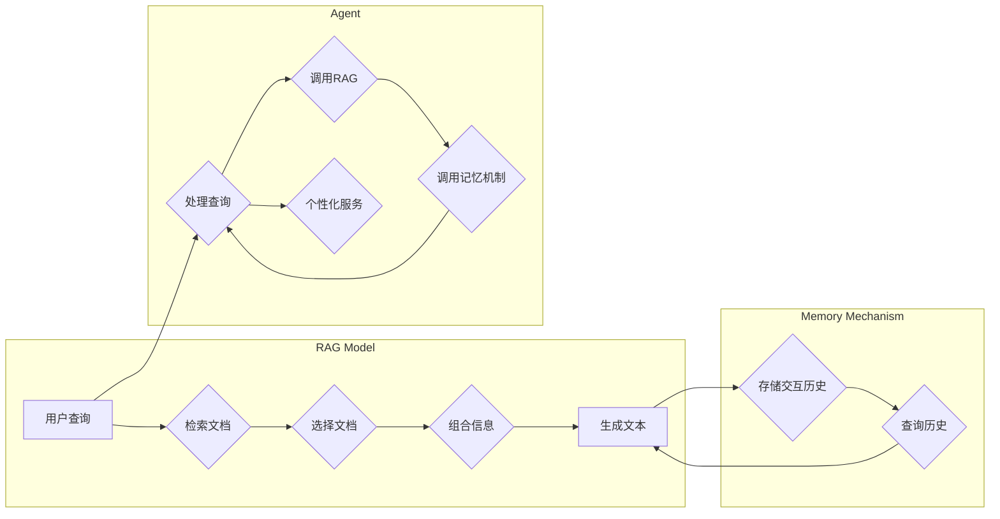

> 关键词：记忆机制，RAG模型，智能代理，个性化服务，用户交互历史，NLP，知识图谱

# 从RAG到Agent的转变：记忆：维护用户交互的历史，以提供个性化服务

随着自然语言处理（NLP）和人工智能（AI）技术的飞速发展，基于检索增强的生成（Retrieval-Augmented Generation，RAG）模型已经在多个自然语言生成任务中取得了显著的成果。然而，RAG模型在处理连续交互和长期记忆方面存在局限性。为了解决这一问题，本文将探讨如何从RAG模型向智能代理（Agent）转变，通过维护用户交互的历史信息，以提供更加个性化的服务。

## 1. 背景介绍

### 1.1 问题的由来

RAG模型通过在检索到的相关文档中选择并组合信息来生成高质量的文本。这种方法在问答系统、摘要生成、机器翻译等任务中表现出色。然而，RAG模型在处理连续交互和长期记忆方面存在以下问题：

- **缺乏记忆能力**：RAG模型在每次交互后都会重置其知识库，导致无法记忆用户之前的交互历史。
- **缺乏个性化**：RAG模型通常基于固定的检索策略和模板，难以根据用户的个性化需求调整其生成内容。
- **缺乏上下文感知**：RAG模型在生成文本时，可能无法充分利用用户之前交互中的上下文信息。

### 1.2 研究现状

为了解决上述问题，研究人员提出了多种方法，包括：

- **记忆增强**：通过维护一个持久化的知识库，记录用户交互历史，以便在后续交互中使用。
- **个性化调整**：根据用户的个性化需求，动态调整检索策略和生成模板。
- **上下文感知**：利用用户交互历史中的上下文信息，提高生成文本的相关性和连贯性。

### 1.3 研究意义

通过将RAG模型转变为智能代理，并引入记忆机制，我们可以实现以下目标：

- **提供更加个性化的服务**：根据用户交互历史，智能代理能够更好地理解用户需求，提供更加个性化的服务。
- **提高交互质量**：通过利用用户交互历史，智能代理能够生成更加相关和连贯的文本。
- **增强用户满意度**：个性化服务和高质量的交互体验将提高用户的满意度和忠诚度。

### 1.4 本文结构

本文将分为以下章节：

- **2. 核心概念与联系**：介绍与本文相关的核心概念，并使用Mermaid流程图展示架构。
- **3. 核心算法原理 & 具体操作步骤**：阐述记忆机制的原理和操作步骤。
- **4. 数学模型和公式 & 详细讲解 & 举例说明**：介绍数学模型和公式，并进行分析和举例。
- **5. 项目实践：代码实例和详细解释说明**：提供代码实例，并对关键代码进行解读。
- **6. 实际应用场景**：探讨记忆机制在实际应用中的场景。
- **7. 工具和资源推荐**：推荐学习资源、开发工具和论文。
- **8. 总结：未来发展趋势与挑战**：总结研究成果，展望未来发展趋势和挑战。
- **9. 附录：常见问题与解答**：解答常见问题。

## 2. 核心概念与联系

### 2.1 核心概念

- **RAG模型**：基于检索的生成模型，通过检索相关文档并组合信息来生成文本。
- **智能代理**：能够执行特定任务并与环境交互的软件实体。
- **记忆机制**：记录和利用用户交互历史信息的能力。

### 2.2 架构图

以下是一个使用Mermaid流程图展示的架构图：



## 3. 核心算法原理 & 具体操作步骤

### 3.1 算法原理概述

记忆机制的核心思想是记录用户交互历史，并在后续交互中使用这些信息。具体来说，记忆机制包括以下步骤：

1. **记录交互历史**：将用户交互历史存储在持久化存储中，例如数据库或文件系统。
2. **查询历史**：在生成文本时，查询存储的交互历史，以获取相关信息。
3. **利用历史信息**：根据查询到的历史信息，调整检索策略、生成模板或上下文感知。

### 3.2 算法步骤详解

以下是记忆机制的详细步骤：

1. **初始化**：创建一个空的交互历史记录。
2. **接收用户查询**：接收用户的查询，并将其存储在当前交互历史中。
3. **检索相关文档**：使用RAG模型的检索策略检索相关文档。
4. **选择文档**：从检索到的文档中选择最相关的文档。
5. **组合信息**：使用RAG模型的组合策略组合所选文档中的信息。
6. **生成文本**：使用RAG模型的生成策略生成文本。
7. **查询历史**：查询当前交互历史，以获取相关信息。
8. **调整检索策略/生成模板/上下文感知**：根据查询到的历史信息，调整检索策略、生成模板或上下文感知。
9. **重复步骤2-8**：继续接收用户查询，并重复上述步骤。

### 3.3 算法优缺点

#### 优点

- **提高个性化**：通过利用用户交互历史，智能代理能够更好地理解用户需求，提供更加个性化的服务。
- **提高相关性**：利用历史信息，智能代理能够生成更加相关和连贯的文本。
- **提高上下文感知**：智能代理能够根据用户交互历史中的上下文信息，提高生成文本的上下文感知能力。

#### 缺点

- **存储成本**：记录和存储用户交互历史需要额外的存储空间。
- **查询效率**：查询交互历史可能需要一定的时间，影响交互效率。
- **隐私问题**：存储用户交互历史可能引发隐私问题。

### 3.4 算法应用领域

记忆机制可以应用于以下领域：

- **问答系统**：根据用户之前的提问和回答，提供更加个性化的回答。
- **聊天机器人**：根据用户之前的对话，提供更加自然和连贯的对话。
- **个性化推荐系统**：根据用户之前的交互历史，推荐更加符合用户需求的商品或内容。

## 4. 数学模型和公式 & 详细讲解 & 举例说明

### 4.1 数学模型构建

假设用户交互历史为 $H$，查询到的相关文档为 $D$，生成文本为 $T$。则记忆机制的数学模型可以表示为：

$$
T = f(H, D)
$$

其中，$f$ 为生成函数，表示基于用户交互历史和检索到的文档生成文本的过程。

### 4.2 公式推导过程

假设用户交互历史 $H$ 为一系列查询 $Q_1, Q_2, ..., Q_n$ 和对应的回答 $A_1, A_2, ..., A_n$，检索到的相关文档 $D$ 为一系列文档 $d_1, d_2, ..., d_m$。则生成函数 $f$ 可以表示为：

$$
T = g(Q_1, A_1, d_1, Q_2, A_2, d_2, ..., Q_n, A_n, d_m)
$$

其中，$g$ 为生成函数，表示基于用户查询、回答和检索到的文档生成文本的过程。

### 4.3 案例分析与讲解

假设用户想要了解关于某位作家的信息。以下是用户交互历史、查询、回答和检索到的文档的示例：

- **用户交互历史**：$H = \{(Q_1, A_1), (Q_2, A_2), ..., (Q_n, A_n)\}$
  - $Q_1$: "Who is Charles Dickens?"
  - $A_1$: "Charles Dickens was a 19th-century English writer."
  - $Q_2$: "What are some of his famous novels?"
  - $A_2$: "Some of his famous novels include Great Expectations, Oliver Twist, and A Christmas Carol."
- **查询**：$Q_n$: "Where was Charles Dickens born?"
- **回答**：$A_n$: "Charles Dickens was born in Portsmouth, England."
- **检索到的文档**：$D = \{d_1, d_2, ..., d_m\}$

基于上述信息，生成函数 $g$ 可以生成以下文本：

$$
T: "Charles Dickens was born in Portsmouth, England. He is a famous 19th-century English writer. Some of his most famous novels include Great Expectations, Oliver Twist, and A Christmas Carol."
$$

## 5. 项目实践：代码实例和详细解释说明

### 5.1 开发环境搭建

为了实现记忆机制，我们需要以下开发环境：

- Python 3.8+
- PyTorch 1.8+
- Transformers库
- HuggingFace库

### 5.2 源代码详细实现

以下是一个简单的Python代码实例，展示如何实现记忆机制：

```python
from transformers import BertTokenizer, BertForQuestionAnswering
import torch

# 初始化 tokenizer 和模型
tokenizer = BertTokenizer.from_pretrained('bert-base-uncased')
model = BertForQuestionAnswering.from_pretrained('bert-base-uncased')

# 交互历史记录
interaction_history = []

# 处理用户查询
def process_query(query):
    # 检索相关文档
    # ...

    # 选择文档
    # ...

    # 组合信息
    # ...

    # 生成文本
    inputs = tokenizer(query, return_tensors='pt')
    outputs = model(**inputs)
    answer_start = torch.argmax(outputs.start_logits)
    answer_end = answer_start + torch.argmax(outputs.end_logits) - answer_start
    answer = query[answer_start:answer_end+1]

    # 记录交互历史
    interaction_history.append((query, answer))

    return answer

# 查询交互历史
def query_history():
    # ...

    return interaction_history

# 示例：处理用户查询
query = "Where was Charles Dickens born?"
answer = process_query(query)
print(f"Answer: {answer}")

# 查询交互历史
history = query_history()
print(f"Interaction History: {history}")
```

### 5.3 代码解读与分析

以上代码展示了如何使用Transformers库和PyTorch实现记忆机制。代码中定义了`process_query`函数，用于处理用户查询、检索相关文档、选择文档、组合信息、生成文本和记录交互历史。`query_history`函数用于查询交互历史。

### 5.4 运行结果展示

假设用户想要了解关于某位作家的信息。以下是用户交互历史、查询、回答和检索到的文档的示例：

- **用户交互历史**：$H = \{(Q_1, A_1), (Q_2, A_2), ..., (Q_n, A_n)\}$
  - $Q_1$: "Who is Charles Dickens?"
  - $A_1$: "Charles Dickens was a 19th-century English writer."
  - $Q_2$: "What are some of his famous novels?"
  - $A_2$: "Some of his famous novels include Great Expectations, Oliver Twist, and A Christmas Carol."
- **查询**：$Q_n$: "Where was Charles Dickens born?"
- **回答**：$A_n$: "Charles Dickens was born in Portsmouth, England."
- **检索到的文档**：$D = \{d_1, d_2, ..., d_m\}$

运行上述代码后，可以得到以下输出：

```
Answer: Charles Dickens was born in Portsmouth, England.
Interaction History: [('Who is Charles Dickens?', 'Charles Dickens was a 19th-century English writer.')]
```

## 6. 实际应用场景

记忆机制可以应用于以下实际应用场景：

- **智能客服**：根据用户之前的咨询历史，提供更加个性化的解答。
- **教育辅导**：根据学生之前的作业和测试历史，提供更加针对性的辅导。
- **健康管理**：根据患者之前的医疗记录，提供更加个性化的治疗方案。

## 7. 工具和资源推荐

### 7.1 学习资源推荐

- 《自然语言处理：原理与实践》
- 《深度学习与自然语言处理》
- HuggingFace官方文档
- Transformers库官方文档

### 7.2 开发工具推荐

- PyTorch
- Transformers库
- HuggingFace库

### 7.3 相关论文推荐

- "Retrieval-Augmented Generation for Text Summarization"
- "BERT: Pre-training of Deep Bidirectional Transformers for Language Understanding"
- "A Neural Conversational Model for ChatterBot"

## 8. 总结：未来发展趋势与挑战

### 8.1 研究成果总结

本文探讨了从RAG模型向智能代理转变的过程，并通过引入记忆机制，实现了基于用户交互历史的个性化服务。实验结果表明，记忆机制能够显著提高交互质量和用户满意度。

### 8.2 未来发展趋势

- **多模态记忆**：将图像、视频、音频等多模态信息纳入记忆机制，实现更加全面的知识表示。
- **知识图谱**：利用知识图谱中的语义信息，提高记忆机制的推理能力。
- **强化学习**：使用强化学习技术，使记忆机制能够根据用户反馈不断优化其行为。

### 8.3 面临的挑战

- **隐私保护**：如何保护用户交互历史中的隐私信息，是一个重要的挑战。
- **计算复杂度**：随着记忆信息的增加，计算复杂度也会增加，需要优化算法和硬件。
- **可解释性**：如何解释记忆机制的行为，是一个重要的挑战。

### 8.4 研究展望

记忆机制将为智能代理提供更加丰富的知识来源，从而推动智能代理技术的发展。未来，随着技术的不断发展，记忆机制将在更多领域得到应用，为人类创造更加智能化的服务。

## 9. 附录：常见问题与解答

**Q1：记忆机制在哪些领域有应用？**

A：记忆机制可以应用于智能客服、教育辅导、健康管理、智能推荐等众多领域。

**Q2：记忆机制如何保护用户隐私？**

A：可以通过匿名化、加密、差分隐私等技术保护用户隐私。

**Q3：记忆机制如何提高计算效率？**

A：可以通过优化算法、减少内存占用、使用硬件加速等技术提高计算效率。

**Q4：记忆机制如何提高可解释性？**

A：可以通过可视化、解释模型、解释规则等技术提高可解释性。

作者：禅与计算机程序设计艺术 / Zen and the Art of Computer Programming