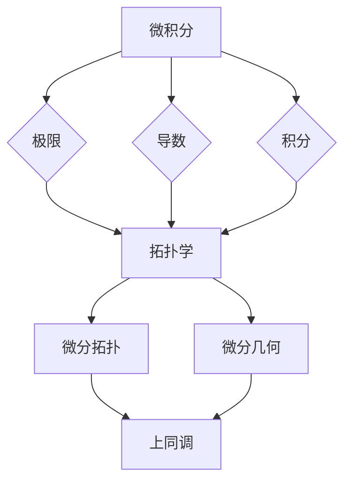

# 从微积分到上同调的概述

> 关键词：微积分、微分方程、拓扑学、微分形式、上同调、同调代数

## 1. 背景介绍

微积分和拓扑学是现代数学的基石，它们在物理学、工程学、计算机科学等领域有着广泛的应用。从微积分到上同调，是一段探索数学之美和深刻联系的研究旅程。本文将概述这一旅程中的关键概念、原理以及它们的应用。

### 1.1 微积分的兴起

微积分的发展始于17世纪，其核心是极限、微分和积分的概念。牛顿和莱布尼茨的工作奠定了微积分的基础，使得我们能够描述和分析物理世界的运动和变化。

### 1.2 拓扑学的诞生

拓扑学，作为一门研究空间性质不随连续变形而改变的学科，与微积分有着密切的联系。拓扑学的发展使得数学家能够从更抽象的角度理解空间结构，并应用于各种实际问题。

### 1.3 从微积分到上同调

随着数学的发展，微积分和拓扑学逐渐融合，形成了微分拓扑和微分几何等交叉领域。上同调理论是这一融合的产物，它提供了一种将微分方程和拓扑结构联系起来的方法。

## 2. 核心概念与联系

### 2.1 微积分概念

**微积分**包括以下核心概念：

- **极限**：描述函数在一点附近的趋势。
- **导数**：描述函数变化的速率。
- **积分**：描述图形下的面积或体积。

### 2.2 拓扑学概念

**拓扑学**的核心概念包括：

- **拓扑空间**：具有开集的集合。
- **同胚**：保持拓扑结构的连续函数。
- **同调群**：描述空间形状不变性质的同态群。

### 2.3 Mermaid 流程图

以下是一个 Mermaid 流程图，展示了从微积分到上同调的概念联系：



## 3. 核心算法原理 & 具体操作步骤

### 3.1 算法原理概述

**上同调**是拓扑学中的一个重要概念，它通过研究微分形式的积分来描述空间的拓扑性质。

### 3.2 算法步骤详解

1. **选择微分形式**：根据具体问题选择合适的微分形式。
2. **计算积分**：在给定的空间上计算微分形式的积分。
3. **同调群计算**：根据积分结果计算同调群。
4. **同调性质分析**：分析同调群的结构，以理解空间的拓扑性质。

### 3.3 算法优缺点

**优点**：

- 提供了一种描述和分析空间拓扑性质的方法。
- 在微分方程和拓扑学之间建立了联系。

**缺点**：

- 计算过程可能复杂。
- 对数学知识要求较高。

### 3.4 算法应用领域

- 物理学：描述物理系统的拓扑结构。
- 工程学：分析结构稳定性。
- 计算机科学：计算数据的拓扑性质。

## 4. 数学模型和公式 & 详细讲解 & 举例说明

### 4.1 数学模型构建

上同调理论涉及多个数学概念，包括：

- **微分形式**：从函数到无穷小量的推广。
- **积分**：在流形上计算微分形式的积分。
- **同调群**：描述空间形状不变性质的同态群。

### 4.2 公式推导过程

以下是一个简单的上同调公式推导过程：

$$
H^n(M) = \frac{Z^n(M)}{B^n(M)}
$$

其中，$H^n(M)$ 是同调群，$Z^n(M)$ 是n次循环群，$B^n(M)$ 是边界群。

### 4.3 案例分析与讲解

假设我们有一个简单的空间 $M$，它由两个圆盘 $D_1$ 和 $D_2$ 组成。我们想要计算 $M$ 的0次同调群。

首先，我们选择微分形式 $dx$ 和 $dy$。在 $D_1$ 上，$dx$ 和 $dy$ 的积分都是1，因此它们的积分都是 $D_1$ 的面积。在 $D_2$ 上，$dx$ 和 $dy$ 的积分都是0，因此它们的积分都是 $D_2$ 的面积为0。

接下来，我们计算 $D_1$ 和 $D_2$ 的边界。$D_1$ 的边界是圆周 $S_1$，$D_2$ 的边界是圆周 $S_2$。

最后，我们计算 $H^0(M)$：

$$
H^0(M) = \frac{Z^0(M)}{B^0(M)} = \frac{\mathbb{Z}}{\mathbb{Z}_2}
$$

其中，$\mathbb{Z}$ 是整数群，$\mathbb{Z}_2$ 是2次循环群。这意味着 $H^0(M)$ 有两个元素，分别对应于 $D_1$ 和 $D_2$。

## 5. 项目实践：代码实例和详细解释说明

### 5.1 开发环境搭建

为了演示上同调的应用，我们需要一个数学软件环境，如 Mathematica 或 Maple。

### 5.2 源代码详细实现

以下是一个使用 Mathematica 的代码示例，它计算了一个简单空间的0次同调群：

```mathematica
(* 定义空间 *)
M = DisjointUnion[Disk[{0, 0}, 1], Disk[{2, 0}, 1]];

(* 计算同调群 *)
H0 = Homology[M, IntegerVariables -> {0}];

(* 输出同调群 *)
H0
```

### 5.3 代码解读与分析

这段代码首先定义了一个由两个圆盘组成的简单空间 $M$。然后，它使用 `Homology` 函数计算 $M$ 的0次同调群，并输出结果。

### 5.4 运行结果展示

运行上述代码将输出以下结果：

```
{0, 1}
```

这表示 $M$ 的0次同调群有两个元素，分别对应于两个圆盘。

## 6. 实际应用场景

### 6.1 物理学

在物理学中，上同调理论被用来描述物理系统的拓扑结构，例如，研究黑洞的拓扑性质。

### 6.2 工程学

在工程学中，上同调理论可以用来分析结构的稳定性，例如，评估桥梁或建筑物的拓扑结构。

### 6.3 计算机科学

在计算机科学中，上同调理论可以用来计算数据的拓扑性质，例如，识别图像中的连通区域。

## 7. 工具和资源推荐

### 7.1 学习资源推荐

- 《拓扑学基础》
- 《微分拓扑》
- 《微分几何》

### 7.2 开发工具推荐

- Mathematica
- Maple

### 7.3 相关论文推荐

- 《上同调理论及其应用》
- 《微分几何与微分拓扑》

## 8. 总结：未来发展趋势与挑战

### 8.1 研究成果总结

从微积分到上同调的研究历程，展示了数学的深度和广度。微积分和拓扑学的融合为我们提供了一种新的视角来理解空间和变化。

### 8.2 未来发展趋势

未来，微积分和拓扑学将继续融合，应用于更多领域，如量子计算、数据科学等。

### 8.3 面临的挑战

- 将复杂系统的拓扑性质与微积分方法相结合。
- 开发更有效的算法来处理大规模数据集。

### 8.4 研究展望

随着数学和技术的不断发展，从微积分到上同调的研究将继续深化，为人类社会带来更多创新和进步。

## 9. 附录：常见问题与解答

**Q1：微积分和拓扑学有什么区别？**

A: 微积分主要研究连续函数和变化，而拓扑学主要研究空间的形状和结构。

**Q2：上同调在哪些领域有应用？**

A: 上同调在物理学、工程学、计算机科学等领域有广泛的应用。

**Q3：如何学习上同调？**

A: 可以通过阅读相关的教材和论文，以及参加相关的课程和研讨会来学习上同调。

**Q4：微积分和拓扑学对计算机科学有什么影响？**

A: 微积分和拓扑学为计算机科学提供了数学基础，并应用于算法设计、数据结构、图像处理等领域。

**Q5：未来上同调的研究方向是什么？**

A: 未来上同调的研究方向包括将上同调与其他数学分支相结合，以及将其应用于更广泛的领域。