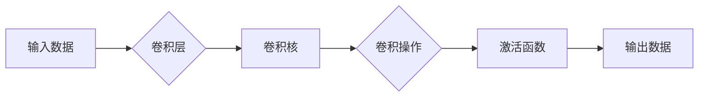

# 卷积层 (Convolutional Layer) 原理与代码实例讲解

> 关键词：卷积层，神经网络，深度学习，图像识别，CNN，激活函数，反向传播，Python，PyTorch

## 1. 背景介绍

卷积层（Convolutional Layer）是深度学习中用于处理图像、语音等数据的一种关键组件。在卷积神经网络（Convolutional Neural Network，CNN）中，卷积层能够自动学习数据中的特征，并在不同层次上提取出具有不同含义的特征表示。由于其在图像识别、视频分析、自然语言处理等领域的卓越表现，卷积层已成为深度学习中的核心技术之一。

## 2. 核心概念与联系

### 2.1 核心概念

#### 卷积层
卷积层通过卷积操作，将输入数据（如图像）与一组可学习的参数（即卷积核或过滤器）进行卷积，以提取特征。卷积操作可以看作是在滑动窗口上对输入数据进行加权求和。

#### 激活函数
激活函数为卷积层的输出添加非线性，使模型能够学习复杂的数据关系。常见的激活函数包括Sigmoid、ReLU、ReLU6、LeakyReLU、Tanh等。

#### 反向传播
反向传播是一种计算神经网络参数梯度的方法，用于指导参数更新，以最小化损失函数。

#### 卷积核
卷积核是一组可学习的参数，用于从输入数据中提取特征。卷积核的大小、数量和形状可以根据任务需求进行调整。

### 2.2 核心概念原理和架构的 Mermaid 流程图



### 2.3 核心概念之间的联系

卷积层通过卷积核提取输入数据中的特征，激活函数为这些特征添加非线性，反向传播则用于更新卷积核的参数，以优化模型性能。

## 3. 核心算法原理 & 具体操作步骤

### 3.1 算法原理概述

卷积层的算法原理主要包括以下步骤：

1. 输入数据通过卷积层，与卷积核进行卷积操作。
2. 卷积操作的结果经过激活函数处理，得到非线性激活值。
3. 激活值作为下一层的输入，或者直接用于模型的输出。

### 3.2 算法步骤详解

1. **初始化参数**：为卷积层初始化卷积核参数，通常使用均匀分布或高斯分布。
2. **卷积操作**：将输入数据与卷积核进行卷积操作，得到局部特征图。
3. **激活函数**：对局部特征图应用激活函数，增强模型的非线性能力。
4. **池化操作**（可选）：在激活函数之后，可以对特征图进行池化操作，降低特征维度，减少参数量，提高计算效率。
5. **反向传播**：计算损失函数关于卷积核的梯度，并更新卷积核参数。

### 3.3 算法优缺点

**优点**：
- **自动学习特征**：卷积层能够自动学习数据中的特征，无需人工设计。
- **参数数量少**：与全连接层相比，卷积层参数数量较少，计算效率较高。
- **泛化能力强**：卷积层能够提取具有空间局部性的特征，具有较强的泛化能力。

**缺点**：
- **对输入数据大小敏感**：卷积层的输入数据大小需要与卷积核大小相匹配。
- **计算复杂度较高**：与全连接层相比，卷积层的计算复杂度较高。

### 3.4 算法应用领域

卷积层广泛应用于图像识别、视频分析、自然语言处理等领域，如：

- 图像识别：对象检测、人脸识别、图像分类等。
- 视频分析：动作识别、视频分类、视频检索等。
- 自然语言处理：文本分类、情感分析、机器翻译等。

## 4. 数学模型和公式 & 详细讲解 & 举例说明

### 4.1 数学模型构建

卷积层的数学模型可以表示为：

$$
y = f(W \odot x + b)
$$

其中，$y$ 为输出特征图，$W$ 为卷积核，$x$ 为输入数据，$\odot$ 表示卷积操作，$b$ 为偏置项，$f$ 为激活函数。

### 4.2 公式推导过程

假设输入数据为 $x \in \mathbb{R}^{C \times H \times W}$，其中 $C$ 为通道数，$H$ 和 $W$ 分别为高度和宽度。卷积核 $W$ 的大小为 $K \times K$，其中 $K$ 为卷积核的高度和宽度。

卷积操作的计算公式为：

$$
y_{i,j} = \sum_{c=1}^C \sum_{p=1}^K \sum_{q=1}^K W_{c,p,q} x_{c,(i+p-1),(j+q-1)}
$$

其中，$y_{i,j}$ 为输出特征图在位置 $(i,j)$ 的值，$W_{c,p,q}$ 为卷积核在位置 $(p,q)$ 的权重，$x_{c,(i+p-1),(j+q-1)}$ 为输入数据在位置 $(i+p-1,j+q-1)$ 的值。

### 4.3 案例分析与讲解

以下以一个简单的卷积层为例，展示如何使用PyTorch实现卷积操作。

```python
import torch
import torch.nn as nn

# 创建一个3通道、5x5的卷积核
W = torch.randn(3, 5, 5)
# 创建一个3x3的输入数据
x = torch.randn(3, 3, 3)
# 进行卷积操作
y = torch.nn.functional.conv2d(x, W)
```

在上面的代码中，我们首先导入了PyTorch库，并创建了一个3通道、5x5的随机卷积核 $W$ 和一个3x3的随机输入数据 $x$。然后，我们使用 `torch.nn.functional.conv2d` 函数进行卷积操作，得到输出特征图 $y$。

## 5. 项目实践：代码实例和详细解释说明

### 5.1 开发环境搭建

为了方便演示，我们将使用PyTorch框架来实现一个简单的卷积神经网络。以下是在Python环境中搭建PyTorch开发环境的基本步骤：

1. 安装Python 3.x版本。
2. 安装PyTorch库：
```bash
pip install torch torchvision
```
3. 安装PyTorch Visualization工具库：
```bash
pip install tensorboardX
```

### 5.2 源代码详细实现

以下是一个简单的卷积神经网络示例，包含一个卷积层和一个全连接层：

```python
import torch
import torch.nn as nn

# 定义卷积神经网络模型
class ConvNet(nn.Module):
    def __init__(self):
        super(ConvNet, self).__init__()
        self.conv1 = nn.Conv2d(1, 6, 3)  # 1通道输入，6个卷积核，3x3卷积核
        self.fc1 = nn.Linear(6 * 6 * 6, 16)  # 输入维度为6*6*6，输出维度为16
        self.fc2 = nn.Linear(16, 10)  # 输入维度为16，输出维度为10

    def forward(self, x):
        x = self.conv1(x)
        x = nn.functional.relu(x)
        x = nn.functional.max_pool2d(x, 2, 2)
        x = torch.flatten(x, 1)
        x = self.fc1(x)
        x = nn.functional.relu(x)
        x = self.fc2(x)
        return x

# 创建卷积神经网络模型实例
model = ConvNet()

# 创建随机输入数据
x = torch.randn(1, 1, 28, 28)

# 前向传播
output = model(x)

print(output)
```

在上面的代码中，我们首先导入了PyTorch库，并定义了一个名为 `ConvNet` 的卷积神经网络模型。该模型包含一个卷积层、两个全连接层，以及ReLU激活函数和最大池化层。然后，我们创建了一个随机输入数据 `x`，并使用 `model` 对其进行前向传播，得到模型的输出。

### 5.3 代码解读与分析

1. `ConvNet` 类继承自 `nn.Module` 类，表示一个自定义神经网络模型。
2. 在 `__init__` 方法中，我们初始化了模型的各个组件，包括卷积层、全连接层、激活函数和池化层。
3. 在 `forward` 方法中，我们实现了模型的前向传播过程。首先，输入数据通过卷积层 `conv1`，然后应用ReLU激活函数，接着进行最大池化操作，最后通过全连接层 `fc1` 和 `fc2`。
4. 在代码的最后，我们创建了一个 `ConvNet` 实例 `model`，并使用随机输入数据 `x` 进行前向传播，得到模型的输出。

### 5.4 运行结果展示

执行上述代码后，你将在控制台看到模型的输出。这是一个包含10个元素的张量，表示经过卷积神经网络处理后，输入数据的10个分类结果。

## 6. 实际应用场景

卷积层在以下实际应用场景中发挥着重要作用：

- **图像识别**：在图像识别任务中，卷积层能够自动学习图像中的特征，如边缘、角点、纹理等，从而实现准确的图像分类。
- **目标检测**：在目标检测任务中，卷积层能够检测图像中的物体位置和类别，从而实现实时物体检测。
- **视频分析**：在视频分析任务中，卷积层能够提取视频帧中的关键信息，从而实现动作识别、视频分类等任务。

## 7. 工具和资源推荐

### 7.1 学习资源推荐

1. 《深度学习》系列书籍：介绍深度学习基本原理和常用算法。
2. PyTorch官方文档：提供PyTorch框架的详细文档和教程。
3. Fast.ai深度学习课程：提供免费的深度学习课程和配套教材。

### 7.2 开发工具推荐

1. PyTorch：一个开源的深度学习框架，支持Python编程语言。
2. Jupyter Notebook：一个交互式计算平台，可以方便地进行数据分析和可视化。

### 7.3 相关论文推荐

1. "A Convolutional Neural Network Approach for Image Classification" by Yann LeCun et al.
2. "Visual Geometry Group –牛津大学计算机视觉组"：提供最新的视觉和图像处理研究进展。

## 8. 总结：未来发展趋势与挑战

### 8.1 研究成果总结

本文介绍了卷积层的基本原理、算法步骤、优缺点和应用领域。通过实例演示了如何使用PyTorch框架实现卷积层，并展示了卷积层在图像识别、目标检测和视频分析等领域的应用。

### 8.2 未来发展趋势

1. **轻量级卷积层**：为了适应移动设备和嵌入式系统，轻量级卷积层研究将成为未来趋势。
2. **动态卷积层**：动态卷积层可以根据输入数据动态调整卷积核的大小和数量，提高模型适应性和泛化能力。
3. **可解释性卷积层**：可解释性卷积层能够解释模型的决策过程，提高模型的可靠性和可信度。

### 8.3 面临的挑战

1. **计算资源消耗**：卷积层的计算复杂度较高，对计算资源的要求较高。
2. **参数数量**：卷积层的参数数量较多，可能导致过拟合和过学习。
3. **模型可解释性**：卷积层的决策过程难以解释，需要进一步研究提高模型的可解释性。

### 8.4 研究展望

未来，卷积层的研究将朝着以下方向发展：

1. **高效计算**：研究更高效的卷积层算法，降低计算资源消耗。
2. **模型压缩**：研究模型压缩技术，减小模型尺寸和参数数量。
3. **可解释性**：研究可解释性卷积层，提高模型的可解释性和可信度。

## 9. 附录：常见问题与解答

**Q1：卷积层与全连接层有何区别？**

A：卷积层主要用于处理具有空间结构的输入数据，如图像和视频。全连接层主要用于处理向量数据。卷积层通过卷积核提取输入数据中的特征，而全连接层通过线性组合提取特征。

**Q2：卷积核的大小如何选择？**

A：卷积核的大小取决于具体任务和数据。通常情况下，卷积核大小为3x3或5x5。

**Q3：卷积层中的激活函数有哪些？**

A：常见的激活函数包括Sigmoid、ReLU、ReLU6、LeakyReLU、Tanh等。

**Q4：卷积层在图像识别中的应用有哪些？**

A：卷积层在图像识别中可以用于提取图像特征、分类、目标检测等。

**Q5：如何提高卷积层的性能？**

A：提高卷积层性能的方法包括：
1. 增加卷积核数量和大小。
2. 使用更复杂的卷积层结构，如深度可分离卷积。
3. 使用更高效的优化算法，如AdamW、SGD等。

作者：禅与计算机程序设计艺术 / Zen and the Art of Computer Programming