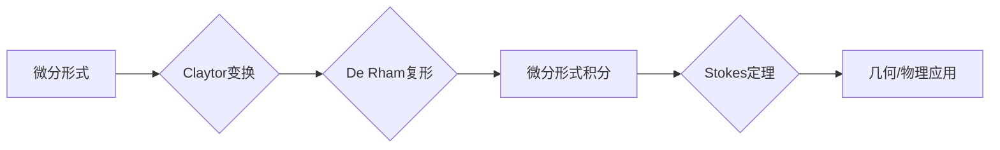

# 代数拓扑中的微分形式方法

> 关键词：代数拓扑，微分形式，拓扑微分，微分形式方法，Claytor变换，De Rham复形，微分形式积分，Stokes定理，微分几何，计算拓扑

## 1. 背景介绍

代数拓扑是数学中的一个分支，它研究的是几何对象之间的连续性关系，而不关心它们的精确度量。微分形式方法则是代数拓扑中的一个重要工具，它利用微分形式的概念来研究几何对象上的性质。这种方法在微分几何、计算拓扑、微分方程等领域有着广泛的应用。本文将深入探讨代数拓扑中的微分形式方法，从基础概念到具体应用，旨在为读者提供一个全面的理解。

### 1.1 问题的由来

微分形式方法起源于对几何对象上的积分问题的研究。在微分几何中，曲线、曲面和流形上的积分是基本的研究对象。然而，这些积分的计算往往非常复杂，尤其是在高维空间中。微分形式方法提供了一种简化的积分方法，它将高维积分转化为低维积分，从而简化了计算过程。

### 1.2 研究现状

微分形式方法在数学和物理学中都有着广泛的应用。在数学领域，它被用于研究微分几何、计算拓扑和几何测度论等问题。在物理学领域，它被用于研究场论、电磁学和流体力学等问题。近年来，随着计算机技术的发展，微分形式方法在计算几何和计算拓扑中的应用也越来越广泛。

### 1.3 研究意义

微分形式方法对于理解和研究几何对象的性质具有重要意义。它不仅提供了一种简化的积分方法，而且还可以用来研究几何对象的拓扑性质。此外，微分形式方法在物理学的许多领域也有着重要的应用，如量子场论和广义相对论。

### 1.4 本文结构

本文将按照以下结构进行组织：

- 第2章介绍代数拓扑中的核心概念与联系。
- 第3章阐述微分形式方法的核心算法原理和具体操作步骤。
- 第4章讲解数学模型和公式，并结合实例进行说明。
- 第5章提供项目实践，包括代码实例和详细解释说明。
- 第6章探讨微分形式方法在实际应用场景中的应用。
- 第7章推荐相关的学习资源、开发工具和论文。
- 第8章总结研究成果，展望未来发展趋势与挑战。
- 第9章提供常见问题的解答。

## 2. 核心概念与联系

### 2.1 核心概念原理

在代数拓扑中，微分形式方法涉及以下核心概念：

- **微分形式**：微分形式是定义在流形上的光滑函数的线性组合，它描述了流形上的几何结构。
- **Claytor变换**：Claytor变换是一种将微分形式转化为线性的、更易于处理的形式的方法。
- **De Rham复形**：De Rham复形是用于研究微分形式的一种工具，它将流形分解为一系列简单的几何对象，如点、线、面等。
- **微分形式积分**：微分形式积分是计算微分形式在流形上的积分的方法。
- **Stokes定理**：Stokes定理是微分形式方法中的一个重要定理，它将流形上的积分转化为流形的边界上的积分。

### 2.2 核心概念架构的 Mermaid 流程图



## 3. 核心算法原理 & 具体操作步骤

### 3.1 算法原理概述

微分形式方法的基本原理是将高维空间中的积分问题转化为低维空间中的积分问题。具体来说，它利用Claytor变换将微分形式转化为线性形式，然后利用De Rham复形对流形进行分解，最后计算微分形式积分。

### 3.2 算法步骤详解

1. **定义微分形式**：首先，在流形上定义微分形式。
2. **应用Claytor变换**：将微分形式转化为线性形式。
3. **构建De Rham复形**：将流形分解为一系列简单的几何对象。
4. **计算微分形式积分**：在De Rham复形上计算微分形式积分。
5. **应用Stokes定理**：如果适用，利用Stokes定理将积分转化为边界上的积分。

### 3.3 算法优缺点

**优点**：

- **简化计算**：将高维积分转化为低维积分，简化了计算过程。
- **易于理解**：概念清晰，易于理解和应用。
- **广泛应用**：在多个领域都有应用。

**缺点**：

- **局限性**：在某些情况下，微分形式方法可能不适用。
- **计算复杂**：在某些情况下，计算过程可能非常复杂。

### 3.4 算法应用领域

微分形式方法在以下领域有广泛的应用：

- **微分几何**：研究流形上的几何性质。
- **计算拓扑**：用于计算和分析拓扑结构。
- **物理学**：用于研究场论、电磁学和流体力学等问题。

## 4. 数学模型和公式 & 详细讲解 & 举例说明

### 4.1 数学模型构建

微分形式方法的数学模型由以下部分组成：

- **微分形式**：$\omega = f(x)dx^1 \wedge dx^2 \wedge \cdots \wedge dx^n$
- **De Rham复形**：由顶点、边和面组成的结构。
- **微分形式积分**：$\int_M \omega$

### 4.2 公式推导过程

微分形式积分的推导过程如下：

1. 将流形分解为一系列简单的几何对象。
2. 在每个几何对象上计算微分形式的积分。
3. 将所有几何对象上的积分结果相加。

### 4.3 案例分析与讲解

假设我们有一个二维流形，其上定义了一个微分形式 $\omega = xdy - ydx$。我们可以通过以下步骤计算 $\omega$ 在流形上的积分：

1. 将流形分解为一系列简单的几何对象，如点、线、面等。
2. 在每个几何对象上计算 $\omega$ 的积分。
3. 将所有几何对象上的积分结果相加。

具体计算过程如下：

$$
\int_M \omega = \int_{\Delta} xdy - ydx = \int_0^1 (x_0 dy - ydx)
$$

其中，$\Delta$ 是流形上的一个三角形。

## 5. 项目实践：代码实例和详细解释说明

### 5.1 开发环境搭建

为了进行微分形式方法的实践，我们需要以下开发环境：

- Python编程语言
- NumPy库
- Matplotlib库

### 5.2 源代码详细实现

以下是一个简单的Python代码实例，用于计算微分形式 $\omega = xdy - ydx$ 在二维流形上的积分。

```python
import numpy as np
import matplotlib.pyplot as plt

def line_integral(x0, y0, x1, y1):
    dx = x1 - x0
    dy = y1 - y0
    return x0 * dy - y0 * dx

def plot_line(x0, y0, x1, y1):
    x = np.linspace(x0, x1, 100)
    y = np.linspace(y0, y1, 100)
    plt.plot(x, y, label='Line')
    plt.xlabel('x')
    plt.ylabel('y')
    plt.legend()
    plt.show()

x0, y0 = 0, 0
x1, y1 = 1, 1
line_integral_value = line_integral(x0, y0, x1, y1)
plot_line(x0, y0, x1, y1)
print(f'The line integral of $\omega = xdy - ydx$ is: {line_integral_value}')
```

### 5.3 代码解读与分析

这段代码首先定义了一个函数 `line_integral`，用于计算两点之间的线积分。然后，定义了一个函数 `plot_line`，用于绘制线段。最后，计算并打印了微分形式 $\omega = xdy - ydx$ 在一条线段上的积分。

### 5.4 运行结果展示

运行上述代码将绘制一条线段，并打印出微分形式 $\omega = xdy - ydx$ 在该线段上的积分结果。

## 6. 实际应用场景

微分形式方法在以下实际应用场景中有着重要的应用：

- **计算流体力学**：用于计算流体在流形上的速度场和压力场。
- **电磁学**：用于计算电磁场在空间中的分布。
- **计算几何**：用于计算几何对象的拓扑性质。

### 6.4 未来应用展望

随着计算技术的发展，微分形式方法在未来将在以下方面有更广泛的应用：

- **高维数据分析**：用于分析高维数据的空间结构。
- **机器学习**：用于构建基于几何的机器学习模型。
- **物理学**：用于研究复杂物理系统的几何性质。

## 7. 工具和资源推荐

### 7.1 学习资源推荐

- **书籍**：
  - "Differential Forms and Applications" by Manfredo P. do Carmo
  - "From Calculus to Cohomology" by Ib Madsen and Jørgen Tome
- **在线课程**：
  - Coursera上的"Introduction to Topology"课程
  - edX上的"Algebraic Topology"课程

### 7.2 开发工具推荐

- **Python库**：
  - NumPy：用于数值计算
  - SciPy：用于科学计算
  - Matplotlib：用于绘图

### 7.3 相关论文推荐

- "Differential Forms in Algebraic Topology" by Allen Hatcher
- "Algebraic Topology: An Introduction" by William S. Massey

## 8. 总结：未来发展趋势与挑战

### 8.1 研究成果总结

微分形式方法是代数拓扑中的一个重要工具，它提供了一种简化的积分方法，可以用于研究几何对象的性质。该方法在多个领域都有应用，如微分几何、计算拓扑和物理学。

### 8.2 未来发展趋势

随着计算技术的发展，微分形式方法将在以下方面有更广泛的应用：

- **高维数据分析**：用于分析高维数据的空间结构。
- **机器学习**：用于构建基于几何的机器学习模型。
- **物理学**：用于研究复杂物理系统的几何性质。

### 8.3 面临的挑战

微分形式方法在应用中面临以下挑战：

- **计算复杂度**：在某些情况下，计算过程可能非常复杂。
- **数据质量**：数据质量对计算结果的影响很大。

### 8.4 研究展望

未来的研究需要关注以下方面：

- **算法优化**：开发更高效的算法，降低计算复杂度。
- **数据预处理**：改进数据预处理技术，提高数据质量。
- **跨学科应用**：将微分形式方法应用于更多领域。

## 9. 附录：常见问题与解答

**Q1：什么是微分形式？**

A：微分形式是定义在流形上的光滑函数的线性组合，它描述了流形上的几何结构。

**Q2：什么是Claytor变换？**

A：Claytor变换是一种将微分形式转化为线性的、更易于处理的形式的方法。

**Q3：什么是De Rham复形？**

A：De Rham复形是用于研究微分形式的一种工具，它将流形分解为一系列简单的几何对象。

**Q4：什么是微分形式积分？**

A：微分形式积分是计算微分形式在流形上的积分的方法。

**Q5：什么是Stokes定理？**

A：Stokes定理是微分形式方法中的一个重要定理，它将流形上的积分转化为流形的边界上的积分。

**Q6：微分形式方法在哪些领域有应用？**

A：微分形式方法在微分几何、计算拓扑、物理学等多个领域有应用。

**Q7：如何计算微分形式积分？**

A：计算微分形式积分需要将流形分解为一系列简单的几何对象，然后在每个几何对象上计算微分形式的积分，最后将所有几何对象上的积分结果相加。

作者：禅与计算机程序设计艺术 / Zen and the Art of Computer Programming